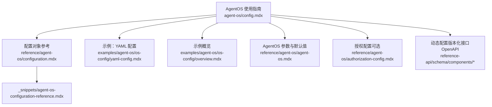
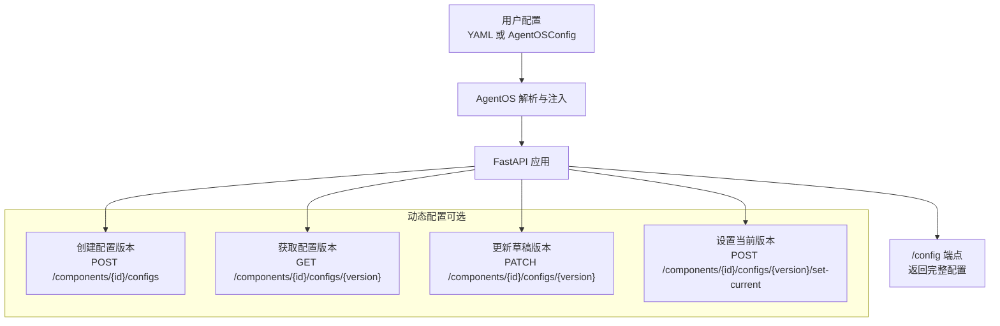
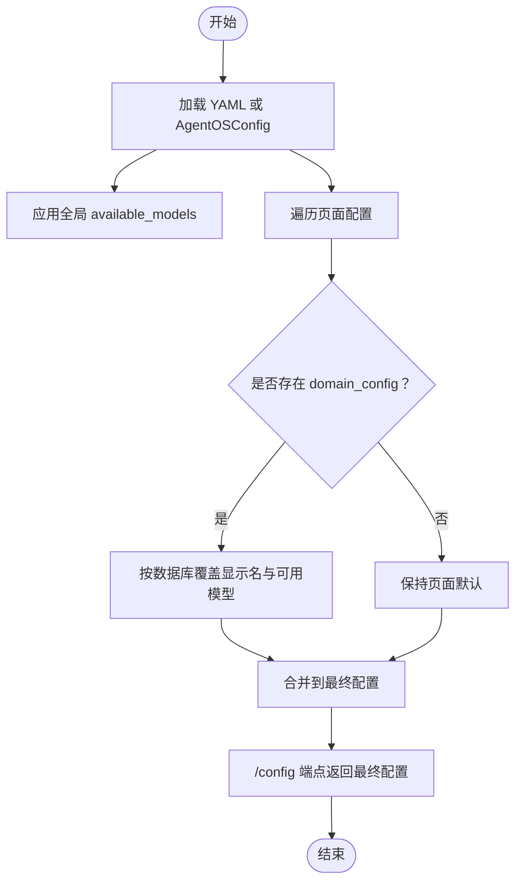
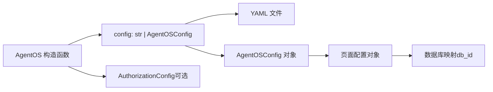

# 配置管理

<cite>
**本文引用的文件**
- [agent-os/config.mdx](file://agent-os/config.mdx)
- [reference/agent-os/configuration.mdx](file://reference/agent-os/configuration.mdx)
- [_snippets/agent-os-configuration-reference.mdx](file://_snippets/agent-os-configuration-reference.mdx)
- [reference/agent-os/agent-os.mdx](file://reference/agent-os/agent-os.mdx)
- [examples/agent-os/os-config/yaml-config.mdx](file://examples/agent-os/os-config/yaml-config.mdx)
- [examples/agent-os/os-config/overview.mdx](file://examples/agent-os/os-config/overview.mdx)
- [reference/agent-os/authorization-config.mdx](file://reference/agent-os/authorization-config.mdx)
- [reference-api/schema/components/create-config-version.mdx](file://reference-api/schema/components/create-config-version.mdx)
- [reference-api/schema/components/get-config-version.mdx](file://reference-api/schema/components/get-config-version.mdx)
- [reference-api/schema/components/update-draft-config.mdx](file://reference-api/schema/components/update-draft-config.mdx)
- [reference-api/schema/components/set-current-config-version.mdx](file://reference-api/schema/components/set-current-config-version.mdx)
</cite>

## 目录
1. [简介](#简介)
2. [项目结构](#项目结构)
3. [核心组件](#核心组件)
4. [架构总览](#架构总览)
5. [详细组件分析](#详细组件分析)
6. [依赖关系分析](#依赖关系分析)
7. [性能考量](#性能考量)
8. [故障排查指南](#故障排查指南)
9. [结论](#结论)
10. [附录](#附录)

## 简介
本技术文档聚焦于 AgentOS 的配置管理能力，系统性介绍 YAML 配置文件的结构与参数、AgentOSConfig 对象的使用方法、各页面配置项（聊天、会话、知识库、内存、评估、指标）的作用与默认行为，并给出典型场景的配置示例、配置优先级与覆盖规则说明，以及运行时动态更新配置的可行路径与最佳实践。目标是帮助读者在开发、部署与运维 AgentOS 实例时，能够快速、安全地完成配置并按需扩展。

## 项目结构
与配置管理直接相关的文档主要分布在以下位置：
- 使用指南：agent-os/config.mdx
- 配置对象参考：reference/agent-os/configuration.mdx 与 _snippets/agent-os-configuration-reference.mdx
- AgentOS 构造参数与默认行为：reference/agent-os/agent-os.mdx
- 示例：examples/agent-os/os-config/*
- 安全授权配置：reference/agent-os/authorization-config.mdx
- 动态配置版本化接口（OpenAPI）：reference-api/schema/components/*

**图表来源**
- [agent-os/config.mdx:1-213](file://agent-os/config.mdx#L1-L213)
- [reference/agent-os/configuration.mdx:1-83](file://reference/agent-os/configuration.mdx#L1-L83)
- [_snippets/agent-os-configuration-reference.mdx:1-54](file://_snippets/agent-os-configuration-reference.mdx#L1-L54)
- [examples/agent-os/os-config/yaml-config.mdx:1-108](file://examples/agent-os/os-config/yaml-config.mdx#L1-L108)
- [examples/agent-os/os-config/overview.mdx:1-9](file://examples/agent-os/os-config/overview.mdx#L1-L9)
- [reference/agent-os/agent-os.mdx:1-100](file://reference/agent-os/agent-os.mdx#L1-L100)
- [reference/agent-os/authorization-config.mdx:1-78](file://reference/agent-os/authorization-config.mdx#L1-L78)
- [reference-api/schema/components/create-config-version.mdx:1-3](file://reference-api/schema/components/create-config-version.mdx#L1-L3)
- [reference-api/schema/components/get-config-version.mdx:1-3](file://reference-api/schema/components/get-config-version.mdx#L1-L3)
- [reference-api/schema/components/update-draft-config.mdx:1-3](file://reference-api/schema/components/update-draft-config.mdx#L1-L3)
- [reference-api/schema/components/set-current-config-version.mdx:1-3](file://reference-api/schema/components/set-current-config-version.mdx#L1-L3)

**章节来源**
- [agent-os/config.mdx:1-213](file://agent-os/config.mdx#L1-L213)
- [reference/agent-os/configuration.mdx:1-83](file://reference/agent-os/configuration.mdx#L1-L83)
- [_snippets/agent-os-configuration-reference.mdx:1-54](file://_snippets/agent-os-configuration-reference.mdx#L1-L54)
- [examples/agent-os/os-config/yaml-config.mdx:1-108](file://examples/agent-os/os-config/yaml-config.mdx#L1-L108)
- [examples/agent-os/os-config/overview.mdx:1-9](file://examples/agent-os/os-config/overview.mdx#L1-L9)
- [reference/agent-os/agent-os.mdx:1-100](file://reference/agent-os/agent-os.mdx#L1-L100)
- [reference/agent-os/authorization-config.mdx:1-78](file://reference/agent-os/authorization-config.mdx#L1-L78)
- [reference-api/schema/components/create-config-version.mdx:1-3](file://reference-api/schema/components/create-config-version.mdx#L1-L3)
- [reference-api/schema/components/get-config-version.mdx:1-3](file://reference-api/schema/components/get-config-version.mdx#L1-L3)
- [reference-api/schema/components/update-draft-config.mdx:1-3](file://reference-api/schema/components/update-draft-config.mdx#L1-L3)
- [reference-api/schema/components/set-current-config-version.mdx:1-3](file://reference-api/schema/components/set-current-config-version.mdx#L1-L3)

## 核心组件
- AgentOSConfig：用于描述 AgentOS 的全局与页面级配置，支持可用模型列表、聊天页快捷提示、各页面数据库映射及域配置等。
- 页面配置子对象：ChatConfig、EvalsConfig、KnowledgeConfig、MemoryConfig、SessionConfig、MetricsConfig。
- AgentOS 构造参数：支持通过 config 字段传入 YAML 路径或 AgentOSConfig 对象；同时提供授权、CORS、生命周期钩子、追踪、遥测等运行期控制参数。
- 授权配置 AuthorizationConfig：当启用 RBAC 时，用于配置 JWT 验证密钥、算法与受众校验等。

关键要点
- 配置入口：AgentOS(config=...) 支持字符串（YAML 文件路径）或对象（AgentOSConfig）两种形式。
- 页面配置：每个页面（chat/memory/knowledge/session/evals/metrics）均可指定显示名与数据库映射，且支持按数据库进一步细分域配置。
- 快捷提示：chat.quick_prompts 以键值对形式为不同实体（Agent/Team/Workflow）提供预设提示词。
- 可用模型：顶层 available_models 与页面级 available_models 共存，用于控制全局与分域可用模型集合。

**章节来源**
- [reference/agent-os/configuration.mdx:8-83](file://reference/agent-os/configuration.mdx#L8-L83)
- [_snippets/agent-os-configuration-reference.mdx:1-54](file://_snippets/agent-os-configuration-reference.mdx#L1-L54)
- [reference/agent-os/agent-os.mdx:6-36](file://reference/agent-os/agent-os.mdx#L6-L36)
- [reference/agent-os/authorization-config.mdx:14-22](file://reference/agent-os/authorization-config.mdx#L14-L22)

## 架构总览
下图展示了从配置输入到运行时生效的整体流程：用户通过 YAML 或 AgentOSConfig 提供配置，AgentOS 在启动时解析并注入到应用中；运行期间可通过 /config 端点查看最终生效配置；动态配置可通过版本化接口进行创建、更新与切换。

**图表来源**
- [agent-os/config.mdx:146-213](file://agent-os/config.mdx#L146-L213)
- [reference-api/schema/components/create-config-version.mdx:1-3](file://reference-api/schema/components/create-config-version.mdx#L1-L3)
- [reference-api/schema/components/get-config-version.mdx:1-3](file://reference-api/schema/components/get-config-version.mdx#L1-L3)
- [reference-api/schema/components/update-draft-config.mdx:1-3](file://reference-api/schema/components/update-draft-config.mdx#L1-L3)
- [reference-api/schema/components/set-current-config-version.mdx:1-3](file://reference-api/schema/components/set-current-config-version.mdx#L1-L3)

## 详细组件分析

### YAML 配置文件结构与参数
- 全局可用模型：顶层 available_models 控制全局可用模型集合。
- 页面配置：
  - chat.quick_prompts：为不同实体（Agent/Team/Workflow）提供快捷提示词列表。
  - evals.memory.knowledge.session.metrics：每个页面均支持 display_name 与 dbs 列表；dbs 下可配置 domain_config，实现按数据库细分的显示名与可用模型。
- 数据库映射：dbs 中的 db_id 指向已注册的数据库实例，domain_config 可覆盖该数据库在该页面的显示名与可用模型。

示例参考
- 基础 YAML 示例与使用方式见示例文档。
- 页面配置与参数详见配置参考与片段。

**章节来源**
- [agent-os/config.mdx:26-91](file://agent-os/config.mdx#L26-L91)
- [reference/agent-os/configuration.mdx:14-82](file://reference/agent-os/configuration.mdx#L14-L82)
- [_snippets/agent-os-configuration-reference.mdx:14-54](file://_snippets/agent-os-configuration-reference.mdx#L14-L54)

### AgentOSConfig 对象使用
- 构造参数：AgentOS(config=...) 支持传入 YAML 路径或 AgentOSConfig 对象。
- 子对象类型：ChatConfig、EvalsConfig、KnowledgeConfig、MemoryConfig、SessionConfig、MetricsConfig。
- 授权配置：AuthorizationConfig 可选，用于启用 RBAC 时的 JWT 验证。

示例参考
- 通过 AgentOSConfig 构建配置的代码示例见使用指南与示例文档。

**章节来源**
- [reference/agent-os/agent-os.mdx:24](file://reference/agent-os/agent-os.mdx#L24)
- [reference/agent-os/configuration.mdx:8-13](file://reference/agent-os/configuration.mdx#L8-L13)
- [reference/agent-os/authorization-config.mdx:25-38](file://reference/agent-os/authorization-config.mdx#L25-L38)

### /config 端点与配置视图
- 端点用途：返回 AgentOS 的完整配置（含 OS ID、描述、数据库列表、组件清单、页面配置等）。
- 返回内容：包含 agents、teams、workflows、interfaces、chat、session、metrics、memory、knowledge、evals 等字段。
- 使用场景：用于调试、对接控制平面或前端展示。

**章节来源**
- [agent-os/config.mdx:146-213](file://agent-os/config.mdx#L146-L213)

### 动态更新配置（版本化接口）
- 创建配置版本：POST /components/{component_id}/configs
- 获取配置版本：GET /components/{component_id}/configs/{version}
- 更新草稿版本：PATCH /components/{component_id}/configs/{version}
- 设置当前版本：POST /components/{component_id}/configs/{version}/set-current

这些接口提供了配置的版本化管理能力，便于灰度发布、回滚与变更审计。

**章节来源**
- [reference-api/schema/components/create-config-version.mdx:1-3](file://reference-api/schema/components/create-config-version.mdx#L1-L3)
- [reference-api/schema/components/get-config-version.mdx:1-3](file://reference-api/schema/components/get-config-version.mdx#L1-L3)
- [reference-api/schema/components/update-draft-config.mdx:1-3](file://reference-api/schema/components/update-draft-config.mdx#L1-L3)
- [reference-api/schema/components/set-current-config-version.mdx:1-3](file://reference-api/schema/components/set-current-config-version.mdx#L1-L3)

### 配置优先级与覆盖规则
- 页面级优先于全局：页面级 available_models 与 domain_config 的 display_name 会覆盖全局设置。
- 数据库域配置：domain_config 仅影响该数据库在该页面的显示与可用模型，不影响其他页面。
- 快捷提示：chat.quick_prompts 以实体 ID 为键，未显式配置的实体将不显示对应快捷提示。
- 运行时覆盖：通过 /config 端点可验证最终生效配置；动态配置接口可用于在运行时切换版本。

**图表来源**
- [reference/agent-os/configuration.mdx:31-82](file://reference/agent-os/configuration.mdx#L31-L82)
- [agent-os/config.mdx:146-213](file://agent-os/config.mdx#L146-L213)

## 依赖关系分析
- AgentOS 构造函数依赖 config 参数，支持字符串或对象两种输入。
- 页面配置对象依赖数据库映射（db_id），需要确保数据库已在 AgentOS 中注册。
- 授权配置 AuthorizationConfig 与 AgentOS 的 authorization 开关配合使用。

**图表来源**
- [reference/agent-os/agent-os.mdx:24](file://reference/agent-os/agent-os.mdx#L24)
- [reference/agent-os/configuration.mdx:14-82](file://reference/agent-os/configuration.mdx#L14-L82)
- [reference/agent-os/authorization-config.mdx:25-38](file://reference/agent-os/authorization-config.mdx#L25-L38)

**章节来源**
- [reference/agent-os/agent-os.mdx:24](file://reference/agent-os/agent-os.mdx#L24)
- [reference/agent-os/configuration.mdx:14-82](file://reference/agent-os/configuration.mdx#L14-L82)
- [reference/agent-os/authorization-config.mdx:25-38](file://reference/agent-os/authorization-config.mdx#L25-L38)

## 性能考量
- 减少不必要的历史上下文：页面配置中的历史长度控制可避免上下文窗口过大导致的性能与成本问题（建议固定历史轮次）。
- 合理划分数据库：通过 domain_config 将不同业务域的数据隔离到独立数据库，有助于查询与写入性能优化。
- 最小化配置体积：仅配置必要的页面与实体，避免冗余字段导致的解析与传输开销。

[本节为通用指导，无需特定文件来源]

## 故障排查指南
- 配置未生效
  - 检查 /config 端点返回是否包含预期配置。
  - 确认 YAML 路径正确且文件格式合法。
  - 确认 AgentOS 构造时 config 参数传入方式（字符串 vs 对象）。
- 页面显示异常
  - 检查页面的 display_name 是否设置。
  - 检查 domain_config 的 db_id 是否与已注册数据库一致。
- 快捷提示无效
  - 确认 chat.quick_prompts 的键为正确的实体 ID。
- 授权相关问题
  - 启用 authorization 时，确保 AuthorizationConfig 正确配置算法与验证密钥。
- 动态配置接口调用失败
  - 确认请求路径与版本号正确。
  - 确认草稿版本已创建并更新后才可设置为当前版本。

**章节来源**
- [agent-os/config.mdx:146-213](file://agent-os/config.mdx#L146-L213)
- [reference/agent-os/authorization-config.mdx:25-38](file://reference/agent-os/authorization-config.mdx#L25-L38)
- [reference-api/schema/components/create-config-version.mdx:1-3](file://reference-api/schema/components/create-config-version.mdx#L1-L3)
- [reference-api/schema/components/get-config-version.mdx:1-3](file://reference-api/schema/components/get-config-version.mdx#L1-L3)
- [reference-api/schema/components/update-draft-config.mdx:1-3](file://reference-api/schema/components/update-draft-config.mdx#L1-L3)
- [reference-api/schema/components/set-current-config-version.mdx:1-3](file://reference-api/schema/components/set-current-config-version.mdx#L1-L3)

## 结论
AgentOS 的配置管理以 YAML 与 AgentOSConfig 为核心入口，结合页面级与数据库域级配置，实现了灵活而可控的多环境部署能力。通过 /config 端点与版本化动态配置接口，可在运行时观察与调整配置，满足生产环境的可观测性与演进需求。建议在实践中遵循最小化配置、明确优先级与域隔离的原则，并结合授权与安全策略保障系统稳定与安全。

[本节为总结性内容，无需特定文件来源]

## 附录

### 配置示例索引
- 基础 YAML 配置与使用方式：参见示例文档。
- 通过 AgentOSConfig 构建配置：参见使用指南与示例文档。

**章节来源**
- [examples/agent-os/os-config/yaml-config.mdx:1-108](file://examples/agent-os/os-config/yaml-config.mdx#L1-L108)
- [examples/agent-os/os-config/overview.mdx:1-9](file://examples/agent-os/os-config/overview.mdx#L1-L9)

### 参数速查（节选）
- AgentOS 构造参数（部分）：config、authorization、authorization_config、cors_allowed_origins、auto_provision_dbs、run_hooks_in_background 等。
- AgentOSConfig 参数：available_models、chat、evals、knowledge、memory、session、metrics。
- 页面配置子对象参数：display_name、dbs、domain_config（含可用模型与显示名）。

**章节来源**
- [reference/agent-os/agent-os.mdx:6-36](file://reference/agent-os/agent-os.mdx#L6-L36)
- [_snippets/agent-os-configuration-reference.mdx:1-54](file://_snippets/agent-os-configuration-reference.mdx#L1-L54)