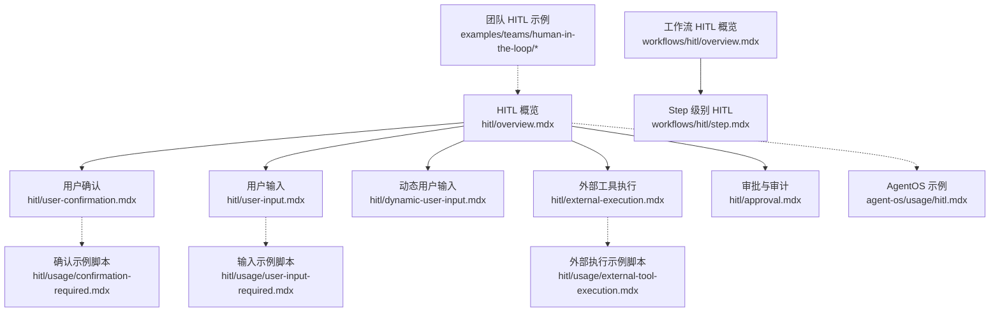
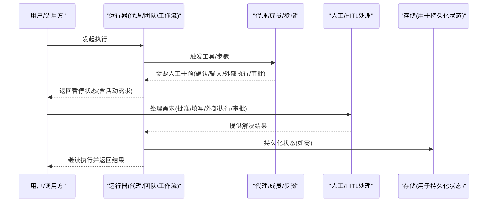
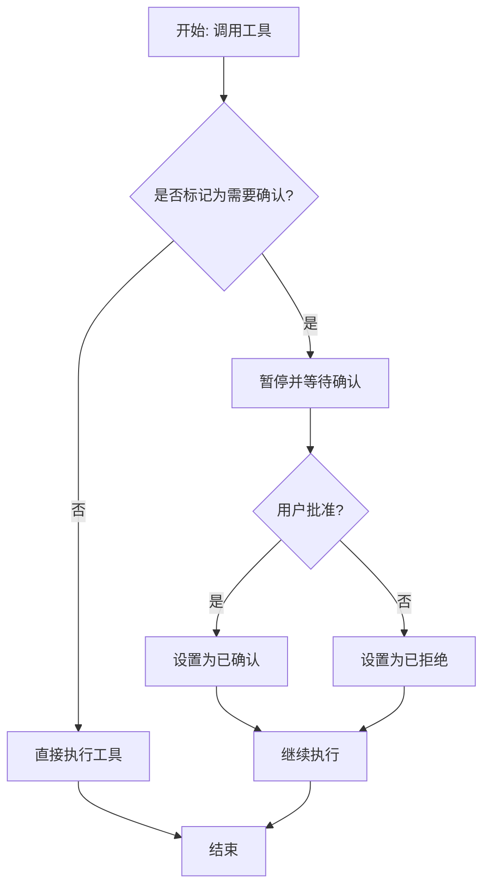
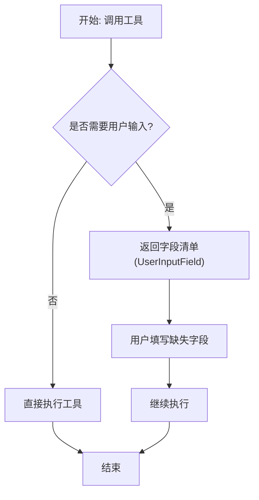
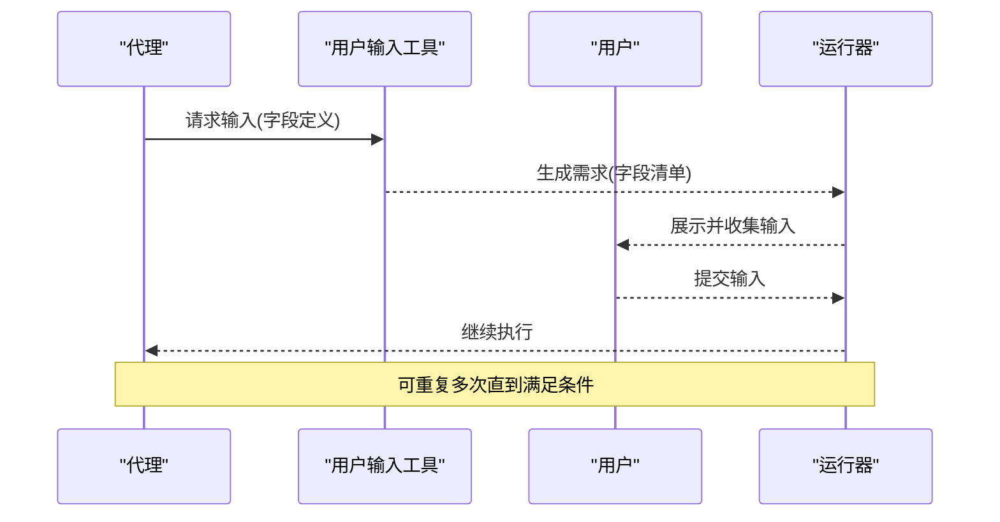
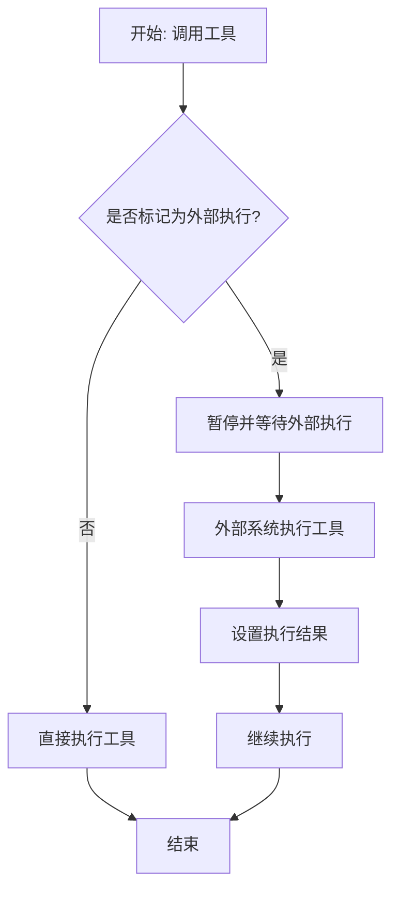
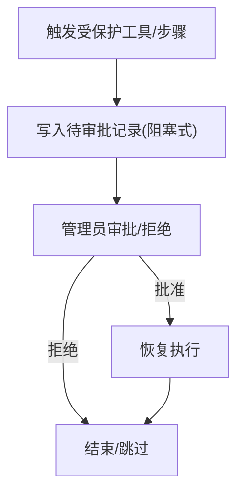
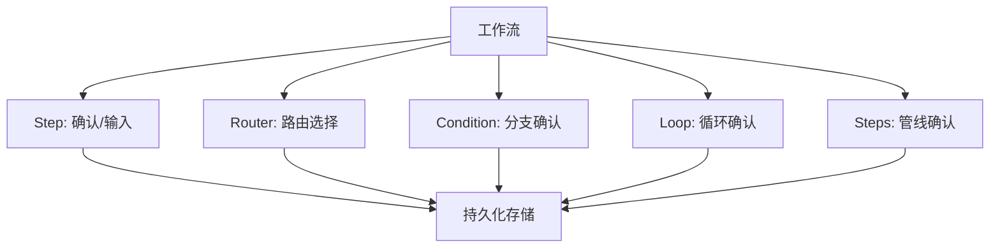
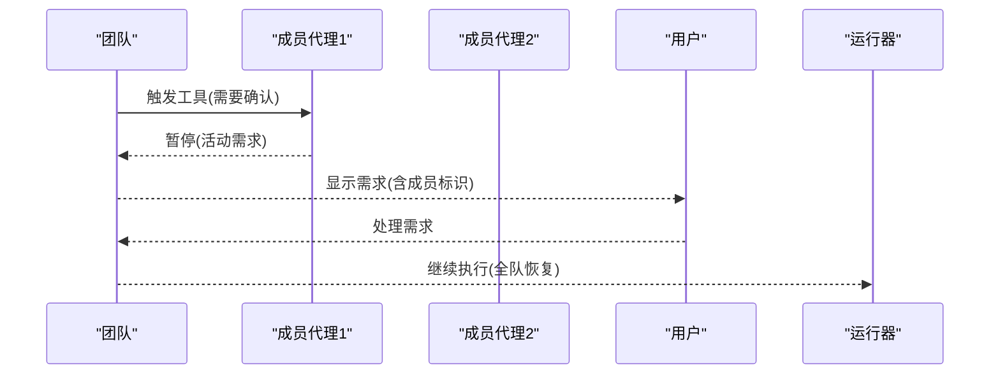
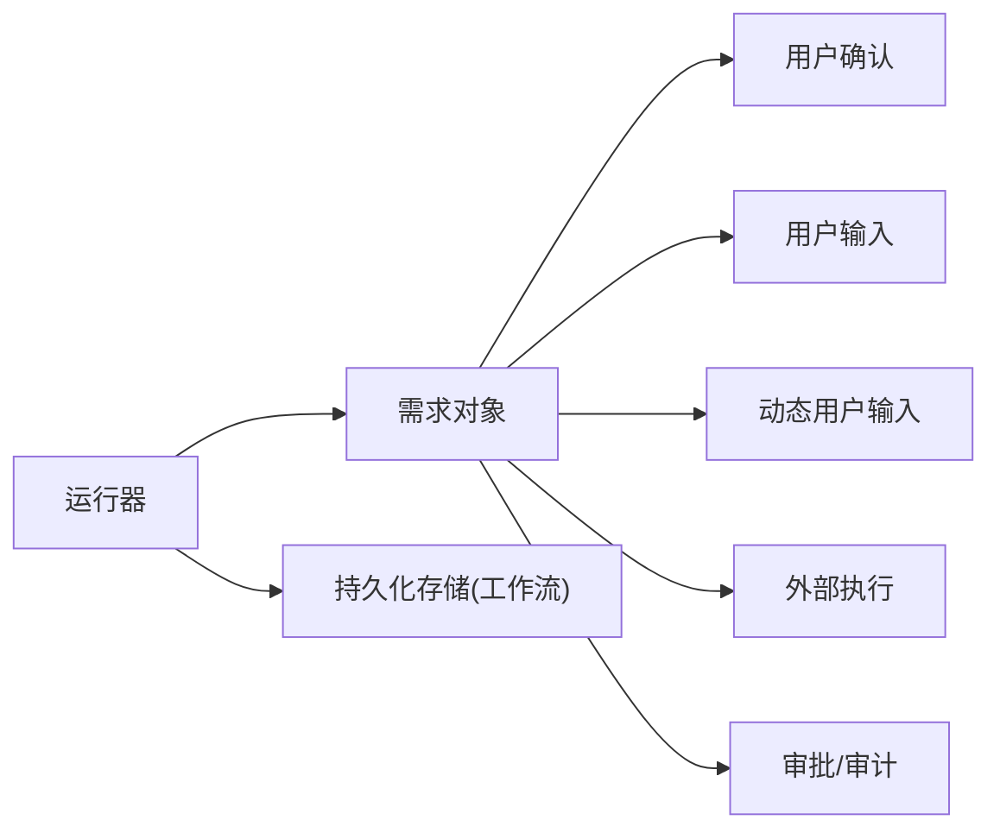

# HITL 基础概念

<cite>
**本文引用的文件**
- [hitl/overview.mdx](file://hitl/overview.mdx)
- [hitl/user-confirmation.mdx](file://hitl/user-confirmation.mdx)
- [hitl/user-input.mdx](file://hitl/user-input.mdx)
- [hitl/dynamic-user-input.mdx](file://hitl/dynamic-user-input.mdx)
- [hitl/external-execution.mdx](file://hitl/external-execution.mdx)
- [hitl/approval.mdx](file://hitl/approval.mdx)
- [workflows/hitl/overview.mdx](file://workflows/hitl/overview.mdx)
- [workflows/hitl/step.mdx](file://workflows/hitl/step.mdx)
- [agent-os/usage/hitl.mdx](file://agent-os/usage/hitl.mdx)
- [hitl/usage/confirmation-required.mdx](file://hitl/usage/confirmation-required.mdx)
- [hitl/usage/user-input-required.mdx](file://hitl/usage/user-input-required.mdx)
- [hitl/usage/external-tool-execution.mdx](file://hitl/usage/external-tool-execution.mdx)
- [examples/teams/human-in-the-loop/team-tool-confirmation.mdx](file://examples/teams/human-in-the-loop/team-tool-confirmation.mdx)
- [examples/teams/human-in-the-loop/team-tool-confirmation-stream.mdx](file://examples/teams/human-in-the-loop/team-tool-confirmation-stream.mdx)
- [examples/teams/human-in-the-loop/confirmation-required-stream.mdx](file://examples/teams/human-in-the-loop/confirmation-required-stream.mdx)
</cite>

## 目录
1. [引言](#引言)
2. [项目结构](#项目结构)
3. [核心组件](#核心组件)
4. [架构总览](#架构总览)
5. [详细组件分析](#详细组件分析)
6. [依赖关系分析](#依赖关系分析)
7. [性能考量](#性能考量)
8. [故障排查指南](#故障排查指南)
9. [结论](#结论)
10. [附录](#附录)

## 引言
本文件系统性阐述 Agno 中的人机交互（Human-in-the-Loop，简称 HITL）基础概念与实现方式，覆盖代理（Agent）、团队（Team）与工作流（Workflow）三类执行体的统一 HITL 能力。HITL 的核心价值在于在关键决策点引入“人工把关”，以保障敏感操作的安全性、可审计性与可控性，并支持在执行过程中实时收集用户输入或由外部系统接管执行。

## 项目结构
围绕 HITL 的文档分布在多个子目录中：
- 核心概览与用例：hitl/overview.mdx
- 四大模式详解：用户确认、用户输入、动态用户输入、外部工具执行
- 审批与审计：hitl/approval.mdx
- 工作流中的 HITL：workflows/hitl/overview.mdx 及各子主题
- AgentOS 示例：agent-os/usage/hitl.mdx
- 具体示例脚本：hitl/usage/* 与 examples/teams/human-in-the-loop/*

图表来源
- [hitl/overview.mdx](file://hitl/overview.mdx)
- [hitl/user-confirmation.mdx](file://hitl/user-confirmation.mdx)
- [hitl/user-input.mdx](file://hitl/user-input.mdx)
- [hitl/dynamic-user-input.mdx](file://hitl/dynamic-user-input.mdx)
- [hitl/external-execution.mdx](file://hitl/external-execution.mdx)
- [hitl/approval.mdx](file://hitl/approval.mdx)
- [workflows/hitl/overview.mdx](file://workflows/hitl/overview.mdx)
- [workflows/hitl/step.mdx](file://workflows/hitl/step.mdx)
- [agent-os/usage/hitl.mdx](file://agent-os/usage/hitl.mdx)
- [hitl/usage/confirmation-required.mdx](file://hitl/usage/confirmation-required.mdx)
- [hitl/usage/user-input-required.mdx](file://hitl/usage/user-input-required.mdx)
- [hitl/usage/external-tool-execution.mdx](file://hitl/usage/external-tool-execution.mdx)
- [examples/teams/human-in-the-loop/team-tool-confirmation.mdx](file://examples/teams/human-in-the-loop/team-tool-confirmation.mdx)

章节来源
- [hitl/overview.mdx](file://hitl/overview.mdx)
- [workflows/hitl/overview.mdx](file://workflows/hitl/overview.mdx)

## 核心组件
- 执行暂停与恢复
  - 运行响应对象包含“活动需求”列表，当遇到需要人工干预的步骤时，运行会暂停；在满足条件后调用继续执行接口恢复。
  - 支持同步与异步两种运行模式，以及流式输出。
- 需求类型
  - 用户确认：对工具调用进行批准/拒绝。
  - 用户输入：在执行前收集参数。
  - 动态用户输入：代理在运行中按需请求用户输入。
  - 外部工具执行：代理不直接执行，交由外部系统执行并回填结果。
  - 审批/审计：持久化记录、管理员审批或仅审计日志。
- 统一实现
  - 代理、团队、工作流均采用一致的暂停-处理-恢复机制，通过统一的需求对象与继续执行 API 实现跨层级一致性。

章节来源
- [hitl/overview.mdx](file://hitl/overview.mdx)
- [hitl/user-confirmation.mdx](file://hitl/user-confirmation.mdx)
- [hitl/user-input.mdx](file://hitl/user-input.mdx)
- [hitl/dynamic-user-input.mdx](file://hitl/dynamic-user-input.mdx)
- [hitl/external-execution.mdx](file://hitl/external-execution.mdx)
- [hitl/approval.mdx](file://hitl/approval.mdx)

## 架构总览
下图展示了从“触发工具/步骤”到“暂停-处理-恢复”的整体流程，涵盖代理、团队与工作流三种执行体的统一路径。

图表来源
- [hitl/overview.mdx](file://hitl/overview.mdx)
- [workflows/hitl/overview.mdx](file://workflows/hitl/overview.mdx)

## 详细组件分析

### 用户确认（User Confirmation）
- 场景：对敏感或高风险工具调用进行人工批准。
- 行为：工具被标记为需要确认后，代理在调用前暂停；用户批准后继续执行。
- 关键点：
  - 工具级装饰器参数控制是否需要确认。
  - 支持工具包级别选择性保护某些工具。
  - 支持异步与流式。
- 示例参考：
  - [用户确认示例脚本](file://hitl/usage/confirmation-required.mdx)
  - [AgentOS 示例](file://agent-os/usage/hitl.mdx)

图表来源
- [hitl/user-confirmation.mdx](file://hitl/user-confirmation.mdx)
- [hitl/usage/confirmation-required.mdx](file://hitl/usage/confirmation-required.mdx)

章节来源
- [hitl/user-confirmation.mdx](file://hitl/user-confirmation.mdx)
- [hitl/usage/confirmation-required.mdx](file://hitl/usage/confirmation-required.mdx)
- [agent-os/usage/hitl.mdx](file://agent-os/usage/hitl.mdx)

### 用户输入（User Input）
- 场景：在工具执行前收集必要的参数。
- 行为：代理暂停，返回字段清单；用户填写后继续执行。
- 关键点：
  - 可指定部分字段由用户输入，其余由上下文自动填充。
  - 支持异步与流式。
- 示例参考：
  - [用户输入示例脚本](file://hitl/usage/user-input-required.mdx)

图表来源
- [hitl/user-input.mdx](file://hitl/user-input.mdx)
- [hitl/usage/user-input-required.mdx](file://hitl/usage/user-input-required.mdx)

章节来源
- [hitl/user-input.mdx](file://hitl/user-input.mdx)
- [hitl/usage/user-input-required.mdx](file://hitl/usage/user-input-required.mdx)

### 动态用户输入（Dynamic User Input）
- 场景：代理在运行中按需主动请求用户输入，适合不确定性的交互流程。
- 行为：代理调用内置工具请求输入，形成需求；用户多次填写后继续。
- 关键点：
  - 使用专用工具包提供“获取用户输入”能力。
  - 支持多轮交互与预填值。
  - 支持异步与流式。
- 示例参考：
  - [动态用户输入文档](file://hitl/dynamic-user-input.mdx)

图表来源
- [hitl/dynamic-user-input.mdx](file://hitl/dynamic-user-input.mdx)

章节来源
- [hitl/dynamic-user-input.mdx](file://hitl/dynamic-user-input.mdx)

### 外部工具执行（External Tool Execution）
- 场景：代理不直接执行工具，而是由外部系统执行并回填结果，适用于安全隔离或自定义逻辑。
- 行为：代理暂停，返回待外部执行的工具描述；外部执行后设置结果并继续。
- 关键点：
  - 必须在外部完成执行并将结果写回。
  - 支持工具包选择性外部执行。
  - 支持异步与流式。
- 示例参考：
  - [外部执行示例脚本](file://hitl/usage/external-tool-execution.mdx)

图表来源
- [hitl/external-execution.mdx](file://hitl/external-execution.mdx)
- [hitl/usage/external-tool-execution.mdx](file://hitl/usage/external-tool-execution.mdx)

章节来源
- [hitl/external-execution.mdx](file://hitl/external-execution.mdx)
- [hitl/usage/external-tool-execution.mdx](file://hitl/usage/external-tool-execution.mdx)

### 审批与审计（Approval/Audit）
- 场景：在工作流或代理中引入管理员审批或审计日志，确保合规与可追溯。
- 行为：
  - 阻塞式：暂停等待审批，数据库记录待处理。
  - 审计式：非阻塞，仅记录审计日志。
- 关键点：
  - 基于 HITL 原语构建，可与确认、用户输入、外部执行组合。
  - 数据库持久化与状态校验保证一致性。
- 示例参考：
  - [审批文档](file://hitl/approval.mdx)

图表来源
- [hitl/approval.mdx](file://hitl/approval.mdx)

章节来源
- [hitl/approval.mdx](file://hitl/approval.mdx)

### 工作流中的 HITL（Step/Router/Condition/Loop/Steps）
- 场景：在工作流的任意步骤级别暂停，收集确认、用户输入或路由选择。
- 行为：
  - Step：支持确认与用户输入。
  - Router：支持用户选择路由。
  - Condition/Loop/Steps：支持确认。
  - 错误处理：失败时可暂停并允许重试/跳过。
- 关键点：
  - 需要持久化存储以支持暂停后的恢复。
  - 流式事件中识别暂停事件并处理。
- 示例参考：
  - [工作流 HITL 概览](file://workflows/hitl/overview.mdx)
  - [Step 级别 HITL](file://workflows/hitl/step.mdx)

图表来源
- [workflows/hitl/overview.mdx](file://workflows/hitl/overview.mdx)
- [workflows/hitl/step.mdx](file://workflows/hitl/step.mdx)

章节来源
- [workflows/hitl/overview.mdx](file://workflows/hitl/overview.mdx)
- [workflows/hitl/step.mdx](file://workflows/hitl/step.mdx)

### 团队中的 HITL（Team）
- 场景：团队运行中，任一成员代理或团队自身工具触发的 HITL 都会使整个团队暂停，直至需求解决。
- 行为：
  - 区分成员代理触发与团队自身工具触发。
  - 支持流式与异步。
- 示例参考：
  - [团队工具确认示例](file://examples/teams/human-in-the-loop/team-tool-confirmation.mdx)
  - [团队工具确认流式示例](file://examples/teams/human-in-the-loop/team-tool-confirmation-stream.mdx)
  - [成员工具确认流式示例](file://examples/teams/human-in-the-loop/confirmation-required-stream.mdx)

图表来源
- [examples/teams/human-in-the-loop/team-tool-confirmation.mdx](file://examples/teams/human-in-the-loop/team-tool-confirmation.mdx)
- [examples/teams/human-in-the-loop/team-tool-confirmation-stream.mdx](file://examples/teams/human-in-the-loop/team-tool-confirmation-stream.mdx)
- [examples/teams/human-in-the-loop/confirmation-required-stream.mdx](file://examples/teams/human-in-the-loop/confirmation-required-stream.mdx)

章节来源
- [examples/teams/human-in-the-loop/team-tool-confirmation.mdx](file://examples/teams/human-in-the-loop/team-tool-confirmation.mdx)
- [examples/teams/human-in-the-loop/team-tool-confirmation-stream.mdx](file://examples/teams/human-in-the-loop/team-tool-confirmation-stream.mdx)
- [examples/teams/human-in-the-loop/confirmation-required-stream.mdx](file://examples/teams/human-in-the-loop/confirmation-required-stream.mdx)

## 依赖关系分析
- 组件耦合
  - 运行器与代理/团队/工作流之间通过统一的“暂停-处理-恢复”协议耦合。
  - 需求对象在不同执行体间保持一致的结构与行为。
- 外部依赖
  - 工作流的暂停恢复依赖持久化存储（数据库），以保证跨事件/重启的一致性。
- 潜在循环依赖
  - 文档中未发现循环依赖迹象；各模块职责清晰：模式文档负责说明，示例脚本负责演示，运行器负责执行与暂停。

图表来源
- [hitl/overview.mdx](file://hitl/overview.mdx)
- [workflows/hitl/overview.mdx](file://workflows/hitl/overview.mdx)

章节来源
- [hitl/overview.mdx](file://hitl/overview.mdx)
- [workflows/hitl/overview.mdx](file://workflows/hitl/overview.mdx)

## 性能考量
- 流式处理
  - 在流式场景中，应尽早识别暂停事件并及时处理，避免长时间阻塞。
- 异步执行
  - 对于耗时的外部执行或审批流程，优先采用异步接口以提升吞吐。
- 存储开销
  - 工作流的持久化存储应选择低延迟、高可用方案，以减少暂停恢复时延。
- 输入验证
  - 在用户输入环节增加前端/后端校验，减少无效重试带来的资源浪费。

## 故障排查指南
- 工具装饰器互斥
  - 同一工具只能选择一种模式：确认、用户输入或外部执行，否则会报错。
- 外部执行必须回填结果
  - 若存在外部执行需求，必须在继续执行前设置结果，否则会抛出异常。
- 工作流必须有持久化存储
  - 否则无法正确恢复暂停状态。
- 审批记录状态校验
  - 恢复执行前需确保审批记录已更新为“已批准/已拒绝”。

章节来源
- [hitl/user-confirmation.mdx](file://hitl/user-confirmation.mdx)
- [hitl/user-input.mdx](file://hitl/user-input.mdx)
- [hitl/external-execution.mdx](file://hitl/external-execution.mdx)
- [hitl/approval.mdx](file://hitl/approval.mdx)
- [workflows/hitl/overview.mdx](file://workflows/hitl/overview.mdx)

## 结论
HITL 在 Agno 中实现了“代理-团队-工作流”的统一控制面：在关键节点暂停执行、收集人工决策或输入、并以一致的方式恢复。通过用户确认、用户输入、动态用户输入、外部工具执行与审批/审计五种模式，HITL 覆盖了从安全控制到合规审计的广泛场景。配合流式、异步与持久化能力，HITL 既保证了安全性，也兼顾了可用性与可扩展性。

## 附录
- 快速上手
  - 代理确认示例脚本：[用户确认示例脚本](file://hitl/usage/confirmation-required.mdx)
  - 用户输入示例脚本：[用户输入示例脚本](file://hitl/usage/user-input-required.mdx)
  - 外部执行示例脚本：[外部执行示例脚本](file://hitl/usage/external-tool-execution.mdx)
  - AgentOS 示例：[AgentOS 示例](file://agent-os/usage/hitl.mdx)
- 团队与工作流示例
  - 团队工具确认示例：[团队工具确认示例](file://examples/teams/human-in-the-loop/team-tool-confirmation.mdx)
  - 团队工具确认流式示例：[团队工具确认流式示例](file://examples/teams/human-in-the-loop/team-tool-confirmation-stream.mdx)
  - 成员工具确认流式示例：[成员工具确认流式示例](file://examples/teams/human-in-the-loop/confirmation-required-stream.mdx)
  - 工作流 HITL 概览：[工作流 HITL 概览](file://workflows/hitl/overview.mdx)
  - Step 级别 HITL：[Step 级别 HITL](file://workflows/hitl/step.mdx)