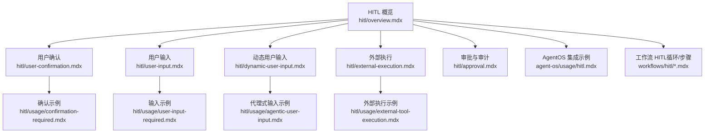
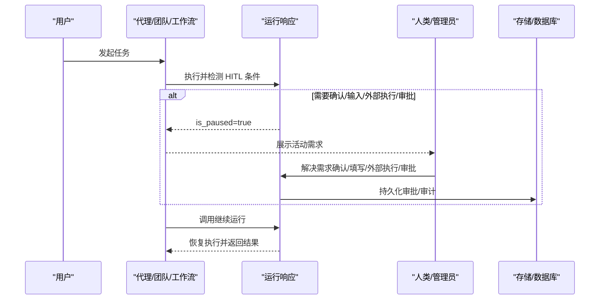
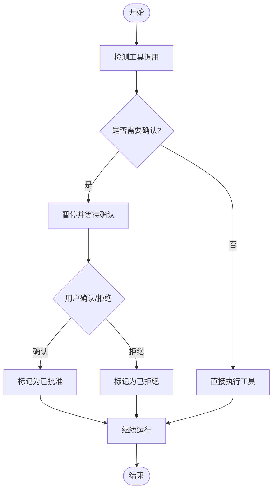
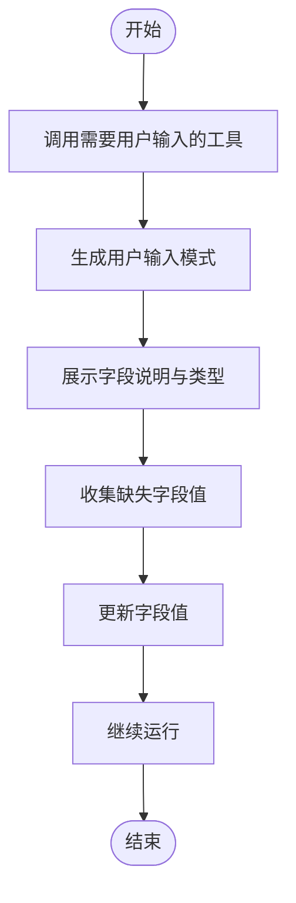
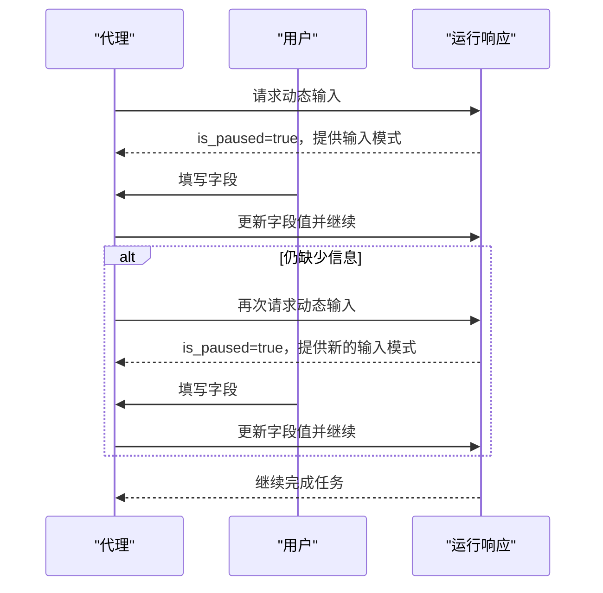
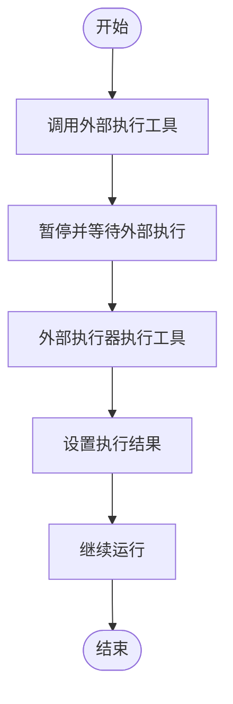
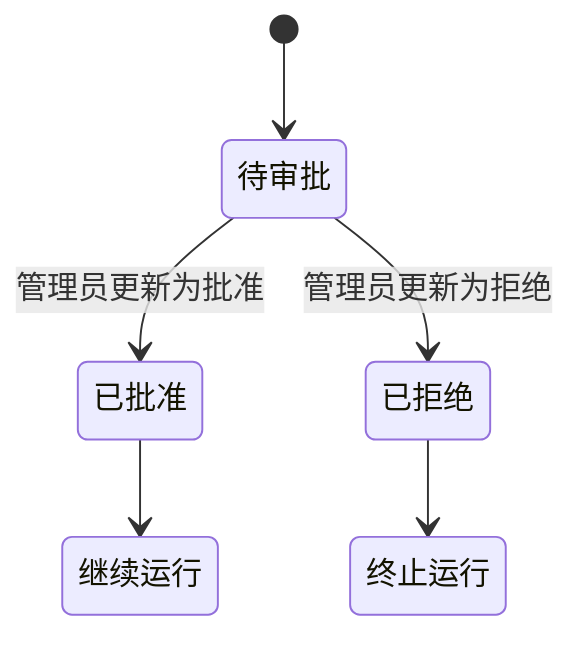
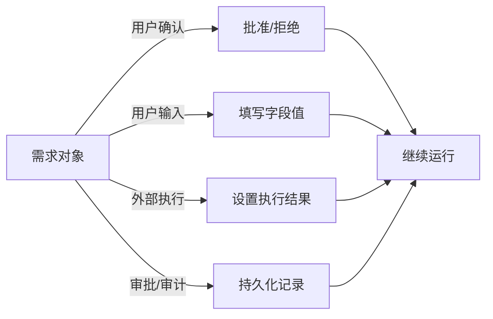

# 人机交互 (HITL)

<cite>
**本文引用的文件**
- [hitl/overview.mdx](file://hitl/overview.mdx)
- [hitl/user-confirmation.mdx](file://hitl/user-confirmation.mdx)
- [hitl/user-input.mdx](file://hitl/user-input.mdx)
- [hitl/dynamic-user-input.mdx](file://hitl/dynamic-user-input.mdx)
- [hitl/external-execution.mdx](file://hitl/external-execution.mdx)
- [hitl/approval.mdx](file://hitl/approval.mdx)
- [hitl/usage/confirmation-required.mdx](file://hitl/usage/confirmation-required.mdx)
- [hitl/usage/user-input-required.mdx](file://hitl/usage/user-input-required.mdx)
- [hitl/usage/external-tool-execution.mdx](file://hitl/usage/external-tool-execution.mdx)
- [hitl/usage/agentic-user-input.mdx](file://hitl/usage/agentic-user-input.mdx)
- [agent-os/usage/hitl.mdx](file://agent-os/usage/hitl.mdx)
- [workflows/hitl/loop.mdx](file://workflows/hitl/loop.mdx)
- [workflows/hitl/steps.mdx](file://workflows/hitl/steps.mdx)
</cite>

## 目录
1. [简介](#简介)
2. [项目结构](#项目结构)
3. [核心组件](#核心组件)
4. [架构总览](#架构总览)
5. [详细组件分析](#详细组件分析)
6. [依赖关系分析](#依赖关系分析)
7. [性能考量](#性能考量)
8. [故障排查指南](#故障排查指南)
9. [结论](#结论)
10. [附录](#附录)

## 简介
本技术文档围绕人机交互（Human-in-the-Loop，简称 HITL）系统展开，系统性阐述在自动化执行过程中引入“人类干预”的关键理念与实现路径。HITL 覆盖以下典型场景：
- 工具调用前的人工确认
- 执行期间收集用户输入
- 动态上下文感知的用户输入
- 外部工具执行（由外部环境或管理员接管）
- 审批与审计（持久化记录、状态追踪与审计日志）

HITL 的核心价值在于：在敏感操作、高风险决策、合规要求与复杂交互中，通过暂停与恢复机制，确保人类监督与可控性。

## 项目结构
HITL 相关文档分布在多个模块中，覆盖从概览到具体用法、从单体代理到团队与工作流的全链路实践。

图表来源
- [hitl/overview.mdx](file://hitl/overview.mdx)
- [hitl/user-confirmation.mdx](file://hitl/user-confirmation.mdx)
- [hitl/user-input.mdx](file://hitl/user-input.mdx)
- [hitl/dynamic-user-input.mdx](file://hitl/dynamic-user-input.mdx)
- [hitl/external-execution.mdx](file://hitl/external-execution.mdx)
- [hitl/approval.mdx](file://hitl/approval.mdx)
- [hitl/usage/confirmation-required.mdx](file://hitl/usage/confirmation-required.mdx)
- [hitl/usage/user-input-required.mdx](file://hitl/usage/user-input-required.mdx)
- [hitl/usage/agentic-user-input.mdx](file://hitl/usage/agentic-user-input.mdx)
- [hitl/usage/external-tool-execution.mdx](file://hitl/usage/external-tool-execution.mdx)
- [agent-os/usage/hitl.mdx](file://agent-os/usage/hitl.mdx)
- [workflows/hitl/loop.mdx](file://workflows/hitl/loop.mdx)
- [workflows/hitl/steps.mdx](file://workflows/hitl/steps.mdx)

章节来源
- [hitl/overview.mdx](file://hitl/overview.mdx)

## 核心组件
- 运行时暂停与恢复
  - 运行响应对象包含“活动需求”列表，当 HITL 触发时，运行会暂停；解决所有需求后，可通过继续运行接口恢复。
  - 支持同步与异步、支持流式事件的继续运行。
- 需求类型
  - 用户确认：对即将执行的工具调用进行批准/拒绝。
  - 用户输入：在执行前收集特定字段参数。
  - 外部执行：由外部环境或管理员接管工具的实际执行。
  - 审批/审计：持久化记录、状态追踪与审计日志。
- 团队与工作流集成
  - 团队模式下，成员代理触发的工具同样会暂停；工作流中可对循环与步骤设置确认与消息提示。

章节来源
- [hitl/overview.mdx](file://hitl/overview.mdx)
- [workflows/hitl/loop.mdx](file://workflows/hitl/loop.mdx)
- [workflows/hitl/steps.mdx](file://workflows/hitl/steps.mdx)

## 架构总览
HITL 的执行流由“触发条件 → 暂停 → 人工介入 → 解决需求 → 继续运行”构成。不同模式在暂停时提供的“需求对象”形态不同，但统一通过“继续运行”接口恢复。

图表来源
- [hitl/overview.mdx](file://hitl/overview.mdx)
- [hitl/approval.mdx](file://hitl/approval.mdx)

## 详细组件分析

### 用户确认（requires_confirmation）
- 触发时机：标记为需要确认的工具在调用前触发暂停。
- 处理流程：遍历活动需求，识别需要确认的需求，根据用户输入决定批准或拒绝。
- 结果记录：确认/拒绝状态与可选备注会被记录，供后续继续运行使用。
- 异步与流式：支持异步运行与流式事件的继续运行。
- 工具集组合：可在工具包中仅对部分工具启用确认。

图表来源
- [hitl/user-confirmation.mdx](file://hitl/user-confirmation.mdx)
- [hitl/usage/confirmation-required.mdx](file://hitl/usage/confirmation-required.mdx)

章节来源
- [hitl/user-confirmation.mdx](file://hitl/user-confirmation.mdx)
- [hitl/usage/confirmation-required.mdx](file://hitl/usage/confirmation-required.mdx)

### 用户输入（requires_user_input）
- 触发时机：标记为需要用户输入的工具在调用前暂停，并填充“用户输入模式”。
- 字段控制：可通过字段白名单指定哪些参数需由用户填写，其余由上下文自动填充。
- 输入收集：遍历需求中的输入字段，收集缺失值并更新。
- 异步与流式：支持异步与流式事件的继续运行。
- 动态输入对比：与“动态用户输入”不同，该模式在工具定义时即确定需要哪些字段。

图表来源
- [hitl/user-input.mdx](file://hitl/user-input.mdx)
- [hitl/usage/user-input-required.mdx](file://hitl/usage/user-input-required.mdx)

章节来源
- [hitl/user-input.mdx](file://hitl/user-input.mdx)
- [hitl/usage/user-input-required.mdx](file://hitl/usage/user-input-required.mdx)

### 动态用户输入（代理式输入）
- 触发时机：代理在执行过程中主动调用“获取用户输入”工具以动态决定所需字段。
- 交互特性：可能多次暂停，每次根据上下文请求必要信息，形成“问答式/表单式”交互。
- 自定义指令：可通过自定义指令引导代理如何提问与组织问题。
- 异步与流式：支持异步与流式事件的继续运行。
- 与“用户输入”的差异：前者由代理决定何时以及问什么，后者在工具定义时即确定字段。

图表来源
- [hitl/dynamic-user-input.mdx](file://hitl/dynamic-user-input.mdx)
- [hitl/usage/agentic-user-input.mdx](file://hitl/usage/agentic-user-input.mdx)

章节来源
- [hitl/dynamic-user-input.mdx](file://hitl/dynamic-user-input.mdx)
- [hitl/usage/agentic-user-input.mdx](file://hitl/usage/agentic-user-input.mdx)

### 外部执行（external_execution）
- 触发时机：标记为外部执行的工具不会被代理直接调用，而是暂停并等待外部处理。
- 外部处理：根据工具名称与参数，由外部逻辑执行，然后将结果回填至需求对象。
- 工具包组合：可在工具包中仅对部分工具启用外部执行。
- 异步与流式：支持异步与流式事件的继续运行。
- 最佳实践：必须在继续运行前为所有外部执行需求设置结果；建议添加错误处理、安全校验、审计日志与超时控制。

图表来源
- [hitl/external-execution.mdx](file://hitl/external-execution.mdx)
- [hitl/usage/external-tool-execution.mdx](file://hitl/usage/external-tool-execution.mdx)

章节来源
- [hitl/external-execution.mdx](file://hitl/external-execution.mdx)
- [hitl/usage/external-tool-execution.mdx](file://hitl/usage/external-tool-execution.mdx)

### 审批与审计（Approval）
- 模式类型
  - 阻塞型（默认）：运行暂停，等待管理员审批；审批通过后继续。
  - 审计型（非阻塞）：运行立即继续，仅记录审计日志。
- 生命周期
  - 暂停阶段：SDK 自动插入待处理记录。
  - 管理员审批：通过数据库更新记录状态（含预期状态保护）。
  - 恢复运行：使用 run_id 继续，SDK 校验审批记录后放行。
- 与工具装饰器结合：可与“需要确认/用户输入/外部执行”组合使用。

图表来源
- [hitl/approval.mdx](file://hitl/approval.mdx)

章节来源
- [hitl/approval.mdx](file://hitl/approval.mdx)

### 团队与工作流中的 HITL
- 团队模式：成员代理触发的工具同样会暂停；需求对象包含触发者信息，便于定位。
- 工作流模式：
  - 循环（Loop）：可在循环开始前要求确认，支持消息提示与继续条件。
  - 步骤（Steps）：可在管道执行前要求确认，支持拒绝时跳过或取消。

章节来源
- [hitl/overview.mdx](file://hitl/overview.mdx)
- [workflows/hitl/loop.mdx](file://workflows/hitl/loop.mdx)
- [workflows/hitl/steps.mdx](file://workflows/hitl/steps.mdx)

## 依赖关系分析
HITL 的实现依赖于运行时的“需求对象”与“继续运行”接口，不同模式在暂停时提供的需求形态不同，但统一通过运行响应对象进行管理与恢复。

图表来源
- [hitl/overview.mdx](file://hitl/overview.mdx)
- [hitl/user-confirmation.mdx](file://hitl/user-confirmation.mdx)
- [hitl/user-input.mdx](file://hitl/user-input.mdx)
- [hitl/external-execution.mdx](file://hitl/external-execution.mdx)
- [hitl/approval.mdx](file://hitl/approval.mdx)

## 性能考量
- 流式处理：在长对话或复杂任务中，优先采用流式事件处理，减少等待时间并提升交互体验。
- 异步执行：对于耗时的外部执行或审批查询，使用异步接口避免阻塞主线程。
- 外部执行优化：对外部执行增加超时与重试策略，确保系统稳定性。
- 审计与日志：在外部执行与审批流程中加入审计日志，便于事后追踪与性能分析。

## 故障排查指南
- 外部执行未设置结果
  - 现象：继续运行时报错，提示未解析的外部执行需求。
  - 处理：确保为每个外部执行需求设置结果后再继续。
- 审批记录缺失或仍为待处理
  - 现象：继续运行抛出运行时错误。
  - 处理：检查数据库中审批记录状态，确保记录存在且已完成审批。
- 多轮动态输入未循环处理
  - 现象：代理多次请求输入但未继续。
  - 处理：使用“直到不再暂停”的循环模式，确保每轮输入都提交并继续。
- 工具装饰器互斥
  - 现象：同一工具同时声明多种模式导致冲突。
  - 处理：一个工具只能选择一种模式（确认/用户输入/外部执行）。

章节来源
- [hitl/external-execution.mdx](file://hitl/external-execution.mdx)
- [hitl/approval.mdx](file://hitl/approval.mdx)
- [hitl/dynamic-user-input.mdx](file://hitl/dynamic-user-input.mdx)
- [hitl/user-confirmation.mdx](file://hitl/user-confirmation.mdx)
- [hitl/user-input.mdx](file://hitl/user-input.mdx)

## 结论
HITL 将“人类监督”嵌入自动化执行的关键节点，通过统一的暂停-恢复机制与多样化的交互模式，满足安全、合规与用户体验的多重目标。在实际落地中，应结合业务场景选择合适的模式（确认/输入/外部执行/审批），并配合流式与异步能力优化性能与交互体验。

## 附录
- 实际应用场景
  - 客户服务：对高风险操作（如退款、权限变更）进行人工确认。
  - 内容审核：在发布前收集必要字段或由外部审核系统接管执行。
  - 金融风控：对交易与额度调整进行审批与审计。
- 配置与定制
  - 界面定制：通过 AgentOS 提供的服务端口与请求格式接入前端界面。
  - 流程优化：在工作流中为循环与步骤设置确认消息与拒绝策略。
  - 用户体验：在动态输入中提供清晰的字段描述与校验提示。

章节来源
- [agent-os/usage/hitl.mdx](file://agent-os/usage/hitl.mdx)
- [workflows/hitl/loop.mdx](file://workflows/hitl/loop.mdx)
- [workflows/hitl/steps.mdx](file://workflows/hitl/steps.mdx)