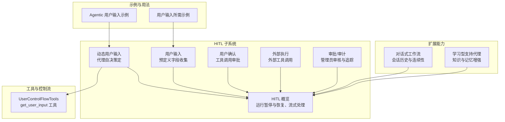
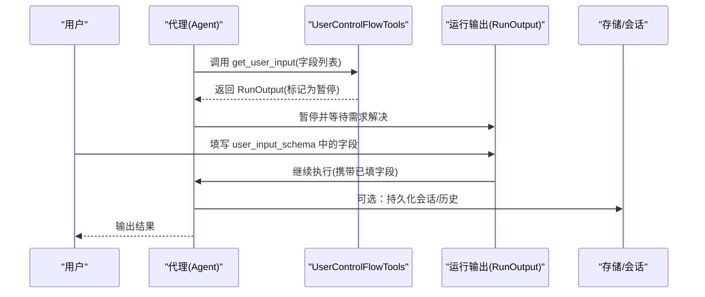
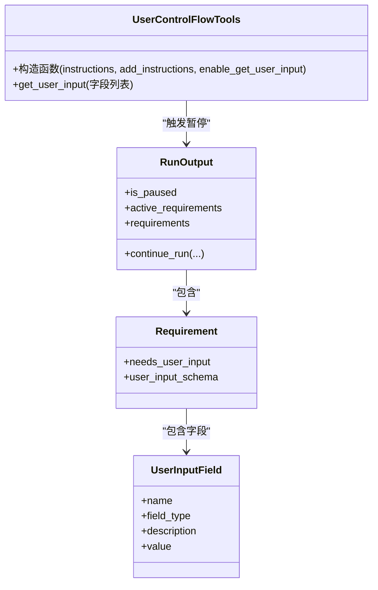
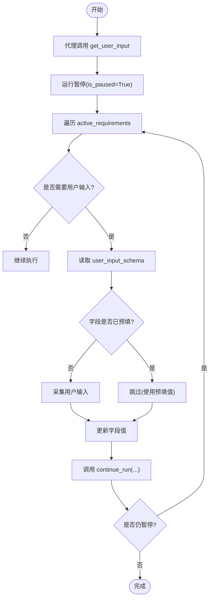
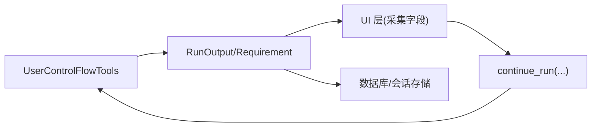

# 动态用户输入

<cite>
**本文引用的文件**
- [动态用户输入](file://hitl/dynamic-user-input.mdx)
- [用户输入](file://hitl/user-input.mdx)
- [HITL 概览](file://hitl/overview.mdx)
- [Agentic 用户输入示例](file://hitl/usage/agentic-user-input.mdx)
- [用户输入所需示例](file://hitl/usage/user-input-required.mdx)
- [用户控制流工具](file://tools/toolkits/others/user-control-flow.mdx)
- [对话式工作流](file://workflows/conversational-workflows.mdx)
- [学习型支持代理](file://cookbook/learning/support-agent.mdx)
</cite>

## 目录
1. [简介](#简介)
2. [项目结构](#项目结构)
3. [核心组件](#核心组件)
4. [架构总览](#架构总览)
5. [详细组件分析](#详细组件分析)
6. [依赖关系分析](#依赖关系分析)
7. [性能考量](#性能考量)
8. [故障排查指南](#故障排查指南)
9. [结论](#结论)
10. [附录](#附录)

## 简介
动态用户输入（Dynamic User Input）是人类在回路（Human-in-the-Loop, HITL）模式下的一个关键能力：它允许智能体在执行过程中根据当前上下文“自适应”地决定何时以及需要哪些信息，并主动向用户请求。与预定义字段的静态用户输入不同，动态输入强调“代理主导”的交互，使对话更自然、灵活且具备上下文感知能力。

本技术文档围绕以下主题展开：
- 核心概念与适用场景
- 触发机制与上下文分析
- 实现流程与交互设计
- 上下文感知的信息收集策略
- 智能提示与引导、输入校验与错误预防
- 配置选项与最佳实践
- 客户服务、数据分析、内容创作等典型场景的应用路径

## 项目结构
本仓库中与动态用户输入直接相关的内容主要分布在以下模块：
- HITL 子系统：概述、用户输入、动态用户输入、用户确认、外部执行、审批等
- 示例与用法：Agentic 用户输入、用户输入所需等
- 工具与控制流：UserControlFlowTools 工具包
- 扩展能力：对话式工作流、学习型支持代理等

**图表来源**
- [HITL 概览](file://hitl/overview.mdx)
- [动态用户输入](file://hitl/dynamic-user-input.mdx)
- [用户输入](file://hitl/user-input.mdx)
- [Agentic 用户输入示例](file://hitl/usage/agentic-user-input.mdx)
- [用户输入所需示例](file://hitl/usage/user-input-required.mdx)
- [用户控制流工具](file://tools/toolkits/others/user-control-flow.mdx)
- [对话式工作流](file://workflows/conversational-workflows.mdx)
- [学习型支持代理](file://cookbook/learning/support-agent.mdx)

**章节来源**
- [HITL 概览](file://hitl/overview.mdx)
- [动态用户输入](file://hitl/dynamic-user-input.mdx)
- [用户输入](file://hitl/user-input.mdx)
- [Agentic 用户输入示例](file://hitl/usage/agentic-user-input.mdx)
- [用户输入所需示例](file://hitl/usage/user-input-required.mdx)
- [用户控制流工具](file://tools/toolkits/others/user-control-flow.mdx)
- [对话式工作流](file://workflows/conversational-workflows.mdx)
- [学习型支持代理](file://cookbook/learning/support-agent.mdx)

## 核心组件
- UserControlFlowTools 工具包
  - 提供 get_user_input 工具，用于在运行时由代理动态请求用户输入
  - 支持自定义指令、启用/禁用 get_user_input、是否追加默认指令
- RunOutput 与 Requirement
  - 运行暂停时，通过 active_requirements 或 requirements 列表暴露需要处理的要求
  - 当需要用户输入时，requirements 中包含 user_input_schema，内含 UserInputField 字段集合
- UserInputField 结构
  - 字段名、类型、描述、值（可由代理预填或用户填写）
- 流式与异步支持
  - 支持 run/stream/acontinue_run 等异步/流式模式，便于实时交互与中断恢复

**章节来源**
- [动态用户输入](file://hitl/dynamic-user-input.mdx)
- [用户控制流工具](file://tools/toolkits/others/user-control-flow.mdx)
- [HITL 概览](file://hitl/overview.mdx)

## 架构总览
动态用户输入的运行时架构由“代理决策—暂停—收集—恢复—继续”构成的循环组成。代理在执行过程中根据上下文判断缺失信息，调用 get_user_input 请求字段；运行被暂停，返回的 RunOutput 包含 active_requirements；UI 层读取 user_input_schema 并收集用户输入，随后调用 continue_run 恢复执行。该过程可多次迭代，直至代理认为已满足任务所需的全部信息。

**图表来源**
- [动态用户输入](file://hitl/dynamic-user-input.mdx)
- [HITL 概览](file://hitl/overview.mdx)

## 详细组件分析

### 组件一：UserControlFlowTools 与 get_user_input
- 作用
  - 为代理提供 get_user_input 工具，使其能在运行时按需请求用户输入
  - 可通过参数自定义行为：是否启用 get_user_input、是否追加默认指令、自定义指令文本
- 关键点
  - 代理调用 get_user_input 后，运行暂停，Requirements 中填充 user_input_schema
  - UI 层遍历 schema，对未预填字段进行采集，再调用 continue_run 恢复
  - 支持多轮次：代理可在后续步骤再次请求新字段

**图表来源**
- [用户控制流工具](file://tools/toolkits/others/user-control-flow.mdx)
- [动态用户输入](file://hitl/dynamic-user-input.mdx)
- [HITL 概览](file://hitl/overview.mdx)

**章节来源**
- [用户控制流工具](file://tools/toolkits/others/user-control-flow.mdx)
- [动态用户输入](file://hitl/dynamic-user-input.mdx)

### 组件二：RunOutput 与 Requirement 的交互流程
- 触发条件
  - 代理调用 get_user_input 或工具标注 requires_user_input
- 处理逻辑
  - 运行暂停，active_requirements 列表中出现 needs_user_input 的项
  - UI 层读取 user_input_schema，仅对 value 为 None 的字段进行采集
  - 调用 continue_run 恢复执行，可传入更新后的 requirements
- 流式与异步
  - 支持 stream=acontinue_run(stream=True) 实时输出中间结果

**图表来源**
- [动态用户输入](file://hitl/dynamic-user-input.mdx)
- [HITL 概览](file://hitl/overview.mdx)

**章节来源**
- [动态用户输入](file://hitl/dynamic-user-input.mdx)
- [HITL 概览](file://hitl/overview.mdx)

### 组件三：上下文感知的输入收集机制
- 历史信息利用
  - 在对话式工作流中，WorkflowAgent 可访问最近若干次运行的历史，辅助代理做出更合理的输入请求
  - 在学习型支持代理中，实体记忆、会话上下文与已学知识帮助代理预填字段或减少重复询问
- 当前状态分析
  - 代理结合当前工具调用、消息历史与前置结果，判断缺失信息并生成字段清单
- 未来需求预测
  - 代理可能在一次交互后意识到后续步骤还需要更多信息，从而分阶段、渐进式地请求

**章节来源**
- [对话式工作流](file://workflows/conversational-workflows.mdx)
- [学习型支持代理](file://cookbook/learning/support-agent.mdx)

### 组件四：智能提示与引导、输入校验与错误预防
- 基于上下文的建议
  - 使用 field.description 为用户提供清晰说明；代理可结合历史与目标生成更贴切的提示
- 输入格式自动填充
  - 对于可从上下文推断的字段，优先预填，避免重复输入
- 错误预防
  - 在 UI 层对字段进行类型检查与必填校验，防止无效值进入代理
  - 保持 run_id，以便在中断后优雅恢复

**章节来源**
- [动态用户输入](file://hitl/dynamic-user-input.mdx)
- [用户输入](file://hitl/user-input.mdx)

### 组件五：配置选项与最佳实践
- 工具包参数
  - instructions：自定义代理的交互行为
  - add_instructions：是否追加默认指令
  - enable_get_user_input：是否启用 get_user_input
- 最佳实践
  - 总是使用 while 循环处理多轮输入
  - 先检查 field.value，避免覆盖代理已预填值
  - 明确提示与校验，妥善处理中断与恢复

**章节来源**
- [用户控制流工具](file://tools/toolkits/others/user-control-flow.mdx)
- [动态用户输入](file://hitl/dynamic-user-input.mdx)

## 依赖关系分析
- 低耦合高内聚
  - UserControlFlowTools 作为独立工具包，通过标准接口与代理交互
  - RunOutput/Requirement 抽象屏蔽了底层执行细节，UI 层只需关注 user_input_schema
- 外部依赖
  - 模型响应（如 OpenAIResponses）、数据库（如 SqliteDb/PostgresDb）用于持久化与会话管理
- 可能的循环依赖
  - 无直接循环；若 UI 层对字段值进行复杂校验，应避免反向依赖代理内部逻辑

**图表来源**
- [动态用户输入](file://hitl/dynamic-user-input.mdx)
- [用户控制流工具](file://tools/toolkits/others/user-control-flow.mdx)

**章节来源**
- [动态用户输入](file://hitl/dynamic-user-input.mdx)
- [用户控制流工具](file://tools/toolkits/others/user-control-flow.mdx)

## 性能考量
- 减少不必要的暂停
  - 通过上下文预填与智能字段生成，降低用户输入轮次
- 控制历史窗口
  - 在对话式工作流中合理设置 num_history_runs，平衡上下文质量与计算开销
- 异步与流式
  - 使用异步/流式接口提升交互体验，避免阻塞等待

[本节为通用指导，不直接分析具体文件]

## 故障排查指南
- 问题：代理未暂停或未显示 user_input_schema
  - 排查：确认已注入 UserControlFlowTools，且代理确实调用了 get_user_input
- 问题：字段被意外覆盖
  - 排查：确保先检查 field.value，仅对 None 字段进行采集
- 问题：多轮输入后无法继续
  - 排查：确认每次循环都调用 continue_run，并传入更新后的 requirements
- 问题：流式/异步模式下事件丢失
  - 排查：在暂停事件处处理 requirements，再以流式方式继续

**章节来源**
- [动态用户输入](file://hitl/dynamic-user-input.mdx)
- [HITL 概览](file://hitl/overview.mdx)

## 结论
动态用户输入通过“代理主导、上下文感知、分阶段请求”的机制，显著提升了人机交互的灵活性与效率。结合对话式工作流与学习型支持代理，可以在客户服务、数据分析与内容创作等复杂场景中实现更自然、更智能的用户体验。通过合理的配置与最佳实践，开发者可以构建既稳健又易用的动态输入系统。

[本节为总结性内容，不直接分析具体文件]

## 附录

### 场景应用路径
- 客户服务对话
  - 使用学习型支持代理结合上下文记忆，代理在对话中逐步请求必要信息，减少重复提问
  - 参考：[学习型支持代理](file://cookbook/learning/support-agent.mdx)
- 数据分析流程
  - 在工作流中引入 WorkflowAgent，代理根据历史运行结果决定是否直接回答或重新执行流程
  - 参考：[对话式工作流](file://workflows/conversational-workflows.mdx)
- 内容创作
  - 代理在生成过程中根据用户反馈动态调整参数，通过 get_user_input 请求风格、长度、受众等字段
  - 参考：[动态用户输入](file://hitl/dynamic-user-input.mdx)

### 示例与参考
- 基础示例
  - Agentic 用户输入：[Agentic 用户输入示例](file://hitl/usage/agentic-user-input.mdx)
  - 用户输入所需：[用户输入所需示例](file://hitl/usage/user-input-required.mdx)
- 工具与控制流
  - 用户控制流工具：[用户控制流工具](file://tools/toolkits/others/user-control-flow.mdx)

**章节来源**
- [Agentic 用户输入示例](file://hitl/usage/agentic-user-input.mdx)
- [用户输入所需示例](file://hitl/usage/user-input-required.mdx)
- [用户控制流工具](file://tools/toolkits/others/user-control-flow.mdx)
- [学习型支持代理](file://cookbook/learning/support-agent.mdx)
- [对话式工作流](file://workflows/conversational-workflows.mdx)