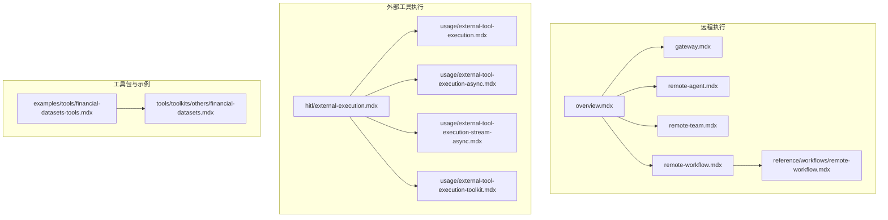
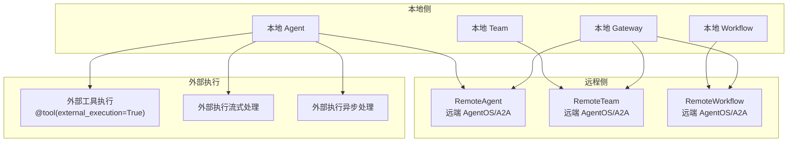
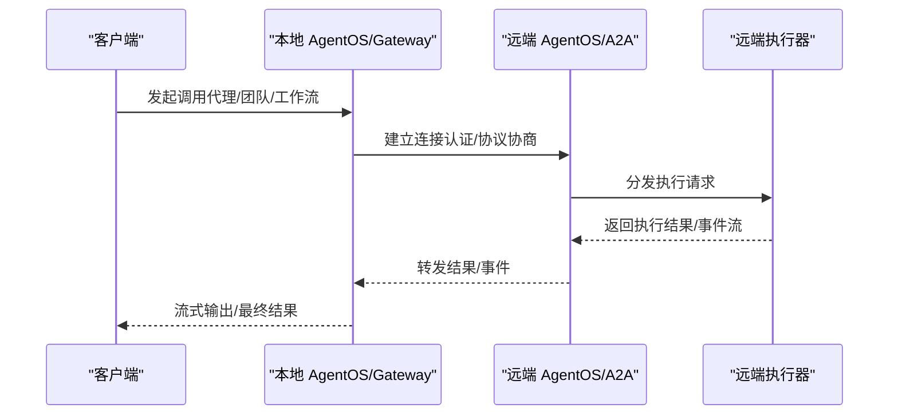
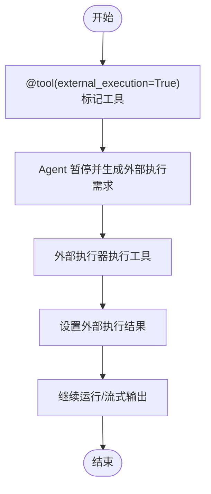
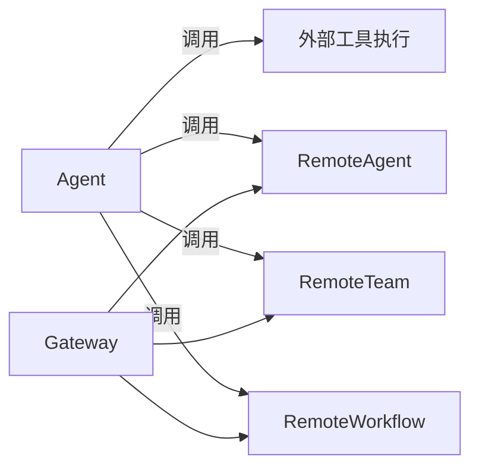

# 外部执行

<cite>
**本文引用的文件**
- [agent-os/remote-execution/overview.mdx](file://agent-os/remote-execution/overview.mdx)
- [agent-os/remote-execution/gateway.mdx](file://agent-os/remote-execution/gateway.mdx)
- [agent-os/remote-execution/remote-agent.mdx](file://agent-os/remote-execution/remote-agent.mdx)
- [agent-os/remote-execution/remote-team.mdx](file://agent-os/remote-execution/remote-team.mdx)
- [agent-os/remote-execution/remote-workflow.mdx](file://agent-os/remote-execution/remote-workflow.mdx)
- [reference/workflows/remote-workflow.mdx](file://reference/workflows/remote-workflow.mdx)
- [hitl/external-execution.mdx](file://hitl/external-execution.mdx)
- [hitl/usage/external-tool-execution.mdx](file://hitl/usage/external-tool-execution.mdx)
- [hitl/usage/external-tool-execution-async.mdx](file://hitl/usage/external-tool-execution-async.mdx)
- [hitl/usage/external-tool-execution-stream-async.mdx](file://hitl/usage/external-tool-execution-stream-async.mdx)
- [hitl/usage/external-tool-execution-toolkit.mdx](file://hitl/usage/external-tool-execution-toolkit.mdx)
- [examples/tools/financial-datasets-tools.mdx](file://examples/tools/financial-datasets-tools.mdx)
- [tools/toolkits/others/financial-datasets.mdx](file://tools/toolkits/others/financial-datasets.mdx)
</cite>

## 目录
1. [简介](#简介)
2. [项目结构](#项目结构)
3. [核心组件](#核心组件)
4. [架构总览](#架构总览)
5. [详细组件分析](#详细组件分析)
6. [依赖关系分析](#依赖关系分析)
7. [性能考量](#性能考量)
8. [故障排查指南](#故障排查指南)
9. [结论](#结论)
10. [附录](#附录)

## 简介
本技术文档围绕“外部执行”能力进行系统化说明，涵盖两类主要机制：
- 远程执行（Remote Execution）：在分布式或多实例环境中，通过远程代理（Agent）、团队（Team）、工作流（Workflow）或统一网关（Gateway）调用远端 AgentOS 实例或 A2A 兼容服务，实现跨边界协作与资源复用。
- 外部工具执行（External Tool Execution）：在本地 Agent 的运行过程中，对特定工具调用进行暂停并交由外部逻辑执行，以满足高安全、高权限、专用环境或合规审计等需求。

文档重点阐述：
- 设计理念与适用场景（高风险操作、特殊权限、专用环境）
- 触发条件与执行时机
- 同步与异步执行、流式处理与实时状态更新
- 监控与管理（状态跟踪、超时与错误恢复）
- 安全与合规（访问控制、审计日志）
- 工具包集成与多工具外部执行管理
- 在金融、医疗、法律等专业领域的应用示例与最佳实践

## 项目结构
本仓库中与“外部执行”相关的内容主要分布在以下模块：
- 远程执行：agent-os/remote-execution 下的 overview、gateway、remote-agent、remote-team、remote-workflow 及其参考文档
- 外部工具执行：hitl 下的 external-execution 及多个使用示例
- 工具包与外部执行集成：examples 与 tools/toolkits 中的相关示例与文档

**图表来源**
- [agent-os/remote-execution/overview.mdx:1-163](file://agent-os/remote-execution/overview.mdx#L1-L163)
- [agent-os/remote-execution/gateway.mdx:1-174](file://agent-os/remote-execution/gateway.mdx#L1-L174)
- [agent-os/remote-execution/remote-agent.mdx:1-156](file://agent-os/remote-execution/remote-agent.mdx#L1-L156)
- [agent-os/remote-execution/remote-team.mdx:1-163](file://agent-os/remote-execution/remote-team.mdx#L1-L163)
- [agent-os/remote-execution/remote-workflow.mdx:1-158](file://agent-os/remote-execution/remote-workflow.mdx#L1-L158)
- [reference/workflows/remote-workflow.mdx:1-218](file://reference/workflows/remote-workflow.mdx#L1-L218)
- [hitl/external-execution.mdx:1-306](file://hitl/external-execution.mdx#L1-L306)
- [hitl/usage/external-tool-execution.mdx:1-102](file://hitl/usage/external-tool-execution.mdx#L1-L102)
- [hitl/usage/external-tool-execution-async.mdx:1-105](file://hitl/usage/external-tool-execution-async.mdx#L1-L105)
- [hitl/usage/external-tool-execution-stream-async.mdx:1-114](file://hitl/usage/external-tool-execution-stream-async.mdx#L1-L114)
- [hitl/usage/external-tool-execution-toolkit.mdx:1-43](file://hitl/usage/external-tool-execution-toolkit.mdx#L1-L43)
- [examples/tools/financial-datasets-tools.mdx:1-219](file://examples/tools/financial-datasets-tools.mdx#L1-L219)
- [tools/toolkits/others/financial-datasets.mdx:1-83](file://tools/toolkits/others/financial-datasets.mdx#L1-L83)

**章节来源**
- [agent-os/remote-execution/overview.mdx:1-163](file://agent-os/remote-execution/overview.mdx#L1-L163)
- [hitl/external-execution.mdx:1-306](file://hitl/external-execution.mdx#L1-L306)

## 核心组件
- 远程执行子系统
  - RemoteAgent：在远端 AgentOS 或 A2A 服务器上执行代理，支持认证、流式响应与 A2A 协议连接。
  - RemoteTeam：在远端 AgentOS 或 A2A 服务器上执行团队，支持配置缓存与刷新。
  - RemoteWorkflow：在远端 AgentOS 或 A2A 服务器上执行工作流，支持参数传递、流式事件与取消运行。
  - AgentOS Gateway：聚合本地与远程的代理、团队、工作流，形成统一 API 网关，便于微服务与混合部署。
- 外部工具执行子系统
  - 工具装饰器标记：通过工具装饰器启用外部执行，使 Agent 在调用该工具前暂停，等待外部逻辑执行并回填结果。
  - 流式与异步支持：在流式与异步运行模式下，外部执行可无缝接入，实现实时状态更新与并发处理。
  - 工具包集成：支持在 Toolkit 中选择性地对外部执行工具进行管理，混合内部与外部工具。

**章节来源**
- [agent-os/remote-execution/remote-agent.mdx:1-156](file://agent-os/remote-execution/remote-agent.mdx#L1-L156)
- [agent-os/remote-execution/remote-team.mdx:1-163](file://agent-os/remote-execution/remote-team.mdx#L1-L163)
- [agent-os/remote-execution/remote-workflow.mdx:1-158](file://agent-os/remote-execution/remote-workflow.mdx#L1-L158)
- [reference/workflows/remote-workflow.mdx:1-218](file://reference/workflows/remote-workflow.mdx#L1-L218)
- [agent-os/remote-execution/gateway.mdx:1-174](file://agent-os/remote-execution/gateway.mdx#L1-L174)
- [hitl/external-execution.mdx:1-306](file://hitl/external-execution.mdx#L1-L306)

## 架构总览
下图展示了“远程执行”与“外部工具执行”的整体架构关系与交互路径。

**图表来源**
- [agent-os/remote-execution/overview.mdx:1-163](file://agent-os/remote-execution/overview.mdx#L1-L163)
- [agent-os/remote-execution/gateway.mdx:1-174](file://agent-os/remote-execution/gateway.mdx#L1-L174)
- [agent-os/remote-execution/remote-agent.mdx:1-156](file://agent-os/remote-execution/remote-agent.mdx#L1-L156)
- [agent-os/remote-execution/remote-team.mdx:1-163](file://agent-os/remote-execution/remote-team.mdx#L1-L163)
- [agent-os/remote-execution/remote-workflow.mdx:1-158](file://agent-os/remote-execution/remote-workflow.mdx#L1-L158)
- [hitl/external-execution.mdx:1-306](file://hitl/external-execution.mdx#L1-L306)

## 详细组件分析

### 组件一：远程执行（Remote Execution）
- 设计理念
  - 将复杂或多样的执行单元（代理、团队、工作流）托管于远端 AgentOS 或 A2A 兼容服务器，本地仅负责编排与调用，实现分布式与微服务化。
  - 支持统一网关聚合多个远端实例，形成单一入口，便于运维与扩展。
- 关键特性
  - 认证与授权：支持基于令牌的认证，以及网关对远端受保护端点的注意事项。
  - 流式与事件：支持流式响应与事件驱动的运行状态反馈。
  - A2A 协议：兼容多种 A2A 服务器（如 Google ADK），支持 REST 与 JSON-RPC。
- 使用要点
  - RemoteAgent/Team/Workflow 提供与本地一致的接口，便于替换与迁移。
  - Gateway 需要合理规划远端端点开放策略，确保配置与发现功能可用。

**图表来源**
- [agent-os/remote-execution/remote-agent.mdx:1-156](file://agent-os/remote-execution/remote-agent.mdx#L1-L156)
- [agent-os/remote-execution/remote-team.mdx:1-163](file://agent-os/remote-execution/remote-team.mdx#L1-L163)
- [agent-os/remote-execution/remote-workflow.mdx:1-158](file://agent-os/remote-execution/remote-workflow.mdx#L1-L158)
- [reference/workflows/remote-workflow.mdx:1-218](file://reference/workflows/remote-workflow.mdx#L1-L218)

**章节来源**
- [agent-os/remote-execution/overview.mdx:1-163](file://agent-os/remote-execution/overview.mdx#L1-L163)
- [agent-os/remote-execution/gateway.mdx:1-174](file://agent-os/remote-execution/gateway.mdx#L1-L174)
- [agent-os/remote-execution/remote-agent.mdx:1-156](file://agent-os/remote-execution/remote-agent.mdx#L1-L156)
- [agent-os/remote-execution/remote-team.mdx:1-163](file://agent-os/remote-execution/remote-team.mdx#L1-L163)
- [agent-os/remote-execution/remote-workflow.mdx:1-158](file://agent-os/remote-execution/remote-workflow.mdx#L1-L158)
- [reference/workflows/remote-workflow.mdx:1-218](file://reference/workflows/remote-workflow.mdx#L1-L218)

### 组件二：外部工具执行（External Tool Execution）
- 设计理念
  - 对高风险、高权限或需要专用环境的工具调用，采用“暂停-外部执行-回填”的模式，由业务侧在受控环境中完成实际执行，并将结果回传给 Agent 继续后续流程。
- 触发条件与时机
  - 当工具被标记为外部执行后，Agent 在调用该工具前会暂停，返回当前运行上下文与待执行工具信息；业务侧完成外部执行后，设置结果并继续运行。
- 同步与异步
  - 同步：run/continue_run
  - 异步：arun/acontinue_run，适用于后台任务与并发场景
- 流式处理
  - 在流式运行中，当遇到外部执行需求时，可在事件暂停期间执行外部逻辑，并继续流式输出。
- 工具包集成
  - 在 Toolkit 中指定哪些工具需要外部执行，实现内外混合的工具集管理。

**图表来源**
- [hitl/external-execution.mdx:1-306](file://hitl/external-execution.mdx#L1-L306)

**章节来源**
- [hitl/external-execution.mdx:1-306](file://hitl/external-execution.mdx#L1-L306)
- [hitl/usage/external-tool-execution.mdx:1-102](file://hitl/usage/external-tool-execution.mdx#L1-L102)
- [hitl/usage/external-tool-execution-async.mdx:1-105](file://hitl/usage/external-tool-execution-async.mdx#L1-L105)
- [hitl/usage/external-tool-execution-stream-async.mdx:1-114](file://hitl/usage/external-tool-execution-stream-async.mdx#L1-L114)
- [hitl/usage/external-tool-execution-toolkit.mdx:1-43](file://hitl/usage/external-tool-execution-toolkit.mdx#L1-L43)

### 组件三：工具包与外部执行管理
- 工具包中的外部执行
  - 在 Toolkit 中通过参数选择性地对外部执行工具进行管理，其他工具仍由 Agent 内部执行，实现灵活的混合策略。
- 执行流程优化
  - 将高风险或昂贵的工具置于外部执行，减少 Agent 侧的资源占用与安全风险；同时保持内部工具的低延迟与高吞吐。

**章节来源**
- [hitl/usage/external-tool-execution-toolkit.mdx:1-43](file://hitl/usage/external-tool-execution-toolkit.mdx#L1-L43)

### 场景化应用示例
- 金融服务
  - 使用金融数据工具包获取财务报表、股价、新闻等数据，结合外部执行对敏感查询进行受控执行与审计记录。
- 医疗诊断
  - 对涉及患者隐私或需要专用环境的诊断工具调用，采用外部执行确保合规与安全。
- 法律咨询
  - 对需要专业判断与外部验证的法律检索或合规检查，采用外部执行并记录完整审计轨迹。

**章节来源**
- [examples/tools/financial-datasets-tools.mdx:1-219](file://examples/tools/financial-datasets-tools.mdx#L1-L219)
- [tools/toolkits/others/financial-datasets.mdx:1-83](file://tools/toolkits/others/financial-datasets.mdx#L1-L83)

## 依赖关系分析
- 组件耦合
  - 远程执行依赖网络通信与认证机制；RemoteAgent/Team/Workflow 与 Gateway 之间存在组合关系。
  - 外部工具执行与 Agent 的运行时状态紧密耦合，需在暂停与继续之间保持上下文一致性。
- 外部依赖
  - 远程执行可对接 A2A 兼容服务器，协议类型（REST/JSON-RPC）影响客户端参数与行为。
  - 工具包依赖外部 API（如金融数据工具包）时，需关注速率限制与密钥管理。

**图表来源**
- [agent-os/remote-execution/gateway.mdx:1-174](file://agent-os/remote-execution/gateway.mdx#L1-L174)
- [agent-os/remote-execution/remote-agent.mdx:1-156](file://agent-os/remote-execution/remote-agent.mdx#L1-L156)
- [agent-os/remote-execution/remote-team.mdx:1-163](file://agent-os/remote-execution/remote-team.mdx#L1-L163)
- [agent-os/remote-execution/remote-workflow.mdx:1-158](file://agent-os/remote-execution/remote-workflow.mdx#L1-L158)
- [hitl/external-execution.mdx:1-306](file://hitl/external-execution.mdx#L1-L306)

**章节来源**
- [agent-os/remote-execution/gateway.mdx:1-174](file://agent-os/remote-execution/gateway.mdx#L1-L174)
- [agent-os/remote-execution/remote-agent.mdx:1-156](file://agent-os/remote-execution/remote-agent.mdx#L1-L156)
- [agent-os/remote-execution/remote-team.mdx:1-163](file://agent-os/remote-execution/remote-team.mdx#L1-L163)
- [agent-os/remote-execution/remote-workflow.mdx:1-158](file://agent-os/remote-execution/remote-workflow.mdx#L1-L158)
- [hitl/external-execution.mdx:1-306](file://hitl/external-execution.mdx#L1-L306)

## 性能考量
- 远程执行
  - 网络延迟与带宽：流式响应有助于降低感知延迟；建议合理设置超时与重试策略。
  - 并发与限流：在 Gateway 层面对远端实例进行负载均衡与限流，避免单点过载。
- 外部工具执行
  - 异步与流式：在高并发场景下优先采用异步与流式处理，提升吞吐与用户体验。
  - 结果缓存：对外部执行结果进行短期缓存，减少重复调用成本。
- 工具包
  - 对高频外部调用进行批量化与去重，遵守外部 API 的速率限制。

[本节为通用指导，无需具体文件引用]

## 故障排查指南
- 远程执行
  - 连接失败：检查远端服务可达性、认证令牌与协议配置（A2A 协议类型）。
  - 权限问题：确认网关对远端配置端点的访问策略，避免因全量保护导致功能异常。
  - 错误处理：捕获远端不可用异常并实现降级或重试逻辑。
- 外部工具执行
  - 必须回填结果：在继续运行前确保所有外部执行需求均已设置结果，否则会抛出校验错误。
  - 异步与流式：注意在暂停事件中正确设置结果后再继续流式输出。
  - 工具包：在 Toolkit 中仅对外部执行工具设置标记，避免与其他模式冲突。

**章节来源**
- [agent-os/remote-execution/remote-agent.mdx:96-112](file://agent-os/remote-execution/remote-agent.mdx#L96-L112)
- [agent-os/remote-execution/remote-team.mdx:117-133](file://agent-os/remote-execution/remote-team.mdx#L117-L133)
- [agent-os/remote-execution/remote-workflow.mdx:140-156](file://agent-os/remote-execution/remote-workflow.mdx#L140-L156)
- [hitl/external-execution.mdx:107-112](file://hitl/external-execution.mdx#L107-L112)
- [agent-os/remote-execution/gateway.mdx:161-173](file://agent-os/remote-execution/gateway.mdx#L161-L173)

## 结论
- 外部执行通过“远程执行”与“外部工具执行”两条主线，分别解决跨边界协作与高风险/高权限工具的可控执行问题。
- 远程执行适合分布式与微服务化部署，强调统一网关与协议兼容；外部工具执行适合安全与合规场景，强调暂停-外部执行-回填的闭环。
- 在金融、医疗、法律等专业领域，外部执行能够有效平衡安全性、合规性与执行效率，是构建企业级智能体系统的基础设施能力。

[本节为总结性内容，无需具体文件引用]

## 附录
- 快速参考
  - 远程执行：RemoteAgent/Team/Workflow 的认证、流式与 A2A 协议使用方法见对应文档。
  - 外部工具执行：同步/异步/流式的暂停与继续流程、工具包混合策略见示例与参考文档。
  - 工具包示例：金融数据工具包的安装、配置与使用示例见示例与工具包文档。

**章节来源**
- [reference/workflows/remote-workflow.mdx:1-218](file://reference/workflows/remote-workflow.mdx#L1-L218)
- [hitl/usage/external-tool-execution.mdx:1-102](file://hitl/usage/external-tool-execution.mdx#L1-L102)
- [hitl/usage/external-tool-execution-async.mdx:1-105](file://hitl/usage/external-tool-execution-async.mdx#L1-L105)
- [hitl/usage/external-tool-execution-stream-async.mdx:1-114](file://hitl/usage/external-tool-execution-stream-async.mdx#L1-L114)
- [examples/tools/financial-datasets-tools.mdx:1-219](file://examples/tools/financial-datasets-tools.mdx#L1-L219)
- [tools/toolkits/others/financial-datasets.mdx:1-83](file://tools/toolkits/others/financial-datasets.mdx#L1-L83)