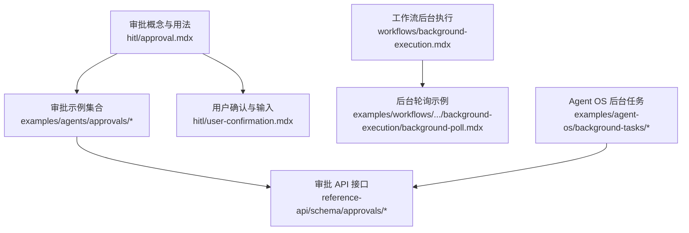
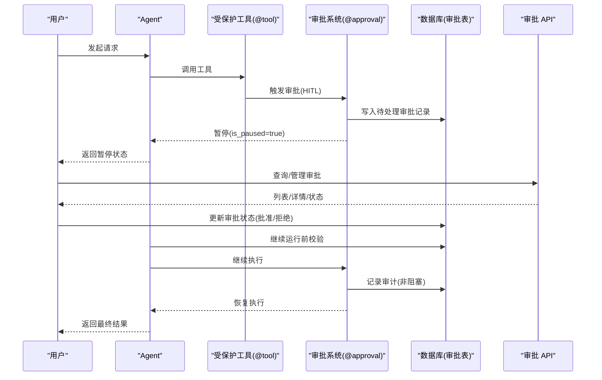
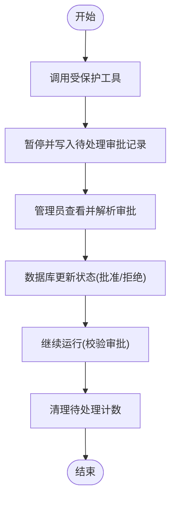
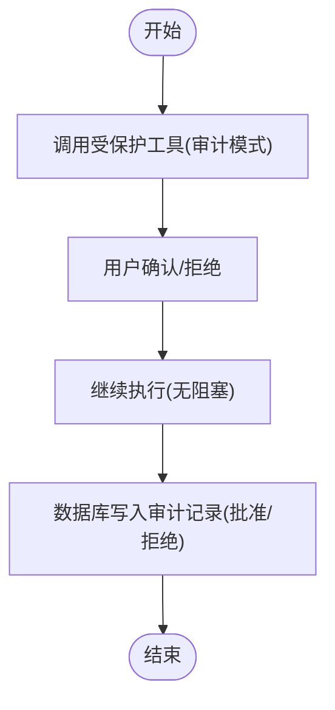
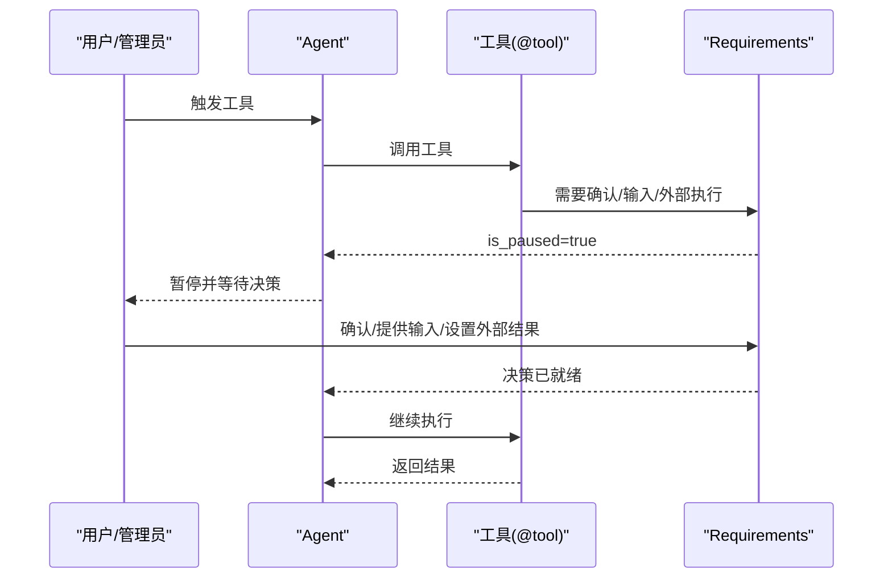
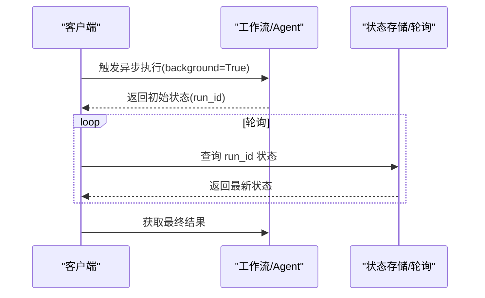
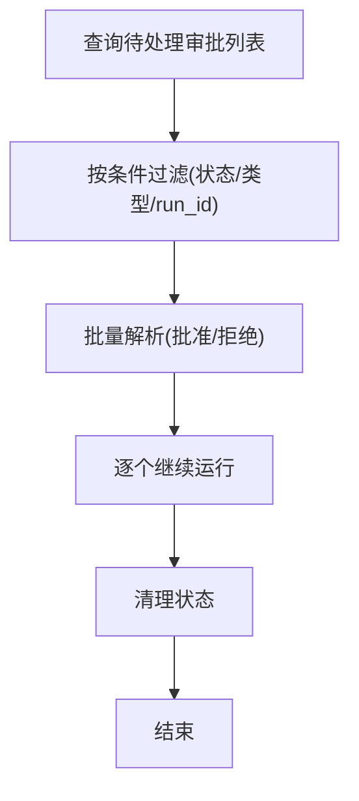
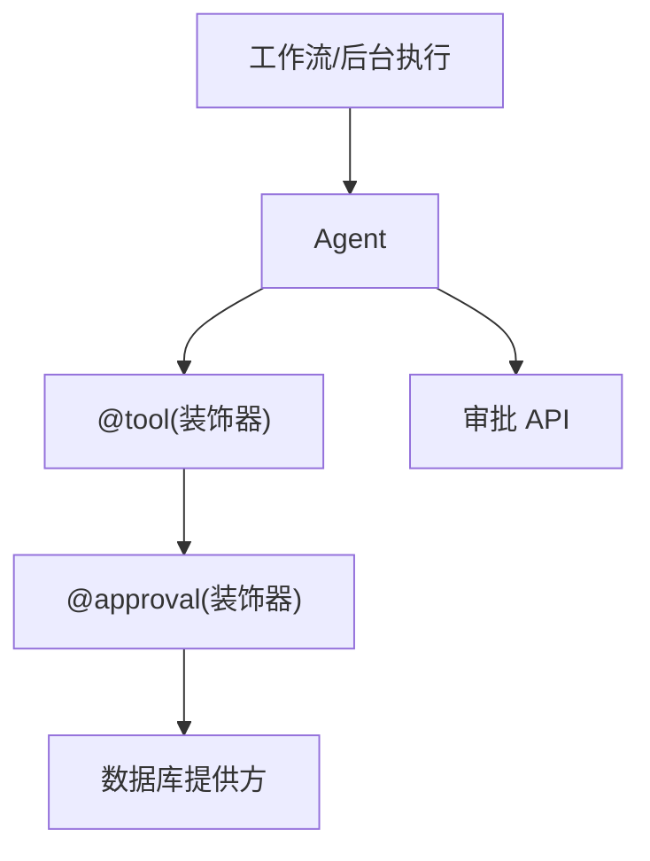

# 审批流程

<cite>
**本文引用的文件**
- [approval.mdx](file://hitl/approval.mdx)
- [user-confirmation.mdx](file://hitl/user-confirmation.mdx)
- [approval-basic.mdx](file://examples/agents/approvals/approval-basic.mdx)
- [approval-list-and-resolve.mdx](file://examples/agents/approvals/approval-list-and-resolve.mdx)
- [approval-async.mdx](file://examples/agents/approvals/approval-async.mdx)
- [approval-user-input.mdx](file://examples/agents/approvals/approval-user-input.mdx)
- [approval-external-execution.mdx](file://examples/agents/approvals/approval-external-execution.mdx)
- [audit-approval-overview.mdx](file://examples/agents/approvals/audit-approval-overview.mdx)
- [audit-approval-confirmation.mdx](file://examples/agents/approvals/audit-approval-confirmation.mdx)
- [background-execution.mdx](file://workflows/background-execution.mdx)
- [background-poll.mdx](file://examples/workflows/advanced-concepts/background-execution/background-poll.mdx)
- [background-output-evaluation.mdx](file://examples/agent-os/background-tasks/background-output-evaluation.mdx)
- [list-approvals.mdx](file://reference-api/schema/approvals/list-approvals.mdx)
- [get-approval.mdx](file://reference-api/schema/approvals/get-approval.mdx)
- [get-approval-status.mdx](file://reference-api/schema/approvals/get-approval-status.mdx)
- [delete-approval.mdx](file://reference-api/schema/approvals/delete-approval.mdx)
</cite>

## 目录
1. [简介](#简介)
2. [项目结构](#项目结构)
3. [核心组件](#核心组件)
4. [架构总览](#架构总览)
5. [详细组件分析](#详细组件分析)
6. [依赖关系分析](#依赖关系分析)
7. [性能考量](#性能考量)
8. [故障排查指南](#故障排查指南)
9. [结论](#结论)
10. [附录](#附录)

## 简介
本技术文档围绕“审批流程系统”展开，系统性阐述管理员审查、批准/拒绝与审计跟踪在关键决策中的作用；详解两种审批模式：强制审批模式（阻塞式，需批准才可继续）与审计模式（非阻塞式，仅记录日志）；并覆盖审批请求的创建与管理、审批规则定义、审批者分配、审批状态跟踪、异步审批处理与实时状态更新、审批列表与批量处理、审计审批实现、外部执行与审批结合、用户输入与审批集成，以及在财务授权、内容发布、系统配置变更等场景的应用与配置定制方法。

## 项目结构
审批流程相关的内容主要分布在以下区域：
- 概念与用法：位于 hitl 目录下的 approval 与 user-confirmation 文档，说明审批类型、执行流程与人机交互模式。
- 示例：位于 examples/agents/approvals 与 examples/workflows 下，涵盖基础审批、审计审批、用户输入、外部执行、异步审批、后台轮询与输出评估等。
- 参考 API：位于 reference-api/schema/approvals，提供审批相关接口的 OpenAPI 描述。

**图表来源**
- [approval.mdx](file://hitl/approval.mdx)
- [user-confirmation.mdx](file://hitl/user-confirmation.mdx)
- [list-approvals.mdx](file://reference-api/schema/approvals/list-approvals.mdx)
- [background-execution.mdx](file://workflows/background-execution.mdx)
- [background-poll.mdx](file://examples/workflows/advanced-concepts/background-execution/background-poll.mdx)
- [background-output-evaluation.mdx](file://examples/agent-os/background-tasks/background-output-evaluation.mdx)

**章节来源**
- [approval.mdx](file://hitl/approval.mdx)
- [user-confirmation.mdx](file://hitl/user-confirmation.mdx)
- [list-approvals.mdx](file://reference-api/schema/approvals/list-approvals.mdx)
- [get-approval.mdx](file://reference-api/schema/approvals/get-approval.mdx)
- [get-approval-status.mdx](file://reference-api/schema/approvals/get-approval-status.mdx)
- [delete-approval.mdx](file://reference-api/schema/approvals/delete-approval.mdx)

## 核心组件
- 审批装饰器与工具装饰器
  - 使用 @approval 装饰器标记工具，使其具备审批能力；支持 type="required"（默认阻塞）与 type="audit"（非阻塞审计）。
  - 工具可通过 requires_confirmation、requires_user_input 或 external_execution 触发不同的人机交互模式。
- 数据库持久化
  - 通过数据库提供方（如 SqliteDb）持久化审批记录，支持查询、计数、更新与删除。
- 运行时控制
  - run/continue_run 与 arun/acontinue_run 支持同步与异步运行；暂停与恢复由 active_requirements 驱动。
- 审批 API
  - 提供获取审批、获取状态、列出审批、删除审批等接口，便于前端或管理端集成。

**章节来源**
- [approval.mdx](file://hitl/approval.mdx)
- [approval-basic.mdx](file://examples/agents/approvals/approval-basic.mdx)
- [audit-approval-overview.mdx](file://examples/agents/approvals/audit-approval-overview.mdx)
- [list-approvals.mdx](file://reference-api/schema/approvals/list-approvals.mdx)
- [get-approval.mdx](file://reference-api/schema/approvals/get-approval.mdx)
- [get-approval-status.mdx](file://reference-api/schema/approvals/get-approval-status.mdx)
- [delete-approval.mdx](file://reference-api/schema/approvals/delete-approval.mdx)

## 架构总览
下图展示了从“用户触发工具调用”到“管理员审批/审计记录”再到“运行继续”的整体流程，以及与数据库和 API 的交互。

**图表来源**
- [approval.mdx](file://hitl/approval.mdx)
- [approval-basic.mdx](file://examples/agents/approvals/approval-basic.mdx)
- [audit-approval-overview.mdx](file://examples/agents/approvals/audit-approval-overview.mdx)
- [list-approvals.mdx](file://reference-api/schema/approvals/list-approvals.mdx)

## 详细组件分析

### 强制审批模式（阻塞式）
- 行为特征
  - 默认 @approval 即 type="required"，工具调用触发暂停并在数据库写入待处理记录。
  - 管理员在数据库中将记录更新为 approved/rejected，并使用 run_id 继续运行。
  - 继续运行前会校验审批记录状态，避免竞态。
- 关键步骤
  - 触发工具 → 暂停 → 数据库写入待处理 → 管理员更新状态 → 继续运行 → 清理待处理计数。
- 示例参考
  - 基础审批：[approval-basic.mdx](file://examples/agents/approvals/approval-basic.mdx)
  - 批量列表与解析：[approval-list-and-resolve.mdx](file://examples/agents/approvals/approval-list-and-resolve.mdx)
  - 异步审批：[approval-async.mdx](file://examples/agents/approvals/approval-async.mdx)
  - 用户输入审批：[approval-user-input.mdx](file://examples/agents/approvals/approval-user-input.mdx)
  - 外部执行审批：[approval-external-execution.mdx](file://examples/agents/approvals/approval-external-execution.mdx)

**图表来源**
- [approval.mdx](file://hitl/approval.mdx)
- [approval-basic.mdx](file://examples/agents/approvals/approval-basic.mdx)
- [approval-list-and-resolve.mdx](file://examples/agents/approvals/approval-list-and-resolve.mdx)

**章节来源**
- [approval.mdx](file://hitl/approval.mdx)
- [approval-basic.mdx](file://examples/agents/approvals/approval-basic.mdx)
- [approval-list-and-resolve.mdx](file://examples/agents/approvals/approval-list-and-resolve.mdx)
- [approval-async.mdx](file://examples/agents/approvals/approval-async.mdx)
- [approval-user-input.mdx](file://examples/agents/approvals/approval-user-input.mdx)
- [approval-external-execution.mdx](file://examples/agents/approvals/approval-external-execution.mdx)

### 审计模式（非阻塞式）
- 行为特征
  - @approval(type="audit") 不阻塞执行，工具直接运行；在用户确认后，系统记录审计日志（批准/拒绝）。
  - 适用于合规与审计目的，无需等待管理员介入即可完成。
- 关键步骤
  - 触发工具 → 用户确认 → 继续执行 → 数据库写入审计记录 → 无阻塞完成。
- 示例参考
  - 审计概览：[audit-approval-overview.mdx](file://examples/agents/approvals/audit-approval-overview.mdx)
  - 审计+确认/拒绝：[audit-approval-confirmation.mdx](file://examples/agents/approvals/audit-approval-confirmation.mdx)

**图表来源**
- [audit-approval-overview.mdx](file://examples/agents/approvals/audit-approval-overview.mdx)
- [audit-approval-confirmation.mdx](file://examples/agents/approvals/audit-approval-confirmation.mdx)

**章节来源**
- [audit-approval-overview.mdx](file://examples/agents/approvals/audit-approval-overview.mdx)
- [audit-approval-confirmation.mdx](file://examples/agents/approvals/audit-approval-confirmation.mdx)

### 用户确认与输入集成
- 用户确认
  - 工具标注 requires_confirmation=True 后，运行暂停，等待用户决定；支持多工具混合场景。
- 用户输入
  - 工具标注 requires_user_input=True 并指定字段，运行暂停后由管理员/用户补充输入。
- 外部执行
  - 工具标注 external_execution=True，运行暂停后由外部系统执行并回传结果。
- 示例参考
  - 用户确认：[user-confirmation.mdx](file://hitl/user-confirmation.mdx)
  - 用户输入审批：[approval-user-input.mdx](file://examples/agents/approvals/approval-user-input.mdx)
  - 外部执行审批：[approval-external-execution.mdx](file://examples/agents/approvals/approval-external-execution.mdx)

**图表来源**
- [user-confirmation.mdx](file://hitl/user-confirmation.mdx)
- [approval-user-input.mdx](file://examples/agents/approvals/approval-user-input.mdx)
- [approval-external-execution.mdx](file://examples/agents/approvals/approval-external-execution.mdx)

**章节来源**
- [user-confirmation.mdx](file://hitl/user-confirmation.mdx)
- [approval-user-input.mdx](file://examples/agents/approvals/approval-user-input.mdx)
- [approval-external-execution.mdx](file://examples/agents/approvals/approval-external-execution.mdx)

### 异步审批与实时状态更新
- 异步运行
  - 使用 arun/acontinue_run 支持异步审批流程，适合高并发与长耗时任务。
- 实时状态更新
  - 结合后台轮询（定时轮询 run 状态）或 WebSocket（示例见工作流背景执行文档）实现状态推送。
- 示例参考
  - 异步审批：[approval-async.mdx](file://examples/agents/approvals/approval-async.mdx)
  - 工作流后台执行与轮询：[background-execution.mdx](file://workflows/background-execution.mdx)、[background-poll.mdx](file://examples/workflows/advanced-concepts/background-execution/background-poll.mdx)
  - Agent OS 后台输出评估：[background-output-evaluation.mdx](file://examples/agent-os/background-tasks/background-output-evaluation.mdx)

**图表来源**
- [background-execution.mdx](file://workflows/background-execution.mdx)
- [background-poll.mdx](file://examples/workflows/advanced-concepts/background-execution/background-poll.mdx)
- [approval-async.mdx](file://examples/agents/approvals/approval-async.mdx)

**章节来源**
- [approval-async.mdx](file://examples/agents/approvals/approval-async.mdx)
- [background-execution.mdx](file://workflows/background-execution.mdx)
- [background-poll.mdx](file://examples/workflows/advanced-concepts/background-execution/background-poll.mdx)
- [background-output-evaluation.mdx](file://examples/agent-os/background-tasks/background-output-evaluation.mdx)

### 审批列表与批量处理
- 列表与筛选
  - 支持按状态、类型、run_id 等条件查询审批列表与计数。
- 批量处理
  - 可对多个待处理审批进行批准/拒绝，并在完成后继续对应运行。
- 示例参考
  - 批量列表与解析：[approval-list-and-resolve.mdx](file://examples/agents/approvals/approval-list-and-resolve.mdx)

**图表来源**
- [approval-list-and-resolve.mdx](file://examples/agents/approvals/approval-list-and-resolve.mdx)

**章节来源**
- [approval-list-and-resolve.mdx](file://examples/agents/approvals/approval-list-and-resolve.mdx)

### 审计审批实现（无阻塞日志）
- 审计记录
  - 审计模式下，审批记录以“批准/拒绝”形式写入数据库，不阻塞执行。
- 分类与分离
  - 通过 approval_type 字段区分 required 与 audit，便于查询与报表。
- 示例参考
  - 审计概览与分离验证：[audit-approval-overview.mdx](file://examples/agents/approvals/audit-approval-overview.mdx)

**章节来源**
- [audit-approval-overview.mdx](file://examples/agents/approvals/audit-approval-overview.mdx)

### 外部执行与审批结合
- 场景说明
  - 对于需要外部系统执行的任务（如部署），可在审批暂停后由外部系统执行并回传结果，再继续运行。
- 示例参考
  - 外部执行审批：[approval-external-execution.mdx](file://examples/agents/approvals/approval-external-execution.mdx)

**章节来源**
- [approval-external-execution.mdx](file://examples/agents/approvals/approval-external-execution.mdx)

### 用户输入与审批集成
- 输入收集
  - 在审批暂停阶段，管理员/用户可提供所需字段，随后确认工具执行。
- 示例参考
  - 用户输入审批：[approval-user-input.mdx](file://examples/agents/approvals/approval-user-input.mdx)

**章节来源**
- [approval-user-input.mdx](file://examples/agents/approvals/approval-user-input.mdx)

### 典型应用场景与配置
- 财务授权
  - 使用强制审批模式，要求管理员批准后方可执行转账/支付等敏感操作。
- 内容发布
  - 对高风险发布（如生产环境）采用强制审批；对常规审计性发布采用审计模式记录。
- 系统配置变更
  - 关键配置变更采用强制审批；日常变更采用审计模式留痕。
- 配置要点
  - 工具装饰器选择：requires_confirmation / requires_user_input / external_execution。
  - 审批类型：@approval 与 @approval(type="audit")。
  - 数据库字段：status、approval_type、resolved_by、resolved_at、context 等。
  - API 使用：列出/获取/状态/删除审批，结合管理端界面或自动化脚本。

**章节来源**
- [approval.mdx](file://hitl/approval.mdx)
- [approval-basic.mdx](file://examples/agents/approvals/approval-basic.mdx)
- [audit-approval-overview.mdx](file://examples/agents/approvals/audit-approval-overview.mdx)
- [approval-user-input.mdx](file://examples/agents/approvals/approval-user-input.mdx)
- [approval-external-execution.mdx](file://examples/agents/approvals/approval-external-execution.mdx)

## 依赖关系分析
- 组件耦合
  - Agent 与工具装饰器强耦合，工具通过装饰器声明审批需求。
  - 审批系统依赖数据库提供方进行持久化，API 作为外部入口。
  - 异步与后台执行依赖工作流引擎与轮询/WS 机制。
- 外部依赖
  - HTTP 客户端用于外部服务调用（示例中用于获取数据）。
  - 数据库驱动用于审批记录的增删改查。

**图表来源**
- [approval.mdx](file://hitl/approval.mdx)
- [approval-basic.mdx](file://examples/agents/approvals/approval-basic.mdx)
- [background-execution.mdx](file://workflows/background-execution.mdx)

**章节来源**
- [approval.mdx](file://hitl/approval.mdx)
- [approval-basic.mdx](file://examples/agents/approvals/approval-basic.mdx)
- [background-execution.mdx](file://workflows/background-execution.mdx)

## 性能考量
- 数据库写入与查询
  - 审批记录写入与查询应尽量使用索引字段（如 status、approval_type、run_id）以降低延迟。
- 异步与并发
  - 异步运行与后台轮询可提升吞吐；注意轮询间隔与超时策略，避免过度轮询。
- 竞态防护
  - 更新审批状态时使用 expected_status 保护，避免并发冲突导致的状态不一致。
- 日志与审计
  - 审计模式不阻塞执行，但需确保审计记录的完整性与可追溯性。

[本节为通用指导，无需特定文件引用]

## 故障排查指南
- 常见问题
  - 继续运行时报错：检查审批记录是否存在且状态已更新为 approved/rejected。
  - 双重解析失败：确认使用 expected_status 保护，避免并发覆盖。
  - 待处理计数异常：核对数据库状态与清理逻辑。
- 排查步骤
  - 查询审批列表与状态，定位具体记录。
  - 校验数据库字段（status、approval_type、resolved_by、resolved_at）是否正确。
  - 重新尝试继续运行，观察错误信息。
- 示例参考
  - 列表与解析：[approval-list-and-resolve.mdx](file://examples/agents/approvals/approval-list-and-resolve.mdx)

**章节来源**
- [approval-list-and-resolve.mdx](file://examples/agents/approvals/approval-list-and-resolve.mdx)

## 结论
审批流程系统通过“强制审批模式”与“审计模式”的组合，实现了对关键决策的可控与可观测。配合数据库持久化、API 接口、异步运行与后台轮询，既能满足安全合规要求，又能保证用户体验与系统性能。在财务授权、内容发布、系统配置变更等场景中，可依据风险等级灵活选择审批策略，并通过统一的配置与接口实现标准化落地。

[本节为总结性内容，无需特定文件引用]

## 附录
- 审批 API 参考
  - 列出审批：GET /approvals
  - 获取审批：GET /approvals/{approval_id}
  - 获取审批状态：GET /approvals/{approval_id}/status
  - 删除审批：DELETE /approvals/{approval_id}
- 示例清单
  - 基础审批：[approval-basic.mdx](file://examples/agents/approvals/approval-basic.mdx)
  - 审计审批：[audit-approval-overview.mdx](file://examples/agents/approvals/audit-approval-overview.mdx)
  - 用户输入审批：[approval-user-input.mdx](file://examples/agents/approvals/approval-user-input.mdx)
  - 外部执行审批：[approval-external-execution.mdx](file://examples/agents/approvals/approval-external-execution.mdx)
  - 异步审批：[approval-async.mdx](file://examples/agents/approvals/approval-async.mdx)
  - 批量列表与解析：[approval-list-and-resolve.mdx](file://examples/agents/approvals/approval-list-and-resolve.mdx)
  - 工作流后台执行与轮询：[background-execution.mdx](file://workflows/background-execution.mdx)、[background-poll.mdx](file://examples/workflows/advanced-concepts/background-execution/background-poll.mdx)
  - Agent OS 后台输出评估：[background-output-evaluation.mdx](file://examples/agent-os/background-tasks/background-output-evaluation.mdx)

**章节来源**
- [list-approvals.mdx](file://reference-api/schema/approvals/list-approvals.mdx)
- [get-approval.mdx](file://reference-api/schema/approvals/get-approval.mdx)
- [get-approval-status.mdx](file://reference-api/schema/approvals/get-approval-status.mdx)
- [delete-approval.mdx](file://reference-api/schema/approvals/delete-approval.mdx)
- [approval-basic.mdx](file://examples/agents/approvals/approval-basic.mdx)
- [audit-approval-overview.mdx](file://examples/agents/approvals/audit-approval-overview.mdx)
- [approval-user-input.mdx](file://examples/agents/approvals/approval-user-input.mdx)
- [approval-external-execution.mdx](file://examples/agents/approvals/approval-external-execution.mdx)
- [approval-async.mdx](file://examples/agents/approvals/approval-async.mdx)
- [approval-list-and-resolve.mdx](file://examples/agents/approvals/approval-list-and-resolve.mdx)
- [background-execution.mdx](file://workflows/background-execution.mdx)
- [background-poll.mdx](file://examples/workflows/advanced-concepts/background-execution/background-poll.mdx)
- [background-output-evaluation.mdx](file://examples/agent-os/background-tasks/background-output-evaluation.mdx)