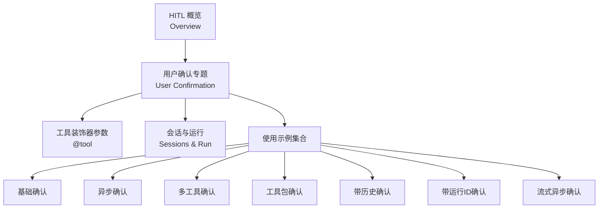
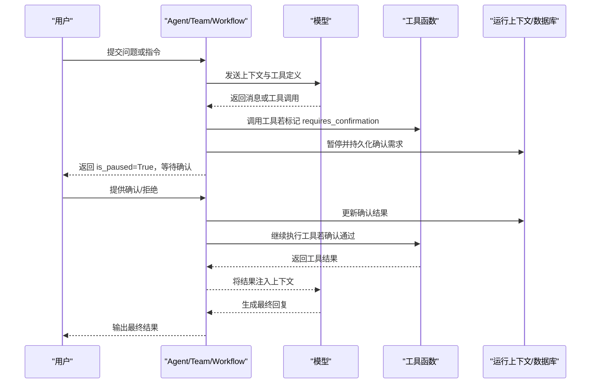
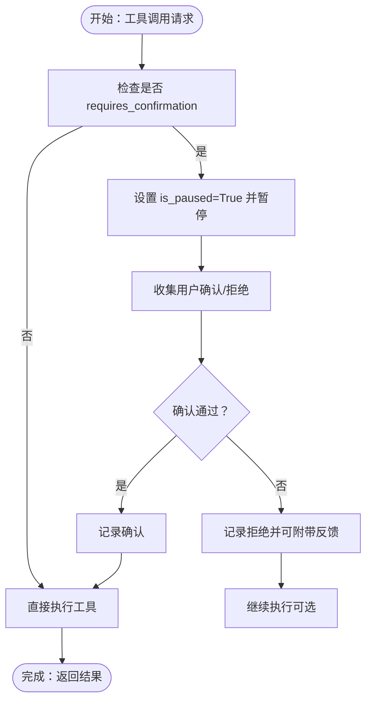
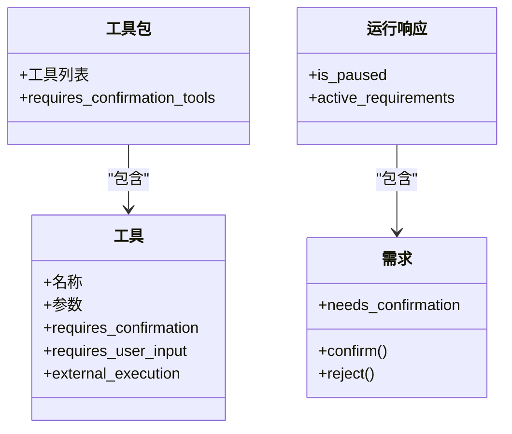
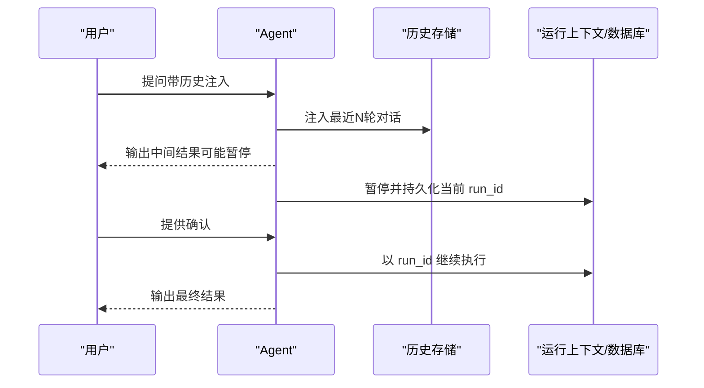
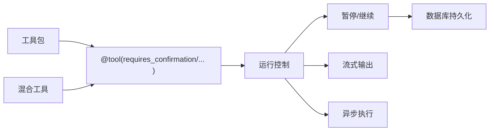

# 用户确认

<cite>
**本文引用的文件**
- [用户确认（User Confirmation）](file://hitl/user-confirmation.mdx)
- [人类在回路（HITL）概览](file://hitl/overview.mdx)
- [工具装饰器参考](file://reference/tools/decorator.mdx)
- [会话与运行（Sessions）概览](file://sessions/overview.mdx)
- [运行上下文（RunContext）](file://reference/run/run-context.mdx)
- [工具总览](file://tools/overview.mdx)
- [外部执行（External Execution）](file://hitl/external-execution.mdx)
- [审批（Approval）](file://hitl/approval.mdx)
- [确认：基础示例](file://hitl/usage/confirmation-required.mdx)
- [确认：异步示例](file://hitl/usage/confirmation-required-async.mdx)
- [确认：多工具示例](file://hitl/usage/confirmation-required-multiple-tools.mdx)
- [确认：工具包示例](file://hitl/usage/confirmation-required-toolkit.mdx)
- [确认：带历史示例](file://hitl/usage/confirmation-required-with-history.mdx)
- [确认：带运行ID示例](file://hitl/usage/confirmation-required-with-run-id.mdx)
- [确认：流式异步示例](file://hitl/usage/confirmation-required-stream-async.mdx)
- [基础示例：人机交互（含确认）](file://examples/basics/human-in-the-loop.mdx)
</cite>

## 目录
1. [简介](#简介)
2. [项目结构](#项目结构)
3. [核心组件](#核心组件)
4. [架构总览](#架构总览)
5. [详细组件分析](#详细组件分析)
6. [依赖关系分析](#依赖关系分析)
7. [性能考量](#性能考量)
8. [故障排查指南](#故障排查指南)
9. [结论](#结论)
10. [附录](#附录)

## 简介
本技术文档围绕“用户确认”机制展开，系统阐述在执行敏感工具调用前要求明确用户批准的重要意义与实现路径。文档覆盖以下关键主题：
- 触发条件与时机：在工具调用前的检查点与决策点
- 实现流程：确认请求的创建、用户响应的收集与确认结果的处理
- 同步与异步两种实现方式，以及流式处理的确认体验
- 工具包中的确认管理：对多个工具的确认控制与混合工具类型的处理
- 带历史记录与运行ID的确认流程：上下文保持与状态恢复
- 完整示例与最佳实践：在不同场景下的应用建议

## 项目结构
本仓库中与“用户确认”直接相关的内容主要分布在以下区域：
- HITL 概览与用户确认专题页面
- 工具装饰器参数说明（包含 requires_confirmation）
- 会话与运行（Session/Run）机制说明
- 多个“确认”使用示例（基础、异步、多工具、工具包、带历史、带运行ID、流式异步）

**图表来源**
- [人类在回路（HITL）概览:1-29](file://hitl/overview.mdx#L1-L29)
- [用户确认（User Confirmation）:1-258](file://hitl/user-confirmation.mdx#L1-L258)
- [工具装饰器参考:1-21](file://reference/tools/decorator.mdx#L1-L21)
- [会话与运行（Sessions）概览:1-87](file://sessions/overview.mdx#L1-L87)

**章节来源**
- [人类在回路（HITL）概览:1-29](file://hitl/overview.mdx#L1-L29)
- [用户确认（User Confirmation）:1-258](file://hitl/user-confirmation.mdx#L1-L258)
- [工具装饰器参考:1-21](file://reference/tools/decorator.mdx#L1-L21)
- [会话与运行（Sessions）概览:1-87](file://sessions/overview.mdx#L1-L87)

## 核心组件
- 工具装饰器参数
  - requires_confirmation：标记工具需要用户确认后方可执行
  - requires_user_input / external_execution：与确认互斥，三者只能择一
- 运行时暂停与继续
  - run_response.is_paused：当存在待处理的确认需求时置为真
  - requirement.confirm()/reject()：更新确认结果
  - continue_run()/acontinue_run()：在用户确认后继续执行
- 流式与异步支持
  - run(..., stream=True)：在流式输出中遇到确认点可暂停并继续
  - arun()/acontinue_run()：异步模式下的确认与继续
- 工具包与混合工具
  - 工具包级 requires_confirmation_tools：仅对工具包内部分工具启用确认
  - 混合工具：既有确认工具，也有无需确认的工具，按需暂停

**章节来源**
- [用户确认（User Confirmation）:15-195](file://hitl/user-confirmation.mdx#L15-L195)
- [工具装饰器参考:1-21](file://reference/tools/decorator.mdx#L1-L21)
- [外部执行（External Execution）:246-271](file://hitl/external-execution.mdx#L246-L271)

## 架构总览
下图展示了从“模型请求工具调用”到“用户确认与继续执行”的端到端流程。

**图表来源**
- [用户确认（User Confirmation）:15-24](file://hitl/user-confirmation.mdx#L15-L24)
- [会话与运行（Sessions）概览:12-20](file://sessions/overview.mdx#L12-L20)
- [运行上下文（RunContext）:10-21](file://reference/run/run-context.mdx#L10-L21)

## 详细组件分析

### 组件A：用户确认机制（同步与异步）
- 触发条件
  - 工具被模型请求调用且标记 requires_confirmation=True
  - 工具执行前暂停，设置 run_response.is_paused=True
- 用户响应收集
  - 遍历 run_response.active_requirements，识别 needs_confirmation 的需求
  - 通过 requirement.confirm()/reject() 设置确认结果
- 结果处理与继续
  - 使用 continue_run(run_id, requirements)/acontinue_run(run_response) 继续执行
- 异步与流式
  - 异步：arun()/acontinue_run() 支持非阻塞继续
  - 流式：run(..., stream=True) 在暂停时仍可继续流式输出

**图表来源**
- [用户确认（User Confirmation）:15-195](file://hitl/user-confirmation.mdx#L15-L195)

**章节来源**
- [用户确认（User Confirmation）:15-195](file://hitl/user-confirmation.mdx#L15-L195)
- [确认：基础示例:1-127](file://hitl/usage/confirmation-required.mdx#L1-L127)
- [确认：异步示例:1-121](file://hitl/usage/confirmation-required-async.mdx#L1-L121)
- [确认：流式异步示例:1-99](file://hitl/usage/confirmation-required-stream-async.mdx#L1-L99)

### 组件B：工具包与混合工具的确认管理
- 工具包级确认
  - 通过工具包构造函数传入 requires_confirmation_tools，仅对指定工具启用确认
- 混合工具场景
  - 工具集中既有确认工具，也有无需确认的工具；仅对需要确认的工具暂停
- 示例要点
  - 仅对工具包内的特定方法（如 get_stock_price）启用确认
  - 其他方法自动执行，不打断整体流程

**图表来源**
- [用户确认（User Confirmation）:61-104](file://hitl/user-confirmation.mdx#L61-L104)
- [工具装饰器参考:15-18](file://reference/tools/decorator.mdx#L15-L18)

**章节来源**
- [用户确认（User Confirmation）:61-104](file://hitl/user-confirmation.mdx#L61-L104)
- [确认：工具包示例:1-86](file://hitl/usage/confirmation-required-toolkit.mdx#L1-L86)
- [确认：多工具示例:1-123](file://hitl/usage/confirmation-required-multiple-tools.mdx#L1-L123)

### 组件C：带历史记录与运行ID的确认流程
- 历史注入
  - 通过 add_history_to_context 与 num_history_runs 将历史注入上下文，辅助用户决策
- 运行ID与状态恢复
  - 使用 run_id 标识一次会话中的多次运行，便于在暂停后继续同一会话
  - RunContext 提供 run_id、session_id、user_id 等关键标识，用于跨轮次状态恢复

**图表来源**
- [用户确认（User Confirmation）:243-256](file://hitl/user-confirmation.mdx#L243-L256)
- [确认：带历史示例:1-121](file://hitl/usage/confirmation-required-with-history.mdx#L1-L121)
- [确认：带运行ID示例:1-117](file://hitl/usage/confirmation-required-with-run-id.mdx#L1-L117)
- [会话与运行（Sessions）概览:12-20](file://sessions/overview.mdx#L12-L20)
- [运行上下文（RunContext）:10-21](file://reference/run/run-context.mdx#L10-L21)

**章节来源**
- [用户确认（User Confirmation）:243-256](file://hitl/user-confirmation.mdx#L243-L256)
- [确认：带历史示例:1-121](file://hitl/usage/confirmation-required-with-history.mdx#L1-L121)
- [确认：带运行ID示例:1-117](file://hitl/usage/confirmation-required-with-run-id.mdx#L1-L117)
- [会话与运行（Sessions）概览:12-20](file://sessions/overview.mdx#L12-L20)
- [运行上下文（RunContext）:10-21](file://reference/run/run-context.mdx#L10-L21)

### 组件D：与审批（Approval）及外部执行的关系
- 审批（Approval）
  - 适用于“管理员授权”或“审计日志”场景，工具可标注 approval，运行暂停并写入数据库待处理
  - 可与 requires_confirmation 搭配，形成“先确认再审批”的双层控制
- 外部执行（External Execution）
  - 工具在代理控制之外执行，与 requires_confirmation 互斥
  - 适合需要额外安全校验或合规流程的场景

**章节来源**
- [审批（Approval）:1-55](file://hitl/approval.mdx#L1-L55)
- [外部执行（External Execution）:246-271](file://hitl/external-execution.mdx#L246-L271)
- [用户确认（User Confirmation）:191-195](file://hitl/user-confirmation.mdx#L191-L195)

## 依赖关系分析
- 工具装饰器参数与运行控制
  - requires_confirmation 与 requires_user_input、external_execution 三者互斥
  - 工具执行前由运行框架检测并决定是否暂停
- 会话与运行
  - run_id 与 session_id 用于跨轮次状态恢复与历史注入
  - 数据库用于持久化暂停状态与历史记录
- 工具包与混合工具
  - 工具包可选择性地对部分工具启用确认，提升灵活性

**图表来源**
- [工具装饰器参考:15-18](file://reference/tools/decorator.mdx#L15-L18)
- [用户确认（User Confirmation）:15-195](file://hitl/user-confirmation.mdx#L15-L195)
- [会话与运行（Sessions）概览:12-20](file://sessions/overview.mdx#L12-L20)

**章节来源**
- [工具装饰器参考:15-18](file://reference/tools/decorator.mdx#L15-L18)
- [用户确认（User Confirmation）:15-195](file://hitl/user-confirmation.mdx#L15-L195)
- [会话与运行（Sessions）概览:12-20](file://sessions/overview.mdx#L12-L20)

## 性能考量
- 并发工具执行
  - 使用异步运行（arun/aprint_response）时，工具可并发执行，提高吞吐
  - 确认点可能出现在并发执行期间，需确保暂停与继续的原子性
- 流式输出
  - 流式场景下，确认点暂停后应尽快恢复流式输出，避免阻塞
- 历史注入
  - 历史注入会增加上下文长度，注意控制历史轮数与字段大小，避免超出模型上下文限制

**章节来源**
- [工具总览:160-174](file://tools/overview.mdx#L160-L174)
- [用户确认（User Confirmation）:173-189](file://hitl/user-confirmation.mdx#L173-L189)

## 故障排查指南
- 症状：工具未暂停
  - 检查工具是否正确标记 requires_confirmation=True
  - 确认运行响应 is_paused 是否为真
- 症状：继续执行报错
  - 确保在 continue_run/acontinue_run 中传入 updated_tools 或 requirements
  - 若使用流式，确保在暂停后继续时仍开启 stream=True
- 症状：历史未生效
  - 检查 add_history_to_context 与 num_history_runs 参数
  - 确认数据库已配置以支持历史持久化
- 症状：运行ID无法恢复
  - 确保在暂停时保存 run_id，并在继续时传入该 run_id
  - 检查数据库中是否存在对应记录

**章节来源**
- [用户确认（User Confirmation）:57-58](file://hitl/user-confirmation.mdx#L57-L58)
- [确认：带历史示例:60-88](file://hitl/usage/confirmation-required-with-history.mdx#L60-L88)
- [确认：带运行ID示例:79-82](file://hitl/usage/confirmation-required-with-run-id.mdx#L79-L82)
- [会话与运行（Sessions）概览:22-28](file://sessions/overview.mdx#L22-L28)

## 结论
用户确认机制为敏感工具调用提供了可控的人类监督入口，既保证了安全性，又维持了自动化效率。通过 requires_confirmation 参数、运行暂停/继续机制、会话与运行ID管理、以及工具包与混合工具的支持，开发者可以在多种场景下灵活落地确认策略。配合历史注入与异步/流式能力，可在复杂业务中实现高可用、可观测、可恢复的确认流程。

## 附录
- 快速上手步骤
  - 为工具添加 requires_confirmation=True
  - 执行 run()/arun()，在 is_paused=True 时收集用户确认
  - 使用 continue_run()/acontinue_run() 传入 updated_tools 或 requirements 继续
- 推荐实践
  - 对高风险操作（删除、转账、修改数据）统一启用确认
  - 在工具包中仅对必要工具启用确认，减少不必要的中断
  - 使用 run_id 与数据库实现跨轮次恢复与审计
  - 在流式场景中，暂停后尽快恢复输出，避免长时间阻塞

**章节来源**
- [用户确认（User Confirmation）:26-195](file://hitl/user-confirmation.mdx#L26-L195)
- [基础示例：人机交互（含确认）:201-236](file://examples/basics/human-in-the-loop.mdx#L201-L236)