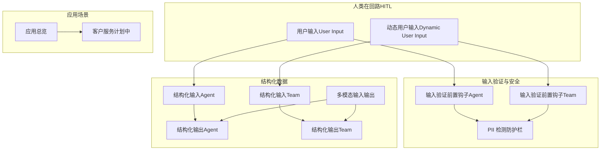
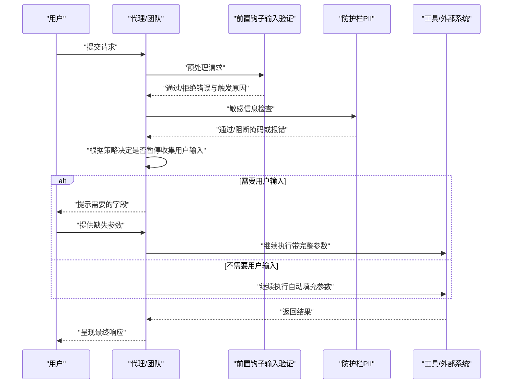
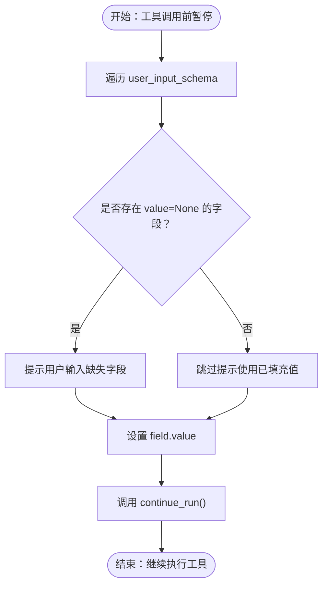
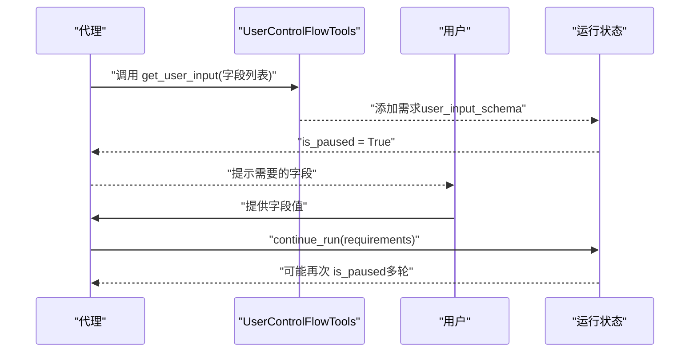
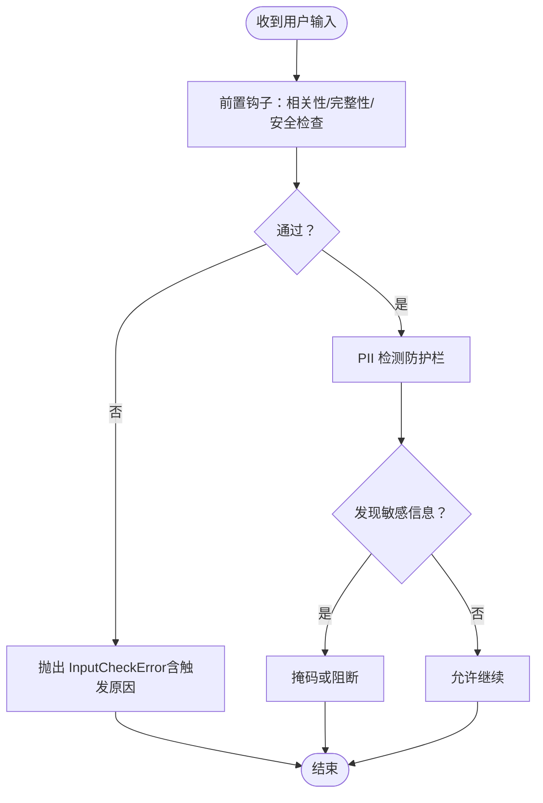
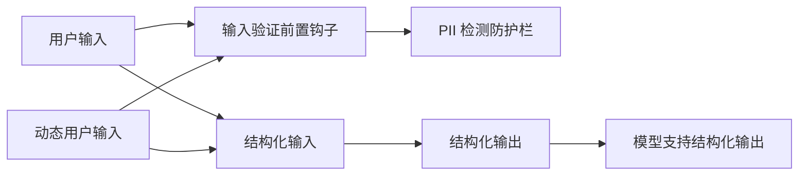

# 用户输入

<cite>
**本文引用的文件**
- [用户输入（User Input）](file://hitl/user-input.mdx)
- [动态用户输入（Dynamic User Input）](file://hitl/dynamic-user-input.mdx)
- [用户输入所需（User Input Required）](file://hitl/usage/user-input-required.mdx)
- [用户输入所需（异步）（User Input Required Async）](file://hitl/usage/user-input-required-async.mdx)
- [输入验证前置钩子（Agent）](file://hooks/usage/agent/input-validation-pre-hook.mdx)
- [输入验证前置钩子（Team）](file://hooks/usage/team/input-validation-pre-hook.mdx)
- [PII 检测防护栏](file://guardrails/included/pii.mdx)
- [输入格式使用说明](file://_snippets/input-format-usage.mdx)
- [结构化输出概览](file://input-output/overview.mdx)
- [结构化输入（Agent）](file://input-output/structured-input/agent.mdx)
- [结构化输入（Team）](file://input-output/structured-input/team.mdx)
- [结构化输出（Agent）](file://input-output/structured-output/agent.mdx)
- [结构化输出（Team）](file://input-output/structured-output/team.mdx)
- [多模态输入输出](file://input-output/multimodal.mdx)
- [人类在回路（HITL）总览](file://hitl/overview.mdx)
- [应用总览](file://production/applications/overview.mdx)
- [客户服务应用（计划中）](file://production/applications/customer-support.mdx)
</cite>

## 目录
1. [简介](#简介)
2. [项目结构](#项目结构)
3. [核心组件](#核心组件)
4. [架构总览](#架构总览)
5. [详细组件分析](#详细组件分析)
6. [依赖关系分析](#依赖关系分析)
7. [性能考量](#性能考量)
8. [故障排查指南](#故障排查指南)
9. [结论](#结论)
10. [附录](#附录)

## 简介
本技术文档围绕“用户输入”能力进行系统化阐述，覆盖在代理执行过程中收集特定信息以支持决策制定的设计理念与实现细节。内容包括：
- 触发条件与收集时机：预定义输入需求与动态输入请求
- 输入字段定义、用户响应验证与输入数据处理
- 同步与异步输入的实现方式，以及流式处理的实时体验
- 输入验证机制：数据类型检查、格式验证与业务规则验证
- 用户界面设计与用户体验优化建议
- 安全处理与隐私保护措施
- 客户服务、调查问卷、表单填写等典型场景的应用思路与最佳实践

## 项目结构
用户输入能力主要由以下模块协同实现：
- HITL（人类在回路）模式：用户输入与动态用户输入
- 输入验证前置钩子：对用户输入进行安全与合规性检查
- 防护栏（Guardrails）：如 PII 检测，防止敏感信息泄露
- 结构化输入/输出：确保输入/输出数据模型一致、可解析
- 应用模板：为客户服务、调查问卷、表单填写等场景提供参考

**图表来源**
- [用户输入（User Input）](file://hitl/user-input.mdx)
- [动态用户输入（Dynamic User Input）](file://hitl/dynamic-user-input.mdx)
- [输入验证前置钩子（Agent）](file://hooks/usage/agent/input-validation-pre-hook.mdx)
- [输入验证前置钩子（Team）](file://hooks/usage/team/input-validation-pre-hook.mdx)
- [PII 检测防护栏](file://guardrails/included/pii.mdx)
- [结构化输入（Agent）](file://input-output/structured-input/agent.mdx)
- [结构化输入（Team）](file://input-output/structured-input/team.mdx)
- [结构化输出（Agent）](file://input-output/structured-output/agent.mdx)
- [结构化输出（Team）](file://input-output/structured-output/team.mdx)
- [多模态输入输出](file://input-output/multimodal.mdx)
- [应用总览](file://production/applications/overview.mdx)
- [客户服务应用（计划中）](file://production/applications/customer-support.mdx)

**章节来源**
- [人类在回路（HITL）总览](file://hitl/overview.mdx)
- [应用总览](file://production/applications/overview.mdx)

## 核心组件
- 用户输入（User Input）
  - 在工具调用前暂停，等待用户提供缺失参数，随后继续执行
  - 可通过 user_input_fields 控制哪些字段需要用户输入
  - 支持同步与异步运行，支持流式输出
- 动态用户输入（Dynamic User Input）
  - 由代理在执行过程中主动请求用户输入，适合不确定性的交互流程
  - 使用 UserControlFlowTools 提供的 get_user_input 工具
  - 支持多轮请求，需配合 while 循环处理多次暂停
- 输入验证前置钩子（Agent/Team）
  - 在请求进入模型前进行安全、相关性与完整性检查
  - 可自定义检查维度与阈值，失败时抛出 InputCheckError 并携带触发原因
- PII 检测防护栏
  - 自动检测输入中的敏感信息（如 SSN、信用卡号、邮箱、电话等）
  - 可选择直接阻断或掩码处理
- 结构化输入/输出
  - 使用 Pydantic 模型或 JSON Schema 确保输入/输出严格符合预期结构
  - 适用于客户服务、调查问卷、表单填写等场景的数据一致性保障

**章节来源**
- [用户输入（User Input）](file://hitl/user-input.mdx)
- [动态用户输入（Dynamic User Input）](file://hitl/dynamic-user-input.mdx)
- [输入验证前置钩子（Agent）](file://hooks/usage/agent/input-validation-pre-hook.mdx)
- [输入验证前置钩子（Team）](file://hooks/usage/team/input-validation-pre-hook.mdx)
- [PII 检测防护栏](file://guardrails/included/pii.mdx)
- [结构化输入（Agent）](file://input-output/structured-input/agent.mdx)
- [结构化输入（Team）](file://input-output/structured-input/team.mdx)
- [结构化输出（Agent）](file://input-output/structured-output/agent.mdx)
- [结构化输出（Team）](file://input-output/structured-output/team.mdx)

## 架构总览
下图展示了从用户输入到代理执行的关键路径，以及验证与防护环节：

**图表来源**
- [用户输入（User Input）](file://hitl/user-input.mdx)
- [动态用户输入（Dynamic User Input）](file://hitl/dynamic-user-input.mdx)
- [输入验证前置钩子（Agent）](file://hooks/usage/agent/input-validation-pre-hook.mdx)
- [输入验证前置钩子（Team）](file://hooks/usage/team/input-validation-pre-hook.mdx)
- [PII 检测防护栏](file://guardrails/included/pii.mdx)

## 详细组件分析

### 组件一：用户输入（User Input）
- 设计理念
  - 在工具调用前暂停，仅收集必要的缺失参数，减少误填与重复输入
  - 通过 user_input_fields 精准控制字段范围，其余参数由上下文自动填充
- 触发条件与时机
  - 工具标注 requires_user_input=True 且存在未填充字段时触发
  - 收集时机：run_response.is_paused 为真时，遍历 active_requirements 中的 user_input_schema
- 实现流程
  - 展示字段描述与类型
  - 若 field.value 为空则提示用户输入，否则复用代理已填充值
  - 调用 continue_run() 传入更新后的 requirements
- 同步/异步与流式
  - 同步：run()/continue_run()
  - 异步：arun()/acontinue_run()
  - 流式：run(..., stream=True)，在 paused 事件处收集输入后继续流式输出

**图表来源**
- [用户输入（User Input）](file://hitl/user-input.mdx)

**章节来源**
- [用户输入（User Input）](file://hitl/user-input.mdx)
- [用户输入所需（User Input Required）](file://hitl/usage/user-input-required.mdx)
- [用户输入所需（异步）（User Input Required Async）](file://hitl/usage/user-input-required-async.mdx)

### 组件二：动态用户输入（Dynamic User Input）
- 设计理念
  - 代理在执行过程中主动识别缺失信息并请求用户输入，适合复杂、不确定的交互
  - 使用 get_user_input 工具动态生成 UserInputField 列表
- 触发条件与时机
  - 代理内部逻辑判断缺少必要信息时调用 get_user_input
  - 多轮请求：while run_response.is_paused: 循环处理多次暂停
- 实现流程
  - 代理构造字段列表（名称、类型、描述）
  - 字段出现在 tool.user_input_schema 中，逐个收集并设置 value
  - 调用 continue_run() 继续执行，可能再次暂停以请求其他字段
- 最佳实践
  - 始终检查 field.value，避免覆盖代理已填充值
  - 明确字段描述，减少用户困惑
  - 对输入进行二次校验后再设置 value
  - 记录 run_id 以便中断后恢复

**图表来源**
- [动态用户输入（Dynamic User Input）](file://hitl/dynamic-user-input.mdx)

**章节来源**
- [动态用户输入（Dynamic User Input）](file://hitl/dynamic-user-input.mdx)

### 组件三：输入验证与安全（前置钩子 + 防护栏）
- 输入验证前置钩子（Agent/Team）
  - 自定义检查维度：相关性、完整性、安全性
  - 输出结构化评估结果，包含置信度、关注点与改进建议
  - 失败时抛出 InputCheckError，并携带 check_trigger 便于追踪
- PII 检测防护栏
  - 默认检测：SSN、信用卡号、邮箱、电话
  - 可禁用默认项或扩展自定义模式
  - 支持掩码处理，避免敏感信息泄露

**图表来源**
- [输入验证前置钩子（Agent）](file://hooks/usage/agent/input-validation-pre-hook.mdx)
- [输入验证前置钩子（Team）](file://hooks/usage/team/input-validation-pre-hook.mdx)
- [PII 检测防护栏](file://guardrails/included/pii.mdx)

**章节来源**
- [输入验证前置钩子（Agent）](file://hooks/usage/agent/input-validation-pre-hook.mdx)
- [输入验证前置钩子（Team）](file://hooks/usage/team/input-validation-pre-hook.mdx)
- [PII 检测防护栏](file://guardrails/included/pii.mdx)

### 组件四：结构化输入/输出与多模态
- 结构化输入/输出
  - 使用 Pydantic 模型或 JSON Schema 约束输入/输出结构
  - 适用于客户服务、调查问卷、表单填写等场景，确保数据一致性与可解析性
- 多模态输入输出
  - 支持文本、图像、音频等多种模态的输入与输出
  - 与结构化输出结合，提升复杂任务的准确性与鲁棒性

**章节来源**
- [结构化输入（Agent）](file://input-output/structured-input/agent.mdx)
- [结构化输入（Team）](file://input-output/structured-input/team.mdx)
- [结构化输出（Agent）](file://input-output/structured-output/agent.mdx)
- [结构化输出（Team）](file://input-output/structured-output/team.mdx)
- [多模态输入输出](file://input-output/multimodal.mdx)

## 依赖关系分析
- 组件耦合
  - 用户输入与前置钩子/防护栏之间存在强依赖：输入必须先通过验证与安全检查
  - 动态用户输入依赖 UserControlFlowTools 提供的工具接口
  - 结构化输入/输出与模型能力密切相关，需确保模型支持结构化输出
- 外部依赖
  - 第三方模型提供商（如 OpenAI）的结构化输出与 JSON 模式支持
  - 数据库/存储用于持久化会话与历史记录（在示例中可见）

**图表来源**
- [用户输入（User Input）](file://hitl/user-input.mdx)
- [动态用户输入（Dynamic User Input）](file://hitl/dynamic-user-input.mdx)
- [输入验证前置钩子（Agent）](file://hooks/usage/agent/input-validation-pre-hook.mdx)
- [输入验证前置钩子（Team）](file://hooks/usage/team/input-validation-pre-hook.mdx)
- [PII 检测防护栏](file://guardrails/included/pii.mdx)
- [结构化输入（Agent）](file://input-output/structured-input/agent.mdx)
- [结构化输出（Agent）](file://input-output/structured-output/agent.mdx)

**章节来源**
- [用户输入（User Input）](file://hitl/user-input.mdx)
- [动态用户输入（Dynamic User Input）](file://hitl/dynamic-user-input.mdx)
- [输入验证前置钩子（Agent）](file://hooks/usage/agent/input-validation-pre-hook.mdx)
- [输入验证前置钩子（Team）](file://hooks/usage/team/input-validation-pre-hook.mdx)
- [PII 检测防护栏](file://guardrails/included/pii.mdx)
- [结构化输入（Agent）](file://input-output/structured-input/agent.mdx)
- [结构化输出（Agent）](file://input-output/structured-output/agent.mdx)

## 性能考量
- 减少不必要的暂停：通过 user_input_fields 精准控制字段，避免过度请求
- 异步与流式：在高并发或长链路场景下采用异步与流式，降低等待时间
- 验证前置：在进入模型前完成输入验证与 PII 检测，避免无效调用
- 结构化输出：减少后处理与重试成本，提高整体吞吐

## 故障排查指南
- 工具无法同时使用多种 HITL 模式
  - requires_user_input 与 requires_confirmation、external_execution 互斥
  - 若出现冲突，请调整工具标注
- 输入被前置钩子拒绝
  - 检查 InputCheckError 的 check_trigger，针对性优化输入质量或调整钩子阈值
- PII 检测导致阻断
  - 开启掩码模式或调整检测项；确认是否误报
- 动态用户输入未触发
  - 确认代理是否正确调用 get_user_input，并在循环中处理多次暂停
- 结构化输出异常
  - 确认模型支持结构化输出；检查 Pydantic 模型定义与 JSON Schema

**章节来源**
- [用户输入（User Input）](file://hitl/user-input.mdx)
- [动态用户输入（Dynamic User Input）](file://hitl/dynamic-user-input.mdx)
- [输入验证前置钩子（Agent）](file://hooks/usage/agent/input-validation-pre-hook.mdx)
- [输入验证前置钩子（Team）](file://hooks/usage/team/input-validation-pre-hook.mdx)
- [PII 检测防护栏](file://guardrails/included/pii.mdx)

## 结论
用户输入能力通过“预定义字段收集”与“动态智能请求”两种模式，结合前置验证与防护栏，实现了在代理执行过程中的高效、安全与可控的信息收集。配合结构化输入/输出与多模态能力，可在客户服务、调查问卷、表单填写等复杂场景中提供一致、可靠的用户体验。

## 附录

### 场景应用示例与最佳实践
- 客户服务
  - 使用动态用户输入引导用户逐步提供账户信息、问题描述与偏好选项
  - 前置钩子确保输入与服务范围匹配，PII 检测避免敏感信息泄露
  - 参考：[应用总览](file://production/applications/overview.mdx)、[客户服务（计划中）](file://production/applications/customer-support.mdx)
- 调查问卷
  - 使用结构化输入确保每道题目的字段类型与范围一致
  - 通过 while 循环处理多轮补充信息，保证问卷完整性
- 表单填写
  - 预定义 user_input_fields，优先让用户填写关键字段
  - 对输入进行二次校验（如格式、范围），再写入表单

**章节来源**
- [应用总览](file://production/applications/overview.mdx)
- [客户服务应用（计划中）](file://production/applications/customer-support.mdx)

### 输入格式与数据模型
- 输入格式使用说明
  - 代码内构建：使用 Pydantic 模型实例
  - 外部来源（API/文件/用户输入）：使用 input_schema
- 结构化输出
  - 优先使用结构化输出（若模型支持），否则回退至 JSON 模式
  - 通过输出 schema 确保响应结构一致

**章节来源**
- [输入格式使用说明](file://_snippets/input-format-usage.mdx)
- [结构化输出概览](file://input-output/overview.mdx)