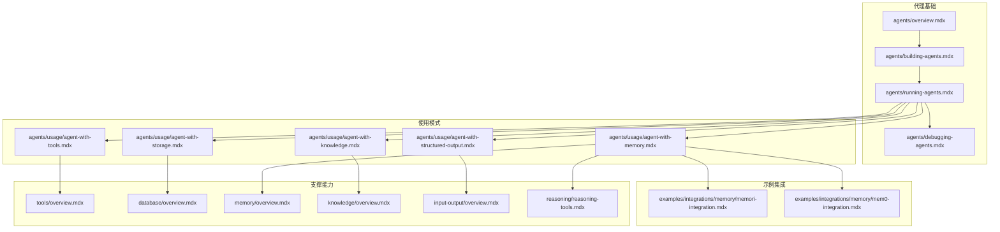
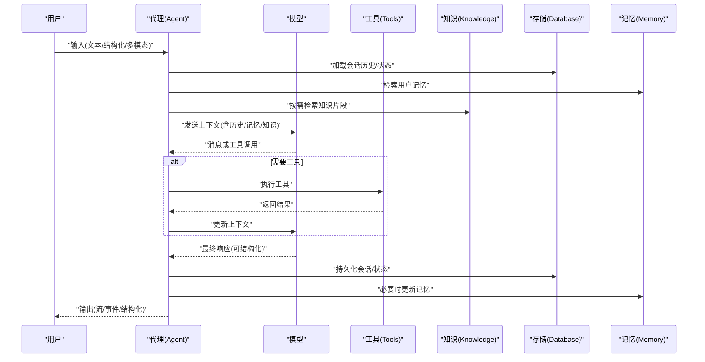
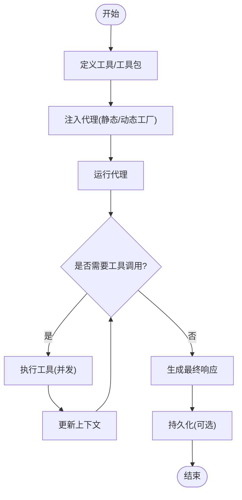
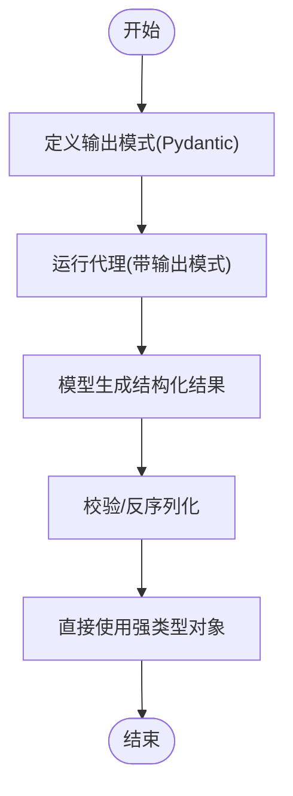
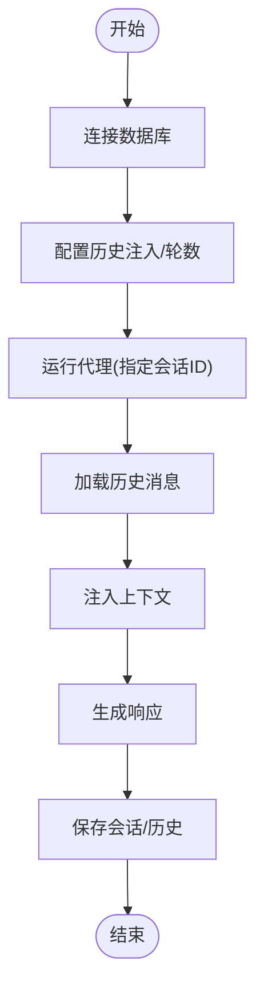
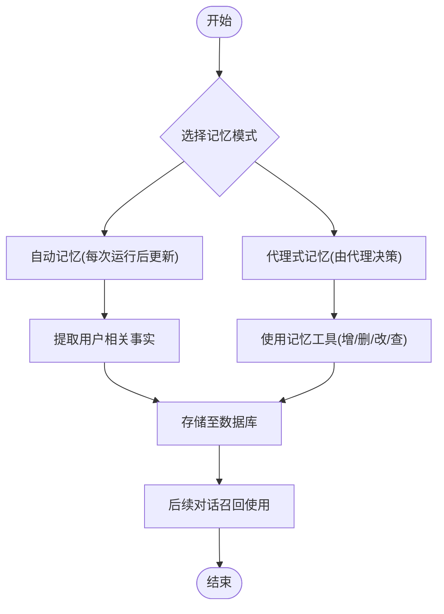
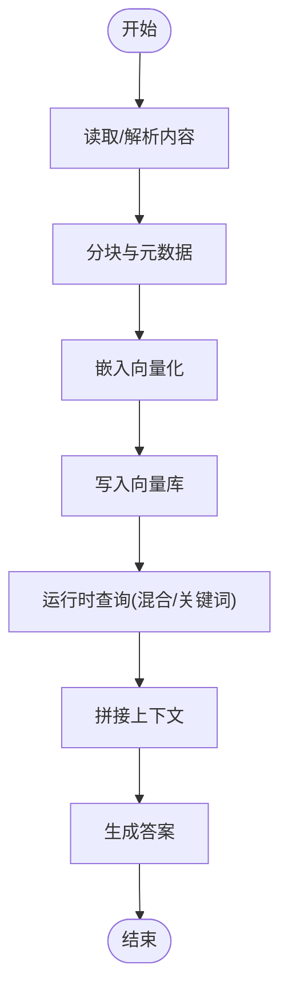
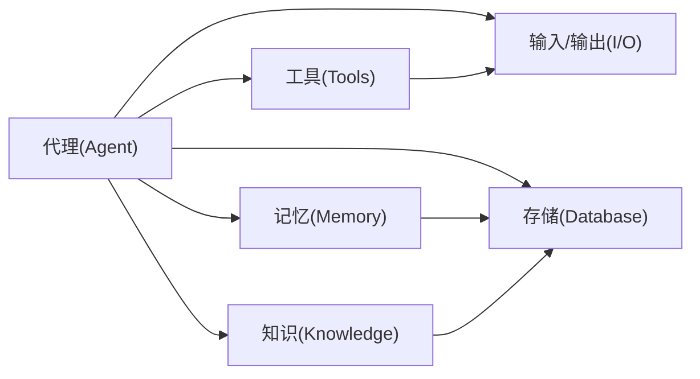

# 代理使用模式

<cite>
**本文引用的文件**
- [agents/overview.mdx](file://agents/overview.mdx)
- [agents/building-agents.mdx](file://agents/building-agents.mdx)
- [agents/running-agents.mdx](file://agents/running-agents.mdx)
- [agents/debugging-agents.mdx](file://agents/debugging-agents.mdx)
- [agents/usage/agent-with-tools.mdx](file://agents/usage/agent-with-tools.mdx)
- [agents/usage/agent-with-structured-output.mdx](file://agents/usage/agent-with-structured-output.mdx)
- [agents/usage/agent-with-memory.mdx](file://agents/usage/agent-with-memory.mdx)
- [agents/usage/agent-with-knowledge.mdx](file://agents/usage/agent-with-knowledge.mdx)
- [agents/usage/agent-with-storage.mdx](file://agents/usage/agent-with-storage.mdx)
- [tools/overview.mdx](file://tools/overview.mdx)
- [database/overview.mdx](file://database/overview.mdx)
- [memory/overview.mdx](file://memory/overview.mdx)
- [knowledge/overview.mdx](file://knowledge/overview.mdx)
- [input-output/overview.mdx](file://input-output/overview.mdx)
- [reasoning/reasoning-tools.mdx](file://reasoning/reasoning-tools.mdx)
- [examples/integrations/memory/memori-integration.mdx](file://examples/integrations/memory/memori-integration.mdx)
- [examples/integrations/memory/mem0-integration.mdx](file://examples/integrations/memory/mem0-integration.mdx)
</cite>

## 目录
1. [引言](#引言)
2. [项目结构](#项目结构)
3. [核心组件](#核心组件)
4. [架构总览](#架构总览)
5. [详细组件分析](#详细组件分析)
6. [依赖关系分析](#依赖关系分析)
7. [性能考量](#性能考量)
8. [故障排查指南](#故障排查指南)
9. [结论](#结论)
10. [附录](#附录)

## 引言
本文件面向开发者，系统化梳理代理（Agent）在实际业务中的使用模式与最佳实践，覆盖以下五类核心模式：
- 工具使用模式：通过工具与外部系统交互，完成检索、计算、调用 API 等任务。
- 结构化输出模式：以 Pydantic 模型约束输入输出，确保数据一致性与可解析性。
- 存储集成模式：持久化会话历史与上下文，支持跨轮次连续对话与状态恢复。
- 记忆管理模式：在用户维度学习并保留偏好、事实与上下文，提升个性化体验。
- 知识使用模式：构建可搜索的知识库（Agentic RAG），按需检索并注入上下文。

文档同时给出各模式的适用场景、实现要点、配置要求与常见组合策略，并提供来自仓库示例的路径指引，帮助快速落地。

## 项目结构
该仓库围绕“代理”为中心，提供了从基础构建、运行、调试到工具、存储、记忆、知识、输入输出等全链路文档与示例。下图概览了与代理使用模式直接相关的模块与文件：

图表来源
- [agents/overview.mdx](file://agents/overview.mdx)
- [agents/building-agents.mdx](file://agents/building-agents.mdx)
- [agents/running-agents.mdx](file://agents/running-agents.mdx)
- [agents/debugging-agents.mdx](file://agents/debugging-agents.mdx)
- [agents/usage/agent-with-tools.mdx](file://agents/usage/agent-with-tools.mdx)
- [agents/usage/agent-with-structured-output.mdx](file://agents/usage/agent-with-structured-output.mdx)
- [agents/usage/agent-with-storage.mdx](file://agents/usage/agent-with-storage.mdx)
- [agents/usage/agent-with-memory.mdx](file://agents/usage/agent-with-memory.mdx)
- [agents/usage/agent-with-knowledge.mdx](file://agents/usage/agent-with-knowledge.mdx)
- [tools/overview.mdx](file://tools/overview.mdx)
- [database/overview.mdx](file://database/overview.mdx)
- [memory/overview.mdx](file://memory/overview.mdx)
- [knowledge/overview.mdx](file://knowledge/overview.mdx)
- [input-output/overview.mdx](file://input-output/overview.mdx)
- [reasoning/reasoning-tools.mdx](file://reasoning/reasoning-tools.mdx)
- [examples/integrations/memory/memori-integration.mdx](file://examples/integrations/memory/memori-integration.mdx)
- [examples/integrations/memory/mem0-integration.mdx](file://examples/integrations/memory/mem0-integration.mdx)

章节来源
- [agents/overview.mdx](file://agents/overview.mdx)
- [agents/building-agents.mdx](file://agents/building-agents.mdx)
- [agents/running-agents.mdx](file://agents/running-agents.mdx)
- [agents/debugging-agents.mdx](file://agents/debugging-agents.mdx)

## 核心组件
- 代理（Agent）：围绕无状态模型的有状态控制循环，依据指令与上下文进行推理与工具调用，可叠加记忆、知识、存储、人机协作与守卫机制。
- 工具（Tools）：函数或工具包，使代理能与外部系统交互；支持并发执行、动态工厂注入与媒体参数传递。
- 输入/输出（I/O）：支持字符串、结构化输入输出（Pydantic）、多模态输入与二次模型写入。
- 存储（Database）：会话历史、状态、上下文压缩、记忆与知识、追踪与评估数据的持久化。
- 记忆（Memory）：用户级偏好与事实的记忆与召回，支持自动与“代理式”两种管理方式。
- 知识（Knowledge）：内容读取、分块嵌入与向量检索，支持 Agentic RAG 与传统 RAG。

章节来源
- [tools/overview.mdx](file://tools/overview.mdx)
- [input-output/overview.mdx](file://input-output/overview.mdx)
- [database/overview.mdx](file://database/overview.mdx)
- [memory/overview.mdx](file://memory/overview.mdx)
- [knowledge/overview.mdx](file://knowledge/overview.mdx)

## 架构总览
下图展示了代理在典型运行时的内部流程与关键扩展点（工具、记忆、知识、存储、结构化输出）：

图表来源
- [agents/running-agents.mdx](file://agents/running-agents.mdx)
- [tools/overview.mdx](file://tools/overview.mdx)
- [memory/overview.mdx](file://memory/overview.mdx)
- [knowledge/overview.mdx](file://knowledge/overview.mdx)
- [database/overview.mdx](file://database/overview.mdx)
- [input-output/overview.mdx](file://input-output/overview.mdx)

## 详细组件分析

### 工具使用模式
- 适用场景
  - 需要访问外部服务（如搜索引擎、数据库、第三方 API）。
  - 多轮对话中需要执行具体动作（查询、计算、生成）。
- 实现方法
  - 将工具函数或工具包传入代理构造器。
  - 使用并发执行（异步或线程池）以提升吞吐。
  - 利用动态工厂按用户/会话上下文注入差异化工具集。
- 配置要点
  - 工具定义由框架自动生成（含参数与返回类型）。
  - 支持媒体参数与运行上下文注入。
  - 可启用确认流程（人机协作）暂停执行直至满足条件。
- 示例路径
  - 基础工具使用：[agents/usage/agent-with-tools.mdx](file://agents/usage/agent-with-tools.mdx)
  - 工具并发与动态工厂：[tools/overview.mdx](file://tools/overview.mdx)

图表来源
- [tools/overview.mdx](file://tools/overview.mdx)
- [agents/running-agents.mdx](file://agents/running-agents.mdx)

章节来源
- [agents/usage/agent-with-tools.mdx](file://agents/usage/agent-with-tools.mdx)
- [tools/overview.mdx](file://tools/overview.mdx)

### 结构化输出模式
- 适用场景
  - 数据抽取、分类、标准化 API 响应、管道化处理。
  - 对输出格式有强约束，需保证可解析与一致性。
- 实现方法
  - 通过输出模式（Pydantic）约束响应结构。
  - 在运行时由模型生成符合模式的数据，便于直接消费。
- 配置要点
  - 使用输出模式参数，结合模型的 JSON/函数调用能力。
  - 可配合“输出模型”对写作质量或成本进行优化。
- 示例路径
  - 结构化输出示例：[agents/usage/agent-with-structured-output.mdx](file://agents/usage/agent-with-structured-output.mdx)
  - 输入输出概览：[input-output/overview.mdx](file://input-output/overview.mdx)

图表来源
- [agents/usage/agent-with-structured-output.mdx](file://agents/usage/agent-with-structured-output.mdx)
- [input-output/overview.mdx](file://input-output/overview.mdx)

章节来源
- [agents/usage/agent-with-structured-output.mdx](file://agents/usage/agent-with-structured-output.mdx)
- [input-output/overview.mdx](file://input-output/overview.mdx)

### 存储集成模式
- 适用场景
  - 需要在多次运行间保持对话连续性。
  - 跨脚本/进程恢复会话，复用历史上下文。
- 实现方法
  - 连接数据库，开启历史注入与历史轮数配置。
  - 使用会话 ID 组织对话线程，相同 ID 下自动续写。
- 配置要点
  - 开启历史注入与设置历史轮数。
  - 支持多种数据库（SQLite/PostgreSQL 等）与异步引擎。
- 示例路径
  - 会话存储示例：[agents/usage/agent-with-storage.mdx](file://agents/usage/agent-with-storage.mdx)
  - 存储概览：[database/overview.mdx](file://database/overview.mdx)

图表来源
- [agents/usage/agent-with-storage.mdx](file://agents/usage/agent-with-storage.mdx)
- [database/overview.mdx](file://database/overview.mdx)

章节来源
- [agents/usage/agent-with-storage.mdx](file://agents/usage/agent-with-storage.mdx)
- [database/overview.mdx](file://database/overview.mdx)

### 记忆管理模式
- 适用场景
  - 用户偏好、习惯、背景信息需要长期保留并自然复用。
  - 需要个性化推荐、定制化回答与上下文增强。
- 实现方法
  - 自动记忆：每次运行后自动提取并存储/召回。
  - 代理式记忆：通过内置工具在合适时机决定记忆的增删改查。
- 配置要点
  - 二选一：自动记忆或代理式记忆，避免冲突。
  - 可自定义记忆表名，支持多数据库。
  - 提供手动检索接口用于调试与可视化。
- 示例路径
  - 记忆示例：[agents/usage/agent-with-memory.mdx](file://agents/usage/agent-with-memory.mdx)
  - 记忆概览：[memory/overview.mdx](file://memory/overview.mdx)
  - 推理工具（记忆相关）：[reasoning/reasoning-tools.mdx](file://reasoning/reasoning-tools.mdx)
  - 集成示例（Memori/Mem0）：[examples/integrations/memory/memori-integration.mdx](file://examples/integrations/memory/memori-integration.mdx), [examples/integrations/memory/mem0-integration.mdx](file://examples/integrations/memory/mem0-integration.mdx)

图表来源
- [memory/overview.mdx](file://memory/overview.mdx)
- [reasoning/reasoning-tools.mdx](file://reasoning/reasoning-tools.mdx)
- [examples/integrations/memory/memori-integration.mdx](file://examples/integrations/memory/memori-integration.mdx)
- [examples/integrations/memory/mem0-integration.mdx](file://examples/integrations/memory/mem0-integration.mdx)

章节来源
- [agents/usage/agent-with-memory.mdx](file://agents/usage/agent-with-memory.mdx)
- [memory/overview.mdx](file://memory/overview.mdx)
- [reasoning/reasoning-tools.mdx](file://reasoning/reasoning-tools.mdx)
- [examples/integrations/memory/memori-integration.mdx](file://examples/integrations/memory/memori-integration.mdx)
- [examples/integrations/memory/mem0-integration.mdx](file://examples/integrations/memory/mem0-integration.mdx)

### 知识使用模式
- 适用场景
  - 需要基于特定领域文档、FAQ、产品资料等提供准确回答。
  - 动态检索与上下文注入，支持“代理式检索”（按需）与“传统检索”（始终注入）。
- 实现方法
  - 构建知识库（读取、分块、嵌入、入库）。
  - 运行时检索相关片段并注入上下文。
  - 支持混合检索（语义+关键词）与重排序。
- 配置要点
  - 选择向量数据库与嵌入模型。
  - 支持多种内容源（URL/本地文件/纯文本）。
  - 可将代理作为“学习者”，将新洞察写回知识库。
- 示例路径
  - 知识示例：[agents/usage/agent-with-knowledge.mdx](file://agents/usage/agent-with-knowledge.mdx)
  - 知识概览：[knowledge/overview.mdx](file://knowledge/overview.mdx)

图表来源
- [agents/usage/agent-with-knowledge.mdx](file://agents/usage/agent-with-knowledge.mdx)
- [knowledge/overview.mdx](file://knowledge/overview.mdx)

章节来源
- [agents/usage/agent-with-knowledge.mdx](file://agents/usage/agent-with-knowledge.mdx)
- [knowledge/overview.mdx](file://knowledge/overview.mdx)

### 模式组合与高级配置
- 组合策略
  - 工具 + 结构化输出：先用工具获取数据，再以结构化模式统一输出，适合数据管线与 API 场景。
  - 存储 + 记忆：会话连续性与用户偏好双管齐下，适合客服、个人助理等长周期交互。
  - 知识 + 工具：检索到的上下文与工具调用互补，适合问答与任务编排。
  - 记忆 + 知识：前者关注用户层面的事实，后者关注领域层面的知识，二者协同提升个性化与准确性。
- 高级配置
  - 动态工具工厂：按用户角色/会话状态动态注入工具集，兼顾安全与灵活性。
  - 并发工具执行：异步/线程池并发执行多个工具调用，缩短端到端延迟。
  - 输出模型与多模态：使用专用模型优化写作质量或成本，支持图片/音频/视频/文件输入。
  - 事件流与调试：开启事件流与调试模式，捕获中间步骤、工具调用、内存更新等，便于可观测与排障。

章节来源
- [tools/overview.mdx](file://tools/overview.mdx)
- [input-output/overview.mdx](file://input-output/overview.mdx)
- [agents/running-agents.mdx](file://agents/running-agents.mdx)
- [agents/debugging-agents.mdx](file://agents/debugging-agents.mdx)

## 依赖关系分析
- 组件耦合
  - 代理对工具、存储、记忆、知识、输入输出存在高层依赖，但通过参数注入与可插拔设计降低紧耦合。
  - 工具与运行上下文解耦，支持动态工厂与媒体参数注入。
  - 存储与数据库抽象一致，可在代理/团队/工作流中复用。
- 外部依赖
  - 向量数据库、嵌入模型、数据库驱动等均为可替换项，遵循“最小依赖”原则。
- 循环依赖
  - 文档未发现直接循环依赖；模式组合通过清晰的职责边界避免潜在环路。

图表来源
- [agents/running-agents.mdx](file://agents/running-agents.mdx)
- [tools/overview.mdx](file://tools/overview.mdx)
- [database/overview.mdx](file://database/overview.mdx)
- [memory/overview.mdx](file://memory/overview.mdx)
- [knowledge/overview.mdx](file://knowledge/overview.mdx)
- [input-output/overview.mdx](file://input-output/overview.mdx)

章节来源
- [agents/running-agents.mdx](file://agents/running-agents.mdx)
- [tools/overview.mdx](file://tools/overview.mdx)
- [database/overview.mdx](file://database/overview.mdx)
- [memory/overview.mdx](file://memory/overview.mdx)
- [knowledge/overview.mdx](file://knowledge/overview.mdx)
- [input-output/overview.mdx](file://input-output/overview.mdx)

## 性能考量
- 工具并发：异步/线程池并发执行多个工具调用，显著降低端到端延迟。
- 向量检索：合理选择检索类型（语义/关键词/混合）与重排序策略，平衡准确率与延迟。
- 上下文压缩：对长历史进行摘要与压缩，减少 token 消耗与延迟。
- 缓存与工厂：利用动态工厂缓存与响应缓存，减少重复初始化与模型调用。
- 数据库异步：生产环境优先使用异步数据库引擎，避免阻塞。

## 故障排查指南
- 调试模式
  - 启用代理全局/单次调试模式，查看消息、工具调用、中间步骤与指标。
  - 使用交互式 CLI 快速测试多轮对话。
- 事件流
  - 开启事件流以捕获工具调用、推理、内存更新、会话摘要等事件，辅助定位问题。
- 常见问题
  - 数据库引擎不匹配导致异常：同步/异步引擎与数据库类需一一对应。
  - 工具并发依赖模型支持：确保所用模型支持并行函数调用。
- 参考路径
  - 调试与事件流：[agents/debugging-agents.mdx](file://agents/debugging-agents.mdx), [agents/running-agents.mdx](file://agents/running-agents.mdx)
  - 数据库异步/同步注意事项：[database/overview.mdx](file://database/overview.mdx)

章节来源
- [agents/debugging-agents.mdx](file://agents/debugging-agents.mdx)
- [agents/running-agents.mdx](file://agents/running-agents.mdx)
- [database/overview.mdx](file://database/overview.mdx)

## 结论
通过工具、结构化输出、存储、记忆与知识五大模式，开发者可以灵活构建从简单问答到复杂任务编排的智能代理系统。建议以“先简单、后扩展”的方式逐步叠加功能，并结合动态工厂、并发执行与可观测性手段，持续优化性能与稳定性。在生产环境中，优先采用异步数据库、结构化输出与上下文压缩等策略，确保系统的可维护性与可扩展性。

## 附录
- 快速参考
  - 代理构建与运行：[agents/building-agents.mdx](file://agents/building-agents.mdx), [agents/running-agents.mdx](file://agents/running-agents.mdx)
  - 工具与并发：[tools/overview.mdx](file://tools/overview.mdx)
  - 输入输出与多模态：[input-output/overview.mdx](file://input-output/overview.mdx)
  - 存储与会话：[database/overview.mdx](file://database/overview.mdx), [agents/usage/agent-with-storage.mdx](file://agents/usage/agent-with-storage.mdx)
  - 记忆与推理：[memory/overview.mdx](file://memory/overview.mdx), [reasoning/reasoning-tools.mdx](file://reasoning/reasoning-tools.mdx), [examples/integrations/memory/memori-integration.mdx](file://examples/integrations/memory/memori-integration.mdx), [examples/integrations/memory/mem0-integration.mdx](file://examples/integrations/memory/mem0-integration.mdx)
  - 知识与检索：[knowledge/overview.mdx](file://knowledge/overview.mdx), [agents/usage/agent-with-knowledge.mdx](file://agents/usage/agent-with-knowledge.mdx)