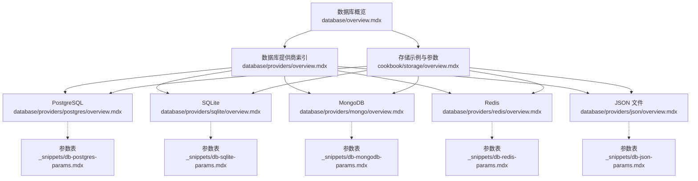
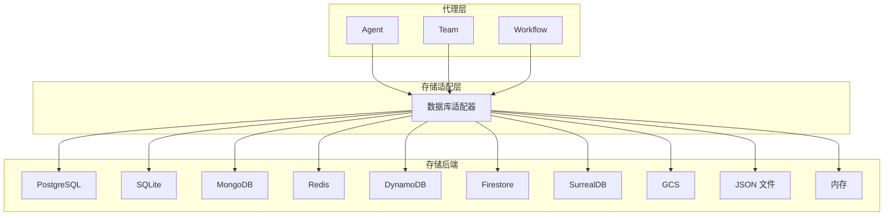
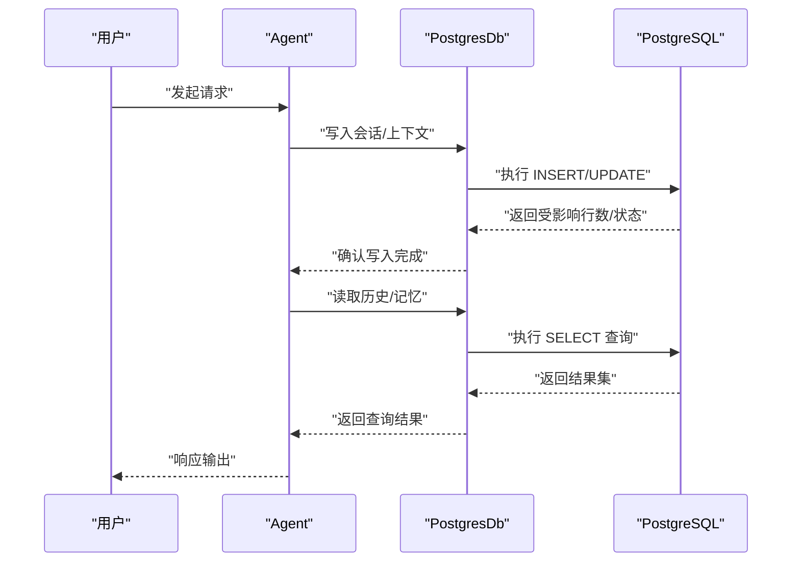
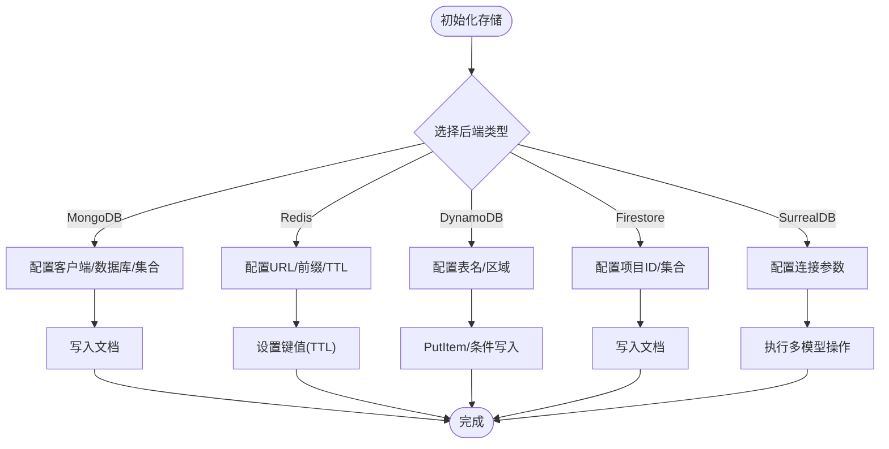
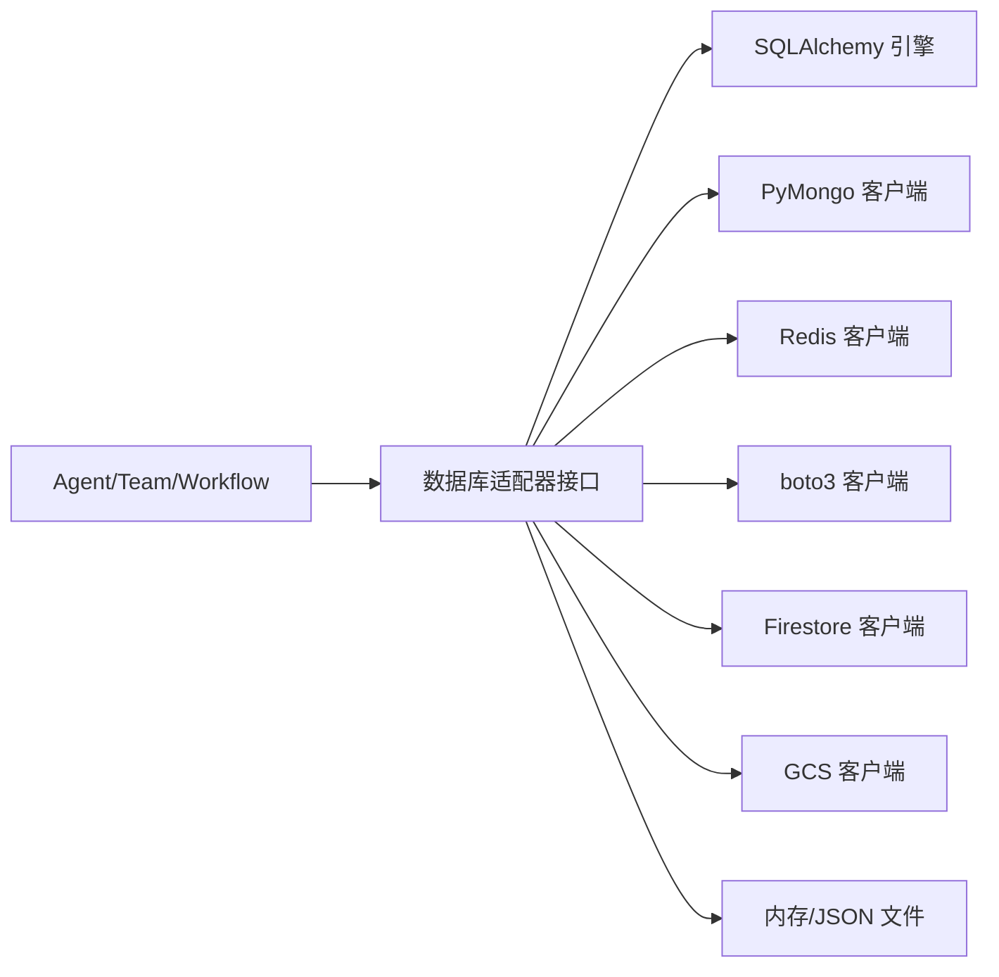

# 存储集成模式

<cite>
**本文引用的文件**
- [database/overview.mdx](file://database/overview.mdx)
- [database/providers/overview.mdx](file://database/providers/overview.mdx)
- [cookbook/storage/overview.mdx](file://cookbook/storage/overview.mdx)
- [database/providers/postgres/overview.mdx](file://database/providers/postgres/overview.mdx)
- [database/providers/sqlite/overview.mdx](file://database/providers/sqlite/overview.mdx)
- [database/providers/mongo/overview.mdx](file://database/providers/mongo/overview.mdx)
- [database/providers/redis/overview.mdx](file://database/providers/redis/overview.mdx)
- [database/providers/json/overview.mdx](file://database/providers/json/overview.mdx)
- [_snippets/db-postgres-params.mdx](file://_snippets/db-postgres-params.mdx)
- [_snippets/db-sqlite-params.mdx](file://_snippets/db-sqlite-params.mdx)
- [_snippets/db-mongodb-params.mdx](file://_snippets/db-mongodb-params.mdx)
- [_snippets/db-redis-params.mdx](file://_snippets/db-redis-params.mdx)
- [_snippets/db-json-params.mdx](file://_snippets/db-json-params.mdx)
</cite>

## 目录
1. [简介](#简介)
2. [项目结构](#项目结构)
3. [核心组件](#核心组件)
4. [架构总览](#架构总览)
5. [详细组件分析](#详细组件分析)
6. [依赖分析](#依赖分析)
7. [性能考虑](#性能考虑)
8. [故障排查指南](#故障排查指南)
9. [结论](#结论)
10. [附录](#附录)

## 简介
本文件面向开发者，系统性阐述代理（Agent）在多类存储后端（关系型数据库、NoSQL、文件存储等）中的集成模式与最佳实践。内容覆盖存储配置、数据模型设计、CRUD 操作、事务与连接池管理、数据迁移等高级主题，帮助你构建稳定可靠的存储集成方案。

## 项目结构
围绕“存储”主题，知识库主要由以下三类文档构成：
- 数据库概览：说明存储能力、适用场景与跨组件一致性（Agent/Team/Workflow）
- 提供商索引：按类别（关系型、NoSQL、云服务、文件系统）组织支持的数据库清单
- 使用示例与参数：各数据库的使用方法、运行指引与参数说明

图表来源
- [database/overview.mdx:1-130](file://database/overview.mdx#L1-L130)
- [database/providers/overview.mdx:1-175](file://database/providers/overview.mdx#L1-L175)
- [cookbook/storage/overview.mdx:1-203](file://cookbook/storage/overview.mdx#L1-L203)
- [database/providers/postgres/overview.mdx:1-42](file://database/providers/postgres/overview.mdx#L1-L42)
- [database/providers/sqlite/overview.mdx:1-24](file://database/providers/sqlite/overview.mdx#L1-L24)
- [database/providers/mongo/overview.mdx:1-42](file://database/providers/mongo/overview.mdx#L1-L42)
- [database/providers/redis/overview.mdx:1-35](file://database/providers/redis/overview.mdx#L1-L35)
- [database/providers/json/overview.mdx:1-30](file://database/providers/json/overview.mdx#L1-L30)
- [_snippets/db-postgres-params.mdx:1-14](file://_snippets/db-postgres-params.mdx#L1-L14)
- [_snippets/db-sqlite-params.mdx:1-14](file://_snippets/db-sqlite-params.mdx#L1-L14)
- [_snippets/db-mongodb-params.mdx:1-13](file://_snippets/db-mongodb-params.mdx#L1-L13)
- [_snippets/db-redis-params.mdx:1-14](file://_snippets/db-redis-params.mdx#L1-L14)
- [_snippets/db-json-params.mdx:1-13](file://_snippets/db-json-params.mdx#L1-L13)

章节来源
- [database/overview.mdx:1-130](file://database/overview.mdx#L1-L130)
- [database/providers/overview.mdx:1-175](file://database/providers/overview.mdx#L1-L175)
- [cookbook/storage/overview.mdx:1-203](file://cookbook/storage/overview.mdx#L1-L203)

## 核心组件
- 统一存储接口：Agent/Team/Workflow 通过统一的数据库适配器接入，确保会话、记忆、指标、评估、知识、追踪等数据的持久化一致行为。
- 多后端适配：提供 PostgreSQL、SQLite、MongoDB、Redis、DynamoDB、Firestore、SurrealDB、GCS、JSON、In-Memory 等多种后端。
- 异步支持：针对高并发场景提供异步数据库类（如 AsyncPostgresDb），并配套异步引擎使用说明。
- 参数化配置：每种后端均提供可配置的表/集合名、连接参数、键前缀、TTL 等，便于按需定制。

章节来源
- [database/overview.mdx:91-130](file://database/overview.mdx#L91-L130)
- [database/providers/overview.mdx:10-175](file://database/providers/overview.mdx#L10-L175)
- [cookbook/storage/overview.mdx:23-42](file://cookbook/storage/overview.mdx#L23-L42)

## 架构总览
下图展示了代理与多存储后端的交互关系，以及数据在不同后端中的落点（表/集合/文件）。

图表来源
- [database/overview.mdx:91-104](file://database/overview.mdx#L91-L104)
- [database/providers/overview.mdx:10-175](file://database/providers/overview.mdx#L10-L175)

## 详细组件分析

### 关系型数据库（PostgreSQL/MySQL/SQLite）
- 典型用途
  - 生产级持久化：PostgreSQL/MySQL
  - 开发测试：SQLite
- 配置要点
  - 连接字符串或引擎实例
  - 自定义 schema 与表名（会话、记忆、指标、评估、知识、追踪、跨度）
- 使用建议
  - 生产优先 PostgreSQL；开发优先 SQLite
  - 合理设置表名以隔离命名空间
  - 异步应用使用对应异步数据库类与异步引擎

图表来源
- [database/providers/postgres/overview.mdx:9-22](file://database/providers/postgres/overview.mdx#L9-L22)
- [database/overview.mdx:109-120](file://database/overview.mdx#L109-L120)
- [_snippets/db-postgres-params.mdx:1-14](file://_snippets/db-postgres-params.mdx#L1-L14)

章节来源
- [database/providers/postgres/overview.mdx:1-42](file://database/providers/postgres/overview.mdx#L1-L42)
- [database/providers/sqlite/overview.mdx:1-24](file://database/providers/sqlite/overview.mdx#L1-L24)
- [_snippets/db-postgres-params.mdx:1-14](file://_snippets/db-postgres-params.mdx#L1-L14)
- [_snippets/db-sqlite-params.mdx:1-14](file://_snippets/db-sqlite-params.mdx#L1-L14)

### NoSQL 数据库（MongoDB/Redis/DynamoDB/Firestore/SurrealDB）
- 典型用途
  - 文档存储：MongoDB
  - 缓存与高速读写：Redis
  - 云原生无服务器：DynamoDB、Firestore
  - 多模型融合：SurrealDB
- 配置要点
  - 客户端实例或连接串
  - 自定义数据库/集合名（会话、记忆、指标、评估、知识、追踪、跨度）
  - Redis 可设置键前缀与 TTL

图表来源
- [database/providers/mongo/overview.mdx:1-42](file://database/providers/mongo/overview.mdx#L1-L42)
- [database/providers/redis/overview.mdx:1-35](file://database/providers/redis/overview.mdx#L1-L35)
- [database/providers/json/overview.mdx:1-30](file://database/providers/json/overview.mdx#L1-L30)
- [_snippets/db-mongodb-params.mdx:1-13](file://_snippets/db-mongodb-params.mdx#L1-L13)
- [_snippets/db-redis-params.mdx:1-14](file://_snippets/db-redis-params.mdx#L1-L14)
- [_snippets/db-json-params.mdx:1-13](file://_snippets/db-json-params.mdx#L1-L13)

章节来源
- [database/providers/mongo/overview.mdx:1-42](file://database/providers/mongo/overview.mdx#L1-L42)
- [database/providers/redis/overview.mdx:1-35](file://database/providers/redis/overview.mdx#L1-L35)
- [database/providers/json/overview.mdx:1-30](file://database/providers/json/overview.mdx#L1-L30)
- [_snippets/db-mongodb-params.mdx:1-13](file://_snippets/db-mongodb-params.mdx#L1-L13)
- [_snippets/db-redis-params.mdx:1-14](file://_snippets/db-redis-params.mdx#L1-L14)
- [_snippets/db-json-params.mdx:1-13](file://_snippets/db-json-params.mdx#L1-L13)

### 文件存储（JSON/本地文件）
- 典型用途
  - Demo/测试/无需数据库的快速验证
- 配置要点
  - 目录路径与各数据表对应的 JSON 文件名
- 注意事项
  - 不推荐用于生产环境

章节来源
- [database/providers/json/overview.mdx:1-30](file://database/providers/json/overview.mdx#L1-L30)
- [_snippets/db-json-params.mdx:1-13](file://_snippets/db-json-params.mdx#L1-L13)

### 跨组件一致性（Agent/Team/Workflow）
- 存储在 Agent、Team、Workflow 中使用方式一致，只需注入相同的数据库适配器实例即可共享会话与上下文。
- 示例参见数据库概览与示例索引。

章节来源
- [database/overview.mdx:91-104](file://database/overview.mdx#L91-L104)
- [cookbook/storage/overview.mdx:160-185](file://cookbook/storage/overview.mdx#L160-L185)

## 依赖分析
- 组件耦合
  - 代理层仅依赖“数据库适配器”接口，不直接依赖具体后端，降低耦合度
  - 适配器内部封装具体后端差异（SQLAlchemy、PyMongo、Redis、AWS SDK 等）
- 外部依赖
  - 关系型数据库：SQLAlchemy 引擎/异步引擎
  - MongoDB：PyMongo 客户端
  - Redis：redis 库
  - DynamoDB：boto3
  - Firestore：google-cloud-firestore
  - GCS：google-cloud-storage
- 命名与表/集合映射
  - 通过参数表/集合名实现命名空间隔离，避免跨组件冲突

图表来源
- [database/overview.mdx:91-104](file://database/overview.mdx#L91-L104)
- [database/providers/overview.mdx:10-175](file://database/providers/overview.mdx#L10-L175)

## 性能考虑
- 连接池与并发
  - 关系型数据库：复用 SQLAlchemy 引擎/连接池；异步应用使用异步引擎与异步数据库类
  - Redis：合理设置键前缀与 TTL，避免键空间污染；控制批量写入大小
  - MongoDB：使用连接池与合适的超时配置；分集合存储不同数据类型
- 写入策略
  - 批量写入：合并多次写入，减少往返
  - 增量更新：仅更新变化字段，降低写放大
- 读取优化
  - 合理索引：为常用查询字段建立索引（如会话 ID、时间戳）
  - 分页与投影：限制返回字段与数量
- 缓存与降级
  - Redis 作为缓存层加速热点数据读取
  - 降级策略：当后端不可用时，采用本地缓存或只读模式

## 故障排查指南
- 异常与修复
  - MissingGreenlet：同步引擎与异步数据库类混用。请使用 SQLAlchemy 的异步引擎工厂创建异步引擎。
  - AsyncContextNotStarted：异步引擎与同步数据库类混用。请使用同步引擎工厂创建同步引擎。
- 常见问题定位
  - 连接失败：检查连接字符串/URL、网络连通性、认证凭据
  - 权限不足：确认数据库/集合/表权限与用户角色
  - 表/集合不存在：根据参数创建对应对象，并初始化索引
  - 键冲突：Redis 建议使用统一前缀；MongoDB 使用唯一索引
- 日志与追踪
  - 启用数据库层日志，定位慢查询与异常
  - 利用追踪与跨度表进行端到端诊断

章节来源
- [database/overview.mdx:122-130](file://database/overview.mdx#L122-L130)

## 结论
通过统一的存储适配器与参数化配置，代理可在多种存储后端中无缝切换。生产环境建议优先选用 PostgreSQL 或云托管数据库，结合连接池与异步能力提升吞吐；开发与测试阶段可使用 SQLite 或 JSON 文件快速验证。配合合理的表/集合命名、索引与缓存策略，可显著提升稳定性与性能。

## 附录
- 快速对照表（参数与用途）
  - PostgreSQL：连接字符串/引擎、schema、会话/记忆/指标/评估/知识/追踪/跨度表名
  - SQLite：引擎/连接字符串/文件、会话/记忆/指标/评估/知识/追踪/跨度表名
  - MongoDB：客户端/URL、数据库名、会话/记忆/指标/评估/知识/追踪/跨度集合
  - Redis：URL/客户端、键前缀、TTL、会话/记忆/指标/评估/知识/追踪/跨度表名
  - JSON：目录路径、各表 JSON 文件名

章节来源
- [_snippets/db-postgres-params.mdx:1-14](file://_snippets/db-postgres-params.mdx#L1-L14)
- [_snippets/db-sqlite-params.mdx:1-14](file://_snippets/db-sqlite-params.mdx#L1-L14)
- [_snippets/db-mongodb-params.mdx:1-13](file://_snippets/db-mongodb-params.mdx#L1-L13)
- [_snippets/db-redis-params.mdx:1-14](file://_snippets/db-redis-params.mdx#L1-L14)
- [_snippets/db-json-params.mdx:1-13](file://_snippets/db-json-params.mdx#L1-L13)