# 工具使用模式

<cite>
**本文引用的文件**
- [built-in.mdx](file://cookbook/tools/built-in.mdx)
- [custom-tools.mdx](file://cookbook/tools/custom-tools.mdx)
- [tool-hooks.mdx](file://cookbook/tools/tool-hooks.mdx)
- [tool-decorator.mdx](file://examples/tools/tool-decorator/tool-decorator.mdx)
- [async-tool-decorator.mdx](file://examples/tools/tool-decorator/async-tool-decorator.mdx)
- [tool-hook.mdx](file://examples/tools/tool-hooks/tool-hook.mdx)
- [tool-hook-in-toolkit.mdx](file://examples/tools/tool-hooks/tool-hook-in-toolkit.mdx)
- [tool-hook-in-toolkit-with-state-nested.mdx](file://examples/tools/tool-hooks/tool-hook-in-toolkit-with-state-nested.mdx)
- [toolkit.mdx](file://reference/tools/toolkit.mdx)
- [overview.mdx](file://tools/overview.mdx)
- [selecting-tools.mdx](file://tools/selecting-tools.mdx)
- [attaching-tools.mdx](file://tools/attaching-tools.mdx)
- [caching.mdx](file://tools/caching.mdx)
- [exceptions.mdx](file://tools/exceptions.mdx)
- [async-tools.mdx](file://tools/async-tools.mdx)
- [docker.mdx](file://tools/toolkits/local/docker.mdx)
- [mcp-toolbox.mdx](file://tools/mcp/mcp-toolbox.mdx)
- [workflow-tools.mdx](file://tools/reasoning_tools/workflow-tools.mdx)
- [reasoning-tools.mdx](file://reasoning/reasoning-tools.mdx)
- [toolkits-overview.mdx](file://tools/toolkits/overview.mdx)
</cite>

## 目录
1. [简介](#简介)
2. [项目结构](#项目结构)
3. [核心组件](#核心组件)
4. [架构总览](#架构总览)
5. [详细组件分析](#详细组件分析)
6. [依赖关系分析](#依赖关系分析)
7. [性能考量](#性能考量)
8. [故障排查指南](#故障排查指南)
9. [结论](#结论)
10. [附录](#附录)

## 简介
本文件面向开发者，系统性阐述在代理系统中“工具”的使用模式与最佳实践，覆盖从内置工具到自定义工具、工具包管理、工具选择策略、工具装饰器、工具钩子、异步工具与异常处理等主题。文档以仓库中的官方文档与示例为依据，提供可操作的步骤、图示与参考路径，帮助你快速构建稳定、可扩展且高性能的代理系统。

## 项目结构
围绕“工具”主题，相关知识分布在以下区域：
- 教程与示例：cookbook/tools 下的“内置工具”“自定义工具”“工具钩子”等文档及 examples 中的具体示例
- 参考与概念：tools/overview、tools/selecting-tools、tools/attaching-tools、tools/caching、tools/exceptions、tools/async-tools、tools/toolkits/overview 等
- 高级工具集：tools/toolkits/local/docker.mdx、tools/mcp/mcp-toolbox.mdx、tools/reasoning_tools/workflow-tools.mdx、reasoning/reasoning-tools.mdx
- 工具类参考：reference/tools/toolkit.mdx

```mermaid
graph TB
A["教程与示例<br/>cookbook/tools/*"] --> B["内置工具<br/>built-in.mdx"]
A --> C["自定义工具<br/>custom-tools.mdx"]
A --> D["工具钩子<br/>tool-hooks.mdx"]
E["示例<br/>examples/tools/*"] --> F["工具装饰器示例<br/>tool-decorator.mdx"]
E --> G["异步工具装饰器示例<br/>async-tool-decorator.mdx"]
E --> H["钩子示例<br/>tool-hook*.mdx"]
I["参考与概念<br/>tools/*"] --> J["工具概览<br/>overview.mdx"]
I --> K["包含/排除工具<br/>selecting-tools.mdx"]
I --> L["动态增删工具<br/>attaching-tools.mdx"]
I --> M["结果缓存<br/>caching.mdx"]
I --> N["异常与重试<br/>exceptions.mdx"]
O["工具集索引<br/>toolkits/overview.mdx"] --> P["本地工具集<br/>docker.mdx"]
O --> Q["MCP 工具箱<br/>mcp-toolbox.mdx"]
R["推理工具集<br/>workflow-tools.mdx"] --> S["推理工具总览<br/>reasoning-tools.mdx"]
```

**图表来源**
- [built-in.mdx](file://cookbook/tools/built-in.mdx)
- [custom-tools.mdx](file://cookbook/tools/custom-tools.mdx)
- [tool-hooks.mdx](file://cookbook/tools/tool-hooks.mdx)
- [tool-decorator.mdx](file://examples/tools/tool-decorator/tool-decorator.mdx)
- [async-tool-decorator.mdx](file://examples/tools/tool-decorator/async-tool-decorator.mdx)
- [tool-hook.mdx](file://examples/tools/tool-hooks/tool-hook.mdx)
- [tool-hook-in-toolkit.mdx](file://examples/tools/tool-hooks/tool-hook-in-toolkit.mdx)
- [tool-hook-in-toolkit-with-state-nested.mdx](file://examples/tools/tool-hooks/tool-hook-in-toolkit-with-state-nested.mdx)
- [overview.mdx](file://tools/overview.mdx)
- [selecting-tools.mdx](file://tools/selecting-tools.mdx)
- [attaching-tools.mdx](file://tools/attaching-tools.mdx)
- [caching.mdx](file://tools/caching.mdx)
- [exceptions.mdx](file://tools/exceptions.mdx)
- [toolkits-overview.mdx](file://tools/toolkits/overview.mdx)
- [docker.mdx](file://tools/toolkits/local/docker.mdx)
- [mcp-toolbox.mdx](file://tools/mcp/mcp-toolbox.mdx)
- [workflow-tools.mdx](file://tools/reasoning_tools/workflow-tools.mdx)
- [reasoning-tools.mdx](file://reasoning/reasoning-tools.mdx)

**章节来源**
- [built-in.mdx](file://cookbook/tools/built-in.mdx)
- [custom-tools.mdx](file://cookbook/tools/custom-tools.mdx)
- [tool-hooks.mdx](file://cookbook/tools/tool-hooks.mdx)
- [tool-decorator.mdx](file://examples/tools/tool-decorator/tool-decorator.mdx)
- [async-tool-decorator.mdx](file://examples/tools/tool-decorator/async-tool-decorator.mdx)
- [tool-hook.mdx](file://examples/tools/tool-hooks/tool-hook.mdx)
- [tool-hook-in-toolkit.mdx](file://examples/tools/tool-hooks/tool-hook-in-toolkit.mdx)
- [tool-hook-in-toolkit-with-state-nested.mdx](file://examples/tools/tool-hooks/tool-hook-in-toolkit-with-state-nested.mdx)
- [overview.mdx](file://tools/overview.mdx)
- [selecting-tools.mdx](file://tools/selecting-tools.mdx)
- [attaching-tools.mdx](file://tools/attaching-tools.mdx)
- [caching.mdx](file://tools/caching.mdx)
- [exceptions.mdx](file://tools/exceptions.mdx)
- [toolkits-overview.mdx](file://tools/toolkits/overview.mdx)
- [docker.mdx](file://tools/toolkits/local/docker.mdx)
- [mcp-toolbox.mdx](file://tools/mcp/mcp-toolbox.mdx)
- [workflow-tools.mdx](file://tools/reasoning_tools/workflow-tools.mdx)
- [reasoning-tools.mdx](file://reasoning/reasoning-tools.mdx)

## 核心组件
- 工具（Tool）：函数或方法，作为代理调用外部系统的入口；支持同步与异步、流式返回、媒体结果等
- 工具装饰器（@tool）：自动提取签名与文档，生成模型可用的工具定义，支持缓存、停止后续执行、前置/后置钩子等选项
- 工具包（Toolkit）：一组协同工作的工具集合，可共享状态、统一注入参数、批量启用/禁用工具
- 工具钩子（Hook）：在工具执行前后运行自定义逻辑，用于日志、校验、转换、审计、限流等
- 异步工具：并发执行多个工具调用，提升响应速度与吞吐量
- 结果缓存：对工具调用结果进行缓存，减少重复请求与成本
- 异常与重试：在工具内部抛出特定异常以引导模型调整行为或提前结束运行

**章节来源**
- [overview.mdx](file://tools/overview.mdx)
- [custom-tools.mdx](file://cookbook/tools/custom-tools.mdx)
- [tool-hooks.mdx](file://cookbook/tools/tool-hooks.mdx)
- [caching.mdx](file://tools/caching.mdx)
- [exceptions.mdx](file://tools/exceptions.mdx)
- [async-tools.mdx](file://tools/async-tools.mdx)

## 架构总览
下图展示了“从工具创建到代理使用”的端到端流程，以及工具装饰器、工具钩子、异步执行与缓存的关键节点。

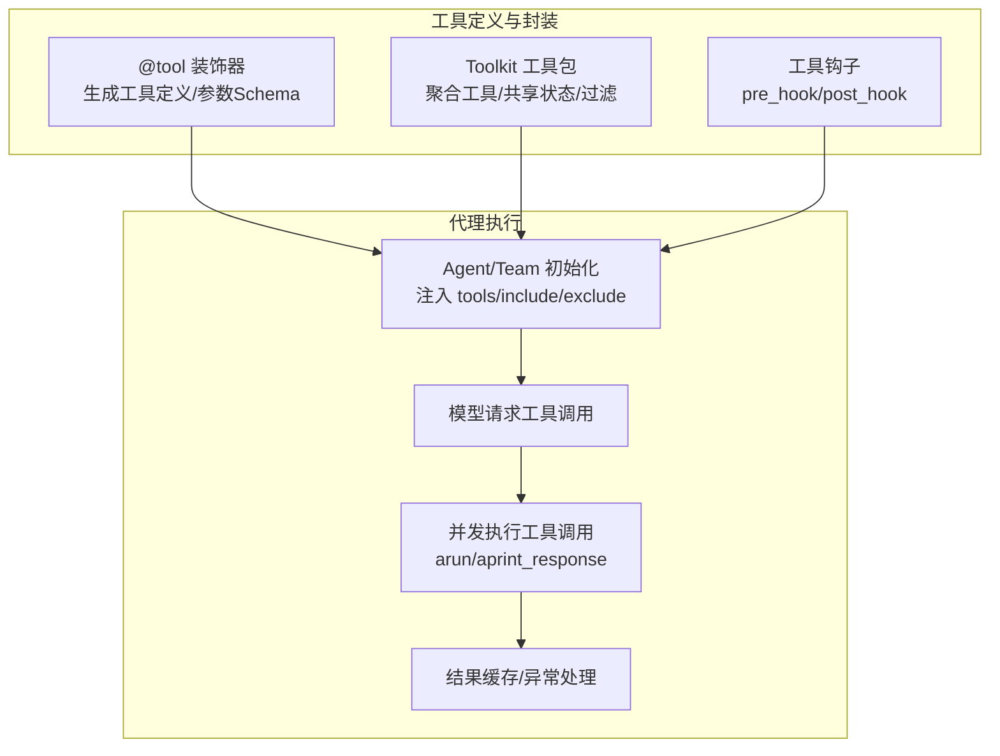

**图表来源**
- [overview.mdx](file://tools/overview.mdx)
- [custom-tools.mdx](file://cookbook/tools/custom-tools.mdx)
- [tool-hooks.mdx](file://cookbook/tools/tool-hooks.mdx)
- [selecting-tools.mdx](file://tools/selecting-tools.mdx)
- [caching.mdx](file://tools/caching.mdx)
- [exceptions.mdx](file://tools/exceptions.mdx)

## 详细组件分析

### 内置工具与工具包管理
- 内置工具覆盖搜索、金融、数据库、网页抓取、社交通信、生产力、开发者工具、AI/媒体、实用工具等类别，可直接导入并实例化后加入代理
- 工具包（Toolkit）提供统一入口，便于按需启用/禁用工具，或通过 include_tools/exclude_tools 精准控制暴露给代理的工具集合
- 可通过工厂模式（callable factory）在运行时根据会话状态、用户角色等上下文动态生成工具集，支持缓存与作用域隔离

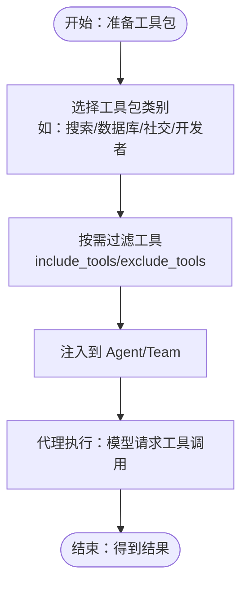

**图表来源**
- [built-in.mdx](file://cookbook/tools/built-in.mdx)
- [selecting-tools.mdx](file://tools/selecting-tools.mdx)
- [overview.mdx](file://tools/overview.mdx)

**章节来源**
- [built-in.mdx](file://cookbook/tools/built-in.mdx)
- [selecting-tools.mdx](file://tools/selecting-tools.mdx)
- [overview.mdx](file://tools/overview.mdx)

### 自定义工具开发与装饰器
- 使用 @tool 将任意函数包装为工具，自动提取函数签名与文档字符串，生成工具定义
- 支持：
  - 同步与异步函数
  - 流式返回（Iterator/AsyncIterator）
  - 缓存工具调用结果
  - 执行后立即停止代理（stop_after_call）
  - 前置/后置钩子
  - 自定义说明（instructions）
  - 类方法作为工具（有状态）

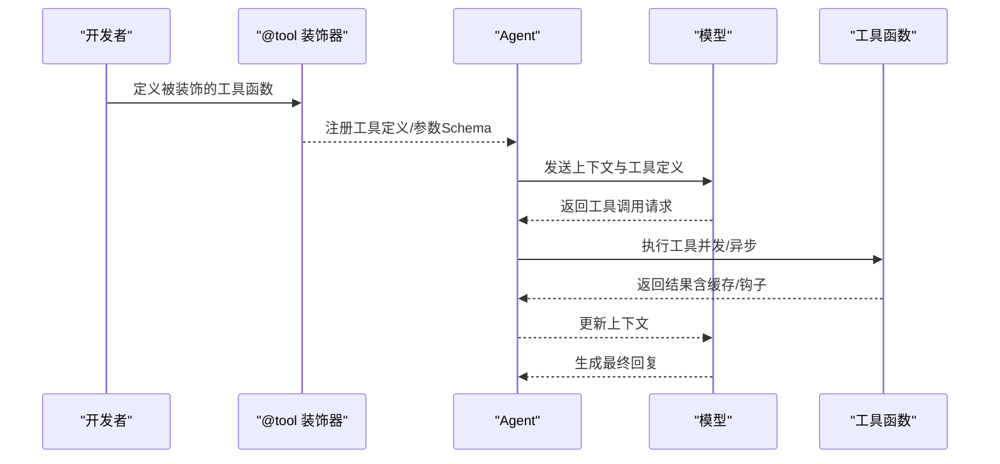

**图表来源**
- [custom-tools.mdx](file://cookbook/tools/custom-tools.mdx)
- [tool-decorator.mdx](file://examples/tools/tool-decorator/tool-decorator.mdx)
- [async-tool-decorator.mdx](file://examples/tools/tool-decorator/async-tool-decorator.mdx)

**章节来源**
- [custom-tools.mdx](file://cookbook/tools/custom-tools.mdx)
- [tool-decorator.mdx](file://examples/tools/tool-decorator/tool-decorator.mdx)
- [async-tool-decorator.mdx](file://examples/tools/tool-decorator/async-tool-decorator.mdx)

### 工具钩子：日志、校验、审计与限流
- 工具钩子可在工具执行前（pre_hook）与执行后（post_hook）插入自定义逻辑
- 支持：
  - 日志记录
  - 输入校验
  - 结果转换
  - 速率限制
  - 缓存（预/后）
  - 审计追踪
  - 错误处理
- 可在单个工具上设置，也可在 Toolkit 上统一设置，支持嵌套 Toolkit 的钩子传播

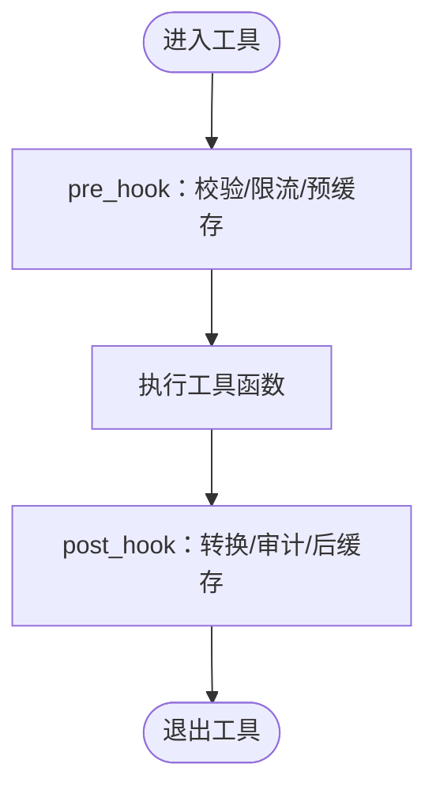

**图表来源**
- [tool-hooks.mdx](file://cookbook/tools/tool-hooks.mdx)
- [tool-hook.mdx](file://examples/tools/tool-hooks/tool-hook.mdx)
- [tool-hook-in-toolkit.mdx](file://examples/tools/tool-hooks/tool-hook-in-toolkit.mdx)
- [tool-hook-in-toolkit-with-state-nested.mdx](file://examples/tools/tool-hooks/tool-hook-in-toolkit-with-state-nested.mdx)

**章节来源**
- [tool-hooks.mdx](file://cookbook/tools/tool-hooks.mdx)
- [tool-hook.mdx](file://examples/tools/tool-hooks/tool-hook.mdx)
- [tool-hook-in-toolkit.mdx](file://examples/tools/tool-hooks/tool-hook-in-toolkit.mdx)
- [tool-hook-in-toolkit-with-state-nested.mdx](file://examples/tools/tool-hooks/tool-hook-in-toolkit-with-state-nested.mdx)

### 异步工具与并发执行
- 在异步运行（arun/aprint_response）时，模型可一次性请求多个工具调用，框架并发执行以提升性能
- 并发执行要求模型支持并行函数调用（如 OpenAI 的 parallel_tool_calls）
- 对于同步工具，框架会在独立线程中并发执行

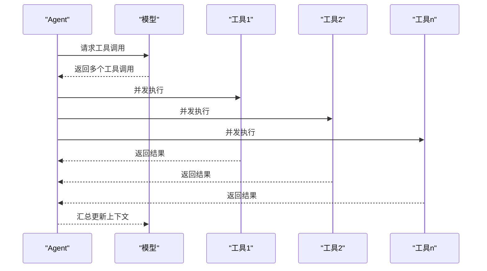

**图表来源**
- [overview.mdx](file://tools/overview.mdx)
- [async-tools.mdx](file://tools/async-tools.mdx)

**章节来源**
- [overview.mdx](file://tools/overview.mdx)
- [async-tools.mdx](file://tools/async-tools.mdx)

### 工具结果缓存与性能优化
- 工具结果缓存可显著降低重复调用与成本，适用于 Toolkit 或单个工具
- 支持在工具装饰器与 Toolkit 构造函数中开启缓存
- 结合 callable factory 的缓存能力，可按会话键缓存不同工具集

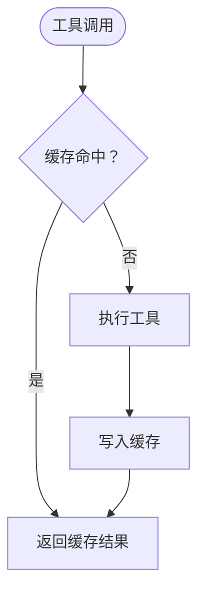

**图表来源**
- [caching.mdx](file://tools/caching.mdx)
- [overview.mdx](file://tools/overview.mdx)

**章节来源**
- [caching.mdx](file://tools/caching.mdx)
- [overview.mdx](file://tools/overview.mdx)

### 动态增删工具与工具选择策略
- 运行时可为 Agent/Team 添加或替换工具，满足条件化需求
- 通过 include_tools/exclude_tools 精准控制 Toolkit 暴露的工具集合
- 结合 callable factory，按用户角色/会话状态动态生成专属工具集

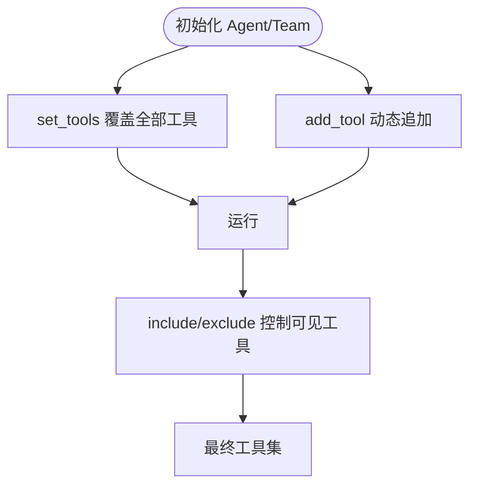

**图表来源**
- [attaching-tools.mdx](file://tools/attaching-tools.mdx)
- [selecting-tools.mdx](file://tools/selecting-tools.mdx)
- [overview.mdx](file://tools/overview.mdx)

**章节来源**
- [attaching-tools.mdx](file://tools/attaching-tools.mdx)
- [selecting-tools.mdx](file://tools/selecting-tools.mdx)
- [overview.mdx](file://tools/overview.mdx)

### 异常与重试：控制工具调用循环
- 在工具内部可抛出 RetryAgentRun 以向模型提供反馈并允许其重试
- 可抛出 StopAgentRun 提前结束工具调用循环并完成当前运行
- 适用于需要“先行动再评估”的复杂流程

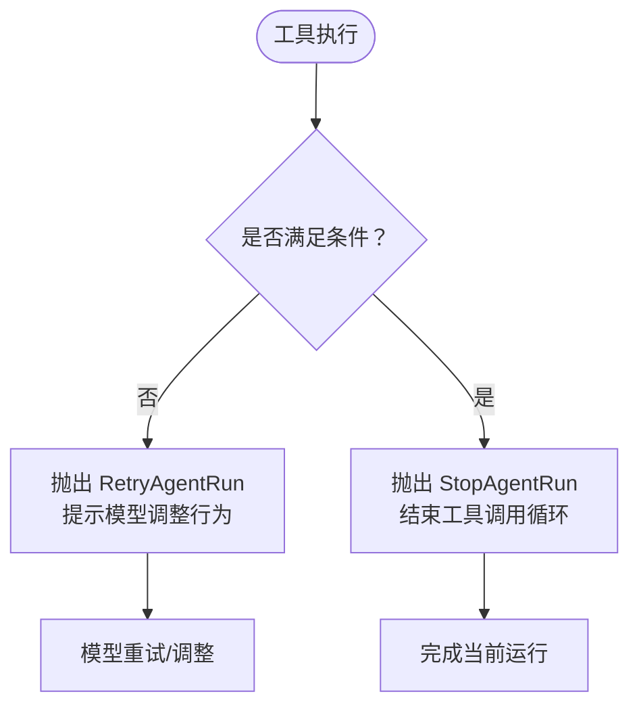

**图表来源**
- [exceptions.mdx](file://tools/exceptions.mdx)

**章节来源**
- [exceptions.mdx](file://tools/exceptions.mdx)

### 高级工具集：本地与 MCP 工具箱
- 本地工具集（如 Docker）提供容器管理、镜像管理、卷与网络管理等能力
- MCP 工具箱支持连接 MCP 服务器与 Toolbox 客户端，按名称加载工具或工具集，具备安全加载与错误处理能力

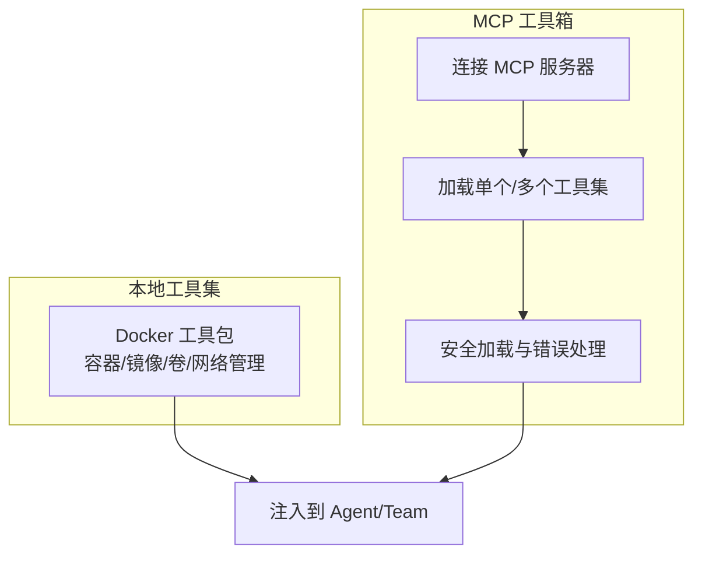

**图表来源**
- [docker.mdx](file://tools/toolkits/local/docker.mdx)
- [mcp-toolbox.mdx](file://tools/mcp/mcp-toolbox.mdx)

**章节来源**
- [docker.mdx](file://tools/toolkits/local/docker.mdx)
- [mcp-toolbox.mdx](file://tools/mcp/mcp-toolbox.mdx)

### 推理工具与工作流工具
- 推理工具（ReasoningTools）提供“思考→行动→分析”的循环，增强代理对复杂任务的规划与评估能力
- WorkflowTools 允许代理执行、分析与推理工作流操作，结合“思考→运行→分析”模式提升成功率
- 与通用推理工具（Knowledge/Memory/Workflow）配合，形成完整的“先计划、再执行、后评估”的闭环

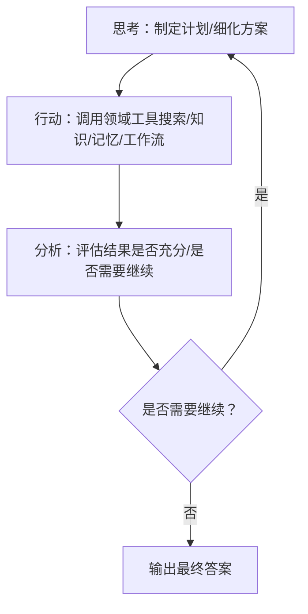

**图表来源**
- [workflow-tools.mdx](file://tools/reasoning_tools/workflow-tools.mdx)
- [reasoning-tools.mdx](file://reasoning/reasoning-tools.mdx)

**章节来源**
- [workflow-tools.mdx](file://tools/reasoning_tools/workflow-tools.mdx)
- [reasoning-tools.mdx](file://reasoning/reasoning-tools.mdx)

## 依赖关系分析
- 工具装饰器与工具钩子是“工具层”的关键扩展点，贯穿工具定义、执行与结果处理
- 工具包（Toolkit）提供“组织层”，负责工具聚合、过滤与状态共享
- 代理层（Agent/Team）负责将工具定义传递给模型，并协调并发执行与缓存
- 工具集索引（toolkits/overview.mdx）提供工具生态全景，便于选择与组合

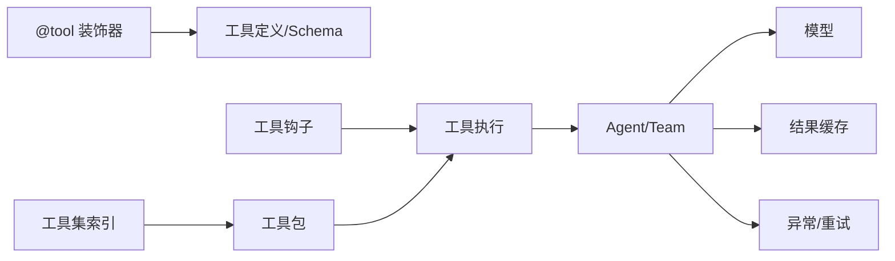

**图表来源**
- [custom-tools.mdx](file://cookbook/tools/custom-tools.mdx)
- [tool-hooks.mdx](file://cookbook/tools/tool-hooks.mdx)
- [overview.mdx](file://tools/overview.mdx)
- [toolkit.mdx](file://reference/tools/toolkit.mdx)
- [toolkits-overview.mdx](file://tools/toolkits/overview.mdx)

**章节来源**
- [custom-tools.mdx](file://cookbook/tools/custom-tools.mdx)
- [tool-hooks.mdx](file://cookbook/tools/tool-hooks.mdx)
- [overview.mdx](file://tools/overview.mdx)
- [toolkit.mdx](file://reference/tools/toolkit.mdx)
- [toolkits-overview.mdx](file://tools/toolkits/overview.mdx)

## 性能考量
- 并发执行：在异步运行时并发执行多个工具调用，缩短整体延迟
- 结果缓存：对昂贵或重复的工具调用进行缓存，降低请求次数与成本
- 工具过滤：仅暴露必要工具，减少模型负担与误调用风险
- 工具工厂缓存：按会话键缓存工具集，避免重复构造

[本节为通用指导，无需具体文件分析]

## 故障排查指南
- 工具未生效
  - 检查是否正确使用 @tool 装饰器并传入工具列表
  - 确认工具函数签名与文档字符串符合预期
  - 参考：[custom-tools.mdx](file://cookbook/tools/custom-tools.mdx)
- 工具包工具未显示
  - 使用 include_tools/exclude_tools 精确控制可见工具
  - 参考：[selecting-tools.mdx](file://tools/selecting-tools.mdx)
- 工具执行慢或频繁超限
  - 开启工具结果缓存
  - 参考：[caching.mdx](file://tools/caching.mdx)
- 工具并发不生效
  - 确保使用异步运行接口（如 aprint_response），并确认模型支持并行函数调用
  - 参考：[overview.mdx](file://tools/overview.mdx)
- 工具报错需引导模型调整
  - 在工具内抛出 RetryAgentRun 或 StopAgentRun
  - 参考：[exceptions.mdx](file://tools/exceptions.mdx)
- Docker 工具不可用
  - 检查 Docker 服务状态与权限
  - 参考：[docker.mdx](file://tools/toolkits/local/docker.mdx)

**章节来源**
- [custom-tools.mdx](file://cookbook/tools/custom-tools.mdx)
- [selecting-tools.mdx](file://tools/selecting-tools.mdx)
- [caching.mdx](file://tools/caching.mdx)
- [overview.mdx](file://tools/overview.mdx)
- [exceptions.mdx](file://tools/exceptions.mdx)
- [docker.mdx](file://tools/toolkits/local/docker.mdx)

## 结论
通过合理运用工具装饰器、工具钩子、工具包与工具选择策略，结合异步执行与结果缓存，开发者可以构建既灵活又高效的代理系统。内置工具与工具集索引提供了开箱即用的能力，而自定义工具与工具工厂则支持按业务场景深度定制。在复杂任务中引入推理与工作流工具，可进一步提升代理的计划、执行与评估能力。

[本节为总结性内容，无需具体文件分析]

## 附录
- 工具类参考：Toolkit
  - 参考：[toolkit.mdx](file://reference/tools/toolkit.mdx)
- 工具集索引：浏览 120+ 预置工具包
  - 参考：[toolkits-overview.mdx](file://tools/toolkits/overview.mdx)

**章节来源**
- [toolkit.mdx](file://reference/tools/toolkit.mdx)
- [toolkits-overview.mdx](file://tools/toolkits/overview.mdx)