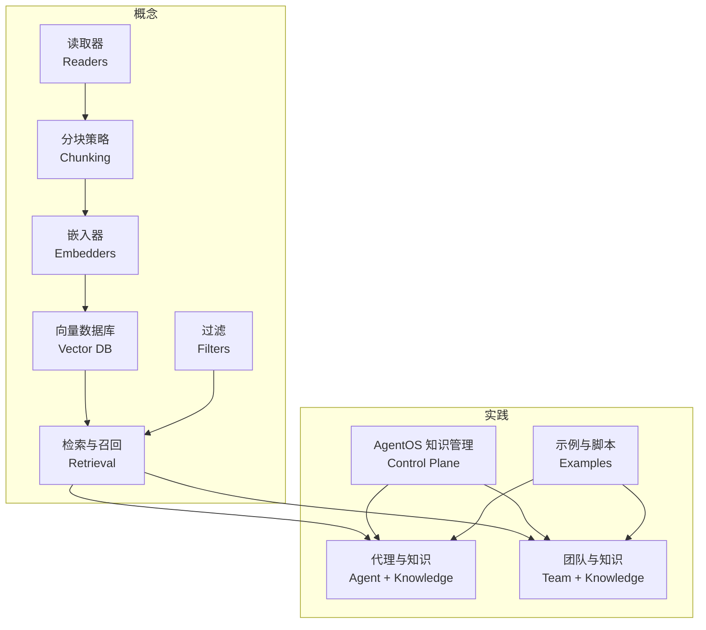
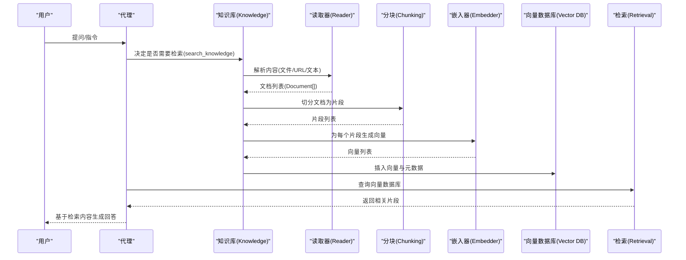
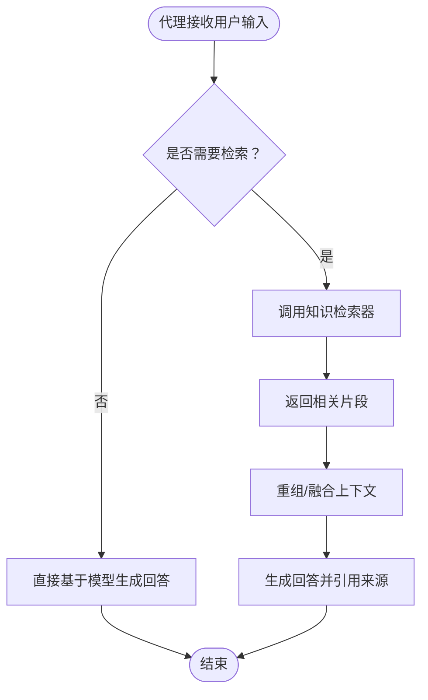
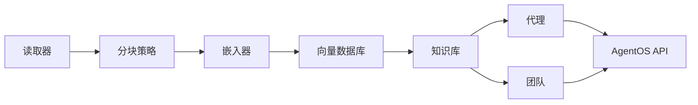

# 知识使用模式

<cite>
**本文引用的文件**
- [知识总览](file://knowledge/overview.mdx)
- [快速开始](file://knowledge/quickstart.mdx)
- [示例：快速开始](file://examples/knowledge/quickstart.mdx)
- [代理OS知识管理](file://agent-os/features/knowledge-management.mdx)
- [代理OS知识管理（控制平面）](file://agent-os/knowledge/manage-knowledge.mdx)
- [代理OS知识过滤](file://agent-os/knowledge/filter-knowledge.mdx)
- [代理与知识（概览）](file://knowledge/agents/overview.mdx)
- [团队与知识（概览）](file://knowledge/teams/overview.mdx)
- [概念：向量数据库](file://knowledge/concepts/vector-db.mdx)
- [概念：嵌入器（总览）](file://knowledge/concepts/embedder/overview.mdx)
- [概念：读取器（总览）](file://knowledge/concepts/readers/overview.mdx)
- [概念：分块（总览）](file://knowledge/concepts/chunking/overview.mdx)
- [概念：自定义分块](file://knowledge/concepts/chunking/custom-chunking.mdx)
- [概念：检索与召回（总览）](file://knowledge/concepts/search-and-retrieval/overview.mdx)
- [概念：自定义检索器](file://knowledge/concepts/search-and-retrieval/custom-retriever.mdx)
- [知识术语](file://knowledge/terminology.mdx)
- [_知识参考参数](file://_snippets/knowledge-reference.mdx)
- [示例：OpenAI 嵌入器](file://examples/knowledge/embedders/openai-embedder.mdx)
- [示例：HuggingFace 嵌入器](file://examples/knowledge/embedders/huggingface-embedder.mdx)
- [示例：SentenceTransformer 嵌入器](file://examples/knowledge/embedders/sentence-transformer-embedder.mdx)
- [示例：VoyageAI 嵌入器](file://examples/knowledge/embedders/voyageai-embedder.mdx)
</cite>

## 目录
1. [简介](#简介)
2. [项目结构](#项目结构)
3. [核心组件](#核心组件)
4. [架构总览](#架构总览)
5. [详细组件分析](#详细组件分析)
6. [依赖关系分析](#依赖关系分析)
7. [性能考量](#性能考量)
8. [故障排查指南](#故障排查指南)
9. [结论](#结论)
10. [附录](#附录)

## 简介
本文件面向开发者，系统性阐述如何在代理中集成并使用知识管理系统，覆盖从“内容读取—分块—嵌入—向量存储—检索—RAG”的完整链路，并重点说明代理如何在问答、内容生成、智能搜索等场景中高效使用知识。文档同时给出可直接定位到仓库示例与参考的路径，便于快速上手与扩展。

## 项目结构
围绕“知识使用模式”，本仓库提供了从概念到实践的完整资料：
- 概念层：向量数据库、嵌入器、读取器、分块策略、检索与召回、过滤
- 实践层：代理与知识、团队与知识、AgentOS 控制平面、示例与脚本
- 参考层：参数表、API 使用、错误处理与最佳实践

图示来源
- [概念：读取器（总览）:1-180](file://knowledge/concepts/readers/overview.mdx#L1-L180)
- [概念：分块（总览）:62-143](file://knowledge/concepts/chunking/overview.mdx#L62-L143)
- [概念：嵌入器（总览）:1-140](file://knowledge/concepts/embedder/overview.mdx#L1-L140)
- [概念：向量数据库:1-117](file://knowledge/concepts/vector-db.mdx#L1-L117)
- [概念：检索与召回（总览）:99-152](file://knowledge/concepts/search-and-retrieval/overview.mdx#L99-L152)
- [代理与知识（概览）:1-305](file://knowledge/agents/overview.mdx#L1-L305)
- [团队与知识（概览）:1-61](file://knowledge/teams/overview.mdx#L1-L61)
- [代理OS知识管理（控制平面）:1-129](file://agent-os/knowledge/manage-knowledge.mdx#L1-L129)

章节来源
- [知识总览:1-110](file://knowledge/overview.mdx#L1-L110)
- [快速开始:1-129](file://knowledge/quickstart.mdx#L1-L129)
- [示例：快速开始:1-50](file://examples/knowledge/quickstart.mdx#L1-L50)

## 核心组件
- 读取器（Reader）：负责从文件、URL、文本等源解析为可检索的 Document 对象，支持自动选择与自定义配置。
- 分块策略（Chunking）：将长文档切分为更小、语义连贯的片段，提升检索精度；支持固定大小、语义、递归、Markdown、代码等多种策略。
- 嵌入器（Embedder）：将文本转换为向量，支撑语义相似度检索；内置多种托管与本地嵌入器，支持批量嵌入与维度适配。
- 向量数据库（Vector DB）：存储向量与元数据，提供向量相似度与关键词混合检索；支持异步插入与查询。
- 检索与召回（Retrieval）：代理按需触发检索，支持传统 RAG 与“代理驱动的 RAG（Agentic RAG）”，可结合过滤与重排序。
- 过滤（Filters）：通过字典或表达式对检索结果进行元数据过滤，支持 AND/OR/NOT、范围比较等逻辑。

章节来源
- [概念：读取器（总览）:1-180](file://knowledge/concepts/readers/overview.mdx#L1-L180)
- [概念：分块（总览）:62-143](file://knowledge/concepts/chunking/overview.mdx#L62-L143)
- [概念：嵌入器（总览）:1-140](file://knowledge/concepts/embedder/overview.mdx#L1-L140)
- [概念：向量数据库:1-117](file://knowledge/concepts/vector-db.mdx#L1-L117)
- [概念：检索与召回（总览）:99-152](file://knowledge/concepts/search-and-retrieval/overview.mdx#L99-L152)
- [代理OS知识过滤:1-310](file://agent-os/knowledge/filter-knowledge.mdx#L1-L310)

## 架构总览
下图展示了从内容到代理响应的知识使用全链路：

图示来源
- [知识术语:69-99](file://knowledge/terminology.mdx#L69-L99)
- [概念：读取器（总览）:16-31](file://knowledge/concepts/readers/overview.mdx#L16-L31)
- [概念：分块（总览）:62-94](file://knowledge/concepts/chunking/overview.mdx#L62-L94)
- [概念：嵌入器（总览）:24-28](file://knowledge/concepts/embedder/overview.mdx#L24-L28)
- [概念：向量数据库:9-21](file://knowledge/concepts/vector-db.mdx#L9-L21)
- [概念：检索与召回（总览）:99-130](file://knowledge/concepts/search-and-retrieval/overview.mdx#L99-L130)

## 详细组件分析

### 代理与知识（问答、内容生成、智能搜索）
- 代理默认采用“代理驱动的 RAG（Agentic RAG）”，即由代理自主决定何时检索、如何重组问题、是否多次检索并融合结果。
- 可通过设置开关启用自动检索工具或直接将知识注入上下文（传统 RAG）。
- 支持自定义检索器函数，完全接管检索流程，适用于外部查询、多源融合、重排序等场景。

图示来源
- [代理与知识（概览）:27-112](file://knowledge/agents/overview.mdx#L27-L112)
- [概念：检索与召回（总览）:99-130](file://knowledge/concepts/search-and-retrieval/overview.mdx#L99-L130)
- [概念：自定义检索器:1-40](file://knowledge/concepts/search-and-retrieval/custom-retriever.mdx#L1-L40)

章节来源
- [代理与知识（概览）:1-305](file://knowledge/agents/overview.mdx#L1-L305)
- [概念：自定义检索器:1-40](file://knowledge/concepts/search-and-retrieval/custom-retriever.mdx#L1-L40)

### 团队与知识（分布式检索、协调 RAG）
- 多代理共享同一知识库时，可通过隔离向量检索范围避免跨成员干扰。
- 示例展示了团队成员使用知识库进行信息检索并汇总输出。

章节来源
- [团队与知识（概览）:1-61](file://knowledge/teams/overview.mdx#L1-L61)

### AgentOS 知识管理（控制平面）
- 在 AgentOS 中添加、编辑、删除知识条目，支持多知识库复用与状态同步。
- 可通过控制平面界面选择数据库、刷新状态、查看处理进度。

章节来源
- [代理OS知识管理:1-78](file://agent-os/features/knowledge-management.mdx#L1-L78)
- [代理OS知识管理（控制平面）:1-129](file://agent-os/knowledge/manage-knowledge.mdx#L1-L129)

### 读取器（Readers）
- 自动根据扩展名或 URL 选择合适的读取器；也可手动指定。
- 支持 PDF 加密、OCR、按页拆分；CSV/JSON/PPTX 等格式的专用选项。
- 异步批量读取以提升 I/O 性能。

章节来源
- [概念：读取器（总览）:1-180](file://knowledge/concepts/readers/overview.mdx#L1-L180)

### 分块策略（Chunking）
- 默认策略随读取器而定，可覆盖为固定大小、语义、递归、Markdown、代码等。
- 提供分块大小与重叠等配置项，指导不同内容类型的最优切分。

章节来源
- [概念：分块（总览）:62-143](file://knowledge/concepts/chunking/overview.mdx#L62-L143)
- [概念：自定义分块:29-86](file://knowledge/concepts/chunking/custom-chunking.mdx#L29-L86)

### 嵌入器（Embedders）
- 默认使用托管嵌入器，可替换为其他托管或本地嵌入器。
- 支持批量嵌入、维度匹配与异步操作；更换模型后需重新嵌入。

章节来源
- [概念：嵌入器（总览）:1-140](file://knowledge/concepts/embedder/overview.mdx#L1-L140)
- [示例：OpenAI 嵌入器:50-72](file://examples/knowledge/embedders/openai-embedder.mdx#L50-L72)
- [示例：HuggingFace 嵌入器:42-63](file://examples/knowledge/embedders/huggingface-embedder.mdx#L42-L63)
- [示例：SentenceTransformer 嵌入器:42-63](file://examples/knowledge/embedders/sentence-transformer-embedder.mdx#L42-L63)
- [示例：VoyageAI 嵌入器:50-72](file://examples/knowledge/embedders/voyageai-embedder.mdx#L50-L72)

### 向量数据库（Vector DB）
- 存储向量与元数据，支持混合检索（向量+关键词），并提供异步插入/查询。
- 支持多种数据库（PgVector、LanceDB、Pinecone、Qdrant 等），按开发/生产/托管/高性能场景选择。

章节来源
- [概念：向量数据库:1-117](file://knowledge/concepts/vector-db.mdx#L1-L117)

### 检索与召回（Retrieval）
- 传统 RAG：始终检索并注入上下文。
- Agentic RAG：代理自主决策，可重排查询、多次检索、融合结果。
- 支持基于元数据的过滤，以及通过 API 的字典/表达式过滤。

章节来源
- [概念：检索与召回（总览）:99-152](file://knowledge/concepts/search-and-retrieval/overview.mdx#L99-L152)
- [代理OS知识过滤:1-310](file://agent-os/knowledge/filter-knowledge.mdx#L1-L310)

## 依赖关系分析
- 组件耦合：知识库（Knowledge）串联读取器、分块、嵌入器与向量数据库；代理/团队通过检索接口使用知识。
- 外部依赖：向量数据库、嵌入器服务（托管/本地）、读取器依赖对应格式解析库。
- 运行时依赖：异步能力贯穿读取、嵌入、插入与查询，适合高并发与低延迟场景。

图示来源
- [知识术语:69-99](file://knowledge/terminology.mdx#L69-L99)
- [代理与知识（概览）:113-162](file://knowledge/agents/overview.mdx#L113-L162)
- [团队与知识（概览）:12-58](file://knowledge/teams/overview.mdx#L12-L58)

## 性能考量
- 批量嵌入：减少 API 调用次数，提高吞吐。
- 混合检索：兼顾语义与关键词，提升召回质量与速度。
- 异步操作：在高并发场景下使用异步插入与查询，降低等待时间。
- 分块策略：根据任务类型选择合适策略与尺寸，平衡召回精度与上下文完整性。
- 数据库选择：按部署形态与规模选择本地、托管或高性能向量数据库。

章节来源
- [概念：嵌入器（总览）:61-88](file://knowledge/concepts/embedder/overview.mdx#L61-L88)
- [概念：向量数据库:23-31](file://knowledge/concepts/vector-db.mdx#L23-L31)
- [概念：分块（总览）:118-126](file://knowledge/concepts/chunking/overview.mdx#L118-L126)

## 故障排查指南
- 知识库未显示：确认已正确添加到 AgentOS 并绑定内容数据库。
- 数据库连接失败：检查连接字符串与可达性。
- 搜索不到内容：确认内容已成功嵌入并存在于向量表中。
- 过滤无效：检查过滤 JSON 结构与字段名称，确保序列化正确；若解析失败，搜索会忽略过滤条件但不会报错。

章节来源
- [代理OS知识管理（控制平面）:113-128](file://agent-os/knowledge/manage-knowledge.mdx#L113-L128)
- [代理OS知识过滤:223-245](file://agent-os/knowledge/filter-knowledge.mdx#L223-L245)

## 结论
通过将“读取—分块—嵌入—向量存储—检索—RAG”整合进代理工作流，开发者可以构建具备动态知识检索与生成能力的智能代理。结合 AgentOS 控制平面与丰富的嵌入器、向量数据库、读取器与分块策略，可在问答、内容生成、智能搜索等场景中获得高质量、可扩展的解决方案。

## 附录

### 快速开始（示例）
- 从零搭建一个基于 ChromaDB 的知识代理，加载文档并进行问答。
- 示例包含环境准备、依赖安装、API 密钥导出与运行步骤。

章节来源
- [快速开始:1-129](file://knowledge/quickstart.mdx#L1-L129)
- [示例：快速开始:1-50](file://examples/knowledge/quickstart.mdx#L1-L50)

### 知识库参数参考
- 名称、描述、向量数据库、内容数据库、最大返回数、自定义读取器等关键参数。

章节来源
- [_知识参考参数:1-8](file://_snippets/knowledge-reference.mdx#L1-L8)