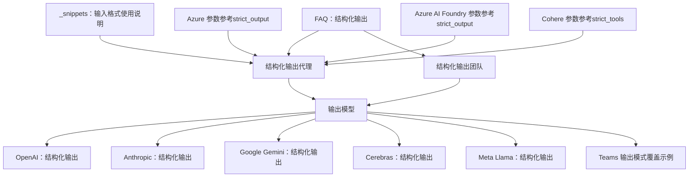
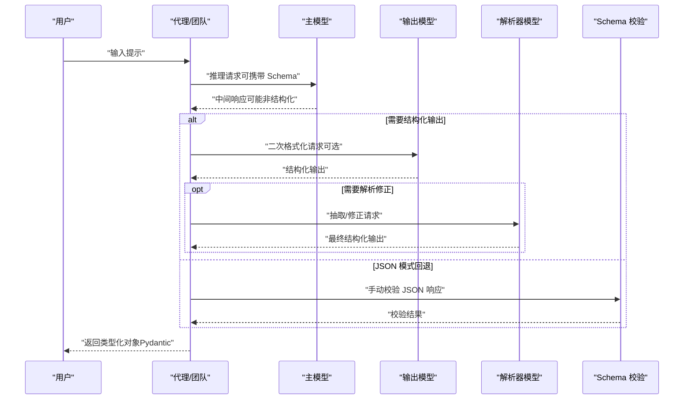
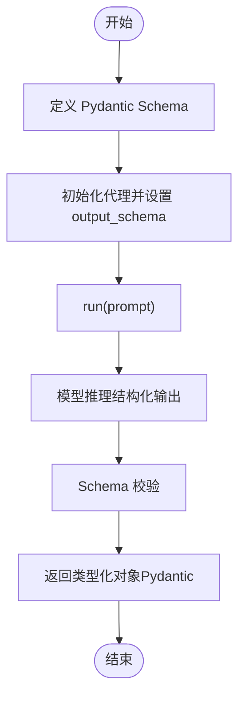
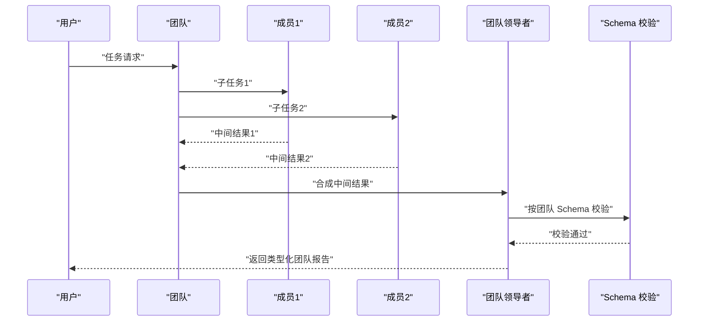
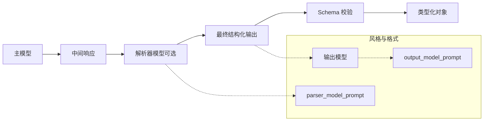
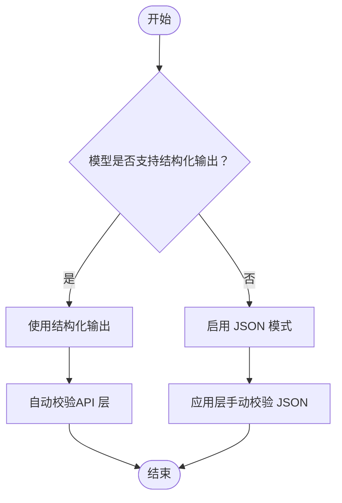
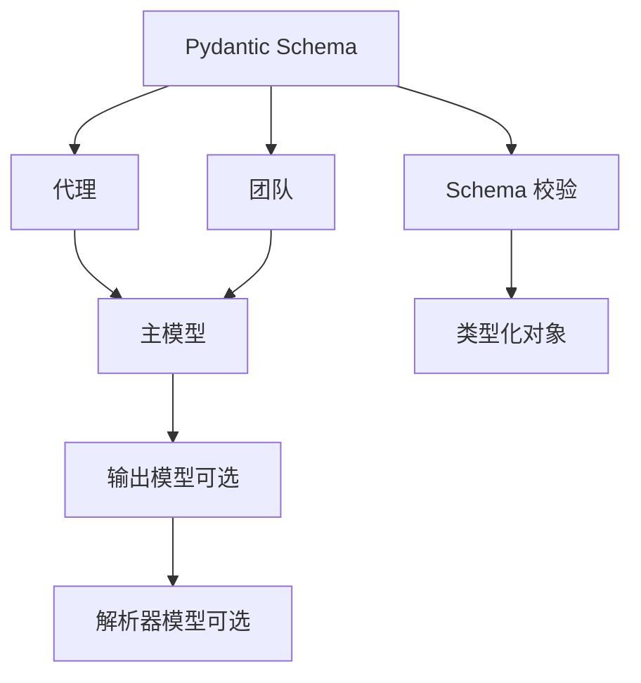

# 结构化输出模式

<cite>
**本文引用的文件**
- [结构化输出（代理）](file://input-output/structured-output/agent.mdx)
- [结构化输出（团队）](file://input-output/structured-output/team.mdx)
- [输出模型](file://input-output/output-model.mdx)
- [FAQ：结构化输出](file://faq/structured-outputs.mdx)
- [基础示例：带结构化输出的代理](file://examples/basics/agent-with-structured-output.mdx)
- [OpenAI：结构化输出](file://examples/models/openai/chat/structured-output.mdx)
- [Anthropic：结构化输出](file://examples/models/anthropic/structured-output.mdx)
- [Google Gemini：结构化输出](file://examples/models/google/gemini/structured-output.mdx)
- [Cerebras：结构化输出](file://examples/models/cerebras/structured-output.mdx)
- [Meta Llama：结构化输出](file://examples/models/meta/llama/structured-output.mdx)
- [Teams 结构化输入/输出：输出模式覆盖](file://examples/teams/structured-input-output/output-schema-override.mdx)
- [输入格式使用说明](file://_snippets/input-format-usage.mdx)
- [Azure 参数参考（含 strict_output）](file://reference/models/azure.mdx)
- [Azure AI Foundry 参数参考（含 strict_output）](file://models/providers/cloud/azure-ai-foundry/overview.mdx)
- [Cohere 参数参考（含 strict_tools）](file://reference/models/cohere.mdx)
</cite>

## 目录
1. [简介](#简介)
2. [项目结构](#项目结构)
3. [核心组件](#核心组件)
4. [架构总览](#架构总览)
5. [组件详解](#组件详解)
6. [依赖关系分析](#依赖关系分析)
7. [性能考量](#性能考量)
8. [故障排查指南](#故障排查指南)
9. [结论](#结论)
10. [附录](#附录)

## 简介
本篇文档面向开发者，系统性介绍代理的“结构化输出”能力与实现方式，涵盖输出模型定义、Schema 验证、数据格式转换、回退策略（JSON 模式）、以及多模型流水线（输出模型/解析器模型）等主题。文档基于仓库中已有的结构化输出相关文档与示例进行归纳总结，并提供可操作的配置建议、最佳实践与排错指引。

## 项目结构
围绕结构化输出的关键文档与示例如下图所示：

**图表来源**
- [结构化输出（代理）](file://input-output/structured-output/agent.mdx)
- [结构化输出（团队）](file://input-output/structured-output/team.mdx)
- [输出模型](file://input-output/output-model.mdx)
- [OpenAI：结构化输出](file://examples/models/openai/chat/structured-output.mdx)
- [Anthropic：结构化输出](file://examples/models/anthropic/structured-output.mdx)
- [Google Gemini：结构化输出](file://examples/models/google/gemini/structured-output.mdx)
- [Cerebras：结构化输出](file://examples/models/cerebras/structured-output.mdx)
- [Meta Llama：结构化输出](file://examples/models/meta/llama/structured-output.mdx)
- [Teams 输出模式覆盖示例](file://examples/teams/structured-input-output/output-schema-override.mdx)
- [FAQ：结构化输出](file://faq/structured-outputs.mdx)
- [_snippets：输入格式使用说明](file://_snippets/input-format-usage.mdx)
- [Azure 参数参考（strict_output）](file://reference/models/azure.mdx)
- [Azure AI Foundry 参数参考（strict_output）](file://models/providers/cloud/azure-ai-foundry/overview.mdx)
- [Cohere 参数参考（strict_tools）](file://reference/models/cohere.mdx)

**章节来源**
- [结构化输出（代理）](file://input-output/structured-output/agent.mdx)
- [结构化输出（团队）](file://input-output/structured-output/team.mdx)
- [输出模型](file://input-output/output-model.mdx)
- [FAQ：结构化输出](file://faq/structured-outputs.mdx)
- [_snippets：输入格式使用说明](file://_snippets/input-format-usage.mdx)
- [Azure 参数参考（strict_output）](file://reference/models/azure.mdx)
- [Azure AI Foundry 参数参考（strict_output）](file://models/providers/cloud/azure-ai-foundry/overview.mdx)
- [Cohere 参数参考（strict_tools）](file://reference/models/cohere.mdx)

## 核心组件
- 输出模型（output_schema）
  - 使用 Pydantic 模型定义期望的响应结构，代理在运行时将其转换为 JSON Schema 并传递给支持结构化输出的模型；随后对返回结果进行校验，最终以类型化的 Pydantic 对象形式返回。
- 输出模型（output_model）
  - 当主模型不支持结构化输出或需要更强的格式化能力时，可指定一个具备结构化输出能力的“输出模型”，用于二次格式化与校验。
- 解析器模型（parser_model）
  - 在主模型较弱或输出不够结构化时，使用“解析器模型”对中间结果进行抽取与修正，确保最终输出满足目标 Schema。
- JSON 模式（use_json_mode）
  - 当模型不支持结构化输出时，启用 JSON 模式，由系统提示词引导模型返回符合结构的 JSON 文本；该模式不保证 API 层自动校验，需在应用层自行校验。
- per-run 覆盖
  - 支持在单次调用中临时覆盖 output_schema 或 output_model，以适配不同任务的输出形态。

**章节来源**
- [结构化输出（代理）](file://input-output/structured-output/agent.mdx)
- [结构化输出（团队）](file://input-output/structured-output/team.mdx)
- [输出模型](file://input-output/output-model.mdx)
- [FAQ：结构化输出](file://faq/structured-outputs.mdx)

## 架构总览
下图展示了从“请求到结构化响应”的典型流程，包括主模型推理、可选的输出模型二次格式化、以及解析器模型的抽取修正。

**图表来源**
- [结构化输出（代理）](file://input-output/structured-output/agent.mdx)
- [结构化输出（团队）](file://input-output/structured-output/team.mdx)
- [输出模型](file://input-output/output-model.mdx)
- [FAQ：结构化输出](file://faq/structured-outputs.mdx)

## 组件详解

### 代理级结构化输出
- 定义与使用
  - 通过在代理构造时传入 output_schema（Pydantic 模型），即可让代理返回类型化的对象，而非自由文本。
- 工作机制
  - 将 Pydantic 模型转为 JSON Schema，传递给支持结构化输出的模型；模型返回严格遵循 Schema 的内容；代理再进行一次校验，最终以 response.content 返回类型化对象。
- 运行时覆盖
  - 支持在单次 run 中临时覆盖 output_schema，以适配不同任务。
- 与工具协作
  - 代理在执行工具调用后，仍会按 output_schema 格式化最终响应。
- 设计要点
  - 使用 Field 描述与约束提升模型生成质量；对不确定字段使用 Optional；合理设计嵌套结构与列表项。
- 常见模式
  - 数据抽取、分类、多条目生成等。

**图表来源**
- [结构化输出（代理）](file://input-output/structured-output/agent.mdx)

**章节来源**
- [结构化输出（代理）](file://input-output/structured-output/agent.mdx)
- [基础示例：带结构化输出的代理](file://examples/basics/agent-with-structured-output.mdx)

### 团队级结构化输出
- 定义与使用
  - 在团队上设置 output_schema，使团队领导者的最终合成输出满足指定 Schema。
- 工作机制
  - 成员各自执行任务并返回结果；团队领导者汇总并按 Schema 合成最终输出。
- 运行时覆盖
  - 支持在单次 run 中临时覆盖 output_schema。
- 多层 Schema
  - 可同时为成员与团队分别设置 output_schema，成员输出保持一致，团队输出负责整合。
- 设计要点
  - 聚合多个视角的洞察；包含置信度与理由字段；支持结构化对比。

**图表来源**
- [结构化输出（团队）](file://input-output/structured-output/team.mdx)

**章节来源**
- [结构化输出（团队）](file://input-output/structured-output/team.mdx)
- [Teams 输出模式覆盖示例](file://examples/teams/structured-input-output/output-schema-override.mdx)

### 输出模型与解析器模型
- 输出模型（output_model）
  - 当主模型不支持结构化输出或需要更好的表达风格时，使用具备结构化输出能力的“输出模型”进行二次格式化与校验。
  - 可通过 output_model_prompt 自定义风格、语气与格式。
- 解析器模型（parser_model）
  - 在主模型较弱或输出不够结构化时，使用“解析器模型”对中间结果进行抽取与修正，确保最终输出满足目标 Schema。
  - 可通过 parser_model_prompt 提供抽取规则与格式约束。
- 单模型 vs 多模型
  - 单模型：主模型负责推理，输出模型负责格式化。
  - 多模型：主模型负责推理，解析器模型负责抽取/修正，输出模型负责最终格式化。

**图表来源**
- [输出模型](file://input-output/output-model.mdx)

**章节来源**
- [输出模型](file://input-output/output-model.mdx)

### JSON 模式与回退策略
- 适用场景
  - 某些模型不支持结构化输出；或需要更广泛的兼容性但允许在应用层手动校验。
- 行为差异
  - 结构化输出：模型返回严格遵循 Schema 的内容，API 层即保证合规。
  - JSON 模式：模型返回 JSON 文本，不保证 API 层自动校验，需应用层自行校验。
- 使用建议
  - 优先选择支持结构化输出的模型；仅在必要时启用 JSON 模式，并配合应用层校验。

**图表来源**
- [FAQ：结构化输出](file://faq/structured-outputs.mdx)

**章节来源**
- [FAQ：结构化输出](file://faq/structured-outputs.mdx)
- [_snippets：输入格式使用说明](file://_snippets/input-format-usage.mdx)

### 多模型与严格模式参数
- Azure/云厂商模型
  - 提供 strict_output 参数控制结构化输出的严格程度，默认开启，确保输出严格遵循 Schema。
- Cohere
  - 提供 strict_tools 参数，控制工具调用参数的严格匹配。
- 其他厂商
  - 参考各模型 Provider 的参数说明，结合业务需求选择合适的严格级别。

**章节来源**
- [Azure 参数参考（strict_output）](file://reference/models/azure.mdx)
- [Azure AI Foundry 参数参考（strict_output）](file://models/providers/cloud/azure-ai-foundry/overview.mdx)
- [Cohere 参数参考（strict_tools）](file://reference/models/cohere.mdx)

## 依赖关系分析
- 代理/团队依赖于模型提供方的结构化输出能力；若不支持，则回退至 JSON 模式并在应用层校验。
- 输出模型与解析器模型作为可选增强层，用于提升格式一致性与抽取准确性。
- Pydantic Schema 是跨组件的契约，贯穿“定义 → 推理 → 校验 → 返回”的全链路。

**图表来源**
- [结构化输出（代理）](file://input-output/structured-output/agent.mdx)
- [结构化输出（团队）](file://input-output/structured-output/team.mdx)
- [输出模型](file://input-output/output-model.mdx)

**章节来源**
- [结构化输出（代理）](file://input-output/structured-output/agent.mdx)
- [结构化输出（团队）](file://input-output/structured-output/team.mdx)
- [输出模型](file://input-output/output-model.mdx)

## 性能考量
- 选择合适模型
  - 对于复杂推理与工具调用，优先选用能力强的主模型；对于格式化与风格优化，选用表达能力强的输出模型。
- 流水线分层
  - 在主模型较弱或输出不稳定时，引入解析器模型进行抽取与修正，减少重复生成与重试成本。
- 严格模式权衡
  - 开启严格模式（如 strict_output/strict_tools）可提升一致性，但可能增加生成时间或失败率；根据业务容忍度调整。
- 异步与流式
  - 示例中提供了同步、异步与流式打印的用法，可根据前端渲染与用户体验选择合适的输出方式。

[本节为通用指导，无需特定文件引用]

## 故障排查指南
- 输出不符合 Schema
  - 若使用 JSON 模式，请在应用层补充校验逻辑；若使用结构化输出，请确认模型支持且未被禁用严格模式。
- 字段缺失或类型不符
  - 检查 Pydantic Schema 的必填字段与类型约束；为字段添加清晰的 Field 描述与范围约束。
- 工具调用与结构化输出冲突
  - 某些模型在启用结构化输出时可能不支持工具；请改用 JSON 模式或切换到支持结构化输出+工具的模型。
- 多模型流水线异常
  - 分阶段定位问题：先检查主模型输出，再检查解析器模型抽取，最后检查输出模型格式化。
- per-run 覆盖未生效
  - 确认在 run 调用时传入了正确的 output_schema 或 output_model；避免与初始化时的默认值混淆。

**章节来源**
- [FAQ：结构化输出](file://faq/structured-outputs.mdx)
- [结构化输出（代理）](file://input-output/structured-output/agent.mdx)
- [结构化输出（团队）](file://input-output/structured-output/team.mdx)
- [输出模型](file://input-output/output-model.mdx)

## 结论
通过 Pydantic Schema、结构化输出与可选的输出/解析器模型，代理系统能够在多种模型与场景下稳定地生成结构化、可信任的响应。建议优先采用原生结构化输出能力，必要时借助 JSON 模式与应用层校验；在复杂任务中引入解析器模型与输出模型，以获得更高的准确性与一致性。

[本节为总结性内容，无需特定文件引用]

## 附录

### 实际应用示例索引
- 基础示例：带结构化输出的代理
  - [基础示例：带结构化输出的代理](file://examples/basics/agent-with-structured-output.mdx)
- OpenAI：结构化输出（含 JSON 模式与严格模式）
  - [OpenAI：结构化输出](file://examples/models/openai/chat/structured-output.mdx)
- Anthropic：结构化输出
  - [Anthropic：结构化输出](file://examples/models/anthropic/structured-output.mdx)
- Google Gemini：结构化输出（含日期/时间/枚举等约束）
  - [Google Gemini：结构化输出](file://examples/models/google/gemini/structured-output.mdx)
- Cerebras：结构化输出（strict_output 控制）
  - [Cerebras：结构化输出](file://examples/models/cerebras/structured-output.mdx)
- Meta Llama：结构化输出
  - [Meta Llama：结构化输出](file://examples/models/meta/llama/structured-output.mdx)
- Teams：输出模式覆盖（单次 run 覆盖 output_schema）
  - [Teams 输出模式覆盖示例](file://examples/teams/structured-input-output/output-schema-override.mdx)

**章节来源**
- [基础示例：带结构化输出的代理](file://examples/basics/agent-with-structured-output.mdx)
- [OpenAI：结构化输出](file://examples/models/openai/chat/structured-output.mdx)
- [Anthropic：结构化输出](file://examples/models/anthropic/structured-output.mdx)
- [Google Gemini：结构化输出](file://examples/models/google/gemini/structured-output.mdx)
- [Cerebras：结构化输出](file://examples/models/cerebras/structured-output.mdx)
- [Meta Llama：结构化输出](file://examples/models/meta/llama/structured-output.mdx)
- [Teams 输出模式覆盖示例](file://examples/teams/structured-input-output/output-schema-override.mdx)