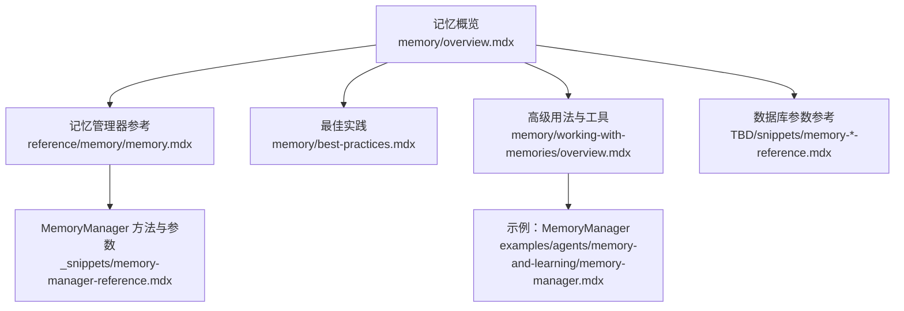
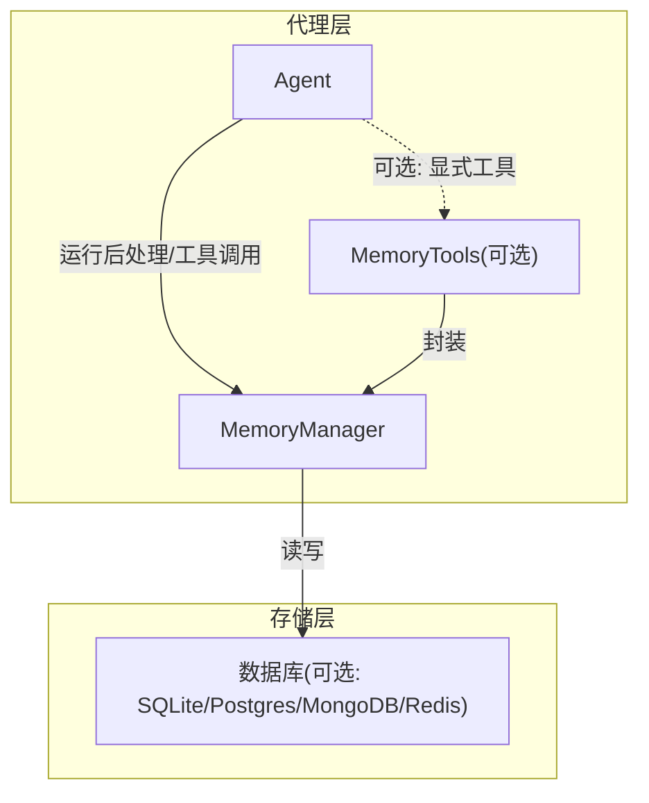
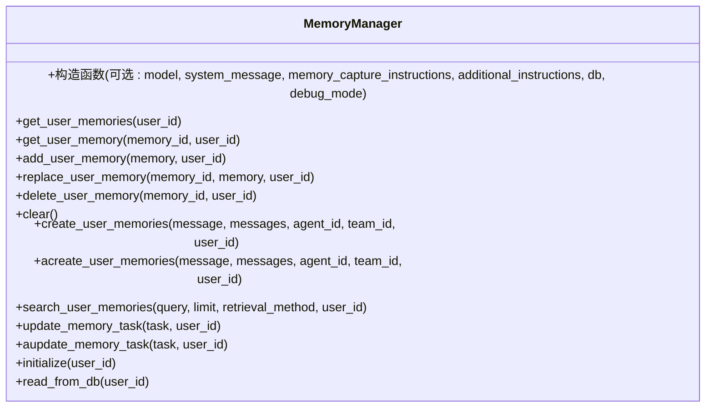
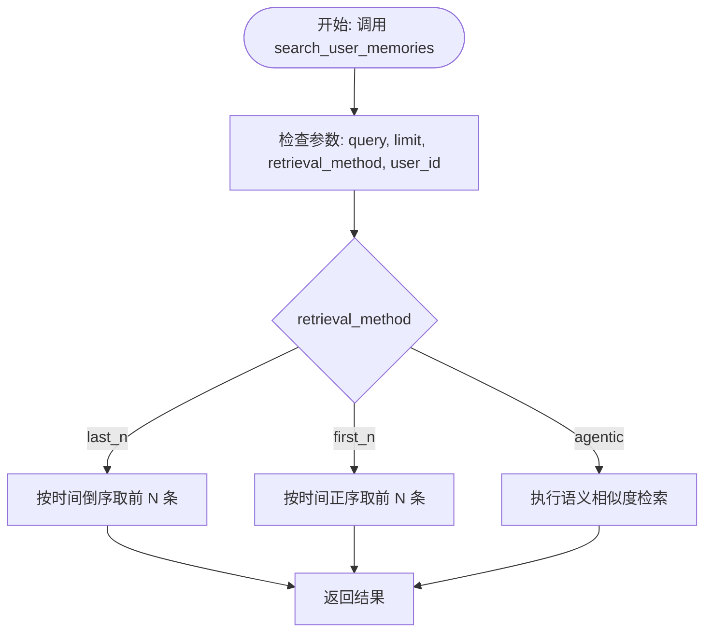
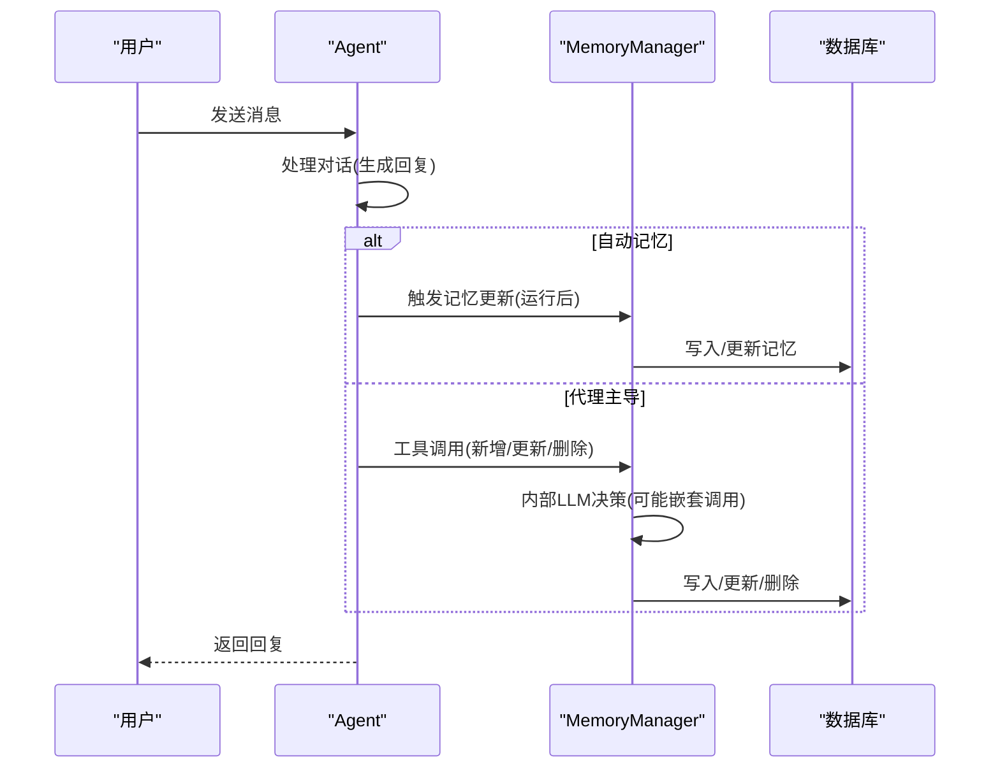
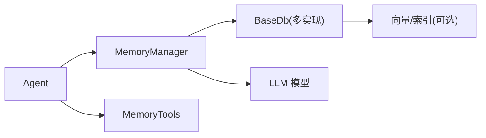

# 记忆管理模式

<cite>
**本文引用的文件**
- [reference/memory/memory.mdx](file://reference/memory/memory.mdx)
- [_snippets/memory-manager-reference.mdx](file://_snippets/memory-manager-reference.mdx)
- [memory/overview.mdx](file://memory/overview.mdx)
- [memory/best-practices.mdx](file://memory/best-practices.mdx)
- [memory/working-with-memories/overview.mdx](file://memory/working-with-memories/overview.mdx)
- [examples/agents/memory-and-learning/memory-manager.mdx](file://examples/agents/memory-and-learning/memory-manager.mdx)
- [TBD/snippets/memory-mongo-reference.mdx](file://TBD/snippets/memory-mongo-reference.mdx)
- [TBD/snippets/memory-postgres-reference.mdx](file://TBD/snippets/memory-postgres-reference.mdx)
- [TBD/snippets/memory-redis-reference.mdx](file://TBD/snippets/memory-redis-reference.mdx)
- [TBD/snippets/memory-sqlite-reference.mdx](file://TBD/snippets/memory-sqlite-reference.mdx)
</cite>

## 目录
1. [简介](#简介)
2. [项目结构](#项目结构)
3. [核心组件](#核心组件)
4. [架构总览](#架构总览)
5. [详细组件分析](#详细组件分析)
6. [依赖关系分析](#依赖关系分析)
7. [性能考量](#性能考量)
8. [故障排查指南](#故障排查指南)
9. [结论](#结论)
10. [附录](#附录)

## 简介
本文件面向开发者，系统性阐述代理记忆管理模式的设计与实现，覆盖记忆的创建、检索、更新与删除；解释记忆管理器（MemoryManager）的工作原理与配置项；说明会话记忆、长期记忆、短期记忆等不同记忆类型的组织方式；并提供对话系统、个性化推荐等典型场景下的应用示例与最佳实践，帮助你在真实生产环境中构建稳定、可扩展且高性能的记忆管理能力。

## 项目结构
围绕“记忆”主题，知识库中存在多处文档与示例，主要分布在以下位置：
- reference/memory：记忆管理器的参考文档
- memory：记忆概览、最佳实践与高级用法
- TBD/snippets：各数据库存储参数参考
- examples：记忆管理器的使用示例

图表来源
- [memory/overview.mdx:1-202](file://memory/overview.mdx#L1-L202)
- [reference/memory/memory.mdx:1-8](file://reference/memory/memory.mdx#L1-L8)
- [_snippets/memory-manager-reference.mdx:1-58](file://_snippets/memory-manager-reference.mdx#L1-L58)
- [memory/best-practices.mdx:1-202](file://memory/best-practices.mdx#L1-L202)
- [memory/working-with-memories/overview.mdx:1-166](file://memory/working-with-memories/overview.mdx#L1-L166)
- [examples/agents/memory-and-learning/memory-manager.mdx:1-67](file://examples/agents/memory-and-learning/memory-manager.mdx#L1-L67)
- [TBD/snippets/memory-mongo-reference.mdx:1-8](file://TBD/snippets/memory-mongo-reference.mdx#L1-L8)
- [TBD/snippets/memory-postgres-reference.mdx:1-8](file://TBD/snippets/memory-postgres-reference.mdx#L1-L8)
- [TBD/snippets/memory-redis-reference.mdx:1-9](file://TBD/snippets/memory-redis-reference.mdx#L1-L9)
- [TBD/snippets/memory-sqlite-reference.mdx:1-8](file://TBD/snippets/memory-sqlite-reference.mdx#L1-L8)

章节来源
- [memory/overview.mdx:1-202](file://memory/overview.mdx#L1-L202)
- [reference/memory/memory.mdx:1-8](file://reference/memory/memory.mdx#L1-L8)

## 核心组件
- 记忆管理器（MemoryManager）
  - 职责：负责用户记忆的创建、检索、更新、删除；支持基于规则或语义的检索；支持任务驱动的记忆更新；提供初始化与数据库读取等辅助方法。
  - 关键方法族：
    - 用户记忆管理：获取全部/指定记忆、新增、替换、删除、清空
    - 记忆创建与搜索：从文本/消息批量创建、异步创建、按策略检索（最近N条、最早N条、语义相似）
    - 记忆任务管理：基于任务描述更新记忆（同步/异步）
    - 工具方法：初始化、从数据库读取
  - 配置参数：模型选择、系统提示词、记忆捕获指令、附加指令、数据库连接、调试模式等

- 记忆数据模型
  - 字段：记忆唯一标识、记忆内容、主题列表、触发输入、用户ID、代理ID、团队ID、最后更新时间戳
  - 存储：默认表名为“agno_memories”，可自定义表名；自动建表，无需手动迁移

- 记忆类型与作用域
  - 会话记忆：用于对话连贯性，通常来自会话历史
  - 长期记忆：持久化的用户事实，跨会话保留
  - 短期记忆：上下文窗口内的临时记忆，随请求刷新

章节来源
- [_snippets/memory-manager-reference.mdx:1-58](file://_snippets/memory-manager-reference.mdx#L1-L58)
- [memory/overview.mdx:148-165](file://memory/overview.mdx#L148-L165)

## 架构总览
下图展示了代理、记忆管理器与数据库之间的交互关系，以及两种记忆管理模式（自动/代理主导）的控制流差异。

图表来源
- [memory/overview.mdx:38-92](file://memory/overview.mdx#L38-L92)
- [memory/working-with-memories/overview.mdx:90-134](file://memory/working-with-memories/overview.mdx#L90-L134)
- [TBD/snippets/memory-sqlite-reference.mdx:1-8](file://TBD/snippets/memory-sqlite-reference.mdx#L1-L8)
- [TBD/snippets/memory-postgres-reference.mdx:1-8](file://TBD/snippets/memory-postgres-reference.mdx#L1-L8)
- [TBD/snippets/memory-mongo-reference.mdx:1-8](file://TBD/snippets/memory-mongo-reference.mdx#L1-L8)
- [TBD/snippets/memory-redis-reference.mdx:1-9](file://TBD/snippets/memory-redis-reference.mdx#L1-L9)

## 详细组件分析

### 组件一：MemoryManager 类与方法族
- 设计要点
  - 分离职责：记忆的“提取/生成/优化”与“存储/检索/删除”通过统一入口管理
  - 可插拔模型：支持为记忆操作单独配置低成本模型，降低总体成本
  - 检索策略：支持按时间顺序与语义相似度检索，满足不同业务需求
  - 异步支持：提供异步创建与更新接口，适配高并发场景
- 数据结构与复杂度
  - 记忆列表读取与过滤：O(n)，其中 n 为用户记忆数量
  - 语义检索：依赖底层向量检索，复杂度与向量维数、索引规模相关
  - 批量创建：受模型与数据库写入吞吐限制
- 错误处理与边界
  - 当未设置 user_id 时，默认聚合到“default”用户，可能导致跨用户污染
  - 同时启用自动与代理主导模式时，代理主导优先，自动模式被忽略
- 性能影响
  - 代理主导模式每次记忆操作都会触发一次独立 LLM 调用，易导致 token 消耗爆炸
  - 建议优先采用自动模式，并在必要时对昂贵模型进行降级

图表来源
- [_snippets/memory-manager-reference.mdx:16-58](file://_snippets/memory-manager-reference.mdx#L16-L58)

章节来源
- [_snippets/memory-manager-reference.mdx:1-58](file://_snippets/memory-manager-reference.mdx#L1-L58)
- [memory/overview.mdx:38-92](file://memory/overview.mdx#L38-L92)

### 组件二：检索流程与策略
- 检索方法
  - last_n：返回最近 N 条记忆
  - first_n：返回最早 N 条记忆
  - agentic：基于查询进行语义相似度检索
- 流程图

图表来源
- [_snippets/memory-manager-reference.mdx:51-58](file://_snippets/memory-manager-reference.mdx#L51-L58)

章节来源
- [_snippets/memory-manager-reference.mdx:51-58](file://_snippets/memory-manager-reference.mdx#L51-L58)

### 组件三：自动记忆 vs 代理主导记忆
- 自动记忆（update_memory_on_run=True）
  - 在每次对话结束后自动抽取并写入记忆，无需人工干预
  - 更适合大多数场景，稳定可靠
- 代理主导（enable_agentic_memory=True）
  - 代理通过内置工具决定何时创建/更新/删除记忆
  - 提供更强的上下文感知与决策能力，但需谨慎控制 token 成本
- 控制流对比

图表来源
- [memory/overview.mdx:38-92](file://memory/overview.mdx#L38-L92)
- [memory/best-practices.mdx:21-70](file://memory/best-practices.mdx#L21-L70)

章节来源
- [memory/overview.mdx:38-92](file://memory/overview.mdx#L38-L92)
- [memory/best-practices.mdx:21-70](file://memory/best-practices.mdx#L21-L70)

### 组件四：存储与配置
- 支持的存储类型
  - SQLite、Postgres、MongoDB、Redis 等
- 参数要点
  - SQLite：表名、数据库文件路径、连接引擎
  - Postgres：表名、schema、连接 URL、连接引擎
  - MongoDB：集合名、连接 URL、数据库名、客户端
  - Redis：键前缀、主机、端口、数据库号、密码
- 自定义表名与自动建表
  - 默认表名为“agno_memories”
  - 首次写入时自动创建表，无需手动迁移

章节来源
- [TBD/snippets/memory-sqlite-reference.mdx:1-8](file://TBD/snippets/memory-sqlite-reference.mdx#L1-L8)
- [TBD/snippets/memory-postgres-reference.mdx:1-8](file://TBD/snippets/memory-postgres-reference.mdx#L1-L8)
- [TBD/snippets/memory-mongo-reference.mdx:1-8](file://TBD/snippets/memory-mongo-reference.mdx#L1-L8)
- [TBD/snippets/memory-redis-reference.mdx:1-9](file://TBD/snippets/memory-redis-reference.mdx#L1-L9)
- [memory/overview.mdx:94-122](file://memory/overview.mdx#L94-L122)

### 组件五：示例与实战
- 使用 MemoryManager 的示例
  - 展示如何启用 agentic memory、配置 MemoryManager、与数据库集成，并在两次交互中验证记忆的持久化与召回
- 示例路径
  - [examples/agents/memory-and-learning/memory-manager.mdx:1-67](file://examples/agents/memory-and-learning/memory-manager.mdx#L1-L67)

章节来源
- [examples/agents/memory-and-learning/memory-manager.mdx:1-67](file://examples/agents/memory-and-learning/memory-manager.mdx#L1-L67)

## 依赖关系分析
- 组件耦合
  - Agent 依赖 MemoryManager 或 MemoryTools 进行记忆操作
  - MemoryManager 依赖数据库抽象（BaseDb），以支持多种存储后端
- 外部依赖
  - LLM 模型用于记忆提取与语义检索
  - 向量数据库/搜索引擎用于高效相似度检索（由具体存储实现决定）
- 循环依赖
  - 文档中未见直接循环导入；注意在实现中避免 MemoryManager 与 Agent 的双向强耦合

图表来源
- [memory/working-with-memories/overview.mdx:90-134](file://memory/working-with-memories/overview.mdx#L90-L134)
- [memory/overview.mdx:94-122](file://memory/overview.mdx#L94-L122)

章节来源
- [memory/working-with-memories/overview.mdx:90-134](file://memory/working-with-memories/overview.mdx#L90-L134)
- [memory/overview.mdx:94-122](file://memory/overview.mdx#L94-L122)

## 性能考量
- token 成本控制
  - 代理主导模式每次记忆操作都会触发一次独立 LLM 调用，随着记忆数量增长，成本呈指数上升
  - 建议优先使用自动模式；如必须使用代理主导，为记忆操作配置低成本模型
- 上下文膨胀
  - 随着用户记忆增多，自动注入上下文会导致 token 消耗上升
  - 可通过“不自动注入上下文”的方式收集记忆，再按需检索
- 记忆优化
  - 对于拥有 50+ 记忆的用户，在高成本操作前进行合并/摘要优化
  - 定期清理过期或低价值记忆，防止无界增长
- 并发与一致性
  - 多代理共享同一数据库时，确保 user_id 正确传递，避免跨用户污染
  - 在高并发场景下，建议对数据库写入加锁或使用事务

章节来源
- [memory/best-practices.mdx:21-143](file://memory/best-practices.mdx#L21-L143)
- [memory/working-with-memories/overview.mdx:67-88](file://memory/working-with-memories/overview.mdx#L67-L88)

## 故障排查指南
- 常见问题
  - 忘记设置 user_id：所有用户的记忆会混到“default”用户下
  - 同时启用自动与代理主导：代理主导优先，自动模式被忽略
  - 记忆数量异常增长：未设置上限或未定期清理
- 排查步骤
  - 检查 user_id 是否显式传入
  - 确认仅启用一种记忆模式
  - 统计用户记忆数量，设定阈值告警
  - 对高成本操作前执行记忆优化与清理
- 相关路径
  - [memory/best-practices.mdx:144-196](file://memory/best-practices.mdx#L144-L196)

章节来源
- [memory/best-practices.mdx:144-196](file://memory/best-practices.mdx#L144-L196)

## 结论
通过 MemoryManager，代理能够在自动与代理主导两种模式之间灵活切换，结合多种存储后端与检索策略，实现稳定、可扩展的记忆管理。在生产环境中，应优先采用自动模式并配合成本控制、上下文裁剪、定期优化与清理等手段，确保记忆系统在准确性与效率之间取得平衡。

## 附录
- 实际应用示例
  - 对话系统：利用长期记忆提升个性化体验
  - 个性化推荐：基于用户偏好记忆进行内容筛选
  - 多代理协作：共享记忆以实现上下文一致的跨代理服务
- 开发者资源
  - 参考文档：[Memory Manager:1-8](file://reference/memory/memory.mdx#L1-L8)
  - 最佳实践：[Production Best Practices:1-202](file://memory/best-practices.mdx#L1-L202)
  - 高级用法：[Working with Memories:1-166](file://memory/working-with-memories/overview.mdx#L1-L166)
  - 示例工程：[Memory Manager 示例:1-67](file://examples/agents/memory-and-learning/memory-manager.mdx#L1-L67)