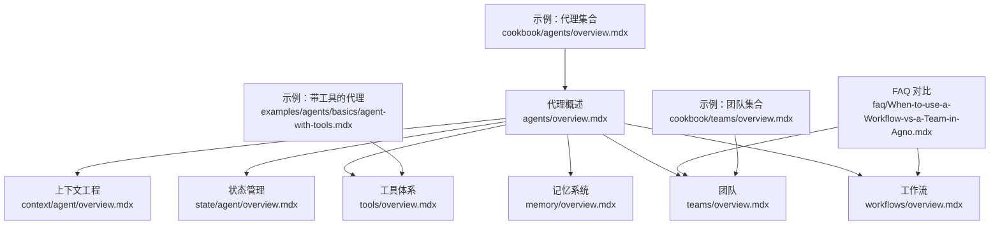
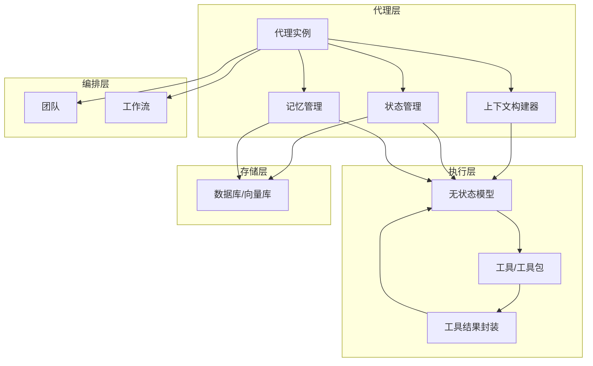
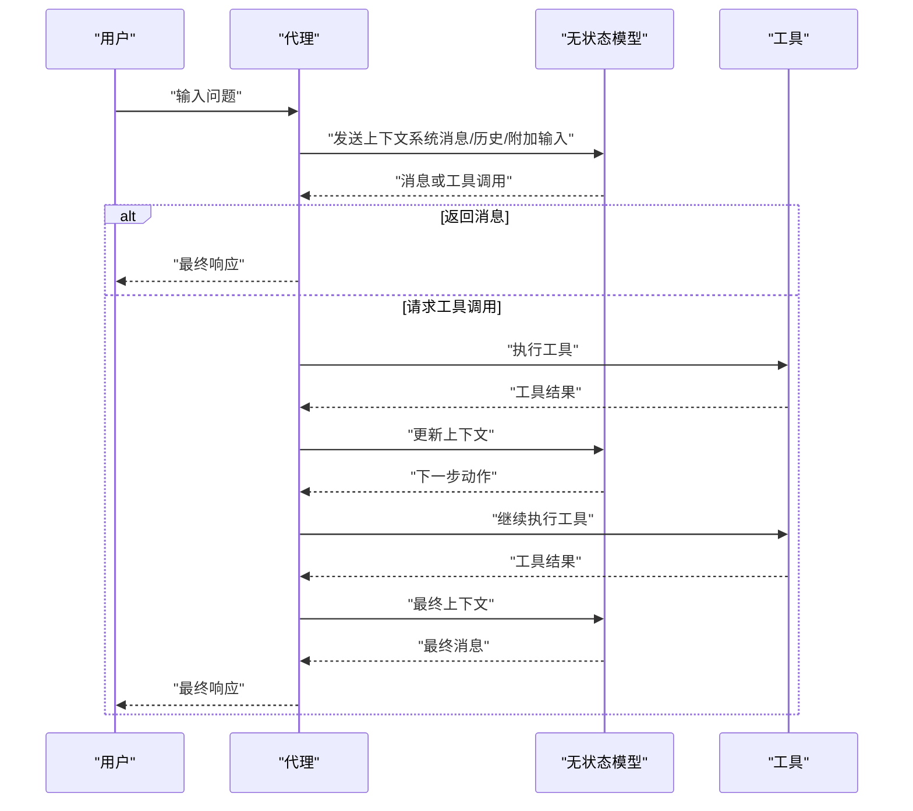
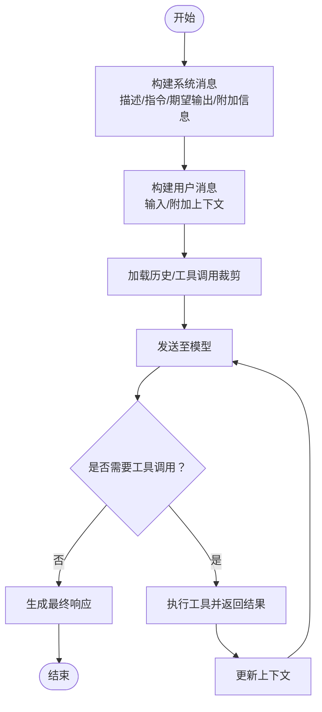
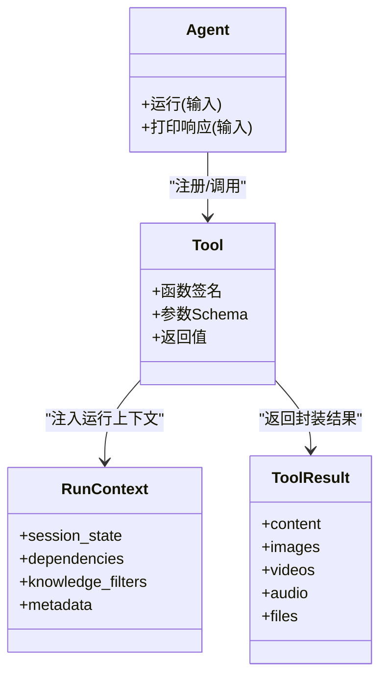
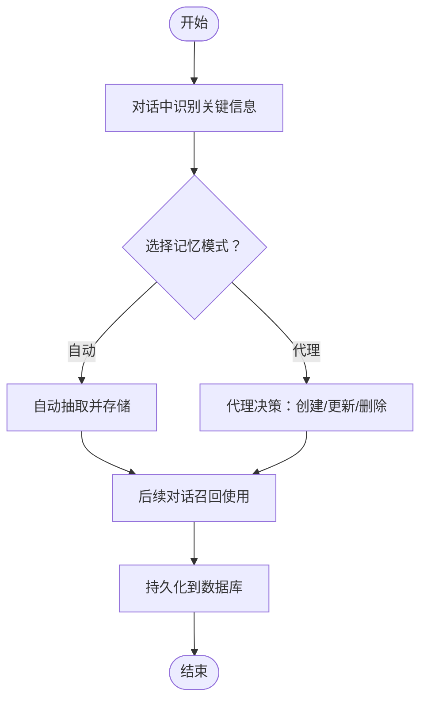
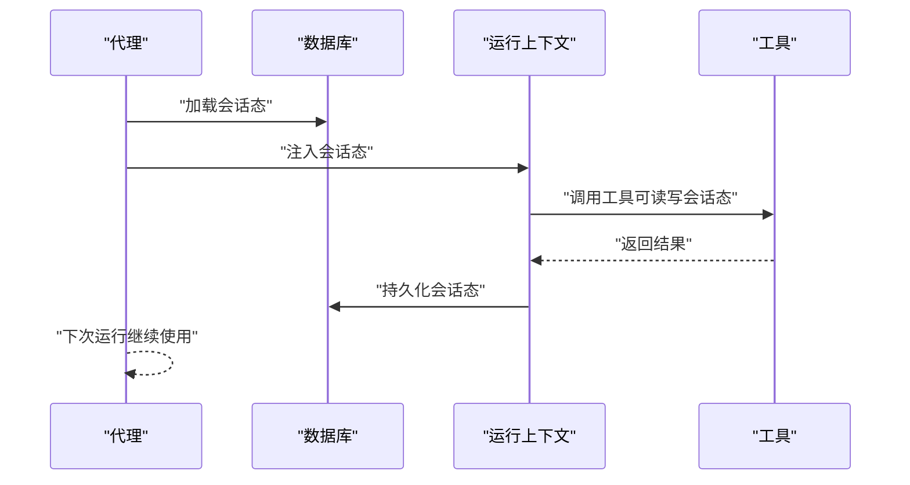
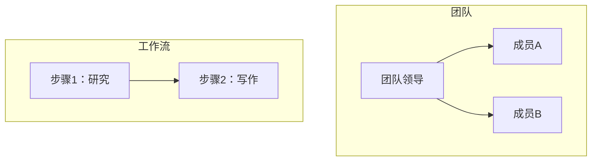
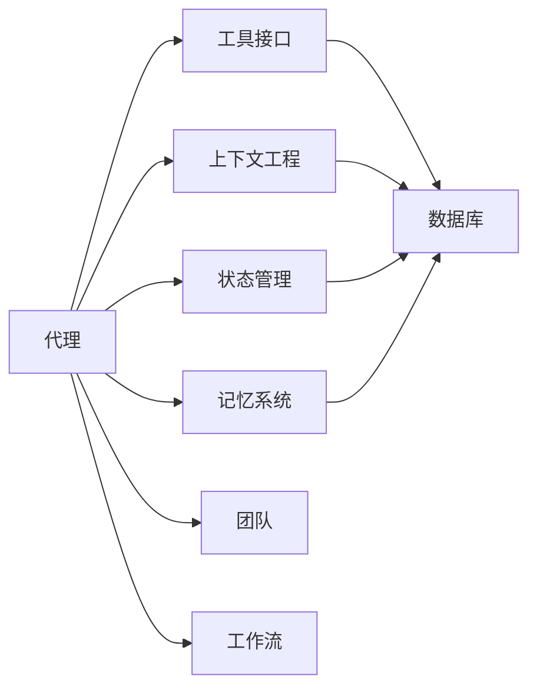

# 代理基础概念

<cite>
**本文引用的文件**
- [agents/overview.mdx](file://agents/overview.mdx)
- [context/agent/overview.mdx](file://context/agent/overview.mdx)
- [state/agent/overview.mdx](file://state/agent/overview.mdx)
- [tools/overview.mdx](file://tools/overview.mdx)
- [memory/overview.mdx](file://memory/overview.mdx)
- [teams/overview.mdx](file://teams/overview.mdx)
- [workflows/overview.mdx](file://workflows/overview.mdx)
- [faq/When-to-use-a-Workflow-vs-a-Team-in-Agno.mdx](file://faq/When-to-use-a-Workflow-vs-a-Team-in-Agno.mdx)
- [examples/agents/basics/agent-with-tools.mdx](file://examples/agents/basics/agent-with-tools.mdx)
- [cookbook/agents/overview.mdx](file://cookbook/agents/overview.mdx)
- [cookbook/teams/overview.mdx](file://cookbook/teams/overview.mdx)
</cite>

## 目录
1. [引言](#引言)
2. [项目结构](#项目结构)
3. [核心组件](#核心组件)
4. [架构总览](#架构总览)
5. [详细组件分析](#详细组件分析)
6. [依赖关系分析](#依赖关系分析)
7. [性能考量](#性能考量)
8. [故障排查指南](#故障排查指南)
9. [结论](#结论)
10. [附录](#附录)

## 引言
本篇文档围绕“代理（Agent）”的基础概念展开，面向开发者系统性阐述代理的定义、核心特性及其在智能系统架构中的定位；重点解析代理的状态化控制循环机制，说明其与“无状态模型”的关系、推理与工具调用的循环过程；并系统化地文档化代理的基本组成要素（指令系统、工具接口、记忆机制等），解释代理与团队、工作流的关系与协作模式；最后给出可操作的应用场景与使用案例，帮助开发者建立对代理系统的整体认知。

## 项目结构
该仓库以知识库形式组织了大量关于代理、团队、工作流、工具、记忆、状态、上下文工程等内容的文档与示例。与“代理基础概念”最相关的模块包括：
- 代理概述：定义与定位、与团队/工作流的关系
- 上下文工程：系统消息、用户消息、历史、附加输入、缓存
- 状态管理：会话态、运行态、持久化与注入
- 工具体系：函数式工具、工具包、并发执行、结果封装
- 记忆系统：自动记忆、代理记忆、存储与数据模型
- 团队与工作流：协作模式、编排方式、适用场景对比

**图表来源**
- [agents/overview.mdx:1-48](file://agents/overview.mdx#L1-L48)
- [context/agent/overview.mdx:1-523](file://context/agent/overview.mdx#L1-L523)
- [state/agent/overview.mdx:1-306](file://state/agent/overview.mdx#L1-L306)
- [tools/overview.mdx:1-566](file://tools/overview.mdx#L1-L566)
- [memory/overview.mdx:1-202](file://memory/overview.mdx#L1-L202)
- [teams/overview.mdx:1-135](file://teams/overview.mdx#L1-L135)
- [workflows/overview.mdx:1-102](file://workflows/overview.mdx#L1-L102)
- [faq/When-to-use-a-Workflow-vs-a-Team-in-Agno.mdx:1-43](file://faq/When-to-use-a-Workflow-vs-a-Team-in-Agno.mdx#L1-L43)
- [examples/agents/basics/agent-with-tools.mdx:1-43](file://examples/agents/basics/agent-with-tools.mdx#L1-L43)
- [cookbook/agents/overview.mdx:1-85](file://cookbook/agents/overview.mdx#L1-L85)
- [cookbook/teams/overview.mdx:1-58](file://cookbook/teams/overview.mdx#L1-L58)

**章节来源**
- [agents/overview.mdx:1-48](file://agents/overview.mdx#L1-L48)
- [faq/When-to-use-a-Workflow-vs-a-Team-in-Agno.mdx:1-43](file://faq/When-to-use-a-Workflow-vs-a-Team-in-Agno.mdx#L1-L43)

## 核心组件
- 定义与定位
  - 代理是“围绕无状态模型的状态化控制循环”，模型在指令引导下进行推理并调用工具，形成循环，直至生成最终响应。可按需叠加记忆、知识、存储、人机交互与守卫护栏。
- 基本组成要素
  - 指令系统：描述、任务指令、期望输出、附加信息、时间/地点/名称等上下文注入
  - 工具接口：函数式工具、工具包、并发执行、结果封装（含媒体）
  - 记忆机制：自动记忆与代理记忆两种路径，支持数据库持久化与检索
  - 状态管理：会话态、运行态、持久化与注入（通过运行上下文）
  - 上下文工程：系统消息、用户消息、历史、附加输入、缓存策略
- 协作与编排
  - 团队：多代理协同、分工与协调、模式化编排
  - 工作流：步骤化编排、顺序/并行/条件/循环、可预测的流水线

**章节来源**
- [agents/overview.mdx:7-8](file://agents/overview.mdx#L7-L8)
- [context/agent/overview.mdx:11-90](file://context/agent/overview.mdx#L11-L90)
- [tools/overview.mdx:12-175](file://tools/overview.mdx#L12-L175)
- [memory/overview.mdx:10-92](file://memory/overview.mdx#L10-L92)
- [state/agent/overview.mdx:16-34](file://state/agent/overview.mdx#L16-L34)
- [teams/overview.mdx:7-100](file://teams/overview.mdx#L7-L100)
- [workflows/overview.mdx:7-70](file://workflows/overview.mdx#L7-L70)

## 架构总览
从“代理—工具—上下文—状态—记忆—团队/工作流”的视角，构建一个端到端的智能系统架构视图：

**图表来源**
- [agents/overview.mdx:7-8](file://agents/overview.mdx#L7-L8)
- [context/agent/overview.mdx:92-170](file://context/agent/overview.mdx#L92-L170)
- [state/agent/overview.mdx:25-34](file://state/agent/overview.mdx#L25-L34)
- [tools/overview.mdx:50-175](file://tools/overview.mdx#L50-L175)
- [memory/overview.mdx:38-92](file://memory/overview.mdx#L38-L92)
- [teams/overview.mdx:7-100](file://teams/overview.mdx#L7-L100)
- [workflows/overview.mdx:7-70](file://workflows/overview.mdx#L7-L70)

## 详细组件分析

### 代理的控制循环与“无状态模型”的关系
- 控制循环
  - 代理以“系统消息 + 用户消息 + 历史 + 附加输入”作为上下文，交给无状态模型推理
  - 模型可能直接返回最终消息，也可能请求工具调用
  - 当请求工具调用时，代理执行工具并将结果回传给模型，重复此循环直到模型不再请求工具或达到终止条件
- 与“无状态模型”的关系
  - 代理本身不持有“工作态”，而是通过会话态、运行态与持久化存储实现“状态化行为”
  - 代理实例在内存中保持稳定，实际状态由数据库与运行上下文驱动

**图表来源**
- [agents/overview.mdx:7-8](file://agents/overview.mdx#L7-L8)
- [tools/overview.mdx:50-58](file://tools/overview.mdx#L50-L58)

**章节来源**
- [agents/overview.mdx:7-8](file://agents/overview.mdx#L7-L8)
- [tools/overview.mdx:50-58](file://tools/overview.mdx#L50-L58)

### 指令系统与上下文工程
- 系统消息构成
  - 描述、任务指令、期望输出、附加信息（如 Markdown、时间、地点、名称、会话摘要、记忆、会话态、知识过滤等）
  - 可手动覆盖系统消息或禁用上下文构建
- 用户消息与附加上下文
  - 用户输入作为用户消息；可注入知识、依赖项等
- 历史与工具调用裁剪
  - 支持仅保留最近若干次工具调用，控制上下文长度与成本
- 缓存策略
  - 将静态内容置于系统消息前部，结合模型提供商的提示缓存能力减少令牌消耗

**图表来源**
- [context/agent/overview.mdx:17-90](file://context/agent/overview.mdx#L17-L90)
- [context/agent/overview.mdx:320-402](file://context/agent/overview.mdx#L320-L402)

**章节来源**
- [context/agent/overview.mdx:17-90](file://context/agent/overview.mdx#L17-L90)
- [context/agent/overview.mdx:320-402](file://context/agent/overview.mdx#L320-L402)

### 工具接口与并发执行
- 工具定义与执行
  - 函数签名自动转换为工具定义（JSON Schema），模型据此调用
  - 支持并发执行多个工具调用，显著降低长耗时任务的总延迟
- 工具包与内置参数
  - 工具包统一管理多工具；内置参数可访问运行上下文、会话态、依赖、知识过滤、元数据等
- 结果封装
  - 简单类型直接返回；媒体类需使用结果封装类型

**图表来源**
- [tools/overview.mdx:50-175](file://tools/overview.mdx#L50-L175)
- [tools/overview.mdx:267-351](file://tools/overview.mdx#L267-L351)

**章节来源**
- [tools/overview.mdx:50-175](file://tools/overview.mdx#L50-L175)
- [tools/overview.mdx:267-351](file://tools/overview.mdx#L267-L351)

### 记忆机制
- 自动记忆 vs 代理记忆
  - 自动记忆：每次运行后自动抽取并存储/召回
  - 代理记忆：通过内置工具让代理自主决定何时创建/更新/删除记忆
- 存储与数据模型
  - 默认表名，支持自定义；字段包含记忆内容、主题、输入、用户/代理/团队标识、更新时间等
- 使用建议
  - 避免同时启用两者；二者互斥，后者优先

**图表来源**
- [memory/overview.mdx:38-92](file://memory/overview.mdx#L38-L92)
- [memory/overview.mdx:148-165](file://memory/overview.mdx#L148-L165)

**章节来源**
- [memory/overview.mdx:38-92](file://memory/overview.mdx#L38-L92)
- [memory/overview.mdx:148-165](file://memory/overview.mdx#L148-L165)

### 状态化控制循环与运行上下文
- 会话态
  - 代理不直接维护内存态；通过数据库加载/保存会话态；可在系统消息中引用
  - 支持自动更新会话态（代理态）
- 运行态
  - 工具可通过运行上下文读写会话态，实现跨轮次的数据共享与持久化
- 跨成员共享
  - 在团队中，会话态在成员间共享

**图表来源**
- [state/agent/overview.mdx:16-34](file://state/agent/overview.mdx#L16-L34)
- [state/agent/overview.mdx:172-198](file://state/agent/overview.mdx#L172-L198)

**章节来源**
- [state/agent/overview.mdx:16-34](file://state/agent/overview.mdx#L16-L34)
- [state/agent/overview.mdx:172-198](file://state/agent/overview.mdx#L172-L198)

### 代理与团队、工作流的关系与协作模式
- 团队
  - 多代理协同，分配任务，支持广播、路由、协调等模式；可嵌套子团队
- 工作流
  - 步骤化编排，顺序/并行/条件/循环，适合可预测的流水线
- 何时选择
  - 工作流：需要可重复、可审计、有明确输入输出的流程
  - 团队：需要灵活协作、动态决策与多工具组合

**图表来源**
- [teams/overview.mdx:7-100](file://teams/overview.mdx#L7-L100)
- [workflows/overview.mdx:7-70](file://workflows/overview.mdx#L7-L70)
- [faq/When-to-use-a-Workflow-vs-a-Team-in-Agno.mdx:10-43](file://faq/When-to-use-a-Workflow-vs-a-Team-in-Agno.mdx#L10-L43)

**章节来源**
- [teams/overview.mdx:7-100](file://teams/overview.mdx#L7-L100)
- [workflows/overview.mdx:7-70](file://workflows/overview.mdx#L7-L70)
- [faq/When-to-use-a-Workflow-vs-a-Team-in-Agno.mdx:10-43](file://faq/When-to-use-a-Workflow-vs-a-Team-in-Agno.mdx#L10-L43)

## 依赖关系分析
- 组件耦合
  - 代理与上下文工程、状态管理、记忆系统强耦合，共同决定“状态化控制循环”的行为
  - 工具接口独立于代理主体，通过运行上下文解耦
  - 团队与工作流对代理/团队/函数进行编排，关注点分离
- 外部依赖
  - 数据库用于持久化会话态与记忆
  - 模型提供商的提示缓存能力用于优化上下文长度与成本

**图表来源**
- [context/agent/overview.mdx:502-516](file://context/agent/overview.mdx#L502-L516)
- [state/agent/overview.mdx:14-23](file://state/agent/overview.mdx#L14-L23)
- [memory/overview.mdx:94-98](file://memory/overview.mdx#L94-L98)
- [teams/overview.mdx:68-77](file://teams/overview.mdx#L68-L77)
- [workflows/overview.mdx:58-68](file://workflows/overview.mdx#L58-L68)

**章节来源**
- [context/agent/overview.mdx:502-516](file://context/agent/overview.mdx#L502-L516)
- [state/agent/overview.mdx:14-23](file://state/agent/overview.mdx#L14-L23)
- [memory/overview.mdx:94-98](file://memory/overview.mdx#L94-L98)
- [teams/overview.mdx:68-77](file://teams/overview.mdx#L68-L77)
- [workflows/overview.mdx:58-68](file://workflows/overview.mdx#L58-L68)

## 性能考量
- 上下文长度与成本
  - 利用“仅保留最近N次工具调用”与“提示缓存”策略，减少令牌消耗
- 并发工具执行
  - 模型支持并行函数调用时，工具并发执行可显著缩短总时延
- 存储与索引
  - 合理选择数据库与向量库，配合分页/过滤与索引，提升检索效率

[本节为通用指导，无需特定文件引用]

## 故障排查指南
- 工具未被调用
  - 检查工具定义是否正确、模型是否支持并行工具调用、是否遗漏必要的参数注释
- 工具结果未被模型理解
  - 使用结果封装类型返回媒体类结果；确保返回值类型与签名一致
- 记忆未生效
  - 确认已启用自动记忆或代理记忆之一；检查数据库连接与表名配置
- 会话态未持久化
  - 确保已配置数据库；确认会话ID与用户ID一致；检查覆盖策略设置
- 上下文过长导致失败
  - 启用“仅保留最近N次工具调用”；减少附加输入；开启提示缓存

**章节来源**
- [tools/overview.mdx:156-175](file://tools/overview.mdx#L156-L175)
- [memory/overview.mdx:90-92](file://memory/overview.mdx#L90-L92)
- [state/agent/overview.mdx:260-300](file://state/agent/overview.mdx#L260-L300)
- [context/agent/overview.mdx:357-402](file://context/agent/overview.mdx#L357-L402)

## 结论
代理以“无状态模型 + 状态化控制循环”为核心，通过指令系统、工具接口、记忆机制、状态管理与上下文工程，实现可扩展、可调试、可编排的智能体系统。团队与工作流分别满足“灵活协作”与“可预测流水线”的两类需求。开发者应优先掌握上下文工程与状态管理，再逐步引入工具与记忆，最终以团队/工作流实现复杂任务的规模化落地。

[本节为总结性内容，无需特定文件引用]

## 附录

### 实际应用场景与使用案例
- 带工具的代理
  - 示例展示了如何为代理添加工具并执行搜索任务
  - 参考路径：[示例：带工具的代理:1-43](file://examples/agents/basics/agent-with-tools.mdx#L1-L43)
- 生产级代理集合
  - 知识检索、多工具编排、结构化输出、多模态处理等实战案例
  - 参考路径：[代理集合示例:1-85](file://cookbook/agents/overview.mdx#L1-L85)
- 团队集合示例
  - 内容管线、新闻编辑、智能路由等团队协作案例
  - 参考路径：[团队集合示例:1-58](file://cookbook/teams/overview.mdx#L1-L58)

**章节来源**
- [examples/agents/basics/agent-with-tools.mdx:1-43](file://examples/agents/basics/agent-with-tools.mdx#L1-L43)
- [cookbook/agents/overview.mdx:1-85](file://cookbook/agents/overview.mdx#L1-L85)
- [cookbook/teams/overview.mdx:1-58](file://cookbook/teams/overview.mdx#L1-L58)