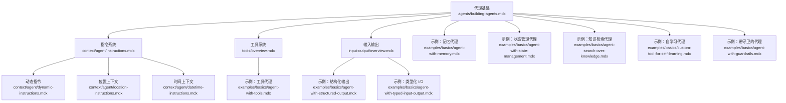
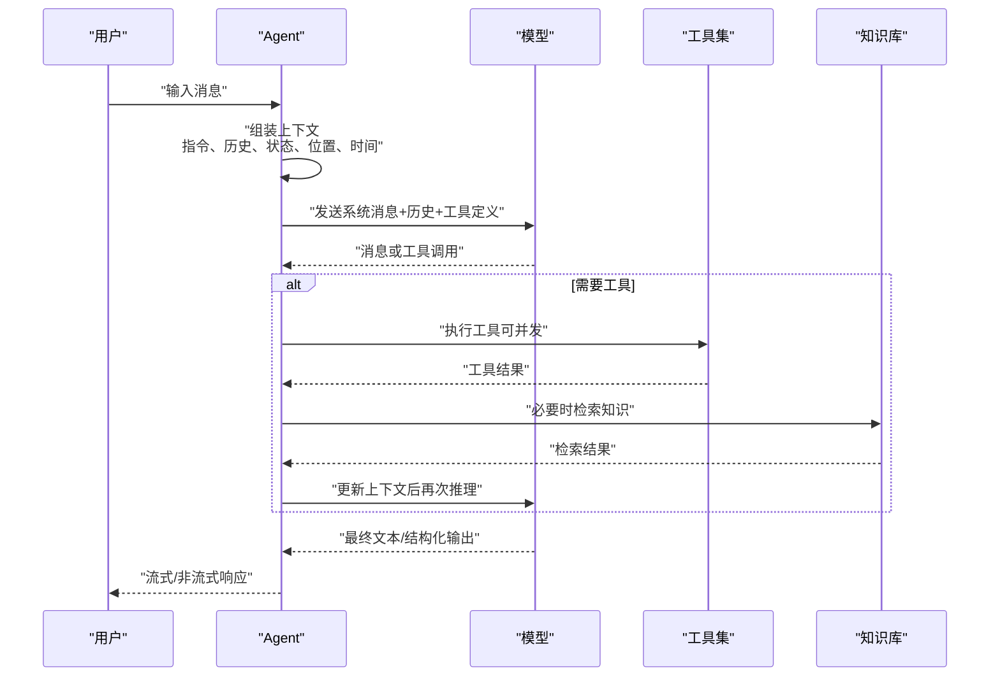
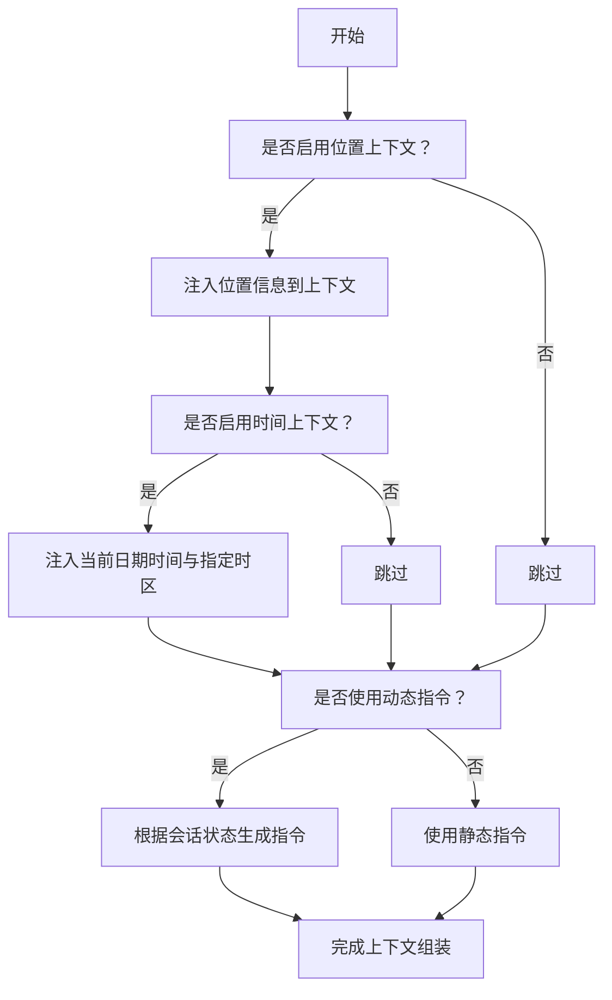
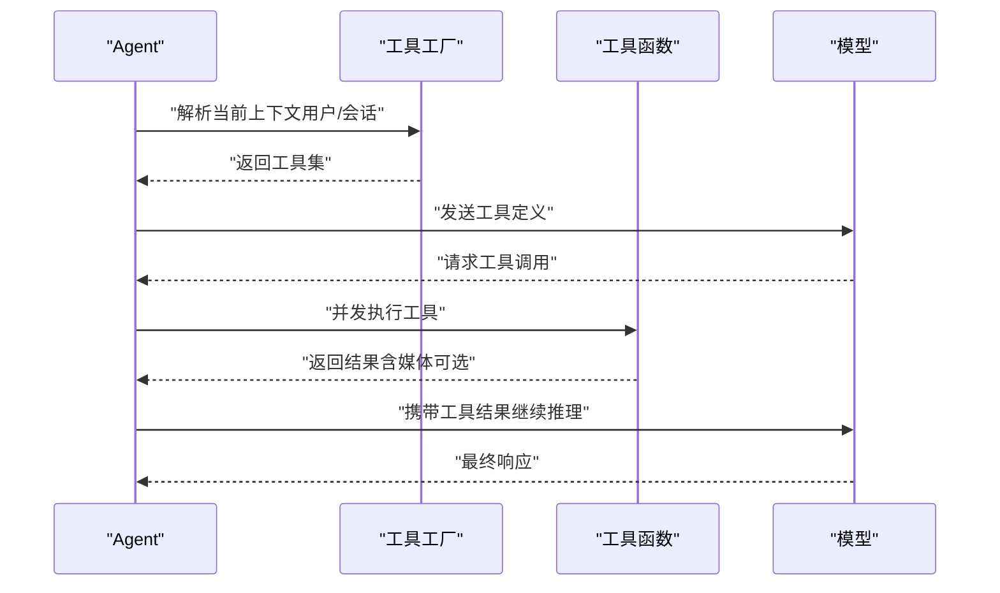
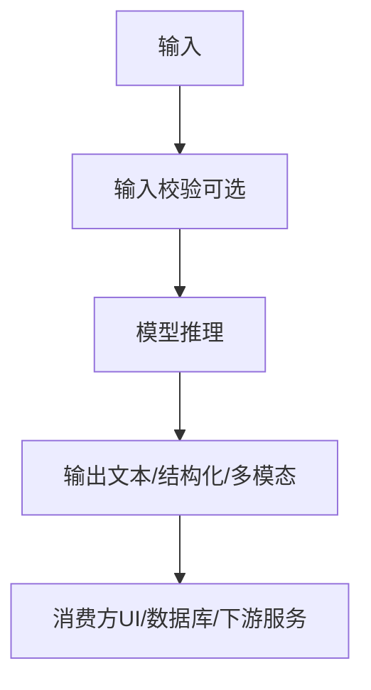
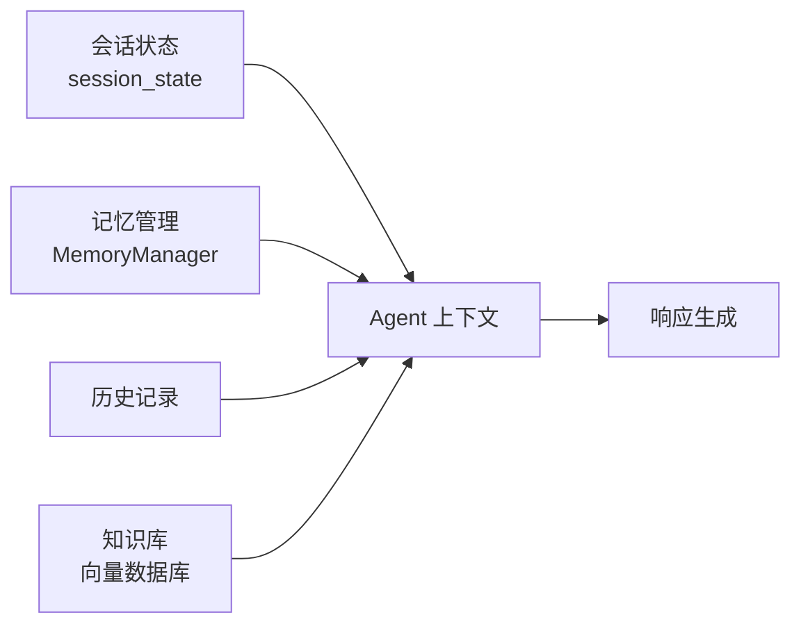
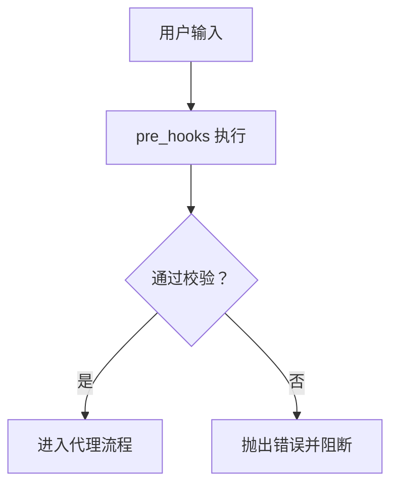
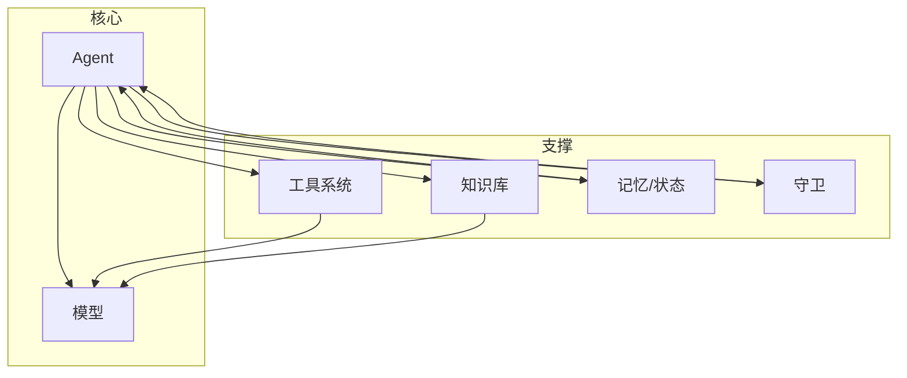

# 代理构建指南

<cite>
**本文引用的文件**
- [agents/building-agents.mdx](file://agents/building-agents.mdx)
- [context/agent/instructions.mdx](file://context/agent/instructions.mdx)
- [context/agent/dynamic-instructions.mdx](file://context/agent/dynamic-instructions.mdx)
- [context/agent/location-instructions.mdx](file://context/agent/location-instructions.mdx)
- [context/agent/datetime-instructions.mdx](file://context/agent/datetime-instructions.mdx)
- [tools/overview.mdx](file://tools/overview.mdx)
- [input-output/overview.mdx](file://input-output/overview.mdx)
- [examples/basics/overview.mdx](file://examples/basics/overview.mdx)
- [examples/basics/agent-with-tools.mdx](file://examples/basics/agent-with-tools.mdx)
- [examples/basics/agent-with-structured-output.mdx](file://examples/basics/agent-with-structured-output.mdx)
- [examples/basics/agent-with-typed-input-output.mdx](file://examples/basics/agent-with-typed-input-output.mdx)
- [examples/basics/agent-with-memory.mdx](file://examples/basics/agent-with-memory.mdx)
- [examples/basics/agent-with-state-management.mdx](file://examples/basics/agent-with-state-management.mdx)
- [examples/basics/agent-search-over-knowledge.mdx](file://examples/basics/agent-search-over-knowledge.mdx)
- [examples/basics/custom-tool-for-self-learning.mdx](file://examples/basics/custom-tool-for-self-learning.mdx)
- [examples/basics/agent-with-guardrails.mdx](file://examples/basics/agent-with-guardrails.mdx)
</cite>

## 目录
1. 引言
2. 项目结构
3. 核心组件
4. 架构总览
5. 详细组件分析
6. 依赖关系分析
7. 性能考量
8. 故障排查指南
9. 结论
10. 附录

## 引言
本指南面向希望在 Agno 框架中从零开始构建与配置智能体（Agent）的开发者。内容覆盖代理定义、初始化参数与配置选项，核心组件（指令系统、工具集成、输入输出格式），构建模式（静态指令、动态指令、位置与时序上下文集成），以及多种典型代理的构建示例与最佳实践。通过循序渐进的示例与清晰的架构说明，帮助你快速上手并高效迭代。

## 项目结构
围绕“代理构建”的关键知识分布在以下主题域：
- 代理基础与运行：agents/building-agents.mdx
- 指令工程：context/agent/*.mdx（静态、动态、位置、时间）
- 工具系统：tools/overview.mdx
- 输入输出：input-output/overview.mdx
- 示例集合：examples/basics/*.mdx（工具、结构化输出、类型化 I/O、记忆、状态、知识检索、自学习、守卫）

图表来源
- [agents/building-agents.mdx](file://agents/building-agents.mdx)
- [context/agent/instructions.mdx](file://context/agent/instructions.mdx)
- [context/agent/dynamic-instructions.mdx](file://context/agent/dynamic-instructions.mdx)
- [context/agent/location-instructions.mdx](file://context/agent/location-instructions.mdx)
- [context/agent/datetime-instructions.mdx](file://context/agent/datetime-instructions.mdx)
- [tools/overview.mdx](file://tools/overview.mdx)
- [input-output/overview.mdx](file://input-output/overview.mdx)
- [examples/basics/agent-with-tools.mdx](file://examples/basics/agent-with-tools.mdx)
- [examples/basics/agent-with-structured-output.mdx](file://examples/basics/agent-with-structured-output.mdx)
- [examples/basics/agent-with-typed-input-output.mdx](file://examples/basics/agent-with-typed-input-output.mdx)
- [examples/basics/agent-with-memory.mdx](file://examples/basics/agent-with-memory.mdx)
- [examples/basics/agent-with-state-management.mdx](file://examples/basics/agent-with-state-management.mdx)
- [examples/basics/agent-search-over-knowledge.mdx](file://examples/basics/agent-search-over-knowledge.mdx)
- [examples/basics/custom-tool-for-self-learning.mdx](file://examples/basics/custom-tool-for-self-learning.mdx)
- [examples/basics/agent-with-guardrails.mdx](file://examples/basics/agent-with-guardrails.mdx)

章节来源
- [agents/building-agents.mdx](file://agents/building-agents.mdx)
- [examples/basics/overview.mdx](file://examples/basics/overview.mdx)

## 核心组件
- 代理定义与运行
  - 使用模型、工具与指令创建 Agent，并支持开发期 print_response 与生产期 run/arun 流式输出。
  - 参考：[agents/building-agents.mdx](file://agents/building-agents.mdx)
- 指令系统
  - 静态指令：直接传入字符串或列表，指导行为风格与故事性。
  - 动态指令：基于会话状态与用户上下文动态生成，实现个性化响应。
  - 位置与时序上下文：自动注入地理位置与当前日期时间，增强本地化与时效性。
  - 参考：
    - [context/agent/instructions.mdx](file://context/agent/instructions.mdx)
    - [context/agent/dynamic-instructions.mdx](file://context/agent/dynamic-instructions.mdx)
    - [context/agent/location-instructions.mdx](file://context/agent/location-instructions.mdx)
    - [context/agent/datetime-instructions.mdx](file://context/agent/datetime-instructions.mdx)
- 工具集成
  - 函数即工具：通过装饰器或直接传参注册工具；支持并发执行与媒体结果封装。
  - 工具工厂：按用户/会话动态装配工具集，结合缓存优化性能。
  - 参考：[tools/overview.mdx](file://tools/overview.mdx)
- 输入输出格式
  - 字符串 I/O：最简范式，适合原型与聊天界面。
  - 结构化 I/O：使用 Pydantic 模型定义输入/输出，确保数据形状与约束一致。
  - 多模态 I/O：支持图片、音频、视频、文件等输入。
  - 参考：[input-output/overview.mdx](file://input-output/overview.mdx)

章节来源
- [agents/building-agents.mdx](file://agents/building-agents.mdx)
- [context/agent/instructions.mdx](file://context/agent/instructions.mdx)
- [context/agent/dynamic-instructions.mdx](file://context/agent/dynamic-instructions.mdx)
- [context/agent/location-instructions.mdx](file://context/agent/location-instructions.mdx)
- [context/agent/datetime-instructions.mdx](file://context/agent/datetime-instructions.mdx)
- [tools/overview.mdx](file://tools/overview.mdx)
- [input-output/overview.mdx](file://input-output/overview.mdx)

## 架构总览
下图展示了从“请求输入”到“工具调用与模型推理”的典型执行链路，以及上下文扩展点（位置、时间、历史、状态、知识）对最终响应的影响。

图表来源
- [tools/overview.mdx](file://tools/overview.mdx)
- [input-output/overview.mdx](file://input-output/overview.mdx)
- [context/agent/location-instructions.mdx](file://context/agent/location-instructions.mdx)
- [context/agent/datetime-instructions.mdx](file://context/agent/datetime-instructions.mdx)
- [examples/basics/agent-with-tools.mdx](file://examples/basics/agent-with-tools.mdx)
- [examples/basics/agent-search-over-knowledge.mdx](file://examples/basics/agent-search-over-knowledge.mdx)

## 详细组件分析

### 组件一：指令系统（静态/动态/位置/时间）
- 静态指令
  - 适合固定风格与角色设定，便于快速验证代理行为。
  - 示例路径：[context/agent/instructions.mdx](file://context/agent/instructions.mdx)
- 动态指令
  - 基于 RunContext 的会话状态与用户标识，按需调整提示词，实现个性化。
  - 示例路径：[context/agent/dynamic-instructions.mdx](file://context/agent/dynamic-instructions.mdx)
- 位置上下文
  - 启用 add_location_to_context，使代理具备地理感知能力，结合外部工具进行本地化搜索。
  - 示例路径：[context/agent/location-instructions.mdx](file://context/agent/location-instructions.mdx)
- 时间上下文
  - 启用 add_datetime_to_context 与时区标识，使代理能够回答当前日期时间与跨时区时间。
  - 示例路径：[context/agent/datetime-instructions.mdx](file://context/agent/datetime-instructions.mdx)

图表来源
- [context/agent/location-instructions.mdx](file://context/agent/location-instructions.mdx)
- [context/agent/datetime-instructions.mdx](file://context/agent/datetime-instructions.mdx)
- [context/agent/dynamic-instructions.mdx](file://context/agent/dynamic-instructions.mdx)
- [context/agent/instructions.mdx](file://context/agent/instructions.mdx)

章节来源
- [context/agent/instructions.mdx](file://context/agent/instructions.mdx)
- [context/agent/dynamic-instructions.mdx](file://context/agent/dynamic-instructions.mdx)
- [context/agent/location-instructions.mdx](file://context/agent/location-instructions.mdx)
- [context/agent/datetime-instructions.mdx](file://context/agent/datetime-instructions.mdx)

### 组件二：工具系统（函数即工具、工具工厂、并发执行）
- 工具定义与调用
  - 自动将函数转换为模型可用的工具定义（JSON Schema），支持多工具并发执行。
  - 示例路径：[tools/overview.mdx](file://tools/overview.mdx)
- 工具工厂与动态装配
  - 基于用户/会话维度按需返回工具集，支持缓存以提升性能。
  - 示例路径：[tools/overview.mdx](file://tools/overview.mdx)
- 媒体与复杂结果
  - 使用 ToolResult 返回图像/音视频等媒体产物，确保模型可见。
  - 示例路径：[tools/overview.mdx](file://tools/overview.mdx)

图表来源
- [tools/overview.mdx](file://tools/overview.mdx)

章节来源
- [tools/overview.mdx](file://tools/overview.mdx)

### 组件三：输入输出（字符串/结构化/类型化/多模态）
- 字符串 I/O
  - 最简范式，适合快速原型与对话场景。
  - 示例路径：[input-output/overview.mdx](file://input-output/overview.mdx)
- 结构化输出
  - 使用 Pydantic 模型约束输出，保证字段与取值范围，便于后续处理。
  - 示例路径：[examples/basics/agent-with-structured-output.mdx](file://examples/basics/agent-with-structured-output.mdx)
- 类型化 I/O
  - 同时定义输入/输出模型，端到端类型安全，适合 API 管线。
  - 示例路径：[examples/basics/agent-with-typed-input-output.mdx](file://examples/basics/agent-with-typed-input-output.mdx)
- 多模态 I/O
  - 支持图片、音频、视频、文件等输入，结合媒体参数控制发送与存储。
  - 示例路径：[input-output/overview.mdx](file://input-output/overview.mdx)

图表来源
- [input-output/overview.mdx](file://input-output/overview.mdx)
- [examples/basics/agent-with-structured-output.mdx](file://examples/basics/agent-with-structured-output.mdx)
- [examples/basics/agent-with-typed-input-output.mdx](file://examples/basics/agent-with-typed-input-output.mdx)

章节来源
- [input-output/overview.mdx](file://input-output/overview.mdx)
- [examples/basics/agent-with-structured-output.mdx](file://examples/basics/agent-with-structured-output.mdx)
- [examples/basics/agent-with-typed-input-output.mdx](file://examples/basics/agent-with-typed-input-output.mdx)

### 组件四：上下文与持久化（记忆、状态、历史、知识）
- 记忆（Memory）
  - 通过 MemoryManager 提取并存储用户偏好与事实，跨会话保留。
  - 示例路径：[examples/basics/agent-with-memory.mdx](file://examples/basics/agent-with-memory.mdx)
- 状态（State）
  - 通过 session_state 维护结构化数据（如观察清单），工具可读写。
  - 示例路径：[examples/basics/agent-with-state-management.mdx](file://examples/basics/agent-with-state-management.mdx)
- 历史（History）
  - 将历史对话纳入上下文，提升连贯性与一致性。
  - 示例路径：[examples/basics/agent-with-structured-output.mdx](file://examples/basics/agent-with-structured-output.mdx)
- 知识（Knowledge）
  - 构建可检索的知识库，结合语义与关键词混合搜索，实现“代理式检索”。
  - 示例路径：[examples/basics/agent-search-over-knowledge.mdx](file://examples/basics/agent-search-over-knowledge.mdx)

图表来源
- [examples/basics/agent-with-memory.mdx](file://examples/basics/agent-with-memory.mdx)
- [examples/basics/agent-with-state-management.mdx](file://examples/basics/agent-with-state-management.mdx)
- [examples/basics/agent-search-over-knowledge.mdx](file://examples/basics/agent-search-over-knowledge.mdx)

章节来源
- [examples/basics/agent-with-memory.mdx](file://examples/basics/agent-with-memory.mdx)
- [examples/basics/agent-with-state-management.mdx](file://examples/basics/agent-with-state-management.mdx)
- [examples/basics/agent-search-over-knowledge.mdx](file://examples/basics/agent-search-over-knowledge.mdx)

### 组件五：守卫（Guardrails）
- 内置守卫
  - PII 检测、提示注入检测等，可在预处理阶段拦截风险输入。
- 自定义守卫
  - 继承基类实现检查逻辑，支持同步/异步校验。
- 示例路径：[examples/basics/agent-with-guardrails.mdx](file://examples/basics/agent-with-guardrails.mdx)

图表来源
- [examples/basics/agent-with-guardrails.mdx](file://examples/basics/agent-with-guardrails.mdx)

章节来源
- [examples/basics/agent-with-guardrails.mdx](file://examples/basics/agent-with-guardrails.mdx)

## 依赖关系分析
- 耦合与内聚
  - Agent 对模型、工具、指令、上下文模块具有高内聚；通过统一的运行接口（run/aprint_response）解耦外部系统。
- 外部依赖
  - 工具层依赖模型的并行函数调用能力；知识层依赖向量数据库与嵌入模型；记忆/状态依赖持久化存储。
- 关键依赖链
  - 指令/上下文 → 模型 → 工具/知识 → 输出
  - 守卫 → 输入校验 → 模型/工具

图表来源
- [tools/overview.mdx](file://tools/overview.mdx)
- [examples/basics/agent-search-over-knowledge.mdx](file://examples/basics/agent-search-over-knowledge.mdx)
- [examples/basics/agent-with-memory.mdx](file://examples/basics/agent-with-memory.mdx)
- [examples/basics/agent-with-state-management.mdx](file://examples/basics/agent-with-state-management.mdx)
- [examples/basics/agent-with-guardrails.mdx](file://examples/basics/agent-with-guardrails.mdx)

章节来源
- [tools/overview.mdx](file://tools/overview.mdx)
- [examples/basics/agent-search-over-knowledge.mdx](file://examples/basics/agent-search-over-knowledge.mdx)
- [examples/basics/agent-with-memory.mdx](file://examples/basics/agent-with-memory.mdx)
- [examples/basics/agent-with-state-management.mdx](file://examples/basics/agent-with-state-management.mdx)
- [examples/basics/agent-with-guardrails.mdx](file://examples/basics/agent-with-guardrails.mdx)

## 性能考量
- 并发工具执行
  - 在支持并行函数调用的模型上，异步运行可显著降低总延迟。
- 工具工厂缓存
  - 基于用户/会话键缓存工具集，避免重复装配开销。
- 知识检索优化
  - 混合检索（语义+关键词）与 RRF 排序平衡召回与精度。
- I/O 与序列化
  - 结构化输出减少后处理成本；多模态媒体仅在需要时发送与存储。

## 故障排查指南
- 工具未被调用
  - 检查工具定义是否正确、模型是否支持并行函数调用、提示词是否引导工具使用。
  - 参考：[tools/overview.mdx](file://tools/overview.mdx)
- 输出不符合预期
  - 使用结构化输出模型约束字段与取值范围；必要时增加示例与规则。
  - 参考：[input-output/overview.mdx](file://input-output/overview.mdx)
- 输入被守卫拦截
  - 检查守卫规则与触发条件，确认是否误判；可临时放宽或添加白名单。
  - 参考：[examples/basics/agent-with-guardrails.mdx](file://examples/basics/agent-with-guardrails.mdx)
- 上下文缺失导致偏差
  - 确认是否启用了位置/时间/历史/状态/知识注入。
  - 参考：
    - [context/agent/location-instructions.mdx](file://context/agent/location-instructions.mdx)
    - [context/agent/datetime-instructions.mdx](file://context/agent/datetime-instructions.mdx)
    - [examples/basics/agent-with-structured-output.mdx](file://examples/basics/agent-with-structured-output.mdx)

章节来源
- [tools/overview.mdx](file://tools/overview.mdx)
- [input-output/overview.mdx](file://input-output/overview.mdx)
- [examples/basics/agent-with-guardrails.mdx](file://examples/basics/agent-with-guardrails.mdx)
- [context/agent/location-instructions.mdx](file://context/agent/location-instructions.mdx)
- [context/agent/datetime-instructions.mdx](file://context/agent/datetime-instructions.mdx)
- [examples/basics/agent-with-structured-output.mdx](file://examples/basics/agent-with-structured-output.mdx)

## 结论
通过“模型 + 工具 + 指令”的最小可行组合起步，逐步叠加上下文（位置/时间/历史/状态/记忆/知识）、输入输出约束与守卫机制，即可构建从简单到复杂的智能体系统。建议优先掌握示例中的“工具代理”“结构化输出”“类型化 I/O”，再引入“记忆/状态/知识/守卫”，以获得稳定且可维护的代理能力。

## 附录

### 快速上手清单
- 创建最小代理：选择模型、添加工具、设置指令，使用 print_response 验证。
  - 参考：[agents/building-agents.mdx](file://agents/building-agents.mdx)
- 增强指令：切换为动态指令，按用户/会话个性化。
  - 参考：[context/agent/dynamic-instructions.mdx](file://context/agent/dynamic-instructions.mdx)
- 注入上下文：开启位置与时序上下文，提升本地化与时效性。
  - 参考：
    - [context/agent/location-instructions.mdx](file://context/agent/location-instructions.mdx)
    - [context/agent/datetime-instructions.mdx](file://context/agent/datetime-instructions.mdx)
- 结构化输出：定义 Pydantic 模型，确保稳定的数据契约。
  - 参考：[examples/basics/agent-with-structured-output.mdx](file://examples/basics/agent-with-structured-output.mdx)
- 类型化 I/O：同时约束输入与输出，适配 API 管线。
  - 参考：[examples/basics/agent-with-typed-input-output.mdx](file://examples/basics/agent-with-typed-input-output.mdx)
- 记忆与状态：跨会话保留用户偏好与结构化状态。
  - 参考：
    - [examples/basics/agent-with-memory.mdx](file://examples/basics/agent-with-memory.mdx)
    - [examples/basics/agent-with-state-management.mdx](file://examples/basics/agent-with-state-management.mdx)
- 知识检索：构建可检索的知识库，实现代理式问答。
  - 参考：[examples/basics/agent-search-over-knowledge.mdx](file://examples/basics/agent-search-over-knowledge.mdx)
- 自学习工具：将洞察保存到知识库，形成闭环学习。
  - 参考：[examples/basics/custom-tool-for-self-learning.mdx](file://examples/basics/custom-tool-for-self-learning.mdx)
- 守卫策略：在入口处拦截风险输入，保障安全。
  - 参考：[examples/basics/agent-with-guardrails.mdx](file://examples/basics/agent-with-guardrails.mdx)

章节来源
- [agents/building-agents.mdx](file://agents/building-agents.mdx)
- [context/agent/dynamic-instructions.mdx](file://context/agent/dynamic-instructions.mdx)
- [context/agent/location-instructions.mdx](file://context/agent/location-instructions.mdx)
- [context/agent/datetime-instructions.mdx](file://context/agent/datetime-instructions.mdx)
- [examples/basics/agent-with-structured-output.mdx](file://examples/basics/agent-with-structured-output.mdx)
- [examples/basics/agent-with-typed-input-output.mdx](file://examples/basics/agent-with-typed-input-output.mdx)
- [examples/basics/agent-with-memory.mdx](file://examples/basics/agent-with-memory.mdx)
- [examples/basics/agent-with-state-management.mdx](file://examples/basics/agent-with-state-management.mdx)
- [examples/basics/agent-search-over-knowledge.mdx](file://examples/basics/agent-search-over-knowledge.mdx)
- [examples/basics/custom-tool-for-self-learning.mdx](file://examples/basics/custom-tool-for-self-learning.mdx)
- [examples/basics/agent-with-guardrails.mdx](file://examples/basics/agent-with-guardrails.mdx)