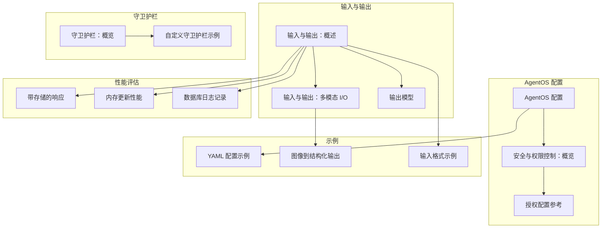
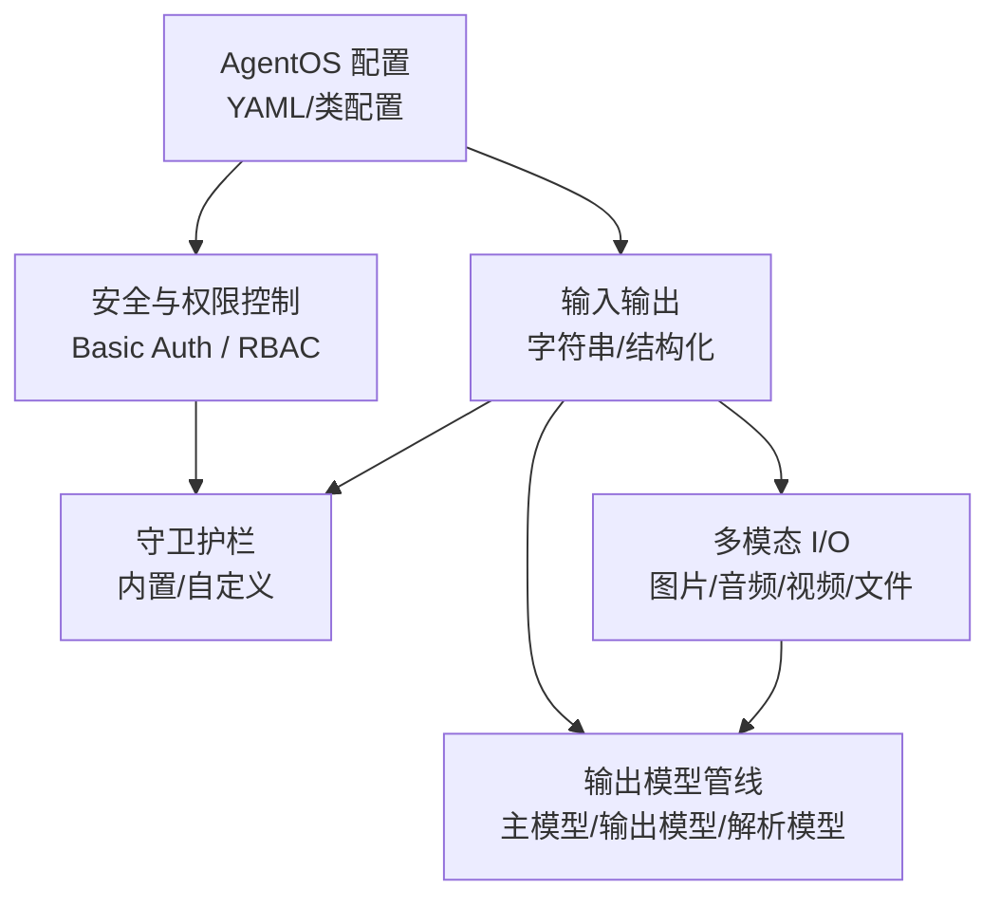
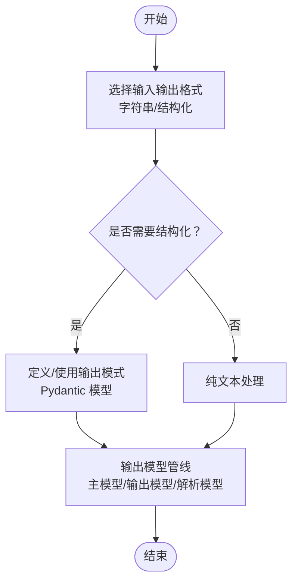
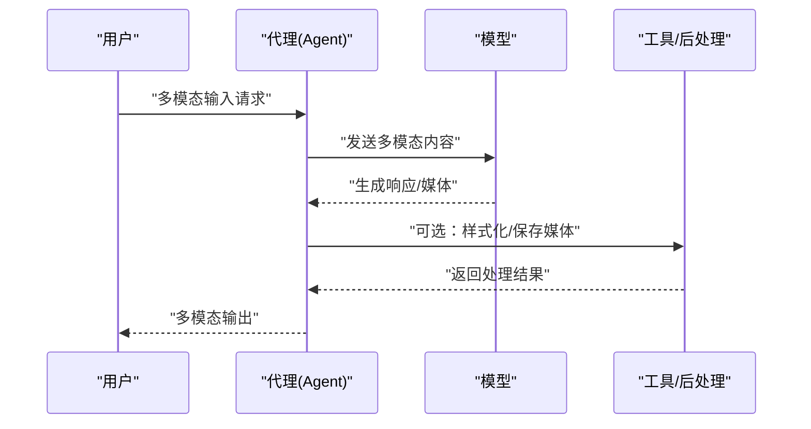
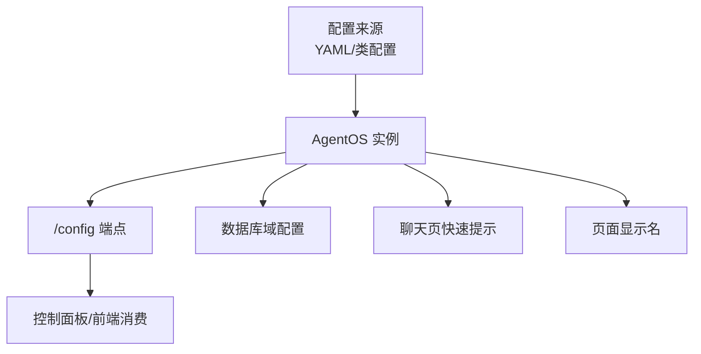
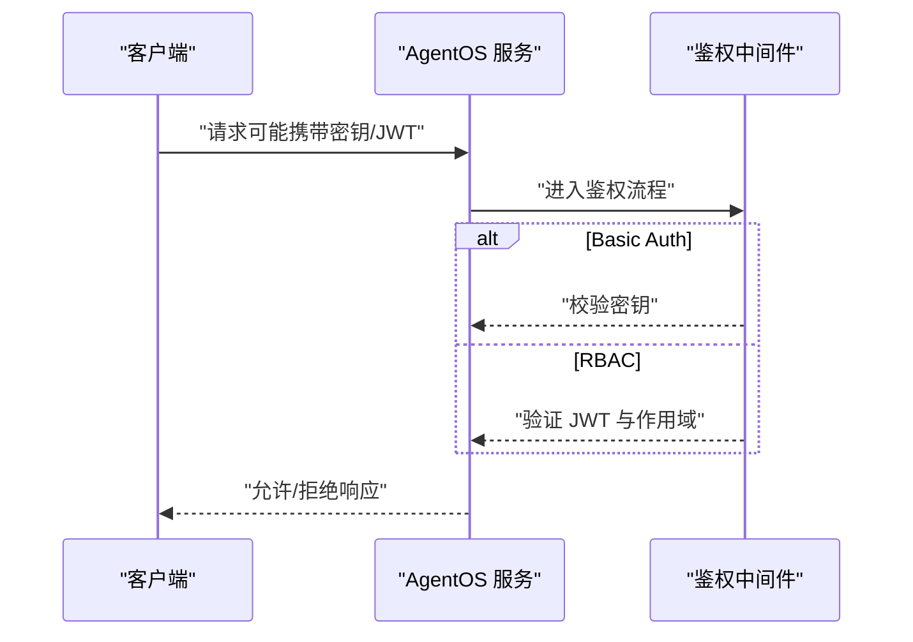
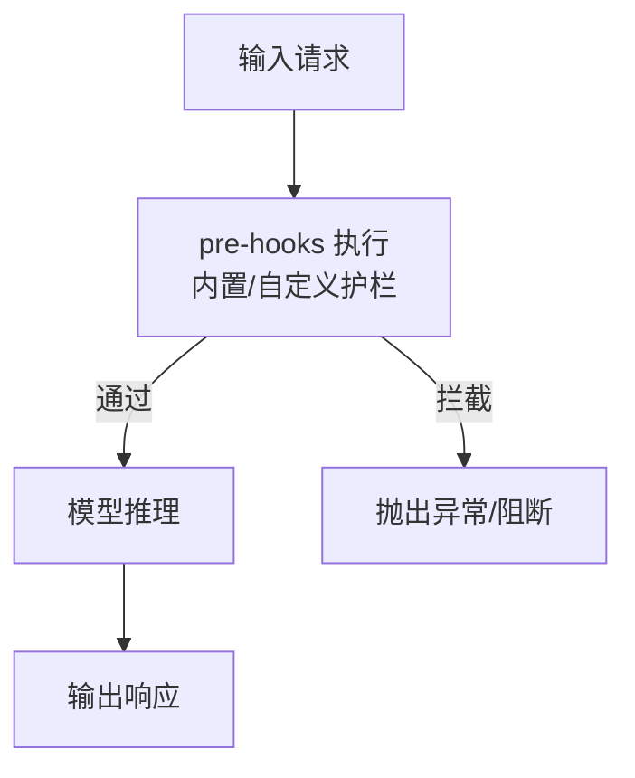
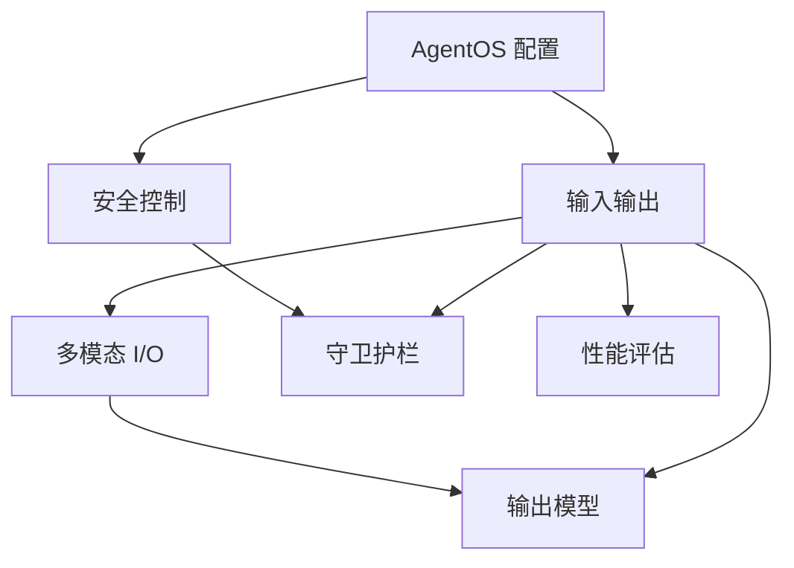

# 代理配置

<cite>
**本文引用的文件**
- [输入与输出：概述](file://input-output/overview.mdx)
- [输入与输出：多模态 I/O](file://input-output/multimodal.mdx)
- [输出模型](file://input-output/output-model.mdx)
- [AgentOS 配置](file://agent-os/config.mdx)
- [安全与权限控制：概览](file://agent-os/security/overview.mdx)
- [授权配置参考](file://reference/agent-os/authorization-config.mdx)
- [守卫护栏：概览](file://guardrails/overview.mdx)
- [自定义守卫护栏示例](file://examples/agents/guardrails/custom-guardrail.mdx)
- [YAML 配置示例](file://examples/agent-os/os-config/yaml-config.mdx)
- [性能评估：带存储的响应](file://examples/evals/performance/response-with-storage.mdx)
- [性能评估：内存更新性能](file://examples/evals/performance/response-with-memory-updates.mdx)
- [性能评估：数据库日志记录](file://examples/evals/performance/db-logging.mdx)
- [多模态：图像到结构化输出](file://examples/agents/multimodal/image-to-structured-output.mdx)
- [输入格式示例](file://examples/agents/input-output/input-formats.mdx)
</cite>

## 目录
1. [简介](#简介)
2. [项目结构](#项目结构)
3. [核心组件](#核心组件)
4. [架构总览](#架构总览)
5. [详细组件分析](#详细组件分析)
6. [依赖关系分析](#依赖关系分析)
7. [性能考量](#性能考量)
8. [故障排查指南](#故障排查指南)
9. [结论](#结论)
10. [附录](#附录)

## 简介
本章节围绕“代理配置”展开，系统性介绍代理在输入输出格式、多模态支持、输出模型管线、安全与权限控制、守卫护栏（Guardrails）以及性能优化等方面的配置选项与最佳实践。文档通过仓库中的官方文档与示例，帮助开发者根据业务需求选择合适的配置组合，构建高效、安全且可扩展的代理系统。

## 项目结构
围绕代理配置的关键文档与示例如下图所示：

**图表来源**
- [输入与输出：概述:1-100](file://input-output/overview.mdx#L1-L100)
- [输入与输出：多模态 I/O:1-219](file://input-output/multimodal.mdx#L1-L219)
- [输出模型:1-224](file://input-output/output-model.mdx#L1-L224)
- [AgentOS 配置:1-213](file://agent-os/config.mdx#L1-L213)
- [安全与权限控制：概览:1-51](file://agent-os/security/overview.mdx#L1-L51)
- [授权配置参考:23-78](file://reference/agent-os/authorization-config.mdx#L23-L78)
- [守卫护栏：概览:1-149](file://guardrails/overview.mdx#L1-L149)
- [自定义守卫护栏示例:1-66](file://examples/agents/guardrails/custom-guardrail.mdx#L1-L66)
- [YAML 配置示例:1-108](file://examples/agent-os/os-config/yaml-config.mdx#L1-L108)
- [性能评估：带存储的响应:37-71](file://examples/evals/performance/response-with-storage.mdx#L37-L71)
- [性能评估：内存更新性能:38-69](file://examples/evals/performance/response-with-memory-updates.mdx#L38-L69)
- [性能评估：数据库日志记录:38-67](file://examples/evals/performance/db-logging.mdx#L38-L67)
- [多模态：图像到结构化输出:40-69](file://examples/agents/multimodal/image-to-structured-output.mdx#L40-L69)
- [输入格式示例:1-55](file://examples/agents/input-output/input-formats.mdx#L1-L55)

**章节来源**
- [输入与输出：概述:1-100](file://input-output/overview.mdx#L1-L100)
- [AgentOS 配置:1-213](file://agent-os/config.mdx#L1-L213)

## 核心组件
- 输入输出格式与结构化能力：支持字符串、结构化输入/输出（Pydantic 模型），便于数据校验与类型安全。
- 多模态 I/O：支持图片、音频、视频、文件的输入与输出，覆盖图像理解、语音转写、文档解析等场景。
- 输出模型管线：提供主模型 + 输出模型 + 解析模型的三层管线，用于内容提炼、格式化与结构化输出。
- AgentOS 配置：通过 YAML 或类配置方式集中管理模型可用性、页面显示名、快速提示、数据库域配置等。
- 安全与权限控制：支持基本认证与基于 JWT 的 RBAC 授权，可按代理粒度设置运行权限。
- 守卫护栏：内置 PII 检测、提示注入防护等，亦支持自定义守卫护栏进行业务特定校验。
- 性能评估：提供针对存储、内存更新、数据库日志等场景的性能评估示例，辅助优化。

**章节来源**
- [输入与输出：概述:17-59](file://input-output/overview.mdx#L17-L59)
- [输入与输出：多模态 I/O:1-219](file://input-output/multimodal.mdx#L1-L219)
- [输出模型:10-128](file://input-output/output-model.mdx#L10-L128)
- [AgentOS 配置:18-213](file://agent-os/config.mdx#L18-L213)
- [安全与权限控制：概览:1-51](file://agent-os/security/overview.mdx#L1-L51)
- [守卫护栏：概览:1-149](file://guardrails/overview.mdx#L1-L149)
- [性能评估：带存储的响应:37-71](file://examples/evals/performance/response-with-storage.mdx#L37-L71)

## 架构总览
下图展示了代理配置在系统中的关键交互路径：从 AgentOS 配置到安全控制，再到守卫护栏与多模态 I/O，最终由输出模型管线完成结构化与风格化输出。

**图表来源**
- [AgentOS 配置:18-213](file://agent-os/config.mdx#L18-L213)
- [安全与权限控制：概览:1-51](file://agent-os/security/overview.mdx#L1-L51)
- [守卫护栏：概览:1-149](file://guardrails/overview.mdx#L1-L149)
- [输入与输出：多模态 I/O:1-219](file://input-output/multimodal.mdx#L1-L219)
- [输出模型:10-128](file://input-output/output-model.mdx#L10-L128)

## 详细组件分析

### 组件一：输入输出与结构化配置
- 字符串 I/O：适合原型与聊天界面，简单直接。
- 结构化 I/O：使用 Pydantic 模型进行输入/输出验证，提升可靠性与一致性。
- 输出模型：支持单模型风格化、成本优化、结构化输出与二次解析模型，满足不同质量与成本目标。

**图表来源**
- [输入与输出：概述:17-59](file://input-output/overview.mdx#L17-L59)
- [输出模型:16-46](file://input-output/output-model.mdx#L16-L46)

**章节来源**
- [输入与输出：概述:17-59](file://input-output/overview.mdx#L17-L59)
- [输出模型:16-46](file://input-output/output-model.mdx#L16-L46)

### 组件二：多模态输入输出
- 支持媒体类型：图片、音频、视频、文件；可从 URL、本地路径或字节流传入。
- 输出能力：可生成图片与音频，结合工具链实现完整多模态工作流。
- 模型适配：不同模型对视频等能力的支持存在差异，需按模型能力选择。

**图表来源**
- [输入与输出：多模态 I/O:20-214](file://input-output/multimodal.mdx#L20-L214)
- [多模态：图像到结构化输出:40-69](file://examples/agents/multimodal/image-to-structured-output.mdx#L40-L69)

**章节来源**
- [输入与输出：多模态 I/O:1-219](file://input-output/multimodal.mdx#L1-L219)
- [多模态：图像到结构化输出:40-69](file://examples/agents/multimodal/image-to-structured-output.mdx#L40-L69)

### 组件三：AgentOS 配置与页面定制
- 配置方式：YAML 文件或 AgentOSConfig 类，支持快速提示、页面显示名、数据库域配置等。
- /config 端点：返回完整配置，便于前端或控制平面消费。
- 适用场景：多数据库、多环境、多租户系统，按域隔离模型与页面展示。

**图表来源**
- [AgentOS 配置:26-213](file://agent-os/config.mdx#L26-L213)
- [YAML 配置示例:1-108](file://examples/agent-os/os-config/yaml-config.mdx#L1-L108)

**章节来源**
- [AgentOS 配置:18-213](file://agent-os/config.mdx#L18-L213)
- [YAML 配置示例:1-108](file://examples/agent-os/os-config/yaml-config.mdx#L1-L108)

### 组件四：安全与权限控制
- 基本认证：开发阶段使用，通过密钥头进行校验。
- RBAC 授权：生产推荐，基于 JWT 验证与细粒度作用域控制，支持多种算法与密钥格式。
- 权限切换：提供从安全密钥到 JWT 验证的迁移路径与配置要点。

**图表来源**
- [安全与权限控制：概览:14-51](file://agent-os/security/overview.mdx#L14-L51)
- [授权配置参考:23-78](file://reference/agent-os/authorization-config.mdx#L23-L78)

**章节来源**
- [安全与权限控制：概览:1-51](file://agent-os/security/overview.mdx#L1-L51)
- [授权配置参考:23-78](file://reference/agent-os/authorization-config.mdx#L23-L78)

### 组件五：守卫护栏（Guardrails）
- 内置护栏：PII 检测、提示注入防护、OpenAI 内容审核等。
- 自定义护栏：继承基类实现检查逻辑，支持同步/异步校验。
- 集成方式：通过 pre_hooks 注入，统一在输入到达模型前执行。

**图表来源**
- [守卫护栏：概览:23-116](file://guardrails/overview.mdx#L23-L116)
- [自定义守卫护栏示例:1-66](file://examples/agents/guardrails/custom-guardrail.mdx#L1-L66)

**章节来源**
- [守卫护栏：概览:1-149](file://guardrails/overview.mdx#L1-L149)
- [自定义守卫护栏示例:1-66](file://examples/agents/guardrails/custom-guardrail.mdx#L1-L66)

## 依赖关系分析
- AgentOS 配置与安全控制耦合：配置中可声明可用模型与页面显示名，安全策略影响访问范围。
- 多模态与输出模型：多模态输入经模型处理后，可通过输出模型管线进一步风格化或结构化。
- 守卫护栏前置：所有请求在进入模型前均会经过护栏检查，降低风险。
- 性能评估贯穿：存储、内存更新、数据库日志等场景均有评估示例，便于定位瓶颈。

**图表来源**
- [AgentOS 配置:18-213](file://agent-os/config.mdx#L18-L213)
- [安全与权限控制：概览:1-51](file://agent-os/security/overview.mdx#L1-L51)
- [守卫护栏：概览:1-149](file://guardrails/overview.mdx#L1-L149)
- [输入与输出：多模态 I/O:1-219](file://input-output/multimodal.mdx#L1-L219)
- [输出模型:10-128](file://input-output/output-model.mdx#L10-L128)
- [性能评估：带存储的响应:37-71](file://examples/evals/performance/response-with-storage.mdx#L37-L71)

**章节来源**
- [AgentOS 配置:18-213](file://agent-os/config.mdx#L18-L213)
- [安全与权限控制：概览:1-51](file://agent-os/security/overview.mdx#L1-L51)
- [守卫护栏：概览:1-149](file://guardrails/overview.mdx#L1-L149)
- [输入与输出：多模态 I/O:1-219](file://input-output/multimodal.mdx#L1-L219)
- [输出模型:10-128](file://input-output/output-model.mdx#L10-L128)
- [性能评估：带存储的响应:37-71](file://examples/evals/performance/response-with-storage.mdx#L37-L71)

## 性能考量
- 存储与历史上下文：开启历史上下文与会话摘要可提升语义连贯性，但会增加读写开销，建议按需启用并评估数据库性能。
- 内存更新与缓存：频繁的记忆更新会带来额外写入成本，建议在批量更新或关键节点触发更新。
- 数据库日志与评估：通过性能评估工具对关键路径进行压测，识别瓶颈并针对性优化（如连接池、索引、分页）。
- 输出模型管线：合理选择主模型与输出模型的成本与质量平衡，避免不必要的二次推理。

**章节来源**
- [性能评估：带存储的响应:37-71](file://examples/evals/performance/response-with-storage.mdx#L37-L71)
- [性能评估：内存更新性能:38-69](file://examples/evals/performance/response-with-memory-updates.mdx#L38-L69)
- [性能评估：数据库日志记录:38-67](file://examples/evals/performance/db-logging.mdx#L38-L67)
- [输出模型:16-46](file://input-output/output-model.mdx#L16-L46)

## 故障排查指南
- 安全认证冲突：若同时启用安全密钥与 RBAC，需按指引切换至 JWT 验证或关闭授权，确保环境变量一致。
- 守卫护栏触发：当输入被拦截时，检查护栏规则与触发条件，必要时调整规则或放宽策略。
- 多模态模型兼容：确认所用模型支持相应媒体类型（如视频输入仅部分模型支持），避免运行时报错。
- 配置端点核验：通过 /config 端点核对已生效配置，确保前端与控制面板显示一致。

**章节来源**
- [安全与权限控制：概览:31-68](file://agent-os/security/overview.mdx#L31-L68)
- [守卫护栏：概览:31-116](file://guardrails/overview.mdx#L31-L116)
- [输入与输出：多模态 I/O:109-111](file://input-output/multimodal.mdx#L109-L111)
- [AgentOS 配置:146-213](file://agent-os/config.mdx#L146-L213)

## 结论
代理配置涉及输入输出格式、多模态能力、输出模型管线、安全与权限控制、守卫护栏以及性能优化等多个方面。通过合理的配置组合与最佳实践，可以在保证安全性与合规性的前提下，构建高性能、可扩展且易维护的代理系统。建议以结构化输入输出与输出模型管线为基础，结合 AgentOS 配置与安全策略，配合守卫护栏与性能评估工具，持续迭代优化。

## 附录

### 配置模板与示例清单
- AgentOS 配置（YAML/类）：见示例脚本与配置文件路径
  - [YAML 配置示例:1-108](file://examples/agent-os/os-config/yaml-config.mdx#L1-L108)
  - [AgentOS 配置:26-213](file://agent-os/config.mdx#L26-L213)
- 多模态 I/O 示例
  - [输入与输出：多模态 I/O:20-214](file://input-output/multimodal.mdx#L20-L214)
  - [多模态：图像到结构化输出:40-69](file://examples/agents/multimodal/image-to-structured-output.mdx#L40-L69)
- 守卫护栏示例
  - [守卫护栏：概览:35-116](file://guardrails/overview.mdx#L35-L116)
  - [自定义守卫护栏示例:1-66](file://examples/agents/guardrails/custom-guardrail.mdx#L1-L66)
- 性能评估示例
  - [性能评估：带存储的响应:37-71](file://examples/evals/performance/response-with-storage.mdx#L37-L71)
  - [性能评估：内存更新性能:38-69](file://examples/evals/performance/response-with-memory-updates.mdx#L38-L69)
  - [性能评估：数据库日志记录:38-67](file://examples/evals/performance/db-logging.mdx#L38-L67)
- 输入格式示例
  - [输入格式示例:1-55](file://examples/agents/input-output/input-formats.mdx#L1-L55)