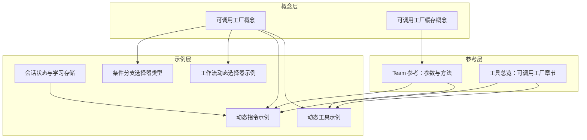
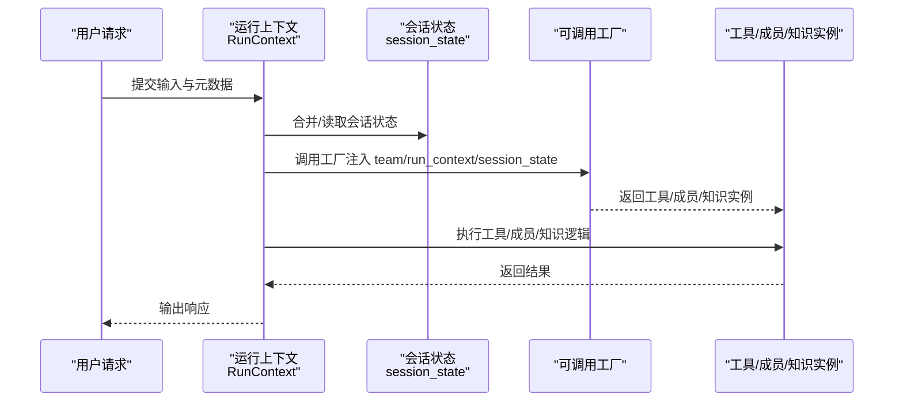
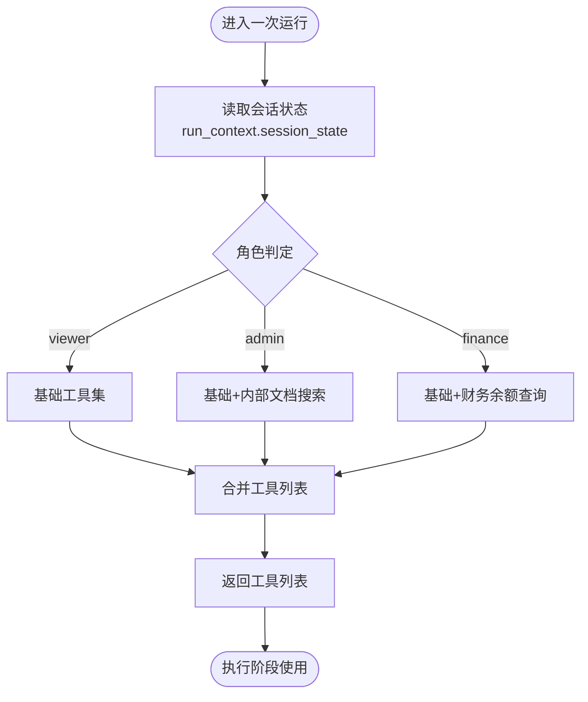
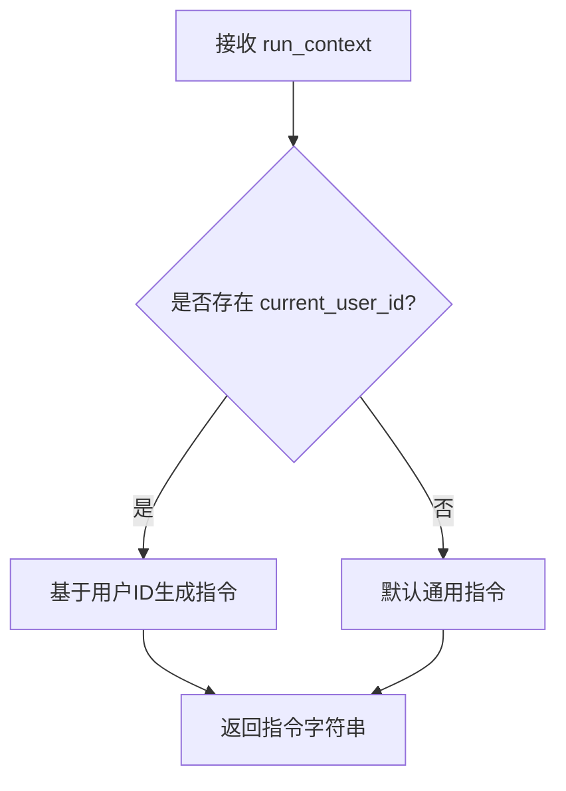
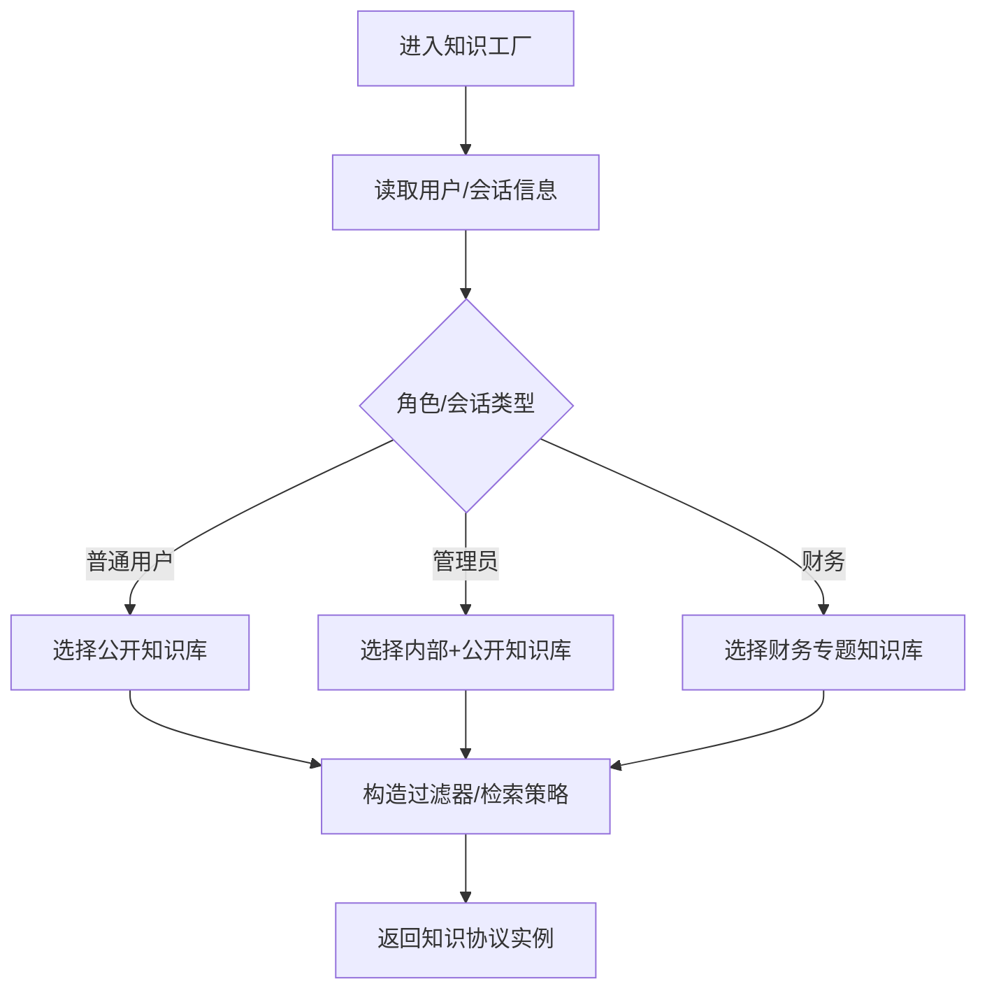
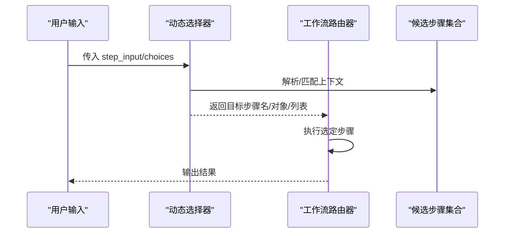
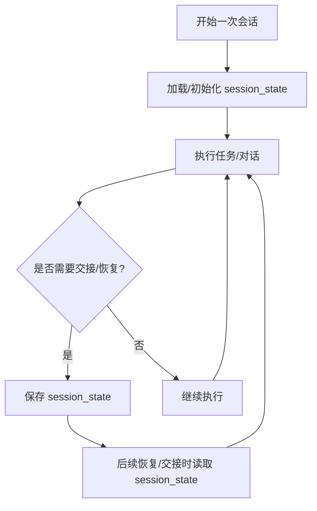
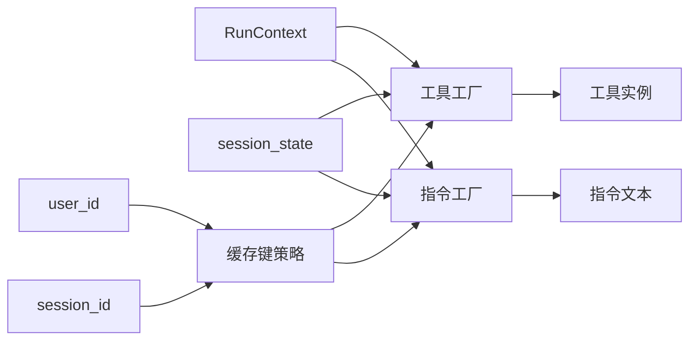

# 动态配置

<cite>
**本文引用的文件**
- [概念：可调用工厂.md](file://_snippets/concept-callable-factories.mdx)
- [概念：可调用工厂缓存.md](file://_snippets/concept-callable-factories-caching.mdx)
- [工具总览.md](file://tools/overview.mdx)
- [动态工具示例.md](file://examples/agents/dependencies/dynamic-tools.mdx)
- [动态指令示例.md](file://context/agent/dynamic-instructions.mdx)
- [会话状态与学习存储.md](file://learning/stores/session-context.mdx)
- [团队参考：Team 参数与方法.md](file://reference/teams/team.mdx)
- [工作流：动态选择器示例.md](file://workflows/usage/examples/router-choices/dynamic-selector.mdx)
- [条件分支：选择器类型.md](file://examples/workflows/conditional-branching/selector-types.mdx)
</cite>

## 目录
1. [引言](#引言)
2. [项目结构](#项目结构)
3. [核心组件](#核心组件)
4. [架构总览](#架构总览)
5. [详细组件分析](#详细组件分析)
6. [依赖关系分析](#依赖关系分析)
7. [性能考量](#性能考量)
8. [故障排查指南](#故障排查指南)
9. [结论](#结论)
10. [附录](#附录)

## 引言
本篇文档围绕 Agno 中“可调用工厂（callable factories）”在代理配置中的应用展开，系统阐述如何通过运行时动态配置实现：
- 动态工具构建：按用户角色、会话状态等上下文选择可用工具集
- 知识路由：按用户/会话维度选择知识源或过滤策略
- 上下文调整：动态指令、动态系统消息与会话状态联动
并给出与静态配置的对比、优势、适用场景、性能优化与最佳实践。

## 项目结构
以下图示从“概念—示例—参考”的维度展示与动态配置相关的核心内容分布：

**图表来源**
- [_snippets/concept-callable-factories.mdx:1-8](file://_snippets/concept-callable-factories.mdx#L1-L8)
- [_snippets/concept-callable-factories-caching.mdx:1-16](file://_snippets/concept-callable-factories-caching.mdx#L1-L16)
- [tools/overview.mdx:419-520](file://tools/overview.mdx#L419-L520)
- [examples/agents/dependencies/dynamic-tools.mdx:1-67](file://examples/agents/dependencies/dynamic-tools.mdx#L1-L67)
- [context/agent/dynamic-instructions.mdx:1-65](file://context/agent/dynamic-instructions.mdx#L1-L65)
- [learning/stores/session-context.mdx:134-164](file://learning/stores/session-context.mdx#L134-L164)
- [reference/teams/team.mdx:110-119](file://reference/teams/team.mdx#L110-L119)
- [workflows/usage/examples/router-choices/dynamic-selector.mdx:48-77](file://workflows/usage/examples/router-choices/dynamic-selector.mdx#L48-L77)
- [examples/workflows/conditional-branching/selector-types.mdx:84-127](file://examples/workflows/conditional-branching/selector-types.mdx#L84-L127)

**章节来源**
- [_snippets/concept-callable-factories.mdx:1-8](file://_snippets/concept-callable-factories.mdx#L1-L8)
- [_snippets/concept-callable-factories-caching.mdx:1-16](file://_snippets/concept-callable-factories-caching.mdx#L1-L16)
- [tools/overview.mdx:419-520](file://tools/overview.mdx#L419-L520)
- [examples/agents/dependencies/dynamic-tools.mdx:1-67](file://examples/agents/dependencies/dynamic-tools.mdx#L1-L67)
- [context/agent/dynamic-instructions.mdx:1-65](file://context/agent/dynamic-instructions.mdx#L1-L65)
- [learning/stores/session-context.mdx:134-164](file://learning/stores/session-context.mdx#L134-L164)
- [reference/teams/team.mdx:110-119](file://reference/teams/team.mdx#L110-L119)
- [workflows/usage/examples/router-choices/dynamic-selector.mdx:48-77](file://workflows/usage/examples/router-choices/dynamic-selector.mdx#L48-L77)
- [examples/workflows/conditional-branching/selector-types.mdx:84-127](file://examples/workflows/conditional-branching/selector-types.mdx#L84-L127)

## 核心组件
- 可调用工厂（Callable Factories）
  - 在运行时解析，注入 team/run_context/session_state 等上下文参数，返回工具、成员或知识实例
  - 支持缓存与自定义键，避免重复初始化
- 工具工厂（Tools Factory）
  - 基于会话状态/用户角色动态组合工具集合，实现按需启用/禁用
- 指令工厂（Instructions Factory）
  - 基于会话状态生成个性化系统消息或任务指令
- 知识工厂（Knowledge Factory）
  - 基于用户/会话维度选择知识源或设置检索过滤器
- 路由工厂（Routing Factory）
  - 基于输入或上下文动态选择步骤/成员，实现动态编排

**章节来源**
- [_snippets/concept-callable-factories.mdx:1-8](file://_snippets/concept-callable-factories.mdx#L1-L8)
- [tools/overview.mdx:419-520](file://tools/overview.mdx#L419-L520)
- [context/agent/dynamic-instructions.mdx:1-65](file://context/agent/dynamic-instructions.mdx#L1-L65)
- [reference/teams/team.mdx:110-119](file://reference/teams/team.mdx#L110-L119)

## 架构总览
下图展示了“可调用工厂”在运行时的解析与注入流程，以及与缓存、上下文的关系：

**图表来源**
- [_snippets/concept-callable-factories.mdx:1-8](file://_snippets/concept-callable-factories.mdx#L1-L8)
- [reference/teams/team.mdx:110-119](file://reference/teams/team.mdx#L110-L119)

## 详细组件分析

### 组件A：动态工具工厂（按角色/会话状态选择工具）
- 目标
  - 根据会话状态中的角色字段，动态启用不同权限范围的工具
- 关键点
  - 工厂签名自动注入 run_context，可读取 session_state
  - 返回工具列表，支持缓存以避免重复创建
- 示例路径
  - [动态工具示例.md:22-32](file://examples/agents/dependencies/dynamic-tools.mdx#L22-L32)
  - [工具总览.md（可调用工厂章节）:419-520](file://tools/overview.mdx#L419-L520)

**图表来源**
- [tools/overview.mdx:469-481](file://tools/overview.mdx#L469-L481)

**章节来源**
- [examples/agents/dependencies/dynamic-tools.mdx:22-32](file://examples/agents/dependencies/dynamic-tools.mdx#L22-L32)
- [tools/overview.mdx:419-520](file://tools/overview.mdx#L419-L520)

### 组件B：动态指令工厂（按用户/会话定制系统消息）
- 目标
  - 根据当前用户或会话状态生成个性化指令
- 关键点
  - 工厂签名注入 run_context，可读取 session_state
  - 适合用于动态描述、期望输出、few-shot示例等
- 示例路径
  - [动态指令示例.md:13-24](file://context/agent/dynamic-instructions.mdx#L13-L24)

**图表来源**
- [context/agent/dynamic-instructions.mdx:13-24](file://context/agent/dynamic-instructions.mdx#L13-L24)

**章节来源**
- [context/agent/dynamic-instructions.mdx:1-65](file://context/agent/dynamic-instructions.mdx#L1-L65)

### 组件C：知识工厂（按用户/会话选择知识源与过滤）
- 目标
  - 根据用户角色或会话状态选择知识库、设置过滤器或检索策略
- 关键点
  - 工厂返回知识协议实例；可结合缓存键实现按 user_id/session_id 复用
- 示例路径
  - [概念：可调用工厂.md:1-8](file://_snippets/concept-callable-factories.mdx#L1-L8)
  - [概念：可调用工厂缓存.md:1-16](file://_snippets/concept-callable-factories-caching.mdx#L1-L16)
  - [团队参考：Team 参数与方法:110-119](file://reference/teams/team.mdx#L110-L119)

**图表来源**
- [_snippets/concept-callable-factories.mdx:1-8](file://_snippets/concept-callable-factories.mdx#L1-L8)
- [_snippets/concept-callable-factories-caching.mdx:1-16](file://_snippets/concept-callable-factories-caching.mdx#L1-L16)
- [reference/teams/team.mdx:110-119](file://reference/teams/team.mdx#L110-L119)

**章节来源**
- [_snippets/concept-callable-factories.mdx:1-8](file://_snippets/concept-callable-factories.mdx#L1-L8)
- [_snippets/concept-callable-factories-caching.mdx:1-16](file://_snippets/concept-callable-factories-caching.mdx#L1-L16)
- [reference/teams/team.mdx:110-119](file://reference/teams/team.mdx#L110-L119)

### 组件D：动态路由（按输入/上下文选择步骤/成员）
- 目标
  - 根据用户输入或上下文动态选择下一步骤、成员或并行执行路径
- 关键点
  - 路由器的 selector 可为可调用函数，返回步骤名、步骤对象或步骤列表
- 示例路径
  - [工作流：动态选择器示例.md:48-77](file://workflows/usage/examples/router-choices/dynamic-selector.mdx#L48-L77)
  - [条件分支：选择器类型.md:84-127](file://examples/workflows/conditional-branching/selector-types.mdx#L84-L127)

**图表来源**
- [workflows/usage/examples/router-choices/dynamic-selector.mdx:48-77](file://workflows/usage/examples/router-choices/dynamic-selector.mdx#L48-L77)
- [examples/workflows/conditional-branching/selector-types.mdx:84-127](file://examples/workflows/conditional-branching/selector-types.mdx#L84-L127)

**章节来源**
- [workflows/usage/examples/router-choices/dynamic-selector.mdx:48-77](file://workflows/usage/examples/router-choices/dynamic-selector.mdx#L48-L77)
- [examples/workflows/conditional-branching/selector-types.mdx:84-127](file://examples/workflows/conditional-branching/selector-types.mdx#L84-L127)

### 组件E：上下文与会话状态联动
- 目标
  - 在长对话、多步任务、跨成员/人类交接时保持上下文连贯
- 关键点
  - 通过 session_state 记录任务进度、关键事实、角色状态等
  - 结合学习存储与会话上下文，实现短期记忆与长期知识协同
- 示例路径
  - [会话状态与学习存储.md:134-164](file://learning/stores/session-context.mdx#L134-L164)

**图表来源**
- [learning/stores/session-context.mdx:134-164](file://learning/stores/session-context.mdx#L134-L164)

**章节来源**
- [learning/stores/session-context.mdx:134-164](file://learning/stores/session-context.mdx#L134-L164)

## 依赖关系分析
- 工厂与运行时参数的耦合
  - 工厂签名自动注入 team、run_context、session_state，降低手动传递成本
- 缓存与键策略
  - 默认按自定义键、user_id、session_id 分级缓存；可通过自定义键函数精细控制
- 与团队/工作流的集成
  - Team 的 tools/members/knowledge 均支持工厂；工作流的 Router 支持动态选择器

**图表来源**
- [_snippets/concept-callable-factories.mdx:1-8](file://_snippets/concept-callable-factories.mdx#L1-L8)
- [_snippets/concept-callable-factories-caching.mdx:1-16](file://_snippets/concept-callable-factories-caching.mdx#L1-L16)
- [reference/teams/team.mdx:110-119](file://reference/teams/team.mdx#L110-L119)

**章节来源**
- [_snippets/concept-callable-factories.mdx:1-8](file://_snippets/concept-callable-factories.mdx#L1-L8)
- [_snippets/concept-callable-factories-caching.mdx:1-16](file://_snippets/concept-callable-factories-caching.mdx#L1-L16)
- [reference/teams/team.mdx:110-119](file://reference/teams/team.mdx#L110-L119)

## 性能考量
- 缓存策略
  - 开启 cache_callables 并合理设置自定义键，避免重复创建昂贵资源
  - 需要强制刷新时可清理指定类型的工厂缓存
- 初始化成本
  - 工具/知识工厂应尽量轻量；重资源延迟到首次使用
- 并发与键冲突
  - 自定义键需保证 user_id/session_id 唯一性，避免误命中
- 流式输出
  - 工作流/团队在流式场景下仍可复用已缓存的工厂结果，减少重复计算

**章节来源**
- [_snippets/concept-callable-factories-caching.mdx:1-16](file://_snippets/concept-callable-factories-caching.mdx#L1-L16)
- [reference/teams/team.mdx:110-119](file://reference/teams/team.mdx#L110-L119)

## 故障排查指南
- 工厂未注入上下文参数
  - 确认工厂签名包含 team/run_context/session_state 之一
- 工具/成员/知识未生效
  - 检查工厂返回类型是否符合要求（工具/成员返回列表或元组；知识返回协议实例）
- 缓存导致“旧配置”
  - 使用清理缓存接口清除对应类型缓存，并确认自定义键是否正确
- 路由不生效
  - 检查选择器返回值与 choices 名称/对象映射是否一致

**章节来源**
- [_snippets/concept-callable-factories.mdx:1-8](file://_snippets/concept-callable-factories.mdx#L1-L8)
- [_snippets/concept-callable-factories-caching.mdx:1-16](file://_snippets/concept-callable-factories-caching.mdx#L1-L16)
- [reference/teams/team.mdx:110-119](file://reference/teams/team.mdx#L110-L119)

## 结论
可调用工厂为 Agno 提供了强大的运行时动态配置能力：按用户/会话维度动态构建工具、指令与知识，结合缓存与键策略，在保证性能的同时实现灵活的代理行为与编排。与静态配置相比，动态配置更贴合真实业务场景的多样性与变化性，适用于高阶个性化、权限隔离、复杂任务编排与上下文持久化等场景。

## 附录
- 最佳实践清单
  - 明确工厂职责边界：工具工厂只负责工具集合；指令工厂只负责文本；知识工厂只负责知识协议
  - 设计稳定的自定义缓存键，避免误命中
  - 将昂贵初始化延迟到首次使用，配合缓存提升吞吐
  - 在工作流中使用动态选择器时，确保返回值与 choices 定义一致
  - 利用会话状态记录关键上下文，便于交接与恢复