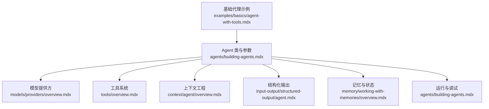
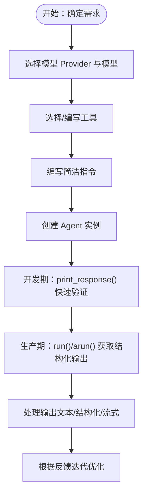
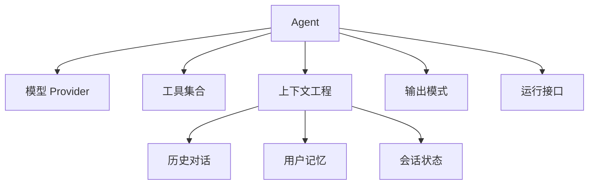

# 基础代理创建

<cite>
**本文引用的文件**
- [first-agent.mdx](file://first-agent.mdx)
- [agents/building-agents.mdx](file://agents/building-agents.mdx)
- [examples/basics/agent-with-tools.mdx](file://examples/basics/agent-with-tools.mdx)
- [examples/basics/agent-with-structured-output.mdx](file://examples/basics/agent-with-structured-output.mdx)
- [examples/basics/agent-with-memory.mdx](file://examples/basics/agent-with-memory.mdx)
- [examples/basics/agent-with-state-management.mdx](file://examples/basics/agent-with-state-management.mdx)
- [context/agent/overview.mdx](file://context/agent/overview.mdx)
- [tools/creating-tools/python-functions.mdx](file://tools/creating-tools/python-functions.mdx)
- [models/providers/overview.mdx](file://models/providers/overview.mdx)
- [models/model-as-string.mdx](file://models/model-as-string.mdx)
- [models/compatibility.mdx](file://models/compatibility.mdx)
- [models/cache-response.mdx](file://models/cache-response.mdx)
- [input-output/structured-output/agent.mdx](file://input-output/structured-output/agent.mdx)
- [input-output/multimodal.mdx](file://input-output/multimodal.mdx)
- [memory/working-with-memories/overview.mdx](file://memory/working-with-memories/overview.mdx)
- [sessions/history-management.mdx](file://sessions/history-management.mdx)
- [tools/overview.mdx](file://tools/overview.mdx)
- [tools/selecting-tools.mdx](file://tools/selecting-tools.mdx)
- [tools/attaching-tools.mdx](file://tools/attaching-tools.mdx)
- [guardrails/overview.mdx](file://guardrails/overview.mdx)
- [faq/environment-variables.mdx](file://faq/environment-variables.mdx)
- [faq/switching-models.mdx](file://faq/switching-models.mdx)
- [faq/openai-key-request-for-other-models.mdx](file://faq/openai-key-request-for-other-models.mdx)
- [faq/tpm-issues.mdx](file://faq/tpm-issues.mdx)
- [faq/structured-outputs.mdx](file://faq/structured-outputs.mdx)
- [faq/agentos-connection.mdx](file://faq/agentos-connection.mdx)
- [faq/could-not-connect-to-docker.mdx](file://faq/could-not-connect-to-docker.mdx)
- [other/install.mdx](file://other/install.mdx)
- [other/v2-migration.mdx](file://other/v2-migration.mdx)
- [other/workflows-migration.mdx](file://other/workflows-migration.mdx)
</cite>

## 目录
1. [引言](#引言)
2. [项目结构](#项目结构)
3. [核心组件](#核心组件)
4. [架构总览](#架构总览)
5. [详细组件分析](#详细组件分析)
6. [依赖关系分析](#依赖关系分析)
7. [性能考量](#性能考量)
8. [故障排查指南](#故障排查指南)
9. [结论](#结论)
10. [附录](#附录)

## 引言
本指南面向初学者，目标是以最少配置快速创建一个可用的基础代理。你将学会：
- 如何选择合适的模型
- 如何集成常用工具
- 如何编写简洁有效的指令
- 在开发环境使用 print_response() 快速迭代
- 在生产环境使用 run()/arun() 获取结构化输出
- 常见配置错误与解决方案

我们将从一个最小可行的代理开始，逐步引入工具、结构化输出、记忆与状态管理等能力，帮助你在 20 行以内搭建一个可运行的代理。

## 项目结构
基础代理的创建涉及以下关键模块与示例：
- 代理核心：Agent 类及其构造参数（模型、工具、指令、输出模式等）
- 模型提供方：OpenAI、Anthropic、Google、Groq 等
- 工具系统：内置工具与自定义工具
- 上下文工程：时间、地点、会话摘要、历史对话等
- 输出模式：自由文本与结构化输出（Pydantic 模型）
- 记忆与状态：用户偏好记忆、会话状态持久化
- 运行与调试：开发期 print_response() 与生产期 run()/arun()

**图表来源**
- [examples/basics/agent-with-tools.mdx:66-73](file://examples/basics/agent-with-tools.mdx#L66-L73)
- [agents/building-agents.mdx:16-22](file://agents/building-agents.mdx#L16-L22)
- [models/providers/overview.mdx](file://models/providers/overview.mdx)
- [tools/overview.mdx](file://tools/overview.mdx)
- [context/agent/overview.mdx:25-141](file://context/agent/overview.mdx#L25-L141)
- [input-output/structured-output/agent.mdx](file://input-output/structured-output/agent.mdx)
- [memory/working-with-memories/overview.mdx](file://memory/working-with-memories/overview.mdx)
- [agents/building-agents.mdx:27-48](file://agents/building-agents.mdx#L27-L48)

**章节来源**
- [examples/basics/agent-with-tools.mdx:6-104](file://examples/basics/agent-with-tools.mdx#L6-L104)
- [agents/building-agents.mdx:9-71](file://agents/building-agents.mdx#L9-L71)

## 核心组件
- Agent 类：代理的核心容器，负责模型、工具、指令、输出模式、上下文与运行控制。
- 模型：通过 Provider（如 OpenAI、Anthropic、Google、Groq）指定具体模型。
- 工具：内置工具（如 YFinance、HackerNews、知识检索）与自定义 Python 函数。
- 指令：系统消息与行为约束，可动态注入上下文变量。
- 输出模式：自由文本或结构化输出（Pydantic 模型）。
- 上下文工程：时间、地点、会话摘要、历史对话、用户记忆、会话状态等。
- 运行接口：开发期 print_response() 与生产期 run()/arun()。

**章节来源**
- [agents/building-agents.mdx:16-48](file://agents/building-agents.mdx#L16-L48)
- [context/agent/overview.mdx:25-141](file://context/agent/overview.mdx#L25-L141)
- [input-output/structured-output/agent.mdx](file://input-output/structured-output/agent.mdx)
- [tools/creating-tools/python-functions.mdx:50-78](file://tools/creating-tools/python-functions.mdx#L50-L78)

## 架构总览
下图展示了从零开始构建基础代理的关键步骤与组件交互：

**图表来源**
- [examples/basics/agent-with-tools.mdx:66-73](file://examples/basics/agent-with-tools.mdx#L66-L73)
- [agents/building-agents.mdx:27-48](file://agents/building-agents.mdx#L27-L48)

## 详细组件分析

### 1) 从零开始创建基础代理（20 行以内）
- 步骤
  - 导入 Agent、模型 Provider、工具与数据库
  - 实例化 Agent，设置 model、tools、instructions、markdown 等
  - 可选：启用历史上下文、时间/地点注入、会话存储
  - 在开发环境使用 print_response() 快速验证
  - 在生产环境使用 run()/arun() 获取结构化输出
- 示例参考
  - 最小代理示例：[examples/basics/agent-with-tools.mdx:66-73](file://examples/basics/agent-with-tools.mdx#L66-L73)
  - 开发与生产运行差异：[agents/building-agents.mdx:27-48](file://agents/building-agents.mdx#L27-L48)
  - 第一个代理（含 MCP、会话存储、AgentOS 部署）：[first-agent.mdx:27-40](file://first-agent.mdx#L27-L40)

**章节来源**
- [examples/basics/agent-with-tools.mdx:66-73](file://examples/basics/agent-with-tools.mdx#L66-L73)
- [agents/building-agents.mdx:27-48](file://agents/building-agents.mdx#L27-L48)
- [first-agent.mdx:27-40](file://first-agent.mdx#L27-L40)

### 2) 模型选择与配置
- Provider 选择
  - OpenAI、Anthropic、Google、Groq、Azure、Cerebras、Fireworks、HuggingFace、Mistral、Ollama、Together 等
- 配置要点
  - 通过 Provider(id="...") 指定模型
  - 确保环境变量（如 API Key）正确设置
  - 可使用响应缓存加速开发
- 参考
  - 模型提供方概览：[models/providers/overview.mdx](file://models/providers/overview.mdx)
  - 模型作为字符串：[models/model-as-string.mdx](file://models/model-as-string.mdx)
  - 兼容性矩阵与切换模型：[models/compatibility.mdx](file://models/compatibility.mdx)、[faq/switching-models.mdx](file://faq/switching-models.mdx)
  - 环境变量与密钥：[faq/environment-variables.mdx](file://faq/environment-variables.mdx)、[faq/openai-key-request-for-other-models.mdx](file://faq/openai-key-request-for-other-models.mdx)

**章节来源**
- [models/providers/overview.mdx](file://models/providers/overview.mdx)
- [models/model-as-string.mdx](file://models/model-as-string.mdx)
- [models/compatibility.mdx](file://models/compatibility.mdx)
- [faq/switching-models.mdx](file://faq/switching-models.mdx)
- [faq/environment-variables.mdx](file://faq/environment-variables.mdx)
- [faq/openai-key-request-for-other-models.mdx](file://faq/openai-key-request-for-other-models.mdx)

### 3) 工具集成
- 内置工具
  - YFinance、HackerNews、WebSearch、Knowledge、Mem0、MCP 等
- 自定义工具
  - 使用 @tool 装饰器或直接传入 Python 函数
  - 可访问 run_context、agent、team、media 等内置参数
- 工具选择与组合
  - 根据任务选择合适工具，避免过度依赖
  - 可通过工具钩子与异常处理增强鲁棒性
- 参考
  - 工具概览与选择：[tools/overview.mdx](file://tools/overview.mdx)、[tools/selecting-tools.mdx](file://tools/selecting-tools.mdx)
  - 工具附加与钩子：[tools/attaching-tools.mdx](file://tools/attaching-tools.mdx)
  - 自定义工具与内置参数：[tools/creating-tools/python-functions.mdx:50-78](file://tools/creating-tools/python-functions.mdx#L50-L78)

**章节来源**
- [tools/overview.mdx](file://tools/overview.mdx)
- [tools/selecting-tools.mdx](file://tools/selecting-tools.mdx)
- [tools/attaching-tools.mdx](file://tools/attaching-tools.mdx)
- [tools/creating-tools/python-functions.mdx:50-78](file://tools/creating-tools/python-functions.mdx#L50-L78)

### 4) 指令设置与上下文工程
- 指令编写
  - 明确角色、任务、规则与输出格式
  - 可动态注入上下文变量（时间、地点、会话摘要、记忆、状态）
- 上下文开关
  - add_datetime_to_context、add_location_to_context、add_session_summary_to_context、add_memories_to_context、add_session_state_to_context
  - 历史对话：add_history_to_context、num_history_runs
- 参考
  - 上下文工程与系统消息构建：[context/agent/overview.mdx:25-141](file://context/agent/overview.mdx#L25-L141)
  - 会话历史管理：[sessions/history-management.mdx](file://sessions/history-management.mdx)

**章节来源**
- [context/agent/overview.mdx:25-141](file://context/agent/overview.mdx#L25-L141)
- [sessions/history-management.mdx](file://sessions/history-management.mdx)

### 5) 输出模式：自由文本与结构化输出
- 自由文本
  - 默认输出为自然语言，适合快速原型与探索
- 结构化输出
  - 使用 Pydantic 模型定义 output_schema，保证稳定的数据结构
  - 生产环境推荐使用结构化输出，便于后续处理与集成
- 参考
  - 结构化输出（代理）：[input-output/structured-output/agent.mdx](file://input-output/structured-output/agent.mdx)
  - FAQ：结构化输出相关问题：[faq/structured-outputs.mdx](file://faq/structured-outputs.mdx)

**章节来源**
- [input-output/structured-output/agent.mdx](file://input-output/structured-output/agent.mdx)
- [faq/structured-outputs.mdx](file://faq/structured-outputs.mdx)

### 6) 记忆与状态管理
- 记忆（Memory）
  - 用户偏好、事实与上下文的记忆持久化
  - 与存储（会话历史）区分：记忆关注“你是谁”，存储关注“我们说了什么”
- 状态（State）
  - 代理主动维护的结构化状态（如 watchlist、计数器、标志）
  - 可在指令中注入状态变量，工具中读写状态
- 参考
  - 记忆与状态示例：[examples/basics/agent-with-memory.mdx:96-108](file://examples/basics/agent-with-memory.mdx#L96-L108)、[examples/basics/agent-with-state-management.mdx:120-136](file://examples/basics/agent-with-state-management.mdx#L120-L136)
  - 记忆工作原理：[memory/working-with-memories/overview.mdx](file://memory/working-with-memories/overview.mdx)

**章节来源**
- [examples/basics/agent-with-memory.mdx:96-108](file://examples/basics/agent-with-memory.mdx#L96-L108)
- [examples/basics/agent-with-state-management.mdx:120-136](file://examples/basics/agent-with-state-management.mdx#L120-L136)
- [memory/working-with-memories/overview.mdx](file://memory/working-with-memories/overview.mdx)

### 7) 开发与生产运行差异
- 开发期：print_response()
  - 适合快速验证与调试，输出更易读
  - 支持流式打印（stream=True）
- 生产期：run()/arun()
  - 返回结构化事件流（Iterator[RunOutputEvent]），适合集成到 API
  - 支持 SSE 事件流与取消运行
- 参考
  - 运行差异与示例：[agents/building-agents.mdx:27-48](file://agents/building-agents.mdx#L27-L48)

**章节来源**
- [agents/building-agents.mdx:27-48](file://agents/building-agents.mdx#L27-L48)

### 8) 多模态与守卫（可选）
- 多模态
  - 图像、音频、视频、文件等输入输出支持
- 守卫（Guardrails）
  - 输入校验、PII 检测、提示注入检测等
- 参考
  - 多模态：[input-output/multimodal.mdx](file://input-output/multimodal.mdx)
  - 守卫：[guardrails/overview.mdx](file://guardrails/overview.mdx)

**章节来源**
- [input-output/multimodal.mdx](file://input-output/multimodal.mdx)
- [guardrails/overview.mdx](file://guardrails/overview.mdx)

## 依赖关系分析
基础代理的依赖关系如下：
- Agent 依赖模型 Provider 与工具
- 指令依赖上下文工程（时间、地点、历史、记忆、状态）
- 输出模式依赖结构化 schema
- 运行接口依赖事件流与取消机制

**图表来源**
- [examples/basics/agent-with-tools.mdx:66-73](file://examples/basics/agent-with-tools.mdx#L66-L73)
- [context/agent/overview.mdx:25-141](file://context/agent/overview.mdx#L25-L141)
- [input-output/structured-output/agent.mdx](file://input-output/structured-output/agent.mdx)
- [agents/building-agents.mdx:27-48](file://agents/building-agents.mdx#L27-L48)

**章节来源**
- [examples/basics/agent-with-tools.mdx:66-73](file://examples/basics/agent-with-tools.mdx#L66-L73)
- [context/agent/overview.mdx:25-141](file://context/agent/overview.mdx#L25-L141)
- [input-output/structured-output/agent.mdx](file://input-output/structured-output/agent.mdx)
- [agents/building-agents.mdx:27-48](file://agents/building-agents.mdx#L27-L48)

## 性能考量
- 响应缓存：在开发阶段启用模型响应缓存，减少重复调用与等待时间
- 流式输出：生产环境使用 SSE 流式输出，降低首 token 延迟
- 工具选择：仅加载必要的工具，避免冗余调用
- 上下文长度：合理设置历史轮次与上下文注入，平衡性能与效果

**章节来源**
- [models/cache-response.mdx](file://models/cache-response.mdx)

## 故障排查指南
- 环境变量与密钥
  - 确保模型 API Key 正确导出，参考：[faq/environment-variables.mdx](file://faq/environment-variables.mdx)、[faq/openai-key-request-for-other-models.mdx](file://faq/openai-key-request-for-other-models.mdx)
- 模型切换与兼容性
  - 切换模型时注意兼容性矩阵与参数差异：[faq/switching-models.mdx](file://faq/switching-models.mdx)、[models/compatibility.mdx](file://models/compatibility.mdx)
- TPM 限额与速率限制
  - 遇到速率限制或 TPM 问题，参考：[faq/tpm-issues.mdx](file://faq/tpm-issues.mdx)
- 结构化输出问题
  - 检查 Pydantic schema 定义与模型输出一致性：[faq/structured-outputs.mdx](file://faq/structured-outputs.mdx)
- AgentOS 连接问题
  - 本地 AgentOS 连接失败时，参考：[faq/agentos-connection.mdx](file://faq/agentos-connection.mdx)
- Docker 连接问题
  - 无法连接 Docker 时，参考：[faq/could-not-connect-to-docker.mdx](file://faq/could-not-connect-to-docker.mdx)
- 安装与迁移
  - 新环境安装与版本迁移：[other/install.mdx](file://other/install.mdx)、[other/v2-migration.mdx](file://other/v2-migration.mdx)、[other/workflows-migration.mdx](file://other/workflows-migration.mdx)

**章节来源**
- [faq/environment-variables.mdx](file://faq/environment-variables.mdx)
- [faq/openai-key-request-for-other-models.mdx](file://faq/openai-key-request-for-other-models.mdx)
- [faq/switching-models.mdx](file://faq/switching-models.mdx)
- [models/compatibility.mdx](file://models/compatibility.mdx)
- [faq/tpm-issues.mdx](file://faq/tpm-issues.mdx)
- [faq/structured-outputs.mdx](file://faq/structured-outputs.mdx)
- [faq/agentos-connection.mdx](file://faq/agentos-connection.mdx)
- [faq/could-not-connect-to-docker.mdx](file://faq/could-not-connect-to-docker.mdx)
- [other/install.mdx](file://other/install.mdx)
- [other/v2-migration.mdx](file://other/v2-migration.mdx)
- [other/workflows-migration.mdx](file://other/workflows-migration.mdx)

## 结论
通过本指南，你可以用最少的配置快速创建一个可用的基础代理：
- 选择合适的模型 Provider 与模型
- 集成必要的工具
- 编写简洁明确的指令
- 在开发期使用 print_response() 快速验证
- 在生产期使用 run()/arun() 获取结构化输出
- 按需引入记忆、状态、多模态与守卫等高级能力

随着代理能力的增强，建议逐步引入上下文工程、结构化输出、记忆与状态管理，并在生产环境中启用流式输出与可观测性。

## 附录
- 快速参考
  - 最小代理示例：[examples/basics/agent-with-tools.mdx:66-73](file://examples/basics/agent-with-tools.mdx#L66-L73)
  - 开发与生产运行差异：[agents/building-agents.mdx:27-48](file://agents/building-agents.mdx#L27-L48)
  - 第一个代理（含 MCP、会话存储、AgentOS 部署）：[first-agent.mdx:27-40](file://first-agent.mdx#L27-L40)
- 进阶示例
  - 结构化输出：[examples/basics/agent-with-structured-output.mdx:96-107](file://examples/basics/agent-with-structured-output.mdx#L96-L107)
  - 记忆与状态：[examples/basics/agent-with-memory.mdx:96-108](file://examples/basics/agent-with-memory.mdx#L96-L108)、[examples/basics/agent-with-state-management.mdx:120-136](file://examples/basics/agent-with-state-management.mdx#L120-L136)