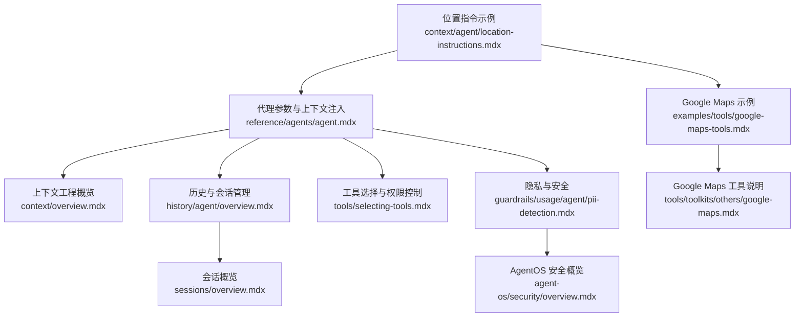
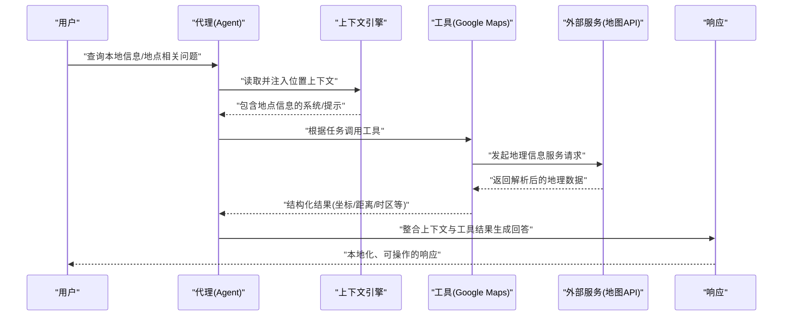
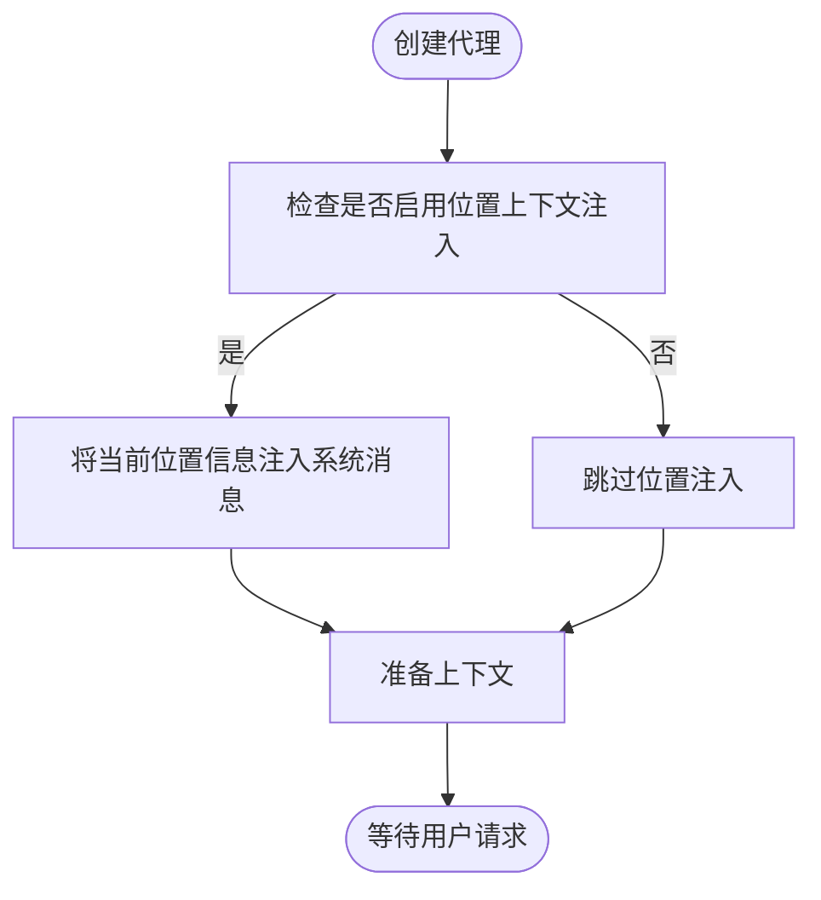
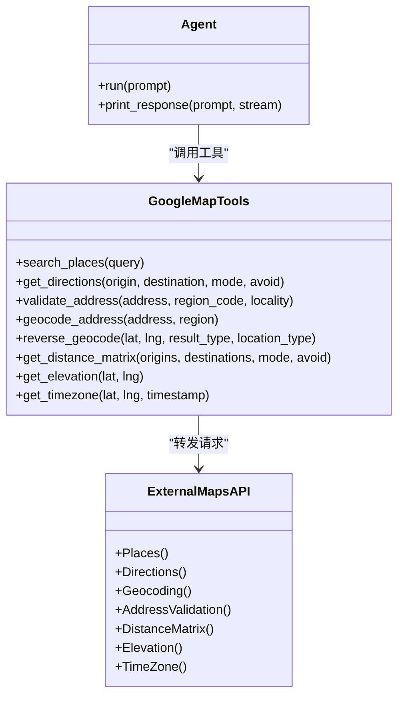
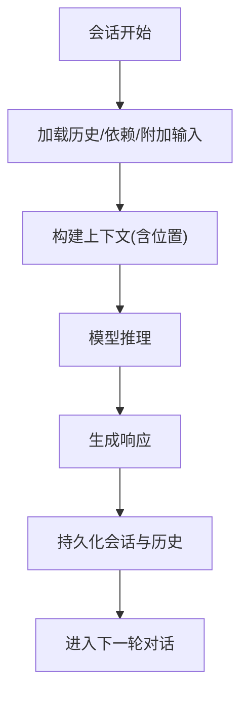
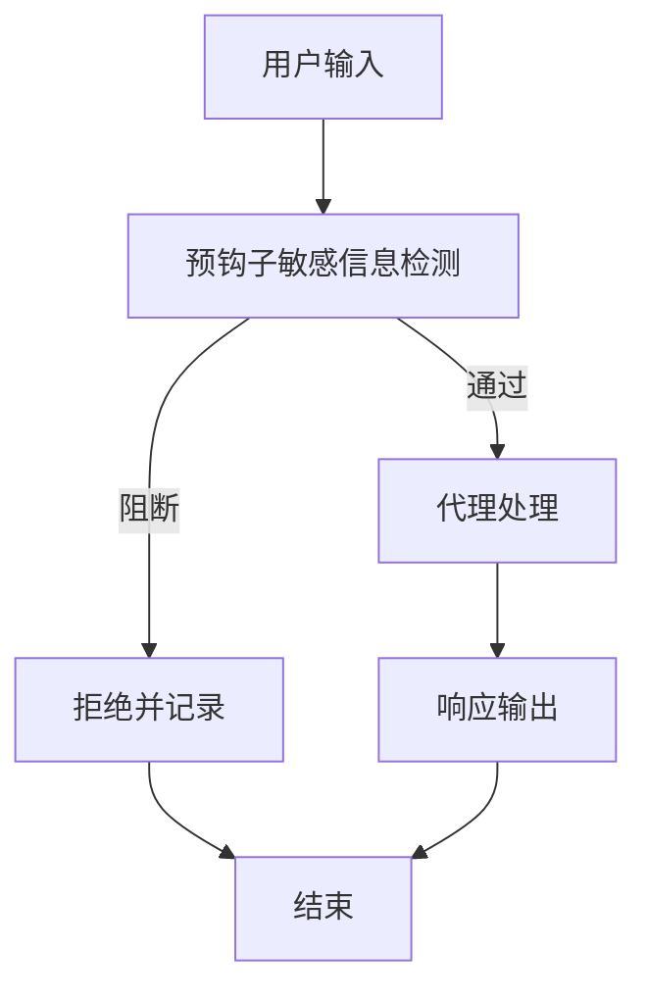
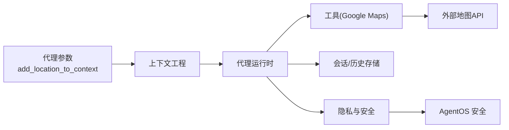

# 位置指令

<cite>
**本文引用的文件**
- [context/agent/location-instructions.mdx](file://context/agent/location-instructions.mdx)
- [examples/tools/google-maps-tools.mdx](file://examples/tools/google-maps-tools.mdx)
- [tools/toolkits/others/google-maps.mdx](file://tools/toolkits/others/google-maps.mdx)
- [reference/agents/agent.mdx](file://reference/agents/agent.mdx)
- [context/overview.mdx](file://context/overview.mdx)
- [history/agent/overview.mdx](file://history/agent/overview.mdx)
- [sessions/overview.mdx](file://sessions/overview.mdx)
- [tools/selecting-tools.mdx](file://tools/selecting-tools.mdx)
- [guardrails/usage/agent/pii-detection.mdx](file://guardrails/usage/agent/pii-detection.mdx)
- [agent-os/security/overview.mdx](file://agent-os/security/overview.mdx)
</cite>

## 目录
1. [简介](#简介)
2. [项目结构](#项目结构)
3. [核心组件](#核心组件)
4. [架构总览](#架构总览)
5. [详细组件分析](#详细组件分析)
6. [依赖关系分析](#依赖关系分析)
7. [性能考量](#性能考量)
8. [故障排查指南](#故障排查指南)
9. [结论](#结论)
10. [附录](#附录)

## 简介
本章节围绕“位置指令”展开，系统性说明如何在指令中集成地理位置信息以增强代理的上下文理解能力。内容涵盖：
- 位置指令的语法与启用方式
- 地理位置数据的来源与解析机制
- 将位置信息融入代理响应的实践方法
- 不同精度位置数据的处理策略
- 隐私保护与数据安全最佳实践

## 项目结构
与位置指令相关的核心文档分布在以下区域：
- 指令与上下文工程：context/agent/location-instructions.mdx、context/overview.mdx
- 工具与外部数据源：examples/tools/google-maps-tools.mdx、tools/toolkits/others/google-maps.mdx
- 代理参数与上下文注入：reference/agents/agent.mdx
- 历史与会话：history/agent/overview.mdx、sessions/overview.mdx
- 工具选择与权限控制：tools/selecting-tools.mdx
- 隐私与安全：guardrails/usage/agent/pii-detection.mdx、agent-os/security/overview.mdx

**图表来源**
- [context/agent/location-instructions.mdx:1-61](file://context/agent/location-instructions.mdx#L1-L61)
- [reference/agents/agent.mdx:77-80](file://reference/agents/agent.mdx#L77-L80)
- [context/overview.mdx:1-69](file://context/overview.mdx#L1-L69)
- [examples/tools/google-maps-tools.mdx:1-202](file://examples/tools/google-maps-tools.mdx#L1-L202)
- [tools/toolkits/others/google-maps.mdx:1-71](file://tools/toolkits/others/google-maps.mdx#L1-L71)
- [history/agent/overview.mdx:1-126](file://history/agent/overview.mdx#L1-L126)
- [sessions/overview.mdx:1-87](file://sessions/overview.mdx#L1-L87)
- [tools/selecting-tools.mdx:1-56](file://tools/selecting-tools.mdx#L1-L56)
- [guardrails/usage/agent/pii-detection.mdx:32-142](file://guardrails/usage/agent/pii-detection.mdx#L32-L142)
- [agent-os/security/overview.mdx:1-70](file://agent-os/security/overview.mdx#L1-L70)

**章节来源**
- [context/agent/location-instructions.mdx:1-61](file://context/agent/location-instructions.mdx#L1-L61)
- [examples/tools/google-maps-tools.mdx:1-202](file://examples/tools/google-maps-tools.mdx#L1-L202)
- [tools/toolkits/others/google-maps.mdx:1-71](file://tools/toolkits/others/google-maps.mdx#L1-L71)
- [reference/agents/agent.mdx:77-80](file://reference/agents/agent.mdx#L77-L80)
- [context/overview.mdx:1-69](file://context/overview.mdx#L1-L69)
- [history/agent/overview.mdx:1-126](file://history/agent/overview.mdx#L1-L126)
- [sessions/overview.mdx:1-87](file://sessions/overview.mdx#L1-L87)
- [tools/selecting-tools.mdx:1-56](file://tools/selecting-tools.mdx#L1-L56)
- [guardrails/usage/agent/pii-detection.mdx:32-142](file://guardrails/usage/agent/pii-detection.mdx#L32-L142)
- [agent-os/security/overview.mdx:1-70](file://agent-os/security/overview.mdx#L1-L70)

## 核心组件
- 位置指令开关：通过代理参数启用位置上下文注入，使系统消息自动包含当前地点信息，从而指导模型生成本地化响应。
- 外部地理数据源：借助 Google Maps 工具集（如地点搜索、反向地理编码、距离矩阵、时区等）为代理提供高精度位置数据。
- 上下文工程：结合会话历史、依赖注入与额外输入，构建稳定且可扩展的上下文。
- 隐私与安全：通过预钩子进行敏感信息检测与屏蔽，并结合 AgentOS 的认证与授权机制保障数据安全。

**章节来源**
- [reference/agents/agent.mdx:77-80](file://reference/agents/agent.mdx#L77-L80)
- [tools/toolkits/others/google-maps.mdx:44-63](file://tools/toolkits/others/google-maps.mdx#L44-L63)
- [context/overview.mdx:20-36](file://context/overview.mdx#L20-L36)
- [guardrails/usage/agent/pii-detection.mdx:32-142](file://guardrails/usage/agent/pii-detection.mdx#L32-L142)
- [agent-os/security/overview.mdx:7-54](file://agent-os/security/overview.mdx#L7-L54)

## 架构总览
位置指令的运行链路由“代理参数 → 上下文注入 → 工具调用 → 数据解析 → 响应生成”构成。下图展示了从用户请求到最终输出的关键交互：

**图表来源**
- [context/agent/location-instructions.mdx:9-21](file://context/agent/location-instructions.mdx#L9-L21)
- [examples/tools/google-maps-tools.mdx:26-82](file://examples/tools/google-maps-tools.mdx#L26-L82)
- [tools/toolkits/others/google-maps.mdx:52-63](file://tools/toolkits/others/google-maps.mdx#L52-L63)

## 详细组件分析

### 组件A：位置指令与上下文注入
- 启用方式：在代理初始化时设置位置上下文注入开关，使系统消息自动携带当前地点信息。
- 适用场景：需要基于用户所在城市/区域提供本地化建议、新闻、服务或路线规划。
- 关键参数参考：代理参数中包含“是否添加位置到上下文”的布尔开关及时间戳时区标识。

**图表来源**
- [reference/agents/agent.mdx:77-80](file://reference/agents/agent.mdx#L77-L80)
- [context/overview.mdx:20-36](file://context/overview.mdx#L20-L36)

**章节来源**
- [context/agent/location-instructions.mdx:9-21](file://context/agent/location-instructions.mdx#L9-L21)
- [reference/agents/agent.mdx:77-80](file://reference/agents/agent.mdx#L77-L80)
- [context/overview.mdx:20-36](file://context/overview.mdx#L20-L36)

### 组件B：外部地理数据源与工具集成
- 工具类型：Google Maps 工具集覆盖地点搜索、方向计算、地址校验、地理编码/反向地理编码、距离矩阵、海拔与时区等。
- 使用模式：可通过 include/exclude 参数精细化控制可用工具集合，平衡功能与成本。
- 典型流程：代理接收自然语言请求 → 解析任务 → 调用对应工具 → 调用外部地图 API → 返回结构化结果 → 生成本地化回答。

**图表来源**
- [examples/tools/google-maps-tools.mdx:26-82](file://examples/tools/google-maps-tools.mdx#L26-L82)
- [tools/toolkits/others/google-maps.mdx:52-63](file://tools/toolkits/others/google-maps.mdx#L52-L63)

**章节来源**
- [examples/tools/google-maps-tools.mdx:1-202](file://examples/tools/google-maps-tools.mdx#L1-L202)
- [tools/toolkits/others/google-maps.mdx:1-71](file://tools/toolkits/others/google-maps.mdx#L1-L71)

### 组件C：上下文工程与会话持久化
- 上下文组成：系统消息、用户消息、对话历史、附加输入等。
- 历史注入：通过参数将最近若干轮对话或全部历史注入上下文，便于跨轮次保持本地化语境。
- 会话管理：会话作为多轮对话线程，具备唯一标识，支持持久化存储与多用户隔离。

**图表来源**
- [context/overview.mdx:20-36](file://context/overview.mdx#L20-L36)
- [history/agent/overview.mdx:16-26](file://history/agent/overview.mdx#L16-L26)
- [sessions/overview.mdx:12-28](file://sessions/overview.mdx#L12-L28)

**章节来源**
- [context/overview.mdx:1-69](file://context/overview.mdx#L1-L69)
- [history/agent/overview.mdx:1-126](file://history/agent/overview.mdx#L1-L126)
- [sessions/overview.mdx:1-87](file://sessions/overview.mdx#L1-L87)

### 组件D：工具选择与权限控制
- 精细化工具访问：通过 include/exclude 参数限制代理可用工具集合，避免昂贵或敏感操作。
- 成本与安全权衡：优先排除高开销工具（如距离矩阵、方向），在保证功能的前提下降低费用与风险。

**章节来源**
- [tools/selecting-tools.mdx:1-56](file://tools/selecting-tools.mdx#L1-L56)
- [examples/tools/google-maps-tools.mdx:63-82](file://examples/tools/google-maps-tools.mdx#L63-L82)

### 组件E：隐私保护与数据安全
- 敏感信息检测：在请求进入代理前进行敏感信息识别与拦截，必要时进行掩码处理。
- 认证与授权：AgentOS 支持基础认证与基于 JWT 的 RBAC 授权，确保访问控制与数据主权。

**图表来源**
- [guardrails/usage/agent/pii-detection.mdx:32-142](file://guardrails/usage/agent/pii-detection.mdx#L32-L142)
- [agent-os/security/overview.mdx:14-54](file://agent-os/security/overview.mdx#L14-L54)

**章节来源**
- [guardrails/usage/agent/pii-detection.mdx:32-142](file://guardrails/usage/agent/pii-detection.mdx#L32-L142)
- [agent-os/security/overview.mdx:1-70](file://agent-os/security/overview.mdx#L1-L70)

## 依赖关系分析
- 代理参数依赖上下文工程模块，决定是否注入位置信息。
- 工具依赖外部地图 API，需配置密钥与启用相应服务。
- 历史与会话依赖数据库存储，用于多轮对话的连续性。
- 隐私与安全依赖预钩子与 AgentOS 安全机制。

**图表来源**
- [reference/agents/agent.mdx:77-80](file://reference/agents/agent.mdx#L77-L80)
- [context/overview.mdx:20-36](file://context/overview.mdx#L20-L36)
- [examples/tools/google-maps-tools.mdx:26-82](file://examples/tools/google-maps-tools.mdx#L26-L82)
- [tools/toolkits/others/google-maps.mdx:52-63](file://tools/toolkits/others/google-maps.mdx#L52-L63)
- [history/agent/overview.mdx:16-26](file://history/agent/overview.mdx#L16-L26)
- [guardrails/usage/agent/pii-detection.mdx:32-142](file://guardrails/usage/agent/pii-detection.mdx#L32-L142)
- [agent-os/security/overview.mdx:14-54](file://agent-os/security/overview.mdx#L14-L54)

**章节来源**
- [reference/agents/agent.mdx:77-80](file://reference/agents/agent.mdx#L77-L80)
- [context/overview.mdx:1-69](file://context/overview.mdx#L1-L69)
- [examples/tools/google-maps-tools.mdx:1-202](file://examples/tools/google-maps-tools.mdx#L1-L202)
- [tools/toolkits/others/google-maps.mdx:1-71](file://tools/toolkits/others/google-maps.mdx#L1-L71)
- [history/agent/overview.mdx:1-126](file://history/agent/overview.mdx#L1-L126)
- [guardrails/usage/agent/pii-detection.mdx:32-142](file://guardrails/usage/agent/pii-detection.mdx#L32-L142)
- [agent-os/security/overview.mdx:1-70](file://agent-os/security/overview.mdx#L1-L70)

## 性能考量
- 上下文长度与成本：历史轮次越多，上下文越大，请求更慢且更昂贵。建议从较小的轮次起步，按需扩大。
- 工具调用成本：距离矩阵、方向计算等工具可能产生较高费用，应谨慎使用或通过 include/exclude 控制。
- 缓存策略：利用模型提供商的提示缓存能力，复用静态内容，减少重复 token 开销。

**章节来源**
- [history/agent/overview.mdx:69-71](file://history/agent/overview.mdx#L69-L71)
- [examples/tools/google-maps-tools.mdx:63-82](file://examples/tools/google-maps-tools.mdx#L63-L82)
- [context/overview.mdx:27-41](file://context/overview.mdx#L27-L41)

## 故障排查指南
- 无法获取位置信息
  - 检查代理参数中的位置注入开关是否开启。
  - 确认上下文工程已正确构建，且未被其他设置覆盖。
- 工具调用失败
  - 确认外部 API 密钥已配置并启用相应服务。
  - 检查 include/exclude 设置是否误排除了所需工具。
- 响应不包含本地化细节
  - 在代理指令中明确要求提供本地信息（如天气、交通、附近设施等）。
  - 结合会话历史，确保上下文包含足够的本地化背景。
- 隐私合规问题
  - 启用预钩子进行敏感信息检测与屏蔽。
  - 使用 AgentOS 的认证与授权机制，限制访问范围。

**章节来源**
- [reference/agents/agent.mdx:77-80](file://reference/agents/agent.mdx#L77-L80)
- [tools/toolkits/others/google-maps.mdx:8-29](file://tools/toolkits/others/google-maps.mdx#L8-L29)
- [tools/selecting-tools.mdx:8-24](file://tools/selecting-tools.mdx#L8-L24)
- [guardrails/usage/agent/pii-detection.mdx:32-142](file://guardrails/usage/agent/pii-detection.mdx#L32-L142)
- [agent-os/security/overview.mdx:14-54](file://agent-os/security/overview.mdx#L14-L54)

## 结论
通过在代理中启用位置上下文注入，并结合 Google Maps 等外部地理数据源，可以显著提升代理对本地场景的理解与服务能力。配合上下文工程、会话持久化、工具选择与隐私安全机制，可在保证性能与成本可控的同时，实现高质量、可解释、可审计的本地化智能体验。

## 附录
- 快速上手示例路径
  - 位置指令示例：[location-instructions 示例:9-21](file://context/agent/location-instructions.mdx#L9-L21)
  - Google Maps 工具示例：[google-maps-tools 示例:94-176](file://examples/tools/google-maps-tools.mdx#L94-L176)
- 参考参数与说明
  - 代理参数：[Agent 参数说明:77-80](file://reference/agents/agent.mdx#L77-L80)
  - 工具函数列表：[Google Maps 工具函数:52-63](file://tools/toolkits/others/google-maps.mdx#L52-L63)
- 最佳实践清单
  - 明确要求本地化输出、合理设置历史轮次、控制工具调用范围、启用隐私检测与安全认证。