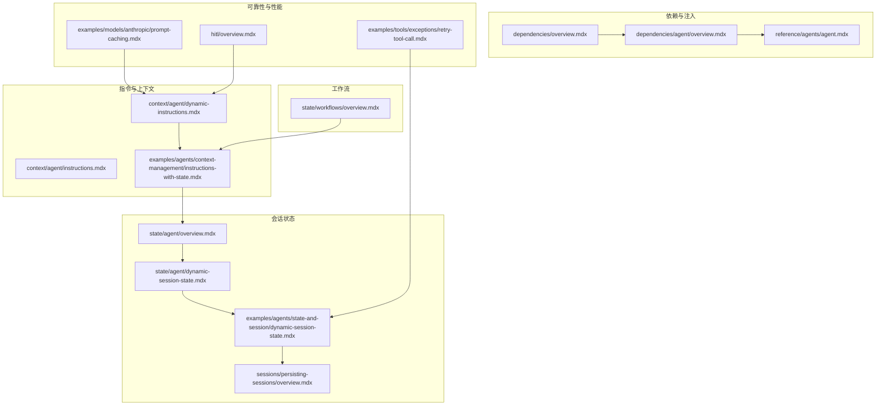
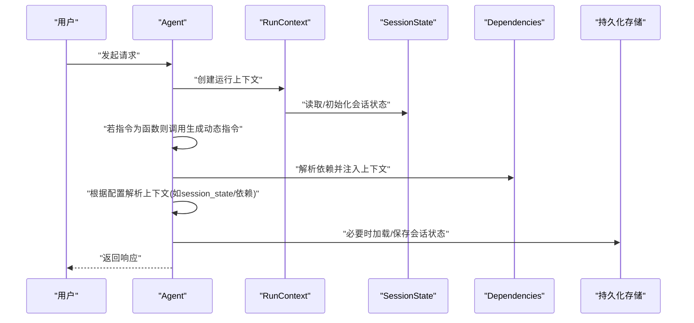
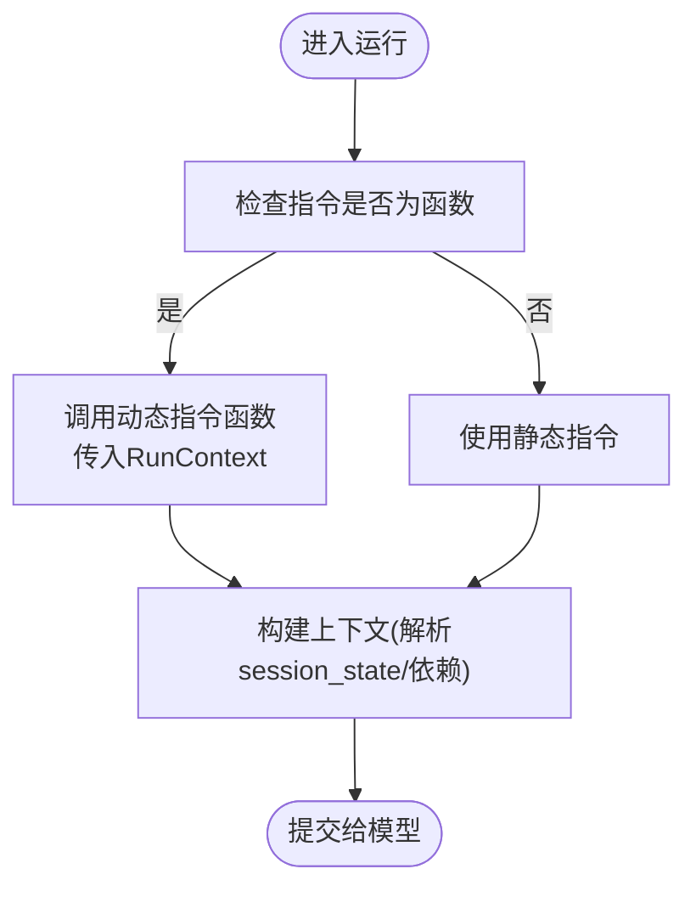
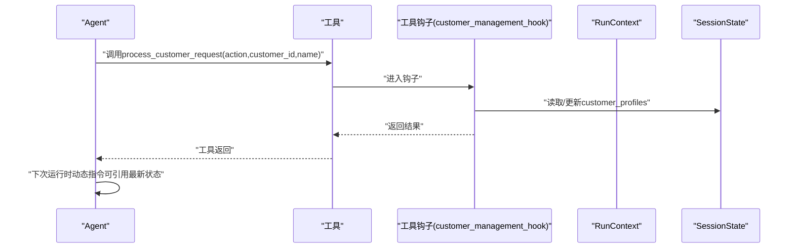
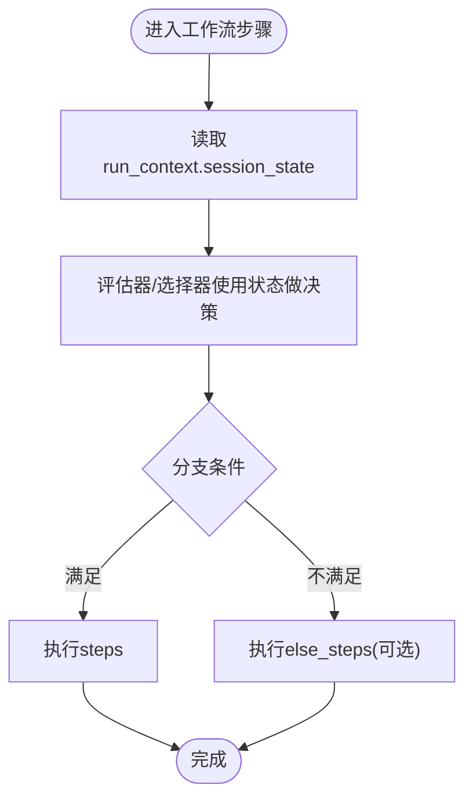
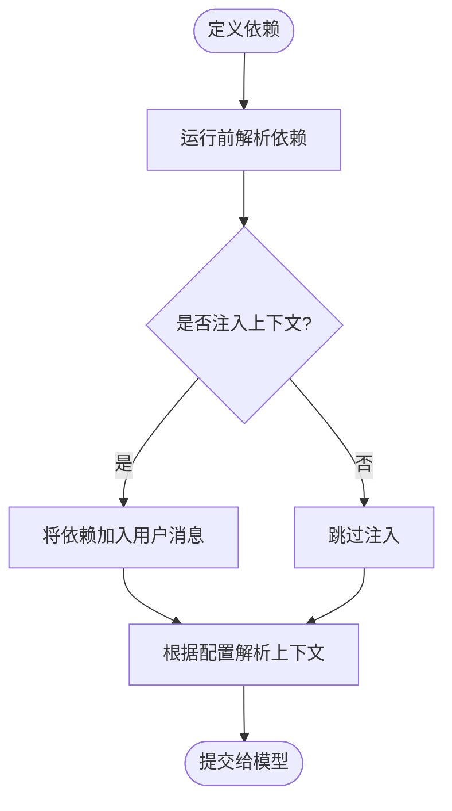
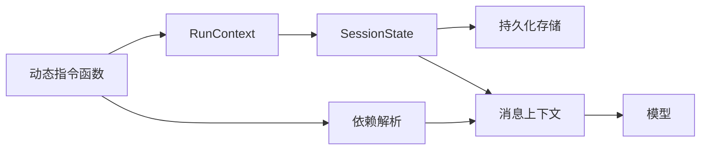

# 动态指令

<cite>
**本文引用的文件**
- [context/agent/dynamic-instructions.mdx](file://context/agent/dynamic-instructions.mdx)
- [examples/agents/context-management/instructions-with-state.mdx](file://examples/agents/context-management/instructions-with-state.mdx)
- [examples/agents/state-and-session/dynamic-session-state.mdx](file://examples/agents/state-and-session/dynamic-session-state.mdx)
- [state/agent/dynamic-session-state.mdx](file://state/agent/dynamic-session-state.mdx)
- [state/agent/overview.mdx](file://state/agent/overview.mdx)
- [state/workflows/overview.mdx](file://state/workflows/overview.mdx)
- [sessions/persisting-sessions/overview.mdx](file://sessions/persisting-sessions/overview.mdx)
- [context/agent/instructions.mdx](file://context/agent/instructions.mdx)
- [dependencies/overview.mdx](file://dependencies/overview.mdx)
- [dependencies/agent/overview.mdx](file://dependencies/agent/overview.mdx)
- [reference/agents/agent.mdx](file://reference/agents/agent.mdx)
- [examples/tools/exceptions/retry-tool-call.mdx](file://examples/tools/exceptions/retry-tool-call.mdx)
- [examples/models/anthropic/prompt-caching.mdx](file://examples/models/anthropic/prompt-caching.mdx)
- [hitl/overview.mdx](file://hitl/overview.mdx)
</cite>

## 目录
1. [引言](#引言)
2. [项目结构](#项目结构)
3. [核心组件](#核心组件)
4. [架构总览](#架构总览)
5. [详细组件分析](#详细组件分析)
6. [依赖关系分析](#依赖关系分析)
7. [性能考量](#性能考量)
8. [故障排查指南](#故障排查指南)
9. [结论](#结论)
10. [附录](#附录)

## 引言
本篇文档围绕“动态指令”展开，系统阐述如何基于上下文与会话状态在运行时实时调整代理行为。我们将从实现机制、更新策略、触发条件入手，结合仓库中的示例与参考文档，给出可操作的实践路径，并讨论动态指令与静态指令的差异、灵活性与稳定性的平衡、性能优化与最佳实践。

## 项目结构
与动态指令相关的内容主要分布在以下区域：
- 指令与上下文：context/agent 下的动态指令与基础指令示例
- 会话状态与动态更新：state/agent 与 examples/agents/state-and-session 中的状态示例
- 工作流中的会话状态：state/workflows/overview.mdx
- 会话持久化：sessions/persisting-sessions/overview.mdx
- 依赖注入与上下文注入：dependencies/* 与 reference/agents/agent.mdx
- 可靠性与错误处理：examples/tools/exceptions/retry-tool-call.mdx
- 提示词缓存与性能：examples/models/anthropic/prompt-caching.mdx
- 人机交互（HITL）与动态输入：hitl/overview.mdx

**图表来源**
- [context/agent/dynamic-instructions.mdx:1-65](file://context/agent/dynamic-instructions.mdx#L1-L65)
- [context/agent/instructions.mdx:1-53](file://context/agent/instructions.mdx#L1-L53)
- [examples/agents/context-management/instructions-with-state.mdx:1-69](file://examples/agents/context-management/instructions-with-state.mdx#L1-L69)
- [state/agent/overview.mdx:1-25](file://state/agent/overview.mdx#L1-L25)
- [state/agent/dynamic-session-state.mdx:1-118](file://state/agent/dynamic-session-state.mdx#L1-L118)
- [examples/agents/state-and-session/dynamic-session-state.mdx:1-115](file://examples/agents/state-and-session/dynamic-session-state.mdx#L1-L115)
- [sessions/persisting-sessions/overview.mdx:1-65](file://sessions/persisting-sessions/overview.mdx#L1-L65)
- [state/workflows/overview.mdx:201-246](file://state/workflows/overview.mdx#L201-L246)
- [dependencies/overview.mdx:35-67](file://dependencies/overview.mdx#L35-L67)
- [dependencies/agent/overview.mdx:39-82](file://dependencies/agent/overview.mdx#L39-L82)
- [reference/agents/agent.mdx:77-80](file://reference/agents/agent.mdx#L77-L80)
- [examples/tools/exceptions/retry-tool-call.mdx:41-82](file://examples/tools/exceptions/retry-tool-call.mdx#L41-L82)
- [examples/models/anthropic/prompt-caching.mdx:44-77](file://examples/models/anthropic/prompt-caching.mdx#L44-L77)
- [hitl/overview.mdx:29-70](file://hitl/overview.mdx#L29-L70)

**章节来源**
- [context/agent/dynamic-instructions.mdx:1-65](file://context/agent/dynamic-instructions.mdx#L1-L65)
- [examples/agents/context-management/instructions-with-state.mdx:1-69](file://examples/agents/context-management/instructions-with-state.mdx#L1-L69)
- [state/agent/overview.mdx:1-25](file://state/agent/overview.mdx#L1-L25)
- [state/agent/dynamic-session-state.mdx:1-118](file://state/agent/dynamic-session-state.mdx#L1-L118)
- [examples/agents/state-and-session/dynamic-session-state.mdx:1-115](file://examples/agents/state-and-session/dynamic-session-state.mdx#L1-L115)
- [sessions/persisting-sessions/overview.mdx:1-65](file://sessions/persisting-sessions/overview.mdx#L1-L65)
- [state/workflows/overview.mdx:201-246](file://state/workflows/overview.mdx#L201-L246)
- [dependencies/overview.mdx:35-67](file://dependencies/overview.mdx#L35-L67)
- [dependencies/agent/overview.mdx:39-82](file://dependencies/agent/overview.mdx#L39-L82)
- [reference/agents/agent.mdx:77-80](file://reference/agents/agent.mdx#L77-L80)
- [examples/tools/exceptions/retry-tool-call.mdx:41-82](file://examples/tools/exceptions/retry-tool-call.mdx#L41-L82)
- [examples/models/anthropic/prompt-caching.mdx:44-77](file://examples/models/anthropic/prompt-caching.mdx#L44-L77)
- [hitl/overview.mdx:29-70](file://hitl/overview.mdx#L29-L70)

## 核心组件
- 动态指令函数：接收运行上下文，按会话状态返回不同指令字符串，从而实现个性化行为
- 会话状态：贯穿多轮对话的可变数据，支持在工具钩子、运行钩子、工作流步骤中读写
- 依赖注入：将解析后的依赖值注入到用户消息或系统消息中，增强上下文
- 上下文解析开关：控制是否在消息中解析 session_state、依赖与元数据
- 会话持久化：通过数据库保存会话状态与历史，支持跨运行恢复
- 错误处理与重试：在工具调用失败时维护状态一致性
- 提示词缓存：减少重复计算与令牌消耗，提升响应速度

**章节来源**
- [context/agent/dynamic-instructions.mdx:9-25](file://context/agent/dynamic-instructions.mdx#L9-L25)
- [examples/agents/context-management/instructions-with-state.mdx:21-36](file://examples/agents/context-management/instructions-with-state.mdx#L21-L36)
- [state/agent/overview.mdx:16-25](file://state/agent/overview.mdx#L16-L25)
- [dependencies/overview.mdx:35-67](file://dependencies/overview.mdx#L35-L67)
- [reference/agents/agent.mdx:77-80](file://reference/agents/agent.mdx#L77-L80)
- [sessions/persisting-sessions/overview.mdx:14-65](file://sessions/persisting-sessions/overview.mdx#L14-L65)
- [examples/tools/exceptions/retry-tool-call.mdx:41-82](file://examples/tools/exceptions/retry-tool-call.mdx#L41-L82)
- [examples/models/anthropic/prompt-caching.mdx:44-77](file://examples/models/anthropic/prompt-caching.mdx#L44-L77)

## 架构总览
动态指令的核心流程：Agent 在每次运行前，通过运行上下文访问当前会话状态；若指令为函数，则在运行时调用该函数生成指令；随后结合依赖注入与上下文解析，将最终指令送入模型。

**图表来源**
- [context/agent/dynamic-instructions.mdx:13-24](file://context/agent/dynamic-instructions.mdx#L13-L24)
- [examples/agents/context-management/instructions-with-state.mdx:21-45](file://examples/agents/context-management/instructions-with-state.mdx#L21-L45)
- [state/agent/overview.mdx:16-25](file://state/agent/overview.mdx#L16-L25)
- [dependencies/overview.mdx:35-67](file://dependencies/overview.mdx#L35-L67)
- [reference/agents/agent.mdx:77-80](file://reference/agents/agent.mdx#L77-L80)
- [sessions/persisting-sessions/overview.mdx:14-65](file://sessions/persisting-sessions/overview.mdx#L14-L65)

## 详细组件分析

### 动态指令函数与触发条件
- 触发点：当 Agent 的 instructions 参数为可调用对象时，在每次运行前由框架注入 RunContext 并调用该函数
- 触发条件：会话状态变化、用户身份变化、任务阶段切换等
- 实现要点：在函数内安全地初始化 session_state，避免空引用；根据关键字段（如用户ID、任务类型）决定指令分支

**图表来源**
- [context/agent/dynamic-instructions.mdx:13-24](file://context/agent/dynamic-instructions.mdx#L13-L24)
- [examples/agents/context-management/instructions-with-state.mdx:21-36](file://examples/agents/context-management/instructions-with-state.mdx#L21-L36)
- [reference/agents/agent.mdx:77-80](file://reference/agents/agent.mdx#L77-L80)

**章节来源**
- [context/agent/dynamic-instructions.mdx:9-25](file://context/agent/dynamic-instructions.mdx#L9-L25)
- [examples/agents/context-management/instructions-with-state.mdx:21-36](file://examples/agents/context-management/instructions-with-state.mdx#L21-L36)
- [reference/agents/agent.mdx:77-80](file://reference/agents/agent.mdx#L77-L80)

### 会话状态驱动的动态指令
- 状态来源：工具钩子、运行钩子、工作流步骤均可在运行时更新 session_state
- 解析方式：通过 resolve_in_context 控制是否在消息中解析 session_state
- 示例：在工具钩子中根据 action 创建/检索客户档案，并更新 session_state，后续指令可直接引用

**图表来源**
- [examples/agents/state-and-session/dynamic-session-state.mdx:42-94](file://examples/agents/state-and-session/dynamic-session-state.mdx#L42-L94)
- [state/agent/dynamic-session-state.mdx:40-94](file://state/agent/dynamic-session-state.mdx#L40-L94)

**章节来源**
- [examples/agents/state-and-session/dynamic-session-state.mdx:1-115](file://examples/agents/state-and-session/dynamic-session-state.mdx#L1-L115)
- [state/agent/dynamic-session-state.mdx:1-118](file://state/agent/dynamic-session-state.mdx#L1-L118)
- [state/agent/overview.mdx:16-25](file://state/agent/overview.mdx#L16-L25)

### 工作流中的会话状态与动态路由
- 工作流步骤可通过 run_context.session_state 读写状态，用于条件判断与路由选择
- 条件/路由器评估器可直接使用 session_state 做分支决策

**图表来源**
- [state/workflows/overview.mdx:201-246](file://state/workflows/overview.mdx#L201-L246)

**章节来源**
- [state/workflows/overview.mdx:201-246](file://state/workflows/overview.mdx#L201-L246)

### 依赖注入与上下文解析
- 依赖解析：在运行前对依赖字典进行求值，支持静态值与可调用函数
- 上下文注入：可将依赖自动加入用户消息；也可通过 resolve_in_context 控制是否解析 session_state/依赖/元数据
- 使用场景：将用户画像、任务参数、动态配置注入到指令或消息中

**图表来源**
- [dependencies/overview.mdx:35-67](file://dependencies/overview.mdx#L35-L67)
- [dependencies/agent/overview.mdx:39-82](file://dependencies/agent/overview.mdx#L39-L82)
- [reference/agents/agent.mdx:77-80](file://reference/agents/agent.mdx#L77-L80)

**章节来源**
- [dependencies/overview.mdx:35-67](file://dependencies/overview.mdx#L35-L67)
- [dependencies/agent/overview.mdx:39-82](file://dependencies/agent/overview.mdx#L39-L82)
- [reference/agents/agent.mdx:77-80](file://reference/agents/agent.mdx#L77-L80)

### 静态指令 vs 动态指令
- 静态指令：固定不变的字符串，适合通用场景
- 动态指令：根据会话状态、用户身份、任务阶段等实时生成，适合个性化与复杂业务
- 平衡策略：以静态指令作为默认兜底，仅在需要差异化行为时启用动态分支；对高频分支引入缓存或节流

**章节来源**
- [context/agent/instructions.mdx:9-14](file://context/agent/instructions.mdx#L9-L14)
- [context/agent/dynamic-instructions.mdx:9-25](file://context/agent/dynamic-instructions.mdx#L9-L25)

## 依赖关系分析
- 动态指令依赖于 RunContext 与 session_state；resolve_in_context 决定是否解析上下文
- 会话状态可被工具钩子、运行钩子、工作流步骤更新，形成闭环
- 依赖注入与上下文解析共同影响最终指令内容
- 数据持久化确保状态在多轮运行间保持一致

**图表来源**
- [context/agent/dynamic-instructions.mdx:13-24](file://context/agent/dynamic-instructions.mdx#L13-L24)
- [state/agent/overview.mdx:16-25](file://state/agent/overview.mdx#L16-L25)
- [sessions/persisting-sessions/overview.mdx:14-65](file://sessions/persisting-sessions/overview.mdx#L14-L65)
- [dependencies/overview.mdx:35-67](file://dependencies/overview.mdx#L35-L67)
- [reference/agents/agent.mdx:77-80](file://reference/agents/agent.mdx#L77-L80)

**章节来源**
- [context/agent/dynamic-instructions.mdx:13-24](file://context/agent/dynamic-instructions.mdx#L13-L24)
- [state/agent/overview.mdx:16-25](file://state/agent/overview.mdx#L16-L25)
- [sessions/persisting-sessions/overview.mdx:14-65](file://sessions/persisting-sessions/overview.mdx#L14-L65)
- [dependencies/overview.mdx:35-67](file://dependencies/overview.mdx#L35-L67)
- [reference/agents/agent.mdx:77-80](file://reference/agents/agent.mdx#L77-L80)

## 性能考量
- 提示词缓存：对重复使用的系统提示进行缓存，减少令牌消耗与计算开销
- 依赖与上下文解析：尽量减少不必要的解析层级，避免在高频路径上做昂贵的上下文拼接
- 会话状态持久化：合理设置索引与连接池，避免频繁IO阻塞
- 错误处理与重试：在工具调用失败时快速回滚状态，防止无效重试导致的资源浪费

**章节来源**
- [examples/models/anthropic/prompt-caching.mdx:44-77](file://examples/models/anthropic/prompt-caching.mdx#L44-L77)
- [examples/tools/exceptions/retry-tool-call.mdx:41-82](file://examples/tools/exceptions/retry-tool-call.mdx#L41-L82)
- [sessions/persisting-sessions/overview.mdx:28-65](file://sessions/persisting-sessions/overview.mdx#L28-L65)

## 故障排查指南
- 指令为空或未生效：确认指令是否为函数且正确接收 RunContext；检查 resolve_in_context 是否开启
- 会话状态未更新：核对工具钩子/运行钩子是否正确写入 session_state；确认数据库已配置并可用
- 依赖未注入：检查 add_dependencies_to_context 与依赖解析逻辑
- 人机交互(HITL)暂停：根据 active_requirements 列表逐项确认/拒绝，再继续执行
- 工作流并发状态竞争：在并行步骤中注意状态更新的并发控制，避免竞态

**章节来源**
- [context/agent/dynamic-instructions.mdx:13-24](file://context/agent/dynamic-instructions.mdx#L13-L24)
- [state/agent/dynamic-session-state.mdx:40-94](file://state/agent/dynamic-session-state.mdx#L40-L94)
- [dependencies/agent/overview.mdx:39-82](file://dependencies/agent/overview.mdx#L39-L82)
- [hitl/overview.mdx:29-70](file://hitl/overview.mdx#L29-L70)
- [state/workflows/overview.mdx:201-246](file://state/workflows/overview.mdx#L201-L246)

## 结论
动态指令通过“运行时函数 + 会话状态 + 依赖注入”的组合，实现了面向场景的灵活行为控制。配合会话持久化、上下文解析与错误处理机制，可在保证稳定性的同时显著提升代理的适应性与用户体验。实践中应遵循“默认静态、按需动态”的原则，并结合缓存与并发控制，持续优化性能与可靠性。

## 附录
- 快速开始示例路径
  - 动态指令示例：[context/agent/dynamic-instructions.mdx:9-25](file://context/agent/dynamic-instructions.mdx#L9-L25)
  - 基础指令示例：[context/agent/instructions.mdx:9-14](file://context/agent/instructions.mdx#L9-L14)
  - 指令与状态示例：[examples/agents/context-management/instructions-with-state.mdx:21-54](file://examples/agents/context-management/instructions-with-state.mdx#L21-L54)
  - 动态会话状态示例：[examples/agents/state-and-session/dynamic-session-state.mdx:42-94](file://examples/agents/state-and-session/dynamic-session-state.mdx#L42-L94)
- 参考与扩展
  - 会话状态概览：[state/agent/overview.mdx:16-25](file://state/agent/overview.mdx#L16-L25)
  - 工作流中的状态访问：[state/workflows/overview.mdx:201-246](file://state/workflows/overview.mdx#L201-L246)
  - 会话持久化：[sessions/persisting-sessions/overview.mdx:14-65](file://sessions/persisting-sessions/overview.mdx#L14-L65)
  - 依赖与上下文注入：[dependencies/overview.mdx:35-67](file://dependencies/overview.mdx#L35-L67)、[dependencies/agent/overview.mdx:39-82](file://dependencies/agent/overview.mdx#L39-L82)、[reference/agents/agent.mdx:77-80](file://reference/agents/agent.mdx#L77-L80)
  - 提示词缓存：[examples/models/anthropic/prompt-caching.mdx:44-77](file://examples/models/anthropic/prompt-caching.mdx#L44-L77)
  - 错误处理与重试：[examples/tools/exceptions/retry-tool-call.mdx:41-82](file://examples/tools/exceptions/retry-tool-call.mdx#L41-L82)
  - 人机交互(HITL)：[hitl/overview.mdx:29-70](file://hitl/overview.mdx#L29-L70)