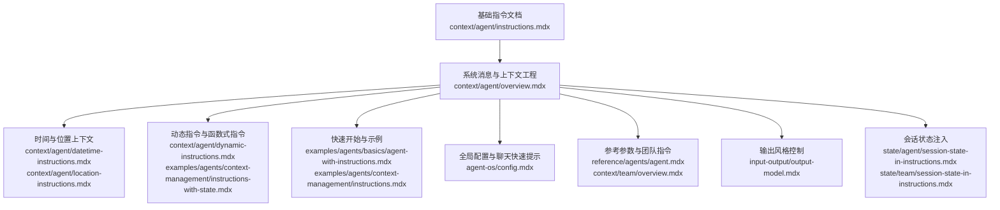
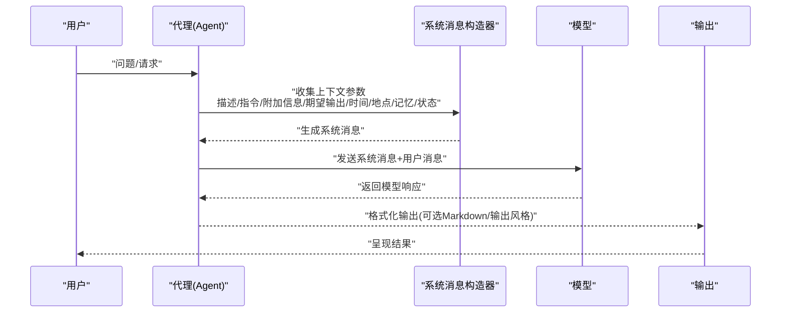
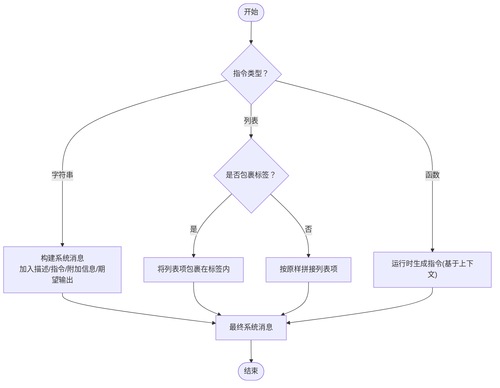
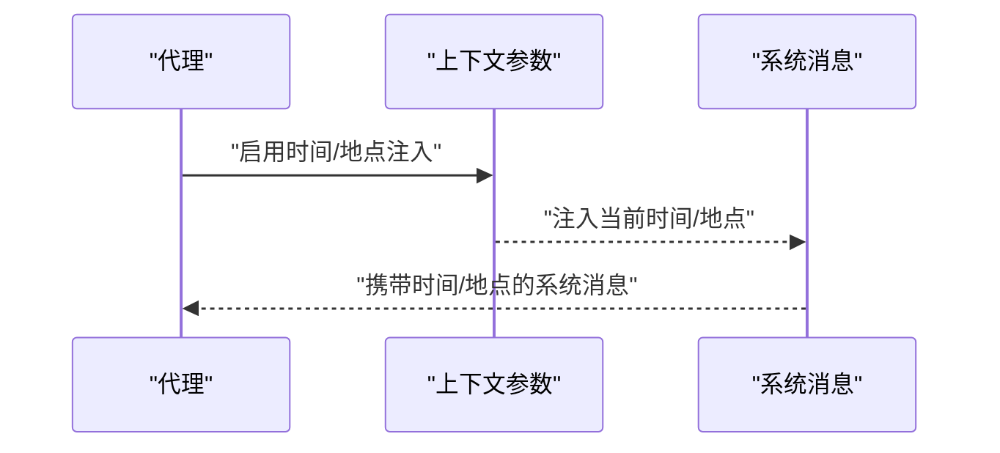
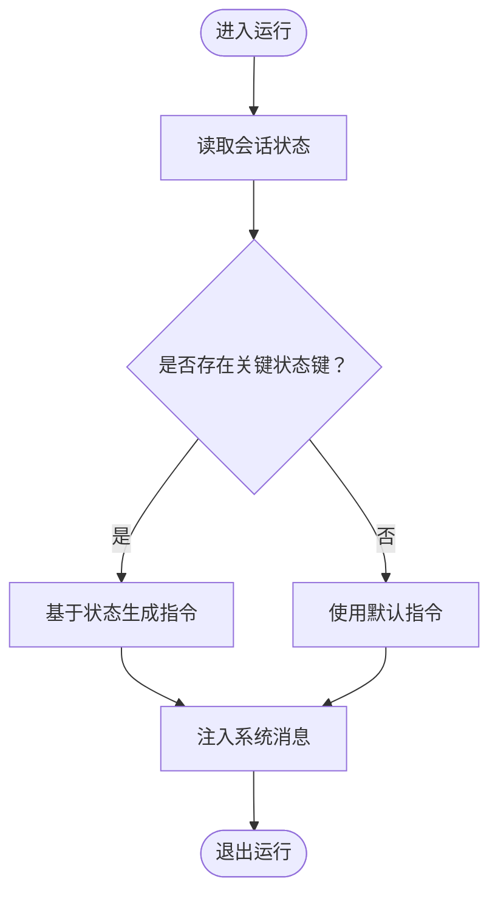
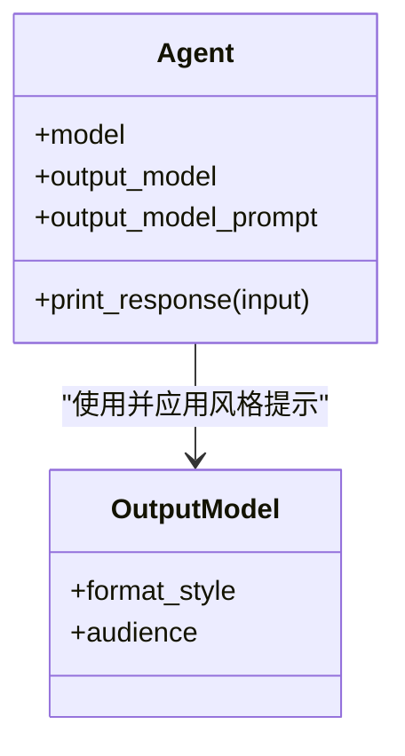
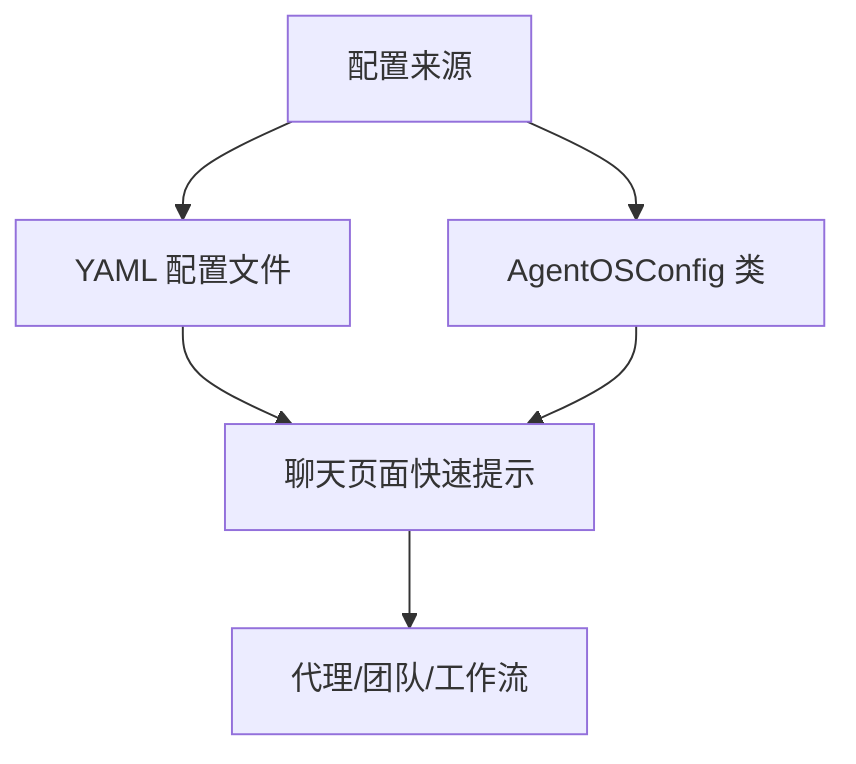
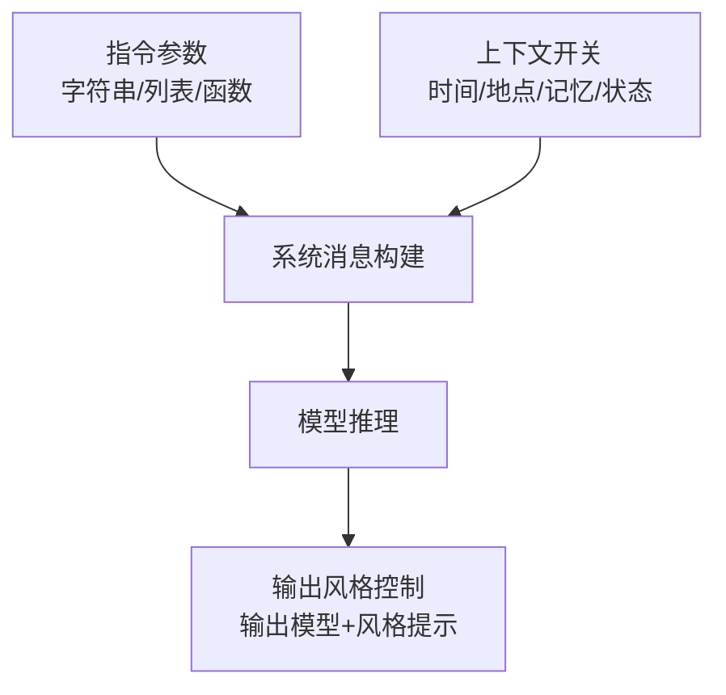

# 基础指令

<cite>
**本文引用的文件**
- [context/agent/instructions.mdx](file://context/agent/instructions.mdx)
- [context/agent/overview.mdx](file://context/agent/overview.mdx)
- [context/agent/datetime-instructions.mdx](file://context/agent/datetime-instructions.mdx)
- [context/agent/location-instructions.mdx](file://context/agent/location-instructions.mdx)
- [context/agent/dynamic-instructions.mdx](file://context/agent/dynamic-instructions.mdx)
- [examples/agents/basics/agent-with-instructions.mdx](file://examples/agents/basics/agent-with-instructions.mdx)
- [examples/agents/context-management/instructions.mdx](file://examples/agents/context-management/instructions.mdx)
- [examples/agents/context-management/instructions-with-state.mdx](file://examples/agents/context-management/instructions-with-state.mdx)
- [agent-os/config.mdx](file://agent-os/config.mdx)
- [reference/agents/agent.mdx](file://reference/agents/agent.mdx)
- [context/team/overview.mdx](file://context/team/overview.mdx)
- [input-output/output-model.mdx](file://input-output/output-model.mdx)
- [state/agent/session-state-in-instructions.mdx](file://state/agent/session-state-in-instructions.mdx)
- [state/team/session-state-in-instructions.mdx](file://state/team/session-state-in-instructions.mdx)
</cite>

## 目录
1. [简介](#简介)
2. [项目结构](#项目结构)
3. [核心组件](#核心组件)
4. [架构总览](#架构总览)
5. [详细组件分析](#详细组件分析)
6. [依赖关系分析](#依赖关系分析)
7. [性能考量](#性能考量)
8. [故障排除指南](#故障排除指南)
9. [结论](#结论)
10. [附录](#附录)

## 简介
本篇“基础指令”文档系统性阐述如何为代理（Agent）设置基础指令以引导其响应行为与叙述风格。内容覆盖指令参数的语法、配置选项、最佳实践，并结合仓库中的示例文件展示不同类型的指令对输出质量的影响。我们将解释指令在代理生命周期中的作用机制，以及如何通过精心设计的指令提升代理的准确性与一致性；同时提供常见使用场景与故障排除建议。

## 项目结构
围绕“基础指令”的知识分布在以下几类文档中：
- 指令与系统消息：context/agent/overview.mdx、context/agent/instructions.mdx
- 时间与位置上下文：context/agent/datetime-instructions.mdx、context/agent/location-instructions.mdx
- 动态指令：context/agent/dynamic-instructions.mdx、examples/agents/context-management/instructions-with-state.mdx
- 快速开始与示例：examples/agents/basics/agent-with-instructions.mdx、examples/agents/context-management/instructions.mdx
- 全局配置与聊天快速提示：agent-os/config.mdx
- 参考与参数定义：reference/agents/agent.mdx、context/team/overview.mdx
- 输出风格控制：input-output/output-model.mdx
- 会话状态注入：state/agent/session-state-in-instructions.mdx、state/team/session-state-in-instructions.mdx

**图表来源**
- [context/agent/instructions.mdx:1-53](file://context/agent/instructions.mdx#L1-L53)
- [context/agent/overview.mdx:1-523](file://context/agent/overview.mdx#L1-L523)
- [context/agent/datetime-instructions.mdx:1-61](file://context/agent/datetime-instructions.mdx#L1-L61)
- [context/agent/location-instructions.mdx:1-61](file://context/agent/location-instructions.mdx#L1-L61)
- [context/agent/dynamic-instructions.mdx:1-65](file://context/agent/dynamic-instructions.mdx#L1-L65)
- [examples/agents/basics/agent-with-instructions.mdx:1-47](file://examples/agents/basics/agent-with-instructions.mdx#L1-L47)
- [examples/agents/context-management/instructions.mdx:1-48](file://examples/agents/context-management/instructions.mdx#L1-L48)
- [agent-os/config.mdx:1-213](file://agent-os/config.mdx#L1-L213)
- [reference/agents/agent.mdx:69-72](file://reference/agents/agent.mdx#L69-L72)
- [context/team/overview.mdx:117-143](file://context/team/overview.mdx#L117-L143)
- [input-output/output-model.mdx:47-87](file://input-output/output-model.mdx#L47-L87)
- [state/agent/session-state-in-instructions.mdx](file://state/agent/session-state-in-instructions.mdx)
- [state/team/session-state-in-instructions.mdx](file://state/team/session-state-in-instructions.mdx)

**章节来源**
- [context/agent/instructions.mdx:1-53](file://context/agent/instructions.mdx#L1-L53)
- [context/agent/overview.mdx:1-523](file://context/agent/overview.mdx#L1-L523)

## 核心组件
- 指令参数与类型
  - 支持字符串、字符串列表、或可调用函数（运行时根据上下文动态生成）。参考参数定义与类型约束。
  - 可选择是否将指令包裹在特定标签中（如 XML 风格），以便某些模型更好地解析结构化指令。
- 系统消息构建
  - 描述（description）、指令（instructions）、附加信息（additional_information）、期望输出（expected_output）、Markdown 格式化等共同构成系统消息。
  - 可通过开关参数控制是否添加时间、地点、会话摘要、记忆、会话状态等上下文。
- 输出风格控制
  - 使用输出模型与输出风格提示（output_model_prompt）统一最终输出的语气、格式与受众。
- 团队指令
  - 团队（Team）同样支持指令与标签包裹策略，便于多智能体协作时保持一致的系统消息结构。

**章节来源**
- [reference/agents/agent.mdx:69-72](file://reference/agents/agent.mdx#L69-L72)
- [context/agent/overview.mdx:68-91](file://context/agent/overview.mdx#L68-L91)
- [context/team/overview.mdx:134-143](file://context/team/overview.mdx#L134-L143)
- [input-output/output-model.mdx:47-87](file://input-output/output-model.mdx#L47-L87)

## 架构总览
下图展示了从“用户输入/会话状态”到“系统消息构建”再到“模型推理与输出”的关键流程，以及“基础指令”在其中的位置与影响路径。

**图表来源**
- [context/agent/overview.mdx:92-171](file://context/agent/overview.mdx#L92-L171)
- [context/agent/datetime-instructions.mdx:1-61](file://context/agent/datetime-instructions.mdx#L1-L61)
- [context/agent/location-instructions.mdx:1-61](file://context/agent/location-instructions.mdx#L1-L61)
- [input-output/output-model.mdx:47-87](file://input-output/output-model.mdx#L47-L87)

## 详细组件分析

### 组件A：基础指令与系统消息
- 指令作为系统消息的核心组成部分，直接影响代理的行为边界与风格。可通过字符串、列表或函数三种方式提供。
- 当使用列表时，系统消息默认将指令包裹在特定标签内；也可关闭标签包裹以传递原生文本。
- 通过附加信息、期望输出、Markdown 开关等参数，进一步细化输出形态与交互体验。
- 示例：快速入门与示例展示了如何直接传入字符串或长段落指令，以及如何启用时间/地点上下文。

**图表来源**
- [context/agent/instructions.mdx:1-53](file://context/agent/instructions.mdx#L1-L53)
- [context/agent/overview.mdx:55-91](file://context/agent/overview.mdx#L55-L91)
- [examples/agents/basics/agent-with-instructions.mdx:1-47](file://examples/agents/basics/agent-with-instructions.mdx#L1-L47)

**章节来源**
- [context/agent/instructions.mdx:1-53](file://context/agent/instructions.mdx#L1-L53)
- [context/agent/overview.mdx:55-91](file://context/agent/overview.mdx#L55-L91)
- [examples/agents/basics/agent-with-instructions.mdx:1-47](file://examples/agents/basics/agent-with-instructions.mdx#L1-L47)

### 组件B：时间与位置上下文
- 通过开关参数将当前日期/时间与地理位置注入系统消息，使代理能够进行时区感知与本地化响应。
- 示例演示了如何开启时间与地点注入，并结合工具进行本地信息检索。

**图表来源**
- [context/agent/datetime-instructions.mdx:1-61](file://context/agent/datetime-instructions.mdx#L1-L61)
- [context/agent/location-instructions.mdx:1-61](file://context/agent/location-instructions.mdx#L1-L61)

**章节来源**
- [context/agent/datetime-instructions.mdx:1-61](file://context/agent/datetime-instructions.mdx#L1-L61)
- [context/agent/location-instructions.mdx:1-61](file://context/agent/location-instructions.mdx#L1-L61)

### 组件C：动态指令（基于会话状态）
- 将指令设计为函数，使其在每次运行时根据会话状态动态生成，实现个性化与情境化的行为。
- 示例展示了如何在运行上下文中读取会话状态并据此调整指令内容。

**图表来源**
- [context/agent/dynamic-instructions.mdx:1-65](file://context/agent/dynamic-instructions.mdx#L1-L65)
- [examples/agents/context-management/instructions-with-state.mdx:1-69](file://examples/agents/context-management/instructions-with-state.mdx#L1-L69)
- [state/agent/session-state-in-instructions.mdx](file://state/agent/session-state-in-instructions.mdx)
- [state/team/session-state-in-instructions.mdx](file://state/team/session-state-in-instructions.mdx)

**章节来源**
- [context/agent/dynamic-instructions.mdx:1-65](file://context/agent/dynamic-instructions.mdx#L1-L65)
- [examples/agents/context-management/instructions-with-state.mdx:1-69](file://examples/agents/context-management/instructions-with-state.mdx#L1-L69)
- [state/agent/session-state-in-instructions.mdx](file://state/agent/session-state-in-instructions.mdx)
- [state/team/session-state-in-instructions.mdx](file://state/team/session-state-in-instructions.mdx)

### 组件D：输出风格控制与一致性
- 使用输出模型与输出风格提示（output_model_prompt）统一最终输出的语气、格式与受众，避免模型默认风格带来的不一致。
- 示例展示了如何针对不同场景（如高管摘要、技术文档）设定不同的输出风格提示。

**图表来源**
- [input-output/output-model.mdx:47-87](file://input-output/output-model.mdx#L47-L87)

**章节来源**
- [input-output/output-model.mdx:47-87](file://input-output/output-model.mdx#L47-L87)

### 组件E：全局配置与聊天快速提示
- 通过 AgentOS 的配置能力，为聊天界面提供“快速提示”，从而在会话初始化阶段引导用户输入与代理行为。
- 配置既可通过 YAML 文件，也可通过配置类进行编程化管理。

**图表来源**
- [agent-os/config.mdx:1-213](file://agent-os/config.mdx#L1-L213)

**章节来源**
- [agent-os/config.mdx:1-213](file://agent-os/config.mdx#L1-L213)

## 依赖关系分析
- 参数耦合
  - 指令参数与系统消息构建紧密耦合：描述、指令、附加信息、期望输出、Markdown、时间/地点/记忆/状态等共同决定最终系统消息。
  - 指令标签包裹策略（add_instruction_tags/use_instruction_tags）影响系统消息的结构化程度。
- 运行期依赖
  - 动态指令依赖运行上下文（RunContext）与会话状态，确保每次运行都能生成贴合情境的指令。
- 输出风格依赖
  - 输出风格由输出模型与输出风格提示共同决定，与基础指令形成“意图—风格”的双层控制。

**图表来源**
- [context/agent/overview.mdx:68-91](file://context/agent/overview.mdx#L68-L91)
- [context/team/overview.mdx:134-143](file://context/team/overview.mdx#L134-L143)
- [input-output/output-model.mdx:47-87](file://input-output/output-model.mdx#L47-L87)

**章节来源**
- [context/agent/overview.mdx:68-91](file://context/agent/overview.mdx#L68-L91)
- [context/team/overview.mdx:134-143](file://context/team/overview.mdx#L134-L143)
- [input-output/output-model.mdx:47-87](file://input-output/output-model.mdx#L47-L87)

## 性能考量
- 上下文缓存与静态内容前缀
  - 在系统消息开头放置静态内容（如通用指令、期望输出描述）有助于利用模型侧的提示缓存，减少重复 token，降低延迟与成本。
- 工具调用历史裁剪
  - 通过限制从历史中加载的工具调用数量，可在长对话中控制上下文长度，避免超出上下文窗口。
- 输出风格预设
  - 明确的输出风格提示可减少模型在风格上的探索时间，提升稳定性和速度。

**章节来源**
- [context/agent/overview.mdx:502-517](file://context/agent/overview.mdx#L502-L517)
- [context/agent/overview.mdx:351-402](file://context/agent/overview.mdx#L351-L402)

## 故障排除指南
- 指令未生效或被忽略
  - 检查是否正确传入字符串、列表或函数；确认未误用禁用系统消息的开关。
  - 若使用某些模型提供商，可能需要移除系统消息或显式禁用自动生成的系统消息。
- 指令结构不符合预期
  - 若希望指令以结构化标签形式出现，启用标签包裹选项；否则将按原样拼接。
- 输出风格不一致
  - 为输出模型设置明确的风格提示；避免仅依赖模型默认风格。
- 动态指令无效
  - 确保在运行时正确传入会话状态；检查函数签名与返回值类型。
- 时间/地点上下文异常
  - 确认已启用相应开关并正确设置时区标识；检查工具链是否支持地理信息检索。

**章节来源**
- [context/agent/overview.mdx:265-283](file://context/agent/overview.mdx#L265-L283)
- [context/agent/overview.mdx:55-66](file://context/agent/overview.mdx#L55-L66)
- [input-output/output-model.mdx:76-87](file://input-output/output-model.mdx#L76-L87)
- [context/agent/datetime-instructions.mdx:1-61](file://context/agent/datetime-instructions.mdx#L1-L61)
- [context/agent/location-instructions.mdx:1-61](file://context/agent/location-instructions.mdx#L1-L61)

## 结论
基础指令是塑造代理行为与风格的关键入口。通过合理组织指令参数、系统消息构建开关、动态指令与输出风格提示，并结合时间/地点等上下文增强，可以在保证一致性的同时显著提升代理的准确性与用户体验。建议在实际项目中：
- 将通用指令与期望输出固化为静态内容，置于系统消息前部以利缓存；
- 使用函数式指令承载个性化逻辑，确保每次运行都能贴合当前上下文；
- 明确输出风格提示，统一语气与格式；
- 谨慎使用上下文开关，避免过度膨胀导致成本上升与性能下降。

## 附录
- 快速参考
  - 指令参数类型与标签包裹策略：参见参数表与团队指令说明。
  - 输出风格控制：参见输出模型与风格提示文档。
  - 全局配置与聊天快速提示：参见 AgentOS 配置文档。

**章节来源**
- [reference/agents/agent.mdx:69-72](file://reference/agents/agent.mdx#L69-L72)
- [context/team/overview.mdx:134-143](file://context/team/overview.mdx#L134-L143)
- [input-output/output-model.mdx:47-87](file://input-output/output-model.mdx#L47-L87)
- [agent-os/config.mdx:1-213](file://agent-os/config.mdx#L1-L213)