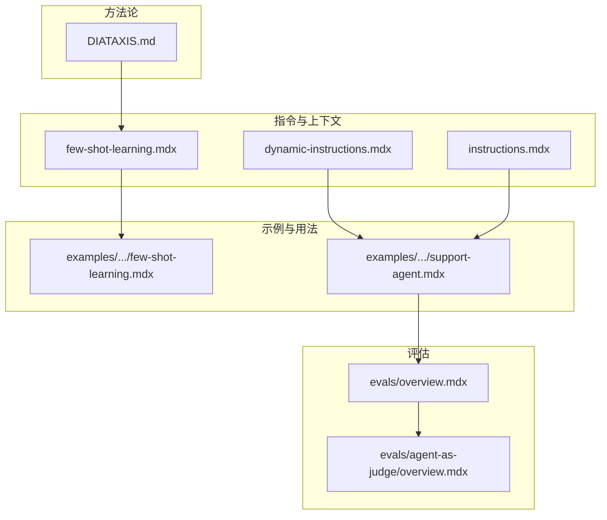
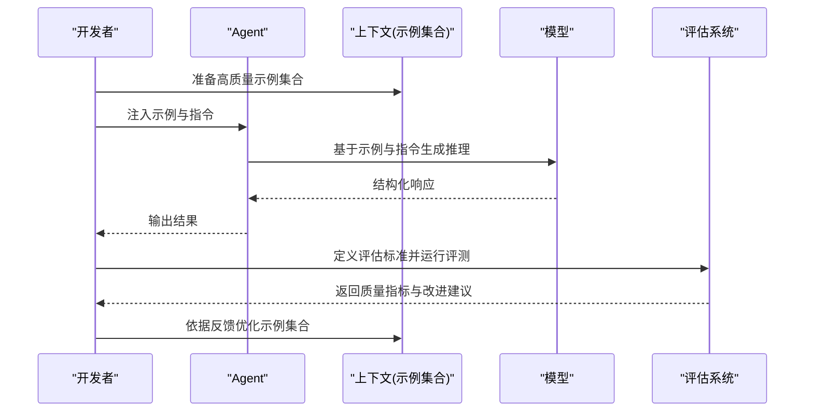
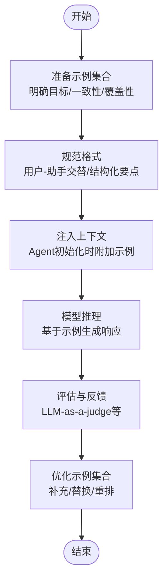
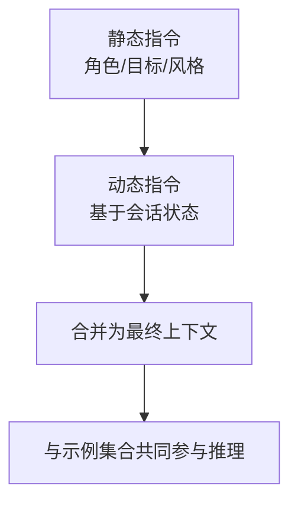
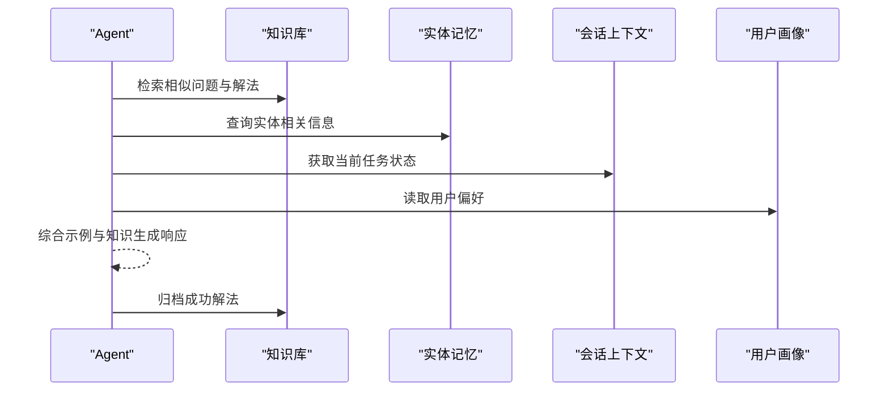
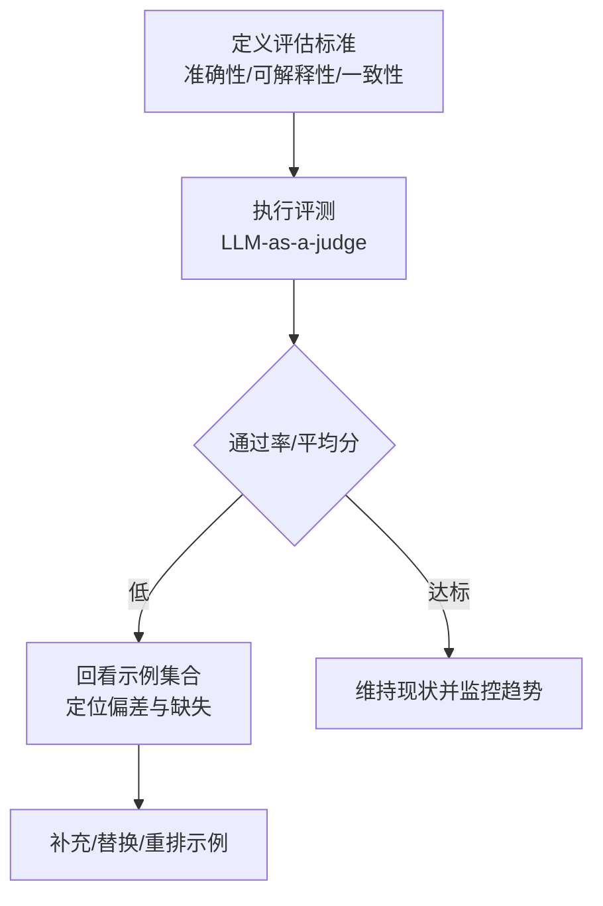
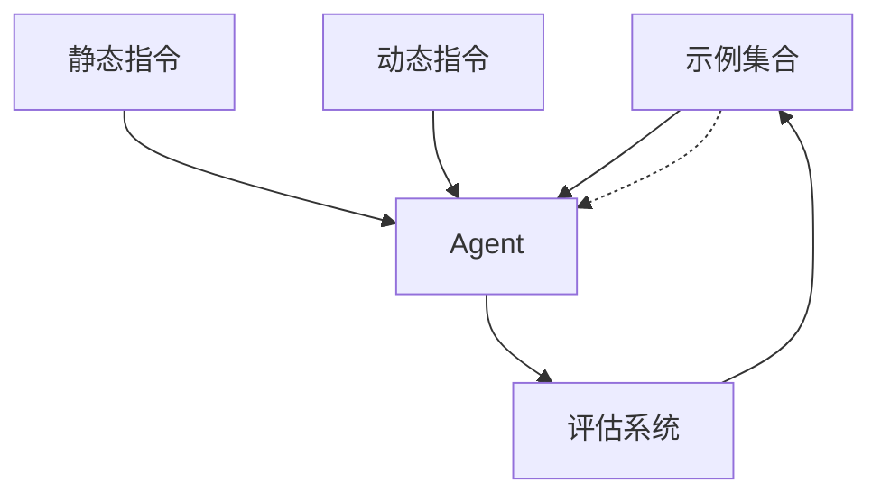

# 少样本学习指令

<cite>
**本文引用的文件**
- [context/agent/few-shot-learning.mdx](file://context/agent/few-shot-learning.mdx)
- [examples/agents/context-management/few-shot-learning.mdx](file://examples/agents/context-management/few-shot-learning.mdx)
- [examples/learning/patterns/support-agent.mdx](file://examples/learning/patterns/support-agent.mdx)
- [evals/overview.mdx](file://evals/overview.mdx)
- [evals/agent-as-judge/overview.mdx](file://evals/agent-as-judge/overview.mdx)
- [context/agent/dynamic-instructions.mdx](file://context/agent/dynamic-instructions.mdx)
- [context/agent/instructions.mdx](file://context/agent/instructions.mdx)
- [DIATAXIS.md](file://DIATAXIS.md)
</cite>

## 目录
1. [引言](#引言)
2. [项目结构](#项目结构)
3. [核心组件](#核心组件)
4. [架构总览](#架构总览)
5. [详细组件分析](#详细组件分析)
6. [依赖关系分析](#依赖关系分析)
7. [性能考量](#性能考量)
8. [故障排查指南](#故障排查指南)
9. [结论](#结论)
10. [附录](#附录)

## 引言
本文件围绕“少样本学习指令”展开，系统阐述如何通过示例演示来指导代理（Agent）的学习与推理过程。内容涵盖少样本指令的设计原则、示例选择策略与格式要求，结合仓库中的真实示例讲解如何构建高质量示例集以提升代理性能，并解释少样本学习的工作原理、适用场景及常见陷阱。最后提供示例质量评估与优化建议，帮助读者在实践中稳定获得可复现的效果。

## 项目结构
本主题涉及的文档主要分布在以下区域：
- 指令与上下文：context/agent 下的 few-shot-learning.mdx、dynamic-instructions.mdx、instructions.mdx
- 示例与用法：examples/agents/context-management/few-shot-learning.mdx
- 学习模式与实战：examples/learning/patterns/support-agent.mdx
- 评估体系：evals/overview.mdx、evals/agent-as-judge/overview.mdx
- 内容组织方法论：DIATAXIS.md

下图给出与“少样本学习指令”相关的内容分布概览：

**图表来源**
- [context/agent/few-shot-learning.mdx:1-144](file://context/agent/few-shot-learning.mdx#L1-L144)
- [examples/agents/context-management/few-shot-learning.mdx:1-119](file://examples/agents/context-management/few-shot-learning.mdx#L1-L119)
- [examples/learning/patterns/support-agent.mdx:1-146](file://examples/learning/patterns/support-agent.mdx#L1-L146)
- [evals/overview.mdx:27-65](file://evals/overview.mdx#L27-L65)
- [evals/agent-as-judge/overview.mdx:93-100](file://evals/agent-as-judge/overview.mdx#L93-L100)
- [DIATAXIS.md:30-57](file://DIATAXIS.md#L30-L57)

**章节来源**
- [context/agent/few-shot-learning.mdx:1-144](file://context/agent/few-shot-learning.mdx#L1-L144)
- [examples/agents/context-management/few-shot-learning.mdx:1-119](file://examples/agents/context-management/few-shot-learning.mdx#L1-L119)
- [examples/learning/patterns/support-agent.mdx:1-146](file://examples/learning/patterns/support-agent.mdx#L1-L146)
- [evals/overview.mdx:27-65](file://evals/overview.mdx#L27-L65)
- [evals/agent-as-judge/overview.mdx:93-100](file://evals/agent-as-judge/overview.mdx#L93-L100)
- [DIATAXIS.md:30-57](file://DIATAXIS.md#L30-L57)

## 核心组件
- 少样本示例集合：通过在 Agent 的上下文中注入一组高质量的“用户-助手”对话示例，引导模型遵循一致的响应风格与步骤化输出。
- 动态指令与静态指令：指令用于设定角色、语气与目标；动态指令可根据会话状态实时调整，增强个性化与情境适配能力。
- 学习与知识存储：在实战中结合用户画像、会话上下文、实体记忆与已学知识库，形成“示例驱动 + 记忆增强”的闭环。
- 评估与反馈：使用 LLM-as-a-judge 等评估维度对示例质量与代理表现进行量化与持续改进。

**章节来源**
- [context/agent/few-shot-learning.mdx:19-81](file://context/agent/few-shot-learning.mdx#L19-L81)
- [context/agent/dynamic-instructions.mdx:13-24](file://context/agent/dynamic-instructions.mdx#L13-L24)
- [context/agent/instructions.mdx:9-14](file://context/agent/instructions.mdx#L9-L14)
- [examples/learning/patterns/support-agent.mdx:55-84](file://examples/learning/patterns/support-agent.mdx#L55-L84)
- [evals/overview.mdx:51-65](file://evals/overview.mdx#L51-L65)

## 架构总览
下图展示了“少样本学习指令”的端到端工作流：从示例准备、注入上下文，到代理推理与输出，再到评估与迭代优化。

**图表来源**
- [context/agent/few-shot-learning.mdx:83-103](file://context/agent/few-shot-learning.mdx#L83-L103)
- [examples/agents/context-management/few-shot-learning.mdx:88-104](file://examples/agents/context-management/few-shot-learning.mdx#L88-L104)
- [evals/agent-as-judge/overview.mdx:93-100](file://evals/agent-as-judge/overview.mdx#L93-L100)

## 详细组件分析

### 组件A：少样本示例集合设计与注入
- 设计原则
  - 明确目标：每个示例聚焦一个具体问题或任务片段，便于模型归纳模式。
  - 一致性：统一的结构化输出风格（如分步说明、风险提示、验证方式等），减少歧义。
  - 覆盖性：覆盖典型场景与边界情况，确保泛化能力。
  - 可解释性：示例应清晰标注期望行为与验证点，便于评估与回溯。
- 示例选择策略
  - 代表性优先：优先选择高价值、高频发问的场景。
  - 多样性平衡：兼顾不同口吻、设备、网络环境等变量。
  - 迭代更新：基于真实交互与评估结果持续补充与替换低质量示例。
- 格式要求
  - 使用“用户-助手”交替消息，语义完整且可复现。
  - 输出采用结构化要点与可操作步骤，必要时提供验证与回退方案。
- 实战参考
  - 在 Agent 初始化时通过上下文参数注入示例集合，随后对新输入进行推理与输出。

**图表来源**
- [context/agent/few-shot-learning.mdx:19-81](file://context/agent/few-shot-learning.mdx#L19-L81)
- [examples/agents/context-management/few-shot-learning.mdx:20-82](file://examples/agents/context-management/few-shot-learning.mdx#L20-L82)
- [evals/overview.mdx:27-65](file://evals/overview.mdx#L27-L65)

**章节来源**
- [context/agent/few-shot-learning.mdx:19-81](file://context/agent/few-shot-learning.mdx#L19-L81)
- [examples/agents/context-management/few-shot-learning.mdx:20-82](file://examples/agents/context-management/few-shot-learning.mdx#L20-L82)

### 组件B：动态指令与静态指令协同
- 静态指令：用于设定角色、语气与通用目标，保证代理行为的一致性。
- 动态指令：根据会话状态（如当前用户、历史交互）实时调整，提升个性化与情境适配。
- 协同策略
  - 将静态指令作为“基线”，动态指令作为“微调器”，在不破坏示例模式的前提下增强灵活性。
  - 对动态部分进行可观测与可审计，避免漂移导致的输出不稳定。

**图表来源**
- [context/agent/dynamic-instructions.mdx:13-24](file://context/agent/dynamic-instructions.mdx#L13-L24)
- [context/agent/instructions.mdx:9-14](file://context/agent/instructions.mdx#L9-L14)

**章节来源**
- [context/agent/dynamic-instructions.mdx:13-24](file://context/agent/dynamic-instructions.mdx#L13-L24)
- [context/agent/instructions.mdx:9-14](file://context/agent/instructions.mdx#L9-L14)

### 组件C：学习与知识存储的实战应用
- 多存储融合
  - 用户画像：记录用户偏好与历史，支撑个性化响应。
  - 会话上下文：跟踪当前任务状态与决策进展。
  - 实体记忆：沉淀产品、工单等实体信息，实现跨会话共享。
  - 已学知识：将成功解决方案结构化入库，供后续检索与复用。
- 工作流程
  - 代理在推理过程中检索相似问题与历史解法，结合示例与知识库给出结构化建议。
  - 成功案例自动归档至已学知识库，形成正向循环。

**图表来源**
- [examples/learning/patterns/support-agent.mdx:55-84](file://examples/learning/patterns/support-agent.mdx#L55-L84)
- [examples/learning/patterns/support-agent.mdx:91-129](file://examples/learning/patterns/support-agent.mdx#L91-L129)

**章节来源**
- [examples/learning/patterns/support-agent.mdx:55-84](file://examples/learning/patterns/support-agent.mdx#L55-L84)
- [examples/learning/patterns/support-agent.mdx:91-129](file://examples/learning/patterns/support-agent.mdx#L91-L129)

### 组件D：示例质量评估与优化
- 评估维度
  - 准确性：是否正确理解任务并给出有效步骤。
  - 可解释性：输出是否包含验证与回退方案。
  - 一致性：风格与术语是否与示例集合保持一致。
- 评分策略
  - 数值评分（如1-10）或二元判定（通过/失败），并支持阈值与回调。
- 优化路径
  - 基于评估结果回看示例集合，识别偏差与缺失场景，补充代表性样本与边界用例。

**图表来源**
- [evals/overview.mdx:27-65](file://evals/overview.mdx#L27-L65)
- [evals/agent-as-judge/overview.mdx:93-100](file://evals/agent-as-judge/overview.mdx#L93-L100)

**章节来源**
- [evals/overview.mdx:27-65](file://evals/overview.mdx#L27-L65)
- [evals/agent-as-judge/overview.mdx:93-100](file://evals/agent-as-judge/overview.mdx#L93-L100)

## 依赖关系分析
- 组件耦合
  - 示例集合与指令共同决定代理的推理起点；动态指令与静态指令需协同，避免冲突。
  - 学习存储与示例集合相互促进：高质量示例提升检索效果，成功案例反哺示例集合。
- 外部依赖
  - 评估系统依赖统一的评分策略与标准，确保可比性与可重复性。
- 潜在风险
  - 示例过多或过杂可能导致模型混淆；需定期清理与重排。
  - 动态指令变化过大可能破坏示例模式，需引入版本化与灰度策略。

**图表来源**
- [context/agent/few-shot-learning.mdx:83-103](file://context/agent/few-shot-learning.mdx#L83-L103)
- [context/agent/dynamic-instructions.mdx:13-24](file://context/agent/dynamic-instructions.mdx#L13-L24)
- [evals/overview.mdx:27-65](file://evals/overview.mdx#L27-L65)

**章节来源**
- [context/agent/few-shot-learning.mdx:83-103](file://context/agent/few-shot-learning.mdx#L83-L103)
- [context/agent/dynamic-instructions.mdx:13-24](file://context/agent/dynamic-instructions.mdx#L13-L24)
- [evals/overview.mdx:27-65](file://evals/overview.mdx#L27-L65)

## 性能考量
- 示例规模与质量的权衡：示例数量并非越多越好，需关注代表性与多样性。
- 上下文长度限制：示例集合应控制在模型上下文窗口内，必要时采用摘要或分段策略。
- 推理稳定性：通过一致的结构化输出与严格的评估标准，降低输出波动。
- 迭代效率：建立“示例-评估-优化”的快速闭环，缩短从发现问题到修复落地的时间。

## 故障排查指南
- 症状：代理输出与示例风格不符
  - 排查：检查示例集合是否覆盖目标场景；确认指令与示例风格一致。
  - 处置：补充代表性示例，强化结构化要点与验证步骤。
- 症状：动态指令导致输出漂移
  - 排查：核对动态指令的触发条件与状态依赖。
  - 处置：引入版本化与灰度策略，逐步放开变更范围。
- 症状：评估分数偏低
  - 排查：审视评估标准与阈值设置；检查示例集合是否存在偏差。
  - 处置：调整评分策略或补充示例，持续监控趋势。

**章节来源**
- [context/agent/few-shot-learning.mdx:83-103](file://context/agent/few-shot-learning.mdx#L83-L103)
- [context/agent/dynamic-instructions.mdx:13-24](file://context/agent/dynamic-instructions.mdx#L13-L24)
- [evals/overview.mdx:51-65](file://evals/overview.mdx#L51-L65)

## 结论
少样本学习指令的核心在于“以示例为先驱，以评估为后盾”。通过精心设计的示例集合、稳定的指令体系与持续的评估优化，代理能够在复杂任务中快速收敛到高质量、可复现的行为模式。在实战中，建议将示例驱动与多存储学习相结合，形成“示例-知识-评估”的闭环，从而在真实场景中稳步提升性能与可靠性。

## 附录
- 方法论参考：内容组织强调“先示范、再解释”的教学风格，有助于读者在实践中更快上手。
- 快速开始建议
  - 从少量高代表性示例入手，确保结构化输出与验证步骤明确。
  - 引入评估维度，建立可量化的质量门槛。
  - 将成功案例归档至知识库，形成可复用的“经验资产”。

**章节来源**
- [DIATAXIS.md:30-57](file://DIATAXIS.md#L30-L57)