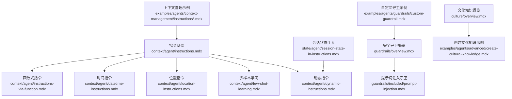
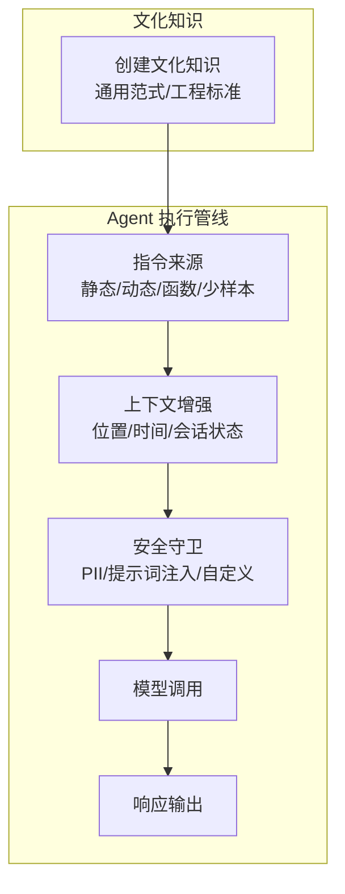
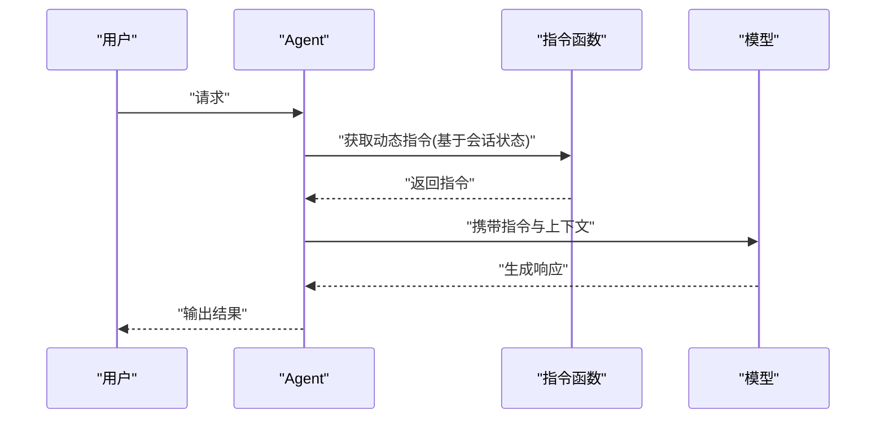
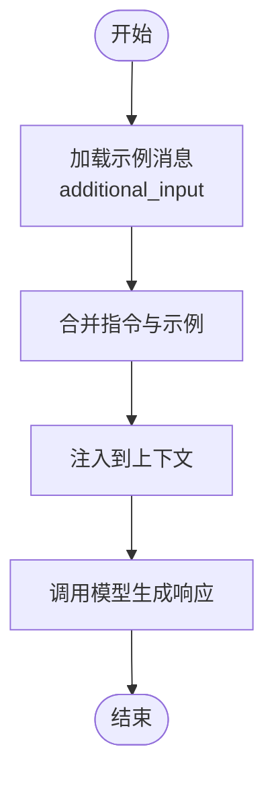
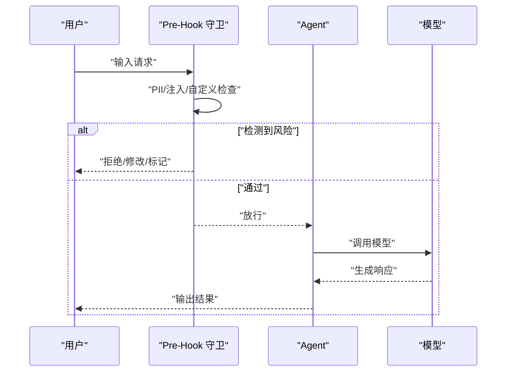
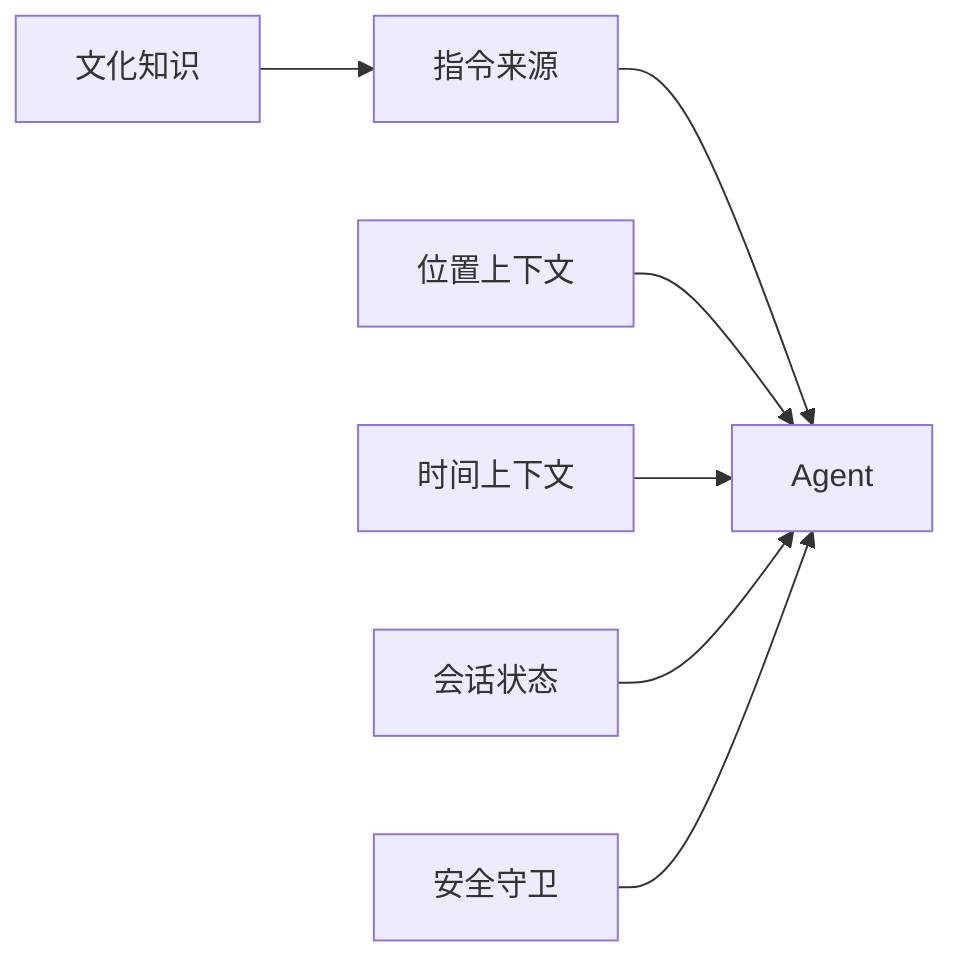

# 指令系统

<cite>
**本文引用的文件**
- [context/agent/instructions.mdx](file://context/agent/instructions.mdx)
- [context/agent/dynamic-instructions.mdx](file://context/agent/dynamic-instructions.mdx)
- [context/agent/few-shot-learning.mdx](file://context/agent/few-shot-learning.mdx)
- [context/agent/location-instructions.mdx](file://context/agent/location-instructions.mdx)
- [context/agent/datetime-instructions.mdx](file://context/agent/datetime-instructions.mdx)
- [context/agent/instructions-via-function.mdx](file://context/agent/instructions-via-function.mdx)
- [examples/agents/basics/agent-with-instructions.mdx](file://examples/agents/basics/agent-with-instructions.mdx)
- [examples/agents/context-management/instructions.mdx](file://examples/agents/context-management/instructions.mdx)
- [examples/agents/context-management/instructions-with-state.mdx](file://examples/agents/context-management/instructions-with-state.mdx)
- [state/agent/session-state-in-instructions.mdx](file://state/agent/session-state-in-instructions.mdx)
- [guardrails/overview.mdx](file://guardrails/overview.mdx)
- [guardrails/included/prompt-injection.mdx](file://guardrails/included/prompt-injection.mdx)
- [reference/hooks/base-guardrail.mdx](file://reference/hooks/base-guardrail.mdx)
- [examples/agents/guardrails/custom-guardrail.mdx](file://examples/agents/guardrails/custom-guardrail.mdx)
- [examples/agents/guardrails/overview.mdx](file://examples/agents/guardrails/overview.mdx)
- [culture/overview.mdx](file://culture/overview.mdx)
- [examples/agents/advanced/create-cultural-knowledge.mdx](file://examples/agents/advanced/create-cultural-knowledge.mdx)
</cite>

## 目录
1. [引言](#引言)
2. [项目结构](#项目结构)
3. [核心组件](#核心组件)
4. [架构总览](#架构总览)
5. [详细组件分析](#详细组件分析)
6. [依赖关系分析](#依赖关系分析)
7. [性能考量](#性能考量)
8. [故障排查指南](#故障排查指南)
9. [结论](#结论)
10. [附录](#附录)

## 引言
本文件系统性梳理并讲解“指令系统”的设计与应用，覆盖静态指令、动态指令、少样本学习（Few-Shot）、位置指令与时间指令等类型，并结合会话状态、文化知识与安全守卫（Guardrails）等扩展能力，帮助读者理解如何通过指令工程提升代理的准确性与可靠性。文档以仓库中的示例与参考材料为基础，提供可操作的配置方法、组合策略与最佳实践。

## 项目结构
围绕指令系统的关键资料主要分布在以下区域：
- 指令基础与示例：context/agent 下的各类指令主题示例
- 上下文增强：时间、位置、会话状态注入
- 安全守卫：输入校验与提示词注入防护
- 文化知识：组织级指导原则与通用范式沉淀
- 示例与用法：cookbook 与 examples 中的实战案例

图表来源
- [context/agent/instructions.mdx:1-53](file://context/agent/instructions.mdx#L1-L53)
- [context/agent/dynamic-instructions.mdx:1-65](file://context/agent/dynamic-instructions.mdx#L1-L65)
- [context/agent/few-shot-learning.mdx:1-144](file://context/agent/few-shot-learning.mdx#L1-L144)
- [context/agent/location-instructions.mdx:1-61](file://context/agent/location-instructions.mdx#L1-L61)
- [context/agent/datetime-instructions.mdx:1-61](file://context/agent/datetime-instructions.mdx#L1-L61)
- [context/agent/instructions-via-function.mdx:1-69](file://context/agent/instructions-via-function.mdx#L1-L69)
- [examples/agents/context-management/instructions.mdx:1-48](file://examples/agents/context-management/instructions.mdx#L1-L48)
- [examples/agents/context-management/instructions-with-state.mdx:1-69](file://examples/agents/context-management/instructions-with-state.mdx#L1-L69)
- [state/agent/session-state-in-instructions.mdx:1-47](file://state/agent/session-state-in-instructions.mdx#L1-L47)
- [guardrails/overview.mdx:1-149](file://guardrails/overview.mdx#L1-L149)
- [guardrails/included/prompt-injection.mdx:1-64](file://guardrails/included/prompt-injection.mdx#L1-L64)
- [examples/agents/guardrails/custom-guardrail.mdx:1-44](file://examples/agents/guardrails/custom-guardrail.mdx#L1-L44)
- [culture/overview.mdx:257-287](file://culture/overview.mdx#L257-L287)
- [examples/agents/advanced/create-cultural-knowledge.mdx:33-59](file://examples/agents/advanced/create-cultural-knowledge.mdx#L33-L59)

章节来源
- [context/agent/instructions.mdx:1-53](file://context/agent/instructions.mdx#L1-L53)
- [context/agent/dynamic-instructions.mdx:1-65](file://context/agent/dynamic-instructions.mdx#L1-L65)
- [context/agent/few-shot-learning.mdx:1-144](file://context/agent/few-shot-learning.mdx#L1-L144)
- [context/agent/location-instructions.mdx:1-61](file://context/agent/location-instructions.mdx#L1-L61)
- [context/agent/datetime-instructions.mdx:1-61](file://context/agent/datetime-instructions.mdx#L1-L61)
- [context/agent/instructions-via-function.mdx:1-69](file://context/agent/instructions-via-function.mdx#L1-L69)
- [examples/agents/context-management/instructions.mdx:1-48](file://examples/agents/context-management/instructions.mdx#L1-L48)
- [examples/agents/context-management/instructions-with-state.mdx:1-69](file://examples/agents/context-management/instructions-with-state.mdx#L1-L69)
- [state/agent/session-state-in-instructions.mdx:1-47](file://state/agent/session-state-in-instructions.mdx#L1-L47)
- [guardrails/overview.mdx:1-149](file://guardrails/overview.mdx#L1-L149)
- [guardrails/included/prompt-injection.mdx:1-64](file://guardrails/included/prompt-injection.mdx#L1-L64)
- [examples/agents/guardrails/custom-guardrail.mdx:1-44](file://examples/agents/guardrails/custom-guardrail.mdx#L1-L44)
- [culture/overview.mdx:257-287](file://culture/overview.mdx#L257-L287)
- [examples/agents/advanced/create-cultural-knowledge.mdx:33-59](file://examples/agents/advanced/create-cultural-knowledge.mdx#L33-L59)

## 核心组件
- 静态指令：直接传入字符串或字符串列表，作为固定的系统提示词，用于约束回答风格、角色设定与输出格式。
- 动态指令：通过函数在运行时根据会话状态、用户信息等生成指令，实现个性化与上下文感知。
- 少样本学习：通过 additional_input 注入示例消息，引导模型遵循特定模式，常用于客户服务、技术排障等场景。
- 位置与时间指令：启用 add_location_to_context 与 add_datetime_to_context，向上下文注入地理与时间信息，使响应具备时效性与地域相关性。
- 函数式指令：以函数返回指令列表的方式，允许访问 Agent 属性，实现更灵活的指令生成。
- 会话状态注入：在指令模板中直接引用 session_state 变量，实现参数化指令。
- 安全守卫（Guardrails）：在预处理阶段拦截潜在风险输入，如 PII 泄露、提示词注入等。
- 文化知识：沉淀组织级的沟通范式、工程标准与通用原则，作为长期可用的“指令”资源。

章节来源
- [context/agent/instructions.mdx:1-53](file://context/agent/instructions.mdx#L1-L53)
- [context/agent/dynamic-instructions.mdx:1-65](file://context/agent/dynamic-instructions.mdx#L1-L65)
- [context/agent/few-shot-learning.mdx:1-144](file://context/agent/few-shot-learning.mdx#L1-L144)
- [context/agent/location-instructions.mdx:1-61](file://context/agent/location-instructions.mdx#L1-L61)
- [context/agent/datetime-instructions.mdx:1-61](file://context/agent/datetime-instructions.mdx#L1-L61)
- [context/agent/instructions-via-function.mdx:1-69](file://context/agent/instructions-via-function.mdx#L1-L69)
- [state/agent/session-state-in-instructions.mdx:1-47](file://state/agent/session-state-in-instructions.mdx#L1-L47)
- [guardrails/overview.mdx:1-149](file://guardrails/overview.mdx#L1-L149)
- [culture/overview.mdx:257-287](file://culture/overview.mdx#L257-L287)

## 架构总览
下图展示了“指令系统”的关键组成与交互路径：Agent 接收指令来源（静态/动态/函数/示例），结合上下文增强（位置/时间/会话状态），在执行前通过 Guardrails 进行安全检查，并最终驱动模型生成响应。

图表来源
- [context/agent/instructions.mdx:1-53](file://context/agent/instructions.mdx#L1-L53)
- [context/agent/dynamic-instructions.mdx:1-65](file://context/agent/dynamic-instructions.mdx#L1-L65)
- [context/agent/few-shot-learning.mdx:1-144](file://context/agent/few-shot-learning.mdx#L1-L144)
- [context/agent/location-instructions.mdx:1-61](file://context/agent/location-instructions.mdx#L1-L61)
- [context/agent/datetime-instructions.mdx:1-61](file://context/agent/datetime-instructions.mdx#L1-L61)
- [guardrails/overview.mdx:1-149](file://guardrails/overview.mdx#L1-L149)
- [examples/agents/advanced/create-cultural-knowledge.mdx:33-59](file://examples/agents/advanced/create-cultural-knowledge.mdx#L33-L59)

## 详细组件分析

### 静态指令
- 语法与配置
  - 支持字符串或字符串列表形式；适合固定角色、风格与格式要求。
  - 在 Agent 初始化时通过 instructions 参数传入。
- 应用场景
  - 约束回答长度、语气、格式（如要点式、Markdown）。
- 组合建议
  - 与 add_datetime_to_context、markdown 等选项配合，统一输出风格。
- 示例路径
  - [basic instructions 示例:1-53](file://context/agent/instructions.mdx#L1-L53)
  - [quickstart 指令示例:1-47](file://examples/agents/basics/agent-with-instructions.mdx#L1-L47)

章节来源
- [context/agent/instructions.mdx:1-53](file://context/agent/instructions.mdx#L1-L53)
- [examples/agents/basics/agent-with-instructions.mdx:1-47](file://examples/agents/basics/agent-with-instructions.mdx#L1-L47)

### 动态指令
- 语法与配置
  - 通过函数接收 RunContext 或 Agent 对象，按会话状态/用户信息动态生成指令。
  - 典型入口：Agent(instructions=get_instructions)。
- 应用场景
  - 个性化故事主题、多租户差异化策略、任务上下文切换。
- 组合建议
  - 与 session_state 结合，实现模板化指令；与工具链联动，提供上下文检索支持。
- 示例路径
  - [dynamic instructions 示例:1-65](file://context/agent/dynamic-instructions.mdx#L1-L65)
  - [instructions via function 示例:1-69](file://context/agent/instructions-via-function.mdx#L1-L69)
  - [instructions with state 示例:1-69](file://examples/agents/context-management/instructions-with-state.mdx#L1-L69)

图表来源
- [context/agent/dynamic-instructions.mdx:9-25](file://context/agent/dynamic-instructions.mdx#L9-L25)
- [context/agent/instructions-via-function.mdx:9-29](file://context/agent/instructions-via-function.mdx#L9-L29)
- [examples/agents/context-management/instructions-with-state.mdx:21-54](file://examples/agents/context-management/instructions-with-state.mdx#L21-L54)

章节来源
- [context/agent/dynamic-instructions.mdx:1-65](file://context/agent/dynamic-instructions.mdx#L1-L65)
- [context/agent/instructions-via-function.mdx:1-69](file://context/agent/instructions-via-function.mdx#L1-L69)
- [examples/agents/context-management/instructions-with-state.mdx:1-69](file://examples/agents/context-management/instructions-with-state.mdx#L1-L69)

### 少样本学习（Few-Shot）
- 语法与配置
  - 使用 additional_input 注入示例消息（Message 列表），配合 instructions 提供范式与约束。
  - 常见于客户服务、技术排障等需要一致化输出风格的场景。
- 应用场景
  - 快速对齐期望输出结构（步骤化、要点式、Markdown）。
- 组合建议
  - 与静态/动态指令结合，先定基调再给范例；必要时加入 Guardrails 确保一致性。
- 示例路径
  - [few-shot learning 示例:1-144](file://context/agent/few-shot-learning.mdx#L1-L144)

图表来源
- [context/agent/few-shot-learning.mdx:83-104](file://context/agent/few-shot-learning.mdx#L83-L104)

章节来源
- [context/agent/few-shot-learning.mdx:1-144](file://context/agent/few-shot-learning.mdx#L1-L144)

### 位置指令
- 语法与配置
  - 启用 add_location_to_context，自动注入地理信息；可搭配工具（如本地新闻）进行检索增强。
- 应用场景
  - 地点问答、本地资讯检索、区域化服务推荐。
- 组合建议
  - 与动态指令结合，按用户位置动态调整角色与输出重点。
- 示例路径
  - [location instructions 示例:1-61](file://context/agent/location-instructions.mdx#L1-L61)

章节来源
- [context/agent/location-instructions.mdx:1-61](file://context/agent/location-instructions.mdx#L1-L61)

### 时间指令
- 语法与配置
  - 启用 add_datetime_to_context 并设置 timezone_identifier，使模型具备时间意识。
- 应用场景
  - 实时事件查询、节假日提醒、时区换算、日程相关问答。
- 组合建议
  - 与上下文管理示例配合，确保时区与当前时间一致。
- 示例路径
  - [datetime instructions 示例:1-61](file://context/agent/datetime-instructions.mdx#L1-L61)
  - [上下文管理 instructions 示例:1-48](file://examples/agents/context-management/instructions.mdx#L1-L48)

章节来源
- [context/agent/datetime-instructions.mdx:1-61](file://context/agent/datetime-instructions.mdx#L1-L61)
- [examples/agents/context-management/instructions.mdx:1-48](file://examples/agents/context-management/instructions.mdx#L1-L48)

### 函数式指令与会话状态
- 语法与配置
  - 函数式指令：Agent(instructions=get_instructions)，在函数内访问 Agent 属性或 RunContext。
  - 会话状态注入：在指令模板中使用 session_state 变量占位符。
- 应用场景
  - 多变角色扮演、跨任务角色适配、个性化问候与背景设定。
- 组合建议
  - 将文化知识与会话状态结合，形成可复用的“角色模板”。
- 示例路径
  - [instructions via function 示例:1-69](file://context/agent/instructions-via-function.mdx#L1-L69)
  - [session state in instructions 示例:1-47](file://state/agent/session-state-in-instructions.mdx#L1-L47)

章节来源
- [context/agent/instructions-via-function.mdx:1-69](file://context/agent/instructions-via-function.mdx#L1-L69)
- [state/agent/session-state-in-instructions.mdx:1-47](file://state/agent/session-state-in-instructions.mdx#L1-L47)

### 安全守卫（Guardrails）
- 作用机制
  - 作为 pre_hooks 在 Agent 处理输入前执行，支持同步/异步检查；可拦截 PII、提示词注入、自定义违规内容等。
- 常见类型
  - PII 检测、提示词注入防御、OpenAI 内容审核等。
- 配置方法
  - 通过 pre_hooks 传入内置或自定义守卫类实例。
- 示例路径
  - [guardrails 概览:1-149](file://guardrails/overview.mdx#L1-149)
  - [提示词注入守卫参考:1-64](file://guardrails/included/prompt-injection.mdx#L1-64)
  - [自定义守卫示例:1-44](file://examples/agents/guardrails/custom-guardrail.mdx#L1-44)
  - [守卫示例概览:1-12](file://examples/agents/guardrails/overview.mdx#L1-12)

图表来源
- [guardrails/overview.mdx:35-47](file://guardrails/overview.mdx#L35-L47)
- [guardrails/included/prompt-injection.mdx:55-59](file://guardrails/included/prompt-injection.mdx#L55-L59)
- [examples/agents/guardrails/custom-guardrail.mdx:21-35](file://examples/agents/guardrails/custom-guardrail.mdx#L21-L35)

章节来源
- [guardrails/overview.mdx:1-149](file://guardrails/overview.mdx#L1-L149)
- [guardrails/included/prompt-injection.mdx:1-64](file://guardrails/included/prompt-injection.mdx#L1-L64)
- [examples/agents/guardrails/custom-guardrail.mdx:1-44](file://examples/agents/guardrails/custom-guardrail.mdx#L1-L44)
- [examples/agents/guardrails/overview.mdx:1-12](file://examples/agents/guardrails/overview.mdx#L1-L12)

### 文化知识与指令工程
- 作用机制
  - 将组织级的沟通范式、工程标准与通用原则结构化为文化知识，作为长期可用的“指令”资源，提升团队一致性与质量。
- 设计建议
  - 将“可复用真理”而非一次性观察沉淀为文化知识条目；分门别类便于检索与复用。
- 示例路径
  - [文化知识概览:257-287](file://culture/overview.mdx#L257-287)
  - [创建文化知识示例:33-59](file://examples/agents/advanced/create-cultural-knowledge.mdx#L33-59)

章节来源
- [culture/overview.mdx:257-287](file://culture/overview.mdx#L257-L287)
- [examples/agents/advanced/create-cultural-knowledge.mdx:33-59](file://examples/agents/advanced/create-cultural-knowledge.mdx#L33-L59)

## 依赖关系分析
- 指令来源与 Agent 的耦合
  - 静态/函数/动态指令均通过 Agent 的 instructions 参数注入；动态指令依赖 RunContext 或 Agent 属性，存在运行期依赖。
- 上下文增强与外部能力
  - 位置与时间指令依赖运行环境提供的地理/时区信息；工具链（如搜索引擎）可与位置指令协同。
- 安全守卫与前置钩子
  - Guardrails 以 pre_hooks 形式接入，与 Agent 生命周期强绑定；需注意同步/异步版本选择。
- 文化知识与指令复用
  - 文化知识作为“长期指令”，可被多个 Agent/Team 复用，降低重复配置成本。

图表来源
- [context/agent/dynamic-instructions.mdx:13-24](file://context/agent/dynamic-instructions.mdx#L13-L24)
- [context/agent/location-instructions.mdx:14-21](file://context/agent/location-instructions.mdx#L14-L21)
- [context/agent/datetime-instructions.mdx:13-21](file://context/agent/datetime-instructions.mdx#L13-L21)
- [state/agent/session-state-in-instructions.mdx:16-24](file://state/agent/session-state-in-instructions.mdx#L16-L24)
- [guardrails/overview.mdx:33-47](file://guardrails/overview.mdx#L33-L47)
- [examples/agents/advanced/create-cultural-knowledge.mdx:46-59](file://examples/agents/advanced/create-cultural-knowledge.mdx#L46-L59)

章节来源
- [context/agent/dynamic-instructions.mdx:1-65](file://context/agent/dynamic-instructions.mdx#L1-L65)
- [context/agent/location-instructions.mdx:1-61](file://context/agent/location-instructions.mdx#L1-L61)
- [context/agent/datetime-instructions.mdx:1-61](file://context/agent/datetime-instructions.mdx#L1-L61)
- [state/agent/session-state-in-instructions.mdx:1-47](file://state/agent/session-state-in-instructions.mdx#L1-L47)
- [guardrails/overview.mdx:1-149](file://guardrails/overview.mdx#L1-L149)
- [examples/agents/advanced/create-cultural-knowledge.mdx:33-59](file://examples/agents/advanced/create-cultural-knowledge.mdx#L33-L59)

## 性能考量
- 指令长度与复杂度
  - 过长或过于复杂的指令可能增加推理负担，建议将通用范式沉淀为文化知识，减少重复注入。
- 上下文窗口占用
  - 位置/时间/会话状态与示例消息会占用上下文空间，应控制总量并优先保留高价值信息。
- 动态指令计算
  - 动态指令涉及状态读取与模板拼接，建议缓存稳定不变的部分，仅在必要时更新。
- 守卫开销
  - 守卫检查通常轻量，但自定义正则/网络检查可能带来延迟，建议异步化与批量处理。

## 故障排查指南
- 指令未生效
  - 检查是否正确传入 instructions；确认函数式指令返回值类型与 Agent 预期一致。
- 输出不符合预期
  - 检查静态/动态/少样本指令是否冲突；适当精简指令并明确优先级。
- 位置/时间不准确
  - 确认 add_location_to_context 与 add_datetime_to_context 已启用；核对时区标识与运行环境。
- 输入被拦截
  - 查看 Guardrails 报错原因（PII/注入/自定义规则），必要时放宽或调整规则。
- 文化知识未起效
  - 确认文化知识已创建并可被 Agent 访问；检查分类与检索策略。

章节来源
- [guardrails/overview.mdx:1-149](file://guardrails/overview.mdx#L1-L149)
- [reference/hooks/base-guardrail.mdx:1-25](file://reference/hooks/base-guardrail.mdx#L1-L25)
- [examples/agents/guardrails/custom-guardrail.mdx:1-44](file://examples/agents/guardrails/custom-guardrail.mdx#L1-L44)

## 结论
指令系统是决定代理行为与质量的关键抓手。通过合理组合静态/动态/函数式指令、上下文增强（位置/时间/会话状态）、少样本学习与文化知识，并辅以安全守卫，可以显著提升代理的准确性、一致性与安全性。建议以“文化知识沉淀—指令模板化—上下文增强—守卫前置”的工程化流程持续迭代，逐步形成可复用、可维护的指令体系。

## 附录
- 最佳实践
  - 将通用范式沉淀为文化知识，避免在每个 Agent 中重复编写。
  - 使用函数式指令与会话状态实现“模板化角色”，减少硬编码。
  - 少样本示例应聚焦“可复用真理”，并保持风格一致。
  - 守卫应尽早介入，优先保障输入安全与合规。
- 常见陷阱
  - 指令过长导致上下文拥挤，影响模型聚焦。
  - 动态指令逻辑复杂，缺乏缓存与降级，导致性能抖动。
  - 少样本示例与指令目标不一致，造成输出漂移。
  - 未启用上下文增强，导致响应缺乏时效性或地域相关性。
  - 自定义守卫规则过于严格或宽松，影响用户体验与安全边界。