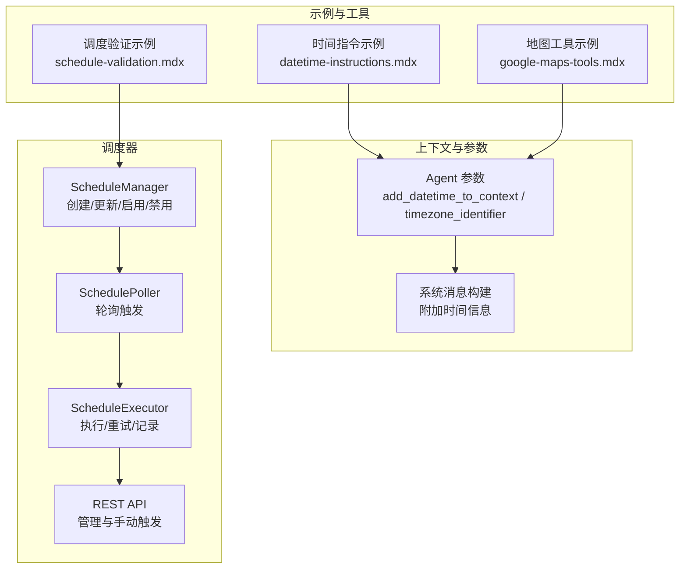
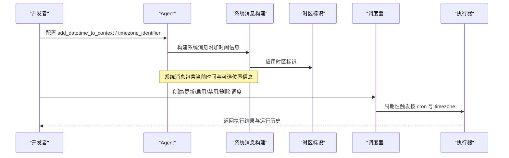
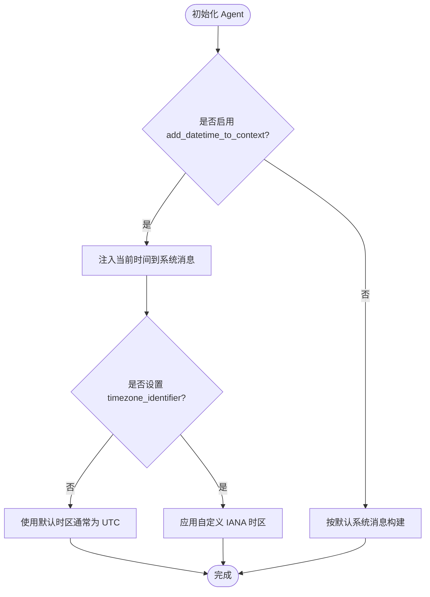
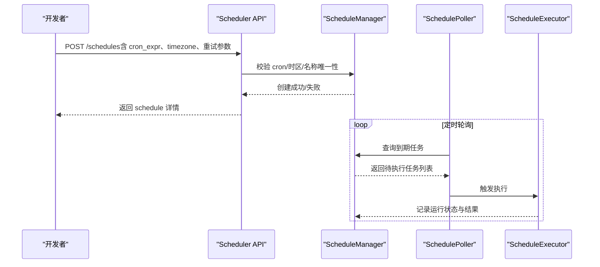
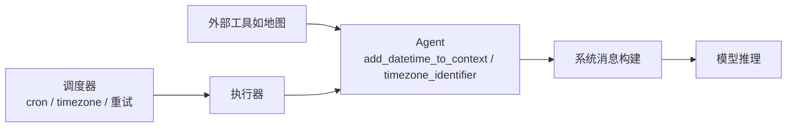

# 时间指令

<cite>
**本文引用的文件**
- [datetime-instructions.mdx](file://context/agent/datetime-instructions.mdx)
- [agent.mdx（参考）](file://reference/agents/agent.mdx)
- [Agent 概览（上下文工程）](file://context/agent/overview.mdx)
- [Scheduler 概览](file://agent-os/scheduler/overview.mdx)
- [调度验证与错误处理](file://examples/agent-os/scheduler/schedule-validation.mdx)
- [Google 地图工具示例（含时间戳与时区）](file://examples/tools/google-maps-tools.mdx)
- [依赖注入（运行时）](file://dependencies/agent/add-dependencies-run.mdx)
- [依赖注入（概览）](file://dependencies/agent/overview.mdx)
</cite>

## 目录
1. [引言](#引言)
2. [项目结构](#项目结构)
3. [核心组件](#核心组件)
4. [架构总览](#架构总览)
5. [详细组件分析](#详细组件分析)
6. [依赖关系分析](#依赖关系分析)
7. [性能考量](#性能考量)
8. [故障排查指南](#故障排查指南)
9. [结论](#结论)
10. [附录](#附录)

## 引言
本篇文档围绕“时间指令”展开，系统阐述如何在代理（Agent）中集成时间相关信息以增强其时间感知能力。内容覆盖时间指令的格式规范、时区处理、时间戳解析与应用、在不同场景中的实践方式，以及调度器（Scheduler）在时间敏感任务中的作用。同时给出可直接定位到仓库源码的路径指引，便于读者对照实现与扩展。

## 项目结构
与“时间指令”相关的内容主要分布在以下区域：
- 上下文工程与 Agent 参数：用于在系统消息中注入当前日期与时间，并支持自定义时区标识
- 调度器：基于 cron 的定时执行，支持时区字段与重试策略
- 示例与工具：演示如何在用户输入或工具调用中使用时间信息与时区转换

图表来源
- [agent.mdx（参考）:76-78](file://reference/agents/agent.mdx#L76-L78)
- [Agent 概览（上下文工程）:92-166](file://context/agent/overview.mdx#L92-L166)
- [Scheduler 概览:80-99](file://agent-os/scheduler/overview.mdx#L80-L99)
- [调度验证与错误处理:1-116](file://examples/agent-os/scheduler/schedule-validation.mdx#L1-L116)
- [Google 地图工具示例（含时间戳与时区）:132-138](file://examples/tools/google-maps-tools.mdx#L132-L138)

章节来源
- [agent.mdx（参考）:76-78](file://reference/agents/agent.mdx#L76-L78)
- [Agent 概览（上下文工程）:92-166](file://context/agent/overview.mdx#L92-L166)
- [Scheduler 概览:73-99](file://agent-os/scheduler/overview.mdx#L73-L99)
- [调度验证与错误处理:1-116](file://examples/agent-os/scheduler/schedule-validation.mdx#L1-L116)
- [Google 地图工具示例（含时间戳与时区）:132-138](file://examples/tools/google-maps-tools.mdx#L132-L138)

## 核心组件
- Agent 时间上下文注入
  - 关键参数：add_datetime_to_context（是否在系统消息中加入当前时间）、timezone_identifier（IANA 时区字符串）
  - 系统消息构建：当开启 add_datetime_to_context 时，会在“附加信息”区块插入当前时间；timezone_identifier 可指定时区，从而影响显示与相对时间表达
- 调度器（Scheduler）
  - 支持 cron 表达式、时区字段、最大重试次数与重试间隔
  - 提供 REST API 进行生命周期管理与手动触发
- 工具与示例
  - 地图工具示例展示了反向地理编码与获取时区信息的能力，体现时间信息在地理位置与时区转换中的应用

章节来源
- [agent.mdx（参考）:76-78](file://reference/agents/agent.mdx#L76-L78)
- [Agent 概览（上下文工程）:92-166](file://context/agent/overview.mdx#L92-L166)
- [Scheduler 概览:73-99](file://agent-os/scheduler/overview.mdx#L73-L99)
- [Google 地图工具示例（含时间戳与时区）:132-138](file://examples/tools/google-maps-tools.mdx#L132-L138)

## 架构总览
下图展示了“时间指令”的端到端流程：Agent 初始化时选择是否注入时间上下文与设置时区；运行时根据系统消息中的时间信息进行响应；对于需要定时执行的任务，通过调度器按 cron 与时区配置周期性触发。

图表来源
- [agent.mdx（参考）:76-78](file://reference/agents/agent.mdx#L76-L78)
- [Agent 概览（上下文工程）:92-166](file://context/agent/overview.mdx#L92-L166)
- [Scheduler 概览:73-99](file://agent-os/scheduler/overview.mdx#L73-L99)

## 详细组件分析

### 组件一：Agent 时间上下文注入
- 功能要点
  - 开启 add_datetime_to_context 后，系统消息会包含当前时间信息，使代理能理解相对时间（如“明天”）
  - timezone_identifier 使用 IANA 时区字符串（例如 Etc/UTC），决定时间显示与相对时间计算所依据的时区
- 实现与使用
  - 在 Agent 初始化时设置上述参数
  - 参考示例文件中的完整用法与运行步骤

图表来源
- [agent.mdx（参考）:76-78](file://reference/agents/agent.mdx#L76-L78)
- [Agent 概览（上下文工程）:92-166](file://context/agent/overview.mdx#L92-L166)

章节来源
- [agent.mdx（参考）:76-78](file://reference/agents/agent.mdx#L76-L78)
- [Agent 概览（上下文工程）:92-166](file://context/agent/overview.mdx#L92-L166)
- [datetime-instructions.mdx:1-61](file://context/agent/datetime-instructions.mdx#L1-L61)

### 组件二：调度器（Scheduler）与时间敏感执行
- 功能要点
  - 支持标准 5 字段 cron 表达式
  - timezone 字段为 IANA 时区字符串，默认 UTC
  - 提供重试机制（max_retries 与 retry_delay_seconds）
  - 提供 REST API 进行创建、查询、更新、启用/禁用、手动触发与查看运行历史
- 错误处理与验证
  - 对无效 cron、无效时区、重复名称等进行校验并抛出异常
  - 展示了复杂 cron 模式的创建与方法名自动大写化

图表来源
- [Scheduler 概览:73-99](file://agent-os/scheduler/overview.mdx#L73-L99)
- [调度验证与错误处理:1-116](file://examples/agent-os/scheduler/schedule-validation.mdx#L1-L116)

章节来源
- [Scheduler 概览:73-99](file://agent-os/scheduler/overview.mdx#L73-L99)
- [调度验证与错误处理:1-116](file://examples/agent-os/scheduler/schedule-validation.mdx#L1-L116)

### 组件三：工具与示例中的时间与时区应用
- 地图工具示例展示了通过坐标反向地理编码并获取时区信息，这在跨时区场景下非常有用
- 结合 Agent 的时间上下文注入，可在多时区环境下为用户提供一致且准确的时间参考

章节来源
- [Google 地图工具示例（含时间戳与时区）:132-138](file://examples/tools/google-maps-tools.mdx#L132-L138)

### 组件四：依赖注入与动态时间信息
- 依赖注入可用于在运行时向 Agent 注入动态上下文（如用户画像、当前时间等）
- 该能力可与 add_datetime_to_context 协同，确保代理在每次运行时都能获得最新的时间信息

章节来源
- [依赖注入（运行时）:1-40](file://dependencies/agent/add-dependencies-run.mdx#L1-L40)
- [依赖注入（概览）:1-39](file://dependencies/agent/overview.mdx#L1-L39)

## 依赖关系分析
- Agent 与上下文工程
  - Agent 参数直接影响系统消息构建，进而影响模型对时间的理解
- Agent 与调度器
  - 调度器负责按 cron 与 timezone 执行任务，适合需要周期性或定时触发的“时间敏感应用”
- 工具与外部服务
  - 地图工具等外部服务可提供时区与地理信息，辅助代理进行跨时区时间换算与本地化响应

图表来源
- [agent.mdx（参考）:76-78](file://reference/agents/agent.mdx#L76-L78)
- [Agent 概览（上下文工程）:92-166](file://context/agent/overview.mdx#L92-L166)
- [Scheduler 概览:73-99](file://agent-os/scheduler/overview.mdx#L73-L99)
- [Google 地图工具示例（含时间戳与时区）:132-138](file://examples/tools/google-maps-tools.mdx#L132-L138)

章节来源
- [agent.mdx（参考）:76-78](file://reference/agents/agent.mdx#L76-L78)
- [Agent 概览（上下文工程）:92-166](file://context/agent/overview.mdx#L92-L166)
- [Scheduler 概览:73-99](file://agent-os/scheduler/overview.mdx#L73-L99)
- [Google 地图工具示例（含时间戳与时区）:132-138](file://examples/tools/google-maps-tools.mdx#L132-L138)

## 性能考量
- 控制上下文长度
  - 在开启 add_datetime_to_context 时，系统消息会包含时间信息；若同时开启历史、记忆、会话摘要等，需关注上下文长度，避免超出模型上下文限制
- 调度器轮询与超时
  - 合理设置轮询间隔、超时与重试参数，避免频繁轮询造成资源浪费
- 时区解析与缓存
  - 对于频繁使用的时区转换，可考虑在应用层做缓存，减少重复解析成本

## 故障排查指南
- 无效时区
  - 当 timezone 设置为非法 IANA 时区字符串时，调度器会抛出异常；请检查时区拼写与可用性
- 重复的调度名称
  - 同一个调度器实例中不允许重复的 name；请修改名称后重试
- 无效 cron 表达式
  - cron 表达式不符合标准格式会导致创建失败；请遵循 5 字段 cron 语法
- 方法名大小写
  - 调度器会自动将方法名转为大写；若出现行为差异，请确认传入值

章节来源
- [调度验证与错误处理:1-116](file://examples/agent-os/scheduler/schedule-validation.mdx#L1-L116)

## 结论
通过在 Agent 中启用时间上下文注入与合理配置时区标识，可以显著提升代理对时间的感知能力，使其在回答相对时间、本地化响应等方面表现更佳。结合调度器的 cron 与时区能力，可实现稳定、可靠的时间敏感自动化任务。在实际部署中，应关注上下文长度、时区解析与调度器配置，确保系统在准确性与性能之间取得平衡。

## 附录
- 快速参考
  - Agent 参数：add_datetime_to_context、timezone_identifier
  - 调度器字段：cron_expr、timezone、max_retries、retry_delay_seconds
  - 示例文件：datetime-instructions.mdx、schedule-validation.mdx、google-maps-tools.mdx
- 相关路径
  - [Agent 参数参考:76-78](file://reference/agents/agent.mdx#L76-L78)
  - [系统消息构建（含时间信息）:92-166](file://context/agent/overview.mdx#L92-L166)
  - [调度器概览与 API:73-99](file://agent-os/scheduler/overview.mdx#L73-L99)
  - [调度验证与错误处理:1-116](file://examples/agent-os/scheduler/schedule-validation.mdx#L1-L116)
  - [地图工具示例（含时间戳与时区）:132-138](file://examples/tools/google-maps-tools.mdx#L132-L138)