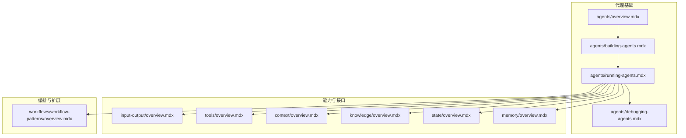
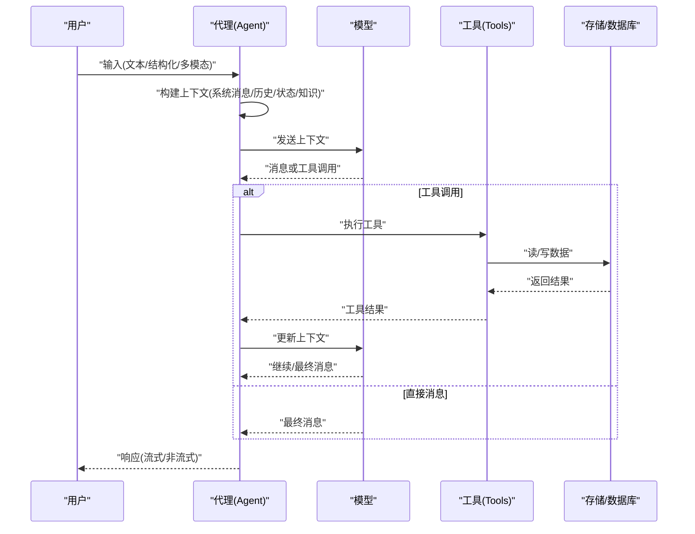
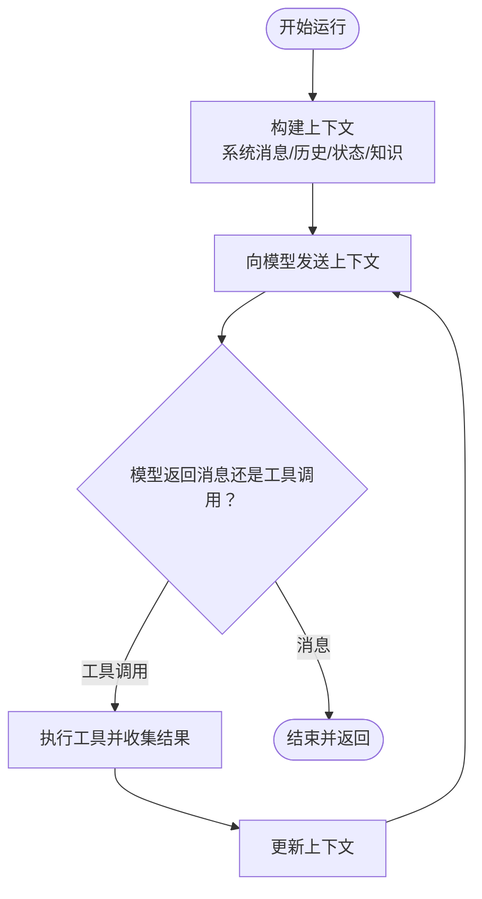
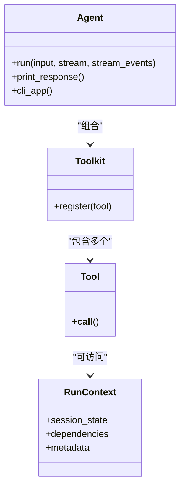
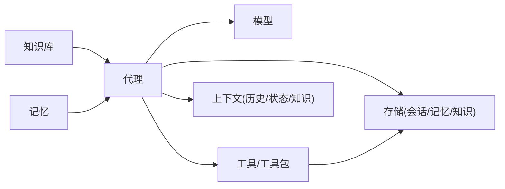

# 代理系统

<cite>
**本文引用的文件**
- [agents/building-agents.mdx](file://agents/building-agents.mdx)
- [agents/running-agents.mdx](file://agents/running-agents.mdx)
- [agents/debugging-agents.mdx](file://agents/debugging-agents.mdx)
- [agents/overview.mdx](file://agents/overview.mdx)
- [input-output/overview.mdx](file://input-output/overview.mdx)
- [tools/overview.mdx](file://tools/overview.mdx)
- [context/overview.mdx](file://context/overview.mdx)
- [knowledge/overview.mdx](file://knowledge/overview.mdx)
- [state/overview.mdx](file://state/overview.mdx)
- [memory/overview.mdx](file://memory/overview.mdx)
- [workflows/workflow-patterns/overview.mdx](file://workflows/workflow-patterns/overview.mdx)
- [prompts/docs-sync.md](file://prompts/docs-sync.md)
</cite>

## 目录
1. [引言](#引言)
2. [项目结构](#项目结构)
3. [核心组件](#核心组件)
4. [架构总览](#架构总览)
5. [详细组件分析](#详细组件分析)
6. [依赖关系分析](#依赖关系分析)
7. [性能考量](#性能考量)
8. [故障排查指南](#故障排查指南)
9. [结论](#结论)
10. [附录](#附录)

## 引言
本文件面向开发者，系统化阐述代理（Agent）系统的概念、构建、运行与管理，并覆盖工具使用、结构化输出、存储与记忆、上下文工程、知识检索与学习等关键主题。文档以仓库内现有资料为依据，结合图示与路径指引，帮助读者快速上手并高效解决问题。

## 项目结构
该仓库围绕“代理”这一核心抽象，提供了从基础概念到高级用法的完整文档体系：包括代理构建、运行与调试、输入输出、工具、上下文工程、知识与记忆、工作流等模块。下图给出与代理系统直接相关的高层组织关系。

**图表来源**
- [agents/overview.mdx](file://agents/overview.mdx)
- [agents/building-agents.mdx](file://agents/building-agents.mdx)
- [agents/running-agents.mdx](file://agents/running-agents.mdx)
- [agents/debugging-agents.mdx](file://agents/debugging-agents.mdx)
- [input-output/overview.mdx](file://input-output/overview.mdx)
- [tools/overview.mdx](file://tools/overview.mdx)
- [context/overview.mdx](file://context/overview.mdx)
- [knowledge/overview.mdx](file://knowledge/overview.mdx)
- [state/overview.mdx](file://state/overview.mdx)
- [memory/overview.mdx](file://memory/overview.mdx)
- [workflows/workflow-patterns/overview.mdx](file://workflows/workflow-patterns/overview.mdx)

**章节来源**
- [agents/overview.mdx](file://agents/overview.mdx)
- [agents/building-agents.mdx](file://agents/building-agents.mdx)
- [agents/running-agents.mdx](file://agents/running-agents.mdx)
- [agents/debugging-agents.mdx](file://agents/debugging-agents.mdx)
- [input-output/overview.mdx](file://input-output/overview.mdx)
- [tools/overview.mdx](file://tools/overview.mdx)
- [context/overview.mdx](file://context/overview.mdx)
- [knowledge/overview.mdx](file://knowledge/overview.mdx)
- [state/overview.mdx](file://state/overview.mdx)
- [memory/overview.mdx](file://memory/overview.mdx)
- [workflows/workflow-patterns/overview.mdx](file://workflows/workflow-patterns/overview.mdx)

## 核心组件
- 代理（Agent）
  - 定义：围绕无状态模型的有状态控制循环，通过指令引导模型进行消息或工具调用，逐步完成任务。
  - 关键点：可组合工具、可注入上下文、支持多模态输入、支持结构化输入输出、支持会话与状态持久化。
- 工具（Tools）
  - 作用：让代理能与外部系统交互，执行搜索、查询数据库、发送邮件等真实动作。
  - 特性：自动将函数转换为模型可用的工具定义；支持并发工具调用；支持 Toolkit 管理多个工具；支持动态工厂按用户/会话定制工具集。
- 上下文工程（Context Engineering）
  - 作用：设计并控制发送给模型的信息，以引导行为与输出。
  - 组成：系统消息、用户消息、对话历史、附加输入（如示例）。
- 知识（Knowledge）
  - 作用：为代理提供训练数据之外的领域信息，支持检索增强生成（RAG）。
  - 流程：内容摄取 → 分块与嵌入 → 搜索与检索 → 将相关内容注入上下文。
- 记忆（Memory）
  - 作用：在会话与跨运行中持久化与复用用户相关信息。
  - 数据模型：包含 memory_id、memory、topics、input、user_id、agent_id、team_id、updated_at 等字段。
- 状态（State）
  - 作用：在会话内持久化与共享数据，供工具读写并自动落库。
- 输入/输出（I/O）
  - 支持字符串、结构化（Pydantic）、多模态（图像/音频/视频/文件）等格式。
- 工作流（Workflow）
  - 作用：对代理、团队与函数进行确定性编排，支持顺序、条件、并行、循环与路由等模式。

**章节来源**
- [agents/overview.mdx](file://agents/overview.mdx)
- [tools/overview.mdx](file://tools/overview.mdx)
- [context/overview.mdx](file://context/overview.mdx)
- [knowledge/overview.mdx](file://knowledge/overview.mdx)
- [memory/overview.mdx](file://memory/overview.mdx)
- [state/overview.mdx](file://state/overview.mdx)
- [input-output/overview.mdx](file://input-output/overview.mdx)
- [workflows/workflow-patterns/overview.mdx](file://workflows/workflow-patterns/overview.mdx)

## 架构总览
下图展示一次典型代理运行的端到端流程，从输入到最终响应，贯穿工具调用、上下文构建、事件流与状态/记忆更新。

**图表来源**
- [agents/running-agents.mdx](file://agents/running-agents.mdx)
- [tools/overview.mdx](file://tools/overview.mdx)
- [input-output/overview.mdx](file://input-output/overview.mdx)
- [memory/overview.mdx](file://memory/overview.mdx)
- [state/overview.mdx](file://state/overview.mdx)

## 详细组件分析

### 代理构建与初始化
- 基础要素：模型、工具、指令、是否启用 Markdown 输出。
- 动态配置：支持可调用工厂（callable factories），在运行时基于会话上下文动态装配工具与知识，实现按用户/会话的细粒度定制。
- 运行入口：
  - 开发期：print_response 打印可读响应。
  - 生产期：run/arun 返回 RunOutput 或事件流，支持流式与事件级可观测性。

**章节来源**
- [agents/building-agents.mdx](file://agents/building-agents.mdx)
- [agents/running-agents.mdx](file://agents/running-agents.mdx)

### 代理运行与状态管理
- 执行流程：构建上下文 → 发送模型 → 处理工具调用/消息 → 循环直至最终消息 → 返回结果。
- 事件模型：RunContent、ToolCallStarted/Completed、ReasoningStep、MemoryUpdate、SessionSummary、Pre/Post Hook、Parser/Output Model 等事件类型，便于 UI 反馈与调试。
- 会话与用户：可通过 user_id 与 session_id 关联运行，支持暂停/继续与取消。
- 流式与事件：stream=True 返回内容增量；stream_events=True 返回全量内部事件。

**图表来源**
- [agents/running-agents.mdx](file://agents/running-agents.mdx)

**章节来源**
- [agents/running-agents.mdx](file://agents/running-agents.mdx)

### 调试与可观测性
- 调试模式：可在代理级别、单次运行或全局环境变量开启，支持更详细的日志级别。
- 交互式 CLI：将代理作为命令行应用运行，便于多轮对话测试。
- 事件流：通过 RunEvent 类型与自定义事件，完整追踪执行链路与中间步骤。

**章节来源**
- [agents/debugging-agents.mdx](file://agents/debugging-agents.mdx)

### 工具与工具包
- 工具定义：自动从函数签名与 docstring 生成模型可用的工具定义；支持 Pydantic 模型参数。
- 并发执行：arun 场景下，模型请求的多个工具调用可并发执行，显著提升吞吐与时延表现。
- 工具包（Toolkit）：集中管理一组工具，便于复用与扩展。
- 内置参数：run_context、agent/team、媒体参数等，简化工具与代理/会话状态的耦合。
- 动态工厂：按用户角色/会话状态动态选择工具集合，支持缓存优化。

**图表来源**
- [tools/overview.mdx](file://tools/overview.mdx)

**章节来源**
- [tools/overview.mdx](file://tools/overview.mdx)

### 结构化输入与输出
- 字符串 I/O：最简形式，适合原型与聊天界面。
- 结构化 I/O：通过 Pydantic 模型定义输入/输出，获得强约束与验证，适用于数据抽取、分类与 API 管线。
- 多模态 I/O：支持图片、音频、视频、文件等输入，满足复杂场景。

**章节来源**
- [input-output/overview.mdx](file://input-output/overview.mdx)

### 上下文工程
- 设计目标：通过精心构造系统消息与附加输入，引导模型行为与输出，使其具备特定角色、能力边界与一致性。
- 组成：系统消息、用户消息、对话历史、附加示例等。
- 提示缓存：利用模型侧提示缓存机制，减少重复令牌消耗，提高效率。

**章节来源**
- [context/overview.mdx](file://context/overview.mdx)

### 知识与检索增强（RAG）
- 组件：内容摄取（文件/URL/原始文本）、分块与嵌入、向量存储与检索。
- 使用方式：传统 RAG（始终注入上下文）与代理式 RAG（由代理决定何时检索）。
- 学习闭环：代理可将新发现写回知识库，形成持续学习。

**章节来源**
- [knowledge/overview.mdx](file://knowledge/overview.mdx)

### 记忆与状态
- 状态（State）：会话内持久化数据，工具通过 run_context.session_state 访问与更新，自动落库。
- 记忆（Memory）：用户记忆持久化，支持按用户检索；数据模型包含 memory_id、topics、input、user_id、agent_id、team_id、updated_at 等字段。
- 工具记忆：MemoryTools 可用于显式检索/写入记忆，替代默认会话历史。

**章节来源**
- [state/overview.mdx](file://state/overview.mdx)
- [memory/overview.mdx](file://memory/overview.mdx)
- [tools/reasoning_tools/memory-tools.mdx](file://tools/reasoning_tools/memory-tools.mdx)

### 工作流编排
- 模式：顺序、条件、并行、循环、路由与 CEL 表达式等，适合生产级自动化。
- 组合：将代理、团队与函数按确定性模式组合，形成稳定可靠的流水线。

**章节来源**
- [workflows/workflow-patterns/overview.mdx](file://workflows/workflow-patterns/overview.mdx)

## 依赖关系分析
- 组件耦合
  - 代理依赖模型、工具、上下文（历史/状态/知识）、存储（会话/记忆/知识库）。
  - 工具通过 run_context 访问状态，可能读写存储。
  - 知识与记忆为代理提供外部信息源，降低对模型训练数据的依赖。
- 外部依赖
  - 向量数据库、嵌入模型、存储后端（PostgreSQL/SQLite/MongoDB/Redis 等）。
  - 多模态媒体处理与模型提供商的 API。
- 潜在循环
  - 通过明确的事件与状态接口避免循环调用；工具与代理解耦，通过上下文与存储间接通信。

**图表来源**
- [agents/running-agents.mdx](file://agents/running-agents.mdx)
- [tools/overview.mdx](file://tools/overview.mdx)
- [knowledge/overview.mdx](file://knowledge/overview.mdx)
- [memory/overview.mdx](file://memory/overview.mdx)
- [state/overview.mdx](file://state/overview.mdx)

## 性能考量
- 并发工具调用：在支持并行函数调用的模型上，arun 场景下工具并发执行可显著缩短端到端时间。
- 提示缓存：利用模型侧提示缓存，减少重复内容传输，降低令牌成本与延迟。
- 事件流与流式输出：仅在需要时开启全量事件流，避免不必要的开销。
- 知识检索优化：合理设置检索 k 值、过滤器与重排序策略，平衡召回与速度。
- 存储与索引：选择合适的向量数据库与索引策略，配合分片/分区与缓存策略。

## 故障排查指南
- 启用调试模式：在代理、单次运行或全局环境变量中开启调试，查看更详细的日志与指标。
- 事件观察：通过 RunEvent 类型与自定义事件定位卡点（工具调用失败、内存更新异常、推理中断等）。
- 交互式 CLI：将代理作为命令行应用运行，快速复现与验证多轮对话问题。
- 错误处理示例：参考工具异常与停止代理的示例，了解如何在工具层抛出异常并优雅终止运行。
- 会话与状态：检查 user_id/session_id 是否正确传递，确认 session_state 初始化与持久化逻辑。

**章节来源**
- [agents/debugging-agents.mdx](file://agents/debugging-agents.mdx)
- [agents/running-agents.mdx](file://agents/running-agents.mdx)
- [examples/tools/exceptions/stop-agent-exception.mdx](file://examples/tools/exceptions/stop-agent-exception.mdx)

## 结论
代理系统以“模型 + 工具 + 上下文”的组合为核心，通过状态与记忆实现跨会话的连续性，借助知识库与检索增强扩展域外信息，再以工作流实现确定性编排。开发者可从最小可用代理起步，逐步叠加工具、结构化 I/O、多模态、知识与记忆，并以事件流与调试能力保障可观测性与稳定性。

## 附录
- 示例与脚本同步规范：仓库提供了将示例脚本同步到文档页面的规则与模板，确保示例与文档一致、可运行且可追溯。

**章节来源**
- [prompts/docs-sync.md](file://prompts/docs-sync.md)