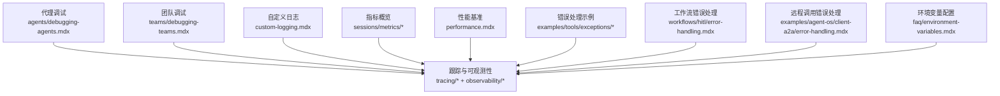
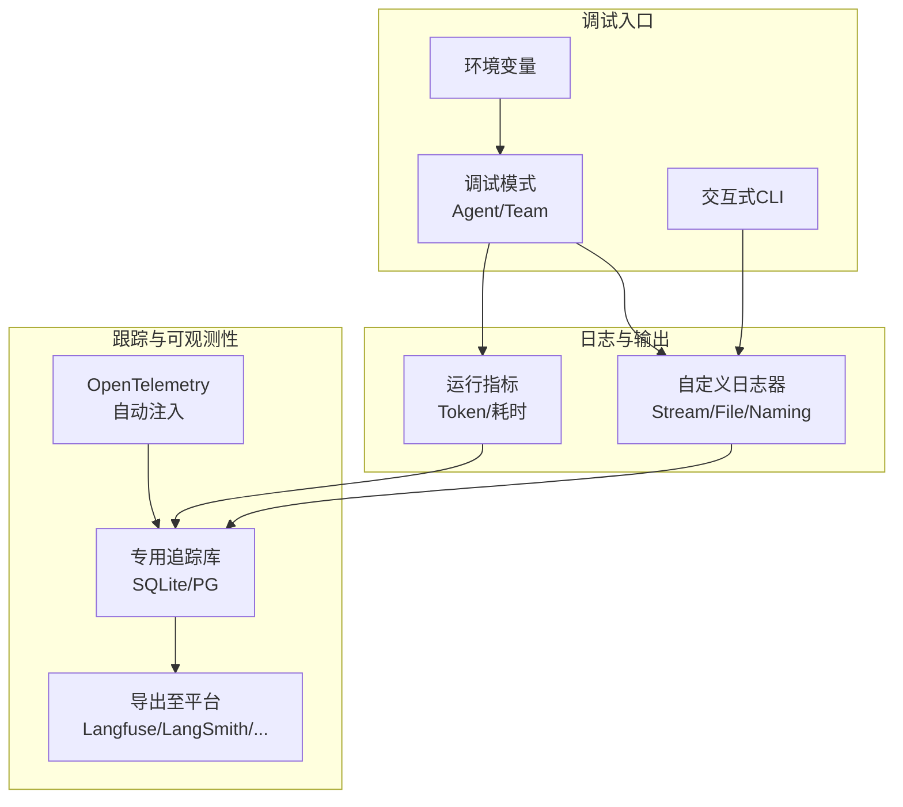
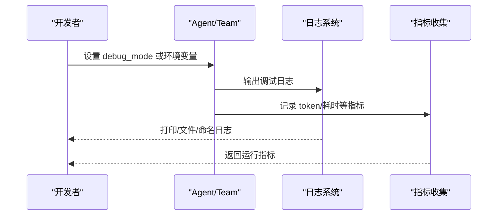
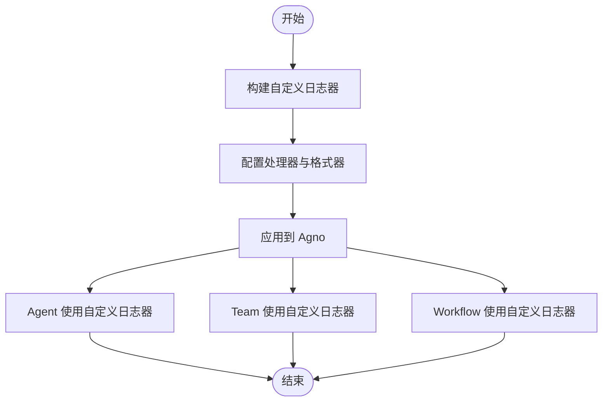
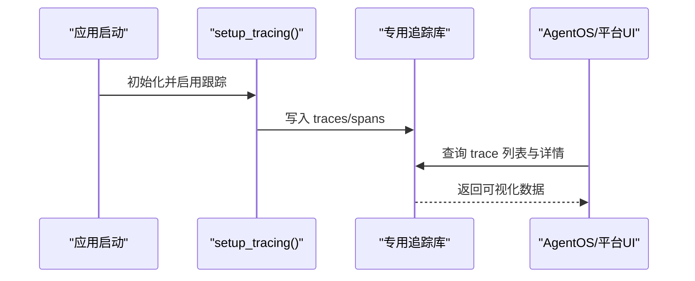
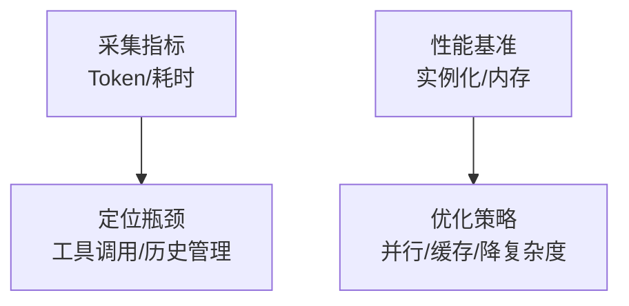
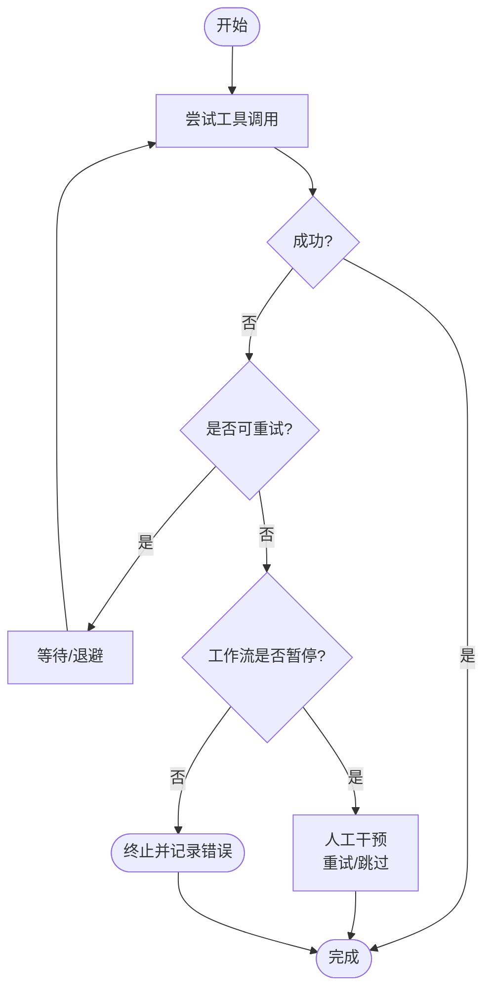
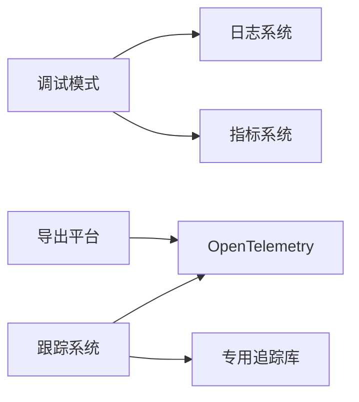

# 代理调试技巧

<cite>
**本文引用的文件**
- [agents/debugging-agents.mdx](file://agents/debugging-agents.mdx)
- [teams/debugging-teams.mdx](file://teams/debugging-teams.mdx)
- [tracing/overview.mdx](file://tracing/overview.mdx)
- [tracing/basic-setup.mdx](file://tracing/basic-setup.mdx)
- [custom-logging.mdx](file://custom-logging.mdx)
- [observability/overview.mdx](file://observability/overview.mdx)
- [sessions/metrics/overview.mdx](file://sessions/metrics/overview.mdx)
- [performance.mdx](file://performance.mdx)
- [examples/tools/exceptions/overview.mdx](file://examples/tools/exceptions/overview.mdx)
- [workflows/hitl/error-handling.mdx](file://workflows/hitl/error-handling.mdx)
- [examples/agent-os/client-a2a/error-handling.mdx](file://examples/agent-os/client-a2a/error-handling.mdx)
- [faq/environment-variables.mdx](file://faq/environment-variables.mdx)
</cite>

## 目录
1. [简介](#简介)
2. [项目结构](#项目结构)
3. [核心组件](#核心组件)
4. [架构总览](#架构总览)
5. [详细组件分析](#详细组件分析)
6. [依赖关系分析](#依赖关系分析)
7. [性能考量](#性能考量)
8. [故障排查指南](#故障排查指南)
9. [结论](#结论)
10. [附录](#附录)

## 简介
本文件面向开发者，系统性介绍在 Agno 生态中调试代理（Agent）、团队（Team）与工作流（Workflow）的实用技巧与工具链。内容覆盖：
- 日志记录与自定义格式化
- 跟踪系统（Tracing）与可观测性（OpenTelemetry）
- 错误处理与重试策略
- 性能指标与基准
- 常见问题诊断与最佳实践

目标是帮助你在开发与生产环境中快速定位问题、理解执行流程、优化资源消耗并提升系统可靠性。

## 项目结构
围绕“调试”主题，相关知识分布在以下路径：
- 代理调试：agents/debugging-agents.mdx
- 团队调试：teams/debugging-teams.mdx
- 跟踪与可观测性：tracing/* 与 observability/*
- 自定义日志：custom-logging.mdx
- 指标概览：sessions/metrics/*
- 性能基准：performance.mdx
- 错误处理示例：examples/tools/exceptions/* 与 workflows/hitl/error-handling.mdx
- 远程调用错误处理：examples/agent-os/client-a2a/error-handling.mdx
- 环境变量配置：faq/environment-variables.mdx

**图表来源**
- [agents/debugging-agents.mdx:1-75](file://agents/debugging-agents.mdx#L1-L75)
- [teams/debugging-teams.mdx:1-168](file://teams/debugging-teams.mdx#L1-L168)
- [tracing/overview.mdx:1-158](file://tracing/overview.mdx#L1-L158)
- [observability/overview.mdx:1-25](file://observability/overview.mdx#L1-L25)
- [custom-logging.mdx:1-193](file://custom-logging.mdx#L1-L193)
- [sessions/metrics/overview.mdx:1-39](file://sessions/metrics/overview.mdx#L1-L39)
- [performance.mdx:1-67](file://performance.mdx#L1-L67)
- [examples/tools/exceptions/overview.mdx:1-14](file://examples/tools/exceptions/overview.mdx#L1-L14)
- [workflows/hitl/error-handling.mdx:1-42](file://workflows/hitl/error-handling.mdx#L1-L42)
- [examples/agent-os/client-a2a/error-handling.mdx:48-151](file://examples/agent-os/client-a2a/error-handling.mdx#L48-L151)
- [faq/environment-variables.mdx:1-120](file://faq/environment-variables.mdx#L1-L120)

**章节来源**
- [agents/debugging-agents.mdx:1-75](file://agents/debugging-agents.mdx#L1-L75)
- [teams/debugging-teams.mdx:1-168](file://teams/debugging-teams.mdx#L1-L168)
- [tracing/overview.mdx:1-158](file://tracing/overview.mdx#L1-L158)
- [observability/overview.mdx:1-25](file://observability/overview.mdx#L1-L25)
- [custom-logging.mdx:1-193](file://custom-logging.mdx#L1-L193)
- [sessions/metrics/overview.mdx:1-39](file://sessions/metrics/overview.mdx#L1-L39)
- [performance.mdx:1-67](file://performance.mdx#L1-L67)
- [examples/tools/exceptions/overview.mdx:1-14](file://examples/tools/exceptions/overview.mdx#L1-L14)
- [workflows/hitl/error-handling.mdx:1-42](file://workflows/hitl/error-handling.mdx#L1-L42)
- [examples/agent-os/client-a2a/error-handling.mdx:48-151](file://examples/agent-os/client-a2a/error-handling.mdx#L48-L151)
- [faq/environment-variables.mdx:1-120](file://faq/environment-variables.mdx#L1-L120)

## 核心组件
- 调试模式（Debug Mode）
  - 代理与团队均支持通过构造参数或运行时开关启用调试模式，并可设置更详细的日志级别。
  - 可结合交互式 CLI 快速进行多轮对话测试与验证。
- 自定义日志
  - 支持替换默认日志器、文件落盘、按组件（Agent/Team/Workflow）分别配置不同日志器。
- 跟踪与可观测性（Tracing）
  - 基于 OpenTelemetry 的自动注入，捕获模型调用、工具执行、团队/工作流协调等关键操作。
  - 提供专用数据库存储与查询接口，支持批量导出到外部平台。
- 指标与性能
  - 运行与会话指标（如 token 使用量、耗时）帮助定位性能瓶颈。
  - 提供框架级性能基准与测量方法说明。
- 错误处理与重试
  - 工具层重试、后置钩子拦截与恢复、工作流错误暂停与人工介入。
- 环境变量与配置
  - 统一的环境变量设置指南，确保调试与观测配置在不同平台一致生效。

**章节来源**
- [agents/debugging-agents.mdx:14-75](file://agents/debugging-agents.mdx#L14-L75)
- [teams/debugging-teams.mdx:9-168](file://teams/debugging-teams.mdx#L9-L168)
- [custom-logging.mdx:12-193](file://custom-logging.mdx#L12-L193)
- [tracing/overview.mdx:23-158](file://tracing/overview.mdx#L23-L158)
- [sessions/metrics/overview.mdx:1-39](file://sessions/metrics/overview.mdx#L1-L39)
- [performance.mdx:1-67](file://performance.mdx#L1-L67)
- [examples/tools/exceptions/overview.mdx:1-14](file://examples/tools/exceptions/overview.mdx#L1-L14)
- [workflows/hitl/error-handling.mdx:1-42](file://workflows/hitl/error-handling.mdx#L1-L42)
- [examples/agent-os/client-a2a/error-handling.mdx:48-151](file://examples/agent-os/client-a2a/error-handling.mdx#L48-L151)
- [faq/environment-variables.mdx:1-120](file://faq/environment-variables.mdx#L1-L120)

## 架构总览
下图展示了从“调试入口”到“可观测数据”的整体链路，涵盖日志、跟踪与指标三类手段：

**图表来源**
- [agents/debugging-agents.mdx:14-75](file://agents/debugging-agents.mdx#L14-L75)
- [teams/debugging-teams.mdx:9-168](file://teams/debugging-teams.mdx#L9-L168)
- [custom-logging.mdx:12-193](file://custom-logging.mdx#L12-L193)
- [tracing/overview.mdx:17-158](file://tracing/overview.mdx#L17-L158)
- [observability/overview.mdx:7-25](file://observability/overview.mdx#L7-L25)
- [sessions/metrics/overview.mdx:1-39](file://sessions/metrics/overview.mdx#L1-L39)

## 详细组件分析

### 调试模式与交互式 CLI
- 启用方式
  - 在 Agent/Team 构造函数中设置调试开关；或在单次 run 中临时开启。
  - 全局启用可通过环境变量实现。
- 输出与观察点
  - 模型输入/输出、中间步骤、工具调用、错误与结果。
  - 结合指标（token 使用、耗时）定位性能与成本问题。
- 交互式 CLI
  - 便于多轮对话测试，快速验证行为与边界条件。

**图表来源**
- [agents/debugging-agents.mdx:14-75](file://agents/debugging-agents.mdx#L14-L75)
- [teams/debugging-teams.mdx:9-168](file://teams/debugging-teams.mdx#L9-L168)
- [sessions/metrics/overview.mdx:1-39](file://sessions/metrics/overview.mdx#L1-L39)

**章节来源**
- [agents/debugging-agents.mdx:14-75](file://agents/debugging-agents.mdx#L14-L75)
- [teams/debugging-teams.mdx:9-168](file://teams/debugging-teams.mdx#L9-L168)
- [sessions/metrics/overview.mdx:1-39](file://sessions/metrics/overview.mdx#L1-L39)

### 自定义日志与命名日志
- 替换默认日志器：统一格式、颜色、时间戳等。
- 文件落盘：将日志写入指定文件，便于离线分析。
- 多组件日志器：为 Agent/Team/Workflow 分别配置独立日志器，便于分域排查。
- 命名日志器：通过特定命名自动识别并使用对应日志器（如 agno、agno-team、agno-workflow）。

**图表来源**
- [custom-logging.mdx:12-193](file://custom-logging.mdx#L12-L193)

**章节来源**
- [custom-logging.mdx:12-193](file://custom-logging.mdx#L12-L193)

### 跟踪系统与可观测性（Tracing）
- 重要性
  - 面向复杂系统（多工具、多决策、跨代理协作），提供端到端可见性。
- 核心概念
  - Trace：一次完整执行；Span：单个操作，父子层级关系。
  - 自动捕获 Agent/模型/工具/团队/工作流等关键操作。
- 配置要点
  - 安装 OpenTelemetry 相关依赖。
  - 使用 SDK 或 AgentOS 参数启用跟踪。
  - 推荐使用专用追踪数据库，避免与业务数据混布。
  - 支持批量处理与简单处理两种模式，按场景选择。
- 查询与导出
  - 数据库存储（SQLite/PG 等），提供查询接口。
  - 导出到 Arize Phoenix、Langfuse、LangSmith 等平台。

**图表来源**
- [tracing/basic-setup.mdx:21-233](file://tracing/basic-setup.mdx#L21-L233)
- [tracing/overview.mdx:17-158](file://tracing/overview.mdx#L17-L158)
- [observability/overview.mdx:7-25](file://observability/overview.mdx#L7-L25)

**章节来源**
- [tracing/overview.mdx:17-158](file://tracing/overview.mdx#L17-L158)
- [tracing/basic-setup.mdx:21-233](file://tracing/basic-setup.mdx#L21-L233)
- [observability/overview.mdx:7-25](file://observability/overview.mdx#L7-L25)

### 指标与性能
- 指标概览
  - 运行与会话指标帮助理解资源使用（token、耗时）与性能表现。
- 性能基准
  - 提供框架级实例化时间与内存占用对比，强调最小化开销与并行化工具调用。
  - 提供复现实验的脚本与方法，建议在本地复现以验证实际表现。

**图表来源**
- [sessions/metrics/overview.mdx:1-39](file://sessions/metrics/overview.mdx#L1-L39)
- [performance.mdx:1-67](file://performance.mdx#L1-L67)

**章节来源**
- [sessions/metrics/overview.mdx:1-39](file://sessions/metrics/overview.mdx#L1-L39)
- [performance.mdx:1-67](file://performance.mdx#L1-L67)

### 错误处理与重试
- 工具层重试
  - 对易波动或限流的工具调用实现自动重试，避免瞬时失败影响整体流程。
- 后置钩子拦截
  - 在执行后拦截错误并触发重试，保证工作流连续性。
- 工作流错误暂停
  - 步骤失败时暂停，允许人工决定重试或跳过，防止无限循环。
- 远程调用错误处理
  - 针对 A2A 客户端连接不可达、超时等异常提供处理范式。

**图表来源**
- [examples/tools/exceptions/overview.mdx:1-14](file://examples/tools/exceptions/overview.mdx#L1-L14)
- [workflows/hitl/error-handling.mdx:1-42](file://workflows/hitl/error-handling.mdx#L1-L42)
- [examples/agent-os/client-a2a/error-handling.mdx:48-151](file://examples/agent-os/client-a2a/error-handling.mdx#L48-L151)

**章节来源**
- [examples/tools/exceptions/overview.mdx:1-14](file://examples/tools/exceptions/overview.mdx#L1-L14)
- [workflows/hitl/error-handling.mdx:1-42](file://workflows/hitl/error-handling.mdx#L1-L42)
- [examples/agent-os/client-a2a/error-handling.mdx:48-151](file://examples/agent-os/client-a2a/error-handling.mdx#L48-L151)

## 依赖关系分析
- 组件耦合
  - 调试模式与日志系统耦合度低，可独立启用；指标与跟踪系统可并行使用。
  - 跟踪系统依赖 OpenTelemetry 与专用数据库，建议与业务数据分离。
- 外部依赖
  - OpenTelemetry 生态（Arize Phoenix、Langfuse、LangSmith 等）用于导出与可视化。
- 配置与环境
  - 环境变量用于全局调试开关与平台密钥传递，需在各平台正确设置。

**图表来源**
- [tracing/overview.mdx:17-158](file://tracing/overview.mdx#L17-L158)
- [observability/overview.mdx:7-25](file://observability/overview.mdx#L7-L25)
- [custom-logging.mdx:12-193](file://custom-logging.mdx#L12-L193)
- [sessions/metrics/overview.mdx:1-39](file://sessions/metrics/overview.mdx#L1-L39)

**章节来源**
- [tracing/overview.mdx:17-158](file://tracing/overview.mdx#L17-L158)
- [observability/overview.mdx:7-25](file://observability/overview.mdx#L7-L25)
- [custom-logging.mdx:12-193](file://custom-logging.mdx#L12-L193)
- [sessions/metrics/overview.mdx:1-39](file://sessions/metrics/overview.mdx#L1-L39)

## 性能考量
- 实例化与内存
  - 关注 Agent 实例化时间与内存占用，避免成为瓶颈。
- 工具调用与历史
  - 并行化工具调用、合理的历史管理策略可显著降低延迟。
- 指标驱动优化
  - 以 token 使用与耗时为核心指标，持续监控与回归测试。

**章节来源**
- [performance.mdx:1-67](file://performance.mdx#L1-L67)
- [sessions/metrics/overview.mdx:1-39](file://sessions/metrics/overview.mdx#L1-L39)

## 故障排查指南
- 常见问题与检查清单
  - 代理/团队未按预期响应：检查角色/指令清晰度、成员工具可用性与错误返回。
  - 协调开销过高：关注 token 使用与合成步骤，必要时减少成员数量或路由直连。
  - 无限委托循环：明确停止条件，限制委次数。
- 环境变量与配置
  - 确保调试开关、密钥与导出端点在 macOS/Windows 平台正确设置。
- 远程调用异常
  - 连接不可达与超时：检查服务状态、网络与超时阈值。
- 工作流错误暂停
  - 使用错误暂停模式，结合人工确认与重试策略。

**章节来源**
- [teams/debugging-teams.mdx:51-168](file://teams/debugging-teams.mdx#L51-L168)
- [faq/environment-variables.mdx:1-120](file://faq/environment-variables.mdx#L1-L120)
- [examples/agent-os/client-a2a/error-handling.mdx:48-151](file://examples/agent-os/client-a2a/error-handling.mdx#L48-L151)
- [workflows/hitl/error-handling.mdx:1-42](file://workflows/hitl/error-handling.mdx#L1-L42)

## 结论
- 将“调试模式 + 自定义日志 + 跟踪系统 + 指标体系”组合使用，可在开发与生产中获得一致的可观测体验。
- 优先采用专用追踪数据库与批量导出，兼顾性能与可维护性。
- 通过错误处理与重试策略、工作流暂停机制，提升系统的鲁棒性与可控性。
- 结合性能基准与指标监控，持续优化实例化、内存与工具调用策略。

## 附录
- 快速参考
  - 启用调试模式：在 Agent/Team 上设置开关或使用环境变量。
  - 自定义日志：替换默认日志器、文件落盘、命名日志器。
  - 启用跟踪：安装依赖、调用初始化函数或通过 AgentOS 参数启用。
  - 查询与导出：使用数据库接口或平台导出到 Arize Phoenix、Langfuse 等。
  - 错误处理：工具重试、后置钩子拦截、工作流暂停与远程调用异常处理。
  - 环境变量：按平台设置临时/永久变量，确保密钥与调试开关生效。