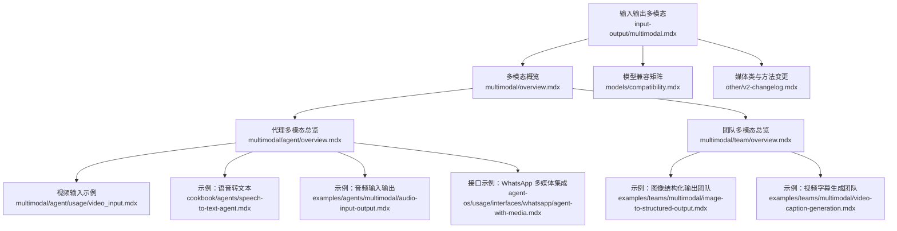
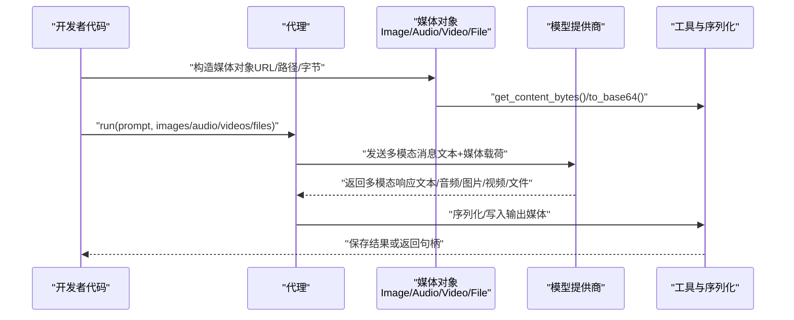
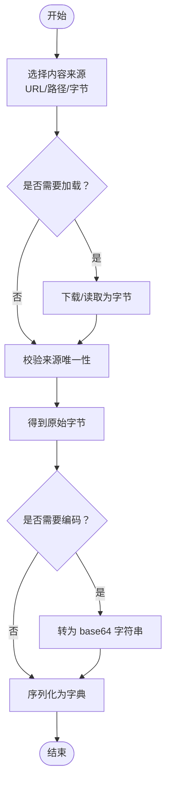
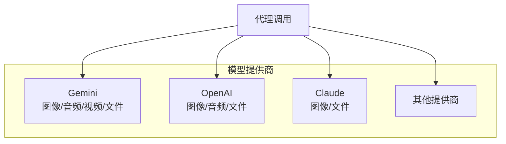
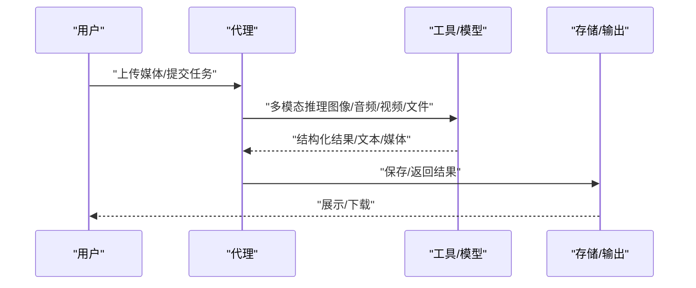
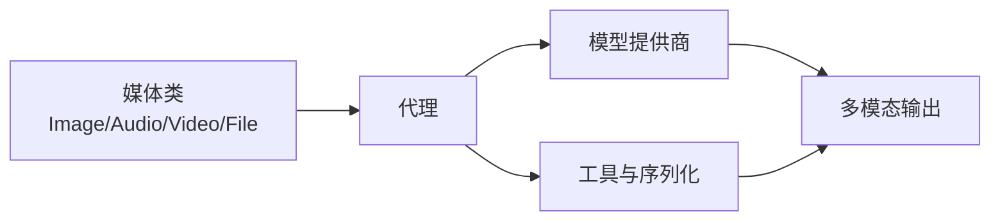

# 代理多模态处理

<cite>
**本文引用的文件**
- [multimodal.mdx](file://input-output/multimodal.mdx)
- [overview.mdx（多模态总览）](file://multimodal/overview.mdx)
- [overview.mdx（多模态代理总览）](file://multimodal/agent/overview.mdx)
- [overview.mdx（多模态团队总览）](file://multimodal/team/overview.mdx)
- [video_input.mdx](file://multimodal/agent/usage/video_input.mdx)
- [compatibility.mdx](file://models/compatibility.mdx)
- [v2-changelog.mdx](file://other/v2-changelog.mdx)
- [speech-to-text-agent.mdx](file://cookbook/agents/speech-to-text-agent.mdx)
- [audio-input-output.mdx](file://examples/agents/multimodal/audio-input-output.mdx)
- [image-to-structured-output.mdx（团队示例）](file://examples/teams/multimodal/image-to-structured-output.mdx)
- [video-caption-generation.mdx](file://examples/teams/multimodal/video-caption-generation.mdx)
- [agent-with-media.mdx](file://agent-os/usage/interfaces/whatsapp/agent-with-media.mdx)
</cite>

## 目录
1. [简介](#简介)
2. [项目结构](#项目结构)
3. [核心组件](#核心组件)
4. [架构总览](#架构总览)
5. [详细组件分析](#详细组件分析)
6. [依赖关系分析](#依赖关系分析)
7. [性能考虑](#性能考虑)
8. [故障排查指南](#故障排查指南)
9. [结论](#结论)
10. [附录](#附录)

## 简介
本文件面向开发者，系统化阐述代理在多模态场景下的输入输出能力与实现要点，覆盖图像、音频、视频与文件的统一媒体抽象、预处理与编码、传输与序列化、以及与不同模型提供商的兼容性。文档同时给出图像描述生成、音频转录、视频内容分析等典型应用路径，并总结安全处理、性能优化与错误处理策略。

## 项目结构
围绕多模态能力，知识库中与“输入输出”“多模态概览”“模型兼容性”“变更日志”“示例与用法”等主题密切相关，形成从概念到实践的完整路径。

图表来源
- [multimodal.mdx:1-219](file://input-output/multimodal.mdx#L1-L219)
- [overview.mdx（多模态总览）:1-37](file://multimodal/overview.mdx#L1-L37)
- [overview.mdx（多模态代理总览）:1-301](file://multimodal/agent/overview.mdx#L1-L301)
- [overview.mdx（多模态团队总览）:1-80](file://multimodal/team/overview.mdx#L1-L80)
- [video_input.mdx:1-27](file://multimodal/agent/usage/video_input.mdx#L1-L27)
- [compatibility.mdx:1-92](file://models/compatibility.mdx#L1-L92)
- [v2-changelog.mdx:153-183](file://other/v2-changelog.mdx#L153-L183)
- [speech-to-text-agent.mdx:1-31](file://cookbook/agents/speech-to-text-agent.mdx#L1-L31)
- [audio-input-output.mdx:1-68](file://examples/agents/multimodal/audio-input-output.mdx#L1-L68)
- [image-to-structured-output.mdx（团队示例）:87-102](file://examples/teams/multimodal/image-to-structured-output.mdx#L87-L102)
- [video-caption-generation.mdx:45-83](file://examples/teams/multimodal/video-caption-generation.mdx#L45-L83)
- [agent-with-media.mdx:52-71](file://agent-os/usage/interfaces/whatsapp/agent-with-media.mdx#L52-L71)

章节来源
- [multimodal.mdx:1-219](file://input-output/multimodal.mdx#L1-L219)
- [overview.mdx（多模态总览）:1-37](file://multimodal/overview.mdx#L1-L37)
- [overview.mdx（多模态代理总览）:1-301](file://multimodal/agent/overview.mdx#L1-L301)
- [overview.mdx（多模态团队总览）:1-80](file://multimodal/team/overview.mdx#L1-L80)

## 核心组件
- 统一媒体类与参数
  - 图像：支持通过 URL、本地路径或原始字节构造；统一以字节存储，便于跨模型传输与序列化。
  - 音频：除 URL/路径/字节外，新增格式字段；可配置响应音频的语音与格式。
  - 视频：支持 URL、本地路径与字节；当前视频输入主要由特定模型提供商支持。
  - 文件：支持 URL、本地路径与字节，用于文档类输入。
- 媒体对象方法与特性
  - 从 base64 创建实例、获取原始字节、转换为 base64、序列化为字典等。
  - 内容来源自动校验：确保仅提供一种内容来源（URL/路径/字节）。
  - 自动生成唯一标识，简化追踪与去重。

章节来源
- [multimodal.mdx:11-18](file://input-output/multimodal.mdx#L11-L18)
- [v2-changelog.mdx:159-177](file://other/v2-changelog.mdx#L159-L177)

## 架构总览
下图展示了代理在多模态场景中的端到端流程：从媒体输入准备，到模型调用与响应生成，再到输出媒体的保存与消费。

图表来源
- [multimodal.mdx:20-214](file://input-output/multimodal.mdx#L20-L214)
- [v2-changelog.mdx:167-171](file://other/v2-changelog.mdx#L167-L171)

## 详细组件分析

### 组件A：媒体类与预处理
- 设计要点
  - 统一的 content 字段与多种来源参数，屏蔽底层差异。
  - 自动加载与编码：从 URL 或路径读取时自动转为字节；必要时进行 base64 编解码。
  - 序列化增强：to_dict 可选包含 base64 内容，便于跨服务传输。
- 典型流程
  - 输入阶段：根据 URL/路径/字节选择加载策略，校验并标准化为字节。
  - 输出阶段：按需将响应媒体转为字节或 base64，再写入文件或返回给上层。

图表来源
- [v2-changelog.mdx:167-171](file://other/v2-changelog.mdx#L167-L171)
- [multimodal.mdx:11-18](file://input-output/multimodal.mdx#L11-L18)

章节来源
- [multimodal.mdx:11-18](file://input-output/multimodal.mdx#L11-L18)
- [v2-changelog.mdx:159-177](file://other/v2-changelog.mdx#L159-L177)

### 组件B：模型兼容性与调用
- 支持情况
  - 不同模型提供商对多模态能力支持不一，需参考兼容矩阵。
  - 示例中展示了 Gemini 的视频输入、OpenAI 的音频输入/输出、Claude 的文件输入等。
- 调用要点
  - 对于音频/视频等特殊模态，需确保模型与提供商组合满足要求。
  - 配置响应模态（如 text、audio）与音频参数（如 voice、format）。

图表来源
- [compatibility.mdx:39-88](file://models/compatibility.mdx#L39-L88)
- [multimodal.mdx:74-75](file://input-output/multimodal.mdx#L74-L75)
- [video_input.mdx:17-20](file://multimodal/agent/usage/video_input.mdx#L17-L20)

章节来源
- [compatibility.mdx:39-88](file://models/compatibility.mdx#L39-L88)
- [multimodal.mdx:74-75](file://input-output/multimodal.mdx#L74-L75)

### 组件C：典型应用与工作流
- 图像描述生成
  - 使用图像作为输入，结合结构化输出或直接文本响应，完成场景理解与描述。
- 音频转录
  - 将音频作为输入，利用具备音频能力的模型进行转录与情感分析。
- 视频内容分析
  - 以视频为输入，结合工具链完成字幕生成、嵌入与检索等后续处理。
- 文件理解
  - 将 PDF 等文档作为输入，提取关键信息或生成摘要。

图表来源
- [speech-to-text-agent.mdx:20-27](file://cookbook/agents/speech-to-text-agent.mdx#L20-L27)
- [audio-input-output.mdx:31-53](file://examples/agents/multimodal/audio-input-output.mdx#L31-L53)
- [video-caption-generation.mdx:48-69](file://examples/teams/multimodal/video-caption-generation.mdx#L48-L69)

章节来源
- [speech-to-text-agent.mdx:1-31](file://cookbook/agents/speech-to-text-agent.mdx#L1-L31)
- [audio-input-output.mdx:1-68](file://examples/agents/multimodal/audio-input-output.mdx#L1-L68)
- [video-caption-generation.mdx:45-83](file://examples/teams/multimodal/video-caption-generation.mdx#L45-L83)

## 依赖关系分析
- 组件耦合
  - 代理与媒体类强耦合：代理通过统一媒体接口接收输入并生成输出。
  - 代理与模型提供商弱耦合：通过模型适配层屏蔽差异，提升可移植性。
- 关键依赖链
  - 媒体对象 → 工具/序列化 → 模型调用 → 响应解析 → 输出管理。
- 兼容性与扩展
  - 兼容矩阵决定可用能力边界；新增提供商时优先遵循统一媒体抽象。

图表来源
- [multimodal.mdx:20-214](file://input-output/multimodal.mdx#L20-L214)
- [compatibility.mdx:39-88](file://models/compatibility.mdx#L39-L88)

章节来源
- [multimodal.mdx:20-214](file://input-output/multimodal.mdx#L20-L214)
- [compatibility.mdx:39-88](file://models/compatibility.mdx#L39-L88)

## 性能考虑
- 媒体大小与带宽
  - 优先使用压缩格式与合适分辨率；对大文件建议分块或云端直传。
- 编解码开销
  - 合理使用 base64 与字节互转，避免重复编解码；仅在必要时进行序列化。
- 流式与并发
  - 利用流式响应与并发执行提升吞吐；注意内存峰值控制。
- 缓存与复用
  - 对相同媒体内容进行缓存，减少重复下载与处理。

## 故障排查指南
- 常见问题
  - 模型不支持某类多模态：检查兼容矩阵，更换模型或提供商。
  - 媒体来源冲突：确保仅提供 URL/路径/字节之一。
  - 音频/视频格式不匹配：确认格式参数与模型要求一致。
- 定位步骤
  - 校验媒体对象构造参数与来源。
  - 查看模型调用日志与响应状态。
  - 在示例工程中最小化复现，逐步排除环境因素。
- 参考示例
  - 音频输入输出示例展示了如何正确构造音频媒体与保存响应音频。
  - 团队示例展示了视频字幕生成的协作流程与断点调试方法。

章节来源
- [audio-input-output.mdx:31-53](file://examples/agents/multimodal/audio-input-output.mdx#L31-L53)
- [video-caption-generation.mdx:48-69](file://examples/teams/multimodal/video-caption-generation.mdx#L48-L69)

## 结论
通过统一的媒体抽象与严格的兼容性约束，代理能够在图像、音频、视频与文件等多模态场景中稳定运行。结合示例与最佳实践，开发者可以快速构建从输入到输出的完整工作流，并在不同模型提供商之间灵活切换。

## 附录
- 快速上手要点
  - 使用统一媒体类构造输入；确保内容来源唯一且格式正确。
  - 根据任务选择合适的模型与提供商组合；关注兼容矩阵。
  - 对输出媒体进行序列化与持久化，便于后续消费。
- 实际示例索引
  - 语音转文本：[speech-to-text-agent.mdx:1-31](file://cookbook/agents/speech-to-text-agent.mdx#L1-L31)
  - 音频输入输出：[audio-input-output.mdx:1-68](file://examples/agents/multimodal/audio-input-output.mdx#L1-L68)
  - 视频字幕生成（团队）：[video-caption-generation.mdx:45-83](file://examples/teams/multimodal/video-caption-generation.mdx#L45-L83)
  - 图像结构化输出（团队）：[image-to-structured-output.mdx（团队示例）:87-102](file://examples/teams/multimodal/image-to-structured-output.mdx#L87-L102)
  - 接口集成（WhatsApp）：[agent-with-media.mdx:52-71](file://agent-os/usage/interfaces/whatsapp/agent-with-media.mdx#L52-L71)