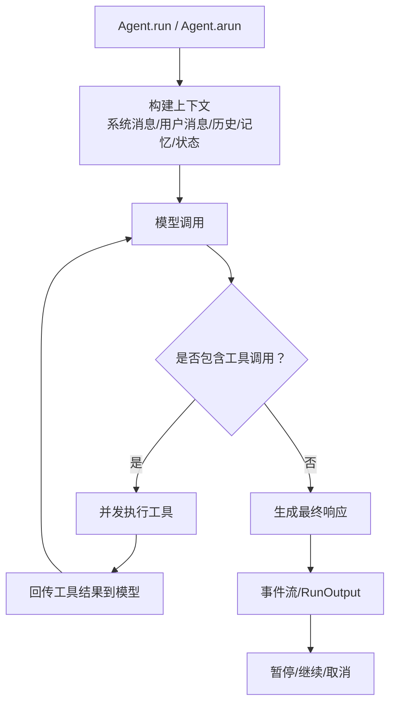
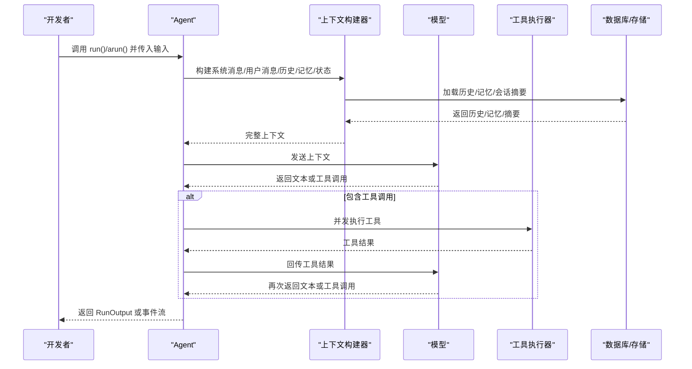
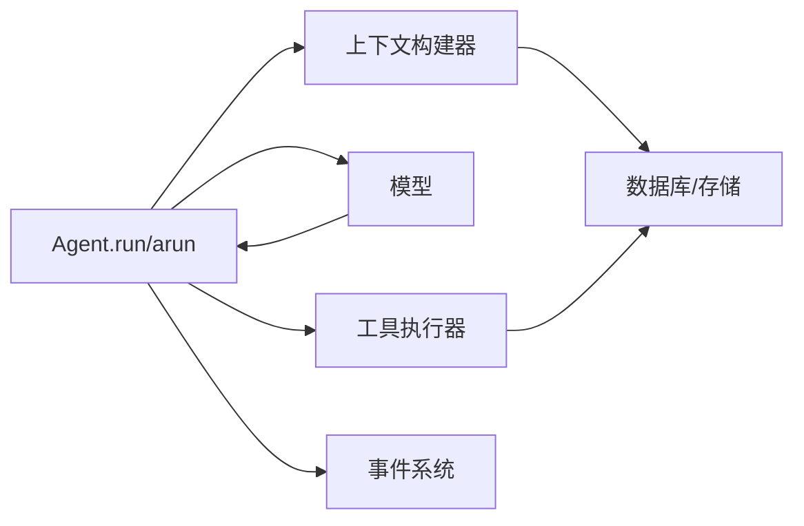

# 代理执行流程

<cite>
**本文引用的文件**
- [运行代理.md](file://agents/running-agents.mdx)
- [代理参考.md](file://reference/agents/agent.mdx)
- [运行输出与事件.md](file://reference/agents/run-response.mdx)
- [会话.md](file://reference/agents/session.mdx)
- [上下文工程-概述.md](file://context/agent/overview.mdx)
- [工具-概述.md](file://tools/overview.mdx)
- [确认所需-流式异步.md](file://hitl/usage/confirmation-required-stream-async.mdx)
- [多模态-概述.md](file://multimodal/overview.mdx)
- [输入输出-概述.md](file://input-output/overview.mdx)
- [知识-概念-过滤器.md](file://knowledge/concepts/filters/overview.mdx)
- [记忆-代理-概述.md](file://memory/agent/overview.mdx)
- [会话-管理.md](file://sessions/session-management.mdx)
- [取消运行.md](file://run-cancellation/overview.mdx)
</cite>

## 目录
1. [简介](#简介)
2. [项目结构](#项目结构)
3. [核心组件](#核心组件)
4. [架构总览](#架构总览)
5. [详细组件分析](#详细组件分析)
6. [依赖分析](#依赖分析)
7. [性能考虑](#性能考虑)
8. [故障排查指南](#故障排查指南)
9. [结论](#结论)
10. [附录](#附录)

## 简介
本文件面向开发者，系统性阐述代理（Agent）在同步（Agent.run）与异步（Agent.arun）两种执行模式下的完整工作流程。重点覆盖以下方面：
- 上下文构建：系统消息、用户消息、聊天历史、用户记忆、会话状态等
- 模型调用：单轮对话与多轮工具调用循环
- 工具调用：并发执行、结果回传与上下文更新
- 最终响应生成：内容事件流、中间结果、完成信号与错误处理
- 人机协同：暂停与继续、取消运行
- 实践示例：同步与异步执行路径与事件处理

## 项目结构
围绕“代理执行流程”的知识分布在多个文档中：
- 运行与事件：agents/running-agents.mdx、reference/agents/run-response.mdx
- 执行入口与参数：reference/agents/agent.mdx
- 上下文工程：context/agent/overview.mdx
- 工具并发：tools/overview.mdx
- 人机协同与暂停继续：hitl/usage/confirmation-required-stream-async.mdx
- 多模态与结构化输出：multimodal/overview.mdx、input-output/overview.mdx
- 记忆与会话：memory/agent/overview.mdx、reference/agents/session.mdx
- 取消运行：run-cancellation/overview.mdx

图表来源
- [运行代理.md:7-14](file://agents/running-agents.mdx#L7-L14)
- [工具-概述.md:156-174](file://tools/overview.mdx#L156-L174)
- [运行输出与事件.md:65-123](file://reference/agents/run-response.mdx#L65-L123)

章节来源
- [运行代理.md:1-322](file://agents/running-agents.mdx#L1-L322)
- [代理参考.md:107-158](file://reference/agents/agent.mdx#L107-L158)
- [运行输出与事件.md:1-281](file://reference/agents/run-response.mdx#L1-L281)

## 核心组件
- Agent.run / Agent.arun：同步与异步执行入口，返回 RunOutput 或 RunOutputEvent 流
- 上下文构建器：系统消息、用户消息、历史、记忆、会话状态、依赖注入、知识检索等
- 模型适配层：负责将上下文发送给模型，并接收文本或工具调用
- 工具执行器：并发执行工具，支持同步/异步工具，聚合结果回传模型
- 事件分发器：按配置产生 RunEvent 流，便于 UI 与调试
- 会话与记忆：持久化与加载 session、记忆、会话摘要
- 人机协同：暂停（RunPaused）、继续（RunContinued）、取消（RunCancelled）

章节来源
- [运行代理.md:7-14](file://agents/running-agents.mdx#L7-L14)
- [代理参考.md:107-158](file://reference/agents/agent.mdx#L107-L158)
- [运行输出与事件.md:43-281](file://reference/agents/run-response.mdx#L43-L281)
- [上下文工程-概述.md:11-166](file://context/agent/overview.mdx#L11-L166)
- [工具-概述.md:156-174](file://tools/overview.mdx#L156-L174)
- [会话.md:6-21](file://reference/agents/session.mdx#L6-L21)

## 架构总览
下图展示了从调用 Agent.run/arun 到最终响应的关键交互：

图表来源
- [运行代理.md:7-14](file://agents/running-agents.mdx#L7-L14)
- [工具-概述.md:156-174](file://tools/overview.mdx#L156-L174)
- [运行输出与事件.md:65-123](file://reference/agents/run-response.mdx#L65-L123)

## 详细组件分析

### Agent.run 与 Agent.arun 的执行机制
- 入口参数与行为
  - run(): 同步执行，返回 RunOutput；可设置 stream=True 获取 RunOutputEvent 流
  - arun(): 异步执行，返回异步迭代器或 RunOutput；支持 stream_events 控制事件粒度
- 关键参数
  - 输入类型灵活：字符串、列表、字典、消息、Pydantic 模型、消息列表
  - 多媒体输入：images/audio/videos/files
  - 结构化输出：output_schema
  - 会话与用户：user_id、session_id
  - 上下文增强：add_history_to_context、add_dependencies_to_context、add_session_state_to_context、add_memories_to_context、add_session_summary_to_context
  - 重试与延迟：retries、delay_between_retries、exponential_backoff
- 返回值
  - RunOutput：包含 run_id、agent_id、content、reasoning_content、messages、metrics、model 等
  - RunOutputEvent：事件驱动的细粒度输出，支持 RunContent、ToolCall、Reasoning、Memory、SessionSummary、Parser/OutputModel 等事件

章节来源
- [运行代理.md:16-322](file://agents/running-agents.mdx#L16-L322)
- [代理参考.md:107-158](file://reference/agents/agent.mdx#L107-L158)
- [运行输出与事件.md:6-42](file://reference/agents/run-response.mdx#L6-L42)

### 上下文构建：系统消息、用户消息、历史、记忆与会话状态
- 系统消息
  - 来源：description、instructions、expected_output、additional_context、markdown、时间/地点/名称等附加信息
  - 可选覆盖：system_message；禁用自动构建：build_context=False
- 用户消息
  - 来自 input；可附加知识 references、依赖 dependencies、额外输入 additional_input
- 历史与上下文压缩
  - add_history_to_context + num_history_runs/num_history_messages
  - max_tool_calls_from_history 控制仅保留最近 N 次工具调用
- 记忆与会话摘要
  - add_memories_to_context、enable_agentic_memory、update_memory_on_run
  - add_session_summary_to_context、enable_session_summaries
- 会话状态
  - add_session_state_to_context、enable_agentic_state、overwrite_db_session_state
  - 支持缓存 session（cache_session）
- 知识检索
  - add_knowledge_to_context、knowledge_filters、enable_agentic_knowledge_filters
  - knowledge_retriever 自定义 references 格式与来源

章节来源
- [上下文工程-概述.md:11-166](file://context/agent/overview.mdx#L11-L166)
- [上下文工程-概述.md:320-402](file://context/agent/overview.mdx#L320-L402)
- [代理参考.md:7-104](file://reference/agents/agent.mdx#L7-L104)
- [知识-概念-过滤器.md](file://knowledge/concepts/filters/overview.mdx)

### 模型调用与工具调用循环
- 单轮调用：Agent 将上下文发送给模型，模型返回文本或工具调用
- 工具调用循环：若模型请求工具调用，Agent 并发执行工具并将结果回传模型，重复直至模型返回最终文本
- 并发策略
  - arun 下，模型支持并行函数调用时，工具并发执行
  - 同步工具在独立线程并发执行
- 工具钩子与限制
  - tool_hooks：工具调用之间的钩子
  - tool_call_limit：单次运行最大工具调用次数
  - tool_choice：控制模型调用的工具

章节来源
- [运行代理.md:7-14](file://agents/running-agents.mdx#L7-L14)
- [工具-概述.md:156-174](file://tools/overview.mdx#L156-L174)
- [代理参考.md:45-49](file://reference/agents/agent.mdx#L45-L49)

### 事件流与最终响应生成
- 事件类型
  - 核心事件：RunStarted、RunContent、RunContentCompleted、RunIntermediateContent、RunCompleted、RunError、RunCancelled
  - 控制流事件：RunPaused、RunContinued
  - 工具事件：ToolCallStarted、ToolCallCompleted
  - 推理事件：ReasoningStarted、ReasoningStep、ReasoningCompleted
  - 内存事件：MemoryUpdateStarted、MemoryUpdateCompleted
  - 会话摘要事件：SessionSummaryStarted、SessionSummaryCompleted
  - 预/后置钩子事件：PreHookStarted/Completed、PostHookStarted/Completed
  - 解析/输出模型事件：ParserModelResponseStarted/Completed、OutputModelResponseStarted/Completed
- 事件流控制
  - stream=True：仅流式返回 RunContent
  - stream_events=True：返回更全面的事件集合
- 中间结果与结构化输出
  - output_model、parser_model、structured_outputs、use_json_mode 等参数用于结构化输出与二次解析

章节来源
- [运行代理.md:114-236](file://agents/running-agents.mdx#L114-L236)
- [运行输出与事件.md:43-281](file://reference/agents/run-response.mdx#L43-L281)
- [输入输出-概述.md](file://input-output/overview.mdx)

### 人机协同：暂停与继续、取消运行
- 暂停与继续
  - 当模型请求需要人工确认的工具调用时，运行可能被暂停（RunPaused），开发者可收集确认后再继续
  - 继续接口：Agent.continue_run / Agent.acontinue_run
- 取消运行
  - 支持通过 run_id 取消运行：Agent.cancel_run

章节来源
- [确认所需-流式异步.md:62-99](file://hitl/usage/confirmation-required-stream-async.mdx#L62-L99)
- [运行代理.md:306-316](file://agents/running-agents.mdx#L306-L316)
- [取消运行.md](file://run-cancellation/overview.mdx)

### 多媒体与结构化输入/输出
- 多媒体输入：images/audio/videos/files
- 结构化输入/输出：input_schema、output_schema、use_json_mode、structured_outputs
- 输出格式：markdown 控制输出格式

章节来源
- [运行代理.md:279-304](file://agents/running-agents.mdx#L279-L304)
- [多模态-概述.md](file://multimodal/overview.mdx)
- [输入输出-概述.md](file://input-output/overview.mdx)

### 会话与记忆管理
- 会话
  - session_id、user_id、session_state、cache_session、search_session_history、num_history_sessions
  - 会话数据结构：AgentSession，包含 runs、summary、metadata 等
- 记忆
  - enable_agentic_memory、update_memory_on_run、add_memories_to_context
  - 提供获取与异步获取用户记忆的方法

章节来源
- [代理参考.md:15-32](file://reference/agents/agent.mdx#L15-L32)
- [会话.md:6-21](file://reference/agents/session.mdx#L6-L21)
- [记忆-代理-概述.md:13-79](file://memory/agent/overview.mdx#L13-L79)

## 依赖分析
- 组件耦合
  - Agent.run/arun 依赖上下文构建器（系统消息、用户消息、历史、记忆、会话状态）
  - 工具执行器与模型解耦，通过工具钩子与限制进行控制
  - 事件系统与执行流程解耦，通过 stream/stream_events 参数控制
- 外部依赖
  - 数据库/存储：历史、记忆、会话摘要
  - 模型提供商：支持并行工具调用（如 OpenAI 的 parallel_tool_calls）
- 循环依赖
  - 工具调用循环在模型返回工具调用时触发，最终由模型返回无工具调用的文本结束

图表来源
- [代理参考.md:107-158](file://reference/agents/agent.mdx#L107-L158)
- [工具-概述.md:156-174](file://tools/overview.mdx#L156-L174)
- [运行输出与事件.md:43-123](file://reference/agents/run-response.mdx#L43-L123)

## 性能考虑
- 上下文压缩
  - 使用 max_tool_calls_from_history 控制历史工具调用数量，减少 token 开销
  - 合理设置 num_history_runs/num_history_messages，避免上下文过长
- 工具并发
  - 在模型支持并行函数调用的前提下，arun 下工具并发显著提升吞吐
  - 同步工具并发执行于独立线程，注意资源竞争与锁
- 缓存与复用
  - 启用 session 缓存（cache_session）以降低重复加载成本
  - 使用模型侧提示词缓存（如 OpenAI/Anthropic 提示缓存）减少重复前缀传输
- 事件粒度
  - stream_events=True 会增加事件开销，生产环境建议按需开启

## 故障排查指南
- 常见事件
  - RunError：检查模型调用异常、工具执行异常、权限问题
  - RunCancelled：确认取消原因与取消时机
  - RunPaused：检查 active_requirements，确保正确处理确认需求
- 日志与调试
  - debug_mode 与 debug_level 控制日志级别
  - 事件流可用于定位推理、工具调用、内存更新等阶段的问题
- 重试策略
  - retries、delay_between_retries、exponential_backoff 可缓解瞬时失败
- 会话与记忆一致性
  - 确认 session_id、user_id 一致，避免跨会话数据错乱
  - 记忆更新与会话摘要更新需与工具钩子配合使用

章节来源
- [运行输出与事件.md:140-153](file://reference/agents/run-response.mdx#L140-L153)
- [代理参考.md:83-85](file://reference/agents/agent.mdx#L83-L85)

## 结论
- Agent.run 与 Agent.arun 提供统一的执行入口，支持同步与异步两种模式
- 上下文构建贯穿始终，涵盖系统消息、用户消息、历史、记忆、会话状态与知识检索
- 工具调用循环在模型请求工具时触发，支持并发执行与结果回传
- 事件系统提供完整的可观测性，便于 UI 展示与调试
- 人机协同与取消运行保障了可控性与安全性
- 生产部署建议结合上下文压缩、工具并发与缓存策略优化性能

## 附录
- 同步执行示例路径
  - [运行代理.md:18-37](file://agents/running-agents.mdx#L18-L37)
  - [运行代理.md:43-67](file://agents/running-agents.mdx#L43-L67)
- 异步执行示例路径
  - [运行代理.md:39-41](file://agents/running-agents.mdx#L39-L41)
  - [确认所需-流式异步.md:62-99](file://hitl/usage/confirmation-required-stream-async.mdx#L62-L99)
- 事件类型参考
  - [运行输出与事件.md:159-236](file://reference/agents/run-response.mdx#L159-L236)
- 参数与能力参考
  - [代理参考.md:7-104](file://reference/agents/agent.mdx#L7-L104)