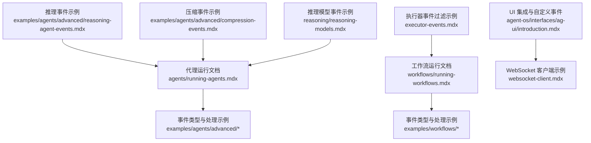
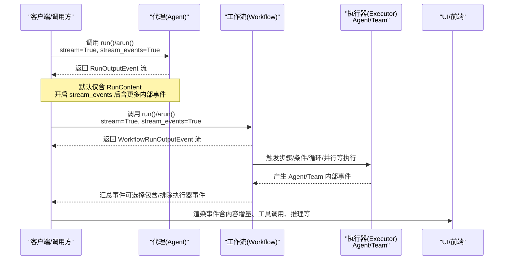
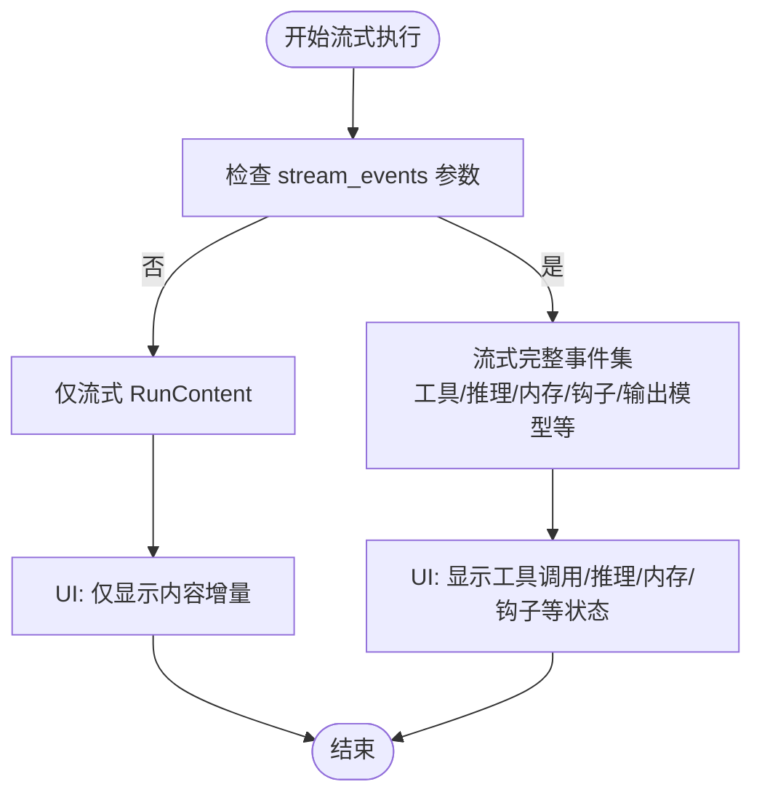
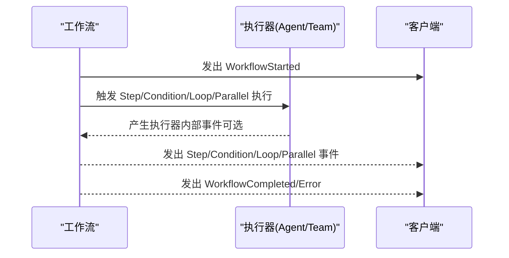
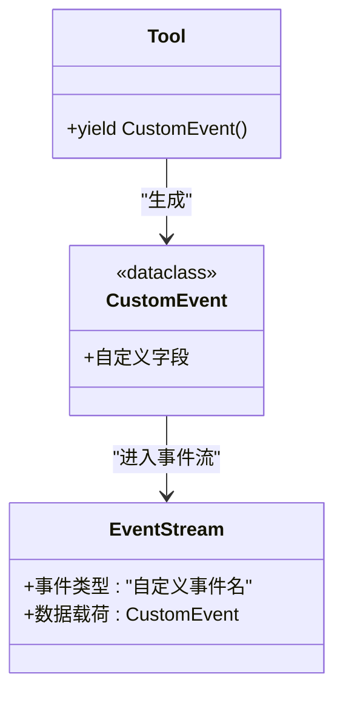
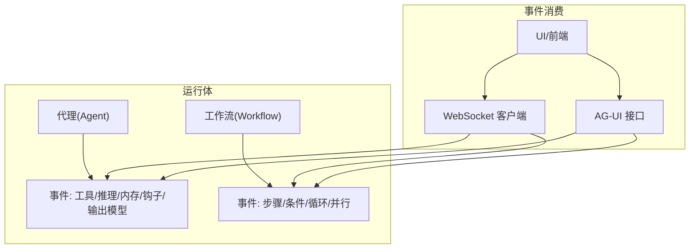

# 代理流式事件

<cite>
**本文引用的文件**
- [agents/running-agents.mdx](file://agents/running-agents.mdx)
- [examples/agents/advanced/basic-agent-events.mdx](file://examples/agents/advanced/basic-agent-events.mdx)
- [examples/agents/advanced/reasoning-agent-events.mdx](file://examples/agents/advanced/reasoning-agent-events.mdx)
- [examples/agents/advanced/compression-events.mdx](file://examples/agents/advanced/compression-events.mdx)
- [workflows/running-workflows.mdx](file://workflows/running-workflows.mdx)
- [examples/workflows/advanced-concepts/background-execution/websocket-client.mdx](file://examples/workflows/advanced-concepts/background-execution/websocket-client.mdx)
- [agent-os/interfaces/ag-ui/introduction.mdx](file://agent-os/interfaces/ag-ui/introduction.mdx)
- [examples/workflows/advanced-concepts/run-control/executor-events.mdx](file://examples/workflows/advanced-concepts/run-control/executor-events.mdx)
- [reasoning/reasoning-models.mdx](file://reasoning/reasoning-models.mdx)
</cite>

## 目录
1. [引言](#引言)
2. [项目结构](#项目结构)
3. [核心组件](#核心组件)
4. [架构总览](#架构总览)
5. [详细组件分析](#详细组件分析)
6. [依赖关系分析](#依赖关系分析)
7. [性能考量](#性能考量)
8. [故障排查指南](#故障排查指南)
9. [结论](#结论)
10. [附录](#附录)

## 引言
本文件面向开发者，系统性讲解代理（Agent）与工作流（Workflow）的“流式事件”机制，重点围绕 RunOutputEvent 对象与各类事件类型展开。文档将阐明默认流式事件与“完整事件流”的差异，说明如何通过 stream_events 参数获取更细粒度的执行信息，并覆盖核心事件、控制流事件、工具事件、推理事件、内存事件、会话摘要事件、钩子事件、解析器模型事件等。同时提供事件处理的实际示例，展示如何在 UI 中实现丰富的反馈效果，并给出自定义事件的创建与使用指南。

## 项目结构
本主题涉及的文档主要分布在以下区域：
- 代理运行与事件：agents/running-agents.mdx 及其示例
- 工作流运行与事件：workflows/running-workflows.mdx 及其示例
- UI 集成与自定义事件：agent-os/interfaces/ag-ui/introduction.mdx
- WebSocket 实时渲染示例：examples/workflows/advanced-concepts/background-execution/websocket-client.mdx
- 推理事件示例：examples/agents/advanced/reasoning-agent-events.mdx
- 压缩事件示例：examples/agents/advanced/compression-events.mdx
- 执行器事件过滤示例：examples/workflows/advanced-concepts/run-control/executor-events.mdx
- 推理模型事件示例：reasoning/reasoning-models.mdx

**图表来源**
- [agents/running-agents.mdx](file://agents/running-agents.mdx)
- [workflows/running-workflows.mdx](file://workflows/running-workflows.mdx)
- [agent-os/interfaces/ag-ui/introduction.mdx](file://agent-os/interfaces/ag-ui/introduction.mdx)
- [examples/workflows/advanced-concepts/background-execution/websocket-client.mdx](file://examples/workflows/advanced-concepts/background-execution/websocket-client.mdx)
- [examples/agents/advanced/reasoning-agent-events.mdx](file://examples/agents/advanced/reasoning-agent-events.mdx)
- [examples/agents/advanced/compression-events.mdx](file://examples/agents/advanced/compression-events.mdx)
- [examples/workflows/advanced-concepts/run-control/executor-events.mdx](file://examples/workflows/advanced-concepts/run-control/executor-events.mdx)
- [reasoning/reasoning-models.mdx](file://reasoning/reasoning-models.mdx)

**章节来源**
- [agents/running-agents.mdx](file://agents/running-agents.mdx)
- [workflows/running-workflows.mdx](file://workflows/running-workflows.mdx)
- [agent-os/interfaces/ag-ui/introduction.mdx](file://agent-os/interfaces/ag-ui/introduction.mdx)
- [examples/workflows/advanced-concepts/background-execution/websocket-client.mdx](file://examples/workflows/advanced-concepts/background-execution/websocket-client.mdx)
- [examples/agents/advanced/reasoning-agent-events.mdx](file://examples/agents/advanced/reasoning-agent-events.mdx)
- [examples/agents/advanced/compression-events.mdx](file://examples/agents/advanced/compression-events.mdx)
- [examples/workflows/advanced-concepts/run-control/executor-events.mdx](file://examples/workflows/advanced-concepts/run-control/executor-events.mdx)
- [reasoning/reasoning-models.mdx](file://reasoning/reasoning-models.mdx)

## 核心组件
- RunOutputEvent：代理与工作流在流式执行过程中产出的事件载体，包含事件类型、上下文字段（如 run_id、session_id、content 等），以及事件携带的数据（如工具调用信息、推理内容、内存更新状态等）。
- stream_events 参数：当设置为 True 时，将返回更全面的内部事件流（工具调用、推理、内存更新、钩子、输出模型等），而不仅仅是模型响应内容。
- 事件枚举与类型：不同运行体（Agent、Team、Workflow）提供各自的事件枚举或事件类，用于区分生命周期、控制流、工具、推理、内存、会话摘要、钩子、解析器模型等阶段。

关键要点：
- 默认仅流式返回 RunContent 事件（模型响应片段）；开启 stream_events 后，可获得更细粒度的内部过程事件。
- 在工作流中，可通过 stream_executor_events 控制是否包含内部执行器（Agent/Team）事件，以减少噪音或增强可观测性。

**章节来源**
- [agents/running-agents.mdx](file://agents/running-agents.mdx)
- [workflows/running-workflows.mdx](file://workflows/running-workflows.mdx)

## 架构总览
下图展示了从调用到事件流的整体流程，涵盖代理与工作流两种运行体，以及事件过滤与 UI 渲染的关键节点。

**图表来源**
- [agents/running-agents.mdx](file://agents/running-agents.mdx)
- [workflows/running-workflows.mdx](file://workflows/running-workflows.mdx)
- [examples/workflows/advanced-concepts/background-execution/websocket-client.mdx](file://examples/workflows/advanced-concepts/background-execution/websocket-client.mdx)

## 详细组件分析

### 事件类型与语义
- 核心事件
  - RunStarted、RunContent、RunContentCompleted、RunIntermediateContent、RunCompleted、RunError、RunCancelled
- 控制流事件
  - RunPaused、RunContinued
- 工具事件
  - ToolCallStarted、ToolCallCompleted
- 推理事件
  - ReasoningStarted、ReasoningStep、ReasoningCompleted
- 内存事件
  - MemoryUpdateStarted、MemoryUpdateCompleted
- 会话摘要事件
  - SessionSummaryStarted、SessionSummaryCompleted
- 钩子事件
  - PreHookStarted、PreHookCompleted、PostHookStarted、PostHookCompleted
- 解析器模型事件
  - ParserModelResponseStarted、ParserModelResponseCompleted
- 输出模型事件
  - OutputModelResponseStarted、OutputModelResponseCompleted
- 自定义事件
  - 通过扩展 CustomEvent 并在工具中 yield，即可在事件流中出现并与内置事件一致地被消费。

以上事件类型均来自代理运行文档的事件分类与表格说明。

**章节来源**
- [agents/running-agents.mdx](file://agents/running-agents.mdx)

### 事件流差异：默认 vs 完整事件流
- 默认事件流（未设置 stream_events 或为 False）：仅包含模型响应内容事件（如 RunContent），适合轻量 UI 或仅需文本反馈的场景。
- 完整事件流（设置 stream_events=True）：包含工具调用、推理、内存更新、钩子、输出模型等内部过程事件，适合需要精细可观测性与丰富 UI 反馈的场景。

此外，在工作流中还可通过 stream_executor_events 控制是否包含内部执行器（Agent/Team）事件，以平衡事件数量与信息密度。

**章节来源**
- [agents/running-agents.mdx](file://agents/running-agents.mdx)
- [workflows/running-workflows.mdx](file://workflows/running-workflows.mdx)

### 事件处理与 UI 反馈示例
- 代理事件处理
  - 示例展示了如何在异步流中识别 RunStarted、ToolCallStarted/Completed、RunContent 等事件，并按事件类型进行差异化输出。
  - 推理事件示例展示了如何监听 ReasoningStarted、ReasoningStep、ReasoningCompleted 与最终 RunContent。
  - 压缩事件示例展示了如何监听压缩开始/完成事件及令牌用量变化，便于在 UI 中显示压缩效果与成本信息。
- 工作流事件处理
  - 示例展示了如何在工作流运行中识别 WorkflowStarted、StepStarted/Completed、ConditionExecution 等事件，并在 UI 中分步呈现。
  - WebSocket 客户端示例演示了如何解析 SSE/JSON 事件，聚合内容增量，渲染面板，并支持断线重连与补播。
- 自定义事件与 UI
  - 自定义事件通过扩展 CustomEvent 并在工具中 yield，即可自动进入事件流并在 AG-UI 中以统一格式呈现，便于在前端做定制化反馈。

**图表来源**
- [agents/running-agents.mdx](file://agents/running-agents.mdx)
- [examples/agents/advanced/basic-agent-events.mdx](file://examples/agents/advanced/basic-agent-events.mdx)
- [examples/agents/advanced/reasoning-agent-events.mdx](file://examples/agents/advanced/reasoning-agent-events.mdx)
- [examples/agents/advanced/compression-events.mdx](file://examples/agents/advanced/compression-events.mdx)
- [workflows/running-workflows.mdx](file://workflows/running-workflows.mdx)
- [examples/workflows/advanced-concepts/background-execution/websocket-client.mdx](file://examples/workflows/advanced-concepts/background-execution/websocket-client.mdx)
- [agent-os/interfaces/ag-ui/introduction.mdx](file://agent-os/interfaces/ag-ui/introduction.mdx)

**章节来源**
- [examples/agents/advanced/basic-agent-events.mdx](file://examples/agents/advanced/basic-agent-events.mdx)
- [examples/agents/advanced/reasoning-agent-events.mdx](file://examples/agents/advanced/reasoning-agent-events.mdx)
- [examples/agents/advanced/compression-events.mdx](file://examples/agents/advanced/compression-events.mdx)
- [workflows/running-workflows.mdx](file://workflows/running-workflows.mdx)
- [examples/workflows/advanced-concepts/background-execution/websocket-client.mdx](file://examples/workflows/advanced-concepts/background-execution/websocket-client.mdx)
- [agent-os/interfaces/ag-ui/introduction.mdx](file://agent-os/interfaces/ag-ui/introduction.mdx)

### 执行器事件过滤与工作流事件
- 在工作流中，可通过 stream_executor_events 控制是否包含内部执行器（Agent/Team）事件。关闭后可减少事件数量，聚焦于工作流与步骤层面的事件。
- 工作流事件类型包括：WorkflowStarted/Completed/Error、StepStarted/Completed/Error、StepOutput、ParallelExecution、ConditionExecution、LoopExecution、RouterExecution 等。

**图表来源**
- [workflows/running-workflows.mdx](file://workflows/running-workflows.mdx)
- [examples/workflows/advanced-concepts/run-control/executor-events.mdx](file://examples/workflows/advanced-concepts/run-control/executor-events.mdx)

**章节来源**
- [workflows/running-workflows.mdx](file://workflows/running-workflows.mdx)
- [examples/workflows/advanced-concepts/run-control/executor-events.mdx](file://examples/workflows/advanced-concepts/run-control/executor-events.mdx)

### 推理事件与内容增量
- 推理事件示例展示了如何监听推理开始、推理步骤增量、推理完成与最终内容事件，从而在 UI 中逐步呈现推理过程与最终结果。
- 推理模型事件示例进一步强调了推理内容增量（reasoning_content_delta）与最终内容（run_content）的区分，便于实现“打字机”式反馈。

**章节来源**
- [examples/agents/advanced/reasoning-agent-events.mdx](file://examples/agents/advanced/reasoning-agent-events.mdx)
- [reasoning/reasoning-models.mdx](file://reasoning/reasoning-models.mdx)

### 自定义事件：创建与使用
- 创建方式：扩展 CustomEvent 并在工具函数中 yield 自定义事件实例。
- 使用方式：自定义事件与内置事件在事件流中无差别，可在 UI 中统一渲染与处理。
- AG-UI 集成：自定义事件会自动转换为 AG-UI 协议的自定义事件格式，便于前端展示。

**图表来源**
- [agents/running-agents.mdx](file://agents/running-agents.mdx)
- [agent-os/interfaces/ag-ui/introduction.mdx](file://agent-os/interfaces/ag-ui/introduction.mdx)

**章节来源**
- [agents/running-agents.mdx](file://agents/running-agents.mdx)
- [agent-os/interfaces/ag-ui/introduction.mdx](file://agent-os/interfaces/ag-ui/introduction.mdx)

## 依赖关系分析
- 事件来源依赖
  - 代理运行依赖模型响应、工具调用、内存更新、钩子、输出模型等模块，这些模块在运行过程中产生对应事件。
  - 工作流运行依赖步骤编排、条件判断、循环与并行执行等模块，这些模块在执行过程中产生相应事件。
- UI 依赖
  - UI 通过事件流进行增量渲染，WebSocket 客户端示例展示了如何解析事件、聚合内容增量并渲染面板。
  - AG-UI 接口负责将事件转换为协议兼容的前端消息，便于 Dojo 等前端框架消费。

**图表来源**
- [agents/running-agents.mdx](file://agents/running-agents.mdx)
- [workflows/running-workflows.mdx](file://workflows/running-workflows.mdx)
- [examples/workflows/advanced-concepts/background-execution/websocket-client.mdx](file://examples/workflows/advanced-concepts/background-execution/websocket-client.mdx)
- [agent-os/interfaces/ag-ui/introduction.mdx](file://agent-os/interfaces/ag-ui/introduction.mdx)

**章节来源**
- [agents/running-agents.mdx](file://agents/running-agents.mdx)
- [workflows/running-workflows.mdx](file://workflows/running-workflows.mdx)
- [examples/workflows/advanced-concepts/background-execution/websocket-client.mdx](file://examples/workflows/advanced-concepts/background-execution/websocket-client.mdx)
- [agent-os/interfaces/ag-ui/introduction.mdx](file://agent-os/interfaces/ag-ui/introduction.mdx)

## 性能考量
- 事件数量与带宽：开启 stream_events 会显著增加事件数量，建议在生产环境根据 UI 需求选择性启用，或对事件进行节流/合并。
- 内容增量渲染：在 UI 中聚合内容增量（如 RunContent）可减少 DOM 更新频率，提升渲染性能。
- WebSocket 连接稳定性：断线重连与补播（catch-up/replay）逻辑可避免丢失事件，但需注意事件去重与顺序一致性。
- 计算开销：推理、内存更新、钩子等事件可能带来额外计算与 IO 开销，应结合业务场景评估启用范围。

## 故障排查指南
- 事件缺失或乱序
  - 检查 stream_events 与 stream_executor_events 的配置是否符合预期。
  - 在 WebSocket 场景下，确认 last_event_index 与 reconnect 行为是否正确，避免遗漏事件。
- UI 渲染异常
  - 确认事件解析逻辑（SSE/JSON）与事件类型映射是否一致。
  - 对长内容采用截断/累积策略，避免 UI 卡顿。
- 自定义事件未显示
  - 确认自定义事件类继承 CustomEvent 且在工具中 yield。
  - 检查 AG-UI 接口是否正确挂载与暴露。

**章节来源**
- [examples/workflows/advanced-concepts/background-execution/websocket-client.mdx](file://examples/workflows/advanced-concepts/background-execution/websocket-client.mdx)
- [agent-os/interfaces/ag-ui/introduction.mdx](file://agent-os/interfaces/ag-ui/introduction.mdx)
- [agents/running-agents.mdx](file://agents/running-agents.mdx)

## 结论
通过合理使用 stream_events 与 stream_executor_events，开发者可以在代理与工作流中获得从“仅内容”到“全链路过程”的多层级事件流。配合 UI 的增量渲染与断线重连机制，可以构建具备丰富反馈与高可靠性的交互体验。自定义事件则进一步增强了系统的可扩展性，使业务逻辑与 UI 能够在同一事件语义下协同演进。

## 附录
- 快速参考
  - 代理事件：RunStarted/RunContent/RunCompleted/ToolCall*/Reasoning*/Memory*/Hook*/Parser*/Output*
  - 工作流事件：Workflow*/Step*/Parallel*/Condition*/Loop*/Router*
  - 自定义事件：扩展 CustomEvent 并在工具中 yield
- 实践建议
  - 在开发阶段开启完整事件流以便调试；在生产阶段按需裁剪事件以降低带宽与渲染压力。
  - 对内容增量进行去抖/合并，优化 UI 响应。
  - 使用 AG-UI 或 WebSocket 客户端示例作为集成起点，快速落地实时反馈。