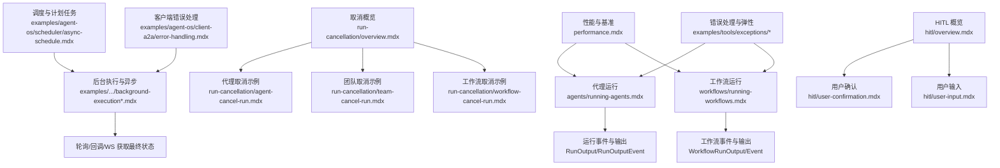
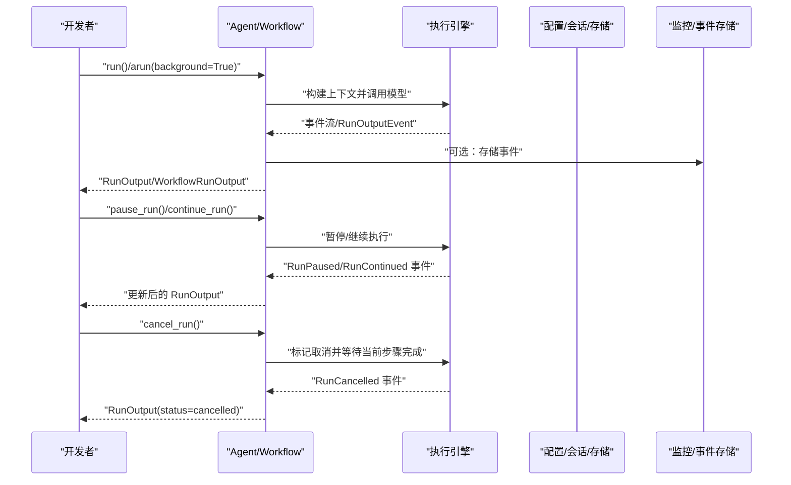
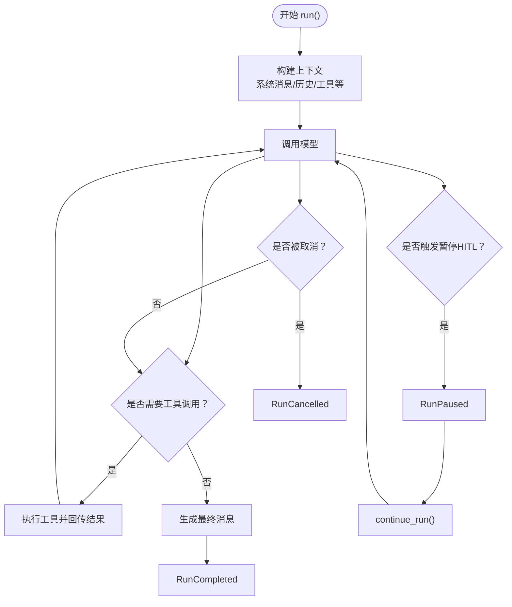
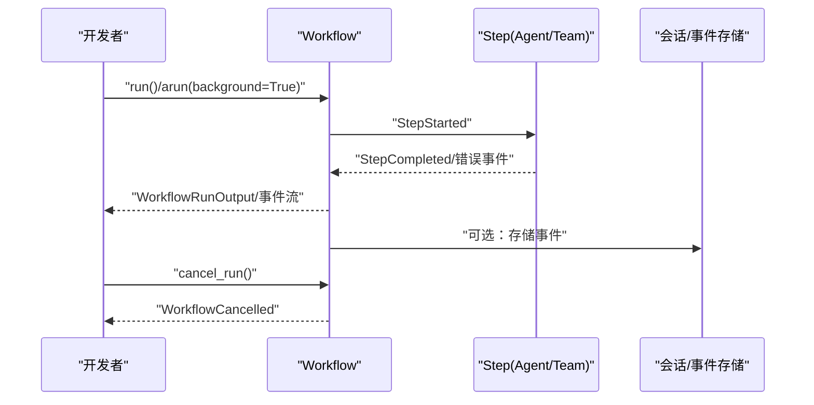
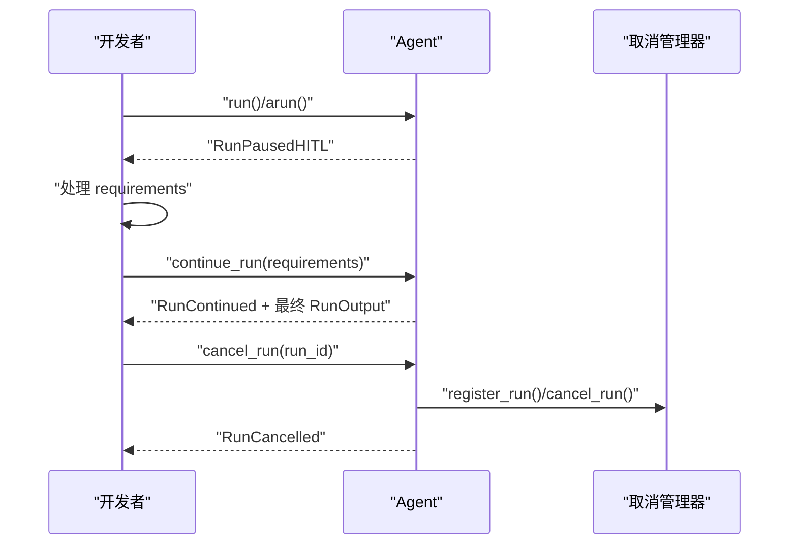
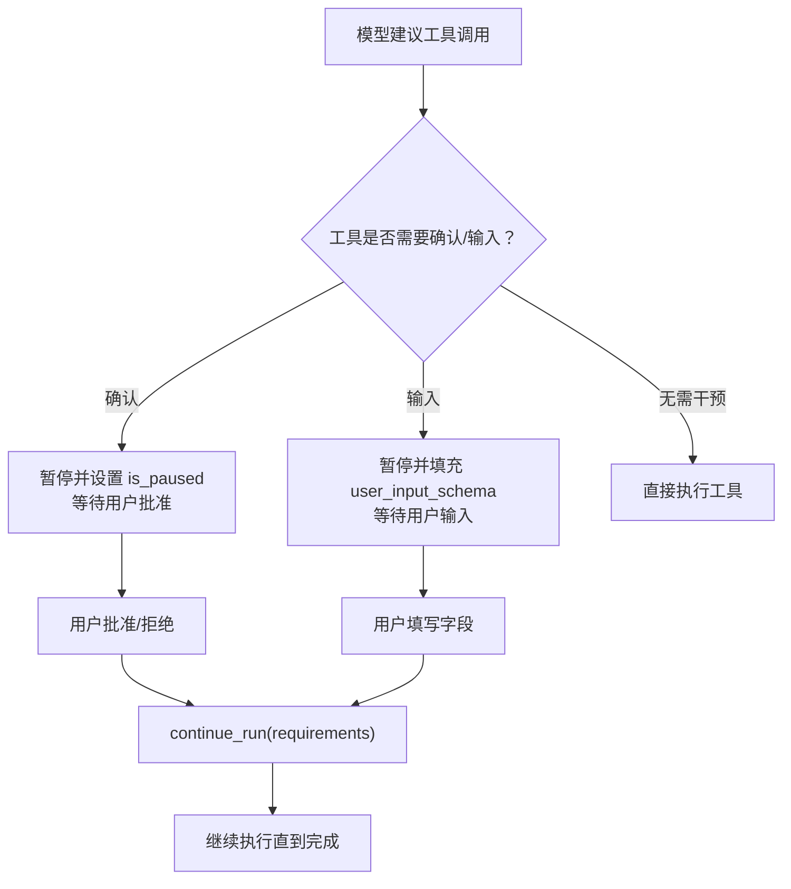
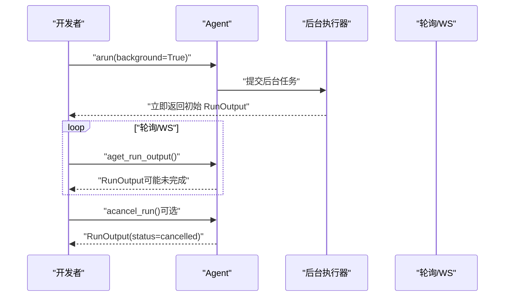
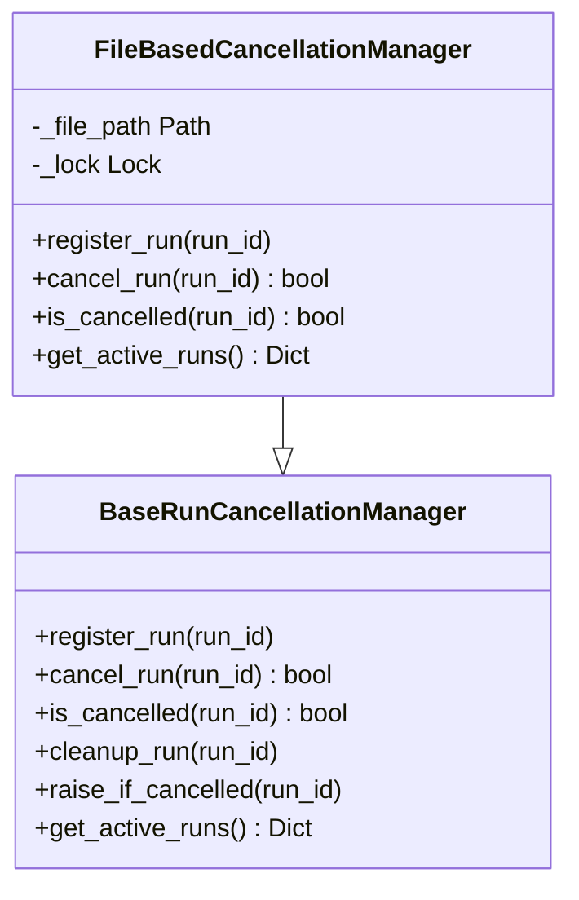
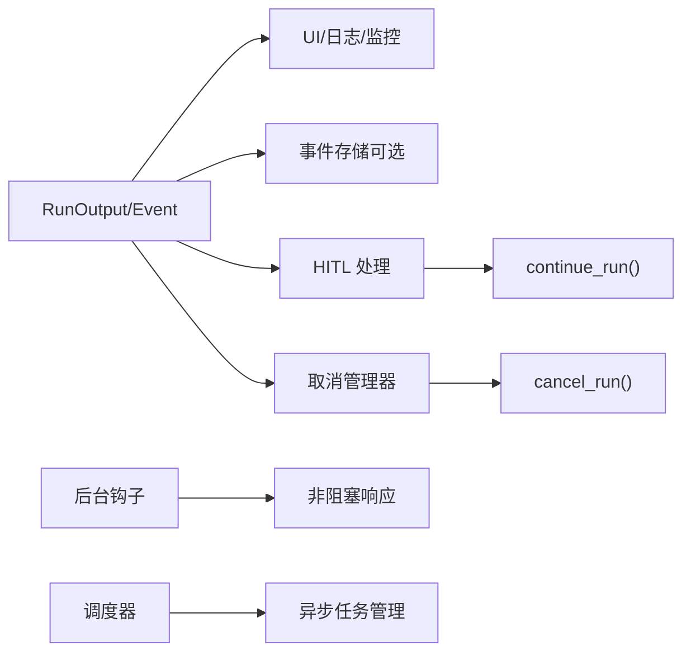

# 代理生命周期管理

<cite>
**本文引用的文件**   
- [agents/running-agents.mdx](file://agents/running-agents.mdx)
- [workflows/running-workflows.mdx](file://workflows/running-workflows.mdx)
- [run-cancellation/overview.mdx](file://run-cancellation/overview.mdx)
- [run-cancellation/agent-cancel-run.mdx](file://run-cancellation/agent-cancel-run.mdx)
- [run-cancellation/team-cancel-run.mdx](file://run-cancellation/team-cancel-run.mdx)
- [run-cancellation/workflow-cancel-run.mdx](file://run-cancellation/workflow-cancel-run.mdx)
- [hitl/overview.mdx](file://hitl/overview.mdx)
- [hitl/user-confirmation.mdx](file://hitl/user-confirmation.mdx)
- [hitl/user-input.mdx](file://hitl/user-input.mdx)
- [examples/agents/advanced/background-execution.mdx](file://examples/agents/advanced/background-execution.mdx)
- [examples/agents/advanced/background-execution-structured.mdx](file://examples/agents/advanced/background-execution-structured.mdx)
- [workflows/background-execution.mdx](file://workflows/background-execution.mdx)
- [examples/agents/advanced/custom-cancellation-manager.mdx](file://examples/agents/advanced/custom-cancellation-manager.mdx)
- [examples/teams/run-control/cancel-run.mdx](file://examples/teams/run-control/cancel-run.mdx)
- [examples/workflows/advanced-concepts/run-control/cancel-run.mdx](file://examples/workflows/advanced-concepts/run-control/cancel-run.mdx)
- [examples/workflows/advanced-concepts/run-control/remote-workflow.mdx](file://examples/workflows/advanced-concepts/run-control/remote-workflow.mdx)
- [examples/workflows/advanced-concepts/run-control/event-storage.mdx](file://examples/workflows/advanced-concepts/run-control/event-storage.mdx)
- [agent-os/background-tasks/overview.mdx](file://agent-os/background-tasks/overview.mdx)
- [examples/agent-os/scheduler/async-schedule.mdx](file://examples/agent-os/scheduler/async-schedule.mdx)
- [performance.mdx](file://performance.mdx)
- [examples/tools/exceptions/overview.mdx](file://examples/tools/exceptions/overview.mdx)
- [examples/tools/exceptions/retry-tool-call.mdx](file://examples/tools/exceptions/retry-tool-call.mdx)
- [examples/tools/exceptions/stop-agent-exception.mdx](file://examples/tools/exceptions/stop-agent-exception.mdx)
- [examples/agent-os/client-a2a/error-handling.mdx](file://examples/agent-os/client-a2a/error-handling.mdx)
</cite>

## 目录
1. [简介](#简介)
2. [项目结构](#项目结构)
3. [核心组件](#核心组件)
4. [架构总览](#架构总览)
5. [详细组件分析](#详细组件分析)
6. [依赖关系分析](#依赖关系分析)
7. [性能考量](#性能考量)
8. [故障排查指南](#故障排查指南)
9. [结论](#结论)
10. [附录](#附录)

## 简介
本文件面向开发者，系统性阐述代理（Agent）、团队（Team）与工作流（Workflow）的运行生命周期管理，覆盖启动、执行、暂停、继续、取消与完成等关键阶段；详解运行控制机制（Agent.pause_run()/continue_run()/cancel_run() 的使用方式）；深入说明人类在环（Human-in-the-Loop, HITL）集成与人工干预流程；提供后台执行与异步处理的实现方案（任务调度与状态管理）；并总结运行监控、错误处理与异常恢复的最佳实践，以及性能优化与资源管理策略。

## 项目结构
围绕“代理生命周期管理”的相关文档主要分布在以下区域：
- 代理运行与事件：agents/running-agents.mdx
- 工作流运行与事件：workflows/running-workflows.mdx
- 运行取消概览与示例：run-cancellation/*
- 人类在环（HITL）：hitl/*
- 后台执行与异步：examples/agents/advanced/background-execution*.mdx、workflows/background-execution.mdx、agent-os/background-tasks/overview.mdx
- 调度与计划任务：examples/agent-os/scheduler/async-schedule.mdx
- 性能与基准：performance.mdx
- 错误处理与弹性：examples/tools/exceptions/*、examples/agent-os/client-a2a/error-handling.mdx

图示来源
- [agents/running-agents.mdx](file://agents/running-agents.mdx)
- [workflows/running-workflows.mdx](file://workflows/running-workflows.mdx)
- [run-cancellation/overview.mdx](file://run-cancellation/overview.mdx)
- [run-cancellation/agent-cancel-run.mdx](file://run-cancellation/agent-cancel-run.mdx)
- [run-cancellation/team-cancel-run.mdx](file://run-cancellation/team-cancel-run.mdx)
- [run-cancellation/workflow-cancel-run.mdx](file://run-cancellation/workflow-cancel-run.mdx)
- [hitl/overview.mdx](file://hitl/overview.mdx)
- [hitl/user-confirmation.mdx](file://hitl/user-confirmation.mdx)
- [hitl/user-input.mdx](file://hitl/user-input.mdx)
- [examples/agents/advanced/background-execution.mdx](file://examples/agents/advanced/background-execution.mdx)
- [examples/agents/advanced/background-execution-structured.mdx](file://examples/agents/advanced/background-execution-structured.mdx)
- [workflows/background-execution.mdx](file://workflows/background-execution.mdx)
- [examples/agent-os/scheduler/async-schedule.mdx](file://examples/agent-os/scheduler/async-schedule.mdx)
- [performance.mdx](file://performance.mdx)
- [examples/tools/exceptions/overview.mdx](file://examples/tools/exceptions/overview.mdx)
- [examples/agent-os/client-a2a/error-handling.mdx](file://examples/agent-os/client-a2a/error-handling.mdx)

章节来源
- [agents/running-agents.mdx](file://agents/running-agents.mdx)
- [workflows/running-workflows.mdx](file://workflows/running-workflows.mdx)
- [run-cancellation/overview.mdx](file://run-cancellation/overview.mdx)

## 核心组件
- 代理运行与事件
  - 代理通过 run()/arun() 执行，返回 RunOutput 或事件流 RunOutputEvent。
  - 支持暂停/继续（RunPaused/RunContinued），支持取消（RunCancelled）与错误（RunError）事件。
  - 可配置事件流（stream_events）以获取更细粒度的内部过程事件。
- 工作流运行与事件
  - 工作流通过 run()/arun() 执行，返回 WorkflowRunOutput 或事件流 WorkflowRunOutputEvent。
  - 支持步骤级事件（StepStarted/Completed）、条件/循环/路由等执行事件。
  - 可选择存储事件到数据库，便于审计与调试。
- 运行取消
  - 提供统一的取消入口（cancel_run），支持非流式与流式场景，保证当前步骤完成后优雅停止。
  - 示例覆盖代理、团队与工作流三种实体。
- 人类在环（HITL）
  - 用户确认（requires_confirmation）与用户输入（requires_user_input）两类模式，均在暂停后由开发者调用 continue_run() 继续。
  - 支持异步与流式场景，事件中包含 active_requirements 以便处理。
- 后台执行与异步
  - 代理与工作流均支持后台运行（background=True），随后通过轮询或 WebSocket 获取最终状态。
  - AgentOS 支持后台钩子（background hooks），避免阻塞响应。
  - 调度器提供异步 CRUD 与启用/禁用、历史查询等能力。

章节来源
- [agents/running-agents.mdx](file://agents/running-agents.mdx)
- [workflows/running-workflows.mdx](file://workflows/running-workflows.mdx)
- [run-cancellation/overview.mdx](file://run-cancellation/overview.mdx)
- [hitl/overview.mdx](file://hitl/overview.mdx)
- [agent-os/background-tasks/overview.mdx](file://agent-os/background-tasks/overview.mdx)
- [examples/agent-os/scheduler/async-schedule.mdx](file://examples/agent-os/scheduler/async-schedule.mdx)

## 架构总览
下图展示了从“请求发起”到“状态获取/事件消费”的典型生命周期路径，涵盖同步、异步、后台与取消等关键环节。

图示来源
- [agents/running-agents.mdx](file://agents/running-agents.mdx)
- [workflows/running-workflows.mdx](file://workflows/running-workflows.mdx)
- [run-cancellation/overview.mdx](file://run-cancellation/overview.mdx)

## 详细组件分析

### 代理生命周期与事件流
- 启动与执行
  - 代理通过 run()/arun() 启动，模型返回消息或工具调用；若为工具调用，代理执行工具并将结果回传给模型，直至生成最终消息。
- 暂停与继续
  - 当出现需要人工干预的场景（如 HITL），代理会在暂停点返回 RunPaused；开发者处理 requirements 后调用 continue_run() 继续。
- 取消
  - 调用 cancel_run() 标记取消；非流式返回 RunOutput（status=cancelled），流式产生 RunCancelled 事件。
- 事件类型
  - 核心事件：RunStarted、RunContent、RunContentCompleted、RunIntermediateContent、RunCompleted、RunError、RunCancelled。
  - 控制流事件：RunPaused、RunContinued。
  - 工具/推理/记忆/会话摘要/钩子/解析器/输出模型等事件类型详见文档。

图示来源
- [agents/running-agents.mdx](file://agents/running-agents.mdx)

章节来源
- [agents/running-agents.mdx](file://agents/running-agents.mdx)

### 工作流生命周期与事件流
- 启动与执行
  - 工作流按步骤顺序执行，支持条件、循环、并行与路由等复杂控制流；每个步骤产生 StepStarted/Completed 等事件。
- 事件存储与过滤
  - 可开启 store_events 并通过 events_to_skip 过滤冗余事件，降低存储与噪声。
- 取消
  - 与代理类似，调用取消接口后优雅停止当前步骤，返回 RunStatus.cancelled。

图示来源
- [workflows/running-workflows.mdx](file://workflows/running-workflows.mdx)
- [examples/workflows/advanced-concepts/run-control/event-storage.mdx](file://examples/workflows/advanced-concepts/run-control/event-storage.mdx)

章节来源
- [workflows/running-workflows.mdx](file://workflows/running-workflows.mdx)
- [examples/workflows/advanced-concepts/run-control/event-storage.mdx](file://examples/workflows/advanced-concepts/run-control/event-storage.mdx)

### 运行控制机制：暂停/继续/取消
- 暂停与继续
  - 在 HITL 场景中，代理暂停并返回 active_requirements；开发者处理后调用 continue_run() 继续。
  - 支持传入 requirements 或 RunOutput 对象进行继续。
- 取消
  - 统一的取消入口（cancel_run），支持代理、团队与工作流；取消后返回 RunStatus.cancelled。
  - 支持“取消前开始”语义：预注册 run_id 后再启动，可在启动即检测到取消。

图示来源
- [hitl/overview.mdx](file://hitl/overview.mdx)
- [hitl/user-confirmation.mdx](file://hitl/user-confirmation.mdx)
- [hitl/user-input.mdx](file://hitl/user-input.mdx)
- [run-cancellation/overview.mdx](file://run-cancellation/overview.mdx)
- [examples/agents/advanced/custom-cancellation-manager.mdx](file://examples/agents/advanced/custom-cancellation-manager.mdx)

章节来源
- [hitl/overview.mdx](file://hitl/overview.mdx)
- [hitl/user-confirmation.mdx](file://hitl/user-confirmation.mdx)
- [hitl/user-input.mdx](file://hitl/user-input.mdx)
- [run-cancellation/overview.mdx](file://run-cancellation/overview.mdx)
- [examples/agents/advanced/custom-cancellation-manager.mdx](file://examples/agents/advanced/custom-cancellation-manager.mdx)

### 人类在环（HITL）集成
- 用户确认（requires_confirmation）
  - 工具标注 requires_confirmation 后，代理在调用前暂停，等待显式批准；拒绝时可提供反馈。
- 用户输入（requires_user_input）
  - 工具标注 requires_user_input 后，代理暂停并填充 user_input_schema，等待用户提供缺失参数。
- 异步与流式支持
  - 支持 arun()/acontinue_run() 与流式事件；暂停点可直接在事件流中识别并处理 requirements。
- 实现要点
  - 使用 active_requirements 遍历待处理需求；
  - 调用 continue_run() 时传入已更新的 requirements；
  - 注意三者互斥：同一工具不能同时要求确认、输入或外部执行。

图示来源
- [hitl/overview.mdx](file://hitl/overview.mdx)
- [hitl/user-confirmation.mdx](file://hitl/user-confirmation.mdx)
- [hitl/user-input.mdx](file://hitl/user-input.mdx)

章节来源
- [hitl/overview.mdx](file://hitl/overview.mdx)
- [hitl/user-confirmation.mdx](file://hitl/user-confirmation.mdx)
- [hitl/user-input.mdx](file://hitl/user-input.mdx)

### 后台执行与异步处理
- 代理后台执行
  - arun(background=True) 启动后台任务，随后通过 aget_run_output() 轮询获取最终状态；也可使用取消接口提前终止。
- 工作流后台执行
  - 支持后台运行与轮询；示例展示每 5 秒轮询一次，直到完成或超时。
- AgentOS 后台钩子
  - 预钩子/后钩子可作为非阻塞后台任务执行，提升响应速度。
- 调度与计划任务
  - 提供异步 CRUD、启用/禁用、历史查询与控制台展示。

图示来源
- [examples/agents/advanced/background-execution.mdx](file://examples/agents/advanced/background-execution.mdx)
- [examples/agents/advanced/background-execution-structured.mdx](file://examples/agents/advanced/background-execution-structured.mdx)
- [workflows/background-execution.mdx](file://workflows/background-execution.mdx)
- [agent-os/background-tasks/overview.mdx](file://agent-os/background-tasks/overview.mdx)
- [examples/agent-os/scheduler/async-schedule.mdx](file://examples/agent-os/scheduler/async-schedule.mdx)

章节来源
- [examples/agents/advanced/background-execution.mdx](file://examples/agents/advanced/background-execution.mdx)
- [examples/agents/advanced/background-execution-structured.mdx](file://examples/agents/advanced/background-execution-structured.mdx)
- [workflows/background-execution.mdx](file://workflows/background-execution.mdx)
- [agent-os/background-tasks/overview.mdx](file://agent-os/background-tasks/overview.mdx)
- [examples/agent-os/scheduler/async-schedule.mdx](file://examples/agent-os/scheduler/async-schedule.mdx)

### 取消管理器与“取消前开始”
- 自定义取消管理器
  - 示例演示基于文件的取消管理器，持久化 run_id 到 JSON 文件，支持并发安全与跨进程共享。
- 取消前开始语义
  - 先注册 run_id 再启动，可在启动阶段即检测到取消并短路执行。

图示来源
- [examples/agents/advanced/custom-cancellation-manager.mdx](file://examples/agents/advanced/custom-cancellation-manager.mdx)

章节来源
- [examples/agents/advanced/custom-cancellation-manager.mdx](file://examples/agents/advanced/custom-cancellation-manager.mdx)

## 依赖关系分析
- 事件驱动
  - 代理与工作流均通过事件流暴露内部状态变化，便于 UI 展示与调试。
- 取消链路
  - 取消管理器与运行控制接口解耦，支持多种后端（文件/数据库/消息队列/API）。
- 异步与后台
  - AgentOS 后台钩子与调度器提供异步扩展点，避免阻塞主执行路径。
- 错误与弹性
  - 工具异常示例提供重试与停止条件，防止无限循环与资源浪费。

图示来源
- [agents/running-agents.mdx](file://agents/running-agents.mdx)
- [workflows/running-workflows.mdx](file://workflows/running-workflows.mdx)
- [agent-os/background-tasks/overview.mdx](file://agent-os/background-tasks/overview.mdx)
- [examples/agent-os/scheduler/async-schedule.mdx](file://examples/agent-os/scheduler/async-schedule.mdx)

章节来源
- [agents/running-agents.mdx](file://agents/running-agents.mdx)
- [workflows/running-workflows.mdx](file://workflows/running-workflows.mdx)
- [agent-os/background-tasks/overview.mdx](file://agent-os/background-tasks/overview.mdx)
- [examples/agent-os/scheduler/async-schedule.mdx](file://examples/agent-os/scheduler/async-schedule.mdx)

## 性能考量
- 基准与优化方向
  - 关注实例化时间与内存占用，强调异步优先、最小内存、并行执行与后台线程。
  - 通过事件存储与过滤减少噪音，平衡可观测性与开销。
- 实践建议
  - 合理使用 stream_events 与 store_events，按需开启；
  - 使用后台钩子与调度器提升吞吐；
  - 在工具层实现重试与停止条件，避免无效重试。

章节来源
- [performance.mdx](file://performance.mdx)
- [workflows/running-workflows.mdx](file://workflows/running-workflows.mdx)

## 故障排查指南
- 取消相关
  - 确认取消管理器状态一致性；检查“取消前开始”场景下的注册与检测逻辑。
  - 团队/工作流取消示例展示了延迟取消与最终状态比对。
- 错误处理与弹性
  - 工具异常示例提供重试与停止条件的实现思路；
  - 客户端错误处理示例涵盖连接失败、超时与应用级失败的处理模式。
- 远程/网络问题
  - 使用客户端错误处理示例中的模式，区分 HTTP 错误与服务不可达，并给出恢复建议。

章节来源
- [examples/agents/advanced/custom-cancellation-manager.mdx](file://examples/agents/advanced/custom-cancellation-manager.mdx)
- [examples/teams/run-control/cancel-run.mdx](file://examples/teams/run-control/cancel-run.mdx)
- [examples/workflows/advanced-concepts/run-control/cancel-run.mdx](file://examples/workflows/advanced-concepts/run-control/cancel-run.mdx)
- [examples/tools/exceptions/retry-tool-call.mdx](file://examples/tools/exceptions/retry-tool-call.mdx)
- [examples/tools/exceptions/stop-agent-exception.mdx](file://examples/tools/exceptions/stop-agent-exception.mdx)
- [examples/agent-os/client-a2a/error-handling.mdx](file://examples/agent-os/client-a2a/error-handling.mdx)

## 结论
通过事件驱动的运行模型、完善的暂停/继续/取消机制、灵活的 HITL 集成、可靠的后台执行与异步处理，以及可扩展的取消管理器与错误处理策略，Agno 为代理、团队与工作流提供了高可控、可观测且高性能的生命周期管理能力。建议在生产环境中结合事件存储、后台钩子与调度器，配合合理的取消与弹性策略，确保系统的稳定性与可维护性。

## 附录
- 开发者资源
  - 代理参考与 RunOutput 文档：agents/running-agents.mdx
  - 工作流参考与事件文档：workflows/running-workflows.mdx
  - 取消参考与示例：run-cancellation/*
  - HITL 使用示例：hitl/*
  - 后台执行与 AgentOS 背景钩子：examples/.../background-execution*.mdx、agent-os/background-tasks/overview.mdx
  - 调度与计划任务：examples/agent-os/scheduler/async-schedule.mdx
  - 性能与基准：performance.mdx
  - 错误处理与弹性：examples/tools/exceptions/*、examples/agent-os/client-a2a/error-handling.mdx