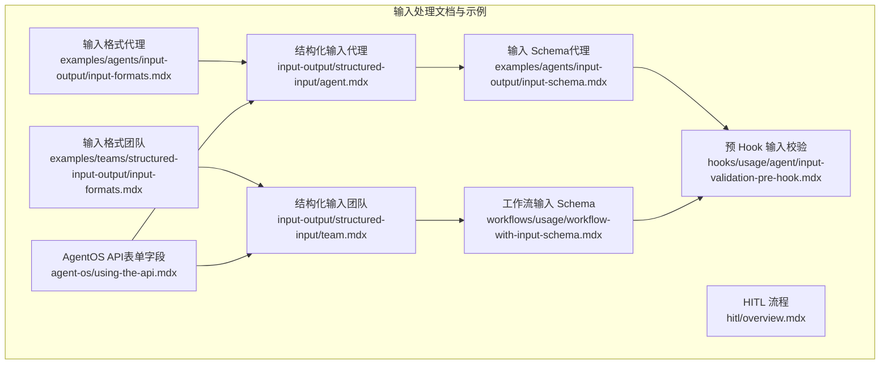
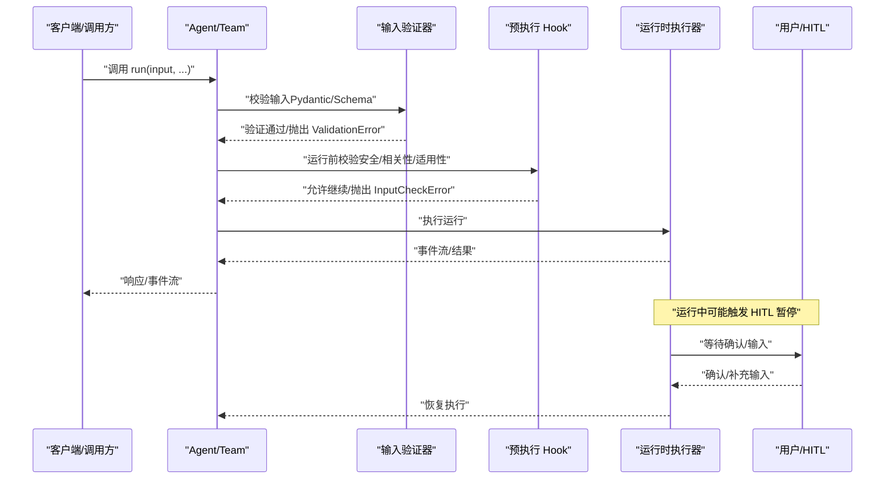
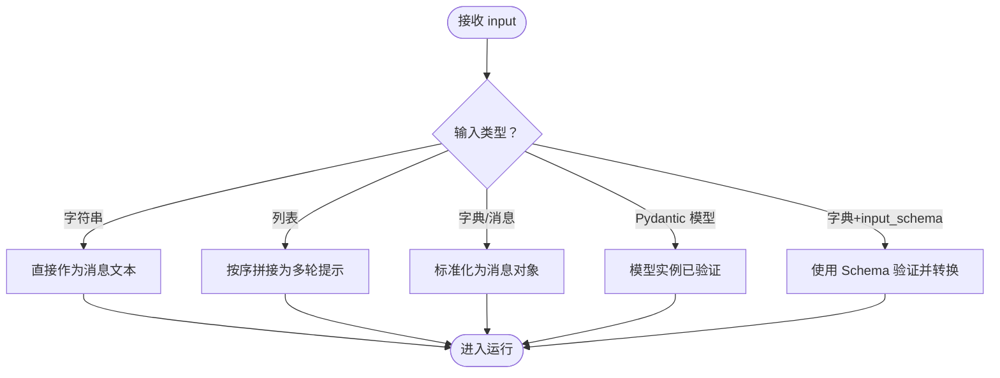
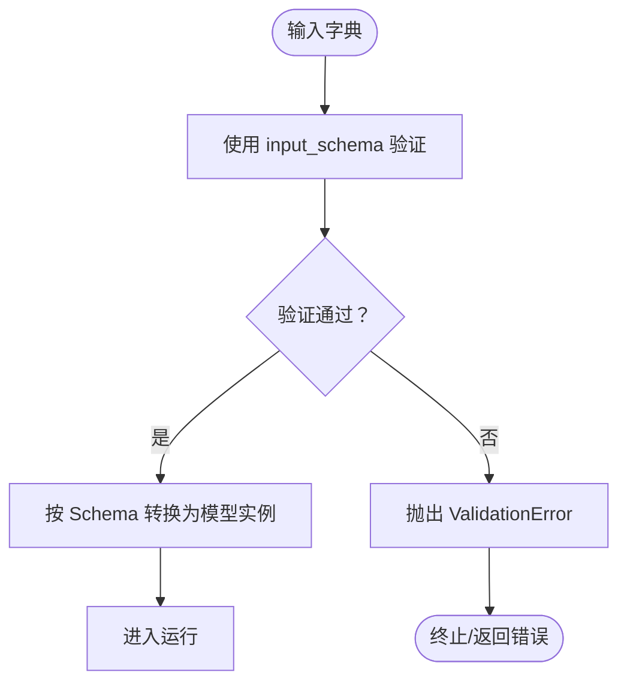
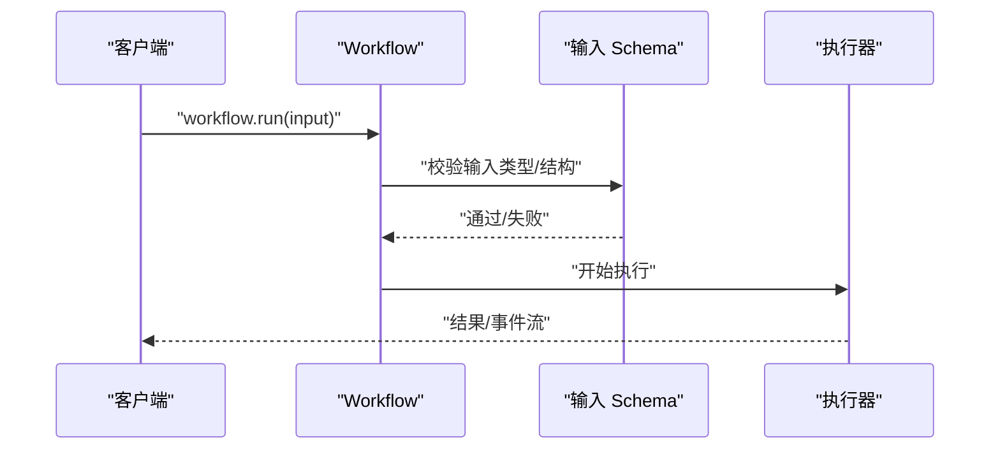
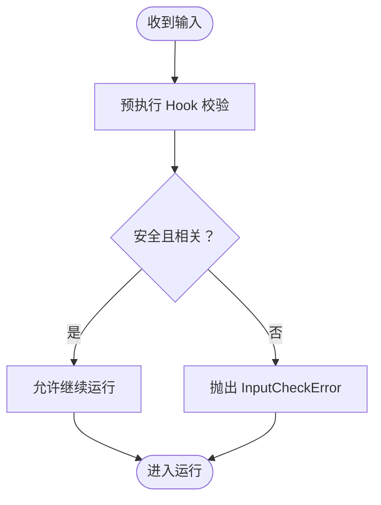
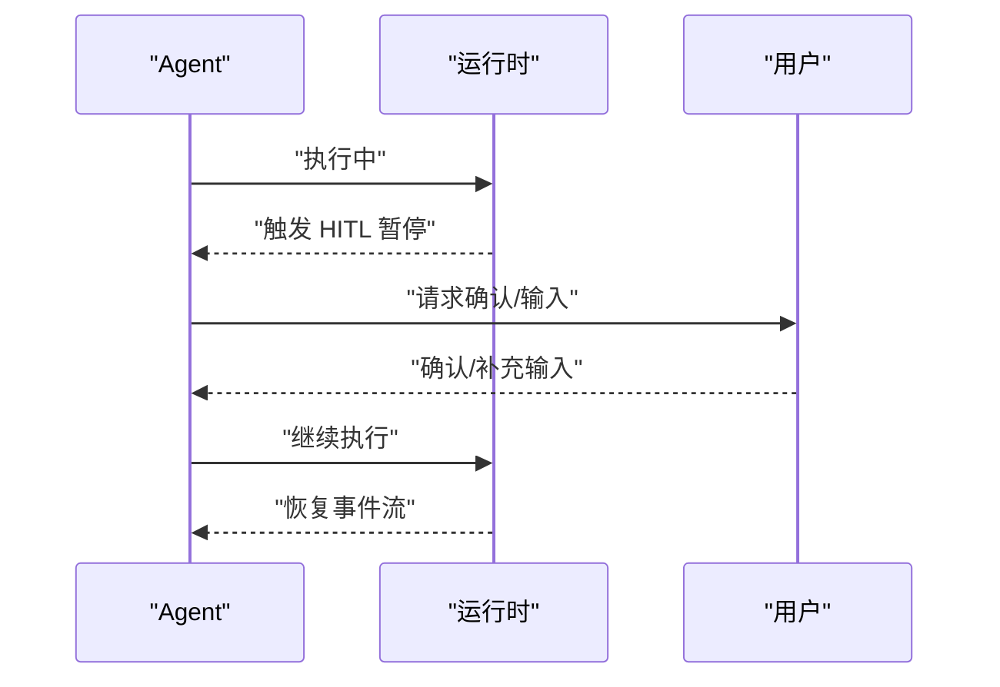
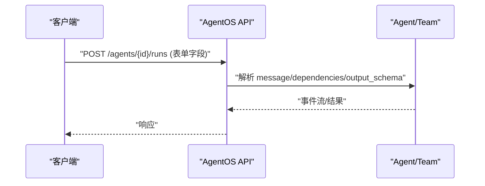
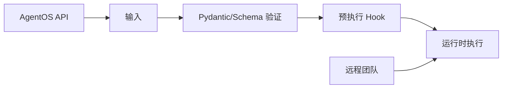

# 代理输入处理

<cite>
**本文引用的文件**
- [input-output/structured-input/agent.mdx](file://input-output/structured-input/agent.mdx)
- [input-output/structured-input/team.mdx](file://input-output/structured-input/team.mdx)
- [examples/agents/input-output/input-formats.mdx](file://examples/agents/input-output/input-formats.mdx)
- [examples/teams/structured-input-output/input-formats.mdx](file://examples/teams/structured-input-output/input-formats.mdx)
- [examples/agents/input-output/input-schema.mdx](file://examples/agents/input-output/input-schema.mdx)
- [workflows/usage/workflow-with-input-schema.mdx](file://workflows/usage/workflow-with-input-schema.mdx)
- [hooks/usage/agent/input-validation-pre-hook.mdx](file://hooks/usage/agent/input-validation-pre-hook.mdx)
- [hitl/overview.mdx](file://hitl/overview.mdx)
- [agent-os/using-the-api.mdx](file://agent-os/using-the-api.mdx)
- [reference/teams/remote-team.mdx](file://reference/teams/remote-team.mdx)
</cite>

## 目录
1. [简介](#简介)
2. [项目结构](#项目结构)
3. [核心组件](#核心组件)
4. [架构总览](#架构总览)
5. [详细组件分析](#详细组件分析)
6. [依赖关系分析](#依赖关系分析)
7. [性能考量](#性能考量)
8. [故障排查指南](#故障排查指南)
9. [结论](#结论)
10. [附录](#附录)

## 简介
本文件聚焦于代理（Agent）与团队（Team）的输入处理机制，系统阐述 Agent.run() 方法支持的多种输入格式（字符串、列表、字典、消息对象、Pydantic 模型等），并给出使用场景、最佳实践、验证与错误处理策略，以及结构化输入（Schema）的使用指南。文档同时覆盖来自外部接口的输入（如 API 表单字段）与人类在环（HITL）流程中的输入要求。

## 项目结构
围绕代理输入处理的相关文档与示例分布如下：
- 结构化输入（代理/团队）：通过 Pydantic 模型进行输入验证与转换
- 输入格式示例（代理/团队）：展示字符串、列表、消息对象等输入形态
- 输入 Schema 示例：演示如何在代理中使用 input_schema
- 工作流输入 Schema：展示工作流入口处的输入验证
- 预执行 Hook：在运行前对输入进行安全与相关性校验
- 人类在环（HITL）：在运行过程中暂停并要求用户提供输入或确认
- AgentOS API：通过表单字段传递依赖与结构化输入

**图表来源**
- [input-output/structured-input/agent.mdx](file://input-output/structured-input/agent.mdx)
- [input-output/structured-input/team.mdx](file://input-output/structured-input/team.mdx)
- [examples/agents/input-output/input-formats.mdx](file://examples/agents/input-output/input-formats.mdx)
- [examples/teams/structured-input-output/input-formats.mdx](file://examples/teams/structured-input-output/input-formats.mdx)
- [examples/agents/input-output/input-schema.mdx](file://examples/agents/input-output/input-schema.mdx)
- [workflows/usage/workflow-with-input-schema.mdx](file://workflows/usage/workflow-with-input-schema.mdx)
- [hooks/usage/agent/input-validation-pre-hook.mdx](file://hooks/usage/agent/input-validation-pre-hook.mdx)
- [hitl/overview.mdx](file://hitl/overview.mdx)
- [agent-os/using-the-api.mdx](file://agent-os/using-the-api.mdx)

**章节来源**
- [input-output/structured-input/agent.mdx:1-187](file://input-output/structured-input/agent.mdx#L1-L187)
- [input-output/structured-input/team.mdx:1-224](file://input-output/structured-input/team.mdx#L1-L224)
- [examples/agents/input-output/input-formats.mdx:1-55](file://examples/agents/input-output/input-formats.mdx#L1-L55)
- [examples/teams/structured-input-output/input-formats.mdx:1-70](file://examples/teams/structured-input-output/input-formats.mdx#L1-L70)
- [examples/agents/input-output/input-schema.mdx:1-81](file://examples/agents/input-output/input-schema.mdx#L1-L81)
- [workflows/usage/workflow-with-input-schema.mdx:151-162](file://workflows/usage/workflow-with-input-schema.mdx#L151-L162)
- [hooks/usage/agent/input-validation-pre-hook.mdx:132-175](file://hooks/usage/agent/input-validation-pre-hook.mdx#L132-L175)
- [hitl/overview.mdx:29-97](file://hitl/overview.mdx#L29-L97)
- [agent-os/using-the-api.mdx:48-73](file://agent-os/using-the-api.mdx#L48-L73)

## 核心组件
- 代理（Agent）与团队（Team）的输入处理
  - 字符串：最简输入，适合一次性自然语言指令
  - 列表：顺序化输入，常用于多轮提示或分步指令
  - 字典/消息对象：结构化消息，支持角色与内容的明确分离
  - Pydantic 模型：强类型输入，支持自动验证与转换
  - input_schema：在代理/团队上声明输入模式，自动校验外部来源输入
- 工作流（Workflow）输入
  - 通过 input_schema 在入口处进行类型与结构校验
- 预执行 Hook
  - 在运行前对输入进行安全、相关性与适用性检查
- 人类在环（HITL）
  - 在运行中暂停，等待用户确认或补充输入
- AgentOS API
  - 通过表单字段传递 message、dependencies、output_schema 等运行参数

**章节来源**
- [input-output/structured-input/agent.mdx:7-187](file://input-output/structured-input/agent.mdx#L7-L187)
- [input-output/structured-input/team.mdx:7-224](file://input-output/structured-input/team.mdx#L7-L224)
- [examples/agents/input-output/input-formats.mdx:1-55](file://examples/agents/input-output/input-formats.mdx#L1-L55)
- [examples/teams/structured-input-output/input-formats.mdx:1-70](file://examples/teams/structured-input-output/input-formats.mdx#L1-L70)
- [examples/agents/input-output/input-schema.mdx:1-81](file://examples/agents/input-output/input-schema.mdx#L1-L81)
- [workflows/usage/workflow-with-input-schema.mdx:151-162](file://workflows/usage/workflow-with-input-schema.mdx#L151-L162)
- [hooks/usage/agent/input-validation-pre-hook.mdx:132-175](file://hooks/usage/agent/input-validation-pre-hook.mdx#L132-L175)
- [hitl/overview.mdx:29-97](file://hitl/overview.mdx#L29-L97)
- [agent-os/using-the-api.mdx:48-73](file://agent-os/using-the-api.mdx#L48-L73)

## 架构总览
下图展示了从输入进入代理/团队到运行时执行的关键路径，包括结构化输入验证、Hook 预检、以及人类在环的暂停与恢复流程。

**图表来源**
- [input-output/structured-input/agent.mdx:72-95](file://input-output/structured-input/agent.mdx#L72-L95)
- [input-output/structured-input/team.mdx:108-130](file://input-output/structured-input/team.mdx#L108-L130)
- [hooks/usage/agent/input-validation-pre-hook.mdx:132-175](file://hooks/usage/agent/input-validation-pre-hook.mdx#L132-L175)
- [hitl/overview.mdx:29-97](file://hitl/overview.mdx#L29-L97)

## 详细组件分析

### 代理输入格式与最佳实践
- 字符串输入
  - 适用：一次性自然语言指令
  - 最佳实践：保持简洁明确；复杂场景建议使用结构化输入
- 列表输入
  - 适用：多轮提示、分步指令
  - 最佳实践：确保顺序与上下文连贯
- 字典/消息对象
  - 适用：明确角色与内容分离的消息
  - 最佳实践：遵循消息结构约定，便于多模态与历史管理
- Pydantic 模型输入
  - 适用：强类型、带约束的数据结构
  - 最佳实践：在模型中定义字段范围、默认值与描述，提前发现数据问题
- input_schema
  - 适用：外部来源输入（API、配置文件、用户输入）
  - 最佳实践：与工具/任务职责相匹配，避免过度宽松导致误用

**图表来源**
- [examples/agents/input-output/input-formats.mdx:1-55](file://examples/agents/input-output/input-formats.mdx#L1-L55)
- [examples/teams/structured-input-output/input-formats.mdx:1-70](file://examples/teams/structured-input-output/input-formats.mdx#L1-L70)
- [input-output/structured-input/agent.mdx:13-70](file://input-output/structured-input/agent.mdx#L13-L70)
- [input-output/structured-input/team.mdx:13-106](file://input-output/structured-input/team.mdx#L13-L106)

**章节来源**
- [examples/agents/input-output/input-formats.mdx:1-55](file://examples/agents/input-output/input-formats.mdx#L1-L55)
- [examples/teams/structured-input-output/input-formats.mdx:1-70](file://examples/teams/structured-input-output/input-formats.mdx#L1-L70)
- [input-output/structured-input/agent.mdx:13-70](file://input-output/structured-input/agent.mdx#L13-L70)
- [input-output/structured-input/team.mdx:13-106](file://input-output/structured-input/team.mdx#L13-L106)

### 结构化输入（Pydantic Schema）与类型转换
- 代理/团队支持通过 input_schema 对输入进行自动验证
- 支持嵌套模型、列表、联合类型等复杂结构
- 验证失败抛出 Pydantic ValidationError，便于在运行前捕获与处理

**图表来源**
- [input-output/structured-input/agent.mdx:41-95](file://input-output/structured-input/agent.mdx#L41-L95)
- [input-output/structured-input/team.mdx:60-130](file://input-output/structured-input/team.mdx#L60-L130)
- [examples/agents/input-output/input-schema.mdx:1-81](file://examples/agents/input-output/input-schema.mdx#L1-L81)

**章节来源**
- [input-output/structured-input/agent.mdx:41-95](file://input-output/structured-input/agent.mdx#L41-L95)
- [input-output/structured-input/team.mdx:60-130](file://input-output/structured-input/team.mdx#L60-L130)
- [examples/agents/input-output/input-schema.mdx:1-81](file://examples/agents/input-output/input-schema.mdx#L1-L81)

### 工作流输入 Schema 验证
- 工作流入口支持通过 input_schema 进行类型与结构校验
- 支持字典与匹配的 Pydantic 模型输入
- 类型不匹配会在运行前被捕捉，避免无效执行

**图表来源**
- [workflows/usage/workflow-with-input-schema.mdx:151-162](file://workflows/usage/workflow-with-input-schema.mdx#L151-L162)

**章节来源**
- [workflows/usage/workflow-with-input-schema.mdx:151-162](file://workflows/usage/workflow-with-input-schema.mdx#L151-L162)

### 预执行 Hook 与输入验证
- 在运行前对输入进行安全、相关性与适用性检查
- 可根据校验结果抛出 InputCheckError，阻止不合适的执行

**图表来源**
- [hooks/usage/agent/input-validation-pre-hook.mdx:132-175](file://hooks/usage/agent/input-validation-pre-hook.mdx#L132-L175)

**章节来源**
- [hooks/usage/agent/input-validation-pre-hook.mdx:132-175](file://hooks/usage/agent/input-validation-pre-hook.mdx#L132-L175)

### 人类在环（HITL）输入处理
- 运行中可能因安全或复杂度触发暂停
- 需要用户确认工具调用或补充输入
- 支持流式事件与后续继续执行

**图表来源**
- [hitl/overview.mdx:29-97](file://hitl/overview.mdx#L29-L97)

**章节来源**
- [hitl/overview.mdx:29-97](file://hitl/overview.mdx#L29-L97)

### AgentOS API 与表单输入
- 通过 multipart/form-data 传递 message、dependencies、output_schema 等
- 适合从 Web/接口层向代理/团队提交输入与运行参数

**图表来源**
- [agent-os/using-the-api.mdx:48-73](file://agent-os/using-the-api.mdx#L48-L73)

**章节来源**
- [agent-os/using-the-api.mdx:48-73](file://agent-os/using-the-api.mdx#L48-L73)

## 依赖关系分析
- 输入验证链路
  - Pydantic 模型/Schema 验证 → 预执行 Hook → 运行时执行
- 外部依赖
  - AgentOS API 依赖 JWT/RBAC（可选）与生命周期钩子
  - 远程团队依赖远程 AgentOS 可达性与认证

**图表来源**
- [input-output/structured-input/agent.mdx:41-95](file://input-output/structured-input/agent.mdx#L41-L95)
- [hooks/usage/agent/input-validation-pre-hook.mdx:132-175](file://hooks/usage/agent/input-validation-pre-hook.mdx#L132-L175)
- [agent-os/using-the-api.mdx:48-73](file://agent-os/using-the-api.mdx#L48-L73)
- [reference/teams/remote-team.mdx:263-283](file://reference/teams/remote-team.mdx#L263-L283)

**章节来源**
- [input-output/structured-input/agent.mdx:41-95](file://input-output/structured-input/agent.mdx#L41-L95)
- [hooks/usage/agent/input-validation-pre-hook.mdx:132-175](file://hooks/usage/agent/input-validation-pre-hook.mdx#L132-L175)
- [agent-os/using-the-api.mdx:48-73](file://agent-os/using-the-api.mdx#L48-L73)
- [reference/teams/remote-team.mdx:263-283](file://reference/teams/remote-team.mdx#L263-L283)

## 性能考量
- 结构化输入的优势
  - 提前发现数据问题，减少运行时重试与回滚成本
  - Schema 可作为契约，降低接口变更带来的风险
- 流式输出与事件
  - 对长耗时运行，建议使用 SSE 流式输出，避免阻塞
- Hook 与 HITL
  - 预执行 Hook 与 HITL 会引入额外等待时间，应在设计阶段评估其对延迟的影响

[本节为通用指导，无需列出章节来源]

## 故障排查指南
- Pydantic 验证错误（ValidationError）
  - 现象：输入不符合 Schema 或模型约束
  - 处理：修正输入数据或调整 Schema；在调用前进行本地校验
- 预执行 Hook 拒绝（InputCheckError）
  - 现象：输入不安全、无关或不适用
  - 处理：根据错误触发原因调整输入或前置过滤
- 远程团队不可用
  - 现象：远程服务不可达
  - 处理：检查网络、认证令牌与服务状态
- AgentOS API 表单字段问题
  - 现象：message、dependencies、output_schema 传递异常
  - 处理：确认 Content-Type 与字段编码；核对 JSON/字典格式

**章节来源**
- [input-output/structured-input/agent.mdx:72-95](file://input-output/structured-input/agent.mdx#L72-L95)
- [input-output/structured-input/team.mdx:108-130](file://input-output/structured-input/team.mdx#L108-L130)
- [hooks/usage/agent/input-validation-pre-hook.mdx:132-175](file://hooks/usage/agent/input-validation-pre-hook.mdx#L132-L175)
- [reference/teams/remote-team.mdx:263-283](file://reference/teams/remote-team.mdx#L263-L283)
- [agent-os/using-the-api.mdx:48-73](file://agent-os/using-the-api.mdx#L48-L73)

## 结论
- 代理与团队的输入处理应优先采用结构化 Schema，结合 Pydantic 模型实现强类型与自动验证
- 外部来源输入建议通过 input_schema 进行统一校验，确保契约清晰
- 预执行 Hook 与 HITL 是保障安全与可控性的关键手段
- 在生产环境中，配合 AgentOS API 的表单参数与流式输出，可实现稳定高效的输入处理与运行体验

[本节为总结性内容，无需列出章节来源]

## 附录
- 常用输入格式速览
  - 字符串：一次性自然语言指令
  - 列表：多轮提示或分步指令
  - 字典/消息对象：明确角色与内容
  - Pydantic 模型：强类型与约束
  - input_schema：外部输入的自动验证
- 最佳实践清单
  - 在模型中明确字段范围与默认值
  - 使用 input_schema 限定外部输入
  - 在运行前通过 Hook 做安全与相关性检查
  - 对长耗时运行使用流式输出
  - 在 API 层通过表单字段传递 dependencies 与 output_schema

[本节为概览性内容，无需列出章节来源]