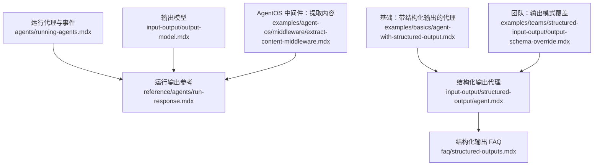
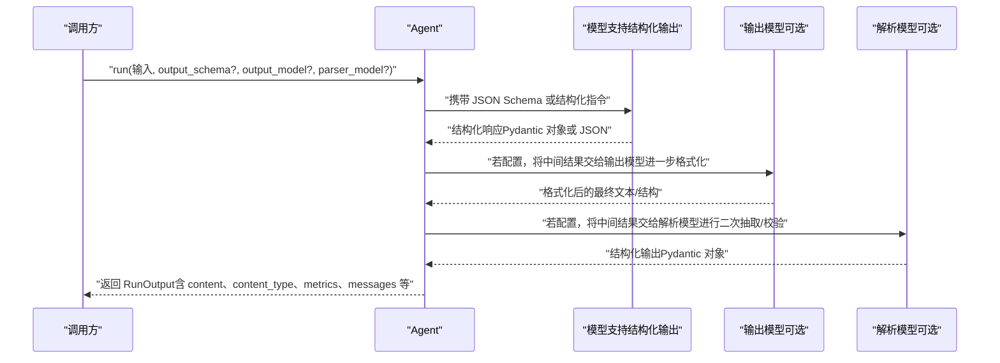
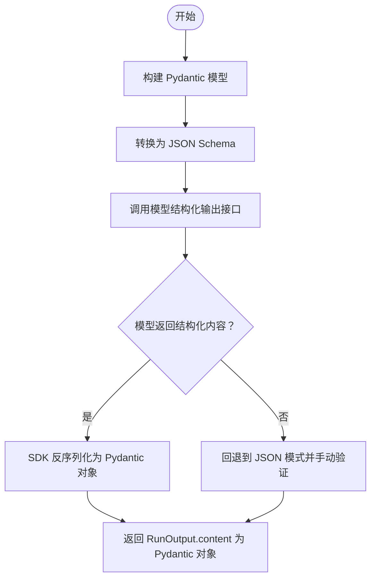
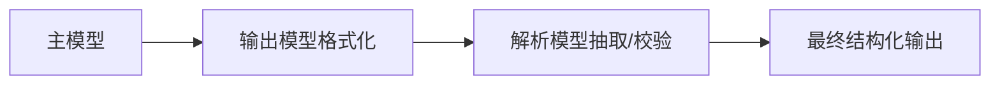
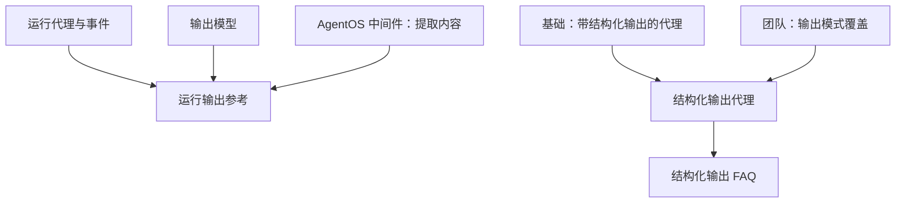

# 代理输出处理

<cite>
**本文引用的文件**
- [运行代理-事件与输出](file://agents/running-agents.mdx)
- [运行输出参考](file://reference/agents/run-response.mdx)
- [结构化输出（代理）](file://input-output/structured-output/agent.mdx)
- [结构化输出 FAQ](file://faq/structured-outputs.mdx)
- [输出模型](file://input-output/output-model.mdx)
- [基础：带结构化输出的代理](file://examples/basics/agent-with-structured-output.mdx)
- [团队：输出模式覆盖](file://examples/teams/structured-input-output/output-schema-override.mdx)
- [AgentOS 中间件：提取内容](file://examples/agent-os/middleware/extract-content-middleware.mdx)
- [版本变更：v2 更新](file://other/v2-changelog.mdx)
</cite>

## 目录
1. [简介](#简介)
2. [项目结构](#项目结构)
3. [核心组件](#核心组件)
4. [架构总览](#架构总览)
5. [详细组件分析](#详细组件分析)
6. [依赖关系分析](#依赖关系分析)
7. [性能考量](#性能考量)
8. [故障排查指南](#故障排查指南)
9. [结论](#结论)
10. [附录](#附录)

## 简介
本文件面向开发者，系统性说明代理在执行完成后返回的 RunOutput 对象结构与行为，重点涵盖以下方面：
- RunOutput 的核心属性与语义，包括 run_id、agent_id、content、content_type、messages、metrics 等
- 结构化输出的实现机制：Pydantic 模型如何被转换为 JSON Schema 并由模型侧进行严格解析与验证
- 输出模型（output_model）与解析模型（parser_model）的协作流程与适用场景
- 输出处理最佳实践：内容类型判断、错误处理、性能优化
- 实际示例与常见问题的解决方案

## 项目结构
围绕“代理输出处理”的知识分布在多个文档中：
- 运行代理与事件：介绍非流式与流式两种返回形态，以及事件类型
- 运行输出参考：给出 RunOutput 及其事件类型的完整字段说明
- 结构化输出：说明如何通过 output_schema 获取强类型 Pydantic 对象
- 输出模型：说明如何用 secondary model 进一步格式化或校验最终输出
- 示例：基础示例与团队示例展示了结构化输出的实际用法与 per-run 覆盖策略
- AgentOS 中间件：演示如何从响应体中提取 content，便于集成通知或日志

**图表来源**
- [运行代理-事件与输出:69-173](file://agents/running-agents.mdx#L69-L173)
- [运行输出参考:6-42](file://reference/agents/run-response.mdx#L6-L42)
- [结构化输出（代理）:1-42](file://input-output/structured-output/agent.mdx#L1-L42)
- [结构化输出 FAQ:1-79](file://faq/structured-outputs.mdx#L1-L79)
- [输出模型:1-46](file://input-output/output-model.mdx#L1-L46)
- [基础：带结构化输出的代理:1-27](file://examples/basics/agent-with-structured-output.mdx#L1-L27)
- [团队：输出模式覆盖:1-33](file://examples/teams/structured-input-output/output-schema-override.mdx#L1-L33)
- [AgentOS 中间件：提取内容:1-31](file://examples/agent-os/middleware/extract-content-middleware.mdx#L1-L31)

**章节来源**
- [运行代理-事件与输出:69-173](file://agents/running-agents.mdx#L69-L173)
- [运行输出参考:6-42](file://reference/agents/run-response.mdx#L6-L42)

## 核心组件
- RunOutput：非流式运行的统一结果载体，包含运行标识、模型信息、消息历史、指标、媒体附件、引用与元数据等，并承载最终 content
- RunOutputEvent：流式运行产生的事件集合，按阶段分发，如 RunStarted、RunContent、RunIntermediateContent、RunCompleted、RunError、RunCancelled 等
- 结构化输出（output_schema）：通过 Pydantic 模型驱动，将模型输出严格约束到指定结构
- 输出模型（output_model）与解析模型（parser_model）：在需要更强格式化能力或二次校验时，使用额外模型对中间/最终输出进行再加工

关键要点
- content_type 字段用于指示 content 的数据类型；当使用结构化输出时，该值通常为 Pydantic 模型类名
- metrics 字段承载本次运行的用量与耗时等指标，便于观测与计费
- messages 字段记录发送给模型的历史消息，便于审计与重放
- 流式模式下，content 以增量事件的形式到达，支持中间态与最终态区分

**章节来源**
- [运行代理-事件与输出:69-173](file://agents/running-agents.mdx#L69-L173)
- [运行输出参考:6-42](file://reference/agents/run-response.mdx#L6-L42)

## 架构总览
下图展示了从 Agent.run 到最终输出的关键路径，包括结构化输出与输出模型的协同：

**图表来源**
- [结构化输出（代理）:35-42](file://input-output/structured-output/agent.mdx#L35-L42)
- [输出模型:10-31](file://input-output/output-model.mdx#L10-L31)
- [运行输出参考:6-42](file://reference/agents/run-response.mdx#L6-L42)

## 详细组件分析

### RunOutput 对象结构与属性
- 标识与上下文
  - run_id、agent_id、agent_name、session_id、parent_run_id、workflow_id、user_id
- 内容与类型
  - content：最终内容，可能是字符串、Pydantic 对象或媒体对象
  - content_type：content 的数据类型标识；结构化输出时通常为模型类名
  - reasoning_content、reasoning_steps、reasoning_messages：推理过程相关内容
- 媒体与引用
  - images、videos、audio、files、response_audio：附加媒体
  - citations、references、input.references：引用与来源
- 模型与消息
  - model、model_provider：使用的模型与提供商
  - messages：发送给模型的消息列表
- 指标与元数据
  - metrics：用量与耗时等指标
  - metadata：运行级元数据
  - created_at：响应创建时间戳
- 事件与状态
  - events：运行期间发生的事件列表
  - status：运行状态（running、completed、paused、cancelled、error）

注意
- content_type 在结构化输出场景下反映 Pydantic 模型类型，便于上层根据类型进行分支处理
- metrics 与 events 有助于性能监控与可观测性

**章节来源**
- [运行输出参考:6-42](file://reference/agents/run-response.mdx#L6-L42)

### RunOutputEvent 事件体系
- 核心事件
  - RunStarted、RunContent、RunContentCompleted、RunIntermediateContent、RunCompleted、RunError、RunCancelled
- 控制流与钩子事件
  - PreHookStarted/Completed、PostHookStarted/Completed、ReasoningStarted/Step/Completed、ToolCallStarted/Completed、MemoryUpdateStarted/Completed、SessionSummaryStarted/Completed、ParserModelResponseStarted/Completed、OutputModelResponseStarted/Completed
- 事件通用属性
  - created_at、event、agent_id/agent_name、run_id/session_id/workflow_id/workflow_run_id、step_id/name/index、tools、content（兼容性保留）

事件在流式运行中的作用
- RunContent 与 RunIntermediateContent 区分实时片段与中间态
- RunCompleted 提供最终 content 与 metrics
- RunError/RunCancelled 提供异常与取消原因

**章节来源**
- [运行代理-事件与输出:157-173](file://agents/running-agents.mdx#L157-L173)
- [运行输出参考:43-281](file://reference/agents/run-response.mdx#L43-L281)

### 结构化输出：Pydantic 模型的序列化与反序列化
- 设计思路
  - 将 Pydantic 模型转换为 JSON Schema，传递给模型侧的结构化输出接口
  - 模型保证输出严格遵循 schema；随后由 SDK 进行反序列化为 Pydantic 对象
- 使用方式
  - 通过 output_schema 参数在初始化或单次 run 中设置
  - 支持同步与异步、同步/异步流式运行
- 兼容性
  - 若模型不支持原生结构化输出，可通过 use_json_mode 回退至 JSON 模式，再由 SDK 验证

**图表来源**
- [结构化输出（代理）:35-42](file://input-output/structured-output/agent.mdx#L35-L42)
- [结构化输出 FAQ:12-18](file://faq/structured-outputs.mdx#L12-L18)

**章节来源**
- [结构化输出（代理）:1-42](file://input-output/structured-output/agent.mdx#L1-L42)
- [结构化输出 FAQ:1-79](file://faq/structured-outputs.mdx#L1-L79)

### 输出模型与解析模型：二次加工与校验
- 输出模型（output_model）
  - 当主模型无法直接生成符合预期格式的内容时，使用 output_model 对中间结果进行改写/格式化
  - 可配合 output_model_prompt 定制风格、语气与格式
- 解析模型（parser_model）
  - 当主模型较弱或输出不够结构化时，使用 parser_model 进行二次抽取与校验
  - 可配合 parser_model_prompt 给出更明确的抽取规则
- 协同策略
  - 单模型 + 输出模型：主模型负责推理，输出模型负责格式化
  - 多模型：主模型 + 解析模型 + 输出模型，分别承担“推理/抽取/格式化”职责

**图表来源**
- [输出模型:10-31](file://input-output/output-model.mdx#L10-L31)

**章节来源**
- [输出模型:1-224](file://input-output/output-model.mdx#L1-L224)

### 自定义输出模式与 per-run 覆盖
- 在团队或多任务场景中，可在初始化时设定默认 output_schema，在单次 run 中通过参数覆盖，确保同一 Agent 承担不同结构化输出任务
- 同步/异步与流式模式均支持 per-run 覆盖，且不会影响团队的默认 schema

**章节来源**
- [团队：输出模式覆盖:77-163](file://examples/teams/structured-input-output/output-schema-override.mdx#L77-L163)

### 输出处理最佳实践
- 内容类型判断
  - 优先依据 content_type 判断 content 类型，再决定后续处理逻辑
  - 对 Pydantic 对象可直接访问字段；对字符串需进一步解析或转存
- 错误处理
  - 关注 RunError 事件与 RunOutput.status，结合 metrics 与 events 进行定位
  - 对 JSON 模式回退路径，建议在 SDK 层外增加显式校验与重试策略
- 性能优化
  - 合理选择模型组合：推理强但昂贵的模型 + 成本更低的格式化模型
  - 使用输出模型减少重复格式化成本，提升端到端吞吐
  - 对长上下文与多轮对话，控制 messages 数量与历史轮次，避免指标膨胀

**章节来源**
- [运行输出参考:6-42](file://reference/agents/run-response.mdx#L6-L42)
- [输出模型:139-192](file://input-output/output-model.mdx#L139-L192)

### 实际输出处理示例
- 基础结构化输出
  - 定义 Pydantic 模型并通过 output_schema 获取强类型对象，直接访问字段
  - 适合 UI 渲染、数据库存储与后续计算
- 团队输出模式覆盖
  - 同一团队内不同 run 使用不同 schema，验证覆盖后不改变团队默认 schema
- AgentOS 中间件提取内容
  - 在中间件中捕获响应体，提取 content 并发送通知，适用于集成外部系统

**章节来源**
- [基础：带结构化输出的代理:46-107](file://examples/basics/agent-with-structured-output.mdx#L46-L107)
- [团队：输出模式覆盖:110-163](file://examples/teams/structured-input-output/output-schema-override.mdx#L110-L163)
- [AgentOS 中间件：提取内容:24-196](file://examples/agent-os/middleware/extract-content-middleware.mdx#L24-L196)

## 依赖关系分析
- 运行代理与事件文档依赖运行输出参考文档提供的字段规范
- 结构化输出文档与 FAQ 共同说明了 Pydantic 模型与 JSON Schema 的映射关系及回退策略
- 输出模型文档补充了多模型流水线的使用场景与提示词配置
- 示例文档提供了端到端用法与 per-run 覆盖策略

**图表来源**
- [运行代理-事件与输出:69-173](file://agents/running-agents.mdx#L69-L173)
- [运行输出参考:6-42](file://reference/agents/run-response.mdx#L6-L42)
- [结构化输出（代理）:1-42](file://input-output/structured-output/agent.mdx#L1-L42)
- [结构化输出 FAQ:1-79](file://faq/structured-outputs.mdx#L1-L79)
- [输出模型:1-46](file://input-output/output-model.mdx#L1-L46)
- [基础：带结构化输出的代理:1-27](file://examples/basics/agent-with-structured-output.mdx#L1-L27)
- [团队：输出模式覆盖:1-33](file://examples/teams/structured-input-output/output-schema-override.mdx#L1-L33)
- [AgentOS 中间件：提取内容:1-31](file://examples/agent-os/middleware/extract-content-middleware.mdx#L1-L31)

**章节来源**
- [运行代理-事件与输出:69-173](file://agents/running-agents.mdx#L69-L173)
- [运行输出参考:6-42](file://reference/agents/run-response.mdx#L6-L42)
- [结构化输出（代理）:1-42](file://input-output/structured-output/agent.mdx#L1-L42)
- [结构化输出 FAQ:1-79](file://faq/structured-outputs.mdx#L1-L79)
- [输出模型:1-224](file://input-output/output-model.mdx#L1-L224)
- [基础：带结构化输出的代理:1-27](file://examples/basics/agent-with-structured-output.mdx#L1-L27)
- [团队：输出模式覆盖:1-33](file://examples/teams/structured-input-output/output-schema-override.mdx#L1-L33)
- [AgentOS 中间件：提取内容:1-31](file://examples/agent-os/middleware/extract-content-middleware.mdx#L1-L31)

## 性能考量
- 模型组合优化
  - 推理强模型 + 成本更低的格式化模型，降低端到端成本
  - 对于弱模型或无原生结构化输出能力的模型，引入解析模型进行二次抽取与校验
- 上下文与消息管理
  - 控制 messages 长度与历史轮次，避免 metrics 与延迟上升
- 流式处理
  - 利用 RunIntermediateContent 与 RunContent 分阶段消费，减少内存峰值
- 指标与可观测性
  - 通过 metrics 与 events 快速定位瓶颈与异常

[本节为通用指导，无需特定文件引用]

## 故障排查指南
- 未得到结构化输出
  - 检查模型是否支持原生结构化输出；若不支持，启用 use_json_mode 并在 SDK 层进行显式校验
  - 确认 output_schema 正确传入且字段描述清晰
- content 类型不符合预期
  - 依据 content_type 判断类型；对字符串需进一步解析
  - 若使用输出模型/解析模型，请检查提示词与 schema 是否一致
- 运行异常或取消
  - 查看 RunError/RunCancelled 事件与 RunOutput.status
  - 结合 metrics 与 events 定位具体步骤与工具调用
- 集成中间件提取内容
  - 确保中间件仅对目标端点生效，避免对非运行请求产生副作用
  - 注意流式响应的完整事件序列后再进行内容提取

**章节来源**
- [运行输出参考:140-153](file://reference/agents/run-response.mdx#L140-L153)
- [AgentOS 中间件：提取内容:24-196](file://examples/agent-os/middleware/extract-content-middleware.mdx#L24-L196)

## 结论
- RunOutput 是代理运行结果的统一载体，应重点关注 content、content_type、metrics、messages 与 events
- 结构化输出通过 Pydantic 模型与 JSON Schema 的映射，确保模型输出严格合规
- 输出模型与解析模型为复杂场景提供灵活的二次加工与校验能力
- 借助 per-run 覆盖策略，可在同一 Agent/Team 中适配多种输出格式
- 最佳实践强调类型判断、错误处理与性能优化，结合示例与中间件可快速落地

[本节为总结，无需特定文件引用]

## 附录
- 版本更新提示
  - v2 将 RunResponse 系列更名为 RunOutput 与对应事件，便于跨 Agent/Team/Workflow 统一命名
- 相关文档索引
  - 运行代理与事件、运行输出参考、结构化输出、输出模型、示例与中间件

**章节来源**
- [版本变更：v2 更新:50-75](file://other/v2-changelog.mdx#L50-L75)