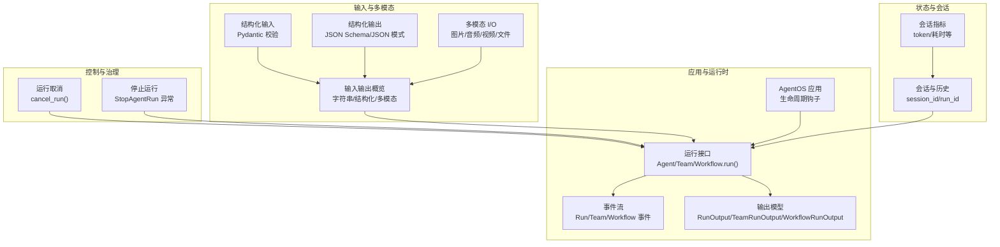
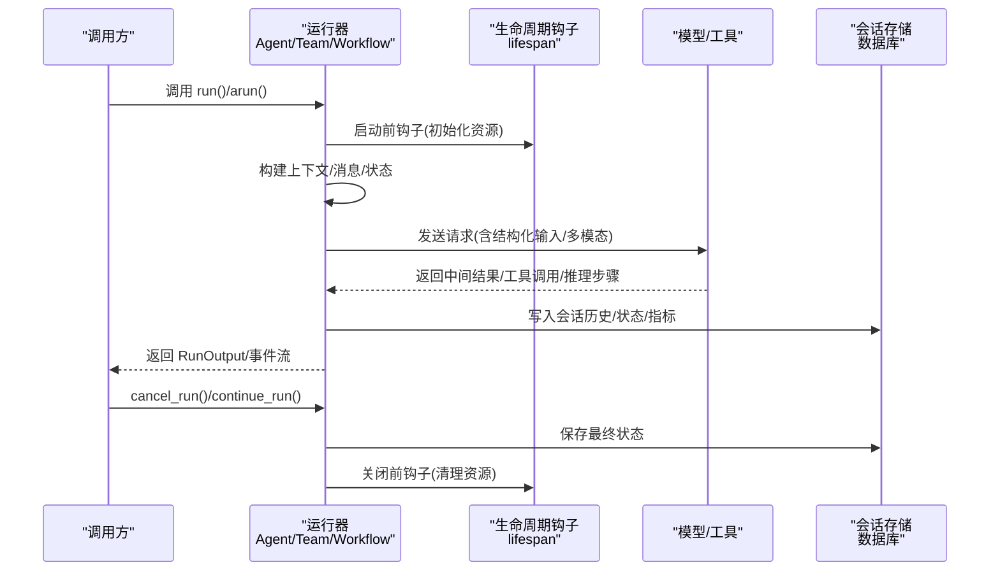
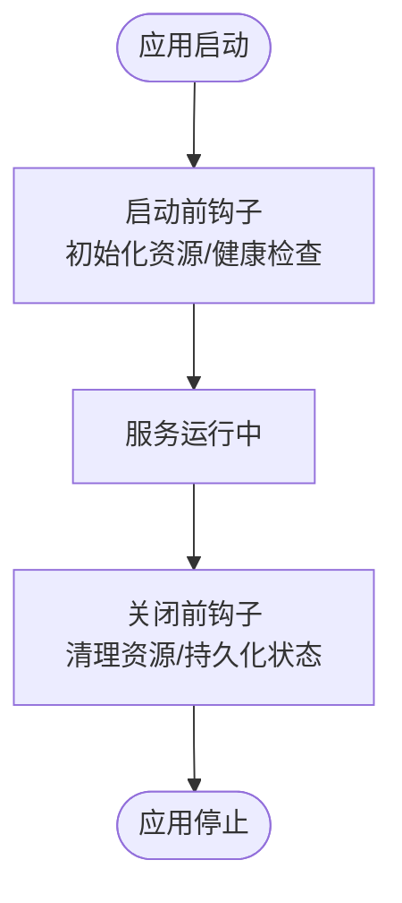
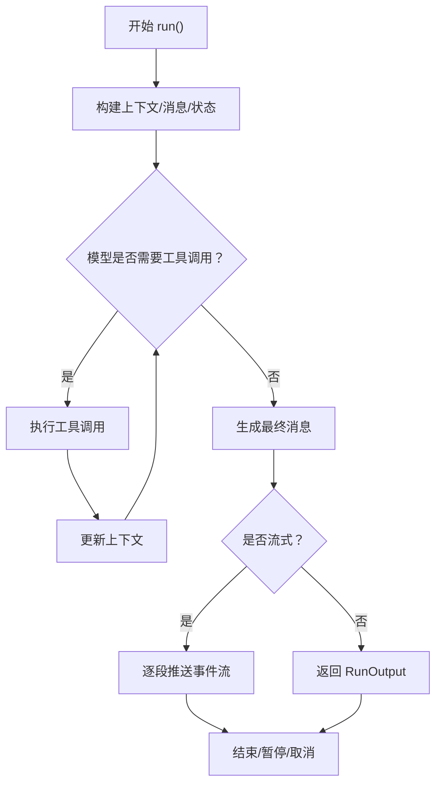
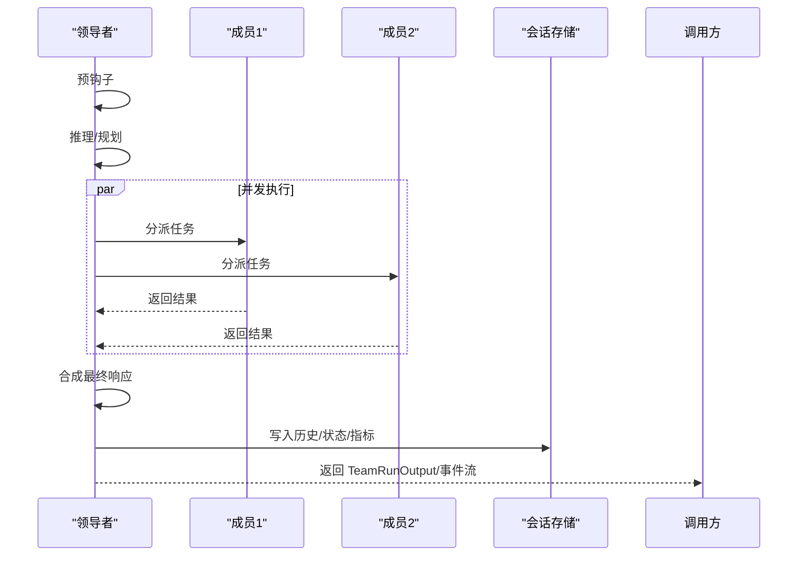
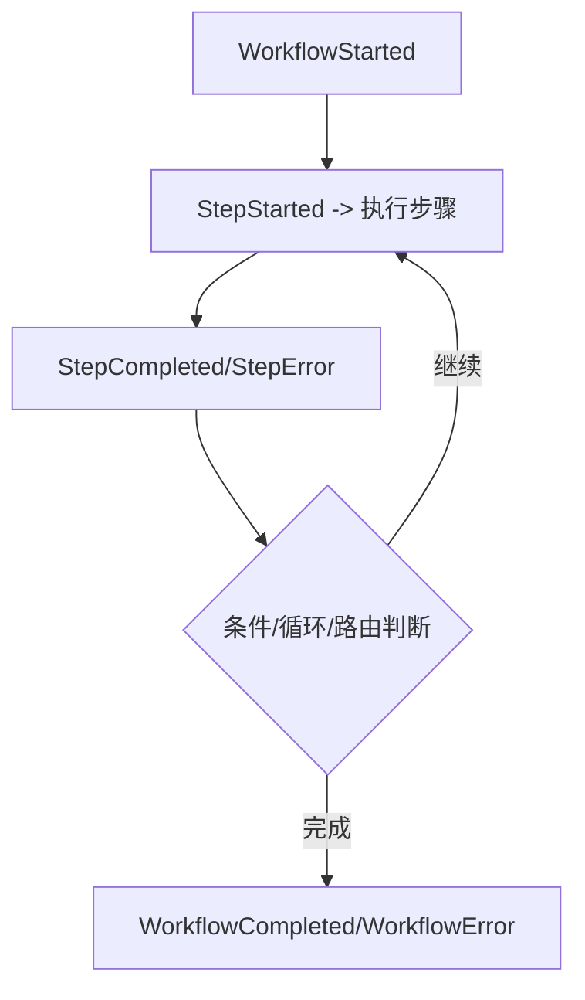
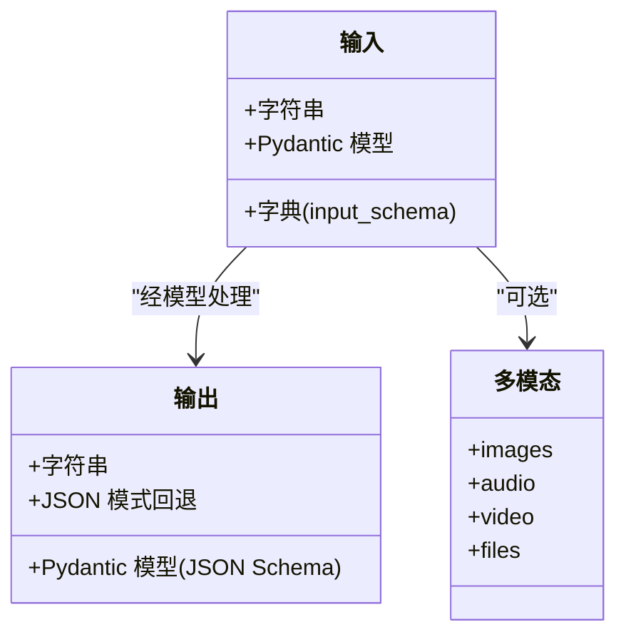
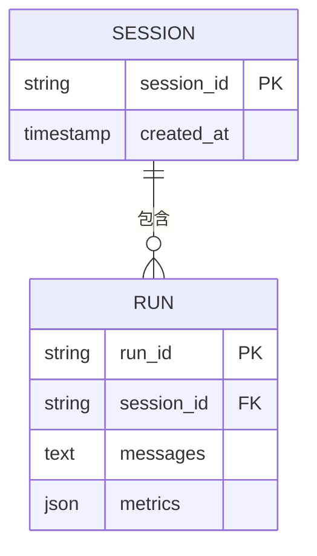
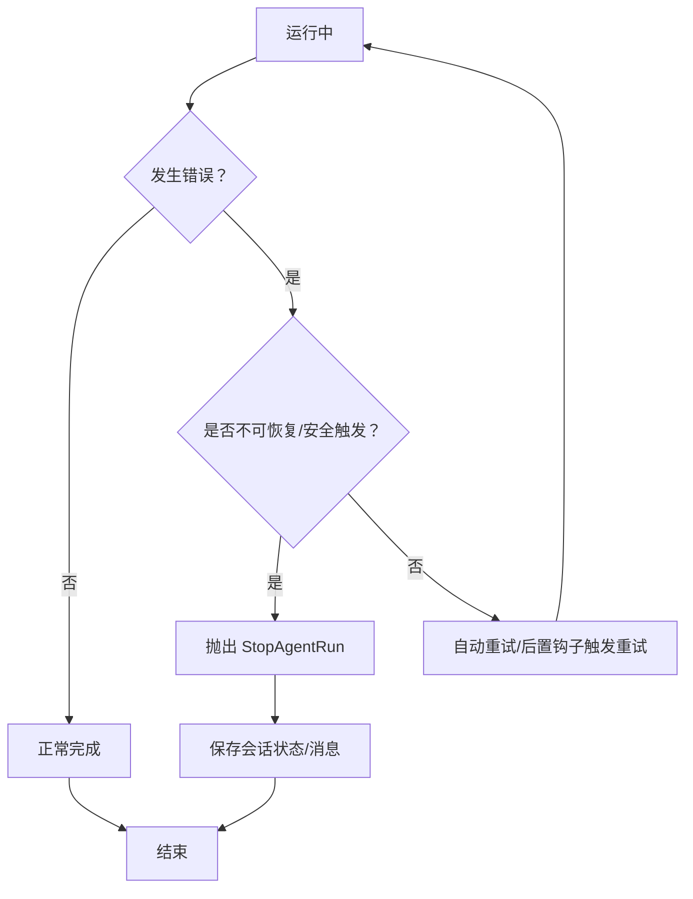
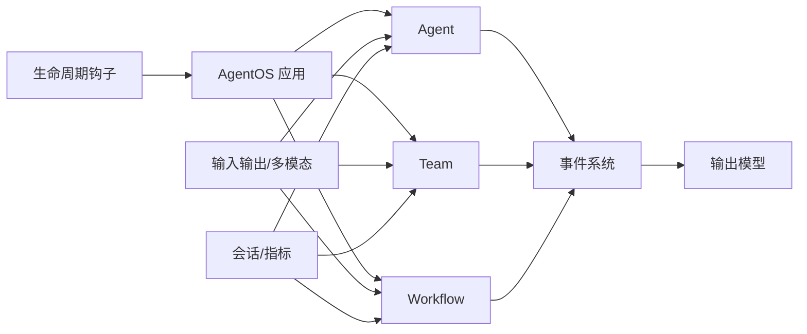

# 代理运行管理

<cite>
**本文引用的文件**
- [agent-os/lifespan.mdx](file://agent-os/lifespan.mdx)
- [agents/running-agents.mdx](file://agents/running-agents.mdx)
- [teams/running-teams.mdx](file://teams/running-teams.mdx)
- [workflows/running-workflows.mdx](file://workflows/running-workflows.mdx)
- [input-output/overview.mdx](file://input-output/overview.mdx)
- [input-output/structured-input/agent.mdx](file://input-output/structured-input/agent.mdx)
- [input-output/structured-output/agent.mdx](file://input-output/structured-output/agent.mdx)
- [multimodal/overview.mdx](file://multimodal/overview.mdx)
- [run-cancellation/overview.mdx](file://run-cancellation/overview.mdx)
- [sessions/overview.mdx](file://sessions/overview.mdx)
- [examples/agents/multimodal/image-to-structured-output.mdx](file://examples/agents/multimodal/image-to-structured-output.mdx)
- [examples/teams/structured-input-output/input-formats.mdx](file://examples/teams/structured-input-output/input-formats.mdx)
- [examples/tools/exceptions/stop-agent-exception.mdx](file://examples/tools/exceptions/stop-agent-exception.mdx)
- [reference/tools/stop-agent-run.mdx](file://reference/tools/stop-agent-run.mdx)
</cite>

## 目录
1. [简介](#简介)
2. [项目结构](#项目结构)
3. [核心组件](#核心组件)
4. [架构总览](#架构总览)
5. [详细组件分析](#详细组件分析)
6. [依赖关系分析](#依赖关系分析)
7. [性能考虑](#性能考虑)
8. [故障排除指南](#故障排除指南)
9. [结论](#结论)
10. [附录](#附录)

## 简介
本文件面向开发者，系统性阐述“代理运行管理”的实现与最佳实践，覆盖以下主题：
- 启动与生命周期：如何通过自定义生命周期钩子进行资源初始化与清理
- 运行状态管理：同步/异步执行、事件流、暂停/继续、取消
- 停止机制：显式停止条件、异常与重试策略
- 输入输出处理：字符串、结构化输入/输出、多模态数据（图像/音频/视频/文件）
- 生命周期与会话：会话与指标、历史与状态持久化
- 性能优化与运行示例、故障排除

## 项目结构
围绕“代理运行管理”，本仓库提供了从概念到实操的完整文档链路：
- 生命周期与服务托管：AgentOS 应用的自定义生命周期钩子
- 代理/团队/工作流运行：统一的 run/arun 接口、事件流与输出模型
- 输入输出与多模态：结构化输入/输出、多模态媒体传递
- 会话与指标：会话维度的历史与度量
- 取消与停止：运行取消、显式停止异常与重试

图示来源
- [agent-os/lifespan.mdx](file://agent-os/lifespan.mdx)
- [agents/running-agents.mdx](file://agents/running-agents.mdx)
- [teams/running-teams.mdx](file://teams/running-teams.mdx)
- [workflows/running-workflows.mdx](file://workflows/running-workflows.mdx)
- [input-output/overview.mdx](file://input-output/overview.mdx)
- [input-output/structured-input/agent.mdx](file://input-output/structured-input/agent.mdx)
- [input-output/structured-output/agent.mdx](file://input-output/structured-output/agent.mdx)
- [multimodal/overview.mdx](file://multimodal/overview.mdx)
- [run-cancellation/overview.mdx](file://run-cancellation/overview.mdx)
- [sessions/overview.mdx](file://sessions/overview.mdx)

章节来源
- [agent-os/lifespan.mdx](file://agent-os/lifespan.mdx)
- [agents/running-agents.mdx](file://agents/running-agents.mdx)
- [teams/running-teams.mdx](file://teams/running-teams.mdx)
- [workflows/running-workflows.mdx](file://workflows/running-workflows.mdx)
- [input-output/overview.mdx](file://input-output/overview.mdx)
- [input-output/structured-input/agent.mdx](file://input-output/structured-input/agent.mdx)
- [input-output/structured-output/agent.mdx](file://input-output/structured-output/agent.mdx)
- [multimodal/overview.mdx](file://multimodal/overview.mdx)
- [run-cancellation/overview.mdx](file://run-cancellation/overview.mdx)
- [sessions/overview.mdx](file://sessions/overview.mdx)

## 核心组件
- Agent/Team/Workflow 运行器：提供同步与异步执行入口，支持事件流、暂停/继续、取消
- 结构化输入/输出：基于 Pydantic 的输入校验与输出解析，支持 JSON Schema 与 JSON 模式回退
- 多模态 I/O：统一的媒体参数(images/audio/video/files)传递
- 会话与指标：以 session_id 维度持久化历史、状态与运行指标
- 生命周期钩子：在应用启动/关闭阶段注入资源初始化与清理逻辑
- 控制与治理：取消运行、显式停止异常、异常与重试策略

章节来源
- [agents/running-agents.mdx](file://agents/running-agents.mdx)
- [teams/running-teams.mdx](file://teams/running-teams.mdx)
- [workflows/running-workflows.mdx](file://workflows/running-workflows.mdx)
- [input-output/structured-input/agent.mdx](file://input-output/structured-input/agent.mdx)
- [input-output/structured-output/agent.mdx](file://input-output/structured-output/agent.mdx)
- [multimodal/overview.mdx](file://multimodal/overview.mdx)
- [sessions/overview.mdx](file://sessions/overview.mdx)
- [agent-os/lifespan.mdx](file://agent-os/lifespan.mdx)
- [run-cancellation/overview.mdx](file://run-cancellation/overview.mdx)

## 架构总览
下图展示从请求到响应的端到端运行路径，涵盖事件流、会话与存储、以及生命周期钩子。

图示来源
- [agent-os/lifespan.mdx](file://agent-os/lifespan.mdx)
- [agents/running-agents.mdx](file://agents/running-agents.mdx)
- [teams/running-teams.mdx](file://teams/running-teams.mdx)
- [workflows/running-workflows.mdx](file://workflows/running-workflows.mdx)
- [sessions/overview.mdx](file://sessions/overview.mdx)

## 详细组件分析

### 启动与生命周期管理
- 自定义生命周期钩子：在应用启动前与关闭前执行初始化与清理，适合数据库连接、缓存、第三方服务健康检查、后台任务启停等
- 与 FastAPI 生命周期集成：使用 asynccontextmanager 定义 lifespan，可与现有应用生命周期组合
- 典型场景：资源初始化、健康检查、背景任务、清理收尾

图示来源
- [agent-os/lifespan.mdx](file://agent-os/lifespan.mdx)

章节来源
- [agent-os/lifespan.mdx](file://agent-os/lifespan.mdx)

### 代理运行流程与事件流
- 执行流程：构建上下文 → 模型推理 → 工具调用循环 → 最终消息 → 返回 RunOutput 或事件流
- 事件类型：核心事件、控制流事件、工具事件、推理事件、内存事件、会话摘要事件、预/后置钩子事件、解析/输出模型事件、自定义事件
- 流式输出：默认仅流式内容；可通过 stream_events=True 获取更细粒度事件
- 暂停/继续：支持人类在环交互，暂停后可继续
- 取消：非流式返回 RunStatus.cancelled，流式发出 RunCancelledEvent

图示来源
- [agents/running-agents.mdx](file://agents/running-agents.mdx)
- [run-cancellation/overview.mdx](file://run-cancellation/overview.mdx)

章节来源
- [agents/running-agents.mdx](file://agents/running-agents.mdx)
- [run-cancellation/overview.mdx](file://run-cancellation/overview.mdx)

### 团队运行与多成员并发
- 执行顺序：预钩子 → 领导者推理/规划 → 成员并发执行 → 合成最终响应 → 后钩子 → 存储会话与指标
- 并发模式：arun() 下多成员并发执行，事件到达无序
- 任务模式(tasks)：迭代式任务构建与执行，直至目标完成或达到最大迭代次数
- 事件流：可选择仅流式内容或开启所有内部事件；可过滤成员事件以降低噪声

图示来源
- [teams/running-teams.mdx](file://teams/running-teams.mdx)

章节来源
- [teams/running-teams.mdx](file://teams/running-teams.mdx)

### 工作流运行与事件聚合
- 执行模型：线性/条件/并行/循环/路由等步骤组合，按配置顺序执行
- 事件聚合：自动流式 Agent/Team 内部事件；可选择仅流式工作流事件或全部事件
- 存储与审计：可配置自动存储事件，支持跳过特定事件类型以减少噪音与存储开销
- 取消与错误：工作流级取消与步骤级错误处理

图示来源
- [workflows/running-workflows.mdx](file://workflows/running-workflows.mdx)

章节来源
- [workflows/running-workflows.mdx](file://workflows/running-workflows.mdx)

### 输入输出处理与多模态
- 字符串 I/O：最简输入/输出，适合原型与聊天界面
- 结构化输入：通过 Pydantic 模型或 input_schema 对字典进行自动校验
- 结构化输出：将 Pydantic 模型转为 JSON Schema，交由模型结构化生成；不支持原生结构化时可启用 JSON 模式回退
- 多模态 I/O：通过 images/audio/video/files 参数传递媒体，支持图片到结构化输出等场景
- 示例参考：代理多模态示例、团队结构化输入格式示例

图示来源
- [input-output/overview.mdx](file://input-output/overview.mdx)
- [input-output/structured-input/agent.mdx](file://input-output/structured-input/agent.mdx)
- [input-output/structured-output/agent.mdx](file://input-output/structured-output/agent.mdx)
- [multimodal/overview.mdx](file://multimodal/overview.mdx)
- [examples/agents/multimodal/image-to-structured-output.mdx](file://examples/agents/multimodal/image-to-structured-output.mdx)
- [examples/teams/structured-input-output/input-formats.mdx](file://examples/teams/structured-input-output/input-formats.mdx)

章节来源
- [input-output/overview.mdx](file://input-output/overview.mdx)
- [input-output/structured-input/agent.mdx](file://input-output/structured-input/agent.mdx)
- [input-output/structured-output/agent.mdx](file://input-output/structured-output/agent.mdx)
- [multimodal/overview.mdx](file://multimodal/overview.mdx)
- [examples/agents/multimodal/image-to-structured-output.mdx](file://examples/agents/multimodal/image-to-structured-output.mdx)
- [examples/teams/structured-input-output/input-formats.mdx](file://examples/teams/structured-input-output/input-formats.mdx)

### 会话与状态管理
- 会话维度：以 session_id 维度组织多轮对话，包含历史、状态与指标
- 运行维度：每次 run() 产生独立 run_id，承载单次交互的上下文与结果
- 会话存储：需要数据库支撑历史与状态持久化
- 指标获取：可查询当前会话的运行指标（如 token 使用、耗时等）

图示来源
- [sessions/overview.mdx](file://sessions/overview.mdx)

章节来源
- [sessions/overview.mdx](file://sessions/overview.mdx)

### 停止机制与异常治理
- 显式停止：通过抛出 StopAgentRun 异常提前终止工具调用循环，设置运行状态为已完成，保存会话状态与消息
- 运行取消：cancel_run() 标记取消，非流式返回 RunStatus.cancelled，流式发出 RunCancelledEvent
- 异常与重试：针对瞬时失败采用自动重试，对不可恢复错误采用停止条件，避免“幻觉循环”

图示来源
- [reference/tools/stop-agent-run.mdx](file://reference/tools/stop-agent-run.mdx)
- [run-cancellation/overview.mdx](file://run-cancellation/overview.mdx)
- [examples/tools/exceptions/stop-agent-exception.mdx](file://examples/tools/exceptions/stop-agent-exception.mdx)

章节来源
- [reference/tools/stop-agent-run.mdx](file://reference/tools/stop-agent-run.mdx)
- [run-cancellation/overview.mdx](file://run-cancellation/overview.mdx)
- [examples/tools/exceptions/stop-agent-exception.mdx](file://examples/tools/exceptions/stop-agent-exception.mdx)

## 依赖关系分析
- 运行器依赖：Agent/Team/Workflow 依赖模型、工具、存储与会话
- 事件系统：统一的事件枚举与事件流，便于 UI 展示与调试
- 生命周期：AgentOS 应用生命周期钩子贯穿运行器前后
- 输入输出：结构化输入/输出与多模态 I/O 作为运行器的输入/输出扩展

图示来源
- [agent-os/lifespan.mdx](file://agent-os/lifespan.mdx)
- [agents/running-agents.mdx](file://agents/running-agents.mdx)
- [teams/running-teams.mdx](file://teams/running-teams.mdx)
- [workflows/running-workflows.mdx](file://workflows/running-workflows.mdx)
- [input-output/overview.mdx](file://input-output/overview.mdx)
- [sessions/overview.mdx](file://sessions/overview.mdx)

章节来源
- [agent-os/lifespan.mdx](file://agent-os/lifespan.mdx)
- [agents/running-agents.mdx](file://agents/running-agents.mdx)
- [teams/running-teams.mdx](file://teams/running-teams.mdx)
- [workflows/running-workflows.mdx](file://workflows/running-workflows.mdx)
- [input-output/overview.mdx](file://input-output/overview.mdx)
- [sessions/overview.mdx](file://sessions/overview.mdx)

## 性能考虑
- 事件存储与噪音控制：工作流可配置自动存储事件，并通过 events_to_skip 过滤高频事件，降低存储与解析开销
- 模型与结构化输出：优先使用原生结构化输出能力；不支持时启用 JSON 模式回退，兼顾正确性与成本
- 多模态传输：合理控制媒体尺寸与数量，避免超大文件导致延迟与带宽压力
- 并发与资源：团队并发执行时注意外部工具限流与资源配额，必要时引入节流与重试
- 会话与存储：开启会话存储以复用历史，但需评估数据库写入成本与索引策略

章节来源
- [workflows/running-workflows.mdx](file://workflows/running-workflows.mdx)
- [input-output/structured-output/agent.mdx](file://input-output/structured-output/agent.mdx)
- [multimodal/overview.mdx](file://multimodal/overview.mdx)

## 故障排除指南
- 连接拒绝/服务未启动：确认 AgentOS 服务已通过 serve 启动，本地端口可达
- 输入校验失败：检查 Pydantic 模型字段约束与 input_schema 配置，确保传入数据满足约束
- 运行被取消：检查取消触发点（定时器、外部中断），确认取消后会话状态已保存
- 停止运行：当出现不可恢复错误或安全阈值触发时，抛出 StopAgentRun 并验证会话状态与消息是否保留
- 多模态异常：核对媒体参数与模型支持情况，必要时降采样或切换模型

章节来源
- [examples/agents/multimodal/image-to-structured-output.mdx](file://examples/agents/multimodal/image-to-structured-output.mdx)
- [examples/teams/structured-input-output/input-formats.mdx](file://examples/teams/structured-input-output/input-formats.mdx)
- [examples/tools/exceptions/stop-agent-exception.mdx](file://examples/tools/exceptions/stop-agent-exception.mdx)
- [run-cancellation/overview.mdx](file://run-cancellation/overview.mdx)

## 结论
通过统一的运行接口、事件流与生命周期钩子，结合结构化输入/输出与多模态 I/O，开发者可以构建高可靠、可观测、可治理的代理运行体系。配合会话与指标管理、取消与停止机制，能够在复杂业务场景中实现稳定可控的运行状态管理与异常恢复。

## 附录
- 实际运行示例参考：
  - 代理多模态到结构化输出：[示例路径](file://examples/agents/multimodal/image-to-structured-output.mdx)
  - 团队结构化输入格式：[示例路径](file://examples/teams/structured-input-output/input-formats.mdx)
  - 停止运行异常示例：[示例路径](file://examples/tools/exceptions/stop-agent-exception.mdx)
- 相关参考：
  - 结构化输出参考：[参考路径](file://reference/tools/stop-agent-run.mdx)
  - 会话与指标：[参考路径](file://sessions/overview.mdx)
  - 生命周期钩子：[参考路径](file://agent-os/lifespan.mdx)
  - 运行取消：[参考路径](file://run-cancellation/overview.mdx)
  - 输入输出概览：[参考路径](file://input-output/overview.mdx)
  - 多模态概览：[参考路径](file://multimodal/overview.mdx)