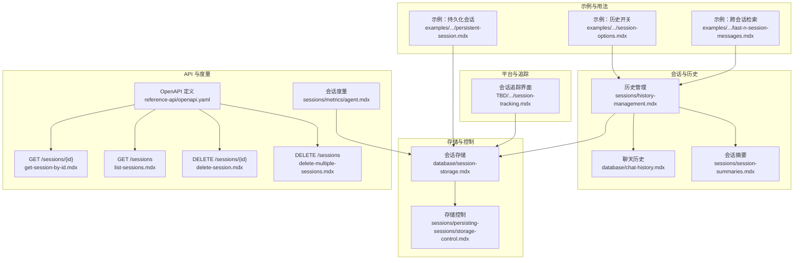
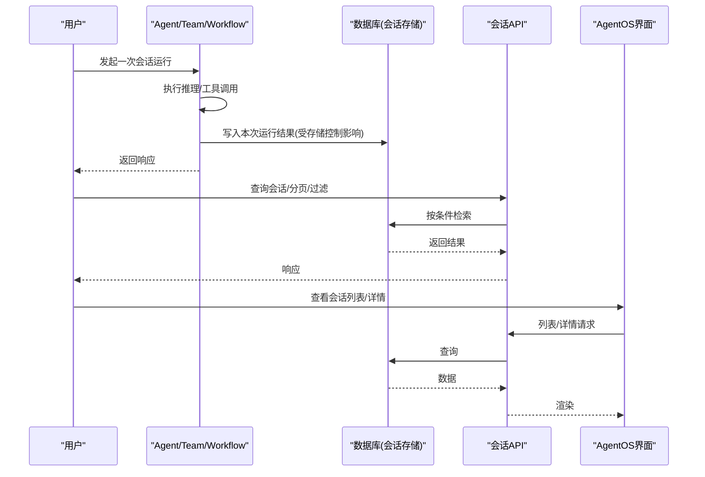
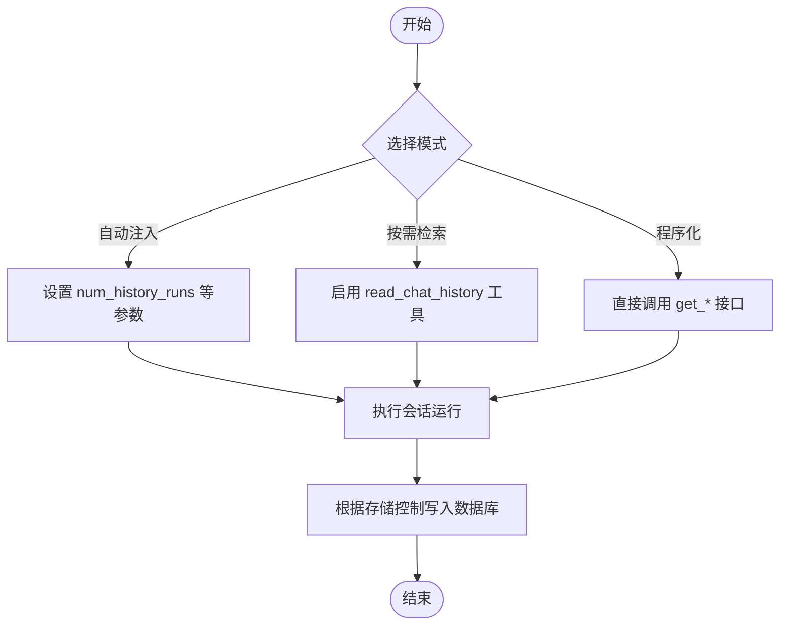
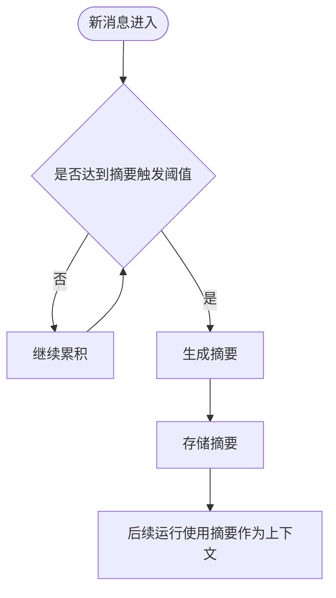
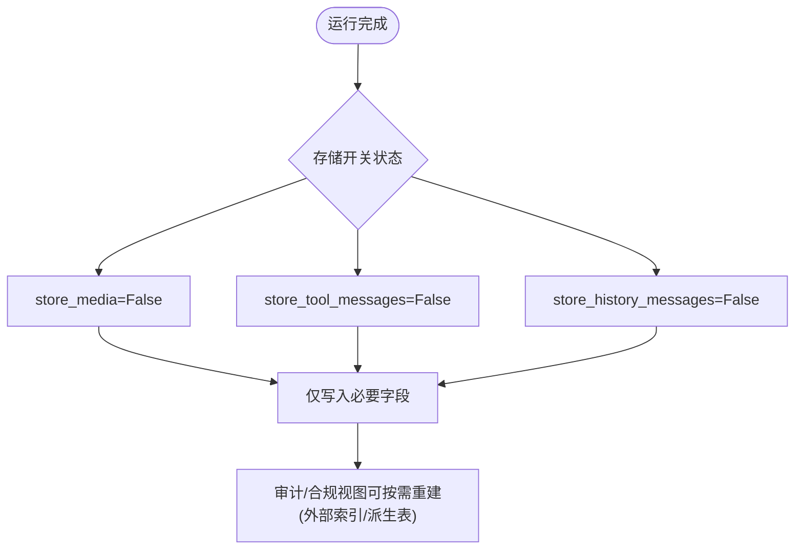
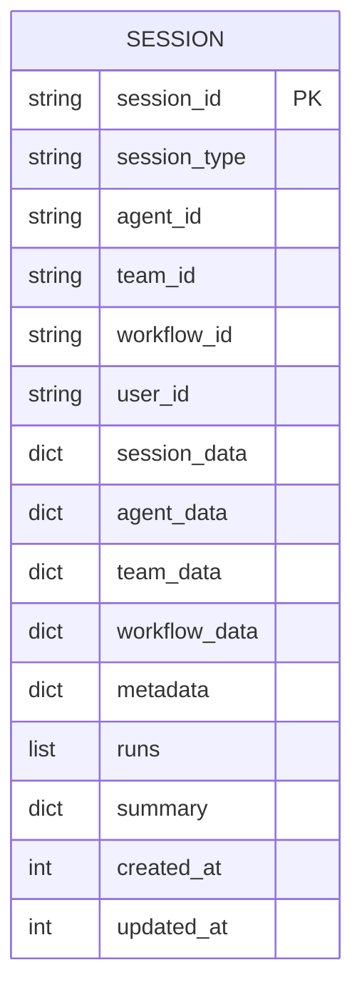
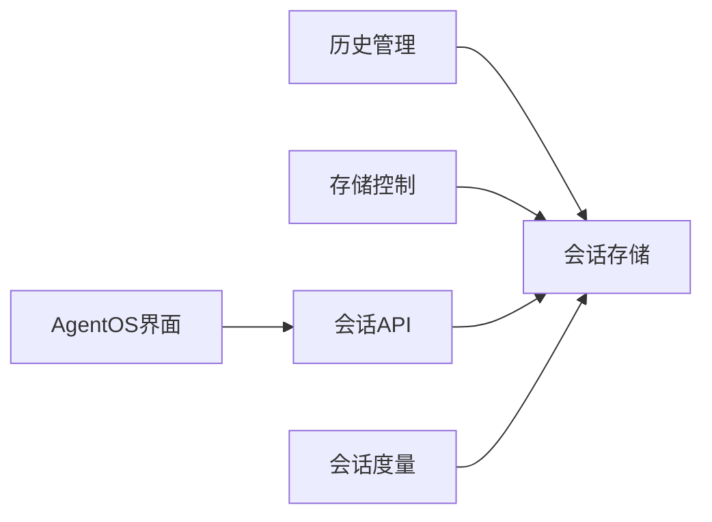

# 会话历史

<cite>
**本文引用的文件**
- [sessions/history-management.mdx](file://sessions/history-management.mdx)
- [database/chat-history.mdx](file://database/chat-history.mdx)
- [sessions/session-summaries.mdx](file://sessions/session-summaries.mdx)
- [database/session-storage.mdx](file://database/session-storage.mdx)
- [sessions/persisting-sessions/storage-control.mdx](file://sessions/persisting-sessions/storage-control.mdx)
- [examples/agents/state-and-session/session-options.mdx](file://examples/agents/state-and-session/session-options.mdx)
- [examples/agents/state-and-session/persistent-session.mdx](file://examples/agents/state-and-session/persistent-session.mdx)
- [examples/agents/state-and-session/last-n-session-messages.mdx](file://examples/agents/state-and-session/last-n-session-messages.mdx)
- [reference-api/openapi.yaml](file://reference-api/openapi.yaml)
- [reference-api/schema/sessions/get-session-by-id.mdx](file://reference-api/schema/sessions/get-session-by-id.mdx)
- [reference-api/schema/sessions/list-sessions.mdx](file://reference-api/schema/sessions/list-sessions.mdx)
- [reference-api/schema/sessions/delete-session.mdx](file://reference-api/schema/sessions/delete-session.mdx)
- [reference-api/schema/sessions/delete-multiple-sessions.mdx](file://reference-api/schema/sessions/delete-multiple-sessions.mdx)
- [TBD/pages/agent-os/features/session-tracking.mdx](file://TBD/pages/agent-os/features/session-tracking.mdx)
- [sessions/metrics/agent.mdx](file://sessions/metrics/agent.mdx)
</cite>

## 目录
1. [引言](#引言)
2. [项目结构](#项目结构)
3. [核心组件](#核心组件)
4. [架构总览](#架构总览)
5. [详细组件分析](#详细组件分析)
6. [依赖关系分析](#依赖关系分析)
7. [性能考量](#性能考量)
8. [故障排查指南](#故障排查指南)
9. [结论](#结论)
10. [附录](#附录)

## 引言
本技术文档围绕“会话历史管理”展开，系统阐述会话历史的存储机制（消息记录、状态变更、元数据）、检索与过滤能力（按时间、用户、会话ID等）、历史清理策略（过期删除与空间管理）、隐私保护（敏感信息脱敏与访问控制）、导出与备份（含数据迁移）以及最佳实践（性能优化与成本控制）。文档同时给出在审计、分析与合规场景中的应用示例与参考路径。

## 项目结构
与会话历史相关的内容主要分布在以下主题域：
- 会话与历史管理：sessions/history-management.mdx、database/chat-history.mdx、sessions/session-summaries.mdx
- 存储与持久化：database/session-storage.mdx、sessions/persisting-sessions/storage-control.mdx
- 示例与用法：examples/agents/state-and-session/*.mdx
- API 与检索：reference-api/openapi.yaml 及 sessions/* 路由定义
- 运行时度量：sessions/metrics/agent.mdx
- 平台界面与追踪：TBD/pages/agent-os/features/session-tracking.mdx

图表来源
- [sessions/history-management.mdx:1-108](file://sessions/history-management.mdx#L1-L108)
- [database/chat-history.mdx:1-159](file://database/chat-history.mdx#L1-L159)
- [sessions/session-summaries.mdx:1-184](file://sessions/session-summaries.mdx#L1-L184)
- [database/session-storage.mdx:1-119](file://database/session-storage.mdx#L1-L119)
- [sessions/persisting-sessions/storage-control.mdx:1-208](file://sessions/persisting-sessions/storage-control.mdx#L1-L208)
- [examples/agents/state-and-session/session-options.mdx:1-65](file://examples/agents/state-and-session/session-options.mdx#L1-L65)
- [examples/agents/state-and-session/persistent-session.mdx:1-50](file://examples/agents/state-and-session/persistent-session.mdx#L1-L50)
- [examples/agents/state-and-session/last-n-session-messages.mdx:1-104](file://examples/agents/state-and-session/last-n-session-messages.mdx#L1-L104)
- [reference-api/openapi.yaml:2130-2176](file://reference-api/openapi.yaml#L2130-L2176)
- [reference-api/schema/sessions/get-session-by-id.mdx:1-3](file://reference-api/schema/sessions/get-session-by-id.mdx#L1-L3)
- [reference-api/schema/sessions/list-sessions.mdx:1-3](file://reference-api/schema/sessions/list-sessions.mdx#L1-L3)
- [reference-api/schema/sessions/delete-session.mdx:1-3](file://reference-api/schema/sessions/delete-session.mdx#L1-L3)
- [reference-api/schema/sessions/delete-multiple-sessions.mdx:1-3](file://reference-api/schema/sessions/delete-multiple-sessions.mdx#L1-L3)
- [TBD/pages/agent-os/features/session-tracking.mdx:1-35](file://TBD/pages/agent-os/features/session-tracking.mdx#L1-L35)
- [sessions/metrics/agent.mdx:1-36](file://sessions/metrics/agent.mdx#L1-L36)

章节来源
- [sessions/history-management.mdx:1-108](file://sessions/history-management.mdx#L1-L108)
- [database/chat-history.mdx:1-159](file://database/chat-history.mdx#L1-L159)
- [sessions/session-summaries.mdx:1-184](file://sessions/session-summaries.mdx#L1-L184)
- [database/session-storage.mdx:1-119](file://database/session-storage.mdx#L1-L119)
- [sessions/persisting-sessions/storage-control.mdx:1-208](file://sessions/persisting-sessions/storage-control.mdx#L1-L208)
- [examples/agents/state-and-session/session-options.mdx:1-65](file://examples/agents/state-and-session/session-options.mdx#L1-L65)
- [examples/agents/state-and-session/persistent-session.mdx:1-50](file://examples/agents/state-and-session/persistent-session.mdx#L1-L50)
- [examples/agents/state-and-session/last-n-session-messages.mdx:1-104](file://examples/agents/state-and-session/last-n-session-messages.mdx#L1-L104)
- [reference-api/openapi.yaml:2130-2176](file://reference-api/openapi.yaml#L2130-L2176)
- [reference-api/schema/sessions/get-session-by-id.mdx:1-3](file://reference-api/schema/sessions/get-session-by-id.mdx#L1-L3)
- [reference-api/schema/sessions/list-sessions.mdx:1-3](file://reference-api/schema/sessions/list-sessions.mdx#L1-L3)
- [reference-api/schema/sessions/delete-session.mdx:1-3](file://reference-api/schema/sessions/delete-session.mdx#L1-L3)
- [reference-api/schema/sessions/delete-multiple-sessions.mdx:1-3](file://reference-api/schema/sessions/delete-multiple-sessions.mdx#L1-L3)
- [TBD/pages/agent-os/features/session-tracking.mdx:1-35](file://TBD/pages/agent-os/features/session-tracking.mdx#L1-L35)
- [sessions/metrics/agent.mdx:1-36](file://sessions/metrics/agent.mdx#L1-L36)

## 核心组件
- 历史管理策略
  - 自动历史注入：通过配置参数自动将最近若干轮对话纳入上下文，适合短对话与快速原型。
  - 按需检索：启用工具接口让模型在需要时主动查询历史，适合审计与分析场景。
  - 程序化访问：直接调用 API 获取完整消息、会话消息与上次运行输出，便于自定义 UI、调试与导出。
- 会话摘要
  - 自动生成并更新摘要，显著降低长对话的 token 成本，避免上下文窗口限制；可与近期历史组合使用以兼顾细节与成本。
- 存储控制
  - 提供三类存储开关：媒体、工具消息、历史消息，用于在不破坏执行体验的前提下减少数据库体积。
- 会话存储结构
  - 统一的会话表结构，包含会话标识、类型、用户与主体 ID、会话数据、元数据、运行列表、摘要、时间戳等字段，并支持按会话 ID 与分页查询。
- API 与检索
  - 提供按会话 ID 查询、分页列出、批量删除等接口，支持按用户 ID、会话名称等条件过滤。
- 度量与追踪
  - 会话级度量聚合，便于成本与性能分析；平台界面支持可视化查看与管理。

章节来源
- [sessions/history-management.mdx:10-108](file://sessions/history-management.mdx#L10-L108)
- [database/chat-history.mdx:9-159](file://database/chat-history.mdx#L9-L159)
- [sessions/session-summaries.mdx:44-184](file://sessions/session-summaries.mdx#L44-L184)
- [database/session-storage.mdx:30-119](file://database/session-storage.mdx#L30-L119)
- [sessions/persisting-sessions/storage-control.mdx:8-208](file://sessions/persisting-sessions/storage-control.mdx#L8-L208)
- [reference-api/openapi.yaml:2130-2176](file://reference-api/openapi.yaml#L2130-L2176)
- [sessions/metrics/agent.mdx:1-36](file://sessions/metrics/agent.mdx#L1-L36)

## 架构总览
下图展示了从“会话运行”到“历史存储与检索”的端到端流程，以及与 API、度量与平台界面的交互。

图表来源
- [database/session-storage.mdx:52-92](file://database/session-storage.mdx#L52-L92)
- [reference-api/openapi.yaml:2130-2176](file://reference-api/openapi.yaml#L2130-L2176)
- [TBD/pages/agent-os/features/session-tracking.mdx:28-35](file://TBD/pages/agent-os/features/session-tracking.mdx#L28-L35)

## 详细组件分析

### 历史管理策略与检索
- 自动历史注入
  - 通过开启自动历史并将最近轮次数量限制在合理范围，确保上下文不过载。
  - 适用于聊天式产品、快速原型等需要即时上下文的场景。
- 按需检索
  - 启用工具接口后，模型可在需要时主动查询历史，适合审计与分析场景。
- 程序化访问
  - 支持直接获取完整消息、会话消息与上次运行输出，便于构建自定义 UI、调试与导出。

图表来源
- [sessions/history-management.mdx:12-77](file://sessions/history-management.mdx#L12-L77)
- [database/chat-history.mdx:9-159](file://database/chat-history.mdx#L9-L159)

章节来源
- [sessions/history-management.mdx:10-108](file://sessions/history-management.mdx#L10-L108)
- [database/chat-history.mdx:9-159](file://database/chat-history.mdx#L9-L159)

### 会话摘要与成本控制
- 自动生成摘要，将长历史压缩为少量高价值内容，显著降低 token 使用与上下文压力。
- 可与近期历史组合使用，既保持细节又控制成本。
- 支持自定义摘要生成器（如更便宜的模型或提示词），进一步优化成本。

图表来源
- [sessions/session-summaries.mdx:44-108](file://sessions/session-summaries.mdx#L44-L108)

章节来源
- [sessions/session-summaries.mdx:44-184](file://sessions/session-summaries.mdx#L44-L184)

### 存储控制与隐私保护
- 媒体存储开关：关闭后仅保留媒体引用（URL/ID），避免大体积二进制数据进入数据库。
- 工具消息开关：关闭后移除工具调用与结果，同时清理对应助手消息，保持消息序列合法；度量仍反映真实 token 使用。
- 历史消息开关：默认不持久化历史消息，仅当前轮次写入数据库；如需完整历史审计，可显式开启。
- 隐私建议：结合访问控制与最小权限原则，对会话数据进行分级授权；对敏感字段进行脱敏处理后再入库。

图表来源
- [sessions/persisting-sessions/storage-control.mdx:8-208](file://sessions/persisting-sessions/storage-control.mdx#L8-L208)

章节来源
- [sessions/persisting-sessions/storage-control.mdx:8-208](file://sessions/persisting-sessions/storage-control.mdx#L8-L208)

### 会话存储结构与检索过滤
- 存储字段覆盖会话标识、类型、用户与主体 ID、会话数据、元数据、运行列表、摘要、时间戳等。
- 支持按会话 ID 精确查询与分页列表，支持按用户 ID、会话名称等条件过滤。
- 删除接口支持单个与批量删除，便于清理过期或无效会话。

图表来源
- [database/session-storage.mdx:30-51](file://database/session-storage.mdx#L30-L51)

章节来源
- [database/session-storage.mdx:30-119](file://database/session-storage.mdx#L30-L119)
- [reference-api/openapi.yaml:2130-2176](file://reference-api/openapi.yaml#L2130-L2176)
- [reference-api/schema/sessions/get-session-by-id.mdx:1-3](file://reference-api/schema/sessions/get-session-by-id.mdx#L1-L3)
- [reference-api/schema/sessions/list-sessions.mdx:1-3](file://reference-api/schema/sessions/list-sessions.mdx#L1-L3)
- [reference-api/schema/sessions/delete-session.mdx:1-3](file://reference-api/schema/sessions/delete-session.mdx#L1-L3)
- [reference-api/schema/sessions/delete-multiple-sessions.mdx:1-3](file://reference-api/schema/sessions/delete-multiple-sessions.mdx#L1-L3)

### 导出与备份、数据迁移
- 导出与备份
  - 通过程序化访问接口获取完整会话与运行数据，结合外部存储（对象存储、归档数据库）实现离线备份与长期归档。
  - 对于需要保留完整历史的场景，可临时开启历史消息存储开关，完成一次性导出后再恢复为默认策略。
- 数据迁移
  - 在不同数据库之间迁移时，遵循统一的会话存储结构；先导出源库数据，再导入目标库，注意时间戳与会话 ID 的一致性校验。

章节来源
- [database/session-storage.mdx:52-92](file://database/session-storage.mdx#L52-L92)
- [sessions/persisting-sessions/storage-control.mdx:125-166](file://sessions/persisting-sessions/storage-control.mdx#L125-L166)

### 审计、分析与合规应用示例
- 审计：启用按需检索与历史消息存储开关，结合会话度量与平台界面，追踪用户行为与资源消耗。
- 分析：利用会话摘要与度量数据，构建成本与效果分析报表；通过跨会话检索定位用户问题线索。
- 合规：实施最小数据原则与访问控制，对敏感字段脱敏；定期清理过期会话，满足数据生命周期管理要求。

章节来源
- [sessions/history-management.mdx:38-77](file://sessions/history-management.mdx#L38-L77)
- [sessions/metrics/agent.mdx:1-36](file://sessions/metrics/agent.mdx#L1-L36)
- [TBD/pages/agent-os/features/session-tracking.mdx:1-35](file://TBD/pages/agent-os/features/session-tracking.mdx#L1-L35)

## 依赖关系分析
- 组件耦合
  - 历史管理与会话存储紧密耦合：前者决定写入哪些内容，后者决定如何组织与检索。
  - 存储控制在“运行时可见性”与“持久化体积”之间做权衡，不影响模型执行，仅影响数据库写入。
- 外部依赖
  - API 层提供统一的检索与管理入口；平台界面负责可视化与操作。
  - 度量模块提供会话级指标，支撑成本与性能分析。

图表来源
- [sessions/history-management.mdx:10-108](file://sessions/history-management.mdx#L10-L108)
- [database/session-storage.mdx:52-92](file://database/session-storage.mdx#L52-L92)
- [sessions/persisting-sessions/storage-control.mdx:8-208](file://sessions/persisting-sessions/storage-control.mdx#L8-L208)
- [reference-api/openapi.yaml:2130-2176](file://reference-api/openapi.yaml#L2130-L2176)
- [TBD/pages/agent-os/features/session-tracking.mdx:28-35](file://TBD/pages/agent-os/features/session-tracking.mdx#L28-L35)
- [sessions/metrics/agent.mdx:1-36](file://sessions/metrics/agent.mdx#L1-L36)

## 性能考量
- 上下文窗口与 token 成本
  - 长对话会指数增长 token 使用，建议采用会话摘要与有限历史注入相结合的策略。
- 存储体积控制
  - 关闭媒体与工具消息存储可显著降低数据库体积；仅在需要时开启历史消息存储。
- 查询与分页
  - 使用分页与过滤条件（用户 ID、会话名称）提升检索效率；避免一次性加载过多会话。
- 计算与存储分离
  - 将摘要生成与历史检索拆分为后台任务，减少主流程延迟。

章节来源
- [sessions/session-summaries.mdx:11-58](file://sessions/session-summaries.mdx#L11-L58)
- [sessions/persisting-sessions/storage-control.mdx:47-166](file://sessions/persisting-sessions/storage-control.mdx#L47-L166)
- [reference-api/openapi.yaml:2130-2176](file://reference-api/openapi.yaml#L2130-L2176)

## 故障排查指南
- 历史未生效
  - 检查是否正确配置了数据库与历史开关；确认会话 ID 一致且未被清理。
- 历史过大导致上下文溢出
  - 降低历史轮次或启用会话摘要；必要时调整摘要生成策略。
- 存储体积异常增长
  - 检查存储开关状态，优先关闭媒体与工具消息存储；定期清理过期会话。
- 审计/合规缺失
  - 临时开启历史消息存储进行一次性导出；完成后恢复默认策略。
- 平台界面无法显示会话
  - 确认数据库连接与会话表存在；检查 API 权限与过滤条件。

章节来源
- [database/chat-history.mdx:92-94](file://database/chat-history.mdx#L92-L94)
- [sessions/persisting-sessions/storage-control.mdx:24-36](file://sessions/persisting-sessions/storage-control.mdx#L24-L36)
- [reference-api/schema/sessions/delete-session.mdx:1-3](file://reference-api/schema/sessions/delete-session.mdx#L1-L3)
- [reference-api/schema/sessions/delete-multiple-sessions.mdx:1-3](file://reference-api/schema/sessions/delete-multiple-sessions.mdx#L1-L3)
- [TBD/pages/agent-os/features/session-tracking.mdx:28-35](file://TBD/pages/agent-os/features/session-tracking.mdx#L28-L35)

## 结论
会话历史管理的关键在于“可控的历史注入、高效的摘要机制、精细的存储控制与完善的检索过滤”。通过上述策略，可在保证用户体验与分析能力的同时，有效控制成本与风险，并满足审计与合规要求。建议在生产环境中结合度量与平台界面持续监控，动态优化参数与策略。

## 附录
- 实践清单
  - 明确历史注入策略（自动/按需/程序化）
  - 启用会话摘要并结合有限历史
  - 默认关闭媒体与工具消息存储，必要时开启历史消息存储
  - 使用 API 进行分页与过滤，定期清理过期会话
  - 结合度量与平台界面进行成本与效果分析
- 参考路径
  - 历史管理与检索：[sessions/history-management.mdx:1-108](file://sessions/history-management.mdx#L1-L108)、[database/chat-history.mdx:1-159](file://database/chat-history.mdx#L1-L159)
  - 会话摘要：[sessions/session-summaries.mdx:1-184](file://sessions/session-summaries.mdx#L1-L184)
  - 存储控制：[sessions/persisting-sessions/storage-control.mdx:1-208](file://sessions/persisting-sessions/storage-control.mdx#L1-L208)
  - 会话存储结构：[database/session-storage.mdx:1-119](file://database/session-storage.mdx#L1-L119)
  - API 与过滤：[reference-api/openapi.yaml:2130-2176](file://reference-api/openapi.yaml#L2130-L2176)
  - 平台界面：[TBD/pages/agent-os/features/session-tracking.mdx:1-35](file://TBD/pages/agent-os/features/session-tracking.mdx#L1-L35)
  - 示例参考：
    - [examples/agents/state-and-session/session-options.mdx:1-65](file://examples/agents/state-and-session/session-options.mdx#L1-L65)
    - [examples/agents/state-and-session/persistent-session.mdx:1-50](file://examples/agents/state-and-session/persistent-session.mdx#L1-L50)
    - [examples/agents/state-and-session/last-n-session-messages.mdx:1-104](file://examples/agents/state-and-session/last-n-session-messages.mdx#L1-L104)