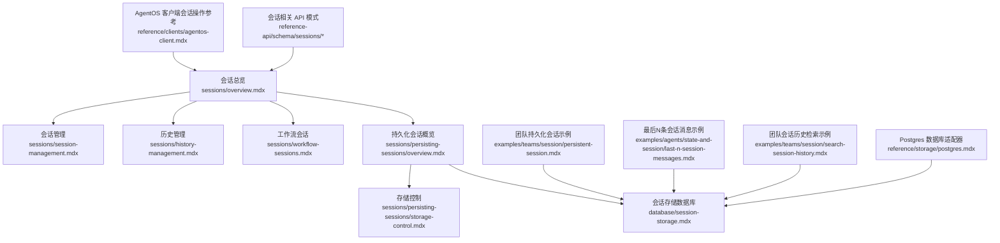
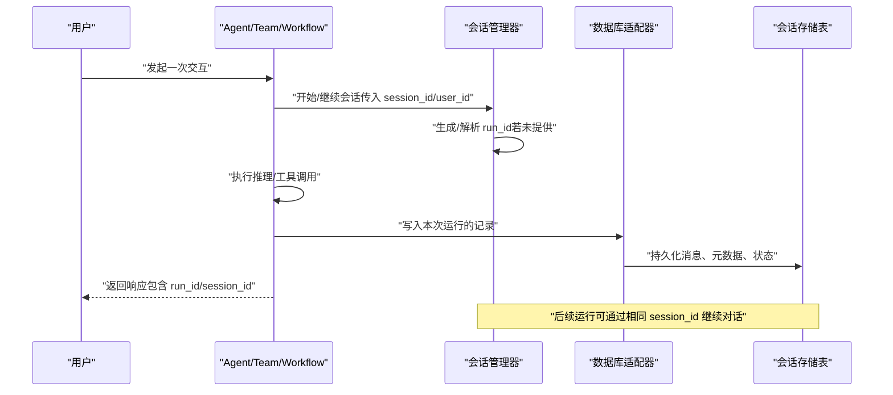
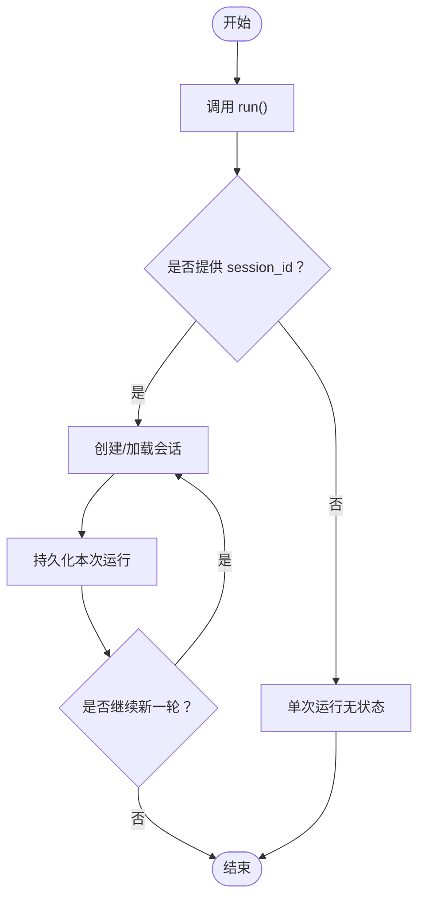
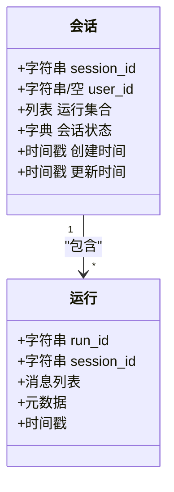
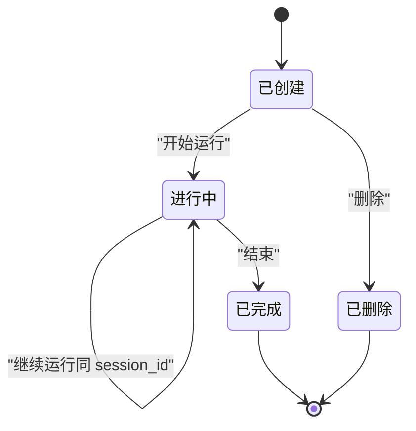
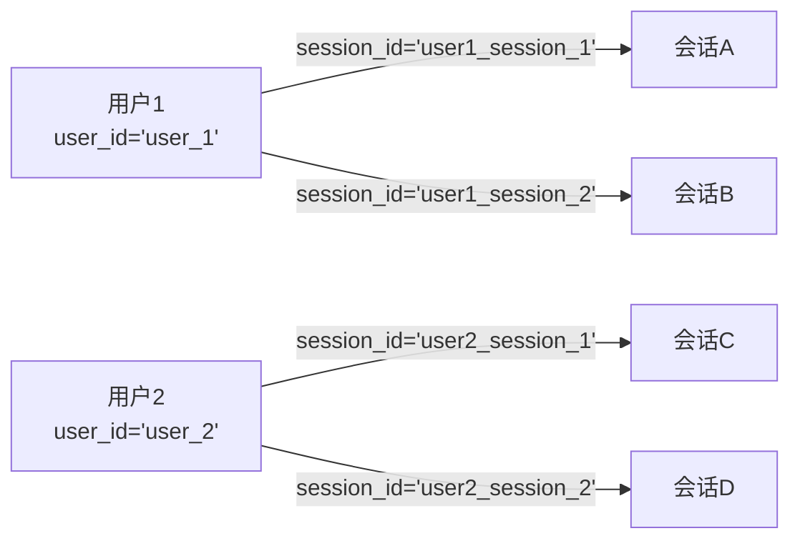
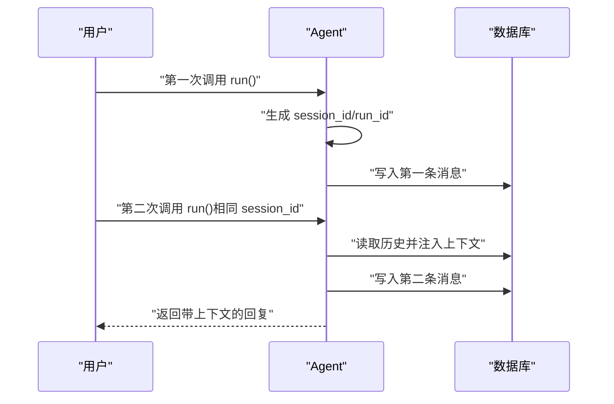
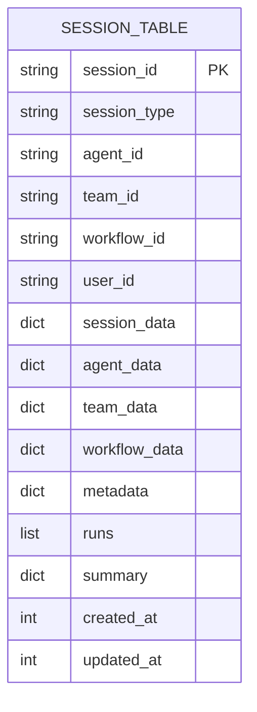
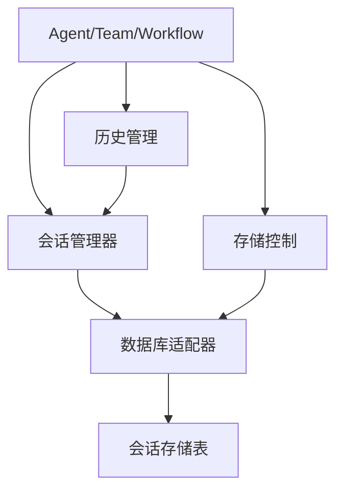

# 会话基础概念

<cite>
**本文引用的文件**
- [会话总览](file://sessions/overview.mdx)
- [会话管理](file://sessions/session-management.mdx)
- [会话存储](file://database/session-storage.mdx)
- [持久化会话（概览）](file://sessions/persisting-sessions/overview.mdx)
- [存储控制](file://sessions/persisting-sessions/storage-control.mdx)
- [历史管理](file://sessions/history-management.mdx)
- [工作流会话](file://sessions/workflow-sessions.mdx)
- [团队持久化会话示例](file://examples/teams/session/persistent-session.mdx)
- [最后N条会话消息示例](file://examples/agents/state-and-session/last-n-session-messages.mdx)
- [团队会话历史检索示例](file://examples/teams/session/search-session-history.mdx)
- [AgentOS 客户端会话操作参考](file://reference/clients/agentos-client.mdx)
- [会话相关 API 模式：创建新会话](file://reference-api/schema/sessions/create-new-session.mdx)
- [会话相关 API 模式：获取会话详情](file://reference-api/schema/sessions/get-session-by-id.mdx)
- [会话相关 API 模式：获取会话中的运行](file://reference-api/schema/sessions/get-session-runs.mdx)
- [会话相关 API 模式：按运行ID获取运行](file://reference-api/schema/sessions/get-run-by-id.mdx)
- [会话相关 API 模式：更新会话](file://reference-api/schema/sessions/update-session.mdx)
- [会话相关 API 模式：删除会话](file://reference-api/schema/sessions/delete-session.mdx)
- [会话相关 API 模式：批量删除会话](file://reference-api/schema/sessions/delete-multiple-sessions.mdx)
- [Postgres 数据库适配器](file://reference/storage/postgres.mdx)
</cite>

## 目录
1. [引言](#引言)
2. [项目结构](#项目结构)
3. [核心组件](#核心组件)
4. [架构总览](#架构总览)
5. [详细组件分析](#详细组件分析)
6. [依赖关系分析](#依赖关系分析)
7. [性能考量](#性能考量)
8. [故障排查指南](#故障排查指南)
9. [结论](#结论)
10. [附录](#附录)

## 引言
本文件系统性阐述会话的基础概念与工程实践，围绕以下主题展开：
- 会话与单次运行的区别
- 会话ID与运行ID的定义及生成机制
- 会话生命周期（创建、状态维护、销毁）
- 多用户会话隔离（用户ID与会话ID的作用）
- 单轮对话与多轮对话的实际用法示例
- 会话持久化要求与数据库配置的重要性

## 项目结构
围绕“会话”主题，仓库中存在多处文档与示例，主要分布在以下路径：
- sessions：会话总览、管理、历史、工作流会话、持久化等
- database：会话存储表结构、字段说明、检索方法
- examples：团队与代理的持久化会话示例
- reference-api：会话相关 OpenAPI 路由模式
- reference/storage：数据库适配器（如 Postgres）

**图表来源**
- [会话总览:1-86](file://sessions/overview.mdx#L1-L86)
- [会话管理:1-47](file://sessions/session-management.mdx#L1-L47)
- [历史管理:1-108](file://sessions/history-management.mdx#L1-L108)
- [工作流会话:1-35](file://sessions/workflow-sessions.mdx#L1-L35)
- [持久化会话（概览）:1-124](file://sessions/persisting-sessions/overview.mdx#L1-L124)
- [存储控制:1-208](file://sessions/persisting-sessions/storage-control.mdx#L1-L208)
- [会话存储:1-119](file://database/session-storage.mdx#L1-L119)
- [团队持久化会话示例:1-69](file://examples/teams/session/persistent-session.mdx#L1-L69)
- [最后N条会话消息示例:38-73](file://examples/agents/state-and-session/last-n-session-messages.mdx#L38-L73)
- [团队会话历史检索示例:38-106](file://examples/teams/session/search-session-history.mdx#L38-L106)
- [AgentOS 客户端会话操作参考:421-468](file://reference/clients/agentos-client.mdx#L421-L468)
- [会话相关 API 模式：创建新会话:1-3](file://reference-api/schema/sessions/create-new-session.mdx#L1-L3)
- [会话相关 API 模式：获取会话详情:1-3](file://reference-api/schema/sessions/get-session-by-id.mdx#L1-L3)
- [会话相关 API 模式：获取会话中的运行:1-3](file://reference-api/schema/sessions/get-session-runs.mdx#L1-L3)
- [会话相关 API 模式：按运行ID获取运行:1-3](file://reference-api/schema/sessions/get-run-by-id.mdx#L1-L3)
- [会话相关 API 模式：更新会话:1-3](file://reference-api/schema/sessions/update-session.mdx#L1-L3)
- [会话相关 API 模式：删除会话:1-3](file://reference-api/schema/sessions/delete-session.mdx#L1-L3)
- [会话相关 API 模式：批量删除会话:1-3](file://reference-api/schema/sessions/delete-multiple-sessions.mdx#L1-L3)
- [Postgres 数据库适配器:1-9](file://reference/storage/postgres.mdx#L1-L9)

**章节来源**
- [会话总览:1-86](file://sessions/overview.mdx#L1-L86)
- [会话管理:1-47](file://sessions/session-management.mdx#L1-L47)
- [历史管理:1-108](file://sessions/history-management.mdx#L1-L108)
- [工作流会话:1-35](file://sessions/workflow-sessions.mdx#L1-L35)
- [持久化会话（概览）:1-124](file://sessions/persisting-sessions/overview.mdx#L1-L124)
- [存储控制:1-208](file://sessions/persisting-sessions/storage-control.mdx#L1-L208)
- [会话存储:1-119](file://database/session-storage.mdx#L1-L119)
- [团队持久化会话示例:1-69](file://examples/teams/session/persistent-session.mdx#L1-L69)
- [最后N条会话消息示例:38-73](file://examples/agents/state-and-session/last-n-session-messages.mdx#L38-L73)
- [团队会话历史检索示例:38-106](file://examples/teams/session/search-session-history.mdx#L38-L106)
- [AgentOS 客户端会话操作参考:421-468](file://reference/clients/agentos-client.mdx#L421-L468)
- [会话相关 API 模式：创建新会话:1-3](file://reference-api/schema/sessions/create-new-session.mdx#L1-L3)
- [会话相关 API 模式：获取会话详情:1-3](file://reference-api/schema/sessions/get-session-by-id.mdx#L1-L3)
- [会话相关 API 模式：获取会话中的运行:1-3](file://reference-api/schema/sessions/get-session-runs.mdx#L1-L3)
- [会话相关 API 模式：按运行ID获取运行:1-3](file://reference-api/schema/sessions/get-run-by-id.mdx#L1-L3)
- [会话相关 API 模式：更新会话:1-3](file://reference-api/schema/sessions/update-session.mdx#L1-L3)
- [会话相关 API 模式：删除会话:1-3](file://reference-api/schema/sessions/delete-session.mdx#L1-L3)
- [会话相关 API 模式：批量删除会话:1-3](file://reference-api/schema/sessions/delete-multiple-sessions.mdx#L1-L3)
- [Postgres 数据库适配器:1-9](file://reference/storage/postgres.mdx#L1-L9)

## 核心组件
- 会话（Session）：一次或多轮交互的对话线程，由唯一标识的会话ID绑定所有运行、历史、状态与指标。
- 运行（Run）：会话内的单次交互，每次调用 Agent.run()/Team.run()/Workflow.run() 会产生新的运行ID。
- 会话ID（session_id）：用于跨多次运行追踪同一对话线程；可自动生成或手动指定。
- 用户ID（user_id）：区分不同使用者，配合会话ID实现多用户隔离。
- 历史注入：通过开关与参数控制历史消息进入上下文的方式与范围。
- 数据库持久化：启用数据库后，会话的历史、状态、运行元数据自动落盘。

**章节来源**
- [会话总览:12-24](file://sessions/overview.mdx#L12-L24)
- [会话管理:10-16](file://sessions/session-management.mdx#L10-L16)
- [历史管理:10-76](file://sessions/history-management.mdx#L10-L76)
- [持久化会话（概览）:8-36](file://sessions/persisting-sessions/overview.mdx#L8-L36)

## 架构总览
下图展示了从调用到持久化的会话处理链路，以及与数据库层的关系。

**图表来源**
- [会话总览:8-24](file://sessions/overview.mdx#L8-L24)
- [持久化会话（概览）:8-36](file://sessions/persisting-sessions/overview.mdx#L8-L36)
- [会话存储:7-51](file://database/session-storage.mdx#L7-L51)

## 详细组件分析

### 会话与单次运行的区别
- 单次运行：调用 Agent.run() 等接口时产生的一次无状态交互，不保留历史。
- 多轮会话：通过 session_id 将多次运行串联为连续对话，配合数据库实现历史与状态持久化。

**图表来源**
- [会话总览:8-24](file://sessions/overview.mdx#L8-L24)

**章节来源**
- [会话总览:8-24](file://sessions/overview.mdx#L8-L24)

### 会话ID与运行ID的定义与生成
- 会话ID（session_id）：唯一标识一次对话线程，可由系统自动生成或由用户显式传入。
- 运行ID（run_id）：唯一标识一次运行，通常在每次 run() 调用时生成。
- 多用户隔离：结合 user_id 区分不同用户，每个用户可拥有多个独立的会话ID。

**图表来源**
- [会话存储:34-51](file://database/session-storage.mdx#L34-L51)
- [会话管理:10-16](file://sessions/session-management.mdx#L10-L16)

**章节来源**
- [会话管理:10-16](file://sessions/session-management.mdx#L10-L16)
- [会话存储:34-51](file://database/session-storage.mdx#L34-L51)

### 会话生命周期管理
- 创建：首次调用 run() 并提供 session_id 时创建会话；若未提供则自动生成。
- 状态维护：每次运行结束后，消息、工具调用结果、元数据写入数据库。
- 销毁：支持删除单个会话或批量删除；也可通过会话名称重命名等管理操作。

**图表来源**
- [会话相关 API 模式：创建新会话:1-3](file://reference-api/schema/sessions/create-new-session.mdx#L1-L3)
- [会话相关 API 模式：获取会话详情:1-3](file://reference-api/schema/sessions/get-session-by-id.mdx#L1-L3)
- [会话相关 API 模式：删除会话:1-3](file://reference-api/schema/sessions/delete-session.mdx#L1-L3)
- [会话相关 API 模式：批量删除会话:1-3](file://reference-api/schema/sessions/delete-multiple-sessions.mdx#L1-L3)

**章节来源**
- [AgentOS 客户端会话操作参考:421-468](file://reference/clients/agentos-client.mdx#L421-L468)
- [会话相关 API 模式：创建新会话:1-3](file://reference-api/schema/sessions/create-new-session.mdx#L1-L3)
- [会话相关 API 模式：获取会话详情:1-3](file://reference-api/schema/sessions/get-session-by-id.mdx#L1-L3)
- [会话相关 API 模式：获取会话中的运行:1-3](file://reference-api/schema/sessions/get-session-runs.mdx#L1-L3)
- [会话相关 API 模式：按运行ID获取运行:1-3](file://reference-api/schema/sessions/get-run-by-id.mdx#L1-L3)
- [会话相关 API 模式：更新会话:1-3](file://reference-api/schema/sessions/update-session.mdx#L1-L3)
- [会话相关 API 模式：删除会话:1-3](file://reference-api/schema/sessions/delete-session.mdx#L1-L3)
- [会话相关 API 模式：批量删除会话:1-3](file://reference-api/schema/sessions/delete-multiple-sessions.mdx#L1-L3)

### 多用户会话隔离机制
- user_id：区分不同用户，确保各自会话互不干扰。
- session_id：在同一用户内区分不同的对话线程（类似“聊天标签页”）。
- 示例：两个用户分别拥有各自的会话列表，彼此历史不可见。

**图表来源**
- [最后N条会话消息示例:38-73](file://examples/agents/state-and-session/last-n-session-messages.mdx#L38-L73)
- [团队会话历史检索示例:38-88](file://examples/teams/session/search-session-history.mdx#L38-L88)

**章节来源**
- [会话总览:49-57](file://sessions/overview.mdx#L49-L57)
- [最后N条会话消息示例:38-73](file://examples/agents/state-and-session/last-n-session-messages.mdx#L38-L73)
- [团队会话历史检索示例:38-88](file://examples/teams/session/search-session-history.mdx#L38-L88)

### 单轮对话与多轮对话的实际示例
- 单轮对话：未指定 session_id 时，系统自动生成 session_id 与 run_id，适合一次性交互。
- 多轮对话：提供相同的 session_id，启用历史注入，即可延续上下文进行多轮交互。

**图表来源**
- [会话总览:30-45](file://sessions/overview.mdx#L30-L45)
- [持久化会话（概览）:14-26](file://sessions/persisting-sessions/overview.mdx#L14-L26)

**章节来源**
- [会话总览:30-45](file://sessions/overview.mdx#L30-L45)
- [持久化会话（概览）:14-26](file://sessions/persisting-sessions/overview.mdx#L14-L26)
- [团队持久化会话示例:1-69](file://examples/teams/session/persistent-session.mdx#L1-L69)

### 会话持久化与数据库配置
- 启用方式：为 Agent/Team/Workflow 提供数据库实例（如 Postgres、SQLite、InMemoryDb）。
- 存储内容：消息、运行元数据、会话状态、工具调用结果（可选）、媒体（可选）。
- 表结构：默认存储于 agno_sessions 表，字段包含 session_id、session_type、user_id、runs、metadata、summary、时间戳等。
- 配置建议：生产环境推荐 PostgreSQL，开发环境可用 SQLite；InMemoryDb 仅限测试。

**图表来源**
- [会话存储:34-51](file://database/session-storage.mdx#L34-L51)
- [Postgres 数据库适配器:1-9](file://reference/storage/postgres.mdx#L1-L9)

**章节来源**
- [持久化会话（概览）:8-36](file://sessions/persisting-sessions/overview.mdx#L8-L36)
- [会话存储:7-51](file://database/session-storage.mdx#L7-L51)
- [Postgres 数据库适配器:1-9](file://reference/storage/postgres.mdx#L1-L9)

## 依赖关系分析
- 会话依赖数据库：没有数据库配置时，session_id 仅存在于当前运行，无法跨多次运行延续。
- 历史注入依赖开关：add_history_to_context 控制是否自动注入历史；read_chat_history 允许模型主动查询历史。
- 存储控制依赖标志位：store_media、store_tool_messages、store_history_messages 决定持久化的内容范围。

**图表来源**
- [历史管理:10-76](file://sessions/history-management.mdx#L10-L76)
- [存储控制:8-36](file://sessions/persisting-sessions/storage-control.mdx#L8-L36)
- [持久化会话（概览）:63-73](file://sessions/persisting-sessions/overview.mdx#L63-L73)

**章节来源**
- [历史管理:10-76](file://sessions/history-management.mdx#L10-L76)
- [存储控制:8-36](file://sessions/persisting-sessions/storage-control.mdx#L8-L36)
- [持久化会话（概览）:63-73](file://sessions/persisting-sessions/overview.mdx#L63-L73)

## 性能考量
- 存储优化：通过存储控制减少大体积媒体与工具调用结果的持久化，降低数据库膨胀与写放大。
- 历史长度：限制 num_history_runs 或使用会话摘要以控制上下文长度，避免 Token 超限。
- 数据库选择：生产优先 PostgreSQL，具备良好的索引、连接池与扩展能力；开发可用 SQLite；测试可用 InMemoryDb。

**章节来源**
- [存储控制:8-36](file://sessions/persisting-sessions/storage-control.mdx#L8-L36)
- [历史管理:69-76](file://sessions/history-management.mdx#L69-L76)
- [持久化会话（概览）:28-36](file://sessions/persisting-sessions/overview.mdx#L28-L36)

## 故障排查指南
- 问题：会话无法跨运行延续
  - 排查：确认已配置数据库；检查 session_id 是否一致；确认 add_history_to_context 设置。
- 问题：历史未注入或注入过多
  - 排查：调整 num_history_runs；必要时开启 read_chat_history 让模型按需查询。
- 问题：数据库增长过快
  - 排查：启用存储控制，关闭 store_media/store_tool_messages/store_history_messages 中不需要的项。
- 问题：多用户会话互相可见
  - 排查：确保正确传入 user_id，并在查询时按 user_id 过滤。

**章节来源**
- [历史管理:10-76](file://sessions/history-management.mdx#L10-L76)
- [存储控制:8-36](file://sessions/persisting-sessions/storage-control.mdx#L8-L36)
- [会话总览:49-57](file://sessions/overview.mdx#L49-L57)

## 结论
- 会话是多轮对话与状态持久化的关键抽象，session_id 与 user_id 共同实现跨运行与跨用户的隔离。
- 单次运行适合一次性交互；多轮会话需要数据库支撑与合适的存储策略。
- 通过历史注入与存储控制，可在功能完备与性能之间取得平衡。

## 附录
- 实践建议
  - 生产环境：使用 PostgreSQL，合理设置索引与连接池。
  - 开发环境：SQLite 文件切换即可；测试环境：InMemoryDb。
  - 会话命名与缓存：结合会话管理功能，提升用户体验与性能。
- 参考示例
  - 团队持久化会话示例：演示启用历史注入与数据库持久化后的多轮对话。
  - 最后 N 条会话消息示例：验证多用户会话隔离与历史检索。
  - 团队会话历史检索示例：验证用户维度的历史可见性。

**章节来源**
- [团队持久化会话示例:1-69](file://examples/teams/session/persistent-session.mdx#L1-L69)
- [最后N条会话消息示例:38-73](file://examples/agents/state-and-session/last-n-session-messages.mdx#L38-L73)
- [团队会话历史检索示例:38-106](file://examples/teams/session/search-session-history.mdx#L38-L106)