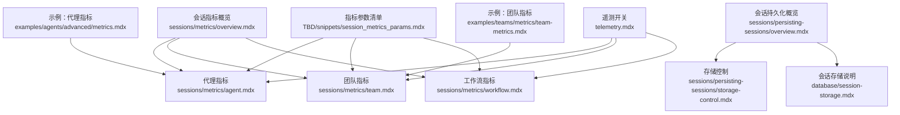
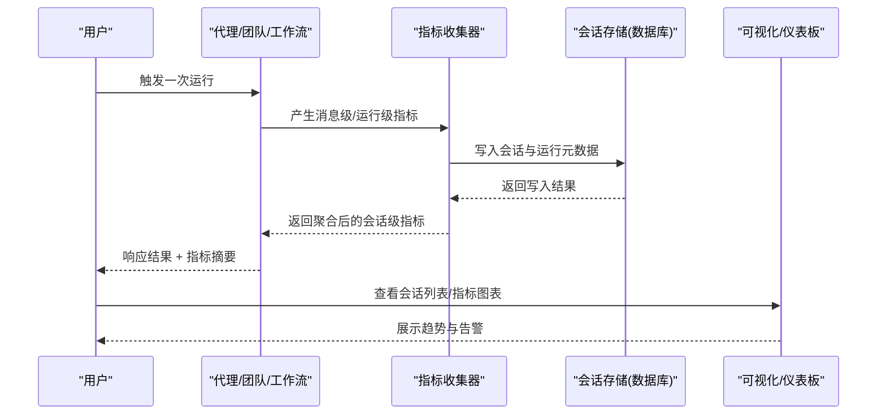
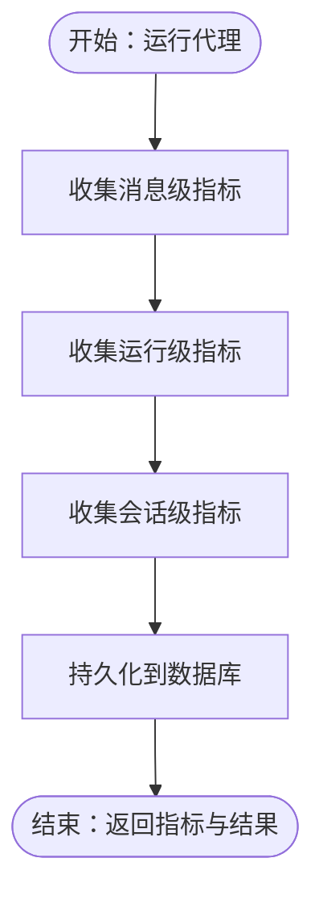
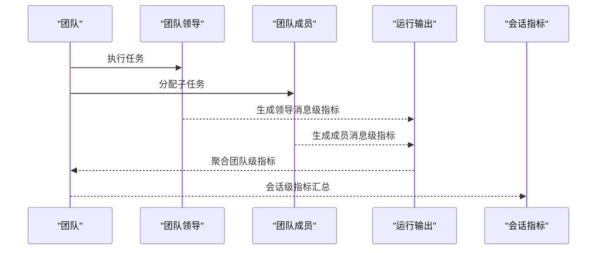
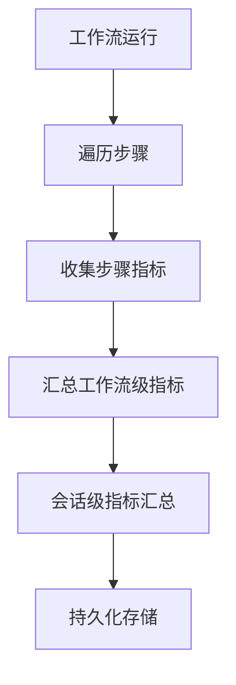
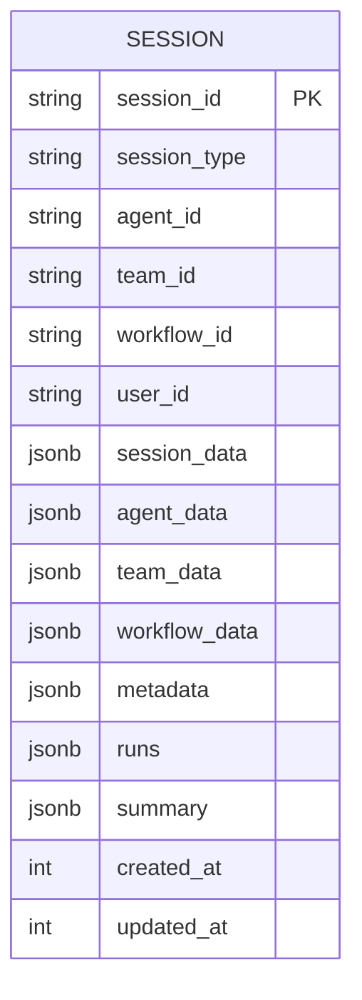
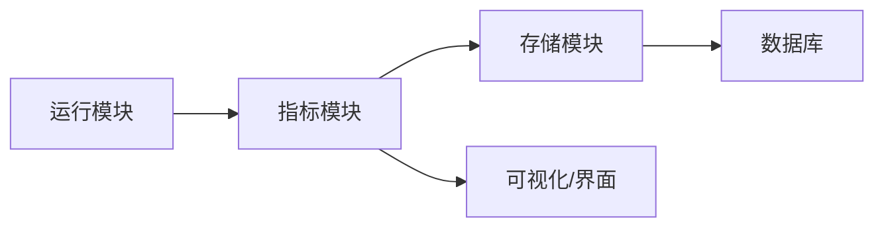

# 会话指标

<cite>
**本文引用的文件**
- [sessions/metrics/overview.mdx](file://sessions/metrics/overview.mdx)
- [sessions/metrics/agent.mdx](file://sessions/metrics/agent.mdx)
- [sessions/metrics/team.mdx](file://sessions/metrics/team.mdx)
- [sessions/metrics/workflow.mdx](file://sessions/metrics/workflow.mdx)
- [sessions/metrics/usage/agent-metrics.mdx](file://sessions/metrics/usage/agent-metrics.mdx)
- [sessions/metrics/usage/team-metrics.mdx](file://sessions/metrics/usage/team-metrics.mdx)
- [sessions/metrics/usage/agent-extra-metrics.mdx](file://sessions/metrics/usage/agent-extra-metrics.mdx)
- [sessions/persisting-sessions/overview.mdx](file://sessions/persisting-sessions/overview.mdx)
- [sessions/persisting-sessions/storage-control.mdx](file://sessions/persisting-sessions/storage-control.mdx)
- [database/session-storage.mdx](file://database/session-storage.mdx)
- [TBD/snippets/session_metrics_params.mdx](file://TBD/snippets/session_metrics_params.mdx)
- [examples/agents/advanced/metrics.mdx](file://examples/agents/advanced/metrics.mdx)
- [examples/teams/metrics/team-metrics.mdx](file://examples/teams/metrics/team-metrics.mdx)
- [telemetry.mdx](file://telemetry.mdx)
</cite>

## 目录
1. [简介](#简介)
2. [项目结构](#项目结构)
3. [核心组件](#核心组件)
4. [架构总览](#架构总览)
5. [详细组件分析](#详细组件分析)
6. [依赖关系分析](#依赖关系分析)
7. [性能考量](#性能考量)
8. [故障排查指南](#故障排查指南)
9. [结论](#结论)
10. [附录](#附录)

## 简介
本技术文档围绕“会话指标系统”展开，目标是帮助开发者与运营人员理解并应用会话指标进行性能监控、使用分析与用户体验评估。会话指标覆盖代理（Agent）、团队（Team）与工作流（Workflow）三个层面，提供消息级、运行级与会话级的多粒度指标，支持实时采集与持久化存储，并可结合可视化工具进行报表与仪表板呈现。

## 项目结构
与会话指标直接相关的文档主要分布在以下路径：
- 会话指标概览与分类：sessions/metrics/*
- 会话持久化与存储控制：sessions/persisting-sessions/* 与 database/session-storage.mdx
- 指标参数说明与字段清单：TBD/snippets/session_metrics_params.mdx
- 实际示例与用法：examples/agents/advanced/metrics.mdx、examples/teams/metrics/team-metrics.mdx
- 遥测开关与禁用：telemetry.mdx

**图示来源**
- [sessions/metrics/overview.mdx](file://sessions/metrics/overview.mdx)
- [sessions/metrics/agent.mdx](file://sessions/metrics/agent.mdx)
- [sessions/metrics/team.mdx](file://sessions/metrics/team.mdx)
- [sessions/metrics/workflow.mdx](file://sessions/metrics/workflow.mdx)
- [sessions/persisting-sessions/overview.mdx](file://sessions/persisting-sessions/overview.mdx)
- [sessions/persisting-sessions/storage-control.mdx](file://sessions/persisting-sessions/storage-control.mdx)
- [database/session-storage.mdx](file://database/session-storage.mdx)
- [TBD/snippets/session_metrics_params.mdx](file://TBD/snippets/session_metrics_params.mdx)
- [examples/agents/advanced/metrics.mdx](file://examples/agents/advanced/metrics.mdx)
- [examples/teams/metrics/team-metrics.mdx](file://examples/teams/metrics/team-metrics.mdx)
- [telemetry.mdx](file://telemetry.mdx)

**章节来源**
- [sessions/metrics/overview.mdx](file://sessions/metrics/overview.mdx)
- [sessions/persisting-sessions/overview.mdx](file://sessions/persisting-sessions/overview.mdx)

## 核心组件
- 指标层级
  - 消息级：记录单条消息（如助手、工具调用等）的指标，便于定位具体交互的耗时与用量。
  - 运行级：记录一次执行（RunOutput/TeamRunOutput/WorkflowRunOutput）的聚合指标，反映整体耗时与Token使用。
  - 会话级：对同一会话内多次运行的指标进行汇总，形成趋势与长期观测数据。
- 指标类型
  - Token类：输入/输出/总Token数、音频Token、缓存命中/写入Token、推理Token等。
  - 时间类：运行总时长、首Token到达时间等。
  - 提供商扩展：模型/工具提供的额外指标（如延迟、成本等）。
- 数据采集与存储
  - 通过数据库后端（PostgreSQL、SQLite、Redis、MongoDB、GCS JSON等）持久化会话与运行元数据。
  - 可按需控制媒体、工具消息、历史消息的存储，以平衡存储开销与可观测性。
- 可视化与报告
  - 结合可视化工具生成图表，或在AgentOS界面查看会话列表与指标摘要。
  - 可基于会话指标构建仪表板与告警规则，支撑性能优化、容量规划与业务洞察。

**章节来源**
- [sessions/metrics/agent.mdx](file://sessions/metrics/agent.mdx)
- [sessions/metrics/team.mdx](file://sessions/metrics/team.mdx)
- [sessions/metrics/workflow.mdx](file://sessions/metrics/workflow.mdx)
- [TBD/snippets/session_metrics_params.mdx](file://TBD/snippets/session_metrics_params.mdx)
- [sessions/persisting-sessions/overview.mdx](file://sessions/persisting-sessions/overview.mdx)
- [sessions/persisting-sessions/storage-control.mdx](file://sessions/persisting-sessions/storage-control.mdx)
- [database/session-storage.mdx](file://database/session-storage.mdx)

## 架构总览
下图展示了从运行到指标采集、持久化与可视化的整体流程：

**图示来源**
- [sessions/metrics/agent.mdx](file://sessions/metrics/agent.mdx)
- [sessions/metrics/team.mdx](file://sessions/metrics/team.mdx)
- [sessions/metrics/workflow.mdx](file://sessions/metrics/workflow.mdx)
- [sessions/persisting-sessions/overview.mdx](file://sessions/persisting-sessions/overview.mdx)
- [database/session-storage.mdx](file://database/session-storage.mdx)

## 详细组件分析

### 代理指标（Agent Metrics）
- 指标层级
  - 消息级：每条消息独立指标，便于定位工具调用或文本生成的耗时与Token使用。
  - 运行级：RunOutput.metrics，包含本次运行的总耗时与Token统计。
  - 会话级：AgentSession.session_metrics，为会话内所有运行指标的汇总。
- 关键指标字段
  - 输入/输出/总Token数、音频Token、缓存Token、推理Token、运行时长、首Token到达时间、提供商扩展指标等。
- 示例与用法
  - 提供了获取消息级、运行级与会话级指标的示例代码路径，便于集成到监控与分析流程中。
- 存储与控制
  - 通过数据库后端自动持久化会话与运行元数据；可使用存储控制策略减少媒体、工具消息与历史消息的持久化，降低存储压力。

**图示来源**
- [sessions/metrics/agent.mdx](file://sessions/metrics/agent.mdx)
- [sessions/persisting-sessions/overview.mdx](file://sessions/persisting-sessions/overview.mdx)

**章节来源**
- [sessions/metrics/agent.mdx](file://sessions/metrics/agent.mdx)
- [sessions/metrics/usage/agent-metrics.mdx](file://sessions/metrics/usage/agent-metrics.mdx)
- [examples/agents/advanced/metrics.mdx](file://examples/agents/advanced/metrics.mdx)
- [TBD/snippets/session_metrics_params.mdx](file://TBD/snippets/session_metrics_params.mdx)
- [sessions/persisting-sessions/storage-control.mdx](file://sessions/persisting-sessions/storage-control.mdx)

### 团队指标（Team Metrics）
- 指标层级
  - 消息级：团队领导与成员的消息指标均可单独查看。
  - 成员运行级：可通过配置开启成员运行级指标，便于拆解各成员的资源消耗。
  - 团队级：TeamRunOutput.metrics，聚合团队领导与成员的指标。
  - 会话级：对团队在会话内的所有运行进行汇总。
- 示例与用法
  - 提供了打印团队领导消息级、聚合指标与会话级指标的示例代码路径。
- 存储与控制
  - 支持开启成员响应存储与历史消息存储，便于审计与复盘；也可按需关闭以节省空间。

**图示来源**
- [sessions/metrics/team.mdx](file://sessions/metrics/team.mdx)
- [sessions/metrics/usage/team-metrics.mdx](file://sessions/metrics/usage/team-metrics.mdx)
- [examples/teams/metrics/team-metrics.mdx](file://examples/teams/metrics/team-metrics.mdx)

**章节来源**
- [sessions/metrics/team.mdx](file://sessions/metrics/team.mdx)
- [sessions/metrics/usage/team-metrics.mdx](file://sessions/metrics/usage/team-metrics.mdx)
- [examples/teams/metrics/team-metrics.mdx](file://examples/teams/metrics/team-metrics.mdx)
- [TBD/snippets/session_metrics_params.mdx](file://TBD/snippets/session_metrics_params.mdx)
- [sessions/persisting-sessions/storage-control.mdx](file://sessions/persisting-sessions/storage-control.mdx)

### 工作流指标（Workflow Metrics）
- 指标层级
  - 工作流级：WorkflowRunOutput.metrics，包含总执行时长与步骤映射。
  - 步骤级：每个步骤的执行指标（时长、Token、模型信息等），便于定位瓶颈。
  - 会话级：对会话内所有步骤的指标进行汇总。
- 示例与用法
  - 提供了打印工作流级、步骤级与会话级指标的示例代码路径。
- 存储与控制
  - 与代理/团队一致，支持存储控制策略，按需裁剪媒体、工具消息与历史消息。

**图示来源**
- [sessions/metrics/workflow.mdx](file://sessions/metrics/workflow.mdx)
- [sessions/persisting-sessions/overview.mdx](file://sessions/persisting-sessions/overview.mdx)

**章节来源**
- [sessions/metrics/workflow.mdx](file://sessions/metrics/workflow.mdx)
- [TBD/snippets/session_metrics_params.mdx](file://TBD/snippets/session_metrics_params.mdx)
- [sessions/persisting-sessions/storage-control.mdx](file://sessions/persisting-sessions/storage-control.mdx)

### 指标参数与字段说明
- 字段清单涵盖输入/输出/总Token、音频Token、缓存Token、推理Token、时间与首Token到达时间、提供商扩展指标等。
- 注意：并非所有字段在每次运行中都会出现，取决于所用模型/工具与运行配置。

**章节来源**
- [TBD/snippets/session_metrics_params.mdx](file://TBD/snippets/session_metrics_params.mdx)

### 数据收集与存储机制
- 自动持久化
  - 配置数据库后，会话、运行元数据、消息、工具调用、媒体等会被自动写入数据库表。
- 存储控制
  - 可通过store_media、store_tool_messages、store_history_messages等标志位控制持久化内容，以平衡存储与可观测性。
- 表结构
  - 会话表包含会话标识、类型、用户ID、配置与元数据、运行列表、摘要、时间戳等字段。

**图示来源**
- [sessions/persisting-sessions/overview.mdx](file://sessions/persisting-sessions/overview.mdx)

**章节来源**
- [sessions/persisting-sessions/overview.mdx](file://sessions/persisting-sessions/overview.mdx)
- [sessions/persisting-sessions/storage-control.mdx](file://sessions/persisting-sessions/storage-control.mdx)
- [database/session-storage.mdx](file://database/session-storage.mdx)

### 可视化与报告
- 可视化工具
  - 可通过可视化工具生成图表，用于业务分析与汇报。
- AgentOS界面
  - 提供会话管理页面，可浏览与管理会话列表与摘要。
- 报表与仪表板
  - 建议基于会话指标构建KPI仪表板，结合告警规则实现异常检测与预警。

**章节来源**
- [sessions/persisting-sessions/overview.mdx](file://sessions/persisting-sessions/overview.mdx)

### 指标分析应用场景
- 性能优化
  - 识别高Token、高时长的消息与步骤，定位慢查询与大模型调用热点。
- 容量规划
  - 基于会话级指标的趋势，估算Token与并发需求，指导资源扩容。
- 业务洞察
  - 通过会话摘要与指标分布，发现用户偏好、常见问题与改进点。

**章节来源**
- [sessions/metrics/overview.mdx](file://sessions/metrics/overview.mdx)

### 配置方法与最佳实践
- 启用会话与持久化
  - 在Agent/Team/Workflow中传入数据库对象即可启用会话持久化。
- 控制存储内容
  - 使用存储控制策略裁剪媒体、工具消息与历史消息，降低存储成本。
- 关闭遥测（可选）
  - 如需完全禁用遥测，可在实例上设置telemetry=False。

**章节来源**
- [sessions/persisting-sessions/overview.mdx](file://sessions/persisting-sessions/overview.mdx)
- [sessions/persisting-sessions/storage-control.mdx](file://sessions/persisting-sessions/storage-control.mdx)
- [telemetry.mdx](file://telemetry.mdx)

## 依赖关系分析
- 组件耦合
  - 指标模块与运行模块强耦合，指标随运行产生；与存储模块弱耦合，通过数据库接口抽象实现持久化。
- 外部依赖
  - 数据库驱动与连接池、可视化工具库、AgentOS界面等。
- 循环依赖
  - 文档层未见循环依赖迹象，均为单向依赖（运行→指标→存储）。

**图示来源**
- [sessions/metrics/agent.mdx](file://sessions/metrics/agent.mdx)
- [sessions/metrics/team.mdx](file://sessions/metrics/team.mdx)
- [sessions/metrics/workflow.mdx](file://sessions/metrics/workflow.mdx)
- [sessions/persisting-sessions/overview.mdx](file://sessions/persisting-sessions/overview.mdx)

**章节来源**
- [sessions/metrics/agent.mdx](file://sessions/metrics/agent.mdx)
- [sessions/metrics/team.mdx](file://sessions/metrics/team.mdx)
- [sessions/metrics/workflow.mdx](file://sessions/metrics/workflow.mdx)
- [sessions/persisting-sessions/overview.mdx](file://sessions/persisting-sessions/overview.mdx)

## 性能考量
- 指标采集开销
  - 消息级指标粒度越细，采集与序列化开销越大；建议在生产环境按需开启。
- 存储成本
  - 媒体与工具消息通常占用较大空间；通过存储控制策略显著降低存储压力。
- 查询与索引
  - 对会话表建立合适索引（如session_id、user_id、时间戳）可提升查询效率。
- 缓存与批处理
  - 对高频指标可采用本地缓存与批量写入策略，减少数据库压力。

[本节为通用性能建议，不直接分析具体文件]

## 故障排查指南
- 获取会话指标失败
  - 检查数据库连接与权限，确认会话表存在且可写。
  - 若启用了存储控制，确认相关标志位是否导致指标缺失。
- 指标字段为空
  - 不同模型/工具可能不提供全部字段，需根据字段清单进行兼容处理。
- 遥测影响
  - 如需排除外部遥测影响，可在实例上设置telemetry=False。

**章节来源**
- [examples/agents/advanced/metrics.mdx](file://examples/agents/advanced/metrics.mdx)
- [examples/teams/metrics/team-metrics.mdx](file://examples/teams/metrics/team-metrics.mdx)
- [telemetry.mdx](file://telemetry.mdx)

## 结论
会话指标系统提供了从消息级到会话级的全链路可观测能力，配合灵活的存储控制与可视化工具，能够有效支撑性能优化、容量规划与业务洞察。通过合理的配置与最佳实践，可在保证可观测性的同时，控制存储与性能成本。

[本节为总结性内容，不直接分析具体文件]

## 附录
- 实际示例与代码路径
  - 代理指标示例：[examples/agents/advanced/metrics.mdx](file://examples/agents/advanced/metrics.mdx)
  - 团队指标示例：[examples/teams/metrics/team-metrics.mdx](file://examples/teams/metrics/team-metrics.mdx)
  - 代理额外指标示例：[sessions/metrics/usage/agent-extra-metrics.mdx](file://sessions/metrics/usage/agent-extra-metrics.mdx)
- 指标参数参考：[TBD/snippets/session_metrics_params.mdx](file://TBD/snippets/session_metrics_params.mdx)
- 会话持久化与存储控制：[sessions/persisting-sessions/overview.mdx](file://sessions/persisting-sessions/overview.mdx)、[sessions/persisting-sessions/storage-control.mdx](file://sessions/persisting-sessions/storage-control.mdx)
- 会话存储说明：[database/session-storage.mdx](file://database/session-storage.mdx)

[本节为补充材料，不直接分析具体文件]