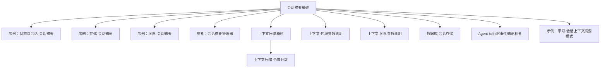
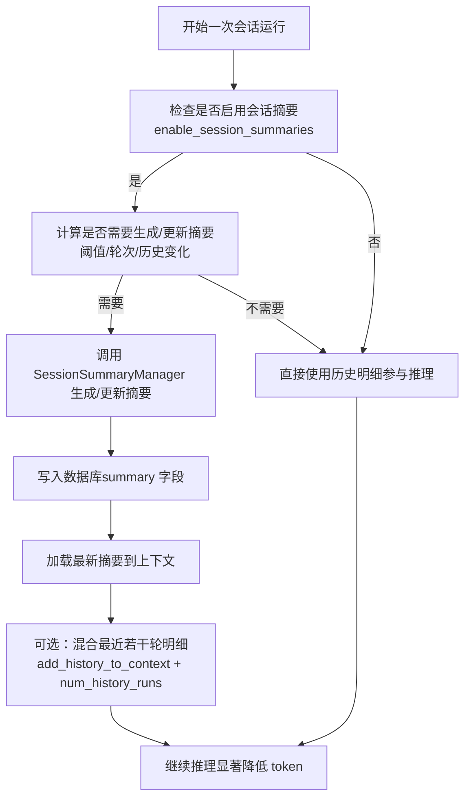
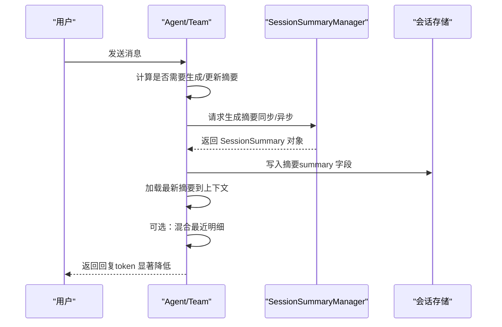
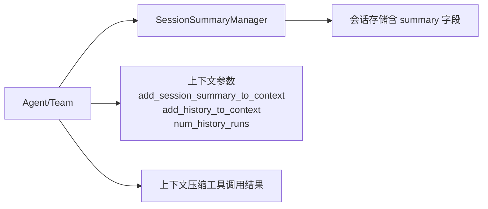

# 会话摘要

<cite>
**本文引用的文件**
- [会话摘要（概述）](file://sessions/session-summaries.mdx)
- [示例：状态与会话·会话摘要](file://examples/agents/state-and-session/session-summary.mdx)
- [示例：存储·会话摘要](file://examples/storage/session-summary.mdx)
- [参考：会话摘要管理器](file://reference/session/summary_manager.mdx)
- [上下文压缩（概述）](file://compression/overview.mdx)
- [上下文压缩·令牌计数](file://compression/token-counting.mdx)
- [示例：团队·会话摘要](file://examples/teams/session/session-summary.mdx)
- [Agent 运行时事件（摘要相关）](file://agents/running-agents.mdx)
- [上下文·代理（参数说明）](file://context/agent/overview.mdx)
- [上下文·团队（参数说明）](file://context/team/overview.mdx)
- [数据库·会话存储](file://database/session-storage.mdx)
- [示例：学习·会话上下文摘要模式](file://examples/learning/basics/a-session-context-summary.mdx)
</cite>

## 目录
1. [简介](#简介)
2. [项目结构](#项目结构)
3. [核心组件](#核心组件)
4. [架构总览](#架构总览)
5. [组件详解](#组件详解)
6. [依赖关系分析](#依赖关系分析)
7. [性能考量](#性能考量)
8. [故障排查指南](#故障排查指南)
9. [结论](#结论)
10. [附录](#附录)

## 简介
会话摘要用于将长时间、多轮次的对话压缩为简洁的摘要，以显著降低每次交互的 token 消耗并避免超出模型上下文窗口限制。它通过在合适的时机对会话历史进行总结，使后续推理仅依赖“摘要 + 最近若干轮明细”，从而在保持对话连贯性的同时大幅节省成本与延迟。

## 项目结构
围绕会话摘要的关键文档与示例分布如下：
- 概念与使用说明：sessions/session-summaries.mdx
- 示例：agents/state-and-session/session-summary.mdx、storage/session-summary.mdx、teams/session/session-summary.mdx
- 参考：reference/session/summary_manager.mdx
- 上下文压缩（工具调用结果压缩，与会话摘要互补）：compression/overview.mdx、compression/token-counting.mdx
- 参数与集成：context/agent/overview.mdx、context/team/overview.mdx、database/session-storage.mdx
- 事件与运行期行为：agents/running-agents.mdx
- 学习示例：examples/learning/basics/a-session-context-summary.mdx

图表来源
- [会话摘要（概述）:1-184](file://sessions/session-summaries.mdx#L1-L184)
- [示例：状态与会话·会话摘要:1-70](file://examples/agents/state-and-session/session-summary.mdx#L1-L70)
- [示例：存储·会话摘要:1-69](file://examples/storage/session-summary.mdx#L1-L69)
- [示例：团队·会话摘要:1-113](file://examples/teams/session/session-summary.mdx#L1-L113)
- [参考：会话摘要管理器:1-49](file://reference/session/summary_manager.mdx#L1-L49)
- [上下文压缩（概述）:1-267](file://compression/overview.mdx#L1-L267)
- [上下文压缩·令牌计数:1-113](file://compression/token-counting.mdx#L1-L113)
- [上下文·代理（参数说明）:80-120](file://context/agent/overview.mdx#L80-L120)
- [上下文·团队（参数说明）:140-220](file://context/team/overview.mdx#L140-L220)
- [数据库·会话存储:40-60](file://database/session-storage.mdx#L40-L60)
- [Agent 运行时事件（摘要相关）:200-210](file://agents/running-agents.mdx#L200-L210)
- [示例：学习·会话上下文摘要模式:1-120](file://examples/learning/basics/a-session-context-summary.mdx#L1-L120)

章节来源
- [会话摘要（概述）:1-184](file://sessions/session-summaries.mdx#L1-L184)

## 核心组件
- 会话摘要管理器（SessionSummaryManager）
  - 职责：基于模型对会话历史进行分析，生成摘要文本与可选主题列表；支持同步与异步生成。
  - 关键属性：模型、自定义摘要提示、摘要请求消息、是否在上次运行中更新过摘要。
  - 返回对象：包含摘要文本、主题列表、更新时间。
- 会话摘要（SessionSummary）
  - 字段：summary、topics、updated_at。
- 集成点
  - Agent/Team 启用开关：enable_session_summaries、add_session_summary_to_context。
  - 与最近历史混合：add_history_to_context、num_history_runs。
  - 数据库存储：会话表中新增 summary 字段。

章节来源
- [参考：会话摘要管理器:1-49](file://reference/session/summary_manager.mdx#L1-L49)
- [上下文·代理（参数说明）:80-120](file://context/agent/overview.mdx#L80-L120)
- [上下文·团队（参数说明）:140-220](file://context/team/overview.mdx#L140-L220)
- [数据库·会话存储:40-60](file://database/session-storage.mdx#L40-L60)

## 架构总览
会话摘要的运行流程分为三步：启用摘要生成 → 在上下文中使用摘要 → 可选定制（模型、提示、格式）。

图表来源
- [会话摘要（概述）:44-58](file://sessions/session-summaries.mdx#L44-L58)
- [数据库·会话存储:40-60](file://database/session-storage.mdx#L40-L60)
- [上下文·代理（参数说明）:80-120](file://context/agent/overview.mdx#L80-L120)
- [上下文·团队（参数说明）:140-220](file://context/team/overview.mdx#L140-L220)

## 组件详解

### 1) 自动摘要生成的算法与策略
- 触发条件
  - 基于轮次数：当会话累计运行轮次达到阈值时触发。
  - 基于历史变化：当历史累积导致 token 预估接近或超过阈值时触发。
  - 基于配置：enable_session_summaries 开启后，系统在合适时机生成/更新摘要。
- 生成时机
  - 每次运行结束后，若满足触发条件，则生成摘要并写入数据库。
  - 下一轮运行前，自动从数据库加载最新摘要加入上下文。
- 内容提取规则
  - 摘要聚焦“重要信息”，如关键决策、事实、结论、任务进展等。
  - 主题抽取为可选，便于检索与回溯。
- 上下文压缩技术
  - 以“摘要 + 最近明细”的组合替代整段历史，显著降低 token。
  - 可与上下文压缩（工具调用结果压缩）配合使用，进一步节省空间。

章节来源
- [会话摘要（概述）:11-58](file://sessions/session-summaries.mdx#L11-L58)
- [上下文压缩（概述）:34-69](file://compression/overview.mdx#L34-L69)

### 2) 摘要与会话历史的关系
- 历史存储：会话历史与摘要并存，摘要作为长期记忆，最近明细作为短期细节。
- 使用策略：默认启用 add_session_summary_to_context，使摘要进入上下文；同时可通过 add_history_to_context 和 num_history_runs 混合最近明细，兼顾连贯性与成本。
- 更新策略：摘要随有意义的历史增量而更新，避免频繁无意义重算。

章节来源
- [会话摘要（概述）:109-169](file://sessions/session-summaries.mdx#L109-L169)
- [数据库·会话存储:40-60](file://database/session-storage.mdx#L40-L60)

### 3) 摘要质量评估方法与指标
- 可读性评估：摘要是否准确传达要点、逻辑清晰、无歧义。
- 完整性评估：是否覆盖关键决策、事实、任务状态、待办事项等。
- 回溯能力：能否通过摘要快速定位到具体讨论背景与结论。
- 成本与延迟：token 数量下降幅度、响应时间改善程度。
- 一致性：不同轮次生成的摘要在语义上保持一致，避免前后矛盾。

章节来源
- [会话摘要（概述）:38-43](file://sessions/session-summaries.mdx#L38-L43)

### 4) 实际应用示例与效果
- 客户服务场景
  - 长周期跟进：通过摘要保留客户背景、诉求与处理进展，减少重复输入。
  - 多轮协商：摘要帮助客服人员快速理解上下文，提升服务效率。
- 知识问答场景
  - 复杂检索与推理：摘要承载已知事实与结论，减少重复检索与解释成本。
- 示例路径
  - [示例：状态与会话·会话摘要:1-70](file://examples/agents/state-and-session/session-summary.mdx#L1-L70)
  - [示例：存储·会话摘要:1-69](file://examples/storage/session-summary.mdx#L1-L69)
  - [示例：团队·会话摘要:1-113](file://examples/teams/session/session-summary.mdx#L1-L113)
  - [示例：学习·会话上下文摘要模式:1-120](file://examples/learning/basics/a-session-context-summary.mdx#L1-L120)

章节来源
- [示例：状态与会话·会话摘要:1-70](file://examples/agents/state-and-session/session-summary.mdx#L1-L70)
- [示例：存储·会话摘要:1-69](file://examples/storage/session-summary.mdx#L1-L69)
- [示例：团队·会话摘要:1-113](file://examples/teams/session/session-summary.mdx#L1-L113)
- [示例：学习·会话上下文摘要模式:1-120](file://examples/learning/basics/a-session-context-summary.mdx#L1-L120)

### 5) 配置选项与最佳实践
- 启用与使用
  - Agent/Team：enable_session_summaries、add_session_summary_to_context。
  - 混合最近历史：add_history_to_context、num_history_runs。
- 定制化
  - 使用 SessionSummaryManager 指定更轻量的模型、自定义提示、输出格式。
- 存储与检索
  - 会话表新增 summary 字段，用于持久化摘要。
- 与其他压缩策略协同
  - 与上下文压缩（工具调用结果压缩）结合，分别解决“历史长文本”和“工具返回冗长结果”的两类成本压力。

章节来源
- [会话摘要（概述）:60-102](file://sessions/session-summaries.mdx#L60-L102)
- [参考：会话摘要管理器:1-49](file://reference/session/summary_manager.mdx#L1-L49)
- [上下文·代理（参数说明）:80-120](file://context/agent/overview.mdx#L80-L120)
- [上下文·团队（参数说明）:140-220](file://context/team/overview.mdx#L140-L220)
- [数据库·会话存储:40-60](file://database/session-storage.mdx#L40-L60)
- [上下文压缩（概述）:75-114](file://compression/overview.mdx#L75-L114)

### 6) 会话摘要生成序列图

图表来源
- [会话摘要（概述）:44-58](file://sessions/session-summaries.mdx#L44-L58)
- [参考：会话摘要管理器:19-38](file://reference/session/summary_manager.mdx#L19-L38)
- [数据库·会话存储:40-60](file://database/session-storage.mdx#L40-L60)

## 依赖关系分析
- 组件耦合
  - Agent/Team 与 SessionSummaryManager 解耦：通过配置项启用/禁用，支持外部注入管理器。
  - 与数据库耦合：依赖会话表的 summary 字段进行持久化。
  - 与上下文参数耦合：add_session_summary_to_context、add_history_to_context、num_history_runs 影响摘要的使用方式。
- 与上下文压缩的协作
  - 会话摘要压缩“历史长文本”，上下文压缩压缩“工具调用结果”，二者互补。
- 外部依赖
  - 模型：用于摘要生成与（可选）主题抽取。
  - 令牌计数：用于判断是否触发摘要生成（与上下文压缩类似）。

图表来源
- [上下文·代理（参数说明）:80-120](file://context/agent/overview.mdx#L80-L120)
- [上下文·团队（参数说明）:140-220](file://context/team/overview.mdx#L140-L220)
- [上下文压缩（概述）:52-69](file://compression/overview.mdx#L52-L69)
- [数据库·会话存储:40-60](file://database/session-storage.mdx#L40-L60)

章节来源
- [上下文·代理（参数说明）:80-120](file://context/agent/overview.mdx#L80-L120)
- [上下文·团队（参数说明）:140-220](file://context/team/overview.mdx#L140-L220)
- [上下文压缩（概述）:52-69](file://compression/overview.mdx#L52-L69)
- [数据库·会话存储:40-60](file://database/session-storage.mdx#L40-L60)

## 性能考量
- 成本优化
  - 通过摘要显著降低 token 消耗，尤其适用于长对话与多轮交互。
- 延迟优化
  - 减少上下文大小可缩短推理时间，提高吞吐。
- 触发策略
  - 基于轮次数或 token 预估的阈值，避免过度生成；可结合上下文压缩的阈值策略统一规划。
- 模型选择
  - 摘要阶段可使用更轻量的模型，主推理仍可用更强模型，平衡成本与质量。

章节来源
- [会话摘要（概述）:38-43](file://sessions/session-summaries.mdx#L38-L43)
- [上下文压缩（概述）:174-176](file://compression/overview.mdx#L174-L176)

## 故障排查指南
- 摘要未生成
  - 检查是否开启 enable_session_summaries。
  - 检查是否有“有意义的历史增量”触发生成。
  - 检查 SessionSummaryManager 的模型与提示配置。
- 摘要未生效
  - 确认 add_session_summary_to_context 已启用。
  - 确认数据库中 summary 字段已写入。
- 混合历史不生效
  - 检查 add_history_to_context 与 num_history_runs 的设置。
- 令牌计数偏差
  - 参考上下文压缩的令牌计数说明，确认估算范围与依赖安装情况。

章节来源
- [Agent 运行时事件（摘要相关）:200-210](file://agents/running-agents.mdx#L200-L210)
- [上下文·代理（参数说明）:80-120](file://context/agent/overview.mdx#L80-L120)
- [上下文·团队（参数说明）:140-220](file://context/team/overview.mdx#L140-L220)
- [上下文压缩·令牌计数:19-53](file://compression/token-counting.mdx#L19-L53)

## 结论
会话摘要通过“摘要 + 最近明细”的双层上下文策略，在保持对话连贯性的同时显著降低成本与延迟。结合上下文压缩与合理的触发阈值，可在客户服务、知识问答等场景中获得稳定且高效的体验。建议根据业务对话长度与成本目标，合理配置摘要生成策略与模型，持续评估摘要质量与成本收益。

## 附录
- 相关示例与参考
  - [示例：状态与会话·会话摘要:1-70](file://examples/agents/state-and-session/session-summary.mdx#L1-L70)
  - [示例：存储·会话摘要:1-69](file://examples/storage/session-summary.mdx#L1-L69)
  - [示例：团队·会话摘要:1-113](file://examples/teams/session/session-summary.mdx#L1-L113)
  - [示例：学习·会话上下文摘要模式:1-120](file://examples/learning/basics/a-session-context-summary.mdx#L1-L120)
  - [参考：会话摘要管理器:1-49](file://reference/session/summary_manager.mdx#L1-L49)
  - [上下文压缩（概述）:1-267](file://compression/overview.mdx#L1-L267)
  - [上下文压缩·令牌计数:1-113](file://compression/token-counting.mdx#L1-L113)