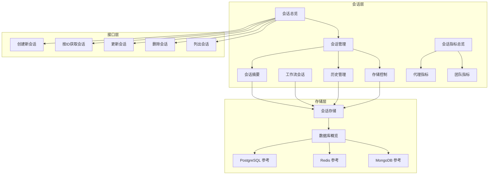
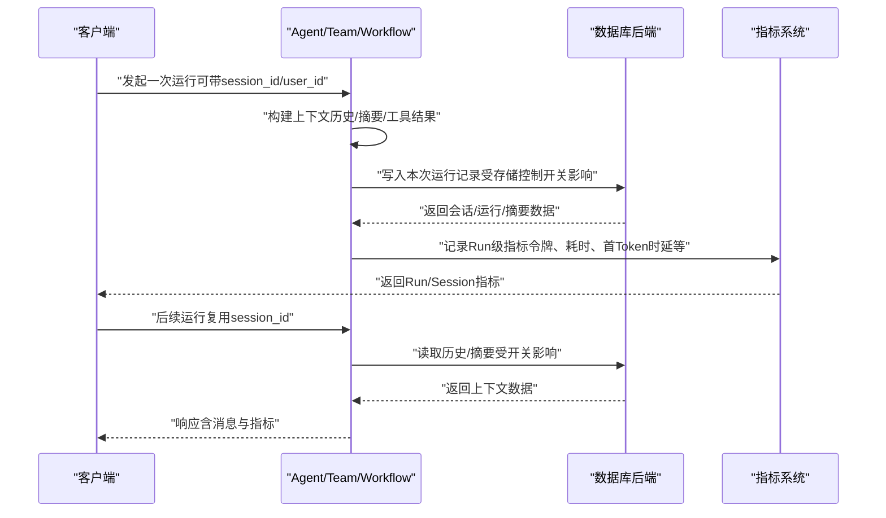
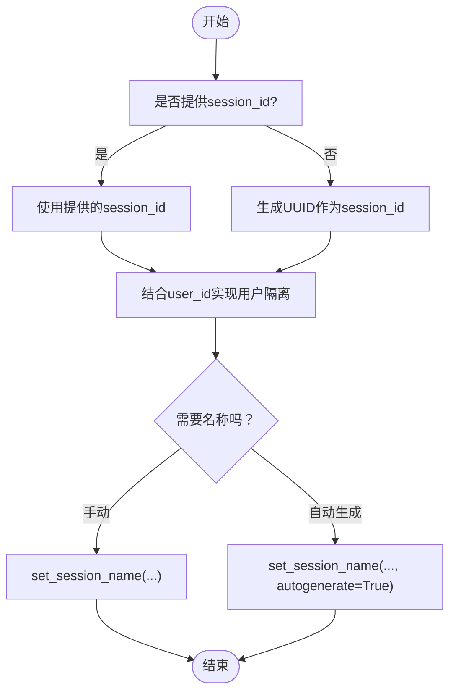
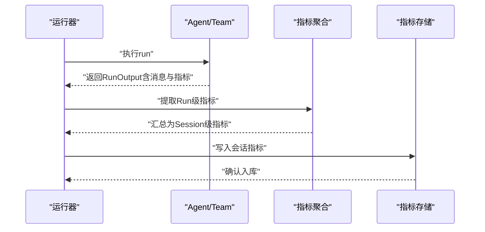
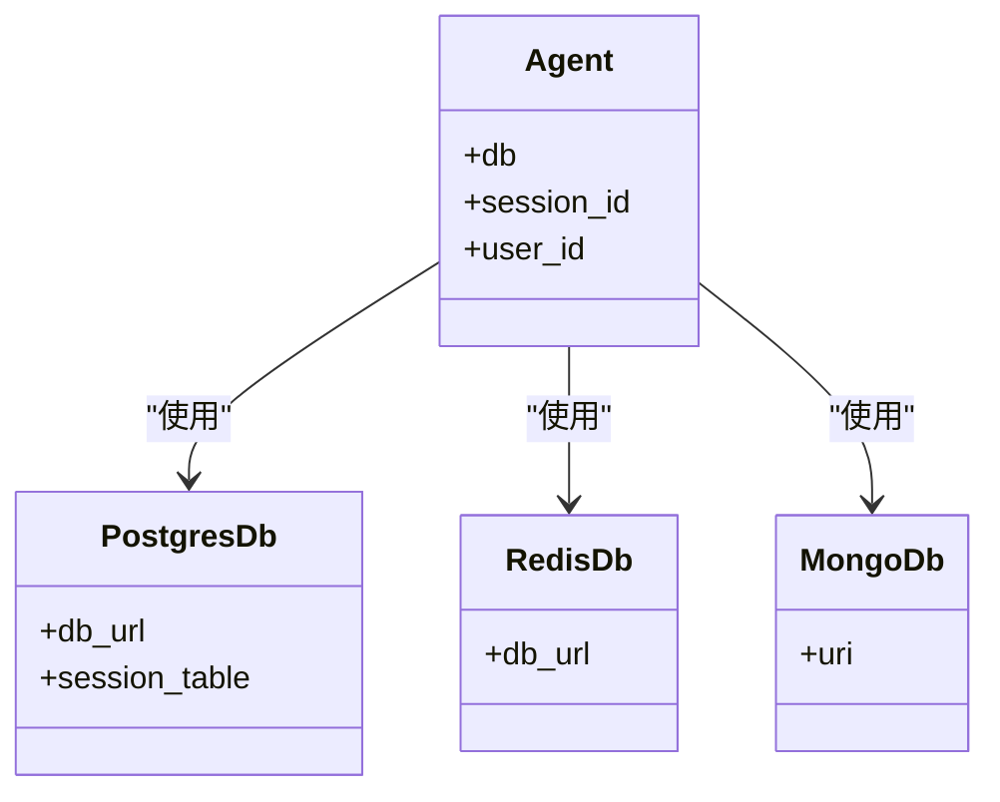
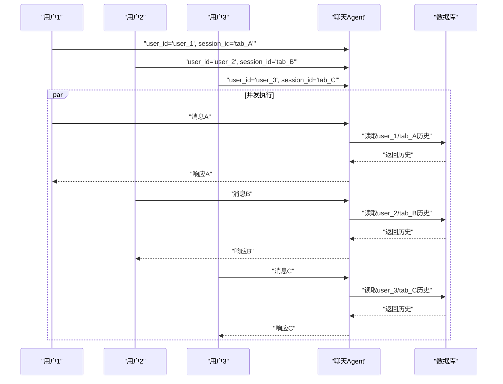
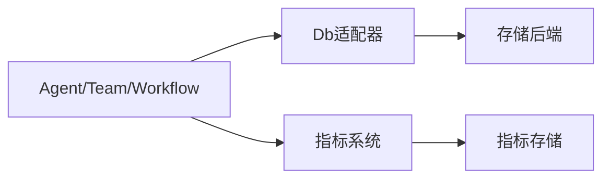

# 会话管理

<cite>
**本文引用的文件**
- [会话总览](file://sessions/overview.mdx)
- [会话管理](file://sessions/session-management.mdx)
- [会话摘要](file://sessions/session-summaries.mdx)
- [工作流会话](file://sessions/workflow-sessions.mdx)
- [会话存储](file://database/session-storage.mdx)
- [存储控制](file://sessions/persisting-sessions/storage-control.mdx)
- [历史管理](file://sessions/history-management.mdx)
- [会话指标总览](file://sessions/metrics/overview.mdx)
- [代理指标](file://sessions/metrics/agent.mdx)
- [团队指标](file://sessions/metrics/team.mdx)
- [持久化会话存储示例](file://examples/storage/persistent-session-storage.mdx)
- [多用户多会话并发聊天示例](file://examples/memory/multi-user-multi-session-chat-concurrent.mdx)
- [PostgreSQL 数据库参考](file://reference/storage/postgres.mdx)
- [Redis 数据库参考](file://reference/storage/redis.mdx)
- [MongoDB 数据库参考](file://reference/storage/mongodb.mdx)
- [数据库概览](file://database/overview.mdx)
- [数据库提供者：Redis 概览](file://database/providers/redis/overview.mdx)
- [数据库提供者：Neon 概览](file://database/providers/neon/overview.mdx)
- [API：创建新会话](file://reference-api/schema/sessions/create-new-session.mdx)
- [API：按ID获取会话](file://reference-api/schema/sessions/get-session-by-id.mdx)
- [API：更新会话](file://reference-api/schema/sessions/update-session.mdx)
- [API：删除会话](file://reference-api/schema/sessions/delete-session.mdx)
- [API：列出会话](file://reference-api/schema/sessions/list-sessions.mdx)
</cite>

## 目录
1. [简介](#简介)
2. [项目结构](#项目结构)
3. [核心组件](#核心组件)
4. [架构总览](#架构总览)
5. [详细组件分析](#详细组件分析)
6. [依赖关系分析](#依赖关系分析)
7. [性能考量](#性能考量)
8. [故障排查指南](#故障排查指南)
9. [结论](#结论)
10. [附录](#附录)

## 简介
本技术文档围绕会话管理功能展开，系统性说明会话ID的生成与手动指定策略、会话名称的设置与自动命名、会话性能监控（响应时间、令牌用量、时延等）的采集与分析、会话持久化配置（数据库后端选择与优化）、多用户会话的实现（用户隔离与会话路由）、以及在生产环境中的最佳实践与示例路径。文档以仓库内现有内容为基础，结合API与示例，帮助读者快速落地并稳定运行会话管理能力。

## 项目结构
与会话管理直接相关的内容主要分布在以下目录与文件：
- sessions：会话概念、管理、摘要、工作流会话、指标、历史管理、持久化存储控制
- database：会话存储表结构、数据库支持概览与各提供者
- reference-api/schema/sessions：会话相关REST API定义
- examples：持久化会话存储示例、多用户多会话并发示例
- reference/storage：PostgreSQL、Redis、MongoDB等数据库适配器参考

**图表来源**
- [会话总览:1-86](file://sessions/overview.mdx#L1-L86)
- [会话管理:1-189](file://sessions/session-management.mdx#L1-L189)
- [会话摘要:1-184](file://sessions/session-summaries.mdx#L1-L184)
- [工作流会话:1-243](file://sessions/workflow-sessions.mdx#L1-L243)
- [会话存储:1-119](file://database/session-storage.mdx#L1-L119)
- [数据库概览:1-38](file://database/overview.mdx#L1-L38)
- [PostgreSQL 数据库参考:1-9](file://reference/storage/postgres.mdx#L1-L9)
- [Redis 数据库参考:1-8](file://reference/storage/redis.mdx#L1-L8)
- [MongoDB 数据库参考:1-8](file://reference/storage/mongodb.mdx#L1-L8)
- [API：创建新会话:1-3](file://reference-api/schema/sessions/create-new-session.mdx#L1-L3)
- [API：按ID获取会话:1-3](file://reference-api/schema/sessions/get-session-by-id.mdx#L1-L3)
- [API：更新会话:1-3](file://reference-api/schema/sessions/update-session.mdx#L1-L3)
- [API：删除会话:1-3](file://reference-api/schema/sessions/delete-session.mdx#L1-L3)
- [API：列出会话:1-3](file://reference-api/schema/sessions/list-sessions.mdx#L1-L3)

**章节来源**
- [会话总览:1-86](file://sessions/overview.mdx#L1-L86)
- [会话管理:1-189](file://sessions/session-management.mdx#L1-L189)
- [会话摘要:1-184](file://sessions/session-summaries.mdx#L1-L184)
- [工作流会话:1-243](file://sessions/workflow-sessions.mdx#L1-L243)
- [会话存储:1-119](file://database/session-storage.mdx#L1-L119)
- [数据库概览:1-38](file://database/overview.mdx#L1-L38)
- [PostgreSQL 数据库参考:1-9](file://reference/storage/postgres.mdx#L1-L9)
- [Redis 数据库参考:1-8](file://reference/storage/redis.mdx#L1-L8)
- [MongoDB 数据库参考:1-8](file://reference/storage/mongodb.mdx#L1-L8)
- [API：创建新会话:1-3](file://reference-api/schema/sessions/create-new-session.mdx#L1-L3)
- [API：按ID获取会话:1-3](file://reference-api/schema/sessions/get-session-by-id.mdx#L1-L3)
- [API：更新会话:1-3](file://reference-api/schema/sessions/update-session.mdx#L1-L3)
- [API：删除会话:1-3](file://reference-api/schema/sessions/delete-session.mdx#L1-L3)
- [API：列出会话:1-3](file://reference-api/schema/sessions/list-sessions.mdx#L1-L3)

## 核心组件
- 会话标识与命名
  - 自动/手动会话ID：支持手动传入session_id或由系统自动生成UUID；可结合user_id实现多用户隔离。
  - 会话名称：支持手动设置与基于对话内容的自动命名，便于UI与工单关联。
- 会话缓存
  - cache_session参数启用内存缓存，减少重复数据库读取，适合长对话与高延迟数据库场景。
- 会话摘要
  - enable_session_summaries开启滚动摘要，降低上下文长度与成本；可控制是否将摘要加入上下文。
- 历史管理
  - add_history_to_context按最近N轮自动注入历史；read_chat_history允许模型按需查询；程序化访问用于UI与审计。
- 存储控制
  - store_media、store_tool_messages、store_history_messages三类开关，精细化裁剪持久化数据，平衡成本与可用性。
- 指标与监控
  - 代理/团队/工作流均提供Run级别与Session级别的指标（输入/输出令牌、总耗时、首Token时延等），支持聚合统计与导出分析。
- 数据库后端
  - 支持PostgreSQL、SQLite、MongoDB、Redis、DynamoDB、Firestore、MySQL、SingleStore、SurrealDB、GCS、JSON、In-Memory等，按场景选择。

**章节来源**
- [会话管理:10-189](file://sessions/session-management.mdx#L10-L189)
- [会话摘要:44-184](file://sessions/session-summaries.mdx#L44-L184)
- [历史管理:10-108](file://sessions/history-management.mdx#L10-L108)
- [存储控制:1-208](file://sessions/persisting-sessions/storage-control.mdx#L1-L208)
- [会话指标总览:1-39](file://sessions/metrics/overview.mdx#L1-L39)
- [代理指标:1-79](file://sessions/metrics/agent.mdx#L1-L79)
- [团队指标:1-108](file://sessions/metrics/team.mdx#L1-L108)
- [数据库概览:1-38](file://database/overview.mdx#L1-L38)

## 架构总览
下图展示了从调用到存储与监控的整体流程，涵盖会话生命周期的关键节点与数据流。

**图表来源**
- [会话管理:10-189](file://sessions/session-management.mdx#L10-L189)
- [会话摘要:44-184](file://sessions/session-summaries.mdx#L44-L184)
- [历史管理:10-108](file://sessions/history-management.mdx#L10-L108)
- [存储控制:18-36](file://sessions/persisting-sessions/storage-control.mdx#L18-L36)
- [会话指标总览:8-39](file://sessions/metrics/overview.mdx#L8-L39)
- [代理指标:10-79](file://sessions/metrics/agent.mdx#L10-L79)
- [团队指标:10-108](file://sessions/metrics/team.mdx#L10-L108)

## 详细组件分析

### 会话ID管理与命名策略
- 自动生成与手动指定
  - 若未提供session_id，系统将自动生成唯一标识；也可显式传入自定义ID，便于外部追踪与对账。
  - 结合user_id可实现多用户隔离，确保不同用户不会互相污染会话历史。
- 会话名称
  - 手动命名：set_session_name(session_id, session_name)；适用于工单/页面标题等场景。
  - 自动命名：set_session_name(..., autogenerate=True)，由模型根据前几条消息生成简短标签。
- 最佳实践
  - 在对话具备主题后延迟生成名称，避免无意义标签。
  - 对外暴露命名接口时增加守卫与策略（如长度限制、敏感词过滤）。
  - 成批重命名时考虑模型延迟与成本，必要时使用轻量模型或离线任务。

**图表来源**
- [会话管理:10-139](file://sessions/session-management.mdx#L10-L139)

**章节来源**
- [会话管理:10-139](file://sessions/session-management.mdx#L10-L139)

### 会话性能监控（指标采集与分析）
- 指标层级
  - 消息级：每条消息（助手/工具等）独立指标。
  - 运行级：每次run的RunOutput包含该次运行的指标。
  - 会话级：AgentSession聚合所有RunOutput.metrics形成session_metrics。
- 关键指标
  - 输入/输出/音频输入/音频输出令牌数与总和、缓存读写令牌、推理令牌、运行时长、首Token时延、供应商特定指标等。
- 分析建议
  - 将session_metrics按会话维度归档，结合业务场景（如平均响应时长、平均令牌消耗）建立SLA。
  - 对异常峰值（超时、高令牌消耗）进行告警与根因分析（工具调用、历史长度、摘要策略）。

**图表来源**
- [代理指标:10-79](file://sessions/metrics/agent.mdx#L10-L79)
- [团队指标:10-108](file://sessions/metrics/team.mdx#L10-L108)
- [会话指标总览:8-39](file://sessions/metrics/overview.mdx#L8-L39)

**章节来源**
- [代理指标:10-79](file://sessions/metrics/agent.mdx#L10-L79)
- [团队指标:10-108](file://sessions/metrics/team.mdx#L10-L108)
- [会话指标总览:8-39](file://sessions/metrics/overview.mdx#L8-L39)

### 会话持久化配置与数据库后端选择
- 表结构与字段
  - session_id、session_type、agent_id/team_id/workflow_id、user_id、session_data、agent_data、team_data、workflow_data、metadata、runs、summary、created_at、updated_at等。
- 后端选择
  - 生产推荐PostgreSQL；本地开发可选SQLite；追求低延迟与高吞吐可选Redis；文档型需求可选MongoDB；云原生Serverless可选Neon（PostgreSQL）。
- 配置要点
  - 使用session_table自定义会话表名，区分不同Agent或环境。
  - 通过Db适配器（PostgresDb、RedisDb、MongoDb等）接入，遵循对应参数与连接方式。

**图表来源**
- [PostgreSQL 数据库参考:1-9](file://reference/storage/postgres.mdx#L1-L9)
- [Redis 数据库参考:1-8](file://reference/storage/redis.mdx#L1-L8)
- [MongoDB 数据库参考:1-8](file://reference/storage/mongodb.mdx#L1-L8)
- [会话存储:9-51](file://database/session-storage.mdx#L9-L51)

**章节来源**
- [会话存储:9-51](file://database/session-storage.mdx#L9-L51)
- [数据库概览:23-38](file://database/overview.mdx#L23-L38)
- [数据库提供者：Redis 概览:1-35](file://database/providers/redis/overview.mdx#L1-L35)
- [数据库提供者：Neon 概览:1-32](file://database/providers/neon/overview.mdx#L1-L32)
- [PostgreSQL 数据库参考:1-9](file://reference/storage/postgres.mdx#L1-L9)
- [Redis 数据库参考:1-8](file://reference/storage/redis.mdx#L1-L8)
- [MongoDB 数据库参考:1-8](file://reference/storage/mongodb.mdx#L1-L8)

### 多用户会话实现（用户隔离与会话路由）
- 用户隔离
  - 使用user_id区分不同用户，session_id在同一用户内区分多个“对话标签页”。
- 并发与一致性
  - 示例演示了多用户并发会话，确保每个用户仅看到自己的记忆与会话。
- 路由机制
  - 在入口处解析user_id与session_id，将请求路由至对应会话；必要时在中间件层统一校验与鉴权。

**图表来源**
- [多用户多会话并发聊天示例:87-152](file://examples/memory/multi-user-multi-session-chat-concurrent.mdx#L87-L152)
- [会话总览:49-57](file://sessions/overview.mdx#L49-L57)

**章节来源**
- [多用户多会话并发聊天示例:87-152](file://examples/memory/multi-user-multi-session-chat-concurrent.mdx#L87-L152)
- [会话总览:49-57](file://sessions/overview.mdx#L49-L57)

### 会话标签与分类（会话名称与摘要）
- 名称分类
  - 手动命名：适合工单/页面标题等强语义场景。
  - 自动命名：基于模型生成，建议在对话有一定上下文后再触发，避免噪声。
- 摘要分类
  - 通过enable_session_summaries与add_session_summary_to_context控制摘要生成与上下文注入，降低令牌成本并维持连续性。

**章节来源**
- [会话管理:81-139](file://sessions/session-management.mdx#L81-L139)
- [会话摘要:44-112](file://sessions/session-summaries.mdx#L44-L112)

### API与数据模型映射
- 会话相关REST API
  - 创建新会话、按ID获取会话、更新会话、删除会话、列出会话。
- 数据模型要点
  - 会话记录包含session_id、session_type、user_id、runs、summary、metadata等字段，便于检索与分析。

**章节来源**
- [API：创建新会话:1-3](file://reference-api/schema/sessions/create-new-session.mdx#L1-L3)
- [API：按ID获取会话:1-3](file://reference-api/schema/sessions/get-session-by-id.mdx#L1-L3)
- [API：更新会话:1-3](file://reference-api/schema/sessions/update-session.mdx#L1-L3)
- [API：删除会话:1-3](file://reference-api/schema/sessions/delete-session.mdx#L1-L3)
- [API：列出会话:1-3](file://reference-api/schema/sessions/list-sessions.mdx#L1-L3)
- [会话存储:30-51](file://database/session-storage.mdx#L30-L51)

## 依赖关系分析
- 组件耦合
  - Agent/Team/Workflow与Db适配器强耦合，会话生命周期完全依赖数据库持久化。
  - 指标系统与运行器解耦，通过RunOutput输出指标，便于独立采集与存储。
- 外部依赖
  - 数据库驱动与服务端（PostgreSQL、Redis、MongoDB等）版本兼容性需关注。
- 循环依赖
  - 当前文档未发现循环依赖迹象；若扩展自定义Db适配器，应避免在会话对象中引入反向引用。

**图表来源**
- [会话存储:1-119](file://database/session-storage.mdx#L1-L119)
- [会话指标总览:1-39](file://sessions/metrics/overview.mdx#L1-L39)

**章节来源**
- [会话存储:1-119](file://database/session-storage.mdx#L1-L119)
- [会话指标总览:1-39](file://sessions/metrics/overview.mdx#L1-L39)

## 性能考量
- 缓存策略
  - cache_session适合长对话与高延迟数据库，减少DB往返；但不建议在生产使用，主要用于开发测试。
- 上下文压缩
  - 启用会话摘要与有限历史注入，显著降低令牌占用与响应时延。
- 存储裁剪
  - 关闭store_media/store_tool_messages/store_history_messages可大幅降低数据库体积与写放大，但需评估对LLM上下文完整性的影响。
- 数据库选择
  - 生产优先PostgreSQL；对低延迟有要求可选Redis；文档型场景可选MongoDB；云原生可选Neon。

**章节来源**
- [会话管理:140-189](file://sessions/session-management.mdx#L140-L189)
- [会话摘要:171-184](file://sessions/session-summaries.mdx#L171-L184)
- [存储控制:18-36](file://sessions/persisting-sessions/storage-control.mdx#L18-L36)
- [数据库概览:23-38](file://database/overview.mdx#L23-L38)

## 故障排查指南
- 会话无法续写
  - 检查是否配置数据库；未配置数据库时，session_id仅在当前run有效。
- 历史缺失或上下文异常
  - 确认add_history_to_context与store_history_messages设置；若关闭store_history_messages，旧历史不会持久化。
- 令牌成本过高
  - 开启会话摘要；限制num_history_runs；关闭store_tool_messages/store_media。
- 指标缺失或不准确
  - 确认RunOutput中指标字段存在；检查指标采集链路与存储。

**章节来源**
- [会话总览:22-24](file://sessions/overview.mdx#L22-L24)
- [历史管理:12-76](file://sessions/history-management.mdx#L12-L76)
- [存储控制:125-166](file://sessions/persisting-sessions/storage-control.mdx#L125-L166)
- [代理指标:10-79](file://sessions/metrics/agent.mdx#L10-L79)
- [团队指标:10-108](file://sessions/metrics/team.mdx#L10-L108)

## 结论
通过明确的会话ID与命名策略、完善的性能监控体系、灵活的存储控制与数据库后端选择，以及严谨的多用户隔离与会话路由机制，可以在生产环境中稳定地支撑多轮对话与复杂工作流执行。建议在上线前完成指标基线设定、成本压测与合规性审查，并持续迭代摘要策略与存储开关以平衡体验与成本。

## 附录
- 实际示例与最佳实践
  - 持久化会话存储（PostgreSQL）示例：[持久化会话存储示例:1-54](file://examples/storage/persistent-session-storage.mdx#L1-L54)
  - 多用户多会话并发聊天示例：[多用户多会话并发聊天示例:87-152](file://examples/memory/multi-user-multi-session-chat-concurrent.mdx#L87-L152)
- 数据库与API参考
  - 数据库概览与后端列表：[数据库概览:1-38](file://database/overview.mdx#L1-L38)
  - 会话存储表结构与检索：[会话存储:1-119](file://database/session-storage.mdx#L1-L119)
  - 会话REST API定义：[创建新会话:1-3](file://reference-api/schema/sessions/create-new-session.mdx#L1-L3)、[按ID获取会话:1-3](file://reference-api/schema/sessions/get-session-by-id.mdx#L1-L3)、[更新会话:1-3](file://reference-api/schema/sessions/update-session.mdx#L1-L3)、[删除会话:1-3](file://reference-api/schema/sessions/delete-session.mdx#L1-L3)、[列出会话:1-3](file://reference-api/schema/sessions/list-sessions.mdx#L1-L3)