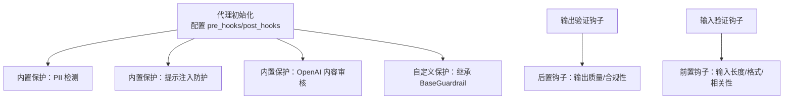
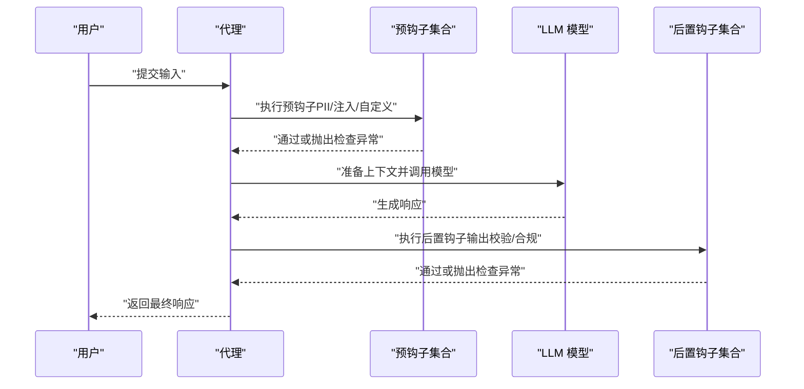
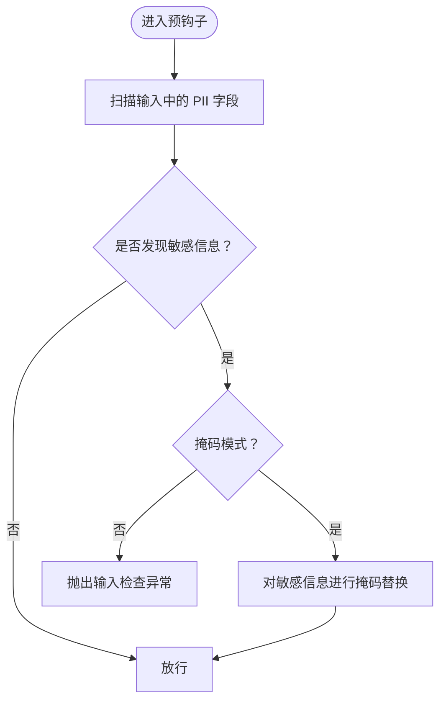
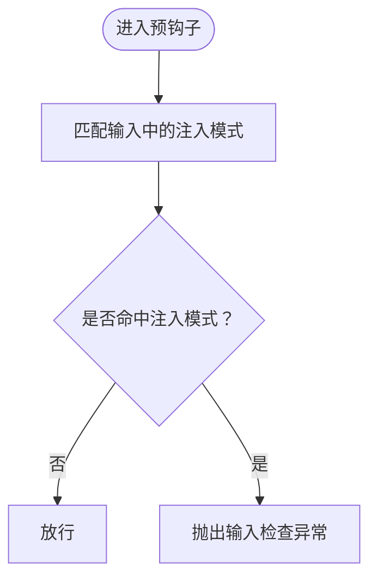
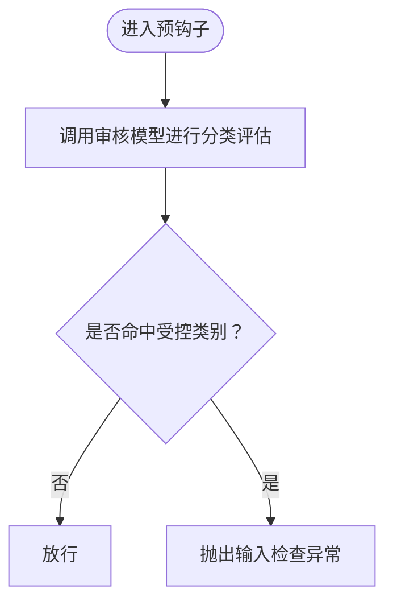
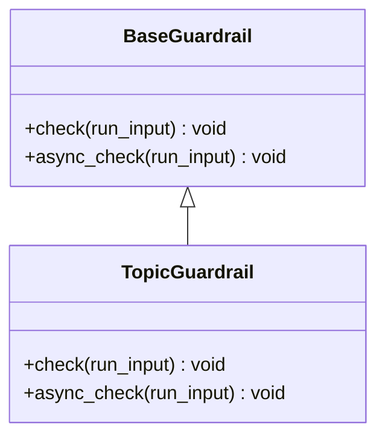
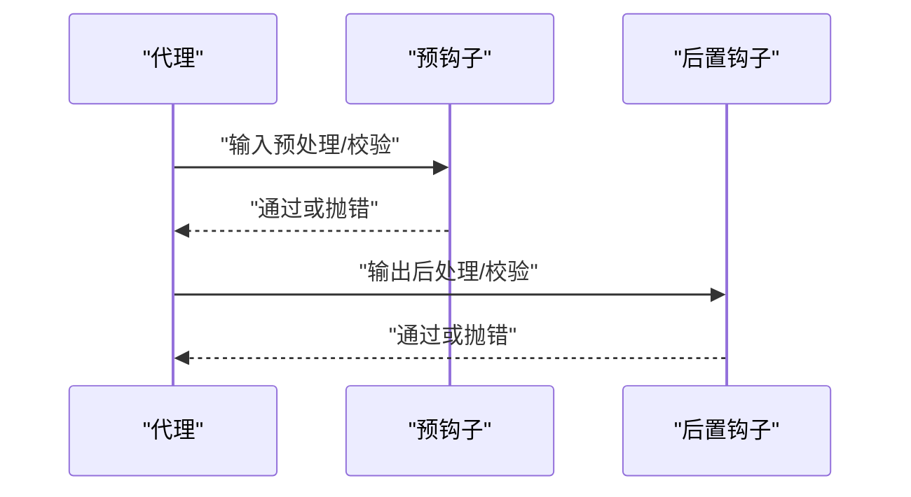
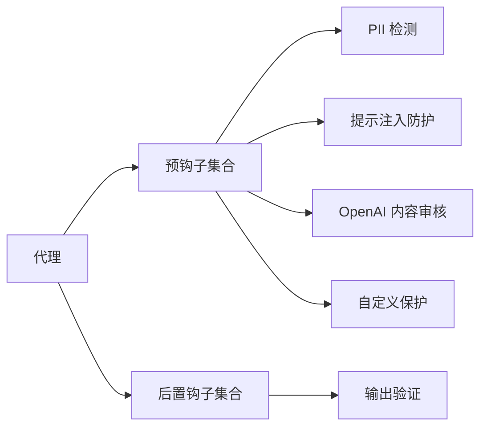

# 代理使用模式

<cite>
**本文引用的文件**
- [基础保护类（BaseGuardrail）](file://reference/hooks/base-guardrail.mdx)
- [预钩子与后置钩子总览](file://hooks/overview.mdx)
- [OpenAI 内容审核保护](file://guardrails/included/openai-moderation.mdx)
- [PII 检测保护](file://guardrails/included/pii.mdx)
- [提示注入防护保护](file://guardrails/included/prompt-injection.mdx)
- [自定义保护示例](file://examples/agents/guardrails/custom-guardrail.mdx)
- [代理内置保护用法：PII 检测](file://guardrails/usage/agent/pii-detection.mdx)
- [团队内置保护用法：PII 检测](file://guardrails/usage/team/pii-detection.mdx)
- [代理内置保护用法：OpenAI 内容审核](file://guardrails/usage/agent/openai-moderation.mdx)
- [团队内置保护用法：OpenAI 内容审核](file://guardrails/usage/team/openai-moderation.mdx)
- [代理内置保护用法：提示注入](file://guardrails/usage/agent/prompt-injection.mdx)
- [工作流内置保护用法：提示注入](file://examples/workflows/advanced-concepts/guardrails/prompt-injection.mdx)
- [输出验证后置钩子示例（代理）](file://examples/agents/hooks/post-hook-output.mdx)
- [输出验证后置钩子示例（团队）](file://examples/teams/hooks/post-hook-output.mdx)
- [输入验证前置钩子示例（代理）](file://examples/agents/hooks/pre-hook-input.mdx)
- [AgentOS 配置项概览](file://agent-os/overview.mdx)
</cite>

## 目录
1. [简介](#简介)
2. [项目结构](#项目结构)
3. [核心组件](#核心组件)
4. [架构总览](#架构总览)
5. [详细组件分析](#详细组件分析)
6. [依赖关系分析](#依赖关系分析)
7. [性能考量](#性能考量)
8. [故障排除指南](#故障排除指南)
9. [结论](#结论)
10. [附录](#附录)

## 简介
本文件面向“代理使用模式”的保护功能应用，聚焦于在单个代理实例中配置与使用各类保护能力，包括：
- OpenAI 内容审核
- PII 数据检测
- 提示注入防护

文档提供如何在代理初始化时添加保护钩子、配置不同保护级别与敏感度、区分同步与异步检查的使用场景与性能影响，并给出针对客户服务、教育问答、内容审核等业务场景的最佳实践，以及常见问题的排查建议。

## 项目结构
围绕保护功能的关键文档分布如下：
- 保护类与钩子机制：hooks/overview.mdx、reference/hooks/base-guardrail.mdx
- 内置保护：guardrails/included/*.mdx
- 使用示例：guardrails/usage/*/ 与 examples/agents/guardrails/*
- 输出/输入验证钩子：examples/agents/hooks/* 与 examples/teams/hooks/*
- AgentOS 背景任务与运行参数：agent-os/overview.mdx

**章节来源**
- [预钩子与后置钩子总览:1-217](file://hooks/overview.mdx#L1-L217)
- [基础保护类（BaseGuardrail）:1-25](file://reference/hooks/base-guardrail.mdx#L1-L25)

## 核心组件
- 钩子生命周期与触发点
  - 预钩子（pre-hooks）：在会话加载后、模型上下文准备前执行，适合输入校验、安全拦截与数据预处理。
  - 后置钩子（post-hooks）：在响应生成后、返回用户前执行，适合输出过滤、合规检查与结果增强。
- 基础保护类（BaseGuardrail）
  - 提供同步检查方法与异步检查方法，用于实现自定义或内置保护逻辑。
- 内置保护
  - PII 检测：可选择字段类型、自定义正则扩展、掩码策略。
  - 提示注入防护：默认注入模式列表，支持自定义覆盖。
  - OpenAI 内容审核：可指定审核模型与分类维度。

**章节来源**
- [预钩子与后置钩子总览:25-101](file://hooks/overview.mdx#L25-L101)
- [预钩子与后置钩子总览:104-167](file://hooks/overview.mdx#L104-L167)
- [基础保护类（BaseGuardrail）:8-25](file://reference/hooks/base-guardrail.mdx#L8-L25)

## 架构总览
下图展示了代理在一次运行中的保护流程：输入进入后先经过预钩子（含内置与自定义保护），再进行模型推理；模型输出后再经由后置钩子进行二次把关。

**图表来源**
- [预钩子与后置钩子总览:25-101](file://hooks/overview.mdx#L25-L101)
- [预钩子与后置钩子总览:104-167](file://hooks/overview.mdx#L104-L167)

## 详细组件分析

### PII 数据检测保护
- 功能要点
  - 默认检测字段：社会安全号码、信用卡号、邮箱、电话等。
  - 可禁用默认字段或新增自定义正则模式。
  - 支持“掩码”模式：将敏感信息替换为掩码字符，而非直接阻断。
- 初始化与配置
  - 在代理构造函数中通过 pre_hooks 传入 PIIDetectionGuardrail 实例。
  - 可通过参数启用/禁用特定字段与掩码策略。
- 使用示例路径
  - 代理用法：[PII 检测（代理）:32-142](file://guardrails/usage/agent/pii-detection.mdx#L32-L142)
  - 团队用法：[PII 检测（团队）:94-171](file://guardrails/usage/team/pii-detection.mdx#L94-L171)
  - 内置说明：[PII 检测保护:1-78](file://guardrails/included/pii.mdx#L1-L78)

**图表来源**
- [PII 检测保护:60-73](file://guardrails/included/pii.mdx#L60-L73)
- [代理内置保护用法：PII 检测:32-142](file://guardrails/usage/agent/pii-detection.mdx#L32-L142)

**章节来源**
- [PII 检测保护:1-78](file://guardrails/included/pii.mdx#L1-L78)
- [代理内置保护用法：PII 检测:32-142](file://guardrails/usage/agent/pii-detection.mdx#L32-L142)
- [团队内置保护用法：PII 检测:94-171](file://guardrails/usage/team/pii-detection.mdx#L94-L171)

### 提示注入防护
- 功能要点
  - 默认注入模式关键词列表，覆盖绕过指令、系统提示、越狱等常见模式。
  - 支持自定义注入模式列表以适配业务场景。
- 初始化与配置
  - 在代理构造函数中通过 pre_hooks 传入 PromptInjectionGuardrail 实例。
- 使用示例路径
  - 代理用法：[提示注入（代理）:1-65](file://guardrails/usage/agent/prompt-injection.mdx#L1-L65)
  - 工作流用法：[提示注入（工作流）:121-165](file://examples/workflows/advanced-concepts/guardrails/prompt-injection.mdx#L121-L165)
  - 内置说明：[提示注入防护保护:1-65](file://guardrails/included/prompt-injection.mdx#L1-L65)

**图表来源**
- [提示注入防护保护:29-60](file://guardrails/included/prompt-injection.mdx#L29-L60)
- [代理内置保护用法：提示注入:1-65](file://guardrails/usage/agent/prompt-injection.mdx#L1-L65)

**章节来源**
- [提示注入防护保护:1-65](file://guardrails/included/prompt-injection.mdx#L1-L65)
- [代理内置保护用法：提示注入:1-65](file://guardrails/usage/agent/prompt-injection.mdx#L1-L65)
- [工作流内置保护用法：提示注入:121-165](file://examples/workflows/advanced-concepts/guardrails/prompt-injection.mdx#L121-L165)

### OpenAI 内容审核保护
- 功能要点
  - 使用 OpenAI 的内容审核模型对输入进行政策违规检测。
  - 可指定审核模型与审核类别（如暴力、仇恨等）。
- 初始化与配置
  - 在代理构造函数中通过 pre_hooks 传入 OpenAIModerationGuardrail 实例。
- 使用示例路径
  - 代理用法：[OpenAI 内容审核（代理）:35-98](file://guardrails/usage/agent/openai-moderation.mdx#L35-L98)
  - 团队用法：[OpenAI 内容审核（团队）:39-69](file://guardrails/usage/team/openai-moderation.mdx#L39-L69)
  - 内置说明：[OpenAI 内容审核保护:1-63](file://guardrails/included/openai-moderation.mdx#L1-L63)

**图表来源**
- [OpenAI 内容审核保护:31-56](file://guardrails/included/openai-moderation.mdx#L31-L56)
- [代理内置保护用法：OpenAI 内容审核:35-98](file://guardrails/usage/agent/openai-moderation.mdx#L35-L98)

**章节来源**
- [OpenAI 内容审核保护:1-63](file://guardrails/included/openai-moderation.mdx#L1-L63)
- [代理内置保护用法：OpenAI 内容审核:35-98](file://guardrails/usage/agent/openai-moderation.mdx#L35-L98)
- [团队内置保护用法：OpenAI 内容审核:39-69](file://guardrails/usage/team/openai-moderation.mdx#L39-L69)

### 自定义保护钩子
- 设计思路
  - 继承 BaseGuardrail 并实现同步与异步检查方法。
  - 在 check/async_check 中编写业务规则，必要时抛出 InputCheckError 或 OutputCheckError。
- 示例路径
  - [自定义保护示例:21-44](file://examples/agents/guardrails/custom-guardrail.mdx#L21-L44)
  - [基础保护类（BaseGuardrail）:8-25](file://reference/hooks/base-guardrail.mdx#L8-L25)

**图表来源**
- [自定义保护示例:21-44](file://examples/agents/guardrails/custom-guardrail.mdx#L21-L44)
- [基础保护类（BaseGuardrail）:8-25](file://reference/hooks/base-guardrail.mdx#L8-L25)

**章节来源**
- [自定义保护示例:1-67](file://examples/agents/guardrails/custom-guardrail.mdx#L1-L67)
- [基础保护类（BaseGuardrail）:1-25](file://reference/hooks/base-guardrail.mdx#L1-L25)

### 输入/输出验证钩子
- 输入验证（预钩子）
  - 可基于长度、相关性、安全性等规则进行拦截。
  - 示例路径：[输入验证前置钩子示例（代理）:66-90](file://examples/agents/hooks/pre-hook-input.mdx#L66-L90)
- 输出验证（后置钩子）
  - 可基于完整性、专业性、安全性与置信度评分进行二次把关。
  - 示例路径：[输出验证后置钩子示例（代理）:52-126](file://examples/agents/hooks/post-hook-output.mdx#L52-L126)、[团队版本:51-125](file://examples/teams/hooks/post-hook-output.mdx#L51-L125)

**图表来源**
- [预钩子与后置钩子总览:25-101](file://hooks/overview.mdx#L25-L101)
- [预钩子与后置钩子总览:104-167](file://hooks/overview.mdx#L104-L167)

**章节来源**
- [输入验证前置钩子示例（代理）:66-90](file://examples/agents/hooks/pre-hook-input.mdx#L66-L90)
- [输出验证后置钩子示例（代理）:52-126](file://examples/agents/hooks/post-hook-output.mdx#L52-L126)
- [输出验证后置钩子示例（团队）:51-125](file://examples/teams/hooks/post-hook-output.mdx#L51-L125)

## 依赖关系分析
- 组件耦合
  - 代理通过 pre_hooks 与 post_hooks 与保护逻辑解耦，便于按需组合。
  - 自定义保护类依赖 BaseGuardrail 接口，保证统一的同步/异步检查契约。
- 外部依赖
  - OpenAI 审核服务（用于内容审核保护）
  - 正则表达式与字符串匹配（用于 PII 与注入模式）

**图表来源**
- [预钩子与后置钩子总览:25-101](file://hooks/overview.mdx#L25-L101)
- [预钩子与后置钩子总览:104-167](file://hooks/overview.mdx#L104-L167)

**章节来源**
- [预钩子与后置钩子总览:1-217](file://hooks/overview.mdx#L1-L217)

## 性能考量
- 同步 vs 异步检查
  - 同步检查：在代理运行期间阻塞直至完成，适合强一致性与低延迟要求的场景。
  - 异步检查：可在 API 上下文中非阻塞执行，但需注意与 AgentOS 的背景任务配置配合。
- 背景执行
  - 可通过 @hook(run_in_background=True) 将非关键任务放入后台，避免阻塞响应。
  - 注意：背景模式不适用于需要修改输入/输出的保护钩子。
- AgentOS 运行参数
  - run_hooks_in_background 控制是否在 AgentOS 中后台执行钩子。
- 参考路径
  - [预钩子与后置钩子总览（背景执行说明）:175-210](file://hooks/overview.mdx#L175-L210)
  - [AgentOS 配置项概览:39-47](file://agent-os/overview.mdx#L39-L47)

**章节来源**
- [预钩子与后置钩子总览:175-210](file://hooks/overview.mdx#L175-L210)
- [AgentOS 配置项概览:39-47](file://agent-os/overview.mdx#L39-L47)

## 故障排除指南
- 常见问题与对策
  - 误报（正常请求被阻断）
    - PII：调整掩码策略或放宽字段检测；确认输入格式是否触发默认模式。
    - 注入：自定义注入模式列表，仅保留业务必需的严格规则。
    - 审核：缩小审核类别范围，或切换审核模型。
  - 漏报（违规请求未被拦截）
    - 扩展自定义保护规则，增加正则或关键词覆盖。
    - 对输出补充后置钩子，确保最终响应合规。
  - 性能退化
    - 将非关键钩子改为后台执行；减少复杂正则匹配；合并多个钩子逻辑。
- 错误类型与触发条件
  - InputCheckError：输入阶段被拦截（如 PII、注入、审核命中）。
  - OutputCheckError：输出阶段被拦截（如内容不完整、不专业、不安全）。
- 参考路径
  - [输出验证后置钩子示例（代理）:52-126](file://examples/agents/hooks/post-hook-output.mdx#L52-L126)
  - [输出验证后置钩子示例（团队）:51-125](file://examples/teams/hooks/post-hook-output.mdx#L51-L125)
  - [输入验证前置钩子示例（代理）:66-90](file://examples/agents/hooks/pre-hook-input.mdx#L66-L90)

**章节来源**
- [输出验证后置钩子示例（代理）:52-126](file://examples/agents/hooks/post-hook-output.mdx#L52-L126)
- [输出验证后置钩子示例（团队）:51-125](file://examples/teams/hooks/post-hook-output.mdx#L51-L125)
- [输入验证前置钩子示例（代理）:66-90](file://examples/agents/hooks/pre-hook-input.mdx#L66-L90)

## 结论
通过在代理初始化时合理配置预/后置钩子，结合内置保护与自定义规则，可以构建多层次、可扩展且高性能的安全防护体系。根据业务场景选择合适的保护级别与敏感度，并利用同步/异步与后台执行策略平衡安全与性能，是保障代理稳定运行的关键。

## 附录

### 业务场景最佳实践
- 客户服务代理
  - 必备：PII 检测（掩码优先）、提示注入防护、输出验证（专业性与完整性）。
  - 可选：OpenAI 内容审核（限制不当话题）。
- 教育问答代理
  - 必备：提示注入防护、输出验证（知识性与准确性）。
  - 可选：PII 检测（若涉及学生信息）。
- 内容审核代理
  - 必备：OpenAI 内容审核（严格类别）、提示注入防护。
  - 可选：PII 检测（若输入包含敏感标识符）。

### 初始化与配置清单（路径指引）
- PII 检测
  - [代理用法:32-142](file://guardrails/usage/agent/pii-detection.mdx#L32-L142)
  - [团队用法:94-171](file://guardrails/usage/team/pii-detection.mdx#L94-L171)
  - [内置说明:1-78](file://guardrails/included/pii.mdx#L1-L78)
- 提示注入
  - [代理用法:1-65](file://guardrails/usage/agent/prompt-injection.mdx#L1-L65)
  - [工作流用法:121-165](file://examples/workflows/advanced-concepts/guardrails/prompt-injection.mdx#L121-L165)
  - [内置说明:1-65](file://guardrails/included/prompt-injection.mdx#L1-L65)
- OpenAI 内容审核
  - [代理用法:35-98](file://guardrails/usage/agent/openai-moderation.mdx#L35-L98)
  - [团队用法:39-69](file://guardrails/usage/team/openai-moderation.mdx#L39-L69)
  - [内置说明:1-63](file://guardrails/included/openai-moderation.mdx#L1-L63)
- 自定义保护
  - [示例:21-44](file://examples/agents/guardrails/custom-guardrail.mdx#L21-L44)
  - [基础类:8-25](file://reference/hooks/base-guardrail.mdx#L8-L25)