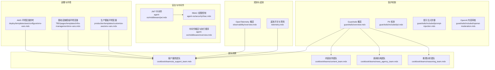
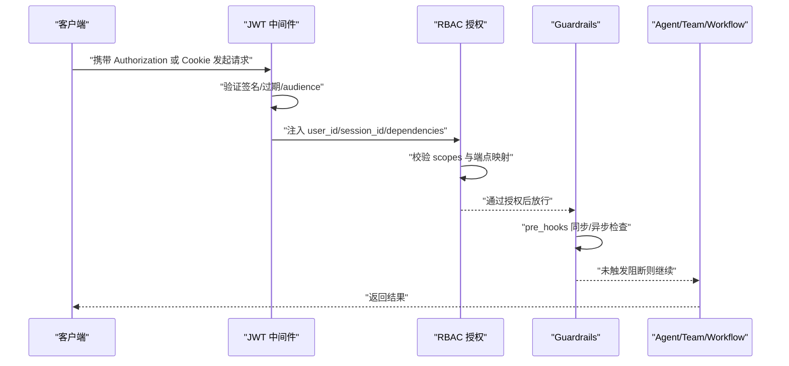
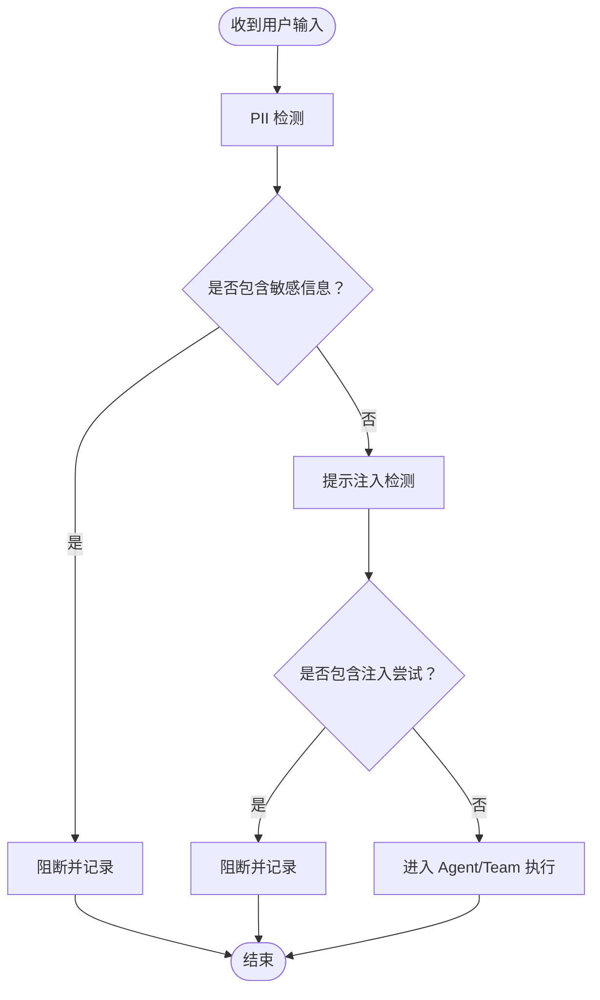
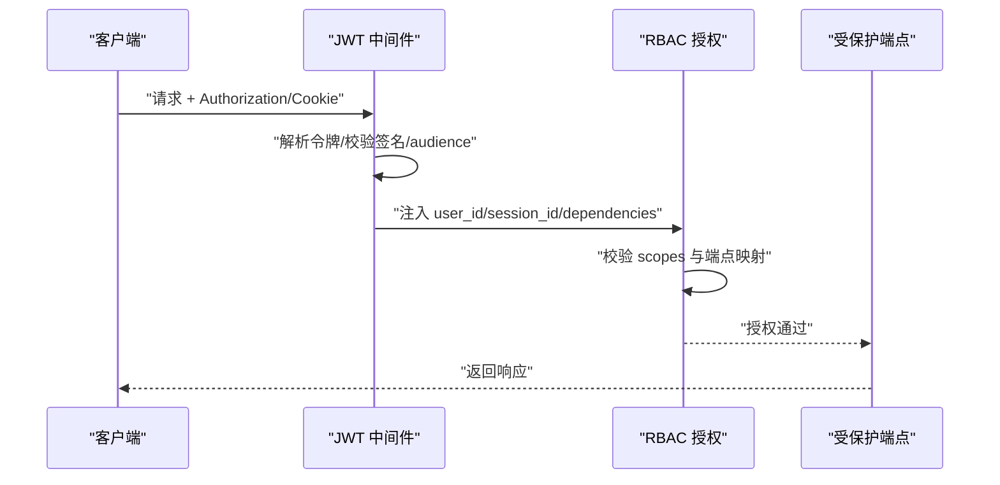
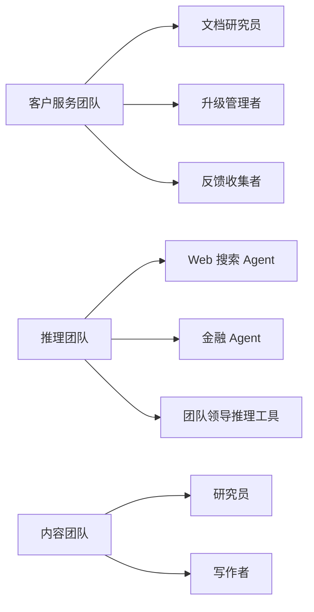
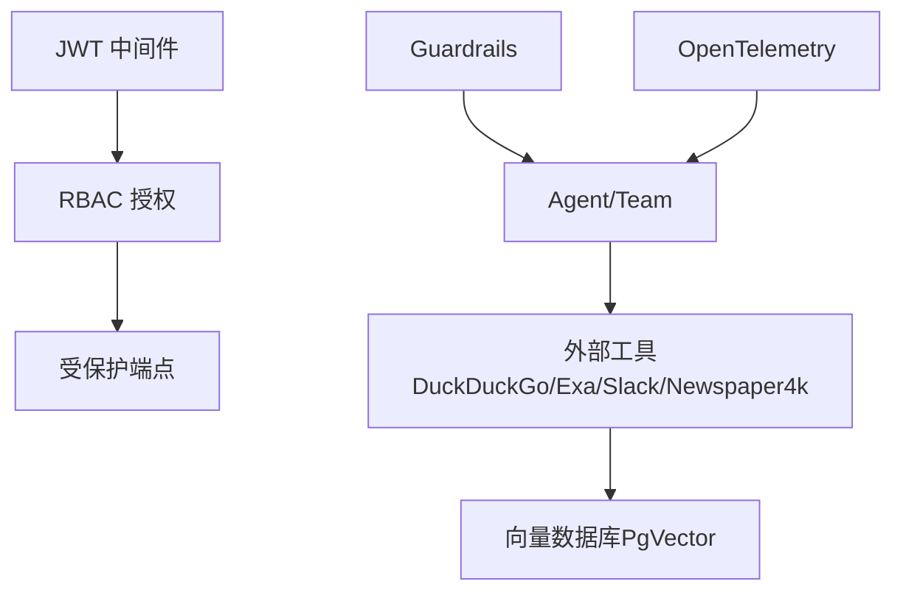

# 使用模式

<cite>
**本文引用的文件**
- [guardrails/overview.mdx](file://guardrails/overview.mdx)
- [guardrails/included/pii.mdx](file://guardrails/included/pii.mdx)
- [guardrails/included/prompt-injection.mdx](file://guardrails/included/prompt-injection.mdx)
- [guardrails/included/openai-moderation.mdx](file://guardrails/included/openai-moderation.mdx)
- [guardrails/usage/agent/agent-with-guardrails.mdx](file://guardrails/usage/agent/agent-with-guardrails.mdx)
- [guardrails/usage/team/team-with-guardrails.mdx](file://guardrails/usage/team/team-with-guardrails.mdx)
- [agent-os/security/overview.mdx](file://agent-os/security/overview.mdx)
- [agent-os/security/rbac.mdx](file://agent-os/security/rbac.mdx)
- [agent-os/middleware/jwt.mdx](file://agent-os/middleware/jwt.mdx)
- [agent-os/middleware/overview.mdx](file://agent-os/middleware/overview.mdx)
- [cookbook/teams/ai_support_team.mdx](file://cookbook/teams/ai_support_team.mdx)
- [cookbook/teams/content_team.mdx](file://cookbook/teams/content_team.mdx)
- [cookbook/teams/reasoning_team.mdx](file://cookbook/teams/reasoning_team.mdx)
- [cookbook/teams/news_agency_team.mdx](file://cookbook/teams/news_agency_team.mdx)
- [faq/rbac-auth-failed.mdx](file://faq/rbac-auth-failed.mdx)
- [examples/agent-os/rbac/symmetric/with-cookie.mdx](file://examples/agent-os/rbac/symmetric/with-cookie.mdx)
- [examples/agent-os/rbac/symmetric/advanced-scopes.mdx](file://examples/agent-os/rbac/symmetric/advanced-scopes.mdx)
- [examples/agents/guardrails/custom-guardrail.mdx](file://examples/agents/guardrails/custom-guardrail.mdx)
- [examples/workflows/advanced-concepts/guardrails/prompt-injection.mdx](file://examples/workflows/advanced-concepts/guardrails/prompt-injection.mdx)
- [examples/workflows/advanced-concepts/structured-io/structured-io-function.mdx](file://examples/workflows/advanced-concepts/structured-io/structured-io-function.mdx)
- [examples/workflows/advanced-concepts/history/history-in-function.mdx](file://examples/workflows/advanced-concepts/history/history-in-function.mdx)
- [examples/models/meta/llama-openai/metrics.mdx](file://examples/models/meta/llama-openai/metrics.mdx)
- [examples/models/meta/llama/metrics.mdx](file://examples/models/meta/llama/metrics.mdx)
- [observability/overview.mdx](file://observability/overview.mdx)
- [telemetry.mdx](file://telemetry.mdx)
- [deploy/templates/aws/configure/env-vars.mdx](file://deploy/templates/aws/configure/env-vars.mdx)
- [TBD/pages/templates/infra-management/env-vars.mdx](file://TBD/pages/templates/infra-management/env-vars.mdx)
- [production/templates/customize-aws/env-vars.mdx](file://production/templates/customize-aws/env-vars.mdx)
</cite>

## 目录
1. [简介](#简介)
2. [项目结构](#项目结构)
3. [核心组件](#核心组件)
4. [架构总览](#架构总览)
5. [详细组件分析](#详细组件分析)
6. [依赖关系分析](#依赖关系分析)
7. [性能考量](#性能考量)
8. [故障排除指南](#故障排除指南)
9. [结论](#结论)
10. [附录](#附录)

## 简介
本技术文档聚焦于系统“使用模式”，围绕代理与团队在不同业务场景下的保护策略与配置方法展开，涵盖以下关键主题：
- 客户服务代理（AI Support Team）：路由分类、知识检索、外部工具集成与反馈收集。
- 数据分析团队（Reasoning Team）：透明推理、多数据源协同与结构化输出。
- 内容创作团队（Content Team / News Agency Team）：研究-写作-编辑协作流程。
- 安全与合规：输入保护（Guardrails）、身份认证与授权（RBAC/JWT）、速率限制与日志记录。
- 多层保护架构设计与优先级管理、不同部署环境（开发/测试/生产）最佳实践、性能监控与日志记录、常见问题排查与误报处理。

## 项目结构
本仓库以“概念+用法+示例”三层组织，安全与保护相关内容主要分布在以下区域：
- 安全与中间件：agent-os/security、agent-os/middleware
- 保护机制：guardrails（内置与自定义）
- 团队用例：cookbook/teams 下的多个实战团队
- 部署与环境变量：deploy/templates、TBD/pages/templates、production/templates
- 观测性与遥测：observability、telemetry
- 故障排除：faq

**图表来源**
- [agent-os/middleware/jwt.mdx](file://agent-os/middleware/jwt.mdx)
- [agent-os/security/rbac.mdx](file://agent-os/security/rbac.mdx)
- [agent-os/middleware/overview.mdx](file://agent-os/middleware/overview.mdx)
- [guardrails/overview.mdx](file://guardrails/overview.mdx)
- [guardrails/included/pii.mdx](file://guardrails/included/pii.mdx)
- [guardrails/included/prompt-injection.mdx](file://guardrails/included/prompt-injection.mdx)
- [guardrails/included/openai-moderation.mdx](file://guardrails/included/openai-moderation.mdx)
- [cookbook/teams/ai_support_team.mdx](file://cookbook/teams/ai_support_team.mdx)
- [cookbook/teams/content_team.mdx](file://cookbook/teams/content_team.mdx)
- [cookbook/teams/news_agency_team.mdx](file://cookbook/teams/news_agency_team.mdx)
- [cookbook/teams/reasoning_team.mdx](file://cookbook/teams/reasoning_team.mdx)
- [deploy/templates/aws/configure/env-vars.mdx](file://deploy/templates/aws/configure/env-vars.mdx)
- [TBD/pages/templates/infra-management/env-vars.mdx](file://TBD/pages/templates/infra-management/env-vars.mdx)
- [production/templates/customize-aws/env-vars.mdx](file://production/templates/customize-aws/env-vars.mdx)
- [observability/overview.mdx](file://observability/overview.mdx)
- [telemetry.mdx](file://telemetry.mdx)

**章节来源**
- [agent-os/security/overview.mdx](file://agent-os/security/overview.mdx)
- [agent-os/security/rbac.mdx](file://agent-os/security/rbac.mdx)
- [agent-os/middleware/jwt.mdx](file://agent-os/middleware/jwt.mdx)
- [agent-os/middleware/overview.mdx](file://agent-os/middleware/overview.mdx)
- [guardrails/overview.mdx](file://guardrails/overview.mdx)
- [cookbook/teams/ai_support_team.mdx](file://cookbook/teams/ai_support_team.mdx)
- [cookbook/teams/content_team.mdx](file://cookbook/teams/content_team.mdx)
- [cookbook/teams/news_agency_team.mdx](file://cookbook/teams/news_agency_team.mdx)
- [cookbook/teams/reasoning_team.mdx](file://cookbook/teams/reasoning_team.mdx)
- [deploy/templates/aws/configure/env-vars.mdx](file://deploy/templates/aws/configure/env-vars.mdx)
- [TBD/pages/templates/infra-management/env-vars.mdx](file://TBD/pages/templates/infra-management/env-vars.mdx)
- [production/templates/customize-aws/env-vars.mdx](file://production/templates/customize-aws/env-vars.mdx)
- [observability/overview.mdx](file://observability/overview.mdx)
- [telemetry.mdx](file://telemetry.mdx)

## 核心组件
- 输入保护（Guardrails）
  - 内置保护：PII 检测、提示注入防御、OpenAI 内容审核。
  - 自定义保护：基于 BaseGuardrail 扩展，实现业务特定的输入校验。
  - 应用位置：Agent/Team 的 pre_hooks，运行前拦截与阻断。
- 身份认证与授权（RBAC/JWT）
  - JWT 中间件：从请求头或 Cookie 提取令牌，参数注入（user_id、session_id、dependencies），可选 RBAC 授权。
  - RBAC：按资源与动作的层级作用域（如 agents:read、agents:my-agent:run、agent_os:admin），默认映射到各端点。
- 中间件与执行顺序
  - 中间件按添加顺序逆序执行；速率限制与日志中间件可作为通用保护层。
- 团队协作与工作流
  - 客户服务团队：智能路由、知识检索、外部工具（Slack）集成。
  - 数据分析团队：透明推理、多数据源整合、结构化输出。
  - 内容创作团队：研究-写作-编辑流水线，支持 Markdown 与调试模式。

**章节来源**
- [guardrails/overview.mdx](file://guardrails/overview.mdx)
- [guardrails/included/pii.mdx](file://guardrails/included/pii.mdx)
- [guardrails/included/prompt-injection.mdx](file://guardrails/included/prompt-injection.mdx)
- [guardrails/included/openai-moderation.mdx](file://guardrails/included/openai-moderation.mdx)
- [agent-os/middleware/jwt.mdx](file://agent-os/middleware/jwt.mdx)
- [agent-os/security/rbac.mdx](file://agent-os/security/rbac.mdx)
- [agent-os/middleware/overview.mdx](file://agent-os/middleware/overview.mdx)
- [cookbook/teams/ai_support_team.mdx](file://cookbook/teams/ai_support_team.mdx)
- [cookbook/teams/reasoning_team.mdx](file://cookbook/teams/reasoning_team.mdx)
- [cookbook/teams/content_team.mdx](file://cookbook/teams/content_team.mdx)
- [cookbook/teams/news_agency_team.mdx](file://cookbook/teams/news_agency_team.mdx)

## 架构总览
下图展示了“多层保护”的典型交互：客户端请求首先进入 JWT 中间件进行认证与参数注入，随后进入 RBAC 授权检查，再由 Guardrails 对输入进行保护性校验，最后到达业务端点（Agent/Team/Workflow）。

**图表来源**
- [agent-os/middleware/jwt.mdx](file://agent-os/middleware/jwt.mdx)
- [agent-os/security/rbac.mdx](file://agent-os/security/rbac.mdx)
- [guardrails/overview.mdx](file://guardrails/overview.mdx)

## 详细组件分析

### 组件一：输入保护（Guardrails）与使用模式
- 客户服务代理
  - 场景要点：路由分类、知识检索、外部工具（Slack）集成、反馈收集。
  - 保护策略：在 Agent/Team 的 pre_hooks 中启用 PII 检测与提示注入防御，避免泄露敏感信息与对抗性输入。
  - 示例路径：[客户服务团队示例](file://cookbook/teams/ai_support_team.mdx)，[Agent Guardrails 使用](file://guardrails/usage/agent/agent-with-guardrails.mdx)
- 数据分析团队
  - 场景要点：透明推理、多数据源（Web/金融）协同、结构化输出。
  - 保护策略：结合 Guardrails 阻断异常输入，确保推理过程可审计；必要时对输出进行结构化约束。
  - 示例路径：[推理团队示例](file://cookbook/teams/reasoning_team.mdx)，[结构化输出模型](file://examples/workflows/advanced-concepts/structured-io/structured-io-function.mdx)
- 内容创作团队
  - 场景要点：研究-写作-编辑流水线，Markdown 输出与调试模式。
  - 保护策略：在团队层面统一启用 Guardrails，防止不当内容与外部链接注入。
  - 示例路径：[内容团队示例](file://cookbook/teams/content_team.mdx)，[新闻机构团队示例](file://cookbook/teams/news_agency_team.mdx)

**图表来源**
- [guardrails/included/pii.mdx](file://guardrails/included/pii.mdx)
- [guardrails/included/prompt-injection.mdx](file://guardrails/included/prompt-injection.mdx)
- [guardrails/overview.mdx](file://guardrails/overview.mdx)

**章节来源**
- [cookbook/teams/ai_support_team.mdx](file://cookbook/teams/ai_support_team.mdx)
- [cookbook/teams/reasoning_team.mdx](file://cookbook/teams/reasoning_team.mdx)
- [cookbook/teams/content_team.mdx](file://cookbook/teams/content_team.mdx)
- [cookbook/teams/news_agency_team.mdx](file://cookbook/teams/news_agency_team.mdx)
- [guardrails/overview.mdx](file://guardrails/overview.mdx)
- [guardrails/included/pii.mdx](file://guardrails/included/pii.mdx)
- [guardrails/included/prompt-injection.mdx](file://guardrails/included/prompt-injection.mdx)
- [guardrails/included/openai-moderation.mdx](file://guardrails/included/openai-moderation.mdx)
- [guardrails/usage/agent/agent-with-guardrails.mdx](file://guardrails/usage/agent/agent-with-guardrails.mdx)
- [guardrails/usage/team/team-with-guardrails.mdx](file://guardrails/usage/team/team-with-guardrails.mdx)

### 组件二：身份认证与授权（RBAC/JWT）
- JWT 中间件
  - 支持从 Authorization 头或 Cookie 提取令牌，自动注入 user_id、session_id、dependencies。
  - 可配置算法（RS256/HS256）、JWKS 文件、audience 验证、排除路由等。
- RBAC 授权
  - 层级作用域格式：resource:action、resource:<id>:action、resource:*:action、agent_os:admin。
  - 默认端点映射覆盖 agents、teams、workflows、sessions、memories、knowledge、metrics、evals 等。
- 执行顺序
  - 中间件逆序执行，建议将 JWT/RBAC 放在更靠近路由的前置位置，保证后续中间件能正确获取注入参数。

**图表来源**
- [agent-os/middleware/jwt.mdx](file://agent-os/middleware/jwt.mdx)
- [agent-os/security/rbac.mdx](file://agent-os/security/rbac.mdx)
- [agent-os/middleware/overview.mdx](file://agent-os/middleware/overview.mdx)

**章节来源**
- [agent-os/middleware/jwt.mdx](file://agent-os/middleware/jwt.mdx)
- [agent-os/security/rbac.mdx](file://agent-os/security/rbac.mdx)
- [agent-os/middleware/overview.mdx](file://agent-os/middleware/overview.mdx)

### 组件三：中间件与执行顺序（速率限制与日志）
- 速率限制中间件：限制每分钟请求数，防止滥用。
- 日志中间件：记录请求耗时、状态码与关键上下文，便于审计与排障。
- 执行顺序：中间件逆序执行，最后一个添加的中间件最先执行。建议将日志中间件置于最外层，速率限制居中，JWT/RBAC 在内侧。

**章节来源**
- [agent-os/middleware/overview.mdx](file://agent-os/middleware/overview.mdx)

### 组件四：团队协作与工作流（客户服务/数据分析/内容创作）
- 客户服务代理（AI Support Team）
  - 路由分类：问题/缺陷/反馈三类，分别转至文档研究员、升级管理者、反馈收集者。
  - 知识检索：PgVector 向量数据库 + 网站阅读器索引文档。
  - 外部集成：Slack 工具用于升级与反馈。
  - 示例路径：[客户服务团队示例](file://cookbook/teams/ai_support_team.mdx)
- 数据分析团队（Reasoning Team）
  - 透明推理：ReasoningTools 展示思考过程，委托 Web 搜索与金融数据工具。
  - 结构化输出：表格与来源标注，便于审计与复核。
  - 示例路径：[推理团队示例](file://cookbook/teams/reasoning_team.mdx)，[结构化输出模型](file://examples/workflows/advanced-concepts/structured-io/structured-io-function.mdx)
- 内容创作团队（Content Team / News Agency Team）
  - 研究-写作-编辑流水线：搜索引擎 Agent + 写作 Agent + 编辑 Team。
  - Markdown 输出与调试模式，便于观察成员响应与协作过程。
  - 示例路径：[内容团队示例](file://cookbook/teams/content_team.mdx)，[新闻机构团队示例](file://cookbook/teams/news_agency_team.mdx)

**图表来源**
- [cookbook/teams/ai_support_team.mdx](file://cookbook/teams/ai_support_team.mdx)
- [cookbook/teams/reasoning_team.mdx](file://cookbook/teams/reasoning_team.mdx)
- [cookbook/teams/content_team.mdx](file://cookbook/teams/content_team.mdx)
- [cookbook/teams/news_agency_team.mdx](file://cookbook/teams/news_agency_team.mdx)

**章节来源**
- [cookbook/teams/ai_support_team.mdx](file://cookbook/teams/ai_support_team.mdx)
- [cookbook/teams/reasoning_team.mdx](file://cookbook/teams/reasoning_team.mdx)
- [cookbook/teams/content_team.mdx](file://cookbook/teams/content_team.mdx)
- [cookbook/teams/news_agency_team.mdx](file://cookbook/teams/news_agency_team.mdx)

## 依赖关系分析
- 组件耦合
  - Guardrails 与 Agent/Team 强耦合（pre_hooks），与业务逻辑解耦但影响输入质量。
  - JWT/RBAC 与中间件层耦合，对所有端点生效，需与端点映射保持一致。
  - 团队协作与工作流依赖工具链（DuckDuckGo、Exa、Slack、Newspaper4k 等），需注意外部依赖的可用性与配额。
- 外部依赖与集成
  - 向量数据库（PgVector）与知识库检索，需关注向量化与查询性能。
  - OpenTelemetry 兼容后端（Langfuse、Arize Phoenix 等）用于分布式追踪与可观测性。

**图表来源**
- [guardrails/overview.mdx](file://guardrails/overview.mdx)
- [agent-os/middleware/jwt.mdx](file://agent-os/middleware/jwt.mdx)
- [agent-os/security/rbac.mdx](file://agent-os/security/rbac.mdx)
- [cookbook/teams/ai_support_team.mdx](file://cookbook/teams/ai_support_team.mdx)
- [cookbook/teams/reasoning_team.mdx](file://cookbook/teams/reasoning_team.mdx)
- [observability/overview.mdx](file://observability/overview.mdx)

**章节来源**
- [guardrails/overview.mdx](file://guardrails/overview.mdx)
- [agent-os/middleware/jwt.mdx](file://agent-os/middleware/jwt.mdx)
- [agent-os/security/rbac.mdx](file://agent-os/security/rbac.mdx)
- [cookbook/teams/ai_support_team.mdx](file://cookbook/teams/ai_support_team.mdx)
- [cookbook/teams/reasoning_team.mdx](file://cookbook/teams/reasoning_team.mdx)
- [observability/overview.mdx](file://observability/overview.mdx)

## 性能考量
- Guardrails
  - 同步/异步检查：根据运行方式自动选择，避免阻塞主流程；复杂规则建议异步实现。
  - 缓存与预热：对频繁调用的外部工具（如 DuckDuckGo/Exa）设置缓存策略，减少重复开销。
- 中间件
  - 速率限制：按端点粒度配置，避免热点接口被滥用。
  - 日志采样：生产环境建议降低日志频率或采用采样策略，避免 I/O 压力。
- 团队与工作流
  - 并行与串行：合理安排任务并行度，避免共享资源争用。
  - 向量检索优化：索引分片、批量插入与查询批量化，提升检索吞吐。
- 观测性
  - OpenTelemetry 自动注入与灵活导出，便于跨服务追踪与性能分析。
  - 遥测开关：按实例维度关闭遥测，减少生产环境开销。

[本节为通用指导，不直接分析具体文件]

## 故障排除指南
- RBAC 认证失败
  - 现象：同时启用安全密钥与授权时出现“授权失败”。
  - 解决方案：根据版本选择关闭授权或切换到 JWT 验证，并清理旧的安全密钥环境变量。
  - 参考路径：[RBAC 认证失败 FAQ](file://faq/rbac-auth-failed.mdx)
- JWT 令牌问题
  - 症状：401 未授权或 403 禁止访问。
  - 排查：确认令牌签名算法、公钥/私钥配置、audience 是否匹配、scopes 是否满足端点要求。
  - 参考路径：[JWT 中间件](file://agent-os/middleware/jwt.mdx)，[RBAC 权限控制](file://agent-os/security/rbac.mdx)
- Guardrails 误报
  - 症状：正常输入被阻断。
  - 处理：调整 Guardrails 规则阈值或白名单；必要时临时禁用特定规则进行回归定位。
  - 参考路径：[自定义 Guardrail 示例](file://examples/agents/guardrails/custom-guardrail.mdx)，[提示注入测试](file://examples/workflows/advanced-concepts/guardrails/prompt-injection.mdx)
- 中间件顺序导致的问题
  - 症状：参数注入缺失或授权失败。
  - 处理：检查中间件添加顺序，确保 JWT/RBAC 在内侧，日志/速率限制在外侧。
  - 参考路径：[中间件概览](file://agent-os/middleware/overview.mdx)

**章节来源**
- [faq/rbac-auth-failed.mdx](file://faq/rbac-auth-failed.mdx)
- [agent-os/middleware/jwt.mdx](file://agent-os/middleware/jwt.mdx)
- [agent-os/security/rbac.mdx](file://agent-os/security/rbac.mdx)
- [examples/agents/guardrails/custom-guardrail.mdx](file://examples/agents/guardrails/custom-guardrail.mdx)
- [examples/workflows/advanced-concepts/guardrails/prompt-injection.mdx](file://examples/workflows/advanced-concepts/guardrails/prompt-injection.mdx)
- [agent-os/middleware/overview.mdx](file://agent-os/middleware/overview.mdx)

## 结论
通过将 Guardrails、JWT/RBAC、中间件与团队协作模式有机结合，可在不同业务场景下构建稳健的“多层保护架构”。建议：
- 在开发/测试环境适度放宽保护强度，快速迭代；在生产环境严格启用 JWT/RBAC 与 Guardrails，并开启速率限制与日志记录。
- 针对客户服务、数据分析、内容创作三类团队，分别制定输入保护策略与权限边界，确保最小权限原则与可审计性。
- 利用 OpenTelemetry 与遥测持续监控保护效果，及时发现异常与误报，动态调整保护强度与响应策略。

[本节为总结性内容，不直接分析具体文件]

## 附录

### 不同部署环境的最佳实践
- 开发环境
  - 环境变量：本地开发使用 WAIT_FOR_DB/MIGRATE_DB 等变量，便于快速启动。
  - 参考路径：[开发环境变量](file://TBD/pages/templates/infra-management/env-vars.mdx)，[AWS 环境变量参考](file://deploy/templates/aws/configure/env-vars.mdx)
- 测试环境
  - 环境变量：与生产隔离，启用基础速率限制与日志记录。
  - 参考路径：[基础设施模板环境变量](file://TBD/pages/templates/infra-management/env-vars.mdx)
- 生产环境
  - 环境变量：通过 Secrets Manager 注入敏感信息，禁用自动迁移，启用 JWT 验证与 RBAC。
  - 参考路径：[生产模板环境变量](file://production/templates/customize-aws/env-vars.mdx)

**章节来源**
- [TBD/pages/templates/infra-management/env-vars.mdx](file://TBD/pages/templates/infra-management/env-vars.mdx)
- [deploy/templates/aws/configure/env-vars.mdx](file://deploy/templates/aws/configure/env-vars.mdx)
- [production/templates/customize-aws/env-vars.mdx](file://production/templates/customize-aws/env-vars.mdx)

### 性能监控与日志记录
- 观测性
  - OpenTelemetry 支持多种后端，便于统一追踪与可视化。
  - 参考路径：[OpenTelemetry 概览](file://observability/overview.mdx)
- 遥测
  - 可按实例关闭遥测，减少生产环境开销。
  - 参考路径：[遥测开关与禁用](file://telemetry.mdx)
- 指标采集
  - Agent/Team 运行指标可通过会话与运行接口获取，辅助性能评估。
  - 参考路径：[指标示例（Llama）](file://examples/models/meta/llama/metrics.mdx)，[指标示例（Llama OpenAI）](file://examples/models/meta/llama-openai/metrics.mdx)

**章节来源**
- [observability/overview.mdx](file://observability/overview.mdx)
- [telemetry.mdx](file://telemetry.mdx)
- [examples/models/meta/llama/metrics.mdx](file://examples/models/meta/llama/metrics.mdx)
- [examples/models/meta/llama-openai/metrics.mdx](file://examples/models/meta/llama-openai/metrics.mdx)

### 多层保护架构设计与优先级管理
- 设计原则
  - 最小权限：仅授予完成任务所需的最小 scopes。
  - 分层防护：输入保护（Guardrails）在前，身份与授权（JWT/RBAC）在中，中间件（速率限制/日志）在后。
  - 可观测性：全程记录关键事件，便于审计与回溯。
- 优先级建议
  - JWT/RBAC 优先于安全密钥；Guardrails 优先于业务执行；日志/速率限制次之。

**章节来源**
- [agent-os/security/overview.mdx](file://agent-os/security/overview.mdx)
- [agent-os/security/rbac.mdx](file://agent-os/security/rbac.mdx)
- [agent-os/middleware/jwt.mdx](file://agent-os/middleware/jwt.mdx)
- [agent-os/middleware/overview.mdx](file://agent-os/middleware/overview.mdx)
- [guardrails/overview.mdx](file://guardrails/overview.mdx)