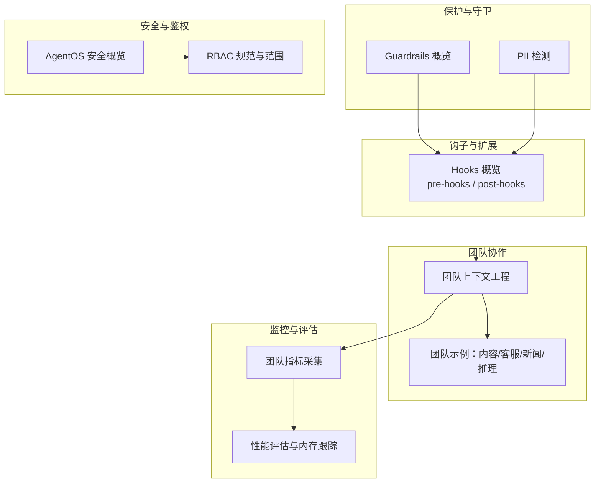
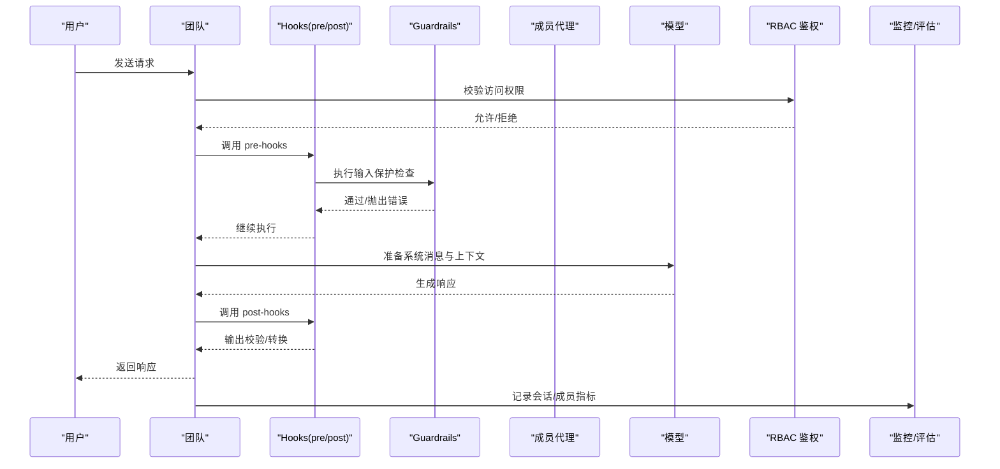
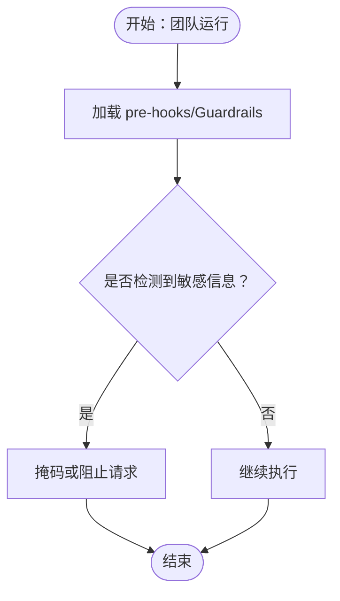
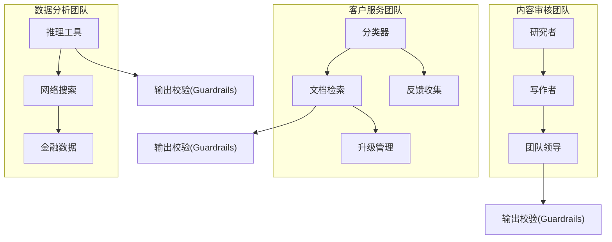
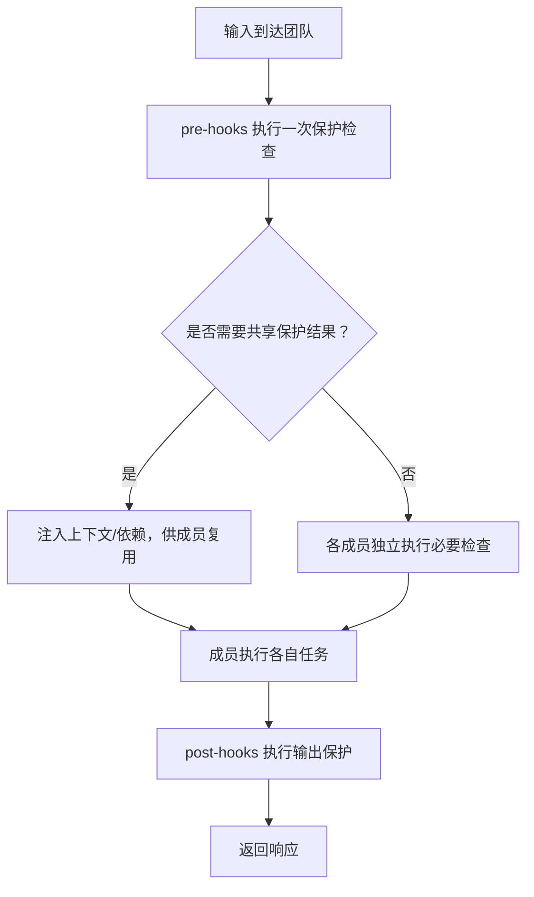
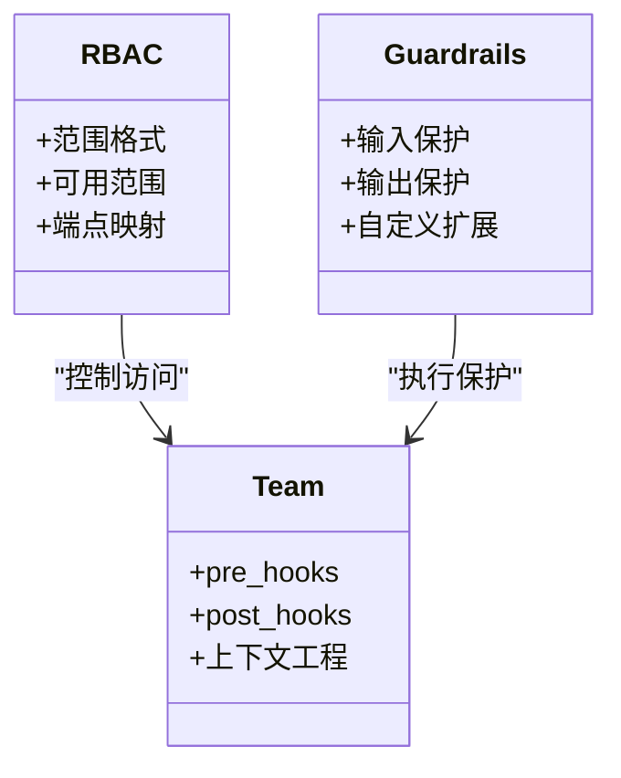
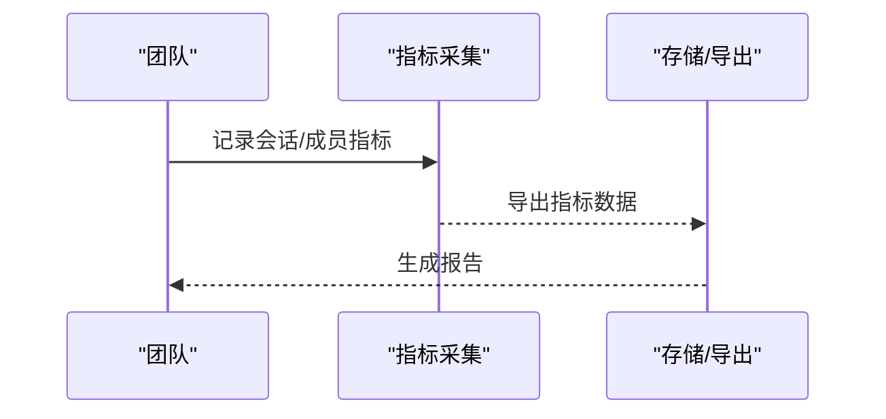
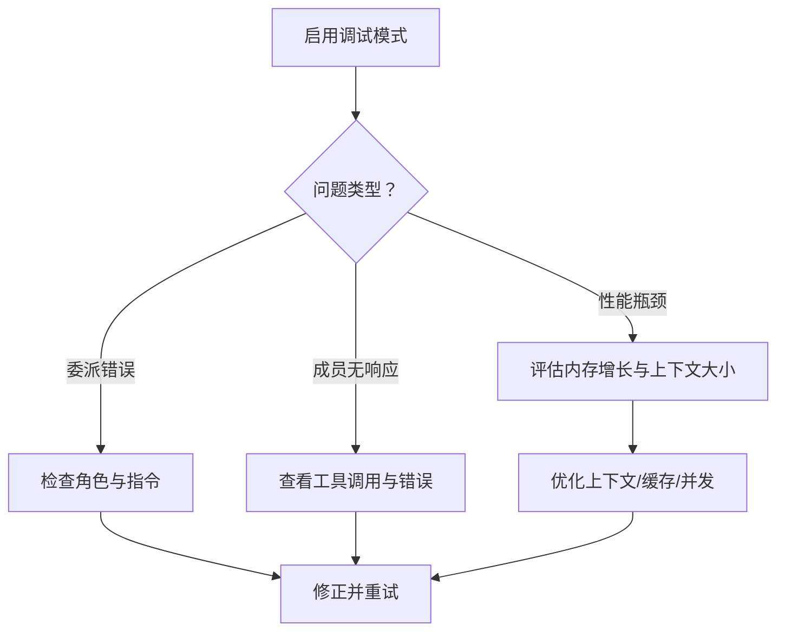
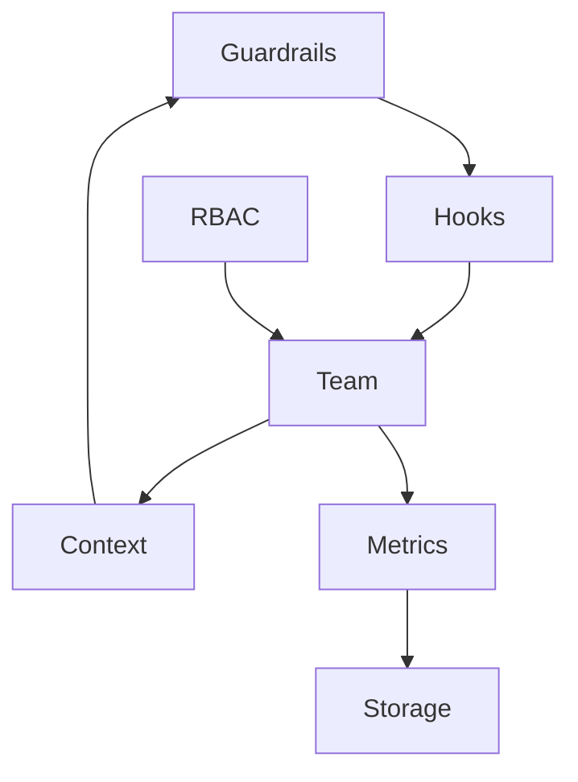

# 团队使用模式

<cite>
**本文引用的文件**
- [guardrails/overview.mdx](file://guardrails/overview.mdx)
- [guardrails/included/pii.mdx](file://guardrails/included/pii.mdx)
- [hooks/overview.mdx](file://hooks/overview.mdx)
- [agent-os/security/overview.mdx](file://agent-os/security/overview.mdx)
- [agent-os/security/rbac.mdx](file://agent-os/security/rbac.mdx)
- [cookbook/teams/content_team.mdx](file://cookbook/teams/content_team.mdx)
- [cookbook/teams/ai_support_team.mdx](file://cookbook/teams/ai_support_team.mdx)
- [cookbook/teams/news_agency_team.mdx](file://cookbook/teams/news_agency_team.mdx)
- [cookbook/teams/reasoning_team.mdx](file://cookbook/teams/reasoning_team.mdx)
- [context/team/overview.mdx](file://context/team/overview.mdx)
- [sessions/metrics/usage/team-metrics.mdx](file://sessions/metrics/usage/team-metrics.mdx)
- [examples/teams/metrics/team-metrics.mdx](file://examples/teams/metrics/team-metrics.mdx)
- [teams/debugging-teams.mdx](file://teams/debugging-teams.mdx)
- [examples/teams/hooks/post-hook-output.mdx](file://examples/teams/hooks/post-hook-output.mdx)
- [evals/performance/usage/performance-team-with-memory.mdx](file://evals/performance/usage/performance-team-with-memory.mdx)
- [examples/evals/performance/team-response-with-memory-simple.mdx](file://examples/evals/performance/team-response-with-memory-simple.mdx)
- [examples/evals/performance/team-response-with-memory-multi-user.mdx](file://examples/evals/performance/team-response-with-memory-multi-user.mdx)
</cite>

## 目录
1. [简介](#简介)
2. [项目结构](#项目结构)
3. [核心组件](#核心组件)
4. [架构总览](#架构总览)
5. [详细组件分析](#详细组件分析)
6. [依赖关系分析](#依赖关系分析)
7. [性能考量](#性能考量)
8. [故障排除指南](#故障排除指南)
9. [结论](#结论)
10. [附录](#附录)

## 简介
本文件面向在多代理团队环境中使用 Agno 的团队与管理员，系统化阐述如何在团队层面统一管理与配置保护功能（Guardrails），包括团队级策略制定、分级保护强度、跨成员保护信息共享、避免重复检查与性能瓶颈、监控与审计、以及大规模团队的故障排除与性能优化。文档以仓库中的 Guardrails、Hooks、RBAC、团队协作示例与监控评估文档为基础，结合团队上下文工程与运行时指标，给出可落地的实践路径。

## 项目结构
围绕“团队使用模式”的保护能力，相关知识分布在以下模块：
- 保护与守卫（Guardrails）：内置 PII 检测、提示注入防御、OpenAI 内容政策检测等，通过 pre-hooks 在输入阶段执行。
- 钩子（Hooks）：pre-hooks 与 post-hooks 提供输入/输出校验、数据预处理/后处理、日志与审计等扩展点。
- 安全与鉴权（RBAC）：基于 JWT 的细粒度授权，支持资源作用域与端点权限控制。
- 团队协作与上下文工程：团队指令、成员角色、工具集成、历史与依赖注入、思考过程可见性等。
- 监控与评估：会话指标采集、团队消息与成员指标分析、性能评估与内存增长跟踪。

**图表来源**
- [guardrails/overview.mdx](file://guardrails/overview.mdx)
- [hooks/overview.mdx](file://hooks/overview.mdx)
- [agent-os/security/overview.mdx](file://agent-os/security/overview.mdx)
- [agent-os/security/rbac.mdx](file://agent-os/security/rbac.mdx)
- [context/team/overview.mdx](file://context/team/overview.mdx)
- [cookbook/teams/content_team.mdx](file://cookbook/teams/content_team.mdx)
- [cookbook/teams/ai_support_team.mdx](file://cookbook/teams/ai_support_team.mdx)
- [cookbook/teams/news_agency_team.mdx](file://cookbook/teams/news_agency_team.mdx)
- [cookbook/teams/reasoning_team.mdx](file://cookbook/teams/reasoning_team.mdx)
- [sessions/metrics/usage/team-metrics.mdx](file://sessions/metrics/usage/team-metrics.mdx)
- [evals/performance/usage/performance-team-with-memory.mdx](file://evals/performance/usage/performance-team-with-memory.mdx)

**章节来源**
- [guardrails/overview.mdx](file://guardrails/overview.mdx)
- [hooks/overview.mdx](file://hooks/overview.mdx)
- [agent-os/security/overview.mdx](file://agent-os/security/overview.mdx)
- [agent-os/security/rbac.mdx](file://agent-os/security/rbac.mdx)
- [context/team/overview.mdx](file://context/team/overview.mdx)
- [cookbook/teams/content_team.mdx](file://cookbook/teams/content_team.mdx)
- [cookbook/teams/ai_support_team.mdx](file://cookbook/teams/ai_support_team.mdx)
- [cookbook/teams/news_agency_team.mdx](file://cookbook/teams/news_agency_team.mdx)
- [cookbook/teams/reasoning_team.mdx](file://cookbook/teams/reasoning_team.mdx)
- [sessions/metrics/usage/team-metrics.mdx](file://sessions/metrics/usage/team-metrics.mdx)
- [evals/performance/usage/performance-team-with-memory.mdx](file://evals/performance/usage/performance-team-with-memory.mdx)

## 核心组件
- 输入保护（Pre-guardrails）
  - 通过 pre-hooks 在模型调用前执行，典型包括 PII 检测、提示注入防御、内容政策过滤等。
  - 支持同步与异步检查，自动根据 run 方式选择。
- 输出保护（Post-guardrails）
  - 在响应生成后、返回前进行输出校验或转换，确保合规与质量。
- RBAC 授权
  - 基于 JWT 的细粒度授权，支持资源:动作与通配符范围，端点访问控制。
- 团队上下文与协作
  - 系统消息、用户消息、历史、附加输入、成员工具与依赖注入，支持透明思考与任务委派。
- 监控与评估
  - 会话级指标、成员消息指标、聚合指标；性能评估与内存增长跟踪。

**章节来源**
- [guardrails/overview.mdx](file://guardrails/overview.mdx)
- [hooks/overview.mdx](file://hooks/overview.mdx)
- [agent-os/security/overview.mdx](file://agent-os/security/overview.mdx)
- [agent-os/security/rbac.mdx](file://agent-os/security/rbac.mdx)
- [context/team/overview.mdx](file://context/team/overview.mdx)
- [sessions/metrics/usage/team-metrics.mdx](file://sessions/metrics/usage/team-metrics.mdx)
- [evals/performance/usage/performance-team-with-memory.mdx](file://evals/performance/usage/performance-team-with-memory.mdx)

## 架构总览
下图展示了团队运行时中“保护”与“协作”的关键交互：输入经由 pre-hooks 执行保护检查，再进入团队协调与成员执行；输出经由 post-hooks 进行二次保护与后处理；RBAC 控制访问；监控与评估贯穿全流程。

**图表来源**
- [hooks/overview.mdx](file://hooks/overview.mdx)
- [guardrails/overview.mdx](file://guardrails/overview.mdx)
- [agent-os/security/overview.mdx](file://agent-os/security/overview.mdx)
- [context/team/overview.mdx](file://context/team/overview.mdx)
- [sessions/metrics/usage/team-metrics.mdx](file://sessions/metrics/usage/team-metrics.mdx)

## 详细组件分析

### 组件一：团队级保护策略与实施
- 策略制定
  - 在团队构造时通过 pre_hooks 注入 Guardrails，实现团队级统一保护。
  - 可按需启用 PII 检测、提示注入防御、内容政策过滤等。
- 实施要点
  - 同步/异步检查自动适配，避免阻塞主流程。
  - 对敏感输入可选择直接拦截或脱敏掩码，兼顾合规与可用性。
- 示例参考
  - PII 检测 Guardrail 的基本用法与字段配置、自定义字段与掩码策略。

**图表来源**
- [guardrails/overview.mdx](file://guardrails/overview.mdx)
- [guardrails/included/pii.mdx](file://guardrails/included/pii.mdx)

**章节来源**
- [guardrails/overview.mdx](file://guardrails/overview.mdx)
- [guardrails/included/pii.mdx](file://guardrails/included/pii.mdx)

### 组件二：团队协作场景下的保护架构设计
- 内容审核团队
  - 使用协调模式，成员分别负责研究与写作，团队领导整合输出。
  - 在团队层面对输入进行 Guardrails，确保不携带敏感信息。
- 客户服务团队
  - 智能路由：根据问题类型分发至文档检索、问题升级或反馈收集。
  - 在路由与处理环节均执行 Guardrails，保障外部系统（如 Slack）交互的安全性。
- 数据分析团队
  - 结合知识库与外部工具，进行透明推理与结果呈现。
  - 在检索与合成阶段引入 Guardrails，防止泄露与不当输出。

**图表来源**
- [cookbook/teams/content_team.mdx](file://cookbook/teams/content_team.mdx)
- [cookbook/teams/ai_support_team.mdx](file://cookbook/teams/ai_support_team.mdx)
- [cookbook/teams/reasoning_team.mdx](file://cookbook/teams/reasoning_team.mdx)

**章节来源**
- [cookbook/teams/content_team.mdx](file://cookbook/teams/content_team.mdx)
- [cookbook/teams/ai_support_team.mdx](file://cookbook/teams/ai_support_team.mdx)
- [cookbook/teams/reasoning_team.mdx](file://cookbook/teams/reasoning_team.mdx)

### 组件三：保护信息共享与避免重复检查
- 保护信息共享
  - 通过上下文参数与依赖注入，将已验证的保护结果传递给后续成员，减少重复检查。
  - 使用共享成员交互与最大工具调用历史过滤，控制上下文规模与重复计算。
- 性能优化
  - 合理设置上下文大小与历史窗口，避免过度上下文导致 token 消耗与延迟上升。
  - 将静态内容（如成员信息、委派规则）置于可缓存区域，利用模型侧 prompt caching。

**图表来源**
- [context/team/overview.mdx](file://context/team/overview.mdx)
- [hooks/overview.mdx](file://hooks/overview.mdx)

**章节来源**
- [context/team/overview.mdx](file://context/team/overview.mdx)
- [hooks/overview.mdx](file://hooks/overview.mdx)

### 组件四：分级保护与角色权限
- 分级保护
  - 不同角色与权限的成员应用不同强度的保护：高权限管理员可绕过部分限制，普通成员默认严格。
  - 通过 RBAC 范围控制对团队与资源的操作权限，结合 Guardrails 实现最小权限与强约束。
- 权限映射
  - RBAC 范围格式与可用范围参考文档，确保端点访问与资源操作一致。

**图表来源**
- [agent-os/security/rbac.mdx](file://agent-os/security/rbac.mdx)
- [guardrails/overview.mdx](file://guardrails/overview.mdx)
- [context/team/overview.mdx](file://context/team/overview.mdx)

**章节来源**
- [agent-os/security/rbac.mdx](file://agent-os/security/rbac.mdx)
- [guardrails/overview.mdx](file://guardrails/overview.mdx)
- [context/team/overview.mdx](file://context/team/overview.mdx)

### 组件五：监控与审计（日志与报告）
- 指标采集
  - 获取会话级指标、聚合指标与成员消息指标，定位性能瓶颈与异常。
- 报告生成
  - 基于指标与运行输出，生成团队运行报告，辅助审计与合规审查。
- 示例参考
  - 团队指标采集与分析示例，展示如何提取消息与成员指标。

**图表来源**
- [sessions/metrics/usage/team-metrics.mdx](file://sessions/metrics/usage/team-metrics.mdx)
- [examples/teams/metrics/team-metrics.mdx](file://examples/teams/metrics/team-metrics.mdx)

**章节来源**
- [sessions/metrics/usage/team-metrics.mdx](file://sessions/metrics/usage/team-metrics.mdx)
- [examples/teams/metrics/team-metrics.mdx](file://examples/teams/metrics/team-metrics.mdx)

### 组件六：故障排除与性能优化
- 故障排除
  - 启用调试模式，观察委派模式、工具调用、令牌用量与慢执行。
  - 常见问题：成员未响应、错误委派、无限委派循环等。
- 性能优化
  - 使用性能评估工具跟踪内存增长与运行影响，结合上下文工程与历史过滤降低 token 消耗。
  - 多用户场景下的内存分配追踪，识别热点与优化点。

**图表来源**
- [teams/debugging-teams.mdx](file://teams/debugging-teams.mdx)
- [evals/performance/usage/performance-team-with-memory.mdx](file://evals/performance/usage/performance-team-with-memory.mdx)
- [examples/evals/performance/team-response-with-memory-simple.mdx](file://examples/evals/performance/team-response-with-memory-simple.mdx)
- [examples/evals/performance/team-response-with-memory-multi-user.mdx](file://examples/evals/performance/team-response-with-memory-multi-user.mdx)

**章节来源**
- [teams/debugging-teams.mdx](file://teams/debugging-teams.mdx)
- [evals/performance/usage/performance-team-with-memory.mdx](file://evals/performance/usage/performance-team-with-memory.mdx)
- [examples/evals/performance/team-response-with-memory-simple.mdx](file://examples/evals/performance/team-response-with-memory-simple.mdx)
- [examples/evals/performance/team-response-with-memory-multi-user.mdx](file://examples/evals/performance/team-response-with-memory-multi-user.mdx)

## 依赖关系分析
- 组件耦合
  - Guardrails 作为 Hooks 的特化，与 Team 的 pre_hooks/post_hooks 强耦合。
  - RBAC 与 AgentOS 集成，控制 Team 与资源访问。
  - 上下文工程与团队协作紧密关联，影响 Guardrails 的触发频率与效果。
- 外部依赖
  - 模型提供商的 prompt caching 与 token 策略影响上下文大小与成本。
  - 存储与数据库用于会话历史与指标持久化。

**图表来源**
- [hooks/overview.mdx](file://hooks/overview.mdx)
- [guardrails/overview.mdx](file://guardrails/overview.mdx)
- [agent-os/security/overview.mdx](file://agent-os/security/overview.mdx)
- [context/team/overview.mdx](file://context/team/overview.mdx)
- [sessions/metrics/usage/team-metrics.mdx](file://sessions/metrics/usage/team-metrics.mdx)

**章节来源**
- [hooks/overview.mdx](file://hooks/overview.mdx)
- [guardrails/overview.mdx](file://guardrails/overview.mdx)
- [agent-os/security/overview.mdx](file://agent-os/security/overview.mdx)
- [context/team/overview.mdx](file://context/team/overview.mdx)
- [sessions/metrics/usage/team-metrics.mdx](file://sessions/metrics/usage/team-metrics.mdx)

## 性能考量
- 上下文与历史
  - 合理设置历史窗口与工具调用过滤，避免上下文膨胀导致延迟与成本上升。
- 缓存与复用
  - 利用模型侧 prompt caching 与静态内容复用，减少重复 token。
- 并发与异步
  - 在支持异步的团队模式下，成员并发执行可提升吞吐，但需注意 Guardrails 的幂等性与去重。
- 内存与资源
  - 使用性能评估工具跟踪内存增长，识别热点与优化点，避免大规模团队的资源枯竭。

[本节为通用指导，无需特定文件来源]

## 故障排除指南
- 调试模式
  - 在 Team 层面或单次 run 启用调试模式，观察委派、工具调用与指标。
- 常见问题
  - 成员未响应：检查工具可用性与错误日志。
  - 错误委派：明确角色与指令，避免重叠与歧义。
  - 无限委派循环：检查合成逻辑与终止条件。
- 输出保护失败
  - 使用 post-hooks 验证输出质量，必要时调整 Guardrails 规则。

**章节来源**
- [teams/debugging-teams.mdx](file://teams/debugging-teams.mdx)
- [examples/teams/hooks/post-hook-output.mdx](file://examples/teams/hooks/post-hook-output.mdx)

## 结论
通过在团队层面统一部署 Guardrails、合理运用 Hooks、结合 RBAC 实施分级权限，并借助上下文工程与监控评估体系，可以有效实现多代理团队环境下的保护与治理。该方法既保证了安全性与合规性，又兼顾了协作效率与性能表现，适用于内容审核、客户服务、数据分析等多种团队场景。

[本节为总结性内容，无需特定文件来源]

## 附录
- 快速参考
  - Guardrails 基本用法与 PII 掩码策略
  - Hooks 生命周期与参数注入
  - RBAC 范围与端点映射
  - 团队上下文参数与依赖注入
  - 指标采集与性能评估

**章节来源**
- [guardrails/overview.mdx](file://guardrails/overview.mdx)
- [guardrails/included/pii.mdx](file://guardrails/included/pii.mdx)
- [hooks/overview.mdx](file://hooks/overview.mdx)
- [agent-os/security/rbac.mdx](file://agent-os/security/rbac.mdx)
- [context/team/overview.mdx](file://context/team/overview.mdx)
- [sessions/metrics/usage/team-metrics.mdx](file://sessions/metrics/usage/team-metrics.mdx)
- [evals/performance/usage/performance-team-with-memory.mdx](file://evals/performance/usage/performance-team-with-memory.mdx)