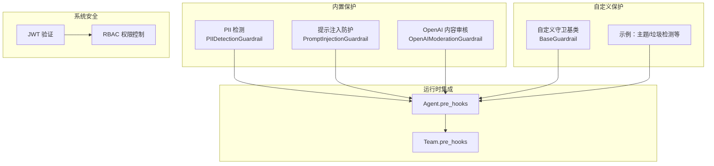
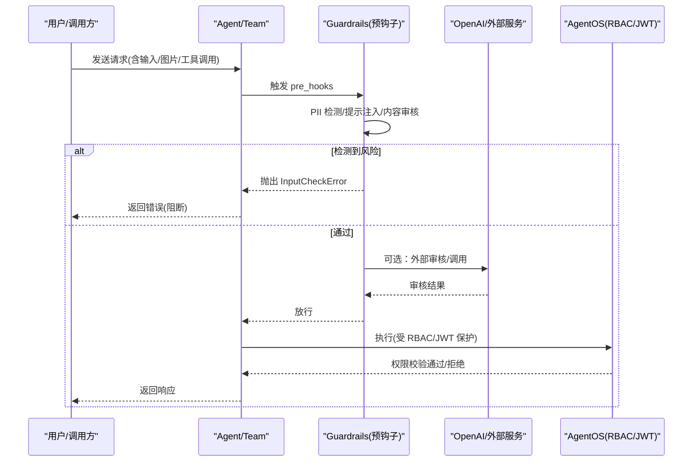
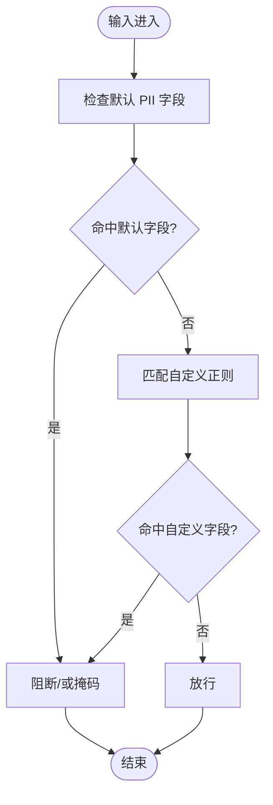
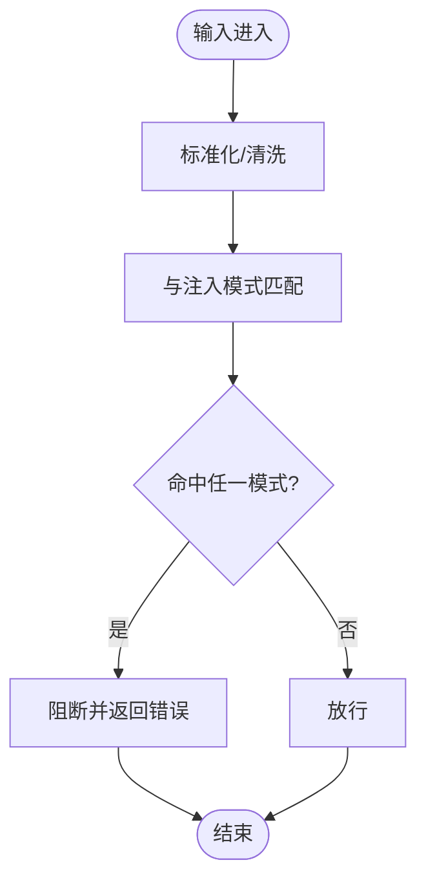
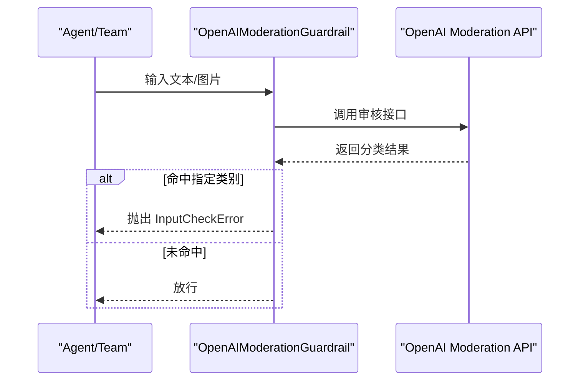
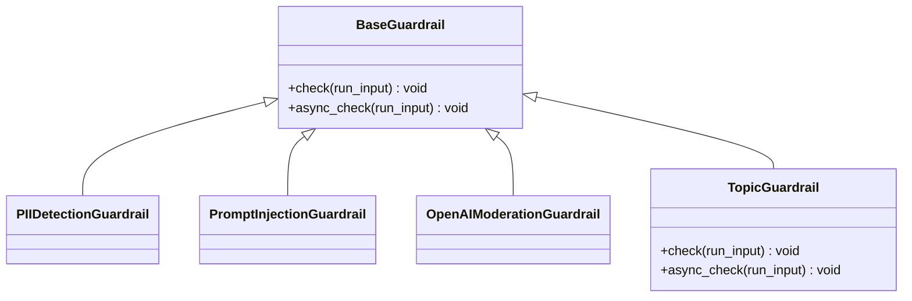
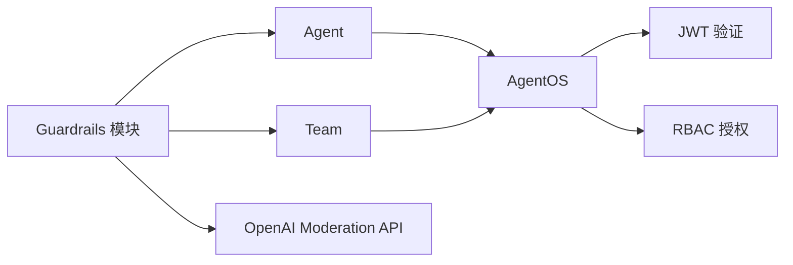

# 保护系统

<cite>
**本文引用的文件**
- [guardrails/overview.mdx](file://guardrails/overview.mdx)
- [guardrails/included/openai-moderation.mdx](file://guardrails/included/openai-moderation.mdx)
- [guardrails/included/pii.mdx](file://guardrails/included/pii.mdx)
- [guardrails/included/prompt-injection.mdx](file://guardrails/included/prompt-injection.mdx)
- [guardrails/usage/agent/pii-detection.mdx](file://guardrails/usage/agent/pii-detection.mdx)
- [guardrails/usage/agent/prompt-injection.mdx](file://guardrails/usage/agent/prompt-injection.mdx)
- [guardrails/usage/agent/openai-moderation.mdx](file://guardrails/usage/agent/openai-moderation.mdx)
- [examples/basics/agent-with-guardrails.mdx](file://examples/basics/agent-with-guardrails.mdx)
- [examples/agents/guardrails/custom-guardrail.mdx](file://examples/agents/guardrails/custom-guardrail.mdx)
- [examples/teams/guardrails/overview.mdx](file://examples/teams/guardrails/overview.mdx)
- [examples/workflows/advanced-concepts/early-stopping/early-stop-condition.mdx](file://examples/workflows/advanced-concepts/early-stopping/early-stop-condition.mdx)
- [agent-os/security/overview.mdx](file://agent-os/security/overview.mdx)
- [agent-os/security/rbac.mdx](file://agent-os/security/rbac.mdx)
- [reference/hooks/base-guardrail.mdx](file://reference/hooks/base-guardrail.mdx)
- [reference/hooks/prompt-injection-guardrail.mdx](file://reference/hooks/prompt-injection-guardrail.mdx)
</cite>

## 目录
1. [简介](#简介)
2. [项目结构](#项目结构)
3. [核心组件](#核心组件)
4. [架构总览](#架构总览)
5. [详细组件分析](#详细组件分析)
6. [依赖关系分析](#依赖关系分析)
7. [性能考量](#性能考量)
8. [故障排查指南](#故障排查指南)
9. [结论](#结论)
10. [附录](#附录)

## 简介
本文件系统化阐述保护系统的理念与实现：围绕内容安全、数据保护与系统安全三大支柱，结合内置保护能力（OpenAI Moderation、PII 检测、提示注入防护）与自定义保护扩展，给出可操作的使用模式、配置方法、性能优化与成本控制策略，并提供跨行业落地的最佳实践与合规建议。

## 项目结构
保护系统主要由“内置保护”“自定义保护”“系统安全（RBAC/JWT）”三部分构成，贯穿 Agent 与 Team 的运行生命周期，通过预钩子（pre_hooks）在输入进入模型前进行拦截与处理。

图示来源
- [guardrails/overview.mdx:33-47](file://guardrails/overview.mdx#L33-L47)
- [guardrails/included/pii.mdx:13-25](file://guardrails/included/pii.mdx#L13-L25)
- [guardrails/included/prompt-injection.mdx:13-27](file://guardrails/included/prompt-injection.mdx#L13-L27)
- [guardrails/included/openai-moderation.mdx:15-29](file://guardrails/included/openai-moderation.mdx#L15-L29)
- [examples/basics/agent-with-guardrails.mdx:98-110](file://examples/basics/agent-with-guardrails.mdx#L98-L110)
- [agent-os/security/rbac.mdx:21-45](file://agent-os/security/rbac.mdx#L21-L45)

章节来源
- [guardrails/overview.mdx:13-31](file://guardrails/overview.mdx#L13-L31)
- [guardrails/included/pii.mdx:13-25](file://guardrails/included/pii.mdx#L13-L25)
- [guardrails/included/prompt-injection.mdx:13-27](file://guardrails/included/prompt-injection.mdx#L13-L27)
- [guardrails/included/openai-moderation.mdx:15-29](file://guardrails/included/openai-moderation.mdx#L15-L29)
- [examples/basics/agent-with-guardrails.mdx:98-110](file://examples/basics/agent-with-guardrails.mdx#L98-L110)
- [agent-os/security/rbac.mdx:21-45](file://agent-os/security/rbac.mdx#L21-L45)

## 核心组件
- 内置保护
  - PII 检测：识别并阻断或掩码敏感信息（如社会安全号、信用卡、邮箱、电话），支持自定义字段与掩码策略。
  - 提示注入防护：基于常见注入模式检测并阻止“越狱/指令覆盖”等攻击尝试。
  - OpenAI 内容审核：依据 OpenAI 审核模型对文本/图像内容进行分类拦截。
- 自定义保护
  - 基于 BaseGuardrail 扩展，实现业务特定的校验逻辑（如主题限制、垃圾检测、速率限制等）。
- 系统安全（AgentOS）
  - JWT 验证与 RBAC 授权，按资源/动作粒度控制访问与执行权限。

章节来源
- [guardrails/included/pii.mdx:27-78](file://guardrails/included/pii.mdx#L27-L78)
- [guardrails/included/prompt-injection.mdx:29-64](file://guardrails/included/prompt-injection.mdx#L29-L64)
- [guardrails/included/openai-moderation.mdx:31-62](file://guardrails/included/openai-moderation.mdx#L31-L62)
- [reference/hooks/base-guardrail.mdx:8-25](file://reference/hooks/base-guardrail.mdx#L8-L25)
- [agent-os/security/rbac.mdx:52-108](file://agent-os/security/rbac.mdx#L52-L108)

## 架构总览
保护系统以“预钩子”为入口，在 Agent/Team 运行前对输入进行多维安全检查；同时通过 RBAC/JWT 在系统层面限制谁可以访问与执行。

图示来源
- [guardrails/overview.mdx:33-47](file://guardrails/overview.mdx#L33-L47)
- [guardrails/included/openai-moderation.mdx:15-29](file://guardrails/included/openai-moderation.mdx#L15-L29)
- [agent-os/security/rbac.mdx:21-45](file://agent-os/security/rbac.mdx#L21-L45)

## 详细组件分析

### PII 检测（PIIDetectionGuardrail）
- 功能要点
  - 默认检测字段：社会安全号、信用卡、邮箱、电话；可按需启用/禁用。
  - 支持自定义正则扩展字段。
  - 支持“掩码”而非“阻断”，便于在合规前提下继续处理。
- 使用模式
  - Agent/Team 的 pre_hooks 中加入该守卫。
  - 示例演示了阻断与掩码两种行为。
- 配置要点
  - 启用/禁用默认字段、添加自定义正则、设置 mask_pii。

图示来源
- [guardrails/included/pii.mdx:27-78](file://guardrails/included/pii.mdx#L27-L78)
- [guardrails/usage/agent/pii-detection.mdx:32-62](file://guardrails/usage/agent/pii-detection.mdx#L32-L62)

章节来源
- [guardrails/included/pii.mdx:27-78](file://guardrails/included/pii.mdx#L27-L78)
- [guardrails/usage/agent/pii-detection.mdx:10-178](file://guardrails/usage/agent/pii-detection.mdx#L10-L178)

### 提示注入防护（PromptInjectionGuardrail）
- 功能要点
  - 基于常见注入模式列表进行检测，覆盖“忽略指令”“越狱”“角色替换”等。
  - 支持自定义注入模式集合。
- 使用模式
  - 在 Agent/Team 的 pre_hooks 中启用，即可拦截典型注入尝试。
- 配置要点
  - 覆盖默认注入模式列表，适配业务场景。

图示来源
- [guardrails/included/prompt-injection.mdx:29-64](file://guardrails/included/prompt-injection.mdx#L29-L64)
- [reference/hooks/prompt-injection-guardrail.mdx:12-32](file://reference/hooks/prompt-injection-guardrail.mdx#L12-L32)
- [guardrails/usage/agent/prompt-injection.mdx:44-90](file://guardrails/usage/agent/prompt-injection.mdx#L44-L90)

章节来源
- [guardrails/included/prompt-injection.mdx:29-64](file://guardrails/included/prompt-injection.mdx#L29-L64)
- [reference/hooks/prompt-injection-guardrail.mdx:12-32](file://reference/hooks/prompt-injection-guardrail.mdx#L12-L32)
- [guardrails/usage/agent/prompt-injection.mdx:10-125](file://guardrails/usage/agent/prompt-injection.mdx#L10-L125)

### OpenAI 内容审核（OpenAIModerationGuardrail）
- 功能要点
  - 使用 OpenAI 的 moderation 模型对文本/图像进行分类审核。
  - 可指定审核类别（如暴力、仇恨），仅对目标类别触发阻断。
  - 支持同步/异步调用。
- 使用模式
  - 在 Agent/Team 的 pre_hooks 中启用，按需限定审核类别。
- 配置要点
  - moderation_model、raise_for_categories。

图示来源
- [guardrails/included/openai-moderation.mdx:15-62](file://guardrails/included/openai-moderation.mdx#L15-L62)
- [guardrails/usage/agent/openai-moderation.mdx:35-110](file://guardrails/usage/agent/openai-moderation.mdx#L35-L110)

章节来源
- [guardrails/included/openai-moderation.mdx:15-62](file://guardrails/included/openai-moderation.mdx#L15-L62)
- [guardrails/usage/agent/openai-moderation.mdx:10-145](file://guardrails/usage/agent/openai-moderation.mdx#L10-L145)

### 自定义保护（BaseGuardrail）
- 设计原则
  - 继承 BaseGuardrail，实现 check()/async_check()，在其中编写业务校验逻辑。
  - 通过 InputCheckError 抛出阻断原因与触发类型。
- 典型场景
  - 主题限制、垃圾检测、输入长度/字符比例限制、语言检测等。
- 使用方式
  - 将自定义守卫加入 Agent/Team 的 pre_hooks 列表。

图示来源
- [reference/hooks/base-guardrail.mdx:8-25](file://reference/hooks/base-guardrail.mdx#L8-L25)
- [examples/basics/agent-with-guardrails.mdx:47-82](file://examples/basics/agent-with-guardrails.mdx#L47-L82)
- [examples/agents/guardrails/custom-guardrail.mdx:21-35](file://examples/agents/guardrails/custom-guardrail.mdx#L21-L35)

章节来源
- [reference/hooks/base-guardrail.mdx:8-25](file://reference/hooks/base-guardrail.mdx#L8-L25)
- [examples/basics/agent-with-guardrails.mdx:47-82](file://examples/basics/agent-with-guardrails.mdx#L47-L82)
- [examples/agents/guardrails/custom-guardrail.mdx:21-35](file://examples/agents/guardrails/custom-guardrail.mdx#L21-L35)

### 使用模式：代理保护 vs 团队保护
- 代理保护
  - 适用于单智能体直接对外交互的场景，强调输入前置校验与快速阻断。
  - 示例：PII 检测、提示注入、OpenAI 审核在 Agent 的 pre_hooks 中统一生效。
- 团队保护
  - 多智能体协作时，可在 Team 层统一接入相同守卫，确保成员间共享输入安全策略。
  - 示例：Team 的 pre_hooks 同样可挂载 PII/注入/审核守卫。

章节来源
- [guardrails/usage/agent/pii-detection.mdx:32-39](file://guardrails/usage/agent/pii-detection.mdx#L32-L39)
- [guardrails/usage/agent/prompt-injection.mdx:24-31](file://guardrails/usage/agent/prompt-injection.mdx#L24-L31)
- [guardrails/usage/agent/openai-moderation.mdx:35-41](file://guardrails/usage/agent/openai-moderation.mdx#L35-L41)
- [examples/teams/guardrails/overview.mdx:6-11](file://examples/teams/guardrails/overview.mdx#L6-L11)

### 工作流中的合规与早期停止
- 在复杂工作流中，可在关键步骤插入合规检查与早期停止逻辑，避免违规内容继续流转。
- 示例：根据关键词触发合规检查步骤，若发现违规则立即停止后续生成。

章节来源
- [examples/workflows/advanced-concepts/early-stopping/early-stop-condition.mdx:45-71](file://examples/workflows/advanced-concepts/early-stopping/early-stop-condition.mdx#L45-L71)

## 依赖关系分析
- 组件耦合
  - Guardrails 作为独立模块，通过 pre_hooks 与 Agent/Team 解耦，便于按需组合。
  - OpenAI 审核依赖外部 API，存在网络与延迟开销。
- 外部依赖
  - OpenAI Moderation API（用于内容审核）。
  - JWT/JWKS（用于 AgentOS 的鉴权与授权）。

图示来源
- [guardrails/overview.mdx:33-47](file://guardrails/overview.mdx#L33-L47)
- [agent-os/security/rbac.mdx:21-45](file://agent-os/security/rbac.mdx#L21-L45)

章节来源
- [guardrails/overview.mdx:33-47](file://guardrails/overview.mdx#L33-L47)
- [agent-os/security/rbac.mdx:21-45](file://agent-os/security/rbac.mdx#L21-L45)

## 性能考量
- 审核成本与延迟
  - OpenAI 审核会引入网络往返与 API 调用成本，建议：
    - 仅对高风险类别启用审核；
    - 对非敏感输入跳过审核；
    - 异步调用（arun）与批量处理时注意并发控制。
- 正则匹配与模式检测
  - PII/注入检测依赖正则与字符串匹配，建议：
    - 合理裁剪默认字段/模式列表，减少匹配开销；
    - 对大文本先做摘要/截断再检测，降低计算量。
- 缓存与复用
  - 对重复输入可做本地缓存（需注意隐私与去标识化）；
  - 复用已验证的安全上下文，减少重复校验。
- 并发与限流
  - 在高并发场景下，配合限流与排队机制，避免审核接口成为瓶颈。

## 故障排查指南
- 常见错误与定位
  - InputCheckError：通常由守卫抛出，包含 message 与 check_trigger，用于区分阻断原因（如 PII、注入、内容违规等）。
  - 401/403：来自 AgentOS 的 JWT/RBAC 校验失败，检查令牌有效性、作用域与端点映射。
- 排查步骤
  - 确认 pre_hooks 是否正确挂载；
  - 检查守卫参数（如 raise_for_categories、injection_patterns、mask_pii）是否符合预期；
  - 核对 JWT 验证密钥、算法与 audience 设置；
  - 查看 RBAC 映射表，确认端点所需 scope。
- 相关参考
  - 错误响应状态码与含义；
  - 守卫方法签名与异常触发。

章节来源
- [agent-os/security/rbac.mdx:367-373](file://agent-os/security/rbac.mdx#L367-L373)
- [reference/hooks/base-guardrail.mdx:8-25](file://reference/hooks/base-guardrail.mdx#L8-L25)

## 结论
保护系统通过“内置守卫 + 自定义扩展 + 系统级 RBAC/JWT”的组合，形成从输入到执行的全链路安全闭环。实践中应根据业务风险选择合适的内置守卫，必要时扩展自定义守卫，并结合 RBAC 控制访问范围，最终在安全与性能之间取得平衡。

## 附录

### 实际配置示例（路径索引）
- PII 检测（Agent）
  - [guardrails/usage/agent/pii-detection.mdx:32-62](file://guardrails/usage/agent/pii-detection.mdx#L32-L62)
- 提示注入（Agent）
  - [guardrails/usage/agent/prompt-injection.mdx:24-31](file://guardrails/usage/agent/prompt-injection.mdx#L24-L31)
- OpenAI 审核（Agent）
  - [guardrails/usage/agent/openai-moderation.mdx:35-41](file://guardrails/usage/agent/openai-moderation.mdx#L35-L41)
- 自定义守卫（Agent）
  - [examples/basics/agent-with-guardrails.mdx:47-82](file://examples/basics/agent-with-guardrails.mdx#L47-L82)
  - [examples/agents/guardrails/custom-guardrail.mdx:21-35](file://examples/agents/guardrails/custom-guardrail.mdx#L21-L35)
- RBAC 快速开始（AgentOS）
  - [agent-os/security/rbac.mdx:21-45](file://agent-os/security/rbac.mdx#L21-L45)

### 最佳实践清单
- 输入前置校验：优先在 pre_hooks 中启用 PII/注入/内容审核守卫。
- 分层治理：对高敏感输入启用更严格策略（如仅审核特定类别）。
- 权限最小化：通过 RBAC 限制端点访问与执行范围。
- 可观测性：记录 check_trigger 与审计日志，便于回溯与改进策略。
- 合规与隐私：遵循行业规范（如金融/医疗），对个人数据进行去标识化或掩码处理。