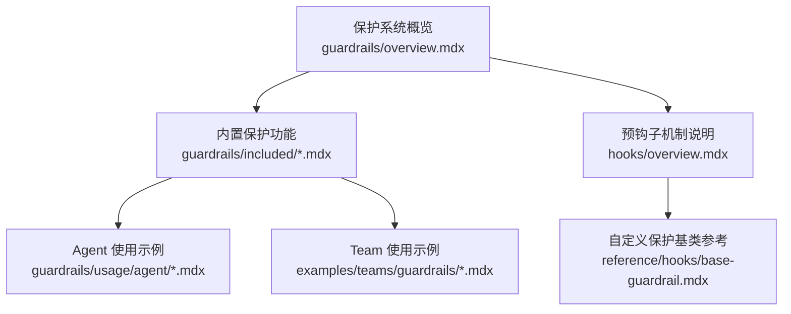
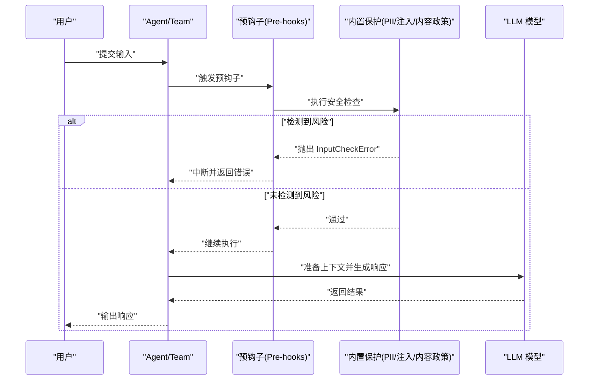
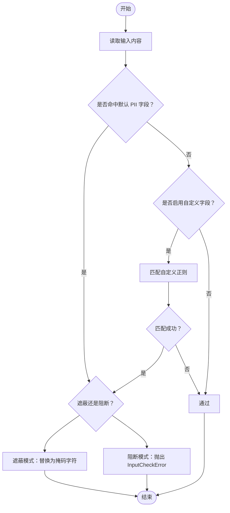
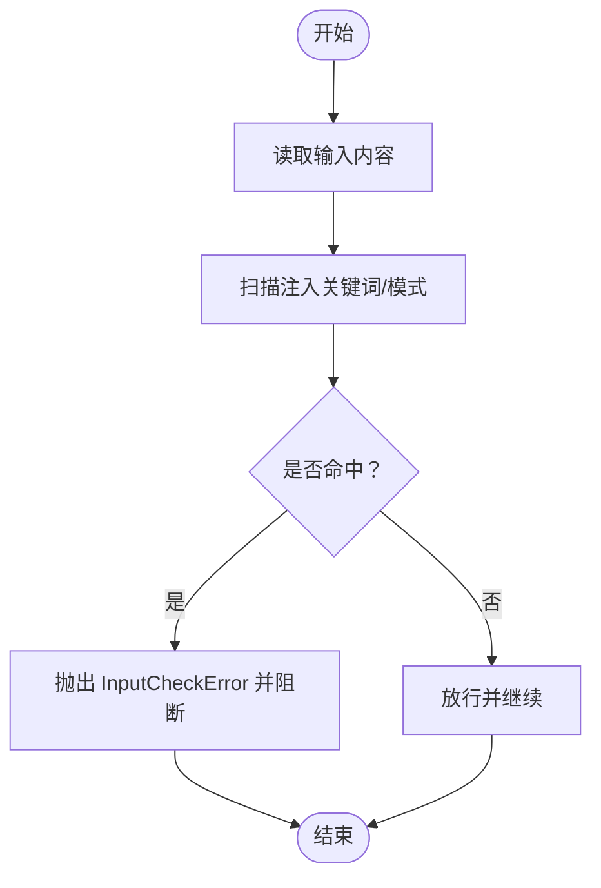
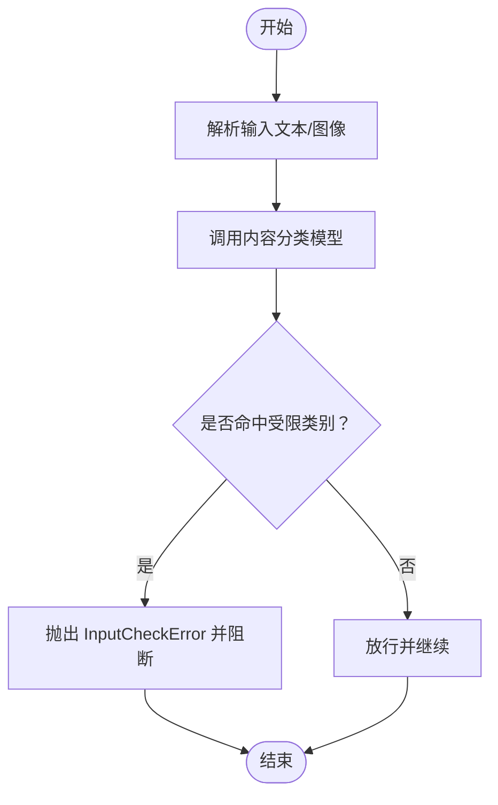
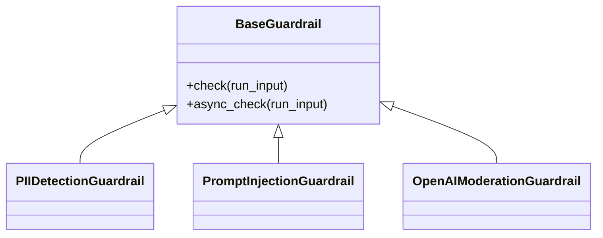
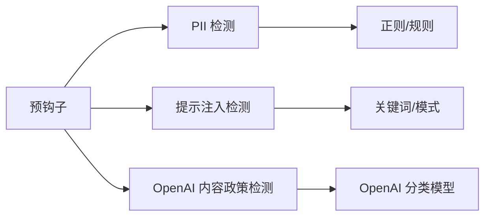

# 保护系统概述

<cite>
**本文引用的文件**
- [guardrails/overview.mdx](file://guardrails/overview.mdx)
- [hooks/overview.mdx](file://hooks/overview.mdx)
- [guardrails/included/pii.mdx](file://guardrails/included/pii.mdx)
- [guardrails/included/prompt-injection.mdx](file://guardrails/included/prompt-injection.mdx)
- [guardrails/included/openai-moderation.mdx](file://guardrails/included/openai-moderation.mdx)
- [guardrails/usage/agent/pii-detection.mdx](file://guardrails/usage/agent/pii-detection.mdx)
- [guardrails/usage/agent/prompt-injection.mdx](file://guardrails/usage/agent/prompt-injection.mdx)
- [guardrails/usage/agent/openai-moderation.mdx](file://guardrails/usage/agent/openai-moderation.mdx)
- [examples/teams/guardrails/pii-detection.mdx](file://examples/teams/guardrails/pii-detection.mdx)
- [examples/teams/guardrails/prompt-injection.mdx](file://examples/teams/guardrails/prompt-injection.mdx)
- [examples/teams/guardrails/openai-moderation.mdx](file://examples/teams/guardrails/openai-moderation.mdx)
- [reference/hooks/base-guardrail.mdx](file://reference/hooks/base-guardrail.mdx)
</cite>

## 目录
1. [引言](#引言)
2. [项目结构](#项目结构)
3. [核心组件](#核心组件)
4. [架构总览](#架构总览)
5. [详细组件分析](#详细组件分析)
6. [依赖关系分析](#依赖关系分析)
7. [性能考量](#性能考量)
8. [故障排查指南](#故障排查指南)
9. [结论](#结论)
10. [附录](#附录)

## 引言
本文件面向希望在智能代理与团队系统中部署自动化安全防护的开发者，系统性阐述保护系统（Guardrails）的核心理念与实现方式。重点覆盖以下方面：
- 输入验证与预处理：在请求进入大模型前进行拦截或清洗，避免敏感数据泄露与恶意指令注入。
- PII 检测：识别并阻断或遮蔽输入中的个人身份信息（如社会安全号、信用卡号、邮箱、电话等）。
- 提示注入防护：检测并阻止针对系统提示词的注入攻击与越狱尝试。
- OpenAI 内容政策检测：基于内容分类对文本与图像进行合规性筛查。
- 预钩子机制：通过 pre-hooks 在运行生命周期早期执行安全检查，确保“不安全输入不入 LLM”。

保护系统以“预钩子”为核心执行点，贯穿 Agent 与 Team 的运行流程，既可作为内置保护，也可扩展为自定义规则，满足不同业务场景的安全需求。

## 项目结构
保护系统相关文档主要分布在以下路径：
- 保护系统概览与内置能力说明：guardrails/overview.mdx
- 预钩子与钩子机制说明：hooks/overview.mdx
- 内置保护功能详情页：guardrails/included/*
- 使用示例（Agent 与 Team）：guardrails/usage/* 与 examples/teams/guardrails/*

下图展示保护系统在项目中的组织关系与调用路径：

图表来源
- [guardrails/overview.mdx](file://guardrails/overview.mdx)
- [hooks/overview.mdx](file://hooks/overview.mdx)
- [guardrails/included/pii.mdx](file://guardrails/included/pii.mdx)
- [guardrails/included/prompt-injection.mdx](file://guardrails/included/prompt-injection.mdx)
- [guardrails/included/openai-moderation.mdx](file://guardrails/included/openai-moderation.mdx)
- [guardrails/usage/agent/pii-detection.mdx](file://guardrails/usage/agent/pii-detection.mdx)
- [guardrails/usage/agent/prompt-injection.mdx](file://guardrails/usage/agent/prompt-injection.mdx)
- [guardrails/usage/agent/openai-moderation.mdx](file://guardrails/usage/agent/openai-moderation.mdx)
- [examples/teams/guardrails/pii-detection.mdx](file://examples/teams/guardrails/pii-detection.mdx)
- [examples/teams/guardrails/prompt-injection.mdx](file://examples/teams/guardrails/prompt-injection.mdx)
- [examples/teams/guardrails/openai-moderation.mdx](file://examples/teams/guardrails/openai-moderation.mdx)
- [reference/hooks/base-guardrail.mdx](file://reference/hooks/base-guardrail.mdx)

章节来源
- [guardrails/overview.mdx](file://guardrails/overview.mdx)
- [hooks/overview.mdx](file://hooks/overview.mdx)

## 核心组件
- 预钩子（Pre-hooks）
  - 定义：在 Agent/Team 运行生命周期的最早阶段执行，用于输入校验、安全检查与数据预处理。
  - 典型用途：PII 检测、提示注入防御、NSFW 内容过滤、输入长度/格式校验、数据标准化等。
  - 执行时机：在会话加载后、模型上下文准备前、LLM 执行前。
- 内置保护（内置 Guardrails）
  - PII 检测：识别并阻断或遮蔽敏感信息（默认包含社会安全号、信用卡号、邮箱、电话等；支持自定义字段与遮蔽策略）。
  - 提示注入防护：检测常见注入关键词与模式，阻断越狱与绕过尝试。
  - OpenAI 内容政策检测：基于 OpenAI 的内容分类模型，对文本与图像进行合规性筛查，并可指定检测类别。
- 自定义保护（扩展）
  - 基于 BaseGuardrail 抽象类实现同步/异步检查方法，按需抛出 InputCheckError 等异常以中断流程。

章节来源
- [hooks/overview.mdx](file://hooks/overview.mdx)
- [guardrails/overview.mdx](file://guardrails/overview.mdx)
- [reference/hooks/base-guardrail.mdx](file://reference/hooks/base-guardrail.mdx)

## 架构总览
下图展示了从用户输入到 LLM 处理的关键路径，以及保护系统在其中的介入位置与职责边界：

图表来源
- [hooks/overview.mdx](file://hooks/overview.mdx)
- [guardrails/overview.mdx](file://guardrails/overview.mdx)

## 详细组件分析

### 组件一：PII 检测保护
- 功能要点
  - 默认检测字段：社会安全号、信用卡号、邮箱、电话。
  - 可选策略：阻断或遮蔽（mask_pii），支持禁用默认字段或添加自定义正则。
  - 配置入口：通过构造函数参数启用与定制。
- 典型使用场景
  - 客服对话、金融咨询、医疗问诊等对隐私保护有强约束的领域。
- 最佳实践
  - 对高敏感场景建议开启遮蔽模式，降低误判对用户体验的影响。
  - 结合业务自定义字段，提升覆盖面。
- 示例与参考
  - Agent 使用示例：[guardrails/usage/agent/pii-detection.mdx](file://guardrails/usage/agent/pii-detection.mdx)
  - Team 使用示例：[examples/teams/guardrails/pii-detection.mdx](file://examples/teams/guardrails/pii-detection.mdx)
  - 功能说明与配置：[guardrails/included/pii.mdx](file://guardrails/included/pii.mdx)

图表来源
- [guardrails/included/pii.mdx](file://guardrails/included/pii.mdx)
- [guardrails/usage/agent/pii-detection.mdx](file://guardrails/usage/agent/pii-detection.mdx)

章节来源
- [guardrails/included/pii.mdx](file://guardrails/included/pii.mdx)
- [guardrails/usage/agent/pii-detection.mdx](file://guardrails/usage/agent/pii-detection.mdx)
- [examples/teams/guardrails/pii-detection.mdx](file://examples/teams/guardrails/pii-detection.mdx)

### 组件二：提示注入防护
- 功能要点
  - 默认注入关键词列表：忽略先前指令、越狱、管理员覆盖、模拟角色等。
  - 支持自定义注入模式列表，灵活适配业务场景。
- 典型使用场景
  - 公开聊天机器人、多用户交互系统、客服助手等易受注入攻击的场景。
- 最佳实践
  - 将注入关键词与业务语境结合，定期更新关键词库。
  - 对“模糊/变体”注入保持敏感，必要时提高阈值或引入更复杂的检测逻辑。
- 示例与参考
  - Agent 使用示例：[guardrails/usage/agent/prompt-injection.mdx](file://guardrails/usage/agent/prompt-injection.mdx)
  - Team 使用示例：[examples/teams/guardrails/prompt-injection.mdx](file://examples/teams/guardrails/prompt-injection.mdx)
  - 功能说明与配置：[guardrails/included/prompt-injection.mdx](file://guardrails/included/prompt-injection.mdx)

图表来源
- [guardrails/included/prompt-injection.mdx](file://guardrails/included/prompt-injection.mdx)
- [guardrails/usage/agent/prompt-injection.mdx](file://guardrails/usage/agent/prompt-injection.mdx)

章节来源
- [guardrails/included/prompt-injection.mdx](file://guardrails/included/prompt-injection.mdx)
- [guardrails/usage/agent/prompt-injection.mdx](file://guardrails/usage/agent/prompt-injection.mdx)
- [examples/teams/guardrails/prompt-injection.mdx](file://examples/teams/guardrails/prompt-injection.mdx)

### 组件三：OpenAI 内容政策检测
- 功能要点
  - 基于 OpenAI 的内容分类模型进行文本与图像的合规性筛查。
  - 支持指定检测类别（如暴力、仇恨、性、自残等），并可调整模型版本。
- 典型使用场景
  - 面向公众的问答系统、内容审核、多模态应用等。
- 最佳实践
  - 根据业务合规要求选择检测类别，避免过度敏感导致误伤。
  - 对图像内容，建议同时进行文本 OCR 与内容分类，提升覆盖率。
- 示例与参考
  - Agent 使用示例：[guardrails/usage/agent/openai-moderation.mdx](file://guardrails/usage/agent/openai-moderation.mdx)
  - Team 使用示例：[examples/teams/guardrails/openai-moderation.mdx](file://examples/teams/guardrails/openai-moderation.mdx)
  - 功能说明与配置：[guardrails/included/openai-moderation.mdx](file://guardrails/included/openai-moderation.mdx)

图表来源
- [guardrails/included/openai-moderation.mdx](file://guardrails/included/openai-moderation.mdx)
- [guardrails/usage/agent/openai-moderation.mdx](file://guardrails/usage/agent/openai-moderation.mdx)

章节来源
- [guardrails/included/openai-moderation.mdx](file://guardrails/included/openai-moderation.mdx)
- [guardrails/usage/agent/openai-moderation.mdx](file://guardrails/usage/agent/openai-moderation.mdx)
- [examples/teams/guardrails/openai-moderation.mdx](file://examples/teams/guardrails/openai-moderation.mdx)

### 组件四：预钩子机制与自定义保护
- 预钩子（Pre-hooks）
  - 触发点：Agent/Team 运行生命周期的起始阶段，早于模型上下文准备与 LLM 执行。
  - 适用范围：输入验证、安全检查、数据预处理。
  - 注意事项：后台模式（background）不适合需要修改参数的 Guardrails，主要用于日志/通知等非关键任务。
- 自定义保护（BaseGuardrail）
  - 同步/异步检查方法：check 与 async_check。
  - 异常机制：检测到问题时抛出 InputCheckError 等异常以中断流程。
- 示例与参考
  - 预钩子概览与示例：[hooks/overview.mdx](file://hooks/overview.mdx)
  - 自定义保护基类参考：[reference/hooks/base-guardrail.mdx](file://reference/hooks/base-guardrail.mdx)

图表来源
- [reference/hooks/base-guardrail.mdx](file://reference/hooks/base-guardrail.mdx)
- [guardrails/included/pii.mdx](file://guardrails/included/pii.mdx)
- [guardrails/included/prompt-injection.mdx](file://guardrails/included/prompt-injection.mdx)
- [guardrails/included/openai-moderation.mdx](file://guardrails/included/openai-moderation.mdx)

章节来源
- [hooks/overview.mdx](file://hooks/overview.mdx)
- [reference/hooks/base-guardrail.mdx](file://reference/hooks/base-guardrail.mdx)

## 依赖关系分析
- 组件耦合
  - 预钩子与内置保护之间为松耦合：预钩子负责调度与顺序控制，内置保护专注于具体检测逻辑。
  - 自定义保护与内置保护共享同一抽象接口，便于统一接入与扩展。
- 外部依赖
  - OpenAI 内容政策检测依赖 OpenAI 的分类模型与 API。
  - PII 检测与提示注入检测依赖内置规则与正则表达式。
- 潜在循环依赖
  - 文档层未发现直接循环依赖；实际代码实现中应避免在 Guardrail 中反向依赖 Agent/Team 的运行状态。

图表来源
- [hooks/overview.mdx](file://hooks/overview.mdx)
- [guardrails/included/pii.mdx](file://guardrails/included/pii.mdx)
- [guardrails/included/prompt-injection.mdx](file://guardrails/included/prompt-injection.mdx)
- [guardrails/included/openai-moderation.mdx](file://guardrails/included/openai-moderation.mdx)

章节来源
- [hooks/overview.mdx](file://hooks/overview.mdx)
- [guardrails/overview.mdx](file://guardrails/overview.mdx)

## 性能考量
- 预钩子执行成本
  - PII 检测与提示注入检测通常为轻量级字符串扫描，对端到端延迟影响较小。
  - OpenAI 内容政策检测涉及外部 API 调用，建议在异步模式下执行，并合理设置超时与重试。
- 缓存与批处理
  - 对高频重复输入可考虑在应用层做缓存，减少重复检测开销。
- 并发与流式响应
  - 预钩子在流式响应中仍需在首包前完成，避免阻塞后续流式输出。
- 资源占用
  - 正则匹配与关键词扫描的复杂度与输入长度线性相关，建议对超长输入提前截断或降采样。

## 故障排查指南
- 常见问题
  - 输入被误判为 PII：检查自定义字段与遮蔽策略，确认正则覆盖范围。
  - 注入攻击未被拦截：更新注入关键词列表，结合上下文增强检测。
  - 内容政策误判：缩小检测类别范围，或调整模型版本与阈值。
- 排查步骤
  - 开启调试模式，查看异常对象中的触发原因与附加信息。
  - 对比正常与异常输入，定位触发规则或正则。
  - 在测试环境中复现问题，逐步缩小可疑范围。
- 相关参考
  - 预钩子与异常机制说明：[hooks/overview.mdx](file://hooks/overview.mdx)
  - 内置保护功能说明与配置：[guardrails/included/*.mdx](file://guardrails/included/pii.mdx)

章节来源
- [hooks/overview.mdx](file://hooks/overview.mdx)
- [guardrails/included/pii.mdx](file://guardrails/included/pii.mdx)
- [guardrails/included/prompt-injection.mdx](file://guardrails/included/prompt-injection.mdx)
- [guardrails/included/openai-moderation.mdx](file://guardrails/included/openai-moderation.mdx)

## 结论
保护系统通过“预钩子 + 内置保护 + 自定义扩展”的组合，实现了对输入的全链路安全治理。其设计强调：
- 早介入：在进入 LLM 前完成安全检查，避免敏感信息与恶意指令进入模型。
- 可配置：支持默认规则、自定义字段与遮蔽策略，兼顾准确性与可用性。
- 可扩展：基于统一抽象实现自定义保护，满足多样化合规与风控需求。
建议在生产环境中将 PII 检测、提示注入防护与内容政策检测组合使用，并根据业务场景动态调整规则与阈值，持续优化检测效果与用户体验。

## 附录
- 快速上手（Agent）
  - 引入内置保护并挂载到 pre_hooks 即可生效。
  - 参考：[guardrails/overview.mdx](file://guardrails/overview.mdx)
- 快速上手（Team）
  - 与 Agent 类似，在 Team 构造时传入 pre_hooks 即可。
  - 参考：[examples/teams/guardrails/pii-detection.mdx](file://examples/teams/guardrails/pii-detection.mdx)
- 自定义保护
  - 继承 BaseGuardrail，实现 check/async_check 方法，按需抛出异常。
  - 参考：[reference/hooks/base-guardrail.mdx](file://reference/hooks/base-guardrail.mdx)