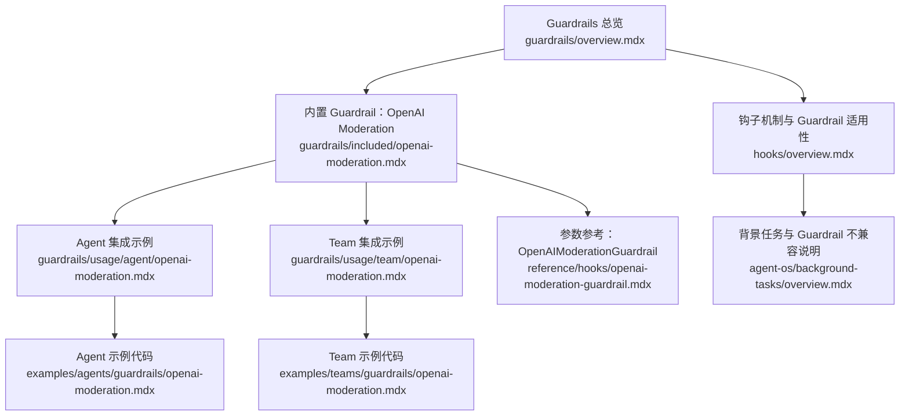
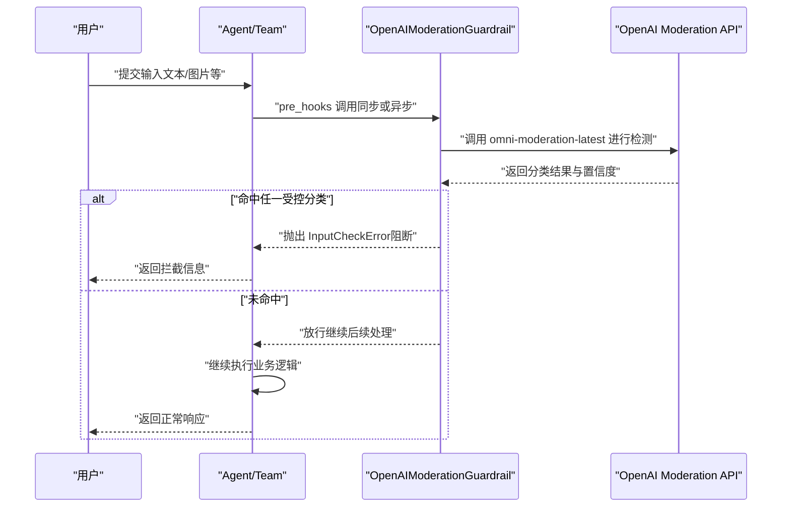
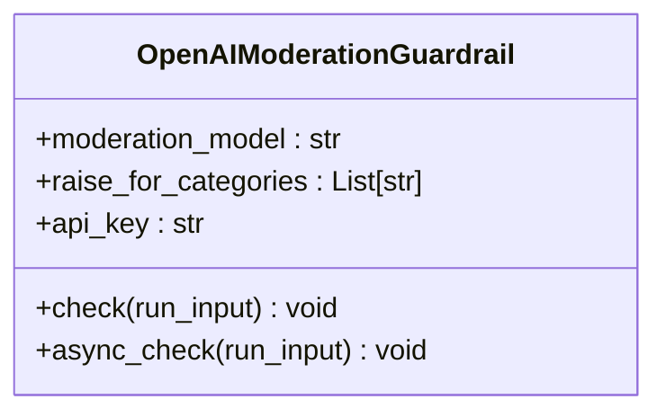
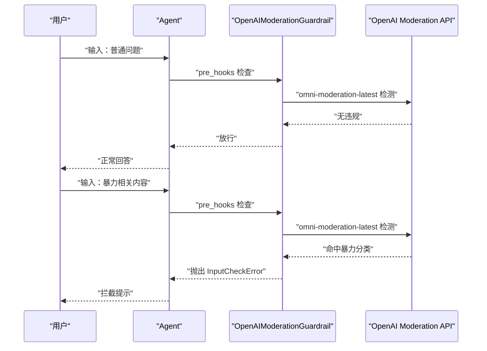
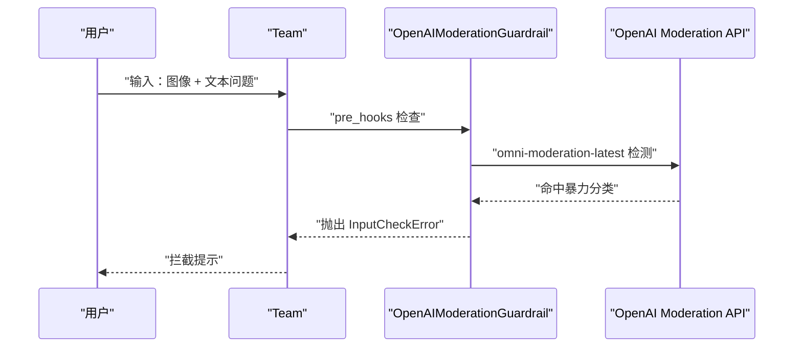
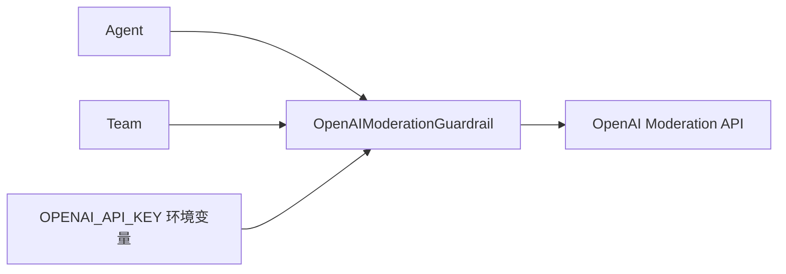

# OpenAI 内容政策检测

<cite>
**本文引用的文件**
- [guardrails/included/openai-moderation.mdx](file://guardrails/included/openai-moderation.mdx)
- [guardrails/usage/agent/openai-moderation.mdx](file://guardrails/usage/agent/openai-moderation.mdx)
- [guardrails/usage/team/openai-moderation.mdx](file://guardrails/usage/team/openai-moderation.mdx)
- [examples/agents/guardrails/openai-moderation.mdx](file://examples/agents/guardrails/openai-moderation.mdx)
- [examples/teams/guardrails/openai-moderation.mdx](file://examples/teams/guardrails/openai-moderation.mdx)
- [reference/hooks/openai-moderation-guardrail.mdx](file://reference/hooks/openai-moderation-guardrail.mdx)
- [guardrails/overview.mdx](file://guardrails/overview.mdx)
- [hooks/overview.mdx](file://hooks/overview.mdx)
- [agent-os/background-tasks/overview.mdx](file://agent-os/background-tasks/overview.mdx)
</cite>

## 目录
1. [简介](#简介)
2. [项目结构](#项目结构)
3. [核心组件](#核心组件)
4. [架构总览](#架构总览)
5. [详细组件分析](#详细组件分析)
6. [依赖关系分析](#依赖关系分析)
7. [性能考虑](#性能考虑)
8. [故障排查指南](#故障排查指南)
9. [结论](#结论)
10. [附录](#附录)

## 简介
本技术文档围绕基于 OpenAI Moderation API 的内容政策检测功能展开，重点说明 Agno 框架内置的 OpenAI Moderation Guardrail 如何工作、如何配置与集成，以及在代理（Agent）与团队（Team）中的使用方式。文档覆盖 omni-moderation-latest 模型的检测能力边界、检测类别配置、自定义模型选择与阈值调整思路、合规性检查策略、与其他模型提供商的适配场景，并提供可复用的配置模板与最佳实践。

## 项目结构
与内容政策检测直接相关的文档主要分布在以下位置：
- Guardrails 总览与内置 Guardrail 列表
- OpenAI Moderation Guardrail 使用说明与示例
- Agent/Team 中的集成示例
- 参考参数与默认行为
- 钩子（Hook）执行机制与背景任务注意事项

**图表来源**
- [guardrails/overview.mdx](file://guardrails/overview.mdx)
- [guardrails/included/openai-moderation.mdx](file://guardrails/included/openai-moderation.mdx)
- [guardrails/usage/agent/openai-moderation.mdx](file://guardrails/usage/agent/openai-moderation.mdx)
- [guardrails/usage/team/openai-moderation.mdx](file://guardrails/usage/team/openai-moderation.mdx)
- [examples/agents/guardrails/openai-moderation.mdx](file://examples/agents/guardrails/openai-moderation.mdx)
- [examples/teams/guardrails/openai-moderation.mdx](file://examples/teams/guardrails/openai-moderation.mdx)
- [reference/hooks/openai-moderation-guardrail.mdx](file://reference/hooks/openai-moderation-guardrail.mdx)
- [hooks/overview.mdx](file://hooks/overview.mdx)
- [agent-os/background-tasks/overview.mdx](file://agent-os/background-tasks/overview.mdx)

**章节来源**
- [guardrails/overview.mdx](file://guardrails/overview.mdx)
- [guardrails/included/openai-moderation.mdx](file://guardrails/included/openai-moderation.mdx)

## 核心组件
- OpenAI Moderation Guardrail：内置 Guardrail，用于在输入进入 Agent/Team 前进行内容政策违规检测，默认使用 omni-moderation-latest 模型。
- 参数与配置：
  - moderation_model：指定用于 Moderation 的模型名称，默认 omni-moderation-latest。
  - raise_for_categories：指定需要触发拦截的分类列表；默认对所有现有分类生效。
  - api_key：调用 OpenAI Moderation API 所需的密钥，默认从环境变量 OPENAI_API_KEY 读取。
- 集成方式：通过 pre_hooks 将 Guardrail 注入到 Agent 或 Team 的运行流程中，作为预处理钩子在请求进入模型前执行。

**章节来源**
- [reference/hooks/openai-moderation-guardrail.mdx](file://reference/hooks/openai-moderation-guardrail.mdx)
- [guardrails/included/openai-moderation.mdx](file://guardrails/included/openai-moderation.mdx)

## 架构总览
下图展示了 Guardrail 在 Agent/Team 生命周期中的执行位置与调用链路：

**图表来源**
- [guardrails/usage/agent/openai-moderation.mdx](file://guardrails/usage/agent/openai-moderation.mdx)
- [guardrails/usage/team/openai-moderation.mdx](file://guardrails/usage/team/openai-moderation.mdx)
- [reference/hooks/openai-moderation-guardrail.mdx](file://reference/hooks/openai-moderation-guardrail.mdx)

## 详细组件分析

### 组件一：OpenAI Moderation Guardrail 类与参数
- 关键参数
  - moderation_model：默认 omni-moderation-latest，可替换为其他可用模型标识。
  - raise_for_categories：可选，传入分类列表以缩小检测范围；若不设置则默认检测全部分类。
  - api_key：可显式传入，否则使用环境变量 OPENAI_API_KEY。
- 行为特征
  - 作为 pre-hook，在 Agent/Team 接收输入后、调用下游模型前执行。
  - 若检测到命中受控分类，将抛出 InputCheckError 并阻断后续处理。
  - 支持同步与异步两种调用形态，框架自动根据 run/arun 选择对应实现。

**图表来源**
- [reference/hooks/openai-moderation-guardrail.mdx](file://reference/hooks/openai-moderation-guardrail.mdx)

**章节来源**
- [reference/hooks/openai-moderation-guardrail.mdx](file://reference/hooks/openai-moderation-guardrail.mdx)
- [hooks/overview.mdx](file://hooks/overview.mdx)

### 组件二：Agent 集成与示例
- 集成要点
  - 将 OpenAIModerationGuardrail 实例放入 Agent.pre_hooks。
  - 可通过 raise_for_categories 仅针对“暴力”“仇恨”等特定分类进行拦截。
  - 支持文本与图像输入（示例中包含图像测试）。
- 典型流程
  - 正常请求：通过 Guardrail 检测后放行。
  - 违规请求：命中受控分类后被阻断并返回拦截信息。

**图表来源**
- [examples/agents/guardrails/openai-moderation.mdx](file://examples/agents/guardrails/openai-moderation.mdx)
- [guardrails/usage/agent/openai-moderation.mdx](file://guardrails/usage/agent/openai-moderation.mdx)

**章节来源**
- [examples/agents/guardrails/openai-moderation.mdx](file://examples/agents/guardrails/openai-moderation.mdx)
- [guardrails/usage/agent/openai-moderation.mdx](file://guardrails/usage/agent/openai-moderation.mdx)

### 组件三：Team 集成与示例
- 集成要点
  - 将 OpenAIModerationGuardrail 放入 Team.pre_hooks。
  - 可按需配置 raise_for_categories，实现更精细的拦截策略。
  - 示例中演示了图像输入的拦截效果。
- 注意事项
  - Team 的拦截行为与 Agent 一致，均在 pre_hooks 阶段执行。

**图表来源**
- [examples/teams/guardrails/openai-moderation.mdx](file://examples/teams/guardrails/openai-moderation.mdx)
- [guardrails/usage/team/openai-moderation.mdx](file://guardrails/usage/team/openai-moderation.mdx)

**章节来源**
- [examples/teams/guardrails/openai-moderation.mdx](file://examples/teams/guardrails/openai-moderation.mdx)
- [guardrails/usage/team/openai-moderation.mdx](file://guardrails/usage/team/openai-moderation.mdx)

### 组件四：检测类别与阈值调整
- 检测类别
  - 默认对所有现有分类生效；可通过 raise_for_categories 指定需要拦截的分类集合。
  - 分类列表可参考 OpenAI 官方文档。
- 阈值调整
  - 当前 Guardrail 的实现以“是否命中分类”作为拦截依据，未提供显式的阈值参数。
  - 若需更细粒度控制，可在业务侧结合 additional_data 与自定义逻辑进行二次判断（例如对高置信度进行额外处理）。

**章节来源**
- [guardrails/included/openai-moderation.mdx](file://guardrails/included/openai-moderation.mdx)
- [reference/hooks/openai-moderation-guardrail.mdx](file://reference/hooks/openai-moderation-guardrail.mdx)

### 组件五：与其它模型提供商的适配
- 适用场景
  - 即使使用非 OpenAI 的模型提供商，仍可借助 Guardrail 的分类体系与拦截机制，统一内容合规策略。
- 实施建议
  - 保持 raise_for_categories 与业务合规目标一致。
  - 对于自有模型，可将 Guardrail 作为前置过滤器，减少对下游模型的无效调用。

**章节来源**
- [guardrails/included/openai-moderation.mdx](file://guardrails/included/openai-moderation.mdx)

## 依赖关系分析
- 组件耦合
  - Guardrail 依赖 OpenAI Moderation API；其行为由 moderation_model 与分类列表决定。
  - 与 Agent/Team 的耦合点在于 pre_hooks，确保在业务逻辑之前执行。
- 外部依赖
  - OPENAI_API_KEY 环境变量或显式 api_key 参数。
  - OpenAI Moderation API 的可用性与配额限制。

**图表来源**
- [reference/hooks/openai-moderation-guardrail.mdx](file://reference/hooks/openai-moderation-guardrail.mdx)
- [guardrails/usage/agent/openai-moderation.mdx](file://guardrails/usage/agent/openai-moderation.mdx)
- [guardrails/usage/team/openai-moderation.mdx](file://guardrails/usage/team/openai-moderation.mdx)

**章节来源**
- [reference/hooks/openai-moderation-guardrail.mdx](file://reference/hooks/openai-moderation-guardrail.mdx)
- [guardrails/usage/agent/openai-moderation.mdx](file://guardrails/usage/agent/openai-moderation.mdx)
- [guardrails/usage/team/openai-moderation.mdx](file://guardrails/usage/team/openai-moderation.mdx)

## 性能考虑
- 预检拦截优势
  - 在调用下游模型前进行拦截，可显著降低无效请求带来的延迟与成本。
- 异步支持
  - Guardrail 同时提供同步与异步实现，建议在异步 Agent/Team 中使用异步版本以避免阻塞。
- 背景任务限制
  - Guardrail 不适合在后台模式运行；后台钩子无法修改请求/响应，且不适用于 Guardrail 的实时拦截需求。

**章节来源**
- [hooks/overview.mdx](file://hooks/overview.mdx)
- [agent-os/background-tasks/overview.mdx](file://agent-os/background-tasks/overview.mdx)

## 故障排查指南
- 常见问题
  - 未设置 OPENAI_API_KEY 或 api_key 传参错误：导致 Guardrail 无法调用 OpenAI Moderation API。
  - raise_for_categories 设置不当：可能漏检或过度拦截。
  - 图像输入未正确传递：需确认 Image 对象与 images 参数的使用方式。
- 排查步骤
  - 检查环境变量与 api_key 参数是否正确。
  - 查看 InputCheckError 的 check_trigger 与 additional_data，定位具体命中分类。
  - 在示例基础上逐步缩小输入范围，确认拦截边界。
- 错误处理策略
  - 对 Guardrail 抛出的 InputCheckError 进行捕获与记录，向用户返回友好的拦截提示。
  - 对于关键业务，可在拦截后进行人工复核或降级处理。

**章节来源**
- [examples/agents/guardrails/openai-moderation.mdx](file://examples/agents/guardrails/openai-moderation.mdx)
- [examples/teams/guardrails/openai-moderation.mdx](file://examples/teams/guardrails/openai-moderation.mdx)
- [guardrails/usage/agent/openai-moderation.mdx](file://guardrails/usage/agent/openai-moderation.mdx)
- [guardrails/usage/team/openai-moderation.mdx](file://guardrails/usage/team/openai-moderation.mdx)

## 结论
OpenAI Moderation Guardrail 提供了在 Agent/Team 层面进行内容政策合规拦截的高效手段。通过 omni-moderation-latest 模型与灵活的分类配置，可在不改变业务逻辑的前提下快速落地合规策略。建议在生产环境中结合异步执行、完善的错误处理与日志记录，持续优化拦截阈值与分类策略，以平衡安全与体验。

## 附录

### 配置模板与最佳实践
- 基础模板（Agent）
  - 将 Guardrail 注入 Agent.pre_hooks，使用默认 omni-moderation-latest。
  - 仅对“暴力”“仇恨”等关键分类启用拦截。
- 高安全模板（Team）
  - 在 Team 中同样注入 Guardrail，并对图像输入进行拦截测试。
  - 对命中结果进行记录与审计，必要时接入人工复核。
- 与其他模型提供商的适配
  - 保持分类策略一致，将 Guardrail 作为统一前置过滤层。
  - 对自有模型输出进行二次校验，避免误判与漏判。

**章节来源**
- [guardrails/included/openai-moderation.mdx](file://guardrails/included/openai-moderation.mdx)
- [examples/agents/guardrails/openai-moderation.mdx](file://examples/agents/guardrails/openai-moderation.mdx)
- [examples/teams/guardrails/openai-moderation.mdx](file://examples/teams/guardrails/openai-moderation.mdx)