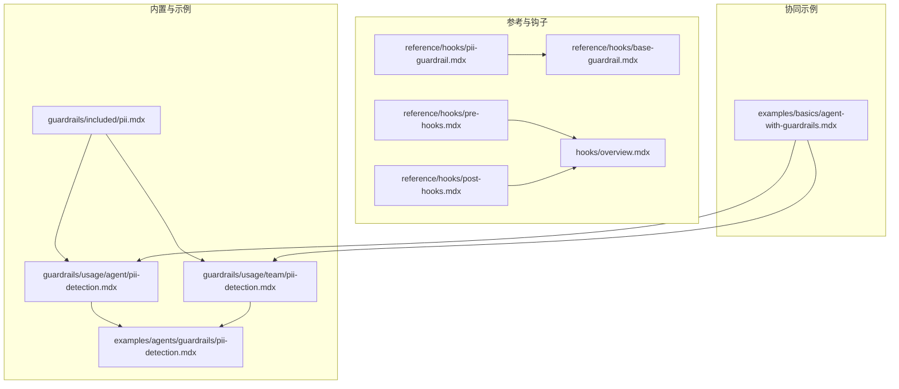
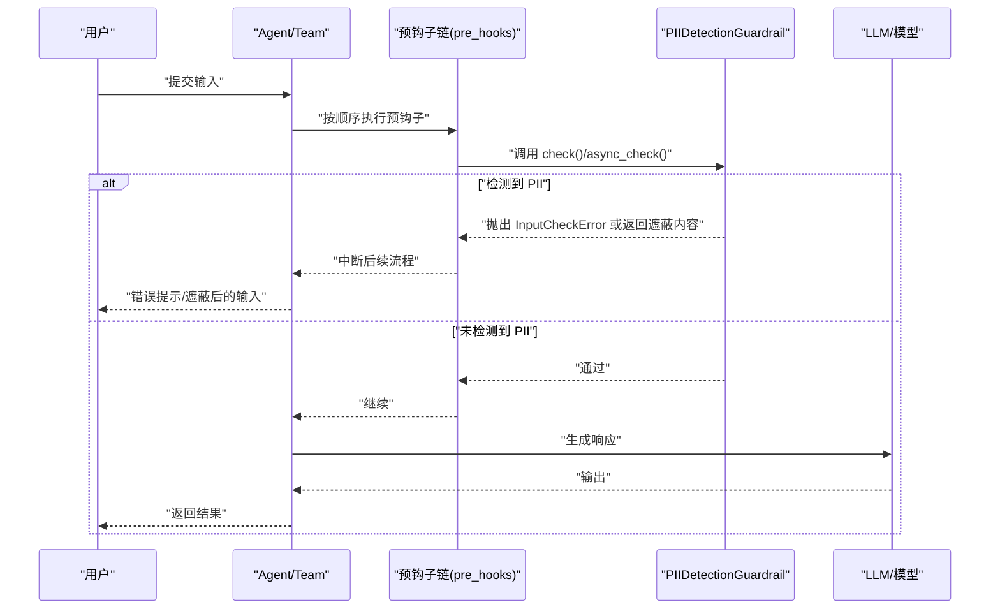
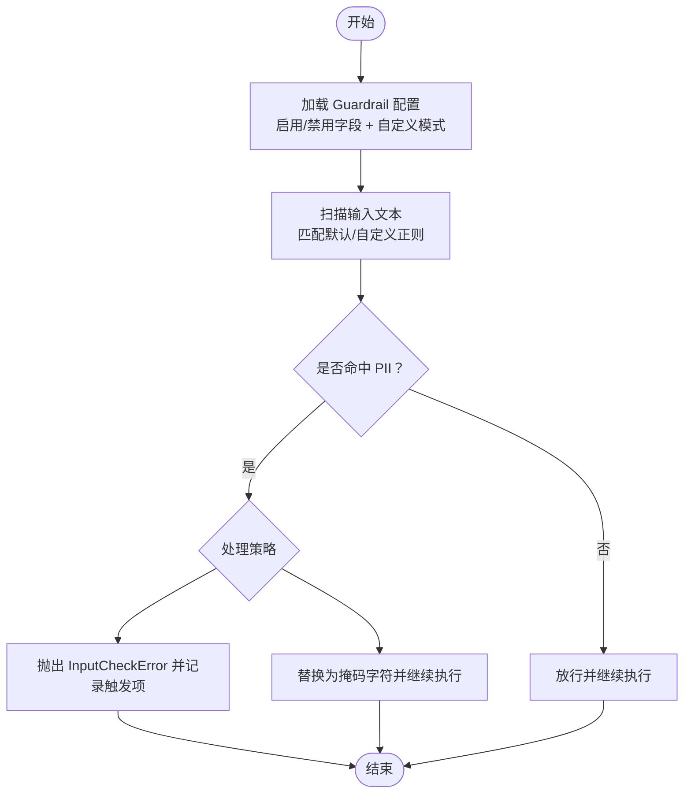
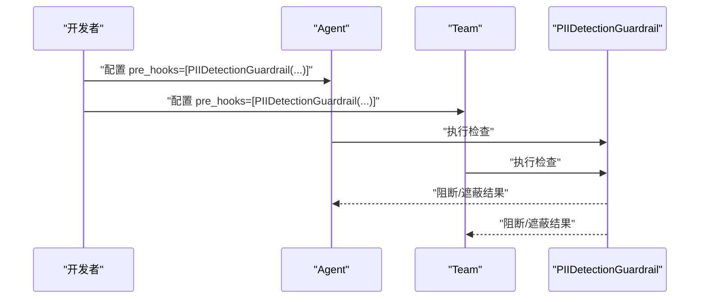
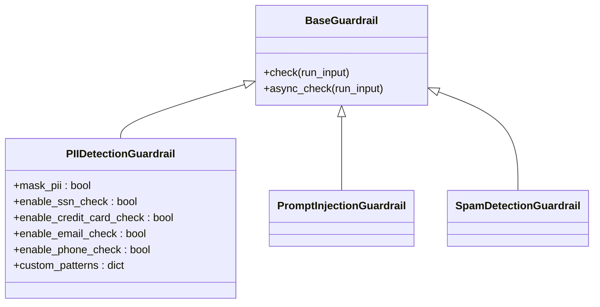
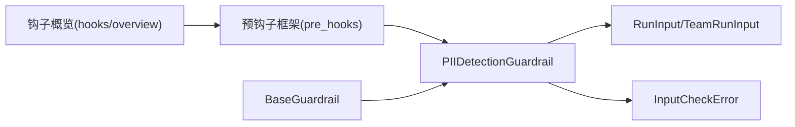

# PII 检测保护

<cite>
**本文引用的文件**   
- [guardrails/included/pii.mdx](file://guardrails/included/pii.mdx)
- [guardrails/usage/agent/pii-detection.mdx](file://guardrails/usage/agent/pii-detection.mdx)
- [guardrails/usage/team/pii-detection.mdx](file://guardrails/usage/team/pii-detection.mdx)
- [examples/agents/guardrails/pii-detection.mdx](file://examples/agents/guardrails/pii-detection.mdx)
- [reference/hooks/pii-guardrail.mdx](file://reference/hooks/pii-guardrail.mdx)
- [reference/hooks/base-guardrail.mdx](file://reference/hooks/base-guardrail.mdx)
- [reference/hooks/pre-hooks.mdx](file://reference/hooks/pre-hooks.mdx)
- [reference/hooks/post-hooks.mdx](file://reference/hooks/post-hooks.mdx)
- [hooks/overview.mdx](file://hooks/overview.mdx)
- [examples/basics/agent-with-guardrails.mdx](file://examples/basics/agent-with-guardrails.mdx)
</cite>

## 目录
1. [简介](#简介)
2. [项目结构](#项目结构)
3. [核心组件](#核心组件)
4. [架构总览](#架构总览)
5. [组件详解](#组件详解)
6. [依赖关系分析](#依赖关系分析)
7. [性能与可扩展性](#性能与可扩展性)
8. [故障排查指南](#故障排查指南)
9. [结论](#结论)
10. [附录：配置与示例模板](#附录配置与示例模板)

## 简介
本技术文档围绕 PII（个人身份信息）检测保护功能展开，系统阐述其工作原理、实现机制与集成方式。PII 检测保护通过在代理（Agent）与团队（Team）运行前执行预检查，识别并阻断或遮蔽输入中的敏感信息（如社会安全号、信用卡号、电子邮箱、电话号码等），从而降低数据泄露风险。文档同时覆盖参数配置、误报处理策略、自定义规则扩展、与其它保护功能的协同机制，以及在不同安全级别下的行为表现，并提供面向数据处理与用户输入验证的最佳实践。

## 项目结构
与 PII 检测保护直接相关的文档主要分布在以下位置：
- guardrails/included：PII 检测的内置说明与基础用法
- guardrails/usage：面向 Agent 与 Team 的使用示例
- examples：更完整的示例脚本与多场景演示
- reference/hooks：PII 检测 Guardrail 参数参考、基类与钩子生命周期
- hooks/overview：预/后置钩子的触发时机与适用场景

**图表来源**
- [guardrails/included/pii.mdx:1-78](file://guardrails/included/pii.mdx#L1-L78)
- [guardrails/usage/agent/pii-detection.mdx:1-178](file://guardrails/usage/agent/pii-detection.mdx#L1-L178)
- [guardrails/usage/team/pii-detection.mdx:1-171](file://guardrails/usage/team/pii-detection.mdx#L1-L171)
- [examples/agents/guardrails/pii-detection.mdx:1-161](file://examples/agents/guardrails/pii-detection.mdx#L1-L161)
- [reference/hooks/pii-guardrail.mdx:1-15](file://reference/hooks/pii-guardrail.mdx#L1-L15)
- [reference/hooks/base-guardrail.mdx:1-25](file://reference/hooks/base-guardrail.mdx#L1-L25)
- [reference/hooks/pre-hooks.mdx:1-21](file://reference/hooks/pre-hooks.mdx#L1-L21)
- [reference/hooks/post-hooks.mdx:1-21](file://reference/hooks/post-hooks.mdx#L1-L21)
- [hooks/overview.mdx:1-216](file://hooks/overview.mdx#L1-L216)
- [examples/basics/agent-with-guardrails.mdx:1-196](file://examples/basics/agent-with-guardrails.mdx#L1-L196)

**章节来源**
- [guardrails/included/pii.mdx:1-78](file://guardrails/included/pii.mdx#L1-L78)
- [guardrails/usage/agent/pii-detection.mdx:1-178](file://guardrails/usage/agent/pii-detection.mdx#L1-L178)
- [guardrails/usage/team/pii-detection.mdx:1-171](file://guardrails/usage/team/pii-detection.mdx#L1-L171)
- [examples/agents/guardrails/pii-detection.mdx:1-161](file://examples/agents/guardrails/pii-detection.mdx#L1-L161)
- [reference/hooks/pii-guardrail.mdx:1-15](file://reference/hooks/pii-guardrail.mdx#L1-L15)
- [reference/hooks/base-guardrail.mdx:1-25](file://reference/hooks/base-guardrail.mdx#L1-L25)
- [reference/hooks/pre-hooks.mdx:1-21](file://reference/hooks/pre-hooks.mdx#L1-L21)
- [reference/hooks/post-hooks.mdx:1-21](file://reference/hooks/post-hooks.mdx#L1-L21)
- [hooks/overview.mdx:1-216](file://hooks/overview.mdx#L1-L216)
- [examples/basics/agent-with-guardrails.mdx:1-196](file://examples/basics/agent-with-guardrails.mdx#L1-L196)

## 核心组件
- PIIDetectionGuardrail：内置的 PII 检测保护器，支持默认字段（SSN、信用卡号、邮箱、电话）检测，可选择性启用/禁用特定类型，支持自定义正则模式扩展，支持“遮蔽”而非“阻断”的处理策略。
- 预钩子（pre-hooks）：在模型上下文准备与 LLM 执行之前对输入进行检查，适合用于 Guardrails 类的安全控制。
- 基类 Guardrail：定义统一的同步/异步检查接口，便于扩展自定义 Guardrail。
- 示例与参考：提供 Agent/Team 集成示例、参数表与钩子生命周期说明。

**章节来源**
- [guardrails/included/pii.mdx:11-78](file://guardrails/included/pii.mdx#L11-L78)
- [reference/hooks/pii-guardrail.mdx:5-15](file://reference/hooks/pii-guardrail.mdx#L5-L15)
- [reference/hooks/base-guardrail.mdx:6-25](file://reference/hooks/base-guardrail.mdx#L6-L25)
- [hooks/overview.mdx:12-32](file://hooks/overview.mdx#L12-L32)

## 架构总览
PII 检测保护在 Agent/Team 生命周期中的触发点如下：

**图表来源**
- [hooks/overview.mdx:25-32](file://hooks/overview.mdx#L25-L32)
- [reference/hooks/pre-hooks.mdx:5-21](file://reference/hooks/pre-hooks.mdx#L5-L21)
- [reference/hooks/base-guardrail.mdx:8-25](file://reference/hooks/base-guardrail.mdx#L8-L25)
- [guardrails/included/pii.mdx:60-72](file://guardrails/included/pii.mdx#L60-L72)

## 组件详解

### 1) PII 检测算法与识别范围
- 默认检测字段
  - 社会安全号（SSN）
  - 信用卡号
  - 电子邮箱地址
  - 电话号码
- 自定义扩展
  - 通过参数启用/禁用默认字段
  - 通过自定义正则模式扩展新的 PII 类型
- 处理策略
  - 阻断：检测到 PII 即抛出输入检查异常
  - 遮蔽：将输入中的 PII 替换为掩码字符后继续处理

**图表来源**
- [guardrails/included/pii.mdx:27-72](file://guardrails/included/pii.mdx#L27-L72)
- [reference/hooks/pii-guardrail.mdx:5-15](file://reference/hooks/pii-guardrail.mdx#L5-L15)

**章节来源**
- [guardrails/included/pii.mdx:27-72](file://guardrails/included/pii.mdx#L27-L72)
- [reference/hooks/pii-guardrail.mdx:5-15](file://reference/hooks/pii-guardrail.mdx#L5-L15)

### 2) 在代理与团队中的集成
- Agent 集成
  - 将 PIIDetectionGuardrail 作为预钩子注入 Agent 的 pre_hooks
  - 支持两种模式：阻断或遮蔽
- Team 集成
  - 同样将 PIIDetectionGuardrail 注入 Team 的 pre_hooks
  - 团队级统一的输入保护策略

**图表来源**
- [guardrails/usage/agent/pii-detection.mdx:32-39](file://guardrails/usage/agent/pii-detection.mdx#L32-L39)
- [guardrails/usage/team/pii-detection.mdx:26-33](file://guardrails/usage/team/pii-detection.mdx#L26-L33)
- [examples/agents/guardrails/pii-detection.mdx:29-36](file://examples/agents/guardrails/pii-detection.mdx#L29-L36)

**章节来源**
- [guardrails/usage/agent/pii-detection.mdx:32-39](file://guardrails/usage/agent/pii-detection.mdx#L32-L39)
- [guardrails/usage/team/pii-detection.mdx:26-33](file://guardrails/usage/team/pii-detection.mdx#L26-L33)
- [examples/agents/guardrails/pii-detection.mdx:29-36](file://examples/agents/guardrails/pii-detection.mdx#L29-L36)

### 3) 参数与配置
- 关键参数
  - mask_pii：是否将 PII 替换为掩码字符
  - enable_ssn_check / enable_credit_card_check / enable_email_check / enable_phone_check：分别控制对应字段的检测
  - custom_patterns：以字典形式添加自定义正则模式
- 参考表格

| 参数名 | 类型 | 默认值 | 描述 |
| --- | --- | --- | --- |
| mask_pii | bool | False | 是否将 PII 替换为掩码字符 |
| enable_ssn_check | bool | True | 是否检测 SSN |
| enable_credit_card_check | bool | True | 是否检测信用卡号 |
| enable_email_check | bool | True | 是否检测邮箱 |
| enable_phone_check | bool | True | 是否检测电话 |
| custom_patterns | dict | {} | 自定义 PII 正则模式集合 |

**章节来源**
- [reference/hooks/pii-guardrail.mdx:5-15](file://reference/hooks/pii-guardrail.mdx#L5-L15)
- [guardrails/included/pii.mdx:36-58](file://guardrails/included/pii.mdx#L36-L58)

### 4) 与其它保护功能的协同
- 与 Prompt Injection Guardrail 协同：在输入进入模型前，先做 PII 检测，再做注入攻击检测，形成双重防护。
- 与自定义 Guardrail 协同：可继承基类实现复杂业务规则（如垃圾信息检测），与 PII 检测共同组成全面的输入安全网。

**图表来源**
- [reference/hooks/base-guardrail.mdx:6-25](file://reference/hooks/base-guardrail.mdx#L6-L25)
- [reference/hooks/pii-guardrail.mdx:5-15](file://reference/hooks/pii-guardrail.mdx#L5-L15)
- [examples/basics/agent-with-guardrails.mdx:47-82](file://examples/basics/agent-with-guardrails.mdx#L47-L82)

**章节来源**
- [examples/basics/agent-with-guardrails.mdx:47-82](file://examples/basics/agent-with-guardrails.mdx#L47-L82)
- [reference/hooks/base-guardrail.mdx:6-25](file://reference/hooks/base-guardrail.mdx#L6-L25)

### 5) 使用示例与最佳实践
- 场景一：阻断式保护（推荐于高敏数据场景）
  - 将 PIIDetectionGuardrail 作为预钩子加入 Agent/Team
  - 对包含 SSN、信用卡号、邮箱、电话的输入直接阻断
- 场景二：遮蔽式保护（适用于需要保留对话连续性的场景）
  - 设置 mask_pii=True，将敏感信息替换为掩码字符后继续处理
- 最佳实践
  - 在 Agent/Team 的 pre_hooks 中统一接入 PII 检测
  - 结合 Prompt Injection Guardrail 与自定义 Guardrail 形成多层防护
  - 对输入进行最小化暴露原则：仅传递必要信息给模型

**章节来源**
- [guardrails/usage/agent/pii-detection.mdx:10-14](file://guardrails/usage/agent/pii-detection.mdx#L10-L14)
- [guardrails/usage/team/pii-detection.mdx:8-10](file://guardrails/usage/team/pii-detection.mdx#L8-L10)
- [guardrails/included/pii.mdx:60-72](file://guardrails/included/pii.mdx#L60-L72)
- [examples/basics/agent-with-guardrails.mdx:96-110](file://examples/basics/agent-with-guardrails.mdx#L96-L110)

## 依赖关系分析
- 组件耦合
  - PIIDetectionGuardrail 依赖于预钩子框架与输入对象模型
  - 与 BaseGuardrail 共享统一的检查接口
- 外部依赖
  - 输入内容解析与正则匹配
  - 异常类型 InputCheckError 用于阻断式保护
- 钩子生命周期
  - 预钩子在模型上下文准备前执行，适合 Guardrails
  - 背景钩子不应用于 Guardrails（无法修改请求/响应）

**图表来源**
- [hooks/overview.mdx:25-32](file://hooks/overview.mdx#L25-L32)
- [reference/hooks/base-guardrail.mdx:8-25](file://reference/hooks/base-guardrail.mdx#L8-L25)
- [reference/hooks/pre-hooks.mdx:5-21](file://reference/hooks/pre-hooks.mdx#L5-L21)

**章节来源**
- [hooks/overview.mdx:12-32](file://hooks/overview.mdx#L12-L32)
- [reference/hooks/base-guardrail.mdx:6-25](file://reference/hooks/base-guardrail.mdx#L6-L25)
- [reference/hooks/pre-hooks.mdx:5-21](file://reference/hooks/pre-hooks.mdx#L5-L21)

## 性能与可扩展性
- 性能特征
  - 正则匹配成本与输入长度、正则复杂度相关；建议尽量复用默认高效模式，避免过度复杂的自定义正则
  - 遮蔽模式相比阻断模式可减少重试开销，提升用户体验
- 可扩展性
  - 通过 custom_patterns 动态扩展检测类型，满足行业特定的 PII 规范
  - 与 Prompt Injection Guardrail、自定义 Guardrail 组合，形成可插拔的安全模块

[本节为通用指导，无需具体文件来源]

## 故障排查指南
- 常见问题
  - 误报：某些正常文本被误判为 PII（如“123-45-6789”出现在非敏感语境）
  - 处理策略不当：阻断导致交互中断，遮蔽影响上下文一致性
- 处理策略
  - 调整 enable_* 参数，关闭误报率高的字段检测
  - 使用遮蔽模式替代阻断，结合日志记录触发项以便审计
  - 通过 custom_patterns 精准限定匹配范围，减少误报
- 审计与溯源
  - 记录 check_trigger 与 message，便于定位误报来源

**章节来源**
- [guardrails/included/pii.mdx:60-72](file://guardrails/included/pii.mdx#L60-L72)
- [guardrails/usage/agent/pii-detection.mdx:52-62](file://guardrails/usage/agent/pii-detection.mdx#L52-L62)
- [guardrails/usage/team/pii-detection.mdx:46-56](file://guardrails/usage/team/pii-detection.mdx#L46-L56)

## 结论
PII 检测保护通过在 Agent/Team 的预钩子阶段对输入进行快速扫描与判断，能够在不侵入业务逻辑的前提下有效降低敏感信息泄露风险。结合遮蔽与阻断策略、自定义规则扩展以及与 Prompt Injection Guardrail、自定义 Guardrail 的协同，可在不同安全级别下灵活适配业务需求。建议在高敏场景优先采用阻断策略，在需要保持对话连贯性时采用遮蔽策略，并持续优化正则规则与策略组合以降低误报。

[本节为总结性内容，无需具体文件来源]

## 附录：配置与示例模板

- Agent 集成模板（阻断式）
  - 在 Agent 的 pre_hooks 中加入 PIIDetectionGuardrail
  - 可选：禁用不需要的字段检测
  - 可选：添加自定义正则模式
- Team 集成模板（遮蔽式）
  - 在 Team 的 pre_hooks 中加入 PIIDetectionGuardrail(mask_pii=True)
  - 适用于需要保留对话连续性的客户服务场景
- 多 Guardrail 协同模板
  - 同时引入 PII 检测、注入检测与自定义 Guardrail，形成多层防护

**章节来源**
- [guardrails/usage/agent/pii-detection.mdx:32-39](file://guardrails/usage/agent/pii-detection.mdx#L32-L39)
- [guardrails/usage/team/pii-detection.mdx:26-33](file://guardrails/usage/team/pii-detection.mdx#L26-L33)
- [examples/basics/agent-with-guardrails.mdx:96-110](file://examples/basics/agent-with-guardrails.mdx#L96-L110)