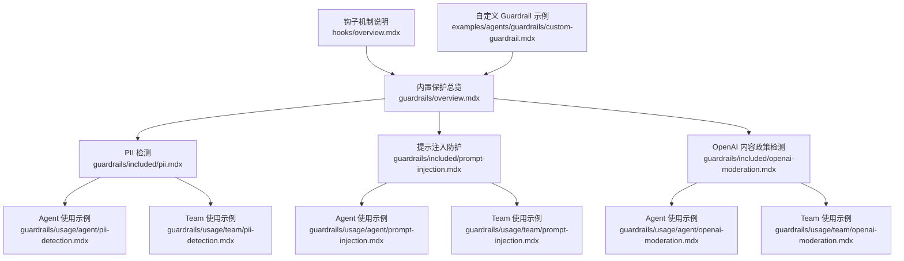
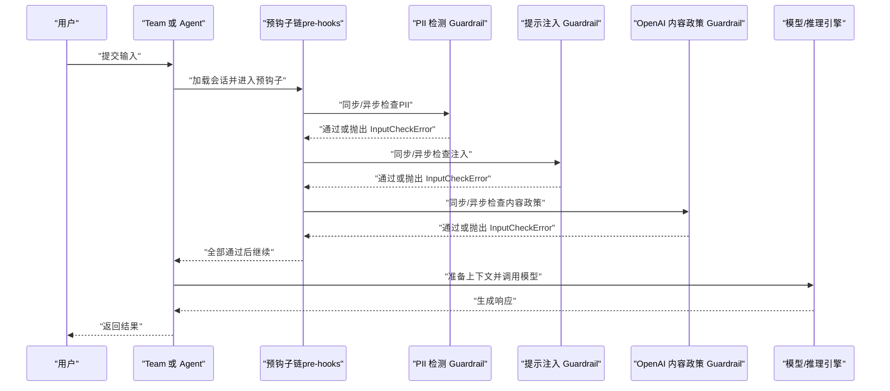
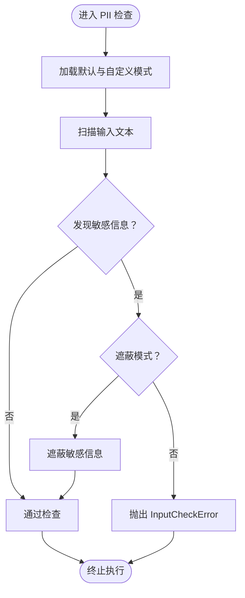
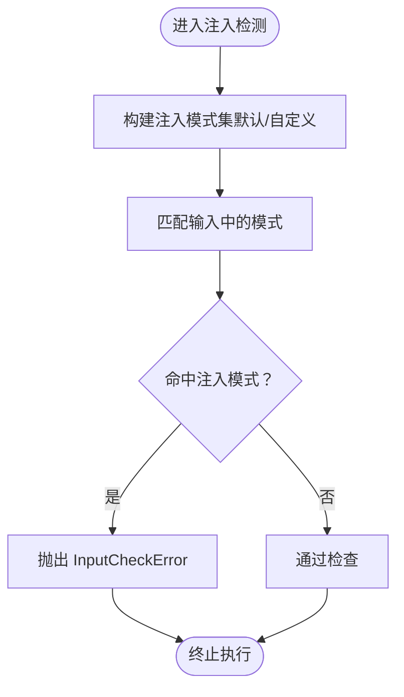
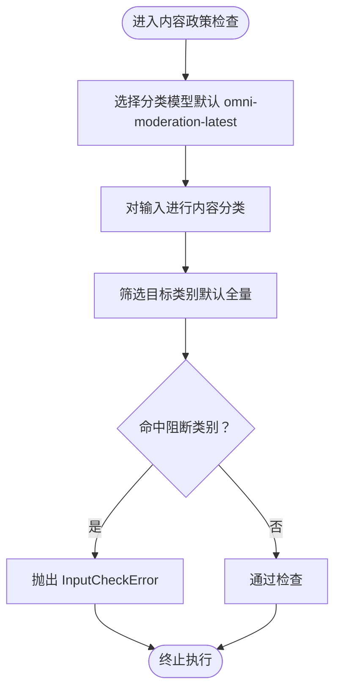
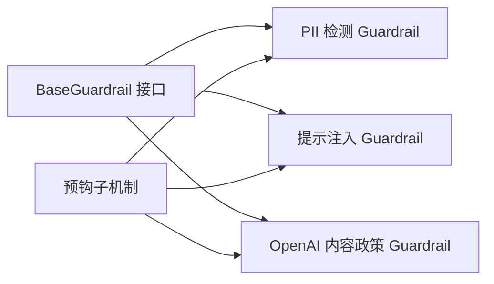

# 内置保护功能

<cite>
**本文引用的文件**
- [guardrails/overview.mdx](file://guardrails/overview.mdx)
- [guardrails/included/pii.mdx](file://guardrails/included/pii.mdx)
- [guardrails/included/prompt-injection.mdx](file://guardrails/included/prompt-injection.mdx)
- [guardrails/included/openai-moderation.mdx](file://guardrails/included/openai-moderation.mdx)
- [guardrails/usage/agent/pii-detection.mdx](file://guardrails/usage/agent/pii-detection.mdx)
- [guardrails/usage/agent/prompt-injection.mdx](file://guardrails/usage/agent/prompt-injection.mdx)
- [guardrails/usage/agent/openai-moderation.mdx](file://guardrails/usage/agent/openai-moderation.mdx)
- [guardrails/usage/team/pii-detection.mdx](file://guardrails/usage/team/pii-detection.mdx)
- [guardrails/usage/team/prompt-injection.mdx](file://guardrails/usage/team/prompt-injection.mdx)
- [guardrails/usage/team/openai-moderation.mdx](file://guardrails/usage/team/openai-moderation.mdx)
- [hooks/overview.mdx](file://hooks/overview.mdx)
- [reference/hooks/base-guardrail.mdx](file://reference/hooks/base-guardrail.mdx)
- [reference/hooks/pii-guardrail.mdx](file://reference/hooks/pii-guardrail.mdx)
- [reference/hooks/prompt-injection-guardrail.mdx](file://reference/hooks/prompt-injection-guardrail.mdx)
- [reference/hooks/openai-moderation-guardrail.mdx](file://reference/hooks/openai-moderation-guardrail.mdx)
- [examples/agents/guardrails/custom-guardrail.mdx](file://examples/agents/guardrails/custom-guardrail.mdx)
</cite>

## 目录
1. [简介](#简介)
2. [项目结构](#项目结构)
3. [核心组件](#核心组件)
4. [架构总览](#架构总览)
5. [详细组件分析](#详细组件分析)
6. [依赖关系分析](#依赖关系分析)
7. [性能与可扩展性](#性能与可扩展性)
8. [故障排查指南](#故障排查指南)
9. [结论](#结论)
10. [附录：配置与示例模板](#附录配置与示例模板)

## 简介
本文件系统化梳理 Agno 的内置保护功能，覆盖三大核心能力：
- PII 检测保护：识别并阻断或遮蔽输入中的个人身份信息（如社会安全号、信用卡号、邮箱、电话等）。
- 提示注入防护：检测并阻止针对系统提示词的注入与越狱尝试。
- OpenAI 内容政策检测：基于 OpenAI 的内容分类体系，在本地提前拦截违反其内容政策的输入。

这些保护以“预钩子（pre-hooks）”形式集成到 Agent 与 Team 的运行生命周期中，确保在模型推理前完成安全检查，避免敏感或违规内容进入后续流程。

## 项目结构
围绕内置保护功能的相关文档分布在以下路径：
- guardrails/overview.mdx：总体说明与使用入口
- guardrails/included/*：三类内置保护的官方说明
- guardrails/usage/agent|team/*：面向 Agent 与 Team 的使用示例
- hooks/overview.mdx：预钩子与后钩子的机制说明
- reference/hooks/*：各类 Guardrail 的参数参考
- examples/agents/guardrails/*：自定义 Guardrail 示例

**图表来源**
- [guardrails/overview.mdx:1-149](file://guardrails/overview.mdx#L1-L149)
- [guardrails/included/pii.mdx:1-78](file://guardrails/included/pii.mdx#L1-L78)
- [guardrails/included/prompt-injection.mdx:1-65](file://guardrails/included/prompt-injection.mdx#L1-L65)
- [guardrails/included/openai-moderation.mdx:1-63](file://guardrails/included/openai-moderation.mdx#L1-L63)
- [hooks/overview.mdx:1-33](file://hooks/overview.mdx#L1-L33)
- [examples/agents/guardrails/custom-guardrail.mdx:1-44](file://examples/agents/guardrails/custom-guardrail.mdx#L1-L44)

**章节来源**
- [guardrails/overview.mdx:1-149](file://guardrails/overview.mdx#L1-L149)
- [hooks/overview.mdx:1-33](file://hooks/overview.mdx#L1-L33)

## 核心组件
- 预钩子（pre-hooks）：在 Agent/Team 执行前对输入进行校验与转换，内置保护即通过该机制实现。
- 基类 Guardrail：所有内置与自定义 Guardrail 的统一接口，需实现同步与异步检查方法。
- 三类内置 Guardrail：
  - PII 检测 Guardrail：默认检测 SSN、信用卡、邮箱、电话；支持自定义模式与遮蔽策略。
  - 提示注入 Guardrail：默认检测常见注入关键词与短语；支持自定义注入模式列表。
  - OpenAI 内容政策 Guardrail：默认使用 omni-moderation-latest；支持指定分类与模型。

**章节来源**
- [hooks/overview.mdx:25-33](file://hooks/overview.mdx#L25-L33)
- [reference/hooks/base-guardrail.mdx:1-25](file://reference/hooks/base-guardrail.mdx#L1-L25)
- [reference/hooks/pii-guardrail.mdx:1-15](file://reference/hooks/pii-guardrail.mdx#L1-L15)
- [reference/hooks/prompt-injection-guardrail.mdx:1-32](file://reference/hooks/prompt-injection-guardrail.mdx#L1-L32)
- [reference/hooks/openai-moderation-guardrail.mdx:1-17](file://reference/hooks/openai-moderation-guardrail.mdx#L1-L17)

## 架构总览
内置保护功能在 Agent/Team 生命周期中的执行顺序如下：

**图表来源**
- [hooks/overview.mdx:25-33](file://hooks/overview.mdx#L25-L33)
- [guardrails/overview.mdx:33-34](file://guardrails/overview.mdx#L33-L34)

## 详细组件分析

### PII 检测保护
- 工作原理
  - 在输入阶段扫描文本，匹配默认与自定义正则模式，识别敏感字段。
  - 可选择直接阻断（抛出 InputCheckError），或启用遮蔽（将敏感信息替换为掩码字符）。
- 关键参数
  - mask_pii：是否遮蔽而非阻断
  - enable_*_check：开关默认字段检测（SSN、信用卡、邮箱、电话）
  - custom_patterns：追加自定义正则模式
- 典型场景
  - 客服对话中自动阻断或遮蔽用户提供的敏感信息
  - 多类型敏感信息混合出现时统一处理
- 行为表现
  - 正常请求放行
  - 包含敏感信息的请求被阻断或遮蔽
  - 不同格式的敏感信息仍能被识别（如信用卡尾号、带分隔符的 SSN）

**图表来源**
- [guardrails/included/pii.mdx:60-72](file://guardrails/included/pii.mdx#L60-L72)
- [reference/hooks/pii-guardrail.mdx:5-15](file://reference/hooks/pii-guardrail.mdx#L5-L15)

**章节来源**
- [guardrails/included/pii.mdx:1-78](file://guardrails/included/pii.mdx#L1-L78)
- [guardrails/usage/agent/pii-detection.mdx:1-178](file://guardrails/usage/agent/pii-detection.mdx#L1-L178)
- [guardrails/usage/team/pii-detection.mdx:1-171](file://guardrails/usage/team/pii-detection.mdx#L1-L171)
- [reference/hooks/pii-guardrail.mdx:1-15](file://reference/hooks/pii-guardrail.mdx#L1-L15)

### 提示注入防护
- 工作原理
  - 通过关键词与短语集合检测潜在的注入意图，如“忽略先前指令”“你现在是一个…”“越狱”等。
  - 支持自定义注入模式列表，便于适配业务场景。
- 关键参数
  - injection_patterns：自定义注入模式列表（默认使用内置列表）
- 典型场景
  - 面向公众的聊天助手，防止越狱与恶意指令注入
  - 复杂提示词工程中，抵御对抗性输入
- 行为表现
  - 正常请求放行
  - 基础/高级/隐蔽注入尝试均被阻断

**图表来源**
- [guardrails/included/prompt-injection.mdx:29-52](file://guardrails/included/prompt-injection.mdx#L29-L52)
- [reference/hooks/prompt-injection-guardrail.mdx:5-32](file://reference/hooks/prompt-injection-guardrail.mdx#L5-L32)

**章节来源**
- [guardrails/included/prompt-injection.mdx:1-65](file://guardrails/included/prompt-injection.mdx#L1-L65)
- [guardrails/usage/agent/prompt-injection.mdx:1-125](file://guardrails/usage/agent/prompt-injection.mdx#L1-L125)
- [guardrails/usage/team/prompt-injection.mdx:1-125](file://guardrails/usage/team/prompt-injection.mdx#L1-L125)
- [reference/hooks/prompt-injection-guardrail.mdx:1-32](file://reference/hooks/prompt-injection-guardrail.mdx#L1-L32)

### OpenAI 内容政策检测
- 工作原理
  - 使用 OpenAI 的内容分类模型（默认 omni-moderation-latest）对输入进行分类评估。
  - 可按需仅对特定类别触发阻断，降低误报率。
- 关键参数
  - moderation_model：用于内容分类的模型标识
  - raise_for_categories：仅对指定类别触发阻断
  - api_key：可显式传入密钥（默认读取环境变量）
- 典型场景
  - 文本与图像内容的多模态合规检查
  - 仅对高风险类别（如暴力、仇恨）进行严格拦截
- 行为表现
  - 合规内容放行
  - 触发指定类别的内容被阻断，并返回触发原因

**图表来源**
- [guardrails/included/openai-moderation.mdx:31-55](file://guardrails/included/openai-moderation.mdx#L31-L55)
- [reference/hooks/openai-moderation-guardrail.mdx:5-17](file://reference/hooks/openai-moderation-guardrail.mdx#L5-L17)

**章节来源**
- [guardrails/included/openai-moderation.mdx:1-63](file://guardrails/included/openai-moderation.mdx#L1-L63)
- [guardrails/usage/agent/openai-moderation.mdx:1-145](file://guardrails/usage/agent/openai-moderation.mdx#L1-L145)
- [guardrails/usage/team/openai-moderation.mdx:1-137](file://guardrails/usage/team/openai-moderation.mdx#L1-L137)
- [reference/hooks/openai-moderation-guardrail.mdx:1-17](file://reference/hooks/openai-moderation-guardrail.mdx#L1-L17)

## 依赖关系分析
- 组件耦合
  - Guardrail 通过统一基类与预钩子机制解耦于具体 Agent/Team 实现，便于复用与扩展。
  - OpenAI 内容政策 Guardrail 依赖外部 API，需关注网络与配额限制。
- 集成点
  - 预钩子链在运行生命周期早期执行，保证在模型推理前完成安全检查。
  - 自定义 Guardrail 可与内置 Guardrail 并行使用，形成组合防护。

**图表来源**
- [reference/hooks/base-guardrail.mdx:1-25](file://reference/hooks/base-guardrail.mdx#L1-L25)
- [hooks/overview.mdx:25-33](file://hooks/overview.mdx#L25-L33)

**章节来源**
- [reference/hooks/base-guardrail.mdx:1-25](file://reference/hooks/base-guardrail.mdx#L1-L25)
- [hooks/overview.mdx:1-33](file://hooks/overview.mdx#L1-L33)

## 性能与可扩展性
- 性能特征
  - PII 与注入检测为纯文本扫描，开销较低，适合高频前置检查。
  - OpenAI 内容政策检测涉及远程 API 调用，建议结合缓存与合理阈值控制调用频率。
- 可扩展性
  - 通过自定义 Guardrail 扩展检测逻辑，满足行业特定合规要求。
  - 通过注入模式与分类列表的灵活配置，平衡误报与漏报。

[本节为通用指导，无需列出具体文件来源]

## 故障排查指南
- 常见问题
  - 输入被意外阻断：检查是否启用了遮蔽模式，或是否命中了自定义注入模式/分类。
  - 异步/同步不一致：确认使用 .run（同步）或 .arun（异步）以触发对应 check/async_check。
  - OpenAI API 限流或配额不足：调整模型或分类范围，或增加重试与降级策略。
- 定位手段
  - 查看 InputCheckError 的 check_trigger 字段，定位具体触发原因。
  - 在调试模式下逐步验证各 Guardrail 的匹配规则与阈值。

**章节来源**
- [guardrails/usage/agent/pii-detection.mdx:44-62](file://guardrails/usage/agent/pii-detection.mdx#L44-L62)
- [guardrails/usage/agent/prompt-injection.mdx:44-54](file://guardrails/usage/agent/prompt-injection.mdx#L44-L54)
- [guardrails/usage/agent/openai-moderation.mdx:55-65](file://guardrails/usage/agent/openai-moderation.mdx#L55-L65)

## 结论
内置保护功能通过预钩子机制无缝集成到 Agent/Team 的运行流程中，提供三道关键防线：
- PII 检测：保障数据隐私与合规
- 提示注入防护：抵御对抗性输入与越狱尝试
- OpenAI 内容政策检测：统一内容合规标准

通过灵活的参数配置与自定义扩展，可在不同安全需求下进行组合使用，实现从低误报到强拦截的多样化策略。

[本节为总结性内容，无需列出具体文件来源]

## 附录：配置与示例模板

### 在 Agent 中启用内置保护
- PII 检测（默认阻断，可选遮蔽）
- 提示注入（默认模式，可自定义注入模式）
- OpenAI 内容政策（默认 omni-moderation-latest，可指定分类）

示例路径（不含代码内容）：
- [Agent PII 检测示例:1-178](file://guardrails/usage/agent/pii-detection.mdx#L1-L178)
- [Agent 注入防护示例:1-125](file://guardrails/usage/agent/prompt-injection.mdx#L1-L125)
- [Agent OpenAI 内容政策示例:1-145](file://guardrails/usage/agent/openai-moderation.mdx#L1-L145)

### 在 Team 中启用内置保护
- 与 Agent 类似的配置方式，适用于多智能体协作场景
- 可在团队层面统一应用保护策略，确保成员间交互的安全性

示例路径（不含代码内容）：
- [Team PII 检测示例:1-171](file://guardrails/usage/team/pii-detection.mdx#L1-L171)
- [Team 注入防护示例:1-125](file://guardrails/usage/team/prompt-injection.mdx#L1-L125)
- [Team OpenAI 内容政策示例:1-137](file://guardrails/usage/team/openai-moderation.mdx#L1-L137)

### 参数参考速览
- PII 检测 Guardrail
  - mask_pii：是否遮蔽
  - enable_ssn_check / enable_credit_card_check / enable_email_check / enable_phone_check：开关默认字段
  - custom_patterns：自定义正则字典
  - 参考：[PII 参数:5-15](file://reference/hooks/pii-guardrail.mdx#L5-L15)
- 提示注入 Guardrail
  - injection_patterns：自定义注入模式列表
  - 默认模式清单参考：[注入模式:12-32](file://reference/hooks/prompt-injection-guardrail.mdx#L12-L32)
- OpenAI 内容政策 Guardrail
  - moderation_model：分类模型标识
  - raise_for_categories：仅阻断指定类别
  - api_key：可显式传入
  - 参考：[内容政策参数:5-17](file://reference/hooks/openai-moderation-guardrail.mdx#L5-L17)

### 自定义 Guardrail 最佳实践
- 明确职责边界：每个 Guardrail 聚焦单一风险面
- 保持幂等与可重复：同步/异步检查逻辑一致
- 提供清晰的错误信息与触发标签，便于审计与排障
- 示例参考：[自定义 Guardrail 示例:1-44](file://examples/agents/guardrails/custom-guardrail.mdx#L1-L44)