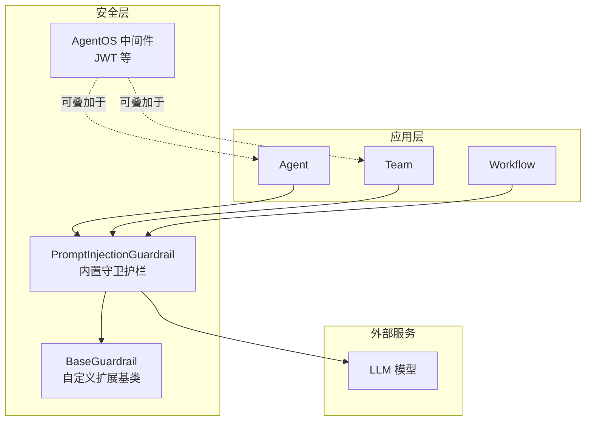
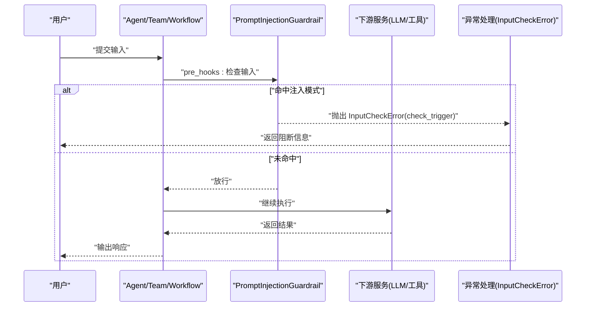
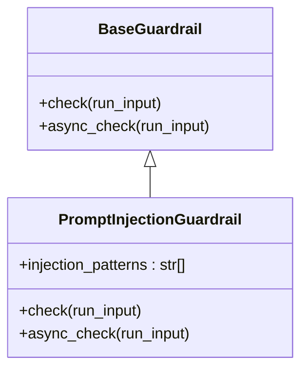
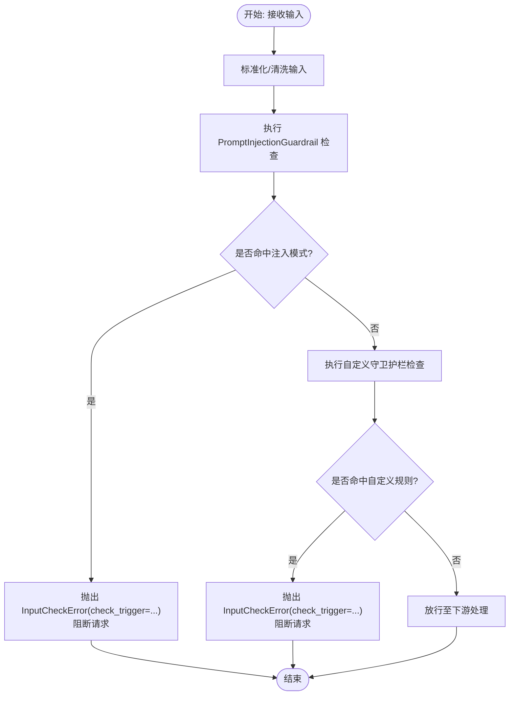
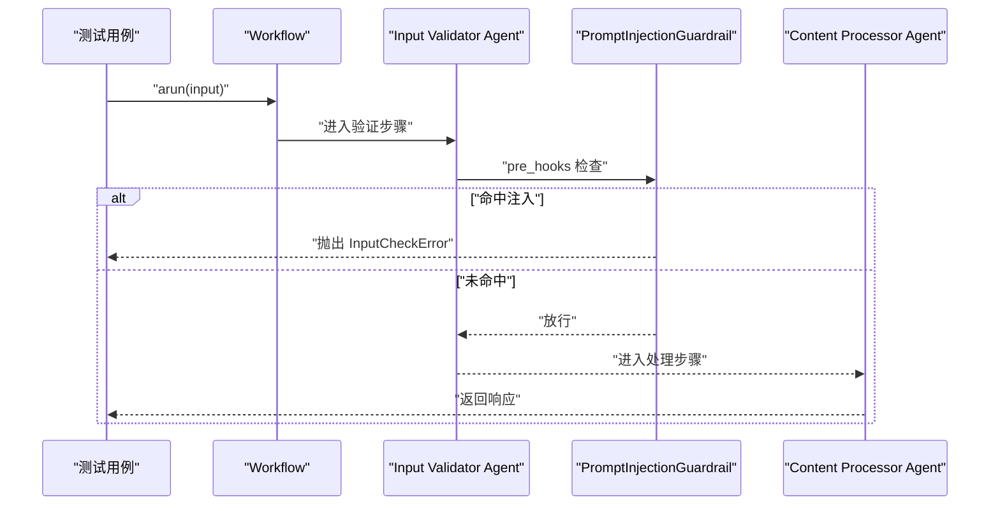
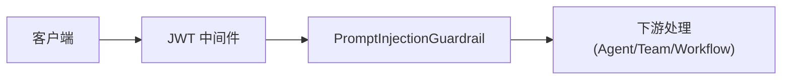
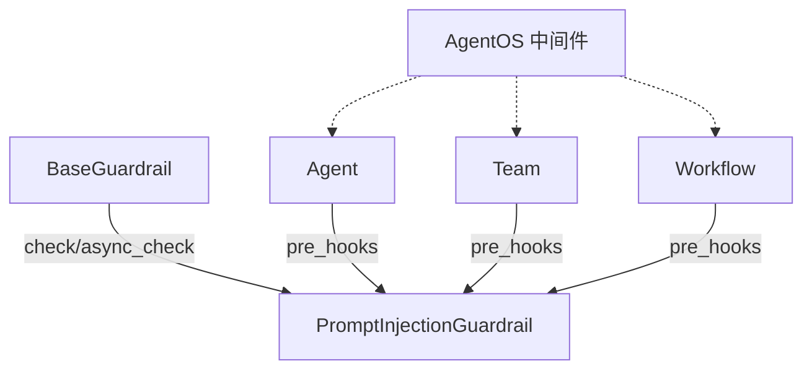

# 提示注入防护

<cite>
**本文引用的文件**
- [guardrails/included/prompt-injection.mdx](file://guardrails/included/prompt-injection.mdx)
- [reference/hooks/prompt-injection-guardrail.mdx](file://reference/hooks/prompt-injection-guardrail.mdx)
- [guardrails/overview.mdx](file://guardrails/overview.mdx)
- [reference/hooks/base-guardrail.mdx](file://reference/hooks/base-guardrail.mdx)
- [guardrails/usage/agent/prompt-injection.mdx](file://guardrails/usage/agent/prompt-injection.mdx)
- [guardrails/usage/team/prompt-injection.mdx](file://guardrails/usage/team/prompt-injection.mdx)
- [examples/workflows/advanced-concepts/guardrails/prompt-injection.mdx](file://examples/workflows/advanced-concepts/guardrails/prompt-injection.mdx)
- [examples/agents/guardrails/custom-guardrail.mdx](file://examples/agents/guardrails/custom-guardrail.mdx)
- [examples/agents/hooks/pre-hook-input.mdx](file://examples/agents/hooks/pre-hook-input.mdx)
- [examples/teams/hooks/pre-hook-input.mdx](file://examples/teams/hooks/pre-hook-input.mdx)
- [agent-os/middleware/overview.mdx](file://agent-os/middleware/overview.mdx)
- [agent-os/usage/middleware/jwt-cookies.mdx](file://agent-os/usage/middleware/jwt-cookies.mdx)
</cite>

## 目录
1. [简介](#简介)
2. [项目结构](#项目结构)
3. [核心组件](#核心组件)
4. [架构总览](#架构总览)
5. [详细组件分析](#详细组件分析)
6. [依赖关系分析](#依赖关系分析)
7. [性能考量](#性能考量)
8. [故障排查指南](#故障排查指南)
9. [结论](#结论)
10. [附录](#附录)

## 简介
本技术文档围绕提示注入（Prompt Injection）防护功能展开，系统阐述其工作原理、检测与阻断机制、攻击向量与模式识别、阈值与误报处理策略，并给出在代理（Agent）、团队（Team）及工作流中的集成方式与配置参数。文档同时说明与内容审核、输入验证等安全能力的协同作用，提供典型攻击示例与防护效果演示，并给出配置优化与性能调优建议。

## 项目结构
提示注入防护能力由“内置守卫护栏（Guardrails）”体系提供，核心包括：
- 内置守卫护栏：PromptInjectionGuardrail（提示注入）
- 守卫护栏基类：BaseGuardrail（自定义扩展）
- 使用示例：Agent/Team/Workflow 的集成与测试
- 中间件：AgentOS 层面的安全中间件（如 JWT）可与守卫护栏配合

图表来源
- [guardrails/included/prompt-injection.mdx:1-65](file://guardrails/included/prompt-injection.mdx#L1-L65)
- [guardrails/overview.mdx:23-49](file://guardrails/overview.mdx#L23-L49)
- [reference/hooks/base-guardrail.mdx:1-25](file://reference/hooks/base-guardrail.mdx#L1-L25)
- [agent-os/middleware/overview.mdx:14-39](file://agent-os/middleware/overview.mdx#L14-L39)

章节来源
- [guardrails/included/prompt-injection.mdx:1-65](file://guardrails/included/prompt-injection.mdx#L1-L65)
- [guardrails/overview.mdx:23-49](file://guardrails/overview.mdx#L23-L49)
- [agent-os/middleware/overview.mdx:14-39](file://agent-os/middleware/overview.mdx#L14-L39)

## 核心组件
- PromptInjectionGuardrail（提示注入守卫护栏）
  - 功能：在输入进入下游处理前，检测并阻断提示注入与越狱尝试
  - 默认注入模式列表：覆盖“忽略先前指令”“扮演角色”“开发者模式”“越狱/绕过限制”等高频词
  - 配置：可通过 injection_patterns 参数自定义模式列表
- BaseGuardrail（自定义守卫护栏基类）
  - 能力：提供同步/异步检查接口，便于扩展业务规则（如敏感词、主题域限制等）
- Agent/Team/Workflow 集成
  - 通过 pre_hooks 将守卫护栏挂载到运行管线，实现前置拦截
- AgentOS 中间件
  - JWT 等中间件可作为第一道防线，结合守卫护栏形成纵深防御

章节来源
- [guardrails/included/prompt-injection.mdx:11-64](file://guardrails/included/prompt-injection.mdx#L11-L64)
- [reference/hooks/prompt-injection-guardrail.mdx:1-32](file://reference/hooks/prompt-injection-guardrail.mdx#L1-L32)
- [reference/hooks/base-guardrail.mdx:1-25](file://reference/hooks/base-guardrail.mdx#L1-L25)
- [guardrails/overview.mdx:33-61](file://guardrails/overview.mdx#L33-L61)

## 架构总览
提示注入防护在调用链上的执行顺序如下：
- 请求进入 Agent/Team/Workflow
- 执行 pre_hooks（含 PromptInjectionGuardrail）
- 若未触发阻断，则进入下游逻辑（工具调用、LLM 推理等）
- 异常统一以 InputCheckError 抛出，携带 check_trigger 用于定位触发原因

图表来源
- [guardrails/usage/agent/prompt-injection.mdx:19-95](file://guardrails/usage/agent/prompt-injection.mdx#L19-L95)
- [guardrails/usage/team/prompt-injection.mdx:19-95](file://guardrails/usage/team/prompt-injection.mdx#L19-L95)
- [examples/workflows/advanced-concepts/guardrails/prompt-injection.mdx:85-141](file://examples/workflows/advanced-concepts/guardrails/prompt-injection.mdx#L85-L141)

章节来源
- [guardrails/usage/agent/prompt-injection.mdx:19-95](file://guardrails/usage/agent/prompt-injection.mdx#L19-L95)
- [guardrails/usage/team/prompt-injection.mdx:19-95](file://guardrails/usage/team/prompt-injection.mdx#L19-L95)
- [examples/workflows/advanced-concepts/guardrails/prompt-injection.mdx:85-141](file://examples/workflows/advanced-concepts/guardrails/prompt-injection.mdx#L85-L141)

## 详细组件分析

### 组件一：PromptInjectionGuardrail（提示注入守卫护栏）
- 工作原理
  - 基于关键词/短语匹配的启发式规则，识别常见注入与越狱表达
  - 支持自定义模式列表，便于适配业务场景与新变种
- 关键参数
  - injection_patterns: 注入模式列表（默认内置一组高危词）
- 典型注入模式（节选）
  - 忽略先前指令、忽略你的指令、你是一个新的、忘记上面所有内容、开发者模式、越狱、扮演角色、绕过限制、忽略防护、管理员覆盖、root 权限等
- 集成方式
  - 在 Agent/Team/Workflow 的 pre_hooks 中添加该守卫护栏实例
- 测试与演示
  - 包含多组测试用例（正常请求、基础注入、角色篡改、开发者越权、隐晦注入），验证阻断与放行行为

图表来源
- [reference/hooks/base-guardrail.mdx:1-25](file://reference/hooks/base-guardrail.mdx#L1-L25)
- [reference/hooks/prompt-injection-guardrail.mdx:7-9](file://reference/hooks/prompt-injection-guardrail.mdx#L7-L9)

章节来源
- [guardrails/included/prompt-injection.mdx:29-64](file://guardrails/included/prompt-injection.mdx#L29-L64)
- [reference/hooks/prompt-injection-guardrail.mdx:1-32](file://reference/hooks/prompt-injection-guardrail.mdx#L1-L32)
- [guardrails/usage/agent/prompt-injection.mdx:19-95](file://guardrails/usage/agent/prompt-injection.mdx#L19-L95)
- [guardrails/usage/team/prompt-injection.mdx:19-95](file://guardrails/usage/team/prompt-injection.mdx#L19-L95)
- [examples/workflows/advanced-concepts/guardrails/prompt-injection.mdx:89-141](file://examples/workflows/advanced-concepts/guardrails/prompt-injection.mdx#L89-L141)

### 组件二：BaseGuardrail（自定义守卫护栏基类）
- 能力边界
  - 提供同步与异步检查方法，便于在不同运行模式下生效
  - 通过抛出 InputCheckError 触发阻断，支持 check_trigger 标识触发类型
- 自定义示例
  - 敏感主题阻断（如禁止生成恶意软件、钓鱼模板、漏洞利用）
  - URL 过滤（阻断包含链接的输入）
- 与内置守卫护栏的关系
  - 可与 PromptInjectionGuardrail 并行部署，形成“关键词+业务规则”的双重防护

图表来源
- [reference/hooks/base-guardrail.mdx:8-25](file://reference/hooks/base-guardrail.mdx#L8-L25)
- [examples/agents/guardrails/custom-guardrail.mdx:21-35](file://examples/agents/guardrails/custom-guardrail.mdx#L21-L35)

章节来源
- [reference/hooks/base-guardrail.mdx:1-25](file://reference/hooks/base-guardrail.mdx#L1-L25)
- [examples/agents/guardrails/custom-guardrail.mdx:1-67](file://examples/agents/guardrails/custom-guardrail.mdx#L1-L67)

### 组件三：Agent/Team/Workflow 集成与测试
- 集成要点
  - 将 PromptInjectionGuardrail 实例加入 pre_hooks
  - 在 Agent/Team/Workflow 的 run/arun 调用前完成拦截
- 测试用例设计
  - 正常请求：应放行
  - 基础注入：应阻断
  - 角色篡改：应阻断
  - 开发者越权：应阻断
  - 隐晦注入：应阻断
- 结果判定
  - 正常请求：成功输出
  - 被阻断：捕获 InputCheckError，读取 message 与 check_trigger

图表来源
- [examples/workflows/advanced-concepts/guardrails/prompt-injection.mdx:27-79](file://examples/workflows/advanced-concepts/guardrails/prompt-injection.mdx#L27-L79)
- [examples/workflows/advanced-concepts/guardrails/prompt-injection.mdx:117-141](file://examples/workflows/advanced-concepts/guardrails/prompt-injection.mdx#L117-L141)

章节来源
- [guardrails/usage/agent/prompt-injection.mdx:19-95](file://guardrails/usage/agent/prompt-injection.mdx#L19-L95)
- [guardrails/usage/team/prompt-injection.mdx:19-95](file://guardrails/usage/team/prompt-injection.mdx#L19-L95)
- [examples/workflows/advanced-concepts/guardrails/prompt-injection.mdx:1-166](file://examples/workflows/advanced-concepts/guardrails/prompt-injection.mdx#L1-L166)

### 组件四：AgentOS 中间件与守卫护栏协同
- 中间件位置与顺序
  - 安全中间件（如 JWT）通常置于外层，先于守卫护栏执行
  - 守卫护栏位于 pre_hooks，负责输入合法性与注入风险拦截
- 最佳实践
  - 安全中间件负责身份与权限校验
  - 守卫护栏负责内容与注入风险拦截
  - 两者组合形成“认证+授权+内容安全”的三层防护

图表来源
- [agent-os/middleware/overview.mdx:14-39](file://agent-os/middleware/overview.mdx#L14-L39)
- [agent-os/middleware/overview.mdx:143-162](file://agent-os/middleware/overview.mdx#L143-L162)

章节来源
- [agent-os/middleware/overview.mdx:14-39](file://agent-os/middleware/overview.mdx#L14-L39)
- [agent-os/usage/middleware/jwt-cookies.mdx:219-234](file://agent-os/usage/middleware/jwt-cookies.mdx#L219-L234)

## 依赖关系分析
- 组件耦合
  - PromptInjectionGuardrail 依赖 BaseGuardrail 的检查接口
  - Agent/Team/Workflow 通过 pre_hooks 与守卫护栏解耦
  - AgentOS 中间件与守卫护栏在不同阶段发挥作用，无直接耦合
- 外部依赖
  - LLM 推理与工具调用在放行后进行
  - 异常处理统一为 InputCheckError，便于上层捕获与记录

图表来源
- [reference/hooks/base-guardrail.mdx:1-25](file://reference/hooks/base-guardrail.mdx#L1-L25)
- [guardrails/included/prompt-injection.mdx:11-27](file://guardrails/included/prompt-injection.mdx#L11-L27)
- [agent-os/middleware/overview.mdx:14-39](file://agent-os/middleware/overview.mdx#L14-L39)

章节来源
- [reference/hooks/base-guardrail.mdx:1-25](file://reference/hooks/base-guardrail.mdx#L1-L25)
- [guardrails/included/prompt-injection.mdx:11-27](file://guardrails/included/prompt-injection.mdx#L11-L27)
- [agent-os/middleware/overview.mdx:14-39](file://agent-os/middleware/overview.mdx#L14-L39)

## 性能考量
- 检测复杂度
  - 关键词匹配为线性扫描，时间复杂度近似 O(n_words_in_input)，通常开销极低
- 并发与异步
  - 守卫护栏支持同步与异步检查；在异步运行（arun）时自动选择 async_check
- 误报控制
  - 通过 injection_patterns 精准裁剪，避免过度敏感
  - 结合业务上下文（如领域术语）动态调整模式列表
- 缓存与预热
  - 对频繁出现的合法输入可考虑在上层做轻量缓存，减少重复检查成本

## 故障排查指南
- 常见问题
  - 正常请求被阻断：检查 injection_patterns 是否过于严格或误命中业务词汇
  - 注入请求未被阻断：确认守卫护栏已正确挂载到 pre_hooks，且未被其他中间件屏蔽
  - 异步运行仍阻断：确保使用 async_check 并在 arun 场景下触发
- 定位手段
  - 读取 InputCheckError 的 message 与 check_trigger，快速定位触发原因
  - 在测试用例中逐项验证各注入场景
- 修复建议
  - 调整模式列表，增加白名单排除误伤
  - 与内容审核/输入验证联动，形成更细粒度的过滤策略

章节来源
- [guardrails/usage/agent/prompt-injection.mdx:127-139](file://guardrails/usage/agent/prompt-injection.mdx#L127-L139)
- [guardrails/usage/team/prompt-injection.mdx:33-90](file://guardrails/usage/team/prompt-injection.mdx#L33-L90)
- [examples/workflows/advanced-concepts/guardrails/prompt-injection.mdx:117-141](file://examples/workflows/advanced-concepts/guardrails/prompt-injection.mdx#L117-L141)

## 结论
提示注入防护通过“关键词匹配 + 自定义规则 + 多层级集成”的方式，有效降低注入与越狱风险。结合 AgentOS 中间件与内容审核、输入验证等能力，可构建稳健的输入安全体系。建议在生产环境中持续迭代模式列表、完善误报治理，并结合监控与日志对阻断事件进行追踪与优化。

## 附录

### A. 配置参数与使用示例索引
- PromptInjectionGuardrail
  - 参数：injection_patterns（可选）
  - 示例：Agent/Team/Workflow 集成与测试
- BaseGuardrail
  - 方法：check、async_check
  - 示例：自定义主题阻断与 URL 过滤
- AgentOS 中间件
  - JWT 中间件与执行顺序建议

章节来源
- [reference/hooks/prompt-injection-guardrail.mdx:7-9](file://reference/hooks/prompt-injection-guardrail.mdx#L7-L9)
- [guardrails/usage/agent/prompt-injection.mdx:19-95](file://guardrails/usage/agent/prompt-injection.mdx#L19-L95)
- [guardrails/usage/team/prompt-injection.mdx:19-95](file://guardrails/usage/team/prompt-injection.mdx#L19-L95)
- [examples/agents/guardrails/custom-guardrail.mdx:21-35](file://examples/agents/guardrails/custom-guardrail.mdx#L21-L35)
- [reference/hooks/base-guardrail.mdx:8-25](file://reference/hooks/base-guardrail.mdx#L8-L25)
- [agent-os/middleware/overview.mdx:143-162](file://agent-os/middleware/overview.mdx#L143-L162)

### B. 攻击示例与防护效果对照
- 正常请求：放行
- 基础注入：阻断
- 角色篡改：阻断
- 开发者越权：阻断
- 隐晦注入：阻断

章节来源
- [guardrails/usage/agent/prompt-injection.mdx:33-90](file://guardrails/usage/agent/prompt-injection.mdx#L33-L90)
- [guardrails/usage/team/prompt-injection.mdx:33-90](file://guardrails/usage/team/prompt-injection.mdx#L33-L90)
- [examples/workflows/advanced-concepts/guardrails/prompt-injection.mdx:89-141](file://examples/workflows/advanced-concepts/guardrails/prompt-injection.mdx#L89-L141)