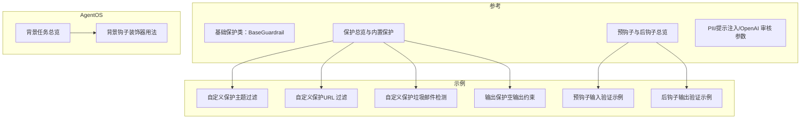
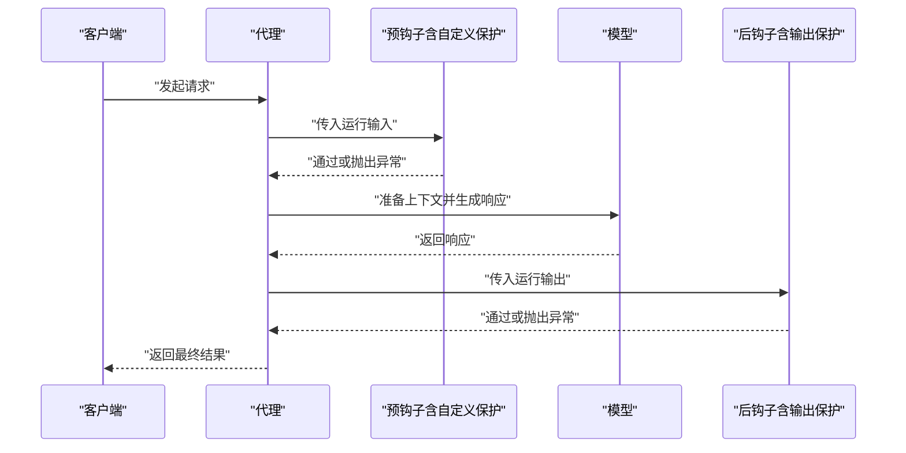
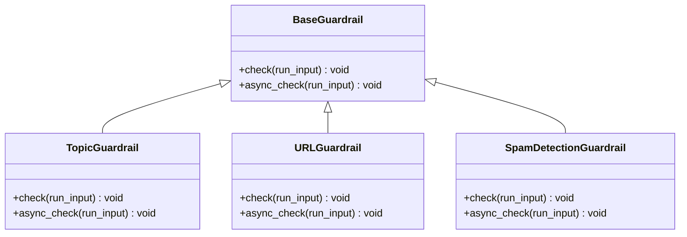
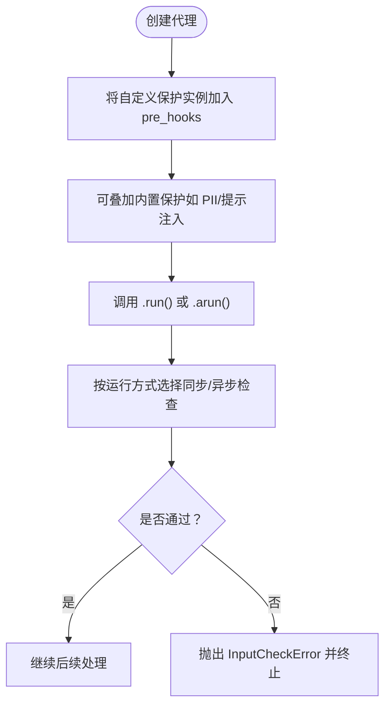
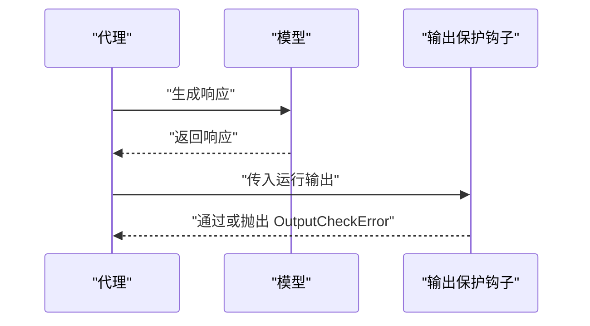
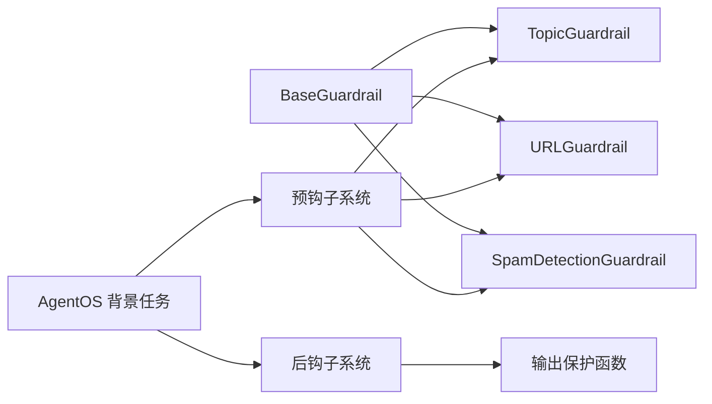

# 自定义保护开发

<cite>
**本文引用的文件**
- [基础保护类：BaseGuardrail](file://reference/hooks/base-guardrail.mdx)
- [保护总览与内置保护](file://guardrails/overview.mdx)
- [预钩子与后钩子总览](file://hooks/overview.mdx)
- [PII 检测保护参数](file://reference/hooks/pii-guardrail.mdx)
- [提示注入保护参数](file://reference/hooks/prompt-injection-guardrail.mdx)
- [OpenAI 内容审核保护参数](file://reference/hooks/openai-moderation-guardrail.mdx)
- [自定义保护示例（主题过滤）](file://examples/agents/guardrails/custom-guardrail.mdx)
- [自定义保护示例（URL 过滤）](file://guardrails/overview.mdx)
- [自定义保护示例（垃圾邮件检测）](file://examples/basics/agent-with-guardrails.mdx)
- [输出保护示例（空输出约束）](file://examples/agents/guardrails/output-guardrail.mdx)
- [Agent 预钩子输入验证示例](file://examples/agents/hooks/pre-hook-input.mdx)
- [Agent 后钩子输出验证示例](file://examples/agents/hooks/post-hook-output.mdx)
- [AgentOS 背景任务总览](file://agent-os/background-tasks/overview.mdx)
- [AgentOS 背景钩子装饰器用法](file://agent-os/usage/background-hooks-decorator.mdx)
</cite>

## 目录
1. [简介](#简介)
2. [项目结构](#项目结构)
3. [核心组件](#核心组件)
4. [架构总览](#架构总览)
5. [详细组件分析](#详细组件分析)
6. [依赖关系分析](#依赖关系分析)
7. [性能考量](#性能考量)
8. [故障排查指南](#故障排查指南)
9. [结论](#结论)
10. [附录](#附录)

## 简介
本指南面向需要为代理与团队系统构建“自定义保护”的开发者，围绕如何继承基础保护类 BaseGuardrail 来实现同步与异步检查逻辑，提供从设计原则、异常处理与错误报告策略，到注册与配置、集成到预钩子系统、调试与测试的完整开发流程。文档同时给出 URL 检测、恶意内容过滤、自定义合规检查等多场景示例，并对比异步与同步保护的实现差异与性能优化建议。

## 项目结构
与自定义保护相关的核心知识分布在以下区域：
- 参考：基础保护类、内置保护参数与使用说明
- 示例：自定义保护与输出保护的实际代码片段
- 钩子总览：预钩子/后钩子生命周期、参数与适用场景
- AgentOS：背景任务与钩子装饰器，用于非阻塞执行

**图表来源**
- [基础保护类：BaseGuardrail:1-25](file://reference/hooks/base-guardrail.mdx#L1-L25)
- [保护总览与内置保护:1-149](file://guardrails/overview.mdx#L1-L149)
- [预钩子与后钩子总览:1-217](file://hooks/overview.mdx#L1-L217)
- [Agent 预钩子输入验证示例:66-90](file://examples/agents/hooks/pre-hook-input.mdx#L66-L90)
- [Agent 后钩子输出验证示例:52-126](file://examples/agents/hooks/post-hook-output.mdx#L52-L126)
- [AgentOS 背景任务总览:1-41](file://agent-os/background-tasks/overview.mdx#L1-L41)
- [AgentOS 背景钩子装饰器用法:34-71](file://agent-os/usage/background-hooks-decorator.mdx#L34-L71)

**章节来源**
- [基础保护类：BaseGuardrail:1-25](file://reference/hooks/base-guardrail.mdx#L1-L25)
- [保护总览与内置保护:1-149](file://guardrails/overview.mdx#L1-L149)
- [预钩子与后钩子总览:1-217](file://hooks/overview.mdx#L1-L217)

## 核心组件
- 基础保护类 BaseGuardrail
  - 提供同步 check 与异步 async_check 两个入口，均接收运行输入对象作为参数，无返回值；当检测到不合规时抛出相应异常以阻止继续执行。
  - 框架会根据调用方式自动选择同步或异步版本：.run() 使用同步，.arun() 使用异步。
- 预钩子与后钩子
  - 预钩子在模型上下文准备前执行，适合输入安全与预处理；后钩子在响应生成后、返回前执行，适合输出校验与后处理。
  - 支持通过装饰器标记后台执行，但不适用于需要修改输入/输出的 Guardrails。
- 内置保护
  - PII 检测、提示注入防御、OpenAI 内容审核等，可直接作为预钩子使用，亦可作为自定义保护的参考实现。

**章节来源**
- [基础保护类：BaseGuardrail:8-25](file://reference/hooks/base-guardrail.mdx#L8-L25)
- [预钩子与后钩子总览:25-101](file://hooks/overview.mdx#L25-L101)
- [保护总览与内置保护:23-61](file://guardrails/overview.mdx#L23-L61)
- [PII 检测保护参数:1-15](file://reference/hooks/pii-guardrail.mdx#L1-L15)
- [提示注入保护参数:1-32](file://reference/hooks/prompt-injection-guardrail.mdx#L1-L32)
- [OpenAI 内容审核保护参数:1-17](file://reference/hooks/openai-moderation-guardrail.mdx#L1-L17)

## 架构总览
下图展示了自定义保护在代理运行生命周期中的位置与交互：

**图表来源**
- [预钩子与后钩子总览:25-101](file://hooks/overview.mdx#L25-L101)
- [输出保护示例（空输出约束）:21-28](file://examples/agents/guardrails/output-guardrail.mdx#L21-L28)

## 详细组件分析

### 组件一：自定义保护基类与实现要求
- 继承 BaseGuardrail 并实现：
  - 同步检查：check(run_input)
  - 异步检查：async_check(run_input)
- 输入对象通常包含用户输入内容字段，可在其中进行字符串匹配、正则、外部服务调用等判断。
- 当检测到违规时，抛出 InputCheckError 或 OutputCheckError，并设置 check_trigger 以标识触发类型。
- 框架会依据运行方式自动选择同步或异步版本。

**图表来源**
- [基础保护类：BaseGuardrail:8-25](file://reference/hooks/base-guardrail.mdx#L8-L25)
- [自定义保护示例（主题过滤）:21-34](file://examples/agents/guardrails/custom-guardrail.mdx#L21-L34)
- [自定义保护示例（URL 过滤）:73-96](file://guardrails/overview.mdx#L73-L96)
- [自定义保护示例（垃圾邮件检测）:47-81](file://examples/basics/agent-with-guardrails.mdx#L47-L81)

**章节来源**
- [基础保护类：BaseGuardrail:8-25](file://reference/hooks/base-guardrail.mdx#L8-L25)
- [自定义保护示例（主题过滤）:21-34](file://examples/agents/guardrails/custom-guardrail.mdx#L21-L34)
- [自定义保护示例（URL 过滤）:73-96](file://guardrails/overview.mdx#L73-L96)
- [自定义保护示例（垃圾邮件检测）:47-81](file://examples/basics/agent-with-guardrails.mdx#L47-L81)

### 组件二：注册与配置（预钩子）
- 将自定义保护实例加入 Agent 的 pre_hooks 列表即可生效。
- 可与其他内置保护（如 PII 检测、提示注入防御）组合使用，形成多层防护。
- 对于团队（Team），同样通过 pre_hooks 注册，输入对象为 TeamRunInput。

**图表来源**
- [保护总览与内置保护:31-47](file://guardrails/overview.mdx#L31-L47)
- [自定义保护示例（URL 过滤）:102-116](file://guardrails/overview.mdx#L102-L116)

**章节来源**
- [保护总览与内置保护:31-47](file://guardrails/overview.mdx#L31-L47)
- [自定义保护示例（URL 过滤）:102-116](file://guardrails/overview.mdx#L102-L116)

### 组件三：输出保护（后钩子）
- 输出保护通过后钩子实现，对响应内容进行长度、完整性、安全性等校验。
- 若不满足条件，抛出 OutputCheckError 并阻止返回。

**图表来源**
- [Agent 后钩子输出验证示例:52-126](file://examples/agents/hooks/post-hook-output.mdx#L52-L126)
- [输出保护示例（空输出约束）:21-28](file://examples/agents/guardrails/output-guardrail.mdx#L21-L28)

**章节来源**
- [Agent 后钩子输出验证示例:52-126](file://examples/agents/hooks/post-hook-output.mdx#L52-L126)
- [输出保护示例（空输出约束）:21-28](file://examples/agents/guardrails/output-guardrail.mdx#L21-L28)

### 组件四：内置保护参数与行为参考
- PII 检测：支持掩码或拦截、可启用/禁用不同敏感信息类型、支持自定义模式。
- 提示注入：默认内置常见注入模式列表，可自定义扩展。
- OpenAI 审核：可指定审核模型、分类阈值、API Key 等。

**章节来源**
- [PII 检测保护参数:5-15](file://reference/hooks/pii-guardrail.mdx#L5-L15)
- [提示注入保护参数:5-32](file://reference/hooks/prompt-injection-guardrail.mdx#L5-L32)
- [OpenAI 内容审核保护参数:5-17](file://reference/hooks/openai-moderation-guardrail.mdx#L5-L17)

### 组件五：异步与同步保护的实现差异
- 同步：check 直接执行，适合轻量逻辑或已具备同步能力的外部调用。
- 异步：async_check 可复用同步逻辑，或直接进行异步 I/O；框架在 .arun() 场景自动调用。
- 性能建议：将外部网络/数据库调用改为异步；避免在同步路径中做重计算或阻塞操作。

**章节来源**
- [基础保护类：BaseGuardrail:8-25](file://reference/hooks/base-guardrail.mdx#L8-L25)
- [自定义保护示例（主题过滤）:33-34](file://examples/agents/guardrails/custom-guardrail.mdx#L33-L34)
- [自定义保护示例（URL 过滤）:87-96](file://guardrails/overview.mdx#L87-L96)

## 依赖关系分析
- 自定义保护依赖 BaseGuardrail 接口约定（check/async_check）。
- 预钩子系统负责在运行前注入保护逻辑；后钩子系统负责在运行后注入输出校验。
- AgentOS 的背景任务装饰器可用于非关键性钩子的异步执行，但不适用于需要修改输入/输出的 Guardrails。

**图表来源**
- [基础保护类：BaseGuardrail:8-25](file://reference/hooks/base-guardrail.mdx#L8-L25)
- [自定义保护示例（主题过滤）:21-34](file://examples/agents/guardrails/custom-guardrail.mdx#L21-L34)
- [自定义保护示例（URL 过滤）:73-96](file://guardrails/overview.mdx#L73-L96)
- [自定义保护示例（垃圾邮件检测）:47-81](file://examples/basics/agent-with-guardrails.mdx#L47-L81)
- [输出保护示例（空输出约束）:21-28](file://examples/agents/guardrails/output-guardrail.mdx#L21-L28)
- [AgentOS 背景任务总览:1-41](file://agent-os/background-tasks/overview.mdx#L1-L41)

**章节来源**
- [AgentOS 背景任务总览:1-41](file://agent-os/background-tasks/overview.mdx#L1-L41)
- [AgentOS 背景钩子装饰器用法:34-71](file://agent-os/usage/background-hooks-decorator.mdx#L34-L71)

## 性能考量
- 优先使用异步实现（async_check）执行外部 I/O，减少阻塞。
- 在同步路径中避免复杂计算与长耗时操作；必要时拆分为后台任务。
- 合理设置触发阈值与规则粒度，降低误报与漏报带来的重复尝试成本。
- 对高频规则采用缓存与预热策略，结合异步批量处理提升吞吐。

## 故障排查指南
- 异常类型与触发原因
  - InputCheckError：输入被拦截，常见于 PII、提示注入、URL、主题过滤等。
  - OutputCheckError：输出被拒绝，常见于长度过短、安全性不足等。
- 触发类型（check_trigger）
  - 可使用 INPUT_NOT_ALLOWED、OFF_TOPIC、OUTPUT_NOT_ALLOWED 等标识，便于日志与告警区分。
- 调试建议
  - 在本地运行示例，逐步替换规则与阈值，观察触发点。
  - 使用预钩子/后钩子示例中的验证逻辑，先以简单规则验证通路，再逐步增强。
  - 对异步保护，确认运行方式（.run/.arun）与装饰器（后台执行）是否符合预期。

**章节来源**
- [Agent 预钩子输入验证示例:66-90](file://examples/agents/hooks/pre-hook-input.mdx#L66-L90)
- [Agent 后钩子输出验证示例:52-126](file://examples/agents/hooks/post-hook-output.mdx#L52-L126)
- [输出保护示例（空输出约束）:21-28](file://examples/agents/guardrails/output-guardrail.mdx#L21-L28)

## 结论
通过继承 BaseGuardrail 并实现同步/异步检查方法，开发者可以快速构建覆盖输入与输出的多层保护体系。配合预钩子/后钩子系统与内置保护，既能保证安全合规，又能灵活扩展业务规则。在生产环境中，建议优先采用异步实现、合理配置触发阈值，并结合后台任务优化非关键性处理，以获得更优的吞吐与稳定性。

## 附录

### 开发示例清单与要点
- URL 检测保护
  - 关键点：正则匹配输入内容中的 URL 模式，触发 INPUT_NOT_ALLOWED。
  - 参考：自定义保护示例（URL 过滤）
- 恶意内容过滤（主题限制）
  - 关键点：关键词匹配（如危险指令），触发 INPUT_NOT_ALLOWED。
  - 参考：自定义保护示例（主题过滤）
- 自定义合规检查（垃圾邮件检测）
  - 关键点：统计大写字母比例与感叹号数量，触发 INPUT_NOT_ALLOWED。
  - 参考：自定义保护示例（垃圾邮件检测）
- 输出保护（空输出约束）
  - 关键点：校验输出长度，触发 OUTPUT_NOT_ALLOWED。
  - 参考：输出保护示例（空输出约束）

**章节来源**
- [自定义保护示例（URL 过滤）:73-96](file://guardrails/overview.mdx#L73-L96)
- [自定义保护示例（主题过滤）:21-34](file://examples/agents/guardrails/custom-guardrail.mdx#L21-L34)
- [自定义保护示例（垃圾邮件检测）:47-81](file://examples/basics/agent-with-guardrails.mdx#L47-L81)
- [输出保护示例（空输出约束）:21-28](file://examples/agents/guardrails/output-guardrail.mdx#L21-L28)