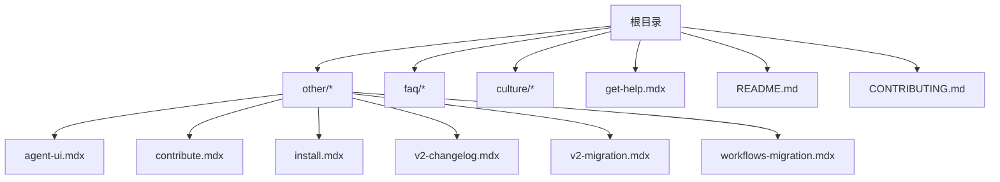
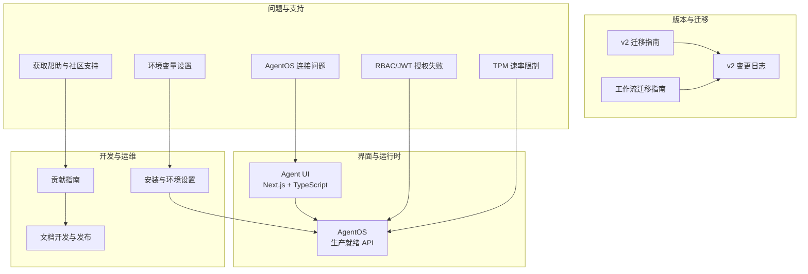
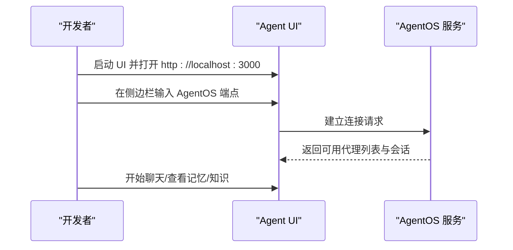
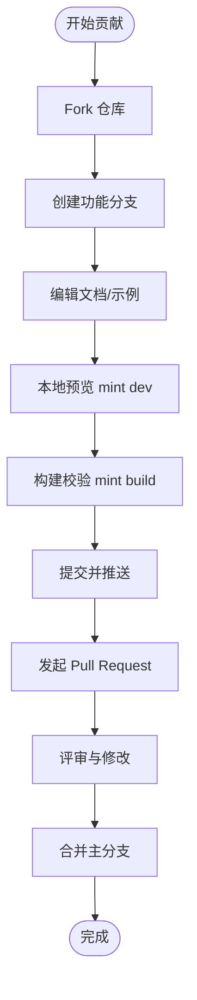
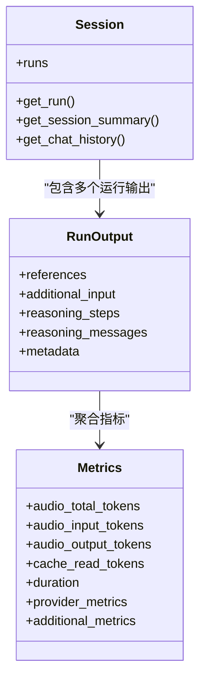
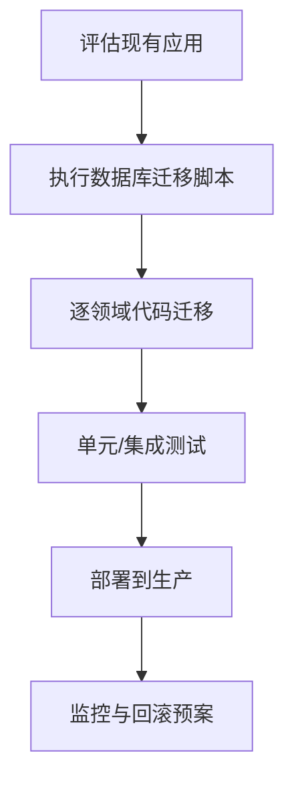
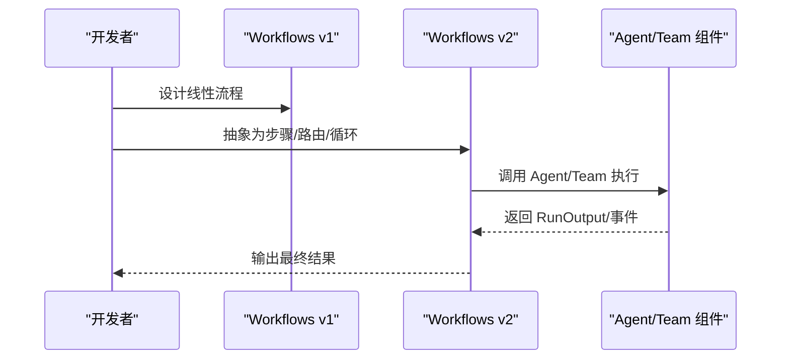
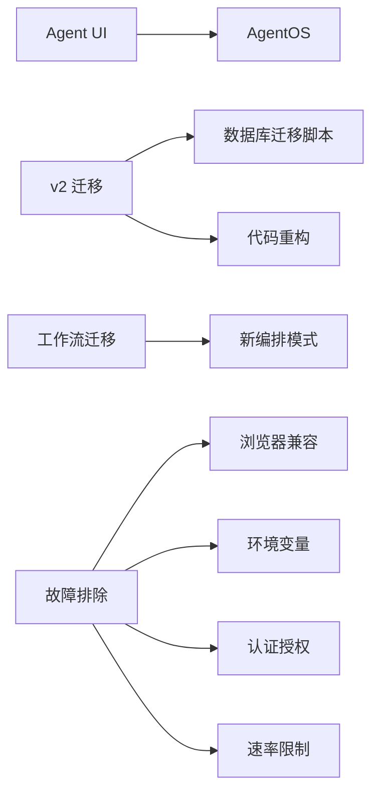

# 其他资源

<cite>
**本文引用的文件**
- [Agent UI 使用与配置](file://other/agent-ui.mdx)
- [贡献指南](file://other/contribute.mdx)
- [安装与环境设置](file://other/install.mdx)
- [Agno v2 变更日志](file://other/v2-changelog.mdx)
- [Agno v2 迁移指南](file://other/v2-migration.mdx)
- [工作流迁移指南（Workflows 2.0）](file://other/workflows-migration.mdx)
- [AgentOS 连接问题 FAQ](file://faq/agentos-connection.mdx)
- [环境变量设置 FAQ](file://faq/environment-variables.mdx)
- [RBAC/JWT 授权失败 FAQ](file://faq/rbac-auth-failed.mdx)
- [TPM 速率限制 FAQ](file://faq/tpm-issues.mdx)
- [获取帮助与社区支持](file://get-help.mdx)
- [贡献者指南（CONTRIBUTING.md）](file://CONTRIBUTING.md)
- [文化（Culture）概览](file://culture/overview.mdx)
- [文档站点快速开始与开发](file://README.md)
</cite>

## 目录
1. [简介](#简介)
2. [项目结构](#项目结构)
3. [核心组件](#核心组件)
4. [架构总览](#架构总览)
5. [详细组件分析](#详细组件分析)
6. [依赖关系分析](#依赖关系分析)
7. [性能考量](#性能考量)
8. [故障排除指南](#故障排除指南)
9. [结论](#结论)
10. [附录](#附录)

## 简介
本“其他资源”文档面向需要快速上手与深入理解 Agno 生态的开发者与运营人员，围绕以下目标展开：  
- 详尽介绍 Agent UI 的功能、界面导航、配置与自定义选项，并提供本地联调与连接 AgentOS 的实操指引。  
- 解释贡献指南的流程、文档编写规范与社区参与方式，帮助贡献者高效协作。  
- 提供安装与环境配置的完整步骤，覆盖系统要求、依赖安装与环境变量设置。  
- 汇总 Agno v2 的变更日志要点，包括新功能、重构与已知问题，便于升级决策与风险评估。  
- 给出 v2 升级迁移路径与注意事项，降低迁移成本与不确定性。  
- 提供工作流迁移指南，涵盖工作流格式变化、组件演进与迁移策略。  
- 汇总常见问题与故障排除方案，覆盖浏览器兼容性、认证授权、速率限制等典型场景。  
- 覆盖许可证信息、法律声明与社区准则等合规相关内容。

## 项目结构
该仓库以文档为主，采用分层组织方式，便于按主题检索与维护。与“其他资源”直接相关的模块包括：
- other：核心参考页（Agent UI、贡献、安装、v2 变更与迁移、工作流迁移）
- faq：常见问题与故障排除
- culture：文化（Culture）特性说明
- get-help：社区支持与联系方式
- README/CONTRIBUTING：开发与贡献流程说明

**图表来源**
- [Agent UI 使用与配置](file://other/agent-ui.mdx)
- [贡献指南](file://other/contribute.mdx)
- [安装与环境设置](file://other/install.mdx)
- [Agno v2 变更日志](file://other/v2-changelog.mdx)
- [Agno v2 迁移指南](file://other/v2-migration.mdx)
- [工作流迁移指南（Workflows 2.0）](file://other/workflows-migration.mdx)
- [AgentOS 连接问题 FAQ](file://faq/agentos-connection.mdx)
- [环境变量设置 FAQ](file://faq/environment-variables.mdx)
- [RBAC/JWT 授权失败 FAQ](file://faq/rbac-auth-failed.mdx)
- [TPM 速率限制 FAQ](file://faq/tpm-issues.mdx)
- [获取帮助与社区支持](file://get-help.mdx)
- [贡献者指南（CONTRIBUTING.md）](file://CONTRIBUTING.md)
- [文化（Culture）概览](file://culture/overview.mdx)
- [文档站点快速开始与开发](file://README.md)

**章节来源**
- [Agent UI 使用与配置](file://other/agent-ui.mdx)
- [贡献指南](file://other/contribute.mdx)
- [安装与环境设置](file://other/install.mdx)
- [Agno v2 变更日志](file://other/v2-changelog.mdx)
- [Agno v2 迁移指南](file://other/v2-migration.mdx)
- [工作流迁移指南（Workflows 2.0）](file://other/workflows-migration.mdx)
- [AgentOS 连接问题 FAQ](file://faq/agentos-connection.mdx)
- [环境变量设置 FAQ](file://faq/environment-variables.mdx)
- [RBAC/JWT 授权失败 FAQ](file://faq/rbac-auth-failed.mdx)
- [TPM 速率限制 FAQ](file://faq/tpm-issues.mdx)
- [获取帮助与社区支持](file://get-help.mdx)
- [贡献者指南（CONTRIBUTING.md）](file://CONTRIBUTING.md)
- [文化（Culture）概览](file://culture/overview.mdx)
- [文档站点快速开始与开发](file://README.md)

## 核心组件
- Agent UI：开源的 AgentOS 图形界面，支持聊天、查看记忆与知识等；可本地运行并通过端点连接 AgentOS 后端。
- 贡献体系：遵循 Fork+PR 工作流，提供分支命名、提交规范与本地构建验证流程。
- 安装与环境：推荐使用 Python 虚拟环境安装 agno，提供升级与依赖更新建议。
- v2 变更与迁移：涵盖状态机、存储、知识、工具、媒体、日志、Agent/Team/Workflow 类等重大调整及迁移步骤。
- 工作流迁移：Workflows 2.0 引入多模式编排、条件/并行/循环等能力，提供从 v1 到 v2 的迁移策略。
- 故障排除：覆盖浏览器连接、环境变量、RBAC/JWT 授权、速率限制等常见问题。
- 社区与支持：提供讨论区、企业支持、分享渠道与开发者资源链接。

**章节来源**
- [Agent UI 使用与配置](file://other/agent-ui.mdx)
- [贡献指南](file://other/contribute.mdx)
- [安装与环境设置](file://other/install.mdx)
- [Agno v2 变更日志](file://other/v2-changelog.mdx)
- [Agno v2 迁移指南](file://other/v2-migration.mdx)
- [工作流迁移指南（Workflows 2.0）](file://other/workflows-migration.mdx)
- [AgentOS 连接问题 FAQ](file://faq/agentos-connection.mdx)
- [环境变量设置 FAQ](file://faq/environment-variables.mdx)
- [RBAC/JWT 授权失败 FAQ](file://faq/rbac-auth-failed.mdx)
- [TPM 速率限制 FAQ](file://faq/tpm-issues.mdx)
- [获取帮助与社区支持](file://get-help.mdx)

## 架构总览
下图展示“其他资源”相关模块之间的关系与交互：

**图表来源**
- [Agent UI 使用与配置](file://other/agent-ui.mdx)
- [Agno v2 变更日志](file://other/v2-changelog.mdx)
- [Agno v2 迁移指南](file://other/v2-migration.mdx)
- [工作流迁移指南（Workflows 2.0）](file://other/workflows-migration.mdx)
- [AgentOS 连接问题 FAQ](file://faq/agentos-connection.mdx)
- [环境变量设置 FAQ](file://faq/environment-variables.mdx)
- [RBAC/JWT 授权失败 FAQ](file://faq/rbac-auth-failed.mdx)
- [TPM 速率限制 FAQ](file://faq/tpm-issues.mdx)
- [获取帮助与社区支持](file://get-help.mdx)
- [安装与环境设置](file://other/install.mdx)
- [贡献指南](file://other/contribute.mdx)
- [文档站点快速开始与开发](file://README.md)

## 详细组件分析

### Agent UI 使用与配置
- 功能概述：提供与 AgentOS 交互的图形界面，支持聊天、查看记忆与知识等。
- 快速开始：提供脚手架命令与手动克隆两种方式启动 UI。
- 连接 AgentOS：需先本地或云端运行 AgentOS 服务，再在 UI 中配置端点进行连接。
- 实操步骤：包含虚拟环境搭建、依赖安装、模型密钥导出与服务启动的分步指引。
- 视频演示：提供 UI 操作演示视频，便于快速上手。

**图表来源**
- [Agent UI 使用与配置](file://other/agent-ui.mdx)

**章节来源**
- [Agent UI 使用与配置](file://other/agent-ui.mdx)

### 贡献指南与社区参与
- 流程：Fork 仓库 → 新建分支 → 编写内容/修复 → 提交 PR → 验证与评审。
- 分支命名与标题规范：遵循约定式提交类型（如 docs:, fix:, style: 等）。
- 文档结构：介绍各目录职责与新增页面流程，强调 MDX 格式与示例规范。
- 本地测试：使用 Mintlify CLI 预览与构建，确保无断链与格式错误。
- 社区支持：提供讨论区、企业支持预约与分享渠道链接。

**图表来源**
- [贡献指南](file://other/contribute.mdx)
- [贡献者指南（CONTRIBUTING.md）](file://CONTRIBUTING.md)

**章节来源**
- [贡献指南](file://other/contribute.mdx)
- [贡献者指南（CONTRIBUTING.md）](file://CONTRIBUTING.md)

### 安装与环境设置
- 推荐方式：在 Python 虚拟环境中通过 pip 安装 agno。
- 升级建议：使用 --no-cache-dir 避免缓存干扰。
- 常见问题：若安装失败，优先尝试更新 pip。

**章节来源**
- [安装与环境设置](file://other/install.mdx)

### Agno v2 变更日志要点
- 通用变更：仓库结构调整、AgentOS 引入、应用与接口统一、Cookbook 重构。
- 会话与运行状态：Agent/Team/Workflow 全面无状态化，事件与输出模型重命名，新增自定义事件支持。
- 存储与内存：统一为“DB”，移除 storage/memory 参数，类名迁移，表结构与方法更新。
- 知识：统一为 Knowledge，支持异步插入与向量删除，导入位置迁移。
- 工具与媒体：工具参数标准化，新增媒体参数，统一媒体类与方法。
- 日志：新增自定义日志器支持。
- Agent/Team/Workflow：大量参数与方法重命名，新增上下文注入、依赖管理、元数据与调试模式等。

**图表来源**
- [Agno v2 变更日志](file://other/v2-changelog.mdx)

**章节来源**
- [Agno v2 变更日志](file://other/v2-changelog.mdx)

### Agno v2 迁移指南
- 安装与升级：pip 升级至最新版本；数据库迁移脚本支持 PostgreSQL/MySQL/SQLite/MongoDB。
- 代码迁移：逐领域（Agent/Team、存储、内存、知识、指标、团队、工作流、应用与接口）给出前后对比与迁移步骤。
- 应用与接口：旧应用系统被统一到 AgentOS 接口，需更新导入与服务方式。
- 工作流迁移：强烈建议参考 Workflows 2.0 迁移指南，引入并行、条件、循环等新模式。

**图表来源**
- [Agno v2 迁移指南](file://other/v2-migration.mdx)

**章节来源**
- [Agno v2 迁移指南](file://other/v2-migration.mdx)

### 工作流迁移指南（Workflows 2.0）
- 核心差异：从线性到多模式（并行/条件/循环），从 Agent 为中心到混合组件，智能路由与内置循环。
- 迁移步骤：识别并行机会、转换条件逻辑、提取函数为步骤、启用事件流、共享状态。
- 示例：博客生成器工作流对比 v1 与 v2 的实现思路与代码结构差异。

**图表来源**
- [工作流迁移指南（Workflows 2.0）](file://other/workflows-migration.mdx)

**章节来源**
- [工作流迁移指南（Workflows 2.0）](file://other/workflows-migration.mdx)

### 文化（Culture）特性
- 定位：不同于 Memory 的通用原则与最佳实践，Culture 使智能体学习并共享跨交互的知识。
- 三种管理模式：自动文化、代理文化（Agentic Culture）、手动管理。
- 数据模型：包含名称、内容、摘要、分类、备注、元数据、输入、时间戳、关联实体等字段。
- 最佳实践：先手动播种核心标准，再在生产中启用自动更新，定期回顾与精炼。

**章节来源**
- [文化（Culture）概览](file://culture/overview.mdx)

## 依赖关系分析
- Agent UI 依赖 AgentOS 提供的后端 API 与会话/记忆/知识等能力。
- v2 迁移依赖数据库迁移脚本与代码重构，涉及存储、知识、工具、媒体、日志等多个子系统。
- 工作流迁移依赖新的编排模式与组件生态（并行、条件、循环）。
- 故障排除依赖浏览器兼容性、环境变量、认证授权与速率限制策略。

**图表来源**
- [Agent UI 使用与配置](file://other/agent-ui.mdx)
- [Agno v2 迁移指南](file://other/v2-migration.mdx)
- [工作流迁移指南（Workflows 2.0）](file://other/workflows-migration.mdx)
- [AgentOS 连接问题 FAQ](file://faq/agentos-connection.mdx)
- [环境变量设置 FAQ](file://faq/environment-variables.mdx)
- [RBAC/JWT 授权失败 FAQ](file://faq/rbac-auth-failed.mdx)
- [TPM 速率限制 FAQ](file://faq/tpm-issues.mdx)

**章节来源**
- [Agent UI 使用与配置](file://other/agent-ui.mdx)
- [Agno v2 迁移指南](file://other/v2-migration.mdx)
- [工作流迁移指南（Workflows 2.0）](file://other/workflows-migration.mdx)
- [AgentOS 连接问题 FAQ](file://faq/agentos-connection.mdx)
- [环境变量设置 FAQ](file://faq/environment-variables.mdx)
- [RBAC/JWT 授权失败 FAQ](file://faq/rbac-auth-failed.mdx)
- [TPM 速率限制 FAQ](file://faq/tpm-issues.mdx)

## 性能考量
- v2 引入知识库异步插入与媒体统一处理，显著提升知识入库与多模态处理性能。
- 无状态化设计减少运行时上下文开销，适合大规模并发与分布式部署。
- 工作流 2.0 支持并行与循环，优化长任务与复杂编排的吞吐与延迟。

[本节为通用指导，不直接分析具体文件]

## 故障排除指南
- AgentOS 连接问题：不同浏览器对 localhost 的安全策略不同，建议使用 Chrome/Edge；Brave 可临时关闭屏蔽；也可通过 ngrok 或 Cloudflare Tunnel 暴露本地端口。
- 环境变量：macOS/Windows 下分别提供临时与永久设置方法，注意生效范围与重启需求。
- RBAC/JWT 授权失败：根据 AgentOS 版本选择关闭授权或切换到 JWT 验证，确保密钥配置正确。
- TPM 速率限制：对 OpenAI 等平台可启用指数退避与重试间隔，缓解限流影响。

**章节来源**
- [AgentOS 连接问题 FAQ](file://faq/agentos-connection.mdx)
- [环境变量设置 FAQ](file://faq/environment-variables.mdx)
- [RBAC/JWT 授权失败 FAQ](file://faq/rbac-auth-failed.mdx)
- [TPM 速率限制 FAQ](file://faq/tpm-issues.mdx)

## 结论
“其他资源”文档为使用者与贡献者提供了从界面使用、安装配置、版本迁移到故障排除与社区支持的全链路参考。建议在升级前先通读 v2 变更日志与迁移指南，结合工作流迁移策略进行分阶段实施；日常运维中可借助 FAQ 快速定位问题并采取相应措施。

[本节为总结性内容，不直接分析具体文件]

## 附录
- 获取帮助与社区支持：提供 GitHub Discussions、Discourse、Discord、企业支持预约与分享渠道。
- 文档开发与发布：使用 Mintlify CLI 本地预览与构建，确保质量后再提交 PR。
- 许可证与法律声明：请参阅项目根目录下的 LICENSE 文件与法律声明（如适用）。

**章节来源**
- [获取帮助与社区支持](file://get-help.mdx)
- [文档站点快速开始与开发](file://README.md)